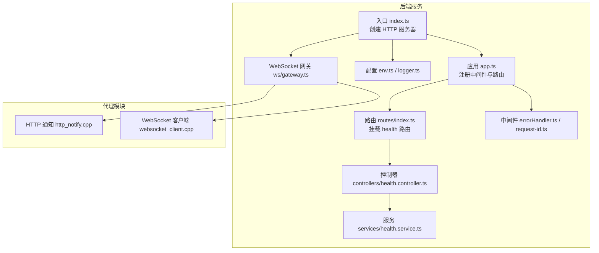
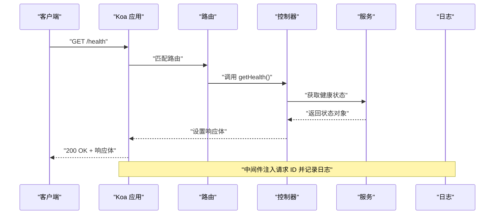
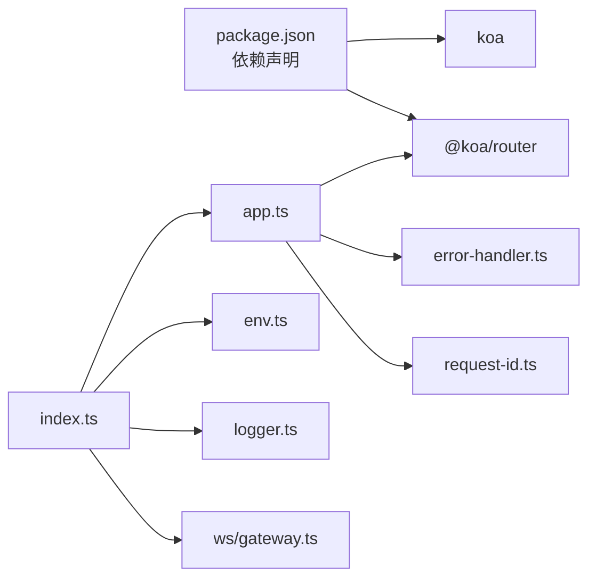

# API 参考文档

<cite>
**本文档引用的文件**
- [app.ts](file://project/server/src/app.ts)
- [index.ts](file://project/server/src/index.ts)
- [routes/index.ts](file://project/server/src/routes/index.ts)
- [routes/health.ts](file://project/server/src/routes/health.ts)
- [controllers/health.controller.ts](file://project/server/src/controllers/health.controller.ts)
- [services/health.service.ts](file://project/server/src/services/health.service.ts)
- [middlewares/error-handler.ts](file://project/server/src/middlewares/error-handler.ts)
- [middlewares/request-id.ts](file://project/server/src/middlewares/request-id.ts)
- [config/env.ts](file://project/server/src/config/env.ts)
- [config/logger.ts](file://project/server/src/config/logger.ts)
- [ws/gateway.ts](file://project/server/src/ws/gateway.ts)
- [package.json](file://project/server/package.json)
- [websocket_client.cpp](file://project/agent/src/modules/external_access/websocket/websocket_client.cpp)
- [http_notify.cpp](file://project/agent/src/modules/external_access/http/http_notify.cpp)
</cite>

## 目录
1. [简介](#简介)
2. [项目结构](#项目结构)
3. [核心组件](#核心组件)
4. [架构总览](#架构总览)
5. [详细组件分析](#详细组件分析)
6. [依赖分析](#依赖分析)
7. [性能考虑](#性能考虑)
8. [故障排除指南](#故障排除指南)
9. [结论](#结论)
10. [附录](#附录)

## 简介
本文件为 Pi-Guard 系统的 API 参考文档，覆盖后端服务的 HTTP REST API 与代理侧的外部访问能力（HTTP 通知与 WebSocket 客户端）。当前后端服务仅暴露一个健康检查端点；代理侧包含 HTTP 通知与 WebSocket 客户端模块，用于向外部系统推送事件或建立实时连接。本文档提供端点定义、请求/响应模式、错误处理策略、安全与版本信息，并给出常见用例与性能优化建议。

## 项目结构
后端服务基于 Koa + TypeScript，采用模块化路由组织方式；代理侧以 C++ 实现外部访问模块，包含 HTTP 通知与 WebSocket 客户端。

**图表来源**
- [index.ts:1-15](file://project/server/src/index.ts#L1-L15)
- [app.ts:1-14](file://project/server/src/app.ts#L1-L14)
- [routes/index.ts:1-9](file://project/server/src/routes/index.ts#L1-L9)
- [routes/health.ts:1-9](file://project/server/src/routes/health.ts#L1-L9)
- [controllers/health.controller.ts:1-7](file://project/server/src/controllers/health.controller.ts#L1-L7)
- [services/health.service.ts:1-14](file://project/server/src/services/health.service.ts#L1-L14)
- [middlewares/error-handler.ts:1-18](file://project/server/src/middlewares/error-handler.ts#L1-L18)
- [middlewares/request-id.ts:1-11](file://project/server/src/middlewares/request-id.ts#L1-L11)
- [config/env.ts:1-12](file://project/server/src/config/env.ts#L1-L12)
- [config/logger.ts:1-18](file://project/server/src/config/logger.ts#L1-L18)
- [ws/gateway.ts:1-8](file://project/server/src/ws/gateway.ts#L1-L8)
- [http_notify.cpp:1-21](file://project/agent/src/modules/external_access/http/http_notify.cpp#L1-L21)
- [websocket_client.cpp:1-21](file://project/agent/src/modules/external_access/websocket/websocket_client.cpp#L1-L21)

**章节来源**
- [index.ts:1-15](file://project/server/src/index.ts#L1-L15)
- [app.ts:1-14](file://project/server/src/app.ts#L1-L14)
- [routes/index.ts:1-9](file://project/server/src/routes/index.ts#L1-L9)

## 核心组件
- 应用入口：创建 HTTP 服务器，加载环境变量，初始化 WebSocket 网关并监听端口。
- 路由系统：使用 @koa/router 组织路由，当前挂载健康检查路由。
- 控制器与服务：控制器调用服务层返回健康状态数据。
- 中间件：统一注入请求 ID 并捕获异常，输出结构化日志。
- 配置与日志：从环境变量读取运行参数，提供基础日志接口。
- WebSocket 网关：预留扩展点，当前仅记录初始化信息。
- 代理模块：HTTP 通知与 WebSocket 客户端模块，负责外部集成。

**章节来源**
- [controllers/health.controller.ts:1-7](file://project/server/src/controllers/health.controller.ts#L1-L7)
- [services/health.service.ts:1-14](file://project/server/src/services/health.service.ts#L1-L14)
- [middlewares/request-id.ts:1-11](file://project/server/src/middlewares/request-id.ts#L1-L11)
- [middlewares/error-handler.ts:1-18](file://project/server/src/middlewares/error-handler.ts#L1-L18)
- [config/env.ts:1-12](file://project/server/src/config/env.ts#L1-L12)
- [config/logger.ts:1-18](file://project/server/src/config/logger.ts#L1-L18)
- [ws/gateway.ts:1-8](file://project/server/src/ws/gateway.ts#L1-L8)
- [http_notify.cpp:1-21](file://project/agent/src/modules/external_access/http/http_notify.cpp#L1-L21)
- [websocket_client.cpp:1-21](file://project/agent/src/modules/external_access/websocket/websocket_client.cpp#L1-L21)

## 架构总览
后端服务通过 Koa 提供 HTTP 接口，当前仅暴露健康检查端点；代理侧通过 HTTP 通知与 WebSocket 客户端与外部系统对接。WebSocket 网关预留扩展点，便于后续接入实时通信。

**图表来源**
- [routes/health.ts:1-9](file://project/server/src/routes/health.ts#L1-L9)
- [controllers/health.controller.ts:1-7](file://project/server/src/controllers/health.controller.ts#L1-L7)
- [services/health.service.ts:1-14](file://project/server/src/services/health.service.ts#L1-L14)
- [middlewares/request-id.ts:1-11](file://project/server/src/middlewares/request-id.ts#L1-L11)
- [middlewares/error-handler.ts:1-18](file://project/server/src/middlewares/error-handler.ts#L1-L18)
- [config/logger.ts:1-18](file://project/server/src/config/logger.ts#L1-L18)

## 详细组件分析

### HTTP REST API：健康检查端点
- 端点：GET /health
- 认证：未实现（可按需扩展）
- 请求头：无特殊要求
- 请求体：无
- 成功响应：200 OK，JSON 对象包含服务名、状态与时间戳
- 错误响应：500 Internal Server Error（由全局错误中间件统一处理）

请求示例
- 请求：GET /health
- 响应：包含服务名、状态与时间戳的 JSON 对象

响应示例
- 响应体字段：
  - service: 字符串，服务名称
  - status: 字符串，固定值 "ok"
  - timestamp: ISO 8601 时间字符串

错误处理
- 全局错误中间件会捕获异常，记录带请求 ID 的错误日志，并返回统一的错误结构，包含错误码、消息与请求 ID。

安全考虑
- 当前未实现鉴权机制，建议在生产环境增加鉴权与限流策略。

版本信息
- 后端服务版本号来自包配置文件。

**章节来源**
- [routes/health.ts:1-9](file://project/server/src/routes/health.ts#L1-L9)
- [controllers/health.controller.ts:1-7](file://project/server/src/controllers/health.controller.ts#L1-L7)
- [services/health.service.ts:1-14](file://project/server/src/services/health.service.ts#L1-L14)
- [middlewares/error-handler.ts:1-18](file://project/server/src/middlewares/error-handler.ts#L1-L18)
- [middlewares/request-id.ts:1-11](file://project/server/src/middlewares/request-id.ts#L1-L11)
- [package.json:1-28](file://project/server/package.json#L1-L28)

### WebSocket API：连接与消息
- 连接处理：WebSocket 网关预留初始化逻辑，当前仅记录初始化信息。
- 消息格式：代理侧提供 WebSocket 客户端模块，但当前实现为空轮询逻辑，未定义具体消息格式。
- 事件类型：未定义事件类型。
- 实时交互模式：当前未实现实际的实时推送或订阅机制。

建议
- 在网关中实现连接管理、消息编解码与事件分发。
- 明确消息格式与事件类型，确保客户端与服务端一致。

**章节来源**
- [ws/gateway.ts:1-8](file://project/server/src/ws/gateway.ts#L1-L8)
- [websocket_client.cpp:1-21](file://project/agent/src/modules/external_access/websocket/websocket_client.cpp#L1-L21)

### 外部访问模块：HTTP 通知
- 功能：代理侧提供 HTTP 通知模块，用于向外部系统推送事件。
- 生命周期：支持启动/停止与一次性通知流程。
- 用途：作为事件上报通道，可配合 WebSocket 实现实时与异步两种模式。

**章节来源**
- [http_notify.cpp:1-21](file://project/agent/src/modules/external_access/http/http_notify.cpp#L1-L21)

## 依赖分析
后端服务依赖 Koa 与 @koa/router；代理侧依赖 C++ 标准库与构建系统。整体耦合度低，便于独立演进。

**图表来源**
- [package.json:1-28](file://project/server/package.json#L1-L28)
- [app.ts:1-14](file://project/server/src/app.ts#L1-L14)
- [middlewares/error-handler.ts:1-18](file://project/server/src/middlewares/error-handler.ts#L1-L18)
- [middlewares/request-id.ts:1-11](file://project/server/src/middlewares/request-id.ts#L1-L11)
- [index.ts:1-15](file://project/server/src/index.ts#L1-L15)
- [config/env.ts:1-12](file://project/server/src/config/env.ts#L1-L12)
- [config/logger.ts:1-18](file://project/server/src/config/logger.ts#L1-L18)
- [ws/gateway.ts:1-8](file://project/server/src/ws/gateway.ts#L1-L8)

**章节来源**
- [package.json:1-28](file://project/server/package.json#L1-L28)
- [app.ts:1-14](file://project/server/src/app.ts#L1-L14)

## 性能考虑
- 日志开销：统一日志接口与请求 ID 注入，便于追踪但需注意日志级别与输出频率。
- 异常处理：全局错误中间件避免异常冒泡，减少重复错误处理逻辑。
- 路由与中间件：中间件顺序影响性能，建议将轻量中间件前置，重逻辑后置。
- WebSocket：当前网关预留扩展，建议在接入真实业务前评估连接数与消息吞吐。

[本节为通用指导，不直接分析具体文件]

## 故障排除指南
- 健康检查失败：确认服务已启动且监听端口正确；查看日志中是否包含请求 ID 以便定位。
- 500 错误：全局错误中间件会记录错误并返回统一结构，检查服务端日志与堆栈信息。
- 环境变量：确认端口与运行环境变量已正确设置。

**章节来源**
- [middlewares/error-handler.ts:1-18](file://project/server/src/middlewares/error-handler.ts#L1-L18)
- [config/logger.ts:1-18](file://project/server/src/config/logger.ts#L1-L18)
- [config/env.ts:1-12](file://project/server/src/config/env.ts#L1-L12)

## 结论
Pi-Guard 当前后端仅提供健康检查端点，代理侧具备 HTTP 通知与 WebSocket 客户端模块。建议在生产环境中补充鉴权、限流与监控，并完善 WebSocket 网关的消息协议与事件模型，以满足实时与可靠的通知需求。

[本节为总结性内容，不直接分析具体文件]

## 附录

### 版本信息
- 服务版本：来自包配置文件的版本号。

**章节来源**
- [package.json:1-28](file://project/server/package.json#L1-L28)

### 常见用例
- 健康巡检：定期调用健康检查端点验证服务可用性。
- 事件上报：通过 HTTP 通知模块将事件推送到外部系统。
- 实时订阅：通过 WebSocket 客户端建立长连接，接收实时事件（待实现）。

[本节为概念性内容，不直接分析具体文件]

### 客户端实现指南
- HTTP 客户端：遵循标准 HTTP/1.1，发送 GET 请求到 /health，解析 JSON 响应。
- WebSocket 客户端：参考代理侧 WebSocket 客户端模块，实现连接、心跳与消息处理（当前模块为空轮询逻辑，需按需扩展）。

**章节来源**
- [websocket_client.cpp:1-21](file://project/agent/src/modules/external_access/websocket/websocket_client.cpp#L1-L21)

### 协议特定调试与监控
- 后端调试：启用开发模式脚本，结合请求 ID 与日志输出进行问题定位。
- 监控建议：在网关中增加连接统计、消息计数与延迟指标，便于容量规划与故障排查。

**章节来源**
- [package.json:1-28](file://project/server/package.json#L1-L28)
- [config/logger.ts:1-18](file://project/server/src/config/logger.ts#L1-L18)