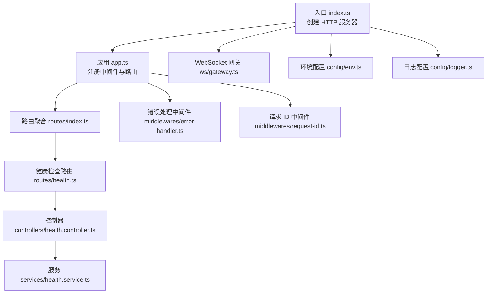
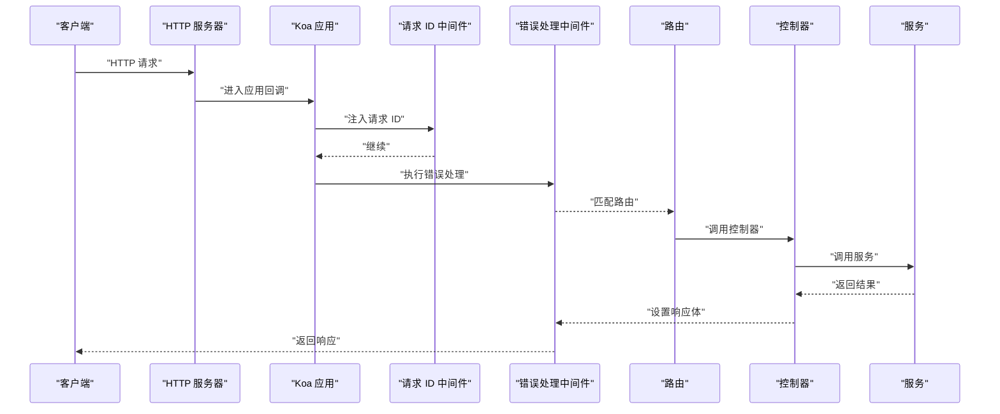
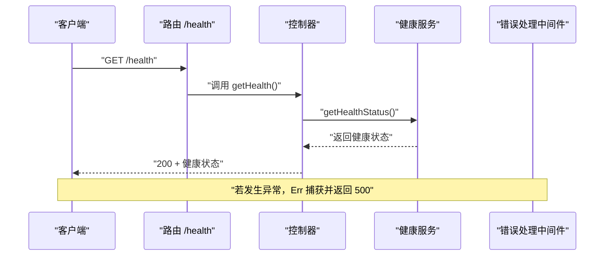
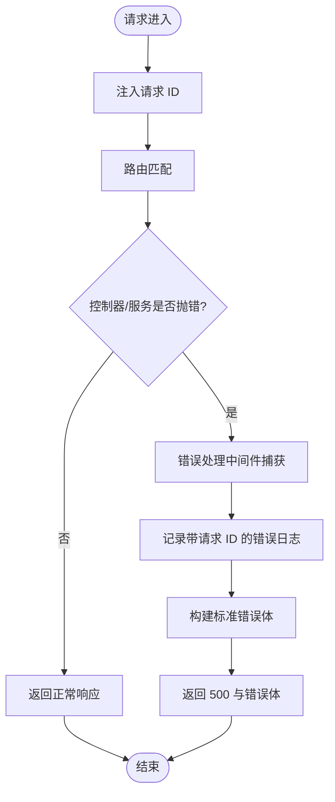
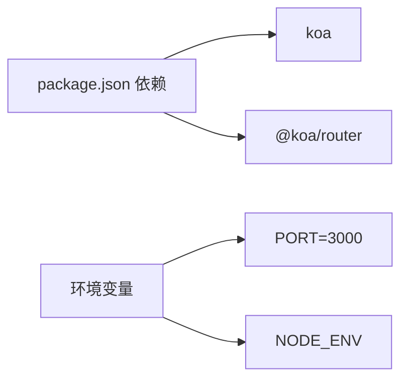

# HTTP API 接口

<cite>
**本文引用的文件**
- [app.ts](file://project/server/src/app.ts)
- [index.ts](file://project/server/src/index.ts)
- [routes/index.ts](file://project/server/src/routes/index.ts)
- [routes/health.ts](file://project/server/src/routes/health.ts)
- [controllers/health.controller.ts](file://project/server/src/controllers/health.controller.ts)
- [services/health.service.ts](file://project/server/src/services/health.service.ts)
- [middlewares/error-handler.ts](file://project/server/src/middlewares/error-handler.ts)
- [middlewares/request-id.ts](file://project/server/src/middlewares/request-id.ts)
- [types/koa.d.ts](file://project/server/src/types/koa.d.ts)
- [config/env.ts](file://project/server/src/config/env.ts)
- [config/logger.ts](file://project/server/src/config/logger.ts)
- [ws/gateway.ts](file://project/server/src/ws/gateway.ts)
- [package.json](file://project/server/package.json)
</cite>

## 目录
1. [简介](#简介)
2. [项目结构](#项目结构)
3. [核心组件](#核心组件)
4. [架构总览](#架构总览)
5. [详细组件分析](#详细组件分析)
6. [依赖分析](#依赖分析)
7. [性能考虑](#性能考虑)
8. [故障排查指南](#故障排查指南)
9. [结论](#结论)
10. [附录](#附录)

## 简介
本文件为 Pi-Guard 后端服务（基于 Koa）的 HTTP API 接口文档，聚焦当前已实现的健康检查接口与通用中间件行为。文档覆盖端点规范、请求与响应格式、状态码、认证与安全、CORS、错误处理策略、重试与最佳实践等内容，并通过图示展示关键流程。

## 项目结构
后端采用 Koa 应用，通过路由聚合器挂载具体业务路由；中间件负责统一错误处理与请求 ID 注入；服务层提供业务能力；WebSocket 网关预留扩展点；环境变量控制运行时配置。

**图表来源**
- [index.ts:1-15](file://project/server/src/index.ts#L1-L15)
- [app.ts:1-14](file://project/server/src/app.ts#L1-L14)
- [routes/index.ts:1-9](file://project/server/src/routes/index.ts#L1-L9)
- [routes/health.ts:1-9](file://project/server/src/routes/health.ts#L1-L9)
- [controllers/health.controller.ts:1-7](file://project/server/src/controllers/health.controller.ts#L1-L7)
- [services/health.service.ts:1-14](file://project/server/src/services/health.service.ts#L1-L14)
- [middlewares/error-handler.ts:1-18](file://project/server/src/middlewares/error-handler.ts#L1-L18)
- [middlewares/request-id.ts:1-11](file://project/server/src/middlewares/request-id.ts#L1-L11)
- [ws/gateway.ts:1-8](file://project/server/src/ws/gateway.ts#L1-L8)
- [config/env.ts:1-12](file://project/server/src/config/env.ts#L1-L12)
- [config/logger.ts:1-18](file://project/server/src/config/logger.ts#L1-L18)

**章节来源**
- [index.ts:1-15](file://project/server/src/index.ts#L1-L15)
- [app.ts:1-14](file://project/server/src/app.ts#L1-L14)
- [routes/index.ts:1-9](file://project/server/src/routes/index.ts#L1-L9)

## 核心组件
- 应用与中间件
  - 错误处理中间件：捕获未处理异常，记录带请求 ID 的错误日志，返回统一错误体与 500 状态码。
  - 请求 ID 中间件：生成全局唯一请求 ID 并注入到上下文状态，便于链路追踪。
- 路由与控制器
  - 健康检查路由：GET /health，调用控制器返回服务健康状态。
- 服务层
  - 健康状态服务：返回包含服务名、状态与时间戳的标准健康对象。
- 环境与日志
  - 环境变量：NODE_ENV、PORT；默认端口 3000。
  - 日志：统一格式化输出，支持 info/warn/error。

**章节来源**
- [middlewares/error-handler.ts:1-18](file://project/server/src/middlewares/error-handler.ts#L1-L18)
- [middlewares/request-id.ts:1-11](file://project/server/src/middlewares/request-id.ts#L1-L11)
- [routes/health.ts:1-9](file://project/server/src/routes/health.ts#L1-L9)
- [controllers/health.controller.ts:1-7](file://project/server/src/controllers/health.controller.ts#L1-L7)
- [services/health.service.ts:1-14](file://project/server/src/services/health.service.ts#L1-L14)
- [config/env.ts:1-12](file://project/server/src/config/env.ts#L1-L12)
- [config/logger.ts:1-18](file://project/server/src/config/logger.ts#L1-L18)

## 架构总览
下图展示了从客户端到服务端的典型请求路径，以及中间件与路由的协作关系。

**图表来源**
- [index.ts:1-15](file://project/server/src/index.ts#L1-L15)
- [app.ts:1-14](file://project/server/src/app.ts#L1-L14)
- [middlewares/request-id.ts:1-11](file://project/server/src/middlewares/request-id.ts#L1-L11)
- [middlewares/error-handler.ts:1-18](file://project/server/src/middlewares/error-handler.ts#L1-L18)
- [routes/index.ts:1-9](file://project/server/src/routes/index.ts#L1-L9)
- [routes/health.ts:1-9](file://project/server/src/routes/health.ts#L1-L9)
- [controllers/health.controller.ts:1-7](file://project/server/src/controllers/health.controller.ts#L1-L7)
- [services/health.service.ts:1-14](file://project/server/src/services/health.service.ts#L1-L14)

## 详细组件分析

### 健康检查接口
- 端点
  - 方法：GET
  - 路径：/health
  - 认证：无
  - 内容类型：application/json
- 请求参数
  - 无
- 成功响应
  - 状态码：200
  - 响应体字段
    - service: 字符串，服务标识
    - status: 字符串，固定值 ok
    - timestamp: 字符串，ISO8601 时间戳
- 错误响应
  - 500 Internal Server Error：当控制器或服务抛出异常时，统一由错误处理中间件返回标准错误体。
- 请求示例
  - curl -i http://localhost:3000/health
- 响应示例
  - 200 OK
  - {"service":"pi-guard-server","status":"ok","timestamp":"2025-04-05T12:34:56.789Z"}
- 失败示例
  - 500 Internal Server Error
  - {"code":"INTERNAL_ERROR","message":"Internal server error","requestId":"<请求ID>"}

**图表来源**
- [routes/health.ts:1-9](file://project/server/src/routes/health.ts#L1-L9)
- [controllers/health.controller.ts:1-7](file://project/server/src/controllers/health.controller.ts#L1-L7)
- [services/health.service.ts:1-14](file://project/server/src/services/health.service.ts#L1-L14)
- [middlewares/error-handler.ts:1-18](file://project/server/src/middlewares/error-handler.ts#L1-L18)

**章节来源**
- [routes/health.ts:1-9](file://project/server/src/routes/health.ts#L1-L9)
- [controllers/health.controller.ts:1-7](file://project/server/src/controllers/health.controller.ts#L1-L7)
- [services/health.service.ts:1-14](file://project/server/src/services/health.service.ts#L1-L14)
- [middlewares/error-handler.ts:1-18](file://project/server/src/middlewares/error-handler.ts#L1-L18)

### 错误处理与请求追踪
- 统一错误处理
  - 捕获异常，记录带请求 ID 的错误日志，返回 500 与标准错误体。
  - 错误体包含：错误码、消息、请求 ID。
- 请求 ID 注入
  - 在请求进入应用时生成唯一 ID，并在错误日志中输出，便于问题定位。
- 日志格式
  - 输出包含时间戳、级别与消息，便于运维检索。

**图表来源**
- [middlewares/request-id.ts:1-11](file://project/server/src/middlewares/request-id.ts#L1-L11)
- [middlewares/error-handler.ts:1-18](file://project/server/src/middlewares/error-handler.ts#L1-L18)
- [config/logger.ts:1-18](file://project/server/src/config/logger.ts#L1-L18)

**章节来源**
- [middlewares/error-handler.ts:1-18](file://project/server/src/middlewares/error-handler.ts#L1-L18)
- [middlewares/request-id.ts:1-11](file://project/server/src/middlewares/request-id.ts#L1-L11)
- [config/logger.ts:1-18](file://project/server/src/config/logger.ts#L1-L18)

## 依赖分析
- 运行时依赖
  - @koa/router：路由管理
  - koa：Web 框架
- 开发依赖
  - TypeScript、ts-node-dev、类型声明等
- 环境变量
  - NODE_ENV：运行环境
  - PORT：监听端口，默认 3000

**图表来源**
- [package.json:1-28](file://project/server/package.json#L1-L28)
- [config/env.ts:1-12](file://project/server/src/config/env.ts#L1-L12)

**章节来源**
- [package.json:1-28](file://project/server/package.json#L1-L28)
- [config/env.ts:1-12](file://project/server/src/config/env.ts#L1-L12)

## 性能考虑
- 中间件顺序
  - 错误处理中间件置于首位，确保异常可被统一捕获。
  - 请求 ID 中间件在路由之前，保证日志与追踪信息完整。
- 响应体大小
  - 健康检查返回体极小，适合高频探测。
- 并发与连接
  - 使用 Node.js HTTP 服务器，注意生产环境建议配合反向代理与进程管理工具以提升稳定性与吞吐量。

## 故障排查指南
- 常见问题
  - 500 错误：检查服务日志中的请求 ID，定位具体异常堆栈。
  - 端口占用：确认 PORT 环境变量与系统端口占用情况。
  - 路由不生效：确认路由已正确挂载到聚合路由。
- 建议
  - 生产环境开启反向代理（如 Nginx），统一处理静态资源、CORS 与 TLS。
  - 对外暴露的 API 建议增加鉴权与限流策略（当前仓库未实现）。

**章节来源**
- [middlewares/error-handler.ts:1-18](file://project/server/src/middlewares/error-handler.ts#L1-L18)
- [config/env.ts:1-12](file://project/server/src/config/env.ts#L1-L12)
- [config/logger.ts:1-18](file://project/server/src/config/logger.ts#L1-L18)

## 结论
Pi-Guard 当前仅实现了一个最小可用的健康检查接口与基础中间件。建议后续按需扩展：
- 新增鉴权机制（如基于密钥或 JWT）
- 完善 CORS 配置
- 扩展更多业务接口与数据模型
- 引入统一的 OpenAPI/Swagger 文档
- 增加速率限制与审计日志

## 附录

### 端点一览表
- GET /health
  - 功能：健康检查
  - 认证：否
  - 成功响应：200，JSON
  - 失败响应：500，JSON

**章节来源**
- [routes/health.ts:1-9](file://project/server/src/routes/health.ts#L1-L9)
- [controllers/health.controller.ts:1-7](file://project/server/src/controllers/health.controller.ts#L1-L7)
- [services/health.service.ts:1-14](file://project/server/src/services/health.service.ts#L1-L14)

### 认证与安全
- 当前实现
  - 无认证与授权逻辑
  - 无 CORS 配置
- 建议
  - 引入鉴权中间件（如基于密钥或 JWT）
  - 配置 CORS 中间件，明确允许来源、方法与头
  - 对敏感接口启用 HTTPS

### 内容类型与编码
- 默认 JSON：控制器与服务返回 JSON，建议客户端使用 application/json
- 字符集：UTF-8（Node.js 默认）

### CORS 配置
- 当前未实现 CORS 中间件
- 建议在应用启动时引入并配置 CORS，明确允许来源、方法与头

### 错误处理策略
- 统一错误体字段：code、message、requestId
- 状态码：500 Internal Server Error
- 日志：包含请求 ID 与错误消息，便于追踪

### 重试机制与最佳实践
- 重试
  - 健康检查可由客户端周期性发起，失败时按指数退避重试
- 最佳实践
  - 为每个请求注入唯一 ID，贯穿日志链路
  - 将错误日志标准化，便于集中收集与检索
  - 对外接口建议增加鉴权、限流与审计