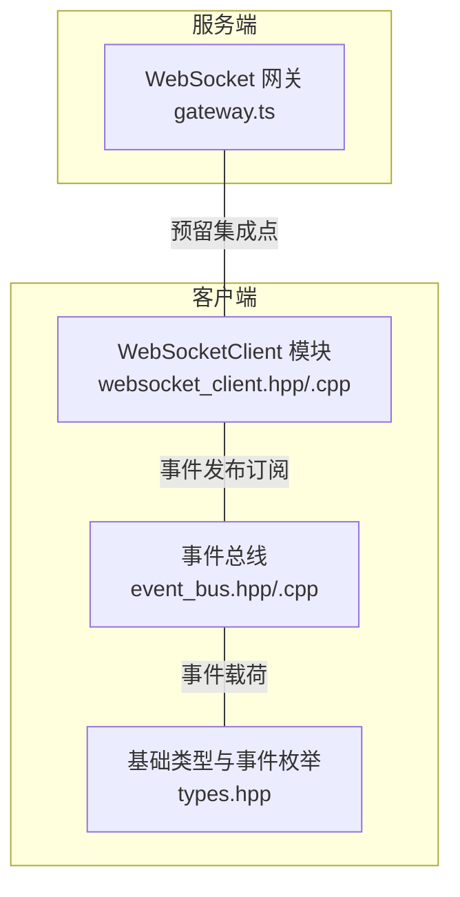
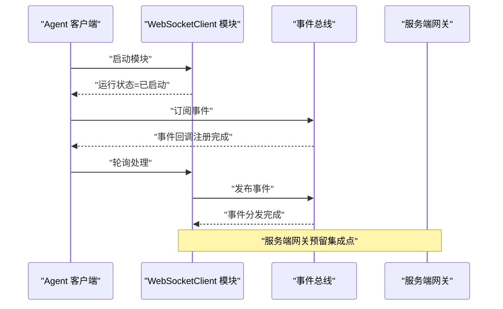
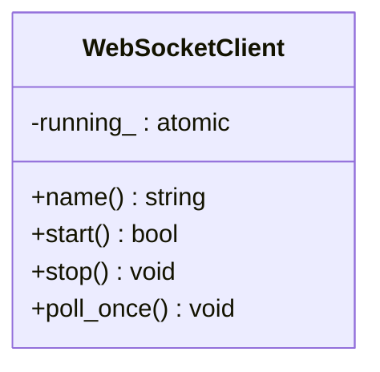
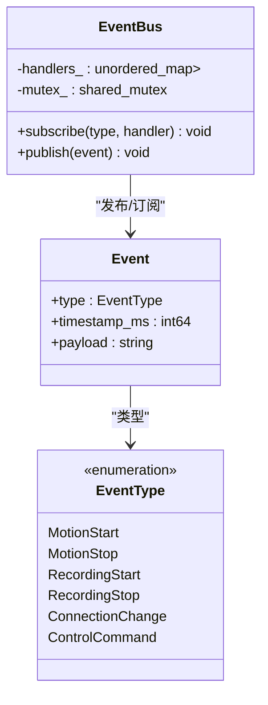
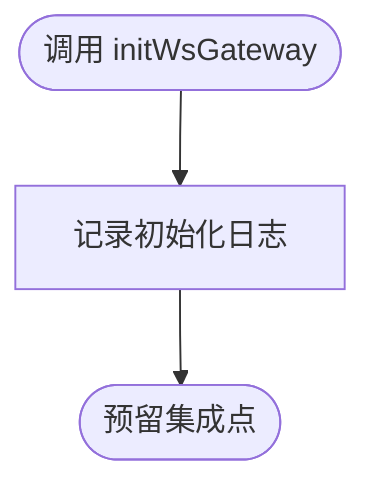
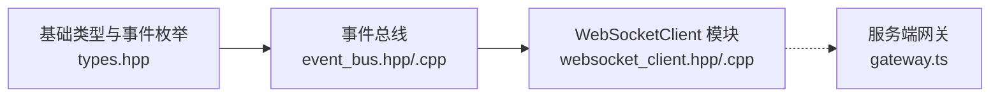

# WebSocket API 接口

<cite>
**本文引用的文件**
- [gateway.ts](file://project/server/src/ws/gateway.ts)
- [websocket_client.hpp](file://project/agent/src/modules/external_access/websocket/include/access_websocket/websocket_client.hpp)
- [websocket_client.cpp](file://project/agent/src/modules/external_access/websocket/websocket_client.cpp)
- [types.hpp](file://project/agent/src/foundation/include/foundation/types.hpp)
- [event_bus.hpp](file://project/agent/src/modules/infra/event_bus/include/infra_event/event_bus.hpp)
- [event_bus.cpp](file://project/agent/src/modules/infra/event_bus/event_bus.cpp)
</cite>

## 目录
1. [简介](#简介)
2. [项目结构](#项目结构)
3. [核心组件](#核心组件)
4. [架构总览](#架构总览)
5. [详细组件分析](#详细组件分析)
6. [依赖关系分析](#依赖关系分析)
7. [性能考虑](#性能考虑)
8. [故障排查指南](#故障排查指南)
9. [结论](#结论)

## 简介
本文件面向 Pi-Guard 的 WebSocket API 接口，基于当前仓库中的实现与类型定义，提供连接建立流程、消息格式规范、事件类型定义以及实时音频对讲相关的协议说明。由于服务端网关初始化函数尚处于预留状态，本文在“服务端”部分以概念性说明为主；在“客户端”部分，结合现有代码给出可执行的实现要点与扩展建议。

## 项目结构
Pi-Guard 的 WebSocket 相关能力分布在两个层面：
- 服务端：预留了 WebSocket 网关入口，用于后续集成具体协议与路由。
- 客户端：提供了通用的 WebSocket 客户端模块基类，支持启动/停止与轮询驱动的运行状态管理。

图表来源
- [gateway.ts:1-8](file://project/server/src/ws/gateway.ts#L1-L8)
- [websocket_client.hpp:1-22](file://project/agent/src/modules/external_access/websocket/include/access_websocket/websocket_client.hpp#L1-L22)
- [websocket_client.cpp:1-21](file://project/agent/src/modules/external_access/websocket/websocket_client.cpp#L1-L21)
- [event_bus.hpp:1-25](file://project/agent/src/modules/infra/event_bus/include/infra_event/event_bus.hpp#L1-L25)
- [event_bus.cpp:1-25](file://project/agent/src/modules/infra/event_bus/event_bus.cpp#L1-L25)
- [types.hpp:1-39](file://project/agent/src/foundation/include/foundation/types.hpp#L1-L39)

章节来源
- [gateway.ts:1-8](file://project/server/src/ws/gateway.ts#L1-L8)
- [websocket_client.hpp:1-22](file://project/agent/src/modules/external_access/websocket/include/access_websocket/websocket_client.hpp#L1-L22)
- [websocket_client.cpp:1-21](file://project/agent/src/modules/external_access/websocket/websocket_client.cpp#L1-L21)
- [event_bus.hpp:1-25](file://project/agent/src/modules/infra/event_bus/include/infra_event/event_bus.hpp#L1-L25)
- [event_bus.cpp:1-25](file://project/agent/src/modules/infra/event_bus/event_bus.cpp#L1-L25)
- [types.hpp:1-39](file://project/agent/src/foundation/include/foundation/types.hpp#L1-L39)

## 核心组件
- WebSocket 网关（服务端）：预留初始化入口，用于后续接入 WebSocket 服务器与路由。
- WebSocketClient 模块（客户端）：提供模块生命周期管理（启动/停止），以及一次轮询周期的处理入口，便于在主循环中按需调度。
- 事件总线：提供订阅/发布的事件分发机制，承载来自底层采集与处理模块的事件。
- 基础类型与事件枚举：定义事件类型、视频帧、音频帧等基础数据结构，为消息协议提供载体。

章节来源
- [gateway.ts:1-8](file://project/server/src/ws/gateway.ts#L1-L8)
- [websocket_client.hpp:1-22](file://project/agent/src/modules/external_access/websocket/include/access_websocket/websocket_client.hpp#L1-L22)
- [websocket_client.cpp:1-21](file://project/agent/src/modules/external_access/websocket/websocket_client.cpp#L1-L21)
- [event_bus.hpp:1-25](file://project/agent/src/modules/infra/event_bus/include/infra_event/event_bus.hpp#L1-L25)
- [event_bus.cpp:1-25](file://project/agent/src/modules/infra/event_bus/event_bus.cpp#L1-L25)
- [types.hpp:1-39](file://project/agent/src/foundation/include/foundation/types.hpp#L1-L39)

## 架构总览
下图展示了从客户端模块到事件总线再到服务端网关的概念性交互路径。注意：当前服务端网关尚未实现具体逻辑，仅为后续集成预留。

图表来源
- [gateway.ts:1-8](file://project/server/src/ws/gateway.ts#L1-L8)
- [websocket_client.hpp:1-22](file://project/agent/src/modules/external_access/websocket/include/access_websocket/websocket_client.hpp#L1-L22)
- [websocket_client.cpp:1-21](file://project/agent/src/modules/external_access/websocket/websocket_client.cpp#L1-L21)
- [event_bus.hpp:1-25](file://project/agent/src/modules/infra/event_bus/include/infra_event/event_bus.hpp#L1-L25)
- [event_bus.cpp:1-25](file://project/agent/src/modules/infra/event_bus/event_bus.cpp#L1-L25)

## 详细组件分析

### WebSocketClient 模块
- 职责：作为外部访问层的 WebSocket 客户端抽象，提供模块化生命周期与轮询处理接口。
- 关键行为：
  - 启动：设置运行标志为真，返回成功。
  - 停止：设置运行标志为假。
  - 轮询：在运行标志为真的前提下进行一次处理；当前实现为空操作，留待子类或上层逻辑填充。
- 设计要点：采用原子布尔值保证线程安全的状态切换；通过轮询方式与主循环解耦。

图表来源
- [websocket_client.hpp:1-22](file://project/agent/src/modules/external_access/websocket/include/access_websocket/websocket_client.hpp#L1-L22)
- [websocket_client.cpp:1-21](file://project/agent/src/modules/external_access/websocket/websocket_client.cpp#L1-L21)

章节来源
- [websocket_client.hpp:1-22](file://project/agent/src/modules/external_access/websocket/include/access_websocket/websocket_client.hpp#L1-L22)
- [websocket_client.cpp:1-21](file://project/agent/src/modules/external_access/websocket/websocket_client.cpp#L1-L21)

### 事件总线与事件模型
- 事件总线：提供订阅/发布机制，内部使用共享互斥锁保护订阅者列表，发布时使用共享锁遍历分发。
- 事件类型：包含运动检测、录制状态、连接状态变更、控制命令等枚举，便于统一处理各类通知。
- 数据结构：事件包含类型、时间戳与载荷字符串，音频/视频帧结构提供时间戳、采样率/通道数、样本数据等字段，适合作为消息载体。

图表来源
- [event_bus.hpp:1-25](file://project/agent/src/modules/infra/event_bus/include/infra_event/event_bus.hpp#L1-L25)
- [event_bus.cpp:1-25](file://project/agent/src/modules/infra/event_bus/event_bus.cpp#L1-L25)
- [types.hpp:1-39](file://project/agent/src/foundation/include/foundation/types.hpp#L1-L39)

章节来源
- [event_bus.hpp:1-25](file://project/agent/src/modules/infra/event_bus/include/infra_event/event_bus.hpp#L1-L25)
- [event_bus.cpp:1-25](file://project/agent/src/modules/infra/event_bus/event_bus.cpp#L1-L25)
- [types.hpp:1-39](file://project/agent/src/foundation/include/foundation/types.hpp#L1-L39)

### 服务端网关（预留）
- 当前实现：仅输出初始化日志，未接入任何 WebSocket 服务器或路由逻辑。
- 建议：在该入口中集成 WebSocket 服务器（如基于 HTTP 服务器升级），并定义消息路由与协议解析器，将事件总线中的事件转换为 WebSocket 消息下发至客户端。

图表来源
- [gateway.ts:1-8](file://project/server/src/ws/gateway.ts#L1-L8)

章节来源
- [gateway.ts:1-8](file://project/server/src/ws/gateway.ts#L1-L8)

## 依赖关系分析
- 客户端模块依赖于基础类型与事件总线，形成“采集/处理 -> 事件 -> 外部访问”的链路。
- 服务端网关与客户端模块之间通过事件总线解耦，便于后续对接 WebSocket 服务器。

图表来源
- [types.hpp:1-39](file://project/agent/src/foundation/include/foundation/types.hpp#L1-L39)
- [event_bus.hpp:1-25](file://project/agent/src/modules/infra/event_bus/include/infra_event/event_bus.hpp#L1-L25)
- [event_bus.cpp:1-25](file://project/agent/src/modules/infra/event_bus/event_bus.cpp#L1-L25)
- [websocket_client.hpp:1-22](file://project/agent/src/modules/external_access/websocket/include/access_websocket/websocket_client.hpp#L1-L22)
- [websocket_client.cpp:1-21](file://project/agent/src/modules/external_access/websocket/websocket_client.cpp#L1-L21)
- [gateway.ts:1-8](file://project/server/src/ws/gateway.ts#L1-L8)

章节来源
- [types.hpp:1-39](file://project/agent/src/foundation/include/foundation/types.hpp#L1-L39)
- [event_bus.hpp:1-25](file://project/agent/src/modules/infra/event_bus/include/infra_event/event_bus.hpp#L1-L25)
- [event_bus.cpp:1-25](file://project/agent/src/modules/infra/event_bus/event_bus.cpp#L1-L25)
- [websocket_client.hpp:1-22](file://project/agent/src/modules/external_access/websocket/include/access_websocket/websocket_client.hpp#L1-L22)
- [websocket_client.cpp:1-21](file://project/agent/src/modules/external_access/websocket/websocket_client.cpp#L1-L21)
- [gateway.ts:1-8](file://project/server/src/ws/gateway.ts#L1-L8)

## 性能考虑
- 事件分发：事件总线使用共享互斥锁，发布阶段采用共享锁遍历订阅者，有助于提升并发读场景下的吞吐。
- 轮询开销：客户端模块的轮询处理当前为空操作，实际实现中应避免在轮询中执行阻塞或高成本操作，必要时拆分为异步任务。
- 日志与可观测性：服务端网关已具备日志记录能力，建议在后续集成中增加连接统计、消息速率与延迟指标，以便监控与优化。

## 故障排查指南
- 连接未生效：确认客户端模块已启动且运行标志为真；检查轮询是否被正确调用。
- 事件未到达：确认事件总线订阅关系已建立，且事件类型匹配；检查发布路径是否正确。
- 服务端无响应：确认服务端网关已初始化，且后续集成了 WebSocket 服务器与消息路由。

章节来源
- [websocket_client.cpp:1-21](file://project/agent/src/modules/external_access/websocket/websocket_client.cpp#L1-L21)
- [event_bus.cpp:1-25](file://project/agent/src/modules/infra/event_bus/event_bus.cpp#L1-L25)
- [gateway.ts:1-8](file://project/server/src/ws/gateway.ts#L1-L8)

## 结论
当前仓库中，服务端网关处于预留状态，客户端提供了可扩展的 WebSocketClient 模块与事件总线基础设施。建议在服务端网关中集成 WebSocket 服务器，并基于事件总线将各类状态与媒体数据封装为消息下发；同时完善心跳与断线重连策略，确保实时音频对讲的稳定性与低延迟。