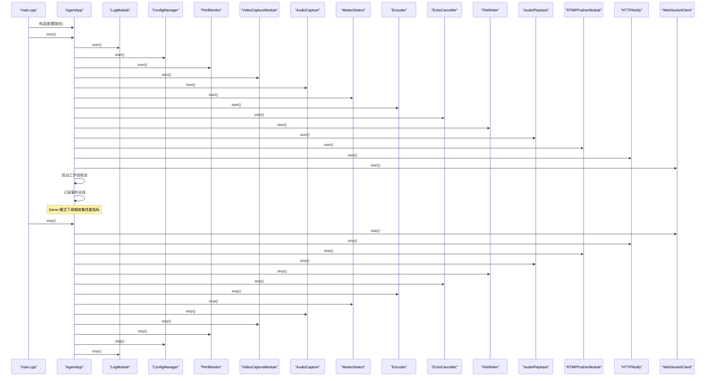
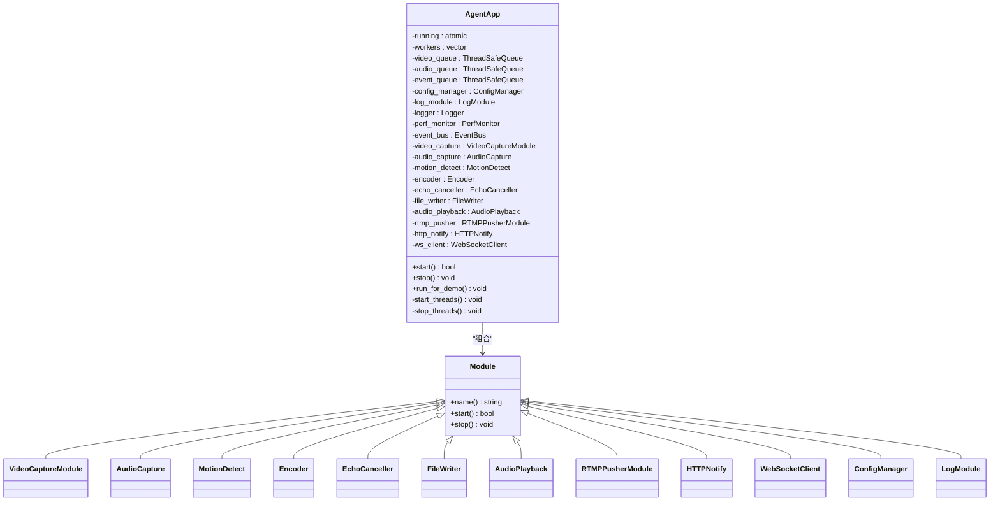
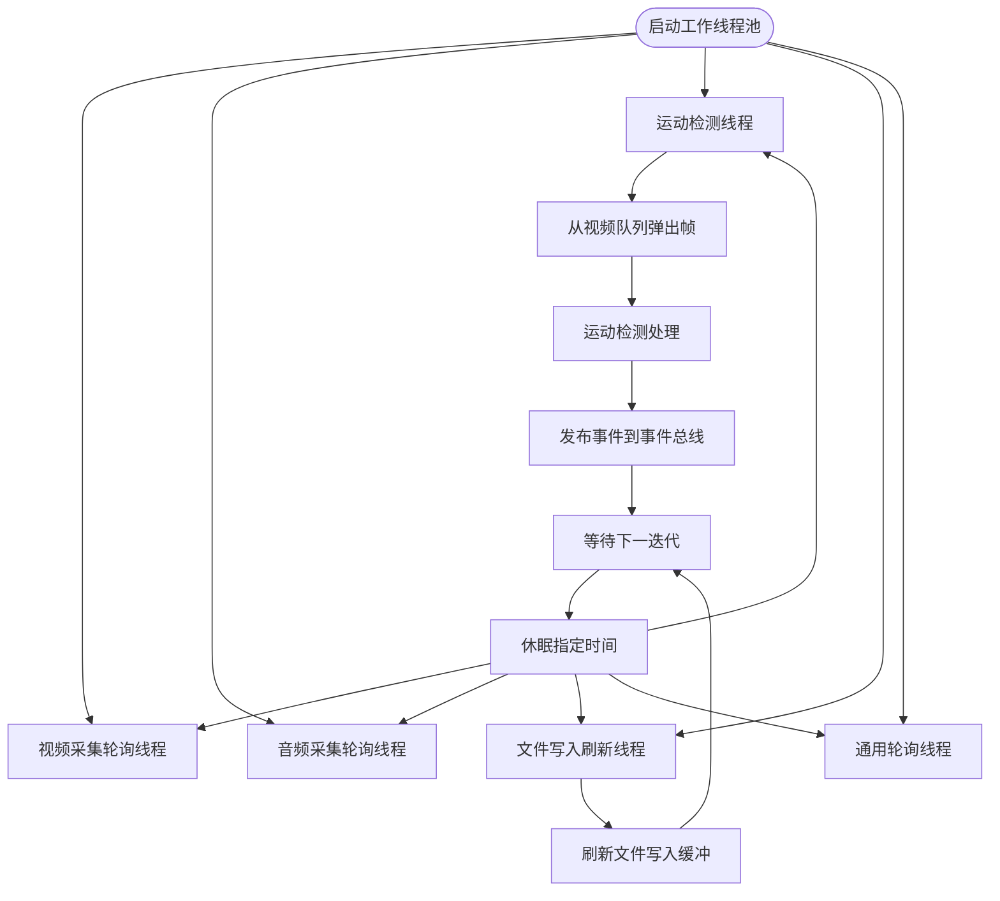
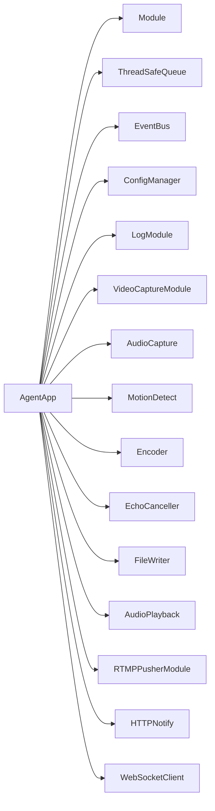

# C++ 代理程序

<cite>
**本文引用的文件**
- [agent_app.hpp](file://project/agent/src/runtime/include/agent_app.hpp)
- [agent_app.cpp](file://project/agent/src/runtime/app/agent_app.cpp)
- [main.cpp](file://project/agent/src/main.cpp)
- [module.hpp](file://project/agent/src/foundation/include/foundation/module.hpp)
- [shutdown_manager.cpp](file://project/agent/src/foundation/shutdown_manager.cpp)
- [types.hpp](file://project/agent/src/foundation/include/foundation/types.hpp)
- [video_capture_module.hpp](file://project/agent/src/modules/capture/video/include/capture_video/video_capture_module.hpp)
- [audio_capture_module.hpp](file://project/agent/src/modules/capture/audio/include/capture_audio/audio_capture_module.hpp)
- [encoder_module.hpp](file://project/agent/src/modules/processing/encoder/include/processing_encoder/encoder_module.hpp)
- [encoder.cpp](file://project/agent/src/modules/processing/encoder/encoder.cpp)
- [motion_detect.cpp](file://project/agent/src/modules/processing/motion_detect/motion_detect.cpp)
- [rtmp_publisher_module.cpp](file://project/agent/src/modules/external_access/pusher/rtmp_publisher_module.cpp)
- [config_manager.hpp](file://project/agent/src/modules/infra/config/include/infra_config/config_manager.hpp)
- [log_module.hpp](file://project/agent/src/modules/infra/log/include/infra_log/log_module.hpp)
</cite>

## 目录
1. [简介](#简介)
2. [项目结构](#项目结构)
3. [核心组件](#核心组件)
4. [架构总览](#架构总览)
5. [详细组件分析](#详细组件分析)
6. [依赖分析](#依赖分析)
7. [性能考虑](#性能考虑)
8. [故障排查指南](#故障排查指南)
9. [结论](#结论)
10. [附录](#附录)

## 简介
本技术文档围绕 C++ 代理程序（AgentApp）展开，系统性阐述其设计与实现，重点覆盖以下方面：
- AgentApp 的模块生命周期管理：启动、停止、优雅退出
- 线程管理策略：工作线程池、事件循环与同步机制
- 配置加载机制：ConfigManager 的读取、并发安全与热重载能力
- 模块化架构：基础模块、捕获模块、处理模块、外部访问模块、基础设施模块的职责与交互
- 底层库集成：FFmpeg、ALSA、V4L2 的集成方式与抽象边界
- 使用模式与配置选项：如何运行、如何扩展新模块、如何接入外部服务

## 项目结构
该项目采用“按功能域分层”的模块化组织方式，核心入口位于 runtime 层，基础设施与各功能模块分别置于 foundation、modules 下，CLI 示例位于 cli 子目录。

```mermaid
graph TB
subgraph "运行时"
MAIN["main.cpp<br/>应用入口"]
APP["AgentApp<br/>应用编排器"]
end
subgraph "基础模块"
MOD["foundation/module.hpp<br/>模块接口"]
TQ["foundation/thread_safe_queue.hpp<br/>线程安全队列"]
TYPES["foundation/types.hpp<br/>通用数据类型"]
SHUTDOWN["foundation/shutdown_manager.hpp<br/>信号与关闭管理"]
end
subgraph "基础设施模块"
CFG["infra_config/config_manager.hpp<br/>配置管理"]
LOGMOD["infra_log/log_module.hpp<br/>日志模块"]
end
subgraph "捕获模块"
VCAP["capture_video/video_capture_module.hpp<br/>视频采集"]
ACAP["capture_audio/audio_capture_module.hpp<br/>音频采集"]
end
subgraph "处理模块"
ENC["processing_encoder/encoder.cpp<br/>音视频编码"]
MD["processing_motion_detect/motion_detect.cpp<br/>运动检测"]
EC["processing_echo_canceller/echo_canceller.cpp<br/>回声消除"]
end
subgraph "输出模块"
FW["output_file/file_writer.cpp<br/>文件写入"]
AP["output_audio/audio_playback.cpp<br/>音频播放"]
end
subgraph "外部访问模块"
RTMP["external_access/pusher/rtmp_publisher_module.cpp<br/>RTMP 推流"]
HTTP["access_http/http_notify.cpp<br/>HTTP 通知"]
WS["access_websocket/websocket_client.cpp<br/>WebSocket 客户端"]
end
MAIN --> APP
APP --> CFG
APP --> LOGMOD
APP --> VCAP
APP --> ACAP
APP --> MD
APP --> ENC
APP --> EC
APP --> FW
APP --> AP
APP --> RTMP
APP --> HTTP
APP --> WS
APP --> MOD
APP --> TQ
APP --> TYPES
APP --> SHUTDOWN
```

图表来源
- [main.cpp:1-19](file://project/agent/src/main.cpp#L1-L19)
- [agent_app.hpp:1-71](file://project/agent/src/runtime/include/agent_app.hpp#L1-L71)
- [agent_app.cpp:1-138](file://project/agent/src/runtime/app/agent_app.cpp#L1-L138)
- [module.hpp:1-17](file://project/agent/src/foundation/include/foundation/module.hpp#L1-L17)
- [shutdown_manager.cpp:1-36](file://project/agent/src/foundation/shutdown_manager.cpp#L1-L36)
- [types.hpp:1-39](file://project/agent/src/foundation/include/foundation/types.hpp#L1-L39)
- [video_capture_module.hpp:1-22](file://project/agent/src/modules/capture/video/include/capture_video/video_capture_module.hpp#L1-L22)
- [audio_capture_module.hpp:1-24](file://project/agent/src/modules/capture/audio/include/capture_audio/audio_capture_module.hpp#L1-L24)
- [encoder.cpp:1-606](file://project/agent/src/modules/processing/encoder/encoder.cpp#L1-L606)
- [motion_detect.cpp:1-34](file://project/agent/src/modules/processing/motion_detect/motion_detect.cpp#L1-L34)
- [rtmp_publisher_module.cpp:1-21](file://project/agent/src/modules/external_access/pusher/rtmp_publisher_module.cpp#L1-L21)
- [config_manager.hpp:1-30](file://project/agent/src/modules/infra/config/include/infra_config/config_manager.hpp#L1-L30)
- [log_module.hpp:1-17](file://project/agent/src/modules/infra/log/include/infra_log/log_module.hpp#L1-L17)

章节来源
- [main.cpp:1-19](file://project/agent/src/main.cpp#L1-L19)
- [agent_app.hpp:1-71](file://project/agent/src/runtime/include/agent_app.hpp#L1-L71)
- [agent_app.cpp:1-138](file://project/agent/src/runtime/app/agent_app.cpp#L1-L138)

## 核心组件
本节聚焦 AgentApp 的设计与实现，涵盖生命周期、线程模型、队列与事件总线、模块编排等。

- 生命周期管理
  - 启动流程：初始化日志、配置、性能监控；依次启动视频采集、音频采集、运动检测、编码器、回声消除、文件写入、音频播放、RTMP 推流、HTTP 通知、WebSocket 客户端；订阅事件总线并启动工作线程池。
  - 停止流程：反向停止所有模块，等待工作线程 join，释放资源。
  - 运行状态：通过原子布尔值控制，避免重复启动或停止。
- 线程管理
  - 工作线程池：包含多个专用线程，分别负责视频采集轮询、音频采集轮询、运动检测处理、文件写入刷新、通用轮询（预留扩展）。
  - 同步机制：使用条件变量与互斥锁协调模块间状态切换；事件总线用于跨模块解耦通信。
- 队列与事件
  - 视频帧队列、音频帧队列、事件队列：线程安全队列作为模块间数据通道，支持生产者-消费者模式。
  - 事件总线：订阅/发布机制，用于模块间松耦合通信（如运动检测事件）。
- 配置加载
  - ConfigManager 提供键值配置读取、并发安全更新与热重载能力，支持字符串类型读取与设置。
- 日志与性能
  - LogModule 负责日志子系统的启动与停止；PerfMonitor 收集 CPU、内存、温度等指标，Demo 模式下周期打印。

章节来源
- [agent_app.hpp:29-68](file://project/agent/src/runtime/include/agent_app.hpp#L29-L68)
- [agent_app.cpp:16-63](file://project/agent/src/runtime/app/agent_app.cpp#L16-L63)
- [agent_app.cpp:78-126](file://project/agent/src/runtime/app/agent_app.cpp#L78-L126)
- [config_manager.hpp:11-27](file://project/agent/src/modules/infra/config/include/infra_config/config_manager.hpp#L11-L27)
- [log_module.hpp:9-14](file://project/agent/src/modules/infra/log/include/infra_log/log_module.hpp#L9-L14)

## 架构总览
AgentApp 作为应用编排器，负责模块装配、生命周期调度与线程协调。模块遵循统一的 Module 接口，确保一致的启动/停止语义。数据在模块间以线程安全队列传递，事件通过 EventBus 解耦。

图表来源
- [main.cpp:6-18](file://project/agent/src/main.cpp#L6-L18)
- [agent_app.cpp:16-63](file://project/agent/src/runtime/app/agent_app.cpp#L16-L63)
- [agent_app.cpp:78-126](file://project/agent/src/runtime/app/agent_app.cpp#L78-L126)

## 详细组件分析

### AgentApp 组件分析
- 设计要点
  - 统一的模块接口：所有模块继承 Module，具备 name/start/stop 三件套，便于集中管理。
  - 组合优于继承：AgentApp 通过组合聚合各模块实例，避免复杂的继承层次。
  - 线程安全队列：视频、音频、事件队列贯穿采集、处理、输出链路，降低锁竞争。
  - 事件总线：模块间通过事件进行弱耦合通信，提升可扩展性。
- 关键流程
  - 启动顺序：日志 → 配置 → 性能监控 → 采集 → 处理 → 输出 → 外部访问
  - 停止顺序：逆向执行，确保资源有序释放
  - Demo 模式：周期性收集性能指标并记录日志
- 线程模型
  - 工作线程池：视频采集轮询、音频采集轮询、运动检测处理、文件写入刷新、通用轮询
  - 同步：使用原子标志位与条件变量保证线程安全

图表来源
- [module.hpp:7-14](file://project/agent/src/foundation/include/foundation/module.hpp#L7-L14)
- [agent_app.hpp:29-68](file://project/agent/src/runtime/include/agent_app.hpp#L29-L68)
- [video_capture_module.hpp:9-15](file://project/agent/src/modules/capture/video/include/capture_video/video_capture_module.hpp#L9-L15)
- [audio_capture_module.hpp:11-17](file://project/agent/src/modules/capture/audio/include/capture_audio/audio_capture_module.hpp#L11-L17)
- [encoder_module.hpp:9-16](file://project/agent/src/modules/processing/encoder/include/processing_encoder/encoder_module.hpp#L9-L16)
- [motion_detect.cpp:1-34](file://project/agent/src/modules/processing/motion_detect/motion_detect.cpp#L1-L34)
- [rtmp_publisher_module.cpp:1-21](file://project/agent/src/modules/external_access/pusher/rtmp_publisher_module.cpp#L1-L21)

章节来源
- [agent_app.hpp:29-68](file://project/agent/src/runtime/include/agent_app.hpp#L29-L68)
- [agent_app.cpp:16-63](file://project/agent/src/runtime/app/agent_app.cpp#L16-L63)
- [agent_app.cpp:78-126](file://project/agent/src/runtime/app/agent_app.cpp#L78-L126)

### 模块生命周期管理
- 启动阶段
  - 日志模块：负责日志系统初始化，提供统一日志入口
  - 配置模块：加载配置文件，提供键值查询与并发安全更新
  - 性能监控：启动性能采样，支持 Demo 模式下周期性输出
  - 采集模块：视频与音频采集模块启动，准备接收帧数据
  - 处理模块：运动检测、编码器、回声消除启动，进入处理循环
  - 输出模块：文件写入、音频播放启动，准备消费编码结果
  - 外部访问模块：RTMP 推流、HTTP 通知、WebSocket 客户端启动
- 停止阶段
  - 逆序停止所有模块，确保资源释放与线程 join
  - 清理事件总线与线程池

章节来源
- [agent_app.cpp:16-63](file://project/agent/src/runtime/app/agent_app.cpp#L16-L63)
- [log_module.hpp:9-14](file://project/agent/src/modules/infra/log/include/infra_log/log_module.hpp#L9-L14)
- [config_manager.hpp:11-27](file://project/agent/src/modules/infra/config/include/infra_config/config_manager.hpp#L11-L27)

### 线程管理
- 工作线程池
  - 视频采集轮询线程：定期触发采集轮询（当前注释掉，留待后续实现）
  - 音频采集轮询线程：定期触发采集轮询（当前注释掉，留待后续实现）
  - 运动检测线程：从视频队列取出帧，生成事件并发布到事件总线
  - 文件写入线程：周期性刷新输出缓冲
  - 通用轮询线程：预留扩展点（当前注释掉，留待后续实现）
- 同步与协调
  - 原子标志位 running_ 控制线程循环
  - 条件变量与互斥锁用于模块状态切换与等待
  - 事件总线用于跨线程解耦通信

图表来源
- [agent_app.cpp:78-126](file://project/agent/src/runtime/app/agent_app.cpp#L78-L126)
- [motion_detect.cpp:18-31](file://project/agent/src/modules/processing/motion_detect/motion_detect.cpp#L18-L31)

章节来源
- [agent_app.cpp:78-126](file://project/agent/src/runtime/app/agent_app.cpp#L78-L126)
- [motion_detect.cpp:18-31](file://project/agent/src/modules/processing/motion_detect/motion_detect.cpp#L18-L31)

### 配置加载机制
- ConfigManager
  - 提供键值配置读取与设置接口，内部使用共享互斥锁保证并发安全
  - 支持热重载方法，便于动态更新配置
  - 与 AgentApp 协同，在启动阶段加载配置并在运行期提供查询能力
- 使用模式
  - 在 AgentApp 构造函数中传入配置路径
  - 在需要的地方通过 ConfigManager 查询配置项，避免硬编码

章节来源
- [config_manager.hpp:11-27](file://project/agent/src/modules/infra/config/include/infra_config/config_manager.hpp#L11-L27)
- [agent_app.cpp:7-12](file://project/agent/src/runtime/app/agent_app.cpp#L7-L12)

### 基础模块
- Module 接口
  - 统一的模块生命周期接口，便于集中管理与测试
- ThreadSafeQueue
  - 线程安全队列，支持多生产者/多消费者场景
- Types
  - 定义通用数据结构：VideoFrame、AudioFrame、Event 及其枚举类型
- ShutdownManager
  - 信号处理与优雅关闭：监听 SIGINT/SIGTERM，通知所有模块准备停止

章节来源
- [module.hpp:7-14](file://project/agent/src/foundation/include/foundation/module.hpp#L7-L14)
- [types.hpp:9-36](file://project/agent/src/foundation/include/foundation/types.hpp#L9-L36)
- [shutdown_manager.cpp:16-33](file://project/agent/src/foundation/shutdown_manager.cpp#L16-L33)

### 捕获模块
- VideoCaptureModule
  - 视频采集模块接口，负责从摄像头/V4L2 设备采集帧
  - 当前实现为空白骨架，留待后续接入 V4L2/驱动层
- AudioCapture
  - 音频采集模块，将采集到的音频帧写入线程安全队列
  - 通过构造函数注入输出队列，形成采集-处理的数据通道

章节来源
- [video_capture_module.hpp:9-15](file://project/agent/src/modules/capture/video/include/capture_video/video_capture_module.hpp#L9-L15)
- [audio_capture_module.hpp:11-21](file://project/agent/src/modules/capture/audio/include/capture_audio/audio_capture_module.hpp#L11-L21)

### 处理模块
- Encoder（FFmpeg 集成）
  - 视频编码：H.264，像素格式 YUV420P，时间基与帧率配置，硬件加速参数设置
  - 音频编码：AAC，采样率、声道布局、帧大小配置，支持 PCM 格式转换
  - 编码线程：独立线程驱动编码循环，支持注册消费者、包队列管理、溢出丢弃
  - 生命周期：start 初始化编码器并启动线程，stop 优雅关闭并清理资源
  - 与 ALSA/V4L2 的集成
    - ALSA：通过音频提供者适配器接入音频输入设备，PCM 数据经采样率转换后送入 AAC 编码
    - V4L2：通过视频提供者适配器接入摄像头设备，YUYV422 帧经缩放转换为 YUV420P 后送入 H.264 编码
- MotionDetect
  - 从视频队列取出帧，生成运动开始事件并写入事件队列
  - 作为处理链路的前置节点，为后续模块提供事件驱动能力
- EchoCanceller
  - 回声消除模块接口，当前实现为空白骨架，留待后续接入算法库

章节来源
- [encoder.cpp:45-54](file://project/agent/src/modules/processing/encoder/encoder.cpp#L45-L54)
- [encoder.cpp:56-138](file://project/agent/src/modules/processing/encoder/encoder.cpp#L56-L138)
- [encoder.cpp:140-227](file://project/agent/src/modules/processing/encoder/encoder.cpp#L140-L227)
- [encoder.cpp:267-297](file://project/agent/src/modules/processing/encoder/encoder.cpp#L267-L297)
- [encoder.cpp:332-349](file://project/agent/src/modules/processing/encoder/encoder.cpp#L332-L349)
- [encoder.cpp:359-420](file://project/agent/src/modules/processing/encoder/encoder.cpp#L359-L420)
- [encoder.cpp:422-510](file://project/agent/src/modules/processing/encoder/encoder.cpp#L422-L510)
- [encoder.cpp:512-583](file://project/agent/src/modules/processing/encoder/encoder.cpp#L512-L583)
- [motion_detect.cpp:5-31](file://project/agent/src/modules/processing/motion_detect/motion_detect.cpp#L5-L31)

### 外部访问模块
- RTMPPusherModule
  - RTMP 推流模块接口，当前实现为空白骨架，留待后续接入推流库
- HTTPNotify
  - HTTP 通知模块接口，当前实现为空白骨架，留待后续接入 HTTP 客户端
- WebSocketClient
  - WebSocket 客户端接口，当前实现为空白骨架，留待后续接入网络通信

章节来源
- [rtmp_publisher_module.cpp:5-18](file://project/agent/src/modules/external_access/pusher/rtmp_publisher_module.cpp#L5-L18)

### 基础设施模块
- LogModule
  - 日志模块接口，负责日志系统启动与停止
- ConfigManager
  - 配置管理接口，提供键值读取、设置与热重载
- EventBus
  - 事件总线接口，当前实现为空白骨架，留待后续接入事件分发

章节来源
- [log_module.hpp:9-14](file://project/agent/src/modules/infra/log/include/infra_log/log_module.hpp#L9-L14)
- [config_manager.hpp:11-27](file://project/agent/src/modules/infra/config/include/infra_config/config_manager.hpp#L11-L27)

## 依赖分析
- 组件耦合
  - AgentApp 对各模块存在强组合关系，但通过 Module 接口与线程安全队列实现低耦合数据通路
  - 事件总线进一步降低模块间的直接依赖
- 外部依赖
  - FFmpeg：封装在 Encoder 中，提供音视频编解码能力
  - ALSA：通过音频提供者适配器接入音频输入设备
  - V4L2：通过视频提供者适配器接入摄像头设备
- 循环依赖
  - 未发现直接循环依赖；模块间通过队列与事件总线解耦

图表来源
- [agent_app.hpp:29-68](file://project/agent/src/runtime/include/agent_app.hpp#L29-L68)
- [module.hpp:7-14](file://project/agent/src/foundation/include/foundation/module.hpp#L7-L14)

章节来源
- [agent_app.hpp:29-68](file://project/agent/src/runtime/include/agent_app.hpp#L29-L68)

## 性能考虑
- 编码性能
  - Encoder 使用独立线程驱动，避免阻塞主循环；通过包队列容量限制防止内存膨胀
  - 时间戳计算基于 steady_clock，确保时间连续性与精度
- 线程调度
  - 各工作线程按固定周期休眠，避免忙等；可根据实际负载调整休眠间隔
- 资源释放
  - stop 流程严格逆序执行，确保线程 join 与上下文释放
- 监控与诊断
  - PerfMonitor 支持周期性采集性能指标，Demo 模式下输出 CPU、内存、温度

## 故障排查指南
- 启动失败
  - 检查配置文件路径与权限；确认 ConfigManager 能正常加载
  - 查看日志模块是否成功启动；确认日志输出可用
- 编码异常
  - 检查 FFmpeg 版本与编解码器可用性；确认像素格式与采样格式匹配
  - 关注编码线程是否正常运行，包队列是否溢出
- 采集问题
  - ALSA/V4L2 设备权限与驱动状态；确认音频/视频提供者适配器正确初始化
- 线程卡死
  - 检查原子标志位 running_ 是否被正确置位/复位
  - 确认条件变量与互斥锁使用正确，避免死锁

章节来源
- [encoder.cpp:267-297](file://project/agent/src/modules/processing/encoder/encoder.cpp#L267-L297)
- [encoder.cpp:332-349](file://project/agent/src/modules/processing/encoder/encoder.cpp#L332-L349)
- [agent_app.cpp:16-63](file://project/agent/src/runtime/app/agent_app.cpp#L16-L63)

## 结论
AgentApp 通过模块化设计与统一接口，实现了对视频采集、音频采集、运动检测、音视频编码、回声消除、文件写入、音频播放以及外部访问（RTMP/HTTP/WebSocket）的完整编排。结合线程安全队列与事件总线，系统具备良好的扩展性与可维护性。后续可在捕获模块与外部访问模块中完善 ALSA/V4L2 集成与具体协议实现，进一步提升实用性与鲁棒性。

## 附录
- 使用模式
  - 构造 AgentApp 并传入配置路径
  - 调用 start 启动应用，进入 Demo 模式观察性能指标
  - 调用 stop 停止应用，确保资源有序释放
- 配置选项
  - 通过 ConfigManager 提供的键值接口读取配置，支持并发安全访问与热重载
- 扩展建议
  - 新增模块需实现 Module 接口，并在 AgentApp 中注册与编排
  - 优先使用线程安全队列与事件总线进行模块间通信
  - 对于底层库集成，建议通过适配器模式封装，保持上层接口稳定