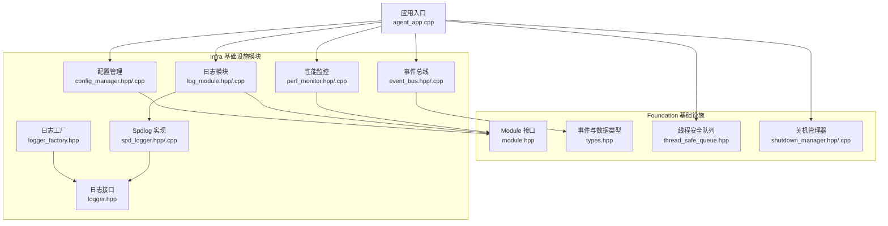
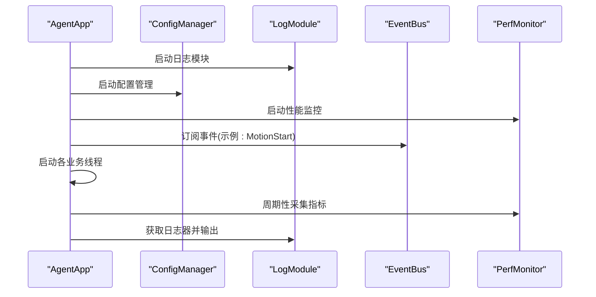
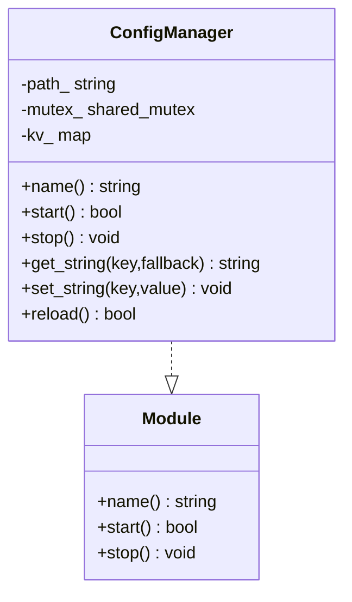
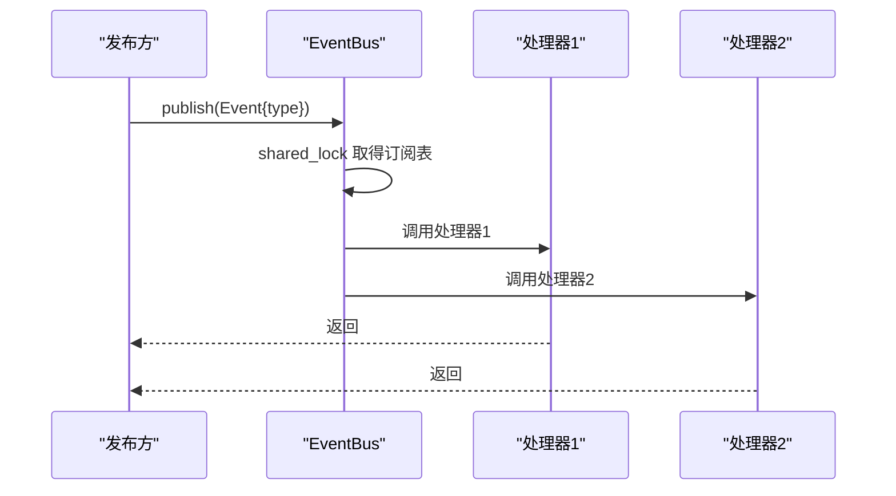
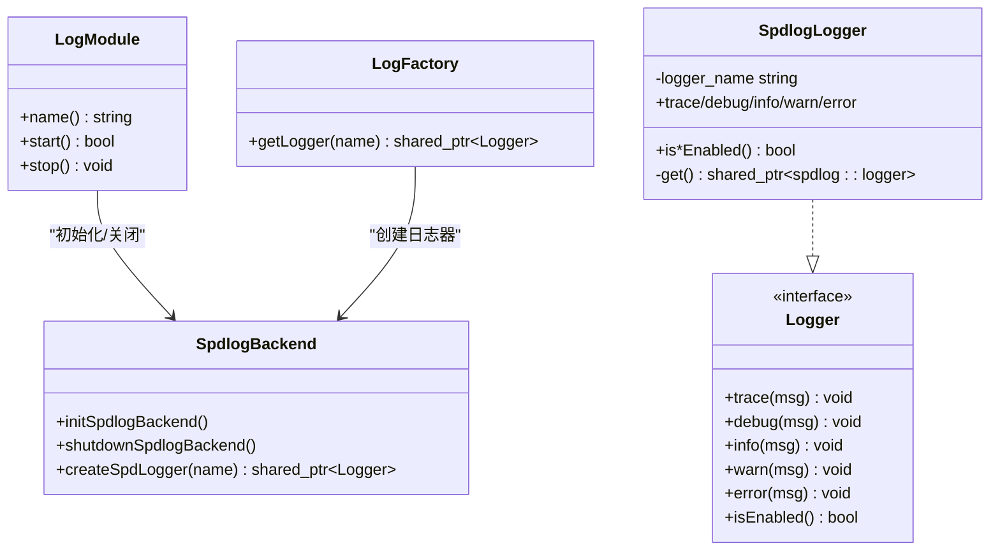
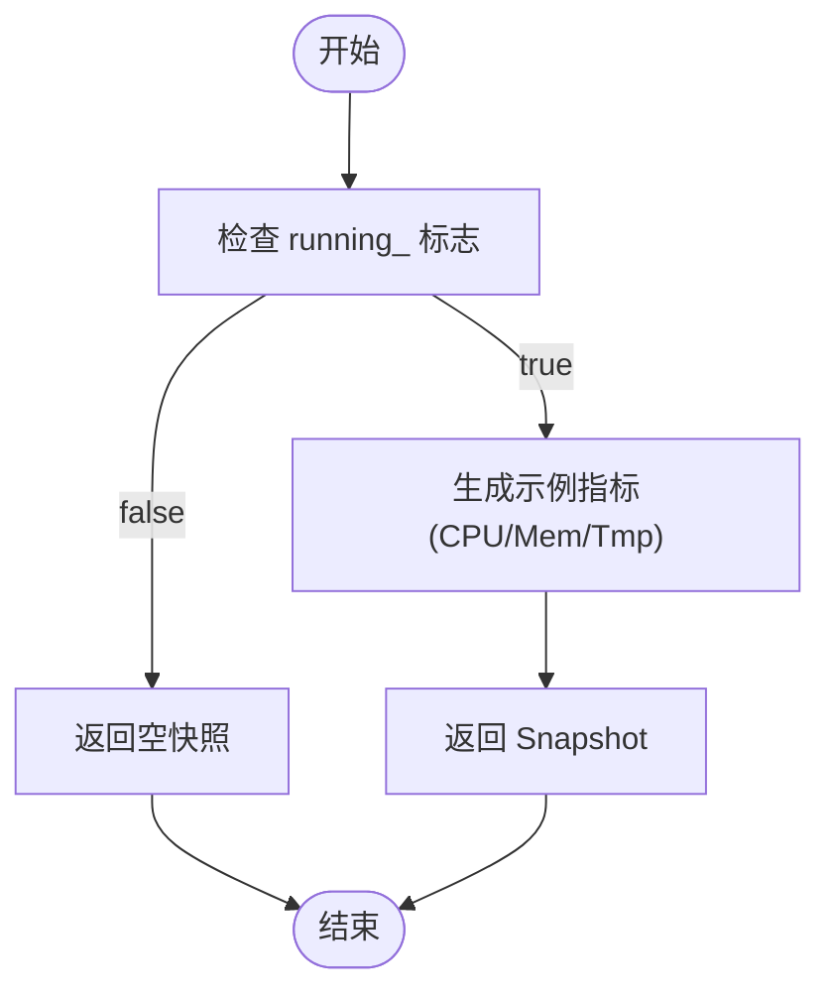
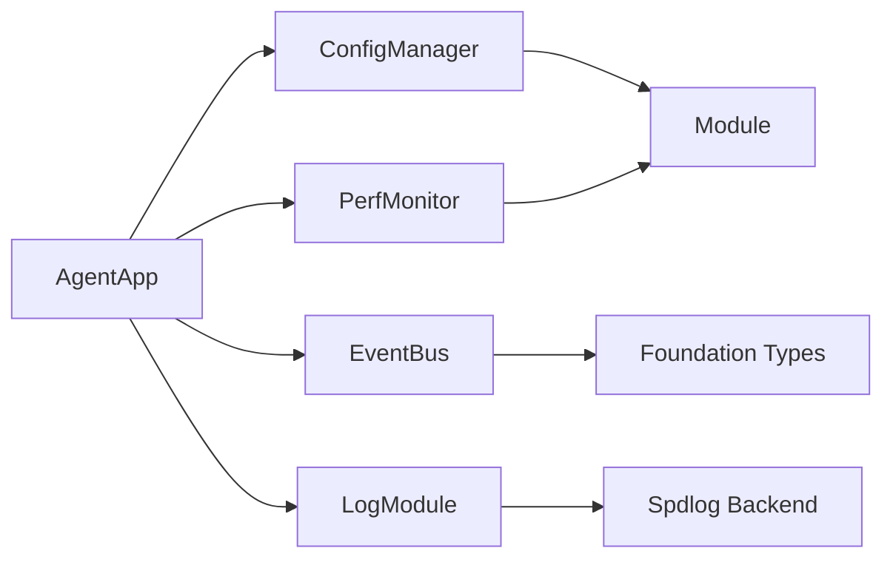

# 基础设施支持模块

<cite>
**本文引用的文件**
- [module.hpp](file://project/agent/src/foundation/include/foundation/module.hpp)
- [types.hpp](file://project/agent/src/foundation/include/foundation/types.hpp)
- [thread_safe_queue.hpp](file://project/agent/src/foundation/include/foundation/thread_safe_queue.hpp)
- [shutdown_manager.hpp](file://project/agent/src/foundation/include/foundation/shutdown_manager.hpp)
- [shutdown_manager.cpp](file://project/agent/src/foundation/shutdown_manager.cpp)
- [config_manager.hpp](file://project/agent/src/modules/infra/config/include/infra_config/config_manager.hpp)
- [config_manager.cpp](file://project/agent/src/modules/infra/config/config_manager.cpp)
- [event_bus.hpp](file://project/agent/src/modules/infra/event_bus/include/infra_event/event_bus.hpp)
- [event_bus.cpp](file://project/agent/src/modules/infra/event_bus/event_bus.cpp)
- [logger.hpp](file://project/agent/src/modules/infra/log/include/infra_log/logger.hpp)
- [logger_factory.hpp](file://project/agent/src/modules/infra/log/include/infra_log/logger_factory.hpp)
- [log_module.hpp](file://project/agent/src/modules/infra/log/include/infra_log/log_module.hpp)
- [log_module.cpp](file://project/agent/src/modules/infra/log/log_module.cpp)
- [spd_logger.hpp](file://project/agent/src/modules/infra/log/spd_logger.hpp)
- [spd_logger.cpp](file://project/agent/src/modules/infra/log/spd_logger.cpp)
- [perf_monitor.hpp](file://project/agent/src/modules/infra/perf_monitor/include/infra_monitor/perf_monitor.hpp)
- [perf_monitor.cpp](file://project/agent/src/modules/infra/perf_monitor/perf_monitor.cpp)
- [agent_app.cpp](file://project/agent/src/runtime/app/agent_app.cpp)
</cite>

## 目录
1. [简介](#简介)
2. [项目结构](#项目结构)
3. [核心组件](#核心组件)
4. [架构总览](#架构总览)
5. [详细组件分析](#详细组件分析)
6. [依赖分析](#依赖分析)
7. [性能考虑](#性能考虑)
8. [故障排查指南](#故障排查指南)
9. [结论](#结论)
10. [附录：使用示例与最佳实践](#附录使用示例与最佳实践)

## 简介
本文件面向基础设施支持模块，系统性阐述以下能力的设计与实现：
- 配置管理：配置文件解析机制、动态配置更新、线程安全读写接口
- 事件总线：发布订阅模式、事件类型定义、线程安全分发
- 日志记录：日志工厂设计、多级别日志系统、后端初始化与关闭
- 性能监控：指标采集接口、运行状态控制、演示用采样值

同时提供使用示例（以路径引用代替具体代码）、调试技巧、性能分析与故障诊断方法，帮助开发者快速上手并稳定集成。

## 项目结构
基础设施相关代码位于 C++ 模块的 infra 子目录中，按功能划分为 config、event_bus、log、perf_monitor 四个子模块，并通过基础抽象模块 foundation 提供通用能力（如 Module 接口、事件类型、线程安全队列等）。

图表来源
- [module.hpp:1-17](file://project/agent/src/foundation/include/foundation/module.hpp#L1-L17)
- [types.hpp:1-39](file://project/agent/src/foundation/include/foundation/types.hpp#L1-L39)
- [thread_safe_queue.hpp:1-51](file://project/agent/src/foundation/include/foundation/thread_safe_queue.hpp#L1-L51)
- [shutdown_manager.hpp:1-12](file://project/agent/src/foundation/include/foundation/shutdown_manager.hpp#L1-L12)
- [shutdown_manager.cpp:1-36](file://project/agent/src/foundation/shutdown_manager.cpp#L1-L36)
- [config_manager.hpp:1-30](file://project/agent/src/modules/infra/config/include/infra_config/config_manager.hpp#L1-L30)
- [config_manager.cpp:1-40](file://project/agent/src/modules/infra/config/config_manager.cpp#L1-L40)
- [event_bus.hpp:1-25](file://project/agent/src/modules/infra/event_bus/include/infra_event/event_bus.hpp#L1-L25)
- [event_bus.cpp:1-25](file://project/agent/src/modules/infra/event_bus/event_bus.cpp#L1-L25)
- [log_module.hpp:1-17](file://project/agent/src/modules/infra/log/include/infra_log/log_module.hpp#L1-L17)
- [log_module.cpp:1-30](file://project/agent/src/modules/infra/log/log_module.cpp#L1-L30)
- [logger.hpp:1-25](file://project/agent/src/modules/infra/log/include/infra_log/logger.hpp#L1-L25)
- [logger_factory.hpp:1-16](file://project/agent/src/modules/infra/log/include/infra_log/logger_factory.hpp#L1-L16)
- [spd_logger.hpp:1-38](file://project/agent/src/modules/infra/log/spd_logger.hpp#L1-L38)
- [spd_logger.cpp:1-68](file://project/agent/src/modules/infra/log/spd_logger.cpp#L1-L68)
- [perf_monitor.hpp:1-28](file://project/agent/src/modules/infra/perf_monitor/include/infra_monitor/perf_monitor.hpp#L1-L28)
- [perf_monitor.cpp:1-26](file://project/agent/src/modules/infra/perf_monitor/perf_monitor.cpp#L1-L26)
- [agent_app.cpp:1-138](file://project/agent/src/runtime/app/agent_app.cpp#L1-L138)

章节来源
- [module.hpp:1-17](file://project/agent/src/foundation/include/foundation/module.hpp#L1-L17)
- [types.hpp:1-39](file://project/agent/src/foundation/include/foundation/types.hpp#L1-L39)
- [thread_safe_queue.hpp:1-51](file://project/agent/src/foundation/include/foundation/thread_safe_queue.hpp#L1-L51)
- [shutdown_manager.hpp:1-12](file://project/agent/src/foundation/include/foundation/shutdown_manager.hpp#L1-L12)
- [shutdown_manager.cpp:1-36](file://project/agent/src/foundation/shutdown_manager.cpp#L1-L36)
- [config_manager.hpp:1-30](file://project/agent/src/modules/infra/config/include/infra_config/config_manager.hpp#L1-L30)
- [config_manager.cpp:1-40](file://project/agent/src/modules/infra/config/config_manager.cpp#L1-L40)
- [event_bus.hpp:1-25](file://project/agent/src/modules/infra/event_bus/include/infra_event/event_bus.hpp#L1-L25)
- [event_bus.cpp:1-25](file://project/agent/src/modules/infra/event_bus/event_bus.cpp#L1-L25)
- [logger.hpp:1-25](file://project/agent/src/modules/infra/log/include/infra_log/logger.hpp#L1-L25)
- [logger_factory.hpp:1-16](file://project/agent/src/modules/infra/log/include/infra_log/logger_factory.hpp#L1-L16)
- [log_module.hpp:1-17](file://project/agent/src/modules/infra/log/include/infra_log/log_module.hpp#L1-L17)
- [log_module.cpp:1-30](file://project/agent/src/modules/infra/log/log_module.cpp#L1-L30)
- [spd_logger.hpp:1-38](file://project/agent/src/modules/infra/log/spd_logger.hpp#L1-L38)
- [spd_logger.cpp:1-68](file://project/agent/src/modules/infra/log/spd_logger.cpp#L1-L68)
- [perf_monitor.hpp:1-28](file://project/agent/src/modules/infra/perf_monitor/include/infra_monitor/perf_monitor.hpp#L1-L28)
- [perf_monitor.cpp:1-26](file://project/agent/src/modules/infra/perf_monitor/perf_monitor.cpp#L1-L26)
- [agent_app.cpp:1-138](file://project/agent/src/runtime/app/agent_app.cpp#L1-L138)

## 核心组件
- 模块化接口：所有基础设施模块均实现统一的 Module 接口，具备 name/start/stop 生命周期管理能力，便于在应用启动/停止时统一编排。
- 事件与数据类型：Foundation 定义了标准事件类型、视频帧、音频帧等数据结构，确保跨模块通信的一致性。
- 线程安全队列：提供生产者-消费者场景下的线程安全容器，支持非阻塞 pop 与阻塞 wait_and_pop。
- 关停管理：提供信号处理与等待关停的原子同步机制，保证优雅退出。

章节来源
- [module.hpp:1-17](file://project/agent/src/foundation/include/foundation/module.hpp#L1-L17)
- [types.hpp:1-39](file://project/agent/src/foundation/include/foundation/types.hpp#L1-L39)
- [thread_safe_queue.hpp:1-51](file://project/agent/src/foundation/include/foundation/thread_safe_queue.hpp#L1-L51)
- [shutdown_manager.hpp:1-12](file://project/agent/src/foundation/include/foundation/shutdown_manager.hpp#L1-L12)
- [shutdown_manager.cpp:1-36](file://project/agent/src/foundation/shutdown_manager.cpp#L1-L36)

## 架构总览
基础设施模块围绕“配置—事件—日志—监控”四条主线协同工作，应用层通过统一的生命周期管理进行装配与启停。

图表来源
- [agent_app.cpp:16-42](file://project/agent/src/runtime/app/agent_app.cpp#L16-L42)
- [log_module.cpp:20-27](file://project/agent/src/modules/infra/log/log_module.cpp#L20-L27)
- [config_manager.cpp:10-14](file://project/agent/src/modules/infra/config/config_manager.cpp#L10-L14)
- [perf_monitor.cpp:5-12](file://project/agent/src/modules/infra/perf_monitor/perf_monitor.cpp#L5-L12)
- [event_bus.cpp:8-22](file://project/agent/src/modules/infra/event_bus/event_bus.cpp#L8-L22)

## 详细组件分析

### 配置管理模块
- 职责：加载配置、提供键值查询与动态更新接口；当前实现为静态示例数据，演示了线程安全的读写锁与基本 KV 结构。
- 关键点：
  - 线程安全：使用 shared_mutex 支持并发读取；写入使用 unique_lock。
  - 动态更新：提供 reload 与 set_string 接口，可扩展为从文件或远程源热更新。
  - 生命周期：实现 Module 接口，start 即执行一次 reload。
- 使用建议：
  - 在应用启动阶段调用 start 完成初始加载。
  - 对于需要热更新的场景，可暴露 reload 接口给管理面触发。

图表来源
- [config_manager.hpp:11-27](file://project/agent/src/modules/infra/config/include/infra_config/config_manager.hpp#L11-L27)
- [config_manager.cpp:8-37](file://project/agent/src/modules/infra/config/config_manager.cpp#L8-L37)
- [module.hpp:7-14](file://project/agent/src/foundation/include/foundation/module.hpp#L7-L14)

章节来源
- [config_manager.hpp:1-30](file://project/agent/src/modules/infra/config/include/infra_config/config_manager.hpp#L1-L30)
- [config_manager.cpp:1-40](file://project/agent/src/modules/infra/config/config_manager.cpp#L1-L40)

### 事件总线模块
- 职责：实现发布/订阅模型，按事件类型分发消息给已注册的处理器。
- 关键点：
  - 线程安全：订阅列表写操作使用 unique_lock，发布遍历使用 shared_lock。
  - 类型安全：基于 Foundation 的 EventType 枚举，避免字符串魔法。
  - 扩展性：Handler 为函数对象，支持 lambda 或成员函数绑定。
- 典型流程：订阅 → 发布 → 多路分发 → 各处理器独立执行。

图表来源
- [event_bus.hpp:12-22](file://project/agent/src/modules/infra/event_bus/include/infra_event/event_bus.hpp#L12-L22)
- [event_bus.cpp:8-22](file://project/agent/src/modules/infra/event_bus/event_bus.cpp#L8-L22)
- [types.hpp:9-16](file://project/agent/src/foundation/include/foundation/types.hpp#L9-L16)

章节来源
- [event_bus.hpp:1-25](file://project/agent/src/modules/infra/event_bus/include/infra_event/event_bus.hpp#L1-L25)
- [event_bus.cpp:1-25](file://project/agent/src/modules/infra/event_bus/event_bus.cpp#L1-L25)
- [types.hpp:1-39](file://project/agent/src/foundation/include/foundation/types.hpp#L1-L39)

### 日志记录模块
- 设计要点：
  - 日志接口：Logger 抽象定义 trace/debug/info/warn/error 及 isEnabled 方法族。
  - 工厂模式：LogFactory::getLogger(name) 统一获取日志器实例。
  - 后端实现：SpdlogLogger 基于 spdlog 的 stdout_color_sinks，支持彩色终端输出与级别过滤。
  - 模块化：LogModule 负责后端初始化与关闭，采用 once_flag 确保只初始化一次。
- 生命周期：
  - start 初始化后端并设置全局 pattern/level。
  - stop 触发 spdlog::shutdown。
  - 应用启动时先启动 LogModule，再通过工厂获取日志器。

图表来源
- [logger.hpp:7-22](file://project/agent/src/modules/infra/log/include/infra_log/logger.hpp#L7-L22)
- [logger_factory.hpp:10-13](file://project/agent/src/modules/infra/log/include/infra_log/logger_factory.hpp#L10-L13)
- [log_module.hpp:9-14](file://project/agent/src/modules/infra/log/include/infra_log/log_module.hpp#L9-L14)
- [log_module.cpp:20-27](file://project/agent/src/modules/infra/log/log_module.cpp#L20-L27)
- [spd_logger.hpp:11-35](file://project/agent/src/modules/infra/log/spd_logger.hpp#L11-L35)
- [spd_logger.cpp:41-58](file://project/agent/src/modules/infra/log/spd_logger.cpp#L41-L58)

章节来源
- [logger.hpp:1-25](file://project/agent/src/modules/infra/log/include/infra_log/logger.hpp#L1-L25)
- [logger_factory.hpp:1-16](file://project/agent/src/modules/infra/log/include/infra_log/logger_factory.hpp#L1-L16)
- [log_module.hpp:1-17](file://project/agent/src/modules/infra/log/include/infra_log/log_module.hpp#L1-L17)
- [log_module.cpp:1-30](file://project/agent/src/modules/infra/log/log_module.cpp#L1-L30)
- [spd_logger.hpp:1-38](file://project/agent/src/modules/infra/log/spd_logger.hpp#L1-L38)
- [spd_logger.cpp:1-68](file://project/agent/src/modules/infra/log/spd_logger.cpp#L1-L68)

### 性能监控模块
- 职责：提供 CPU/内存/温度等指标的快照采集接口；通过 running_ 原子标志控制是否允许采集。
- 当前实现：返回固定示例值，便于演示；实际部署应替换为系统调用或第三方库采集。
- 使用建议：
  - 在应用主循环中周期性调用 collect 并结合日志模块输出。
  - 将采集结果接入外部监控系统（如 Prometheus）。

图表来源
- [perf_monitor.hpp:12-25](file://project/agent/src/modules/infra/perf_monitor/include/infra_monitor/perf_monitor.hpp#L12-L25)
- [perf_monitor.cpp:14-23](file://project/agent/src/modules/infra/perf_monitor/perf_monitor.cpp#L14-L23)

章节来源
- [perf_monitor.hpp:1-28](file://project/agent/src/modules/infra/perf_monitor/include/infra_monitor/perf_monitor.hpp#L1-L28)
- [perf_monitor.cpp:1-26](file://project/agent/src/modules/infra/perf_monitor/perf_monitor.cpp#L1-L26)

## 依赖分析
- 模块耦合：
  - ConfigManager 与 Module 强耦合，对外提供 KV 查询。
  - EventBus 依赖 Foundation 的 EventType 与 Event 结构，解耦发布/订阅双方。
  - LogModule 依赖 spdlog 后端，通过工厂与接口隔离具体实现。
  - PerfMonitor 与 Module 强耦合，提供采集接口。
- 外部依赖：
  - spdlog：用于高性能日志输出与后端管理。
  - Foundation：提供通用类型与并发工具。

图表来源
- [config_manager.hpp:7-7](file://project/agent/src/modules/infra/config/include/infra_config/config_manager.hpp#L7-L7)
- [event_bus.hpp:8-8](file://project/agent/src/modules/infra/event_bus/include/infra_event/event_bus.hpp#L8-L8)
- [log_module.cpp:5-5](file://project/agent/src/modules/infra/log/log_module.cpp#L5-L5)
- [perf_monitor.hpp:6-6](file://project/agent/src/modules/infra/perf_monitor/include/infra_monitor/perf_monitor.hpp#L6-L6)
- [agent_app.cpp:7-12](file://project/agent/src/runtime/app/agent_app.cpp#L7-L12)

章节来源
- [config_manager.hpp:1-30](file://project/agent/src/modules/infra/config/include/infra_config/config_manager.hpp#L1-L30)
- [event_bus.hpp:1-25](file://project/agent/src/modules/infra/event_bus/include/infra_event/event_bus.hpp#L1-L25)
- [log_module.cpp:1-30](file://project/agent/src/modules/infra/log/log_module.cpp#L1-L30)
- [perf_monitor.hpp:1-28](file://project/agent/src/modules/infra/perf_monitor/include/infra_monitor/perf_monitor.hpp#L1-L28)
- [agent_app.cpp:1-138](file://project/agent/src/runtime/app/agent_app.cpp#L1-L138)

## 性能考虑
- 线程安全与锁粒度：
  - 配置与事件总线均采用共享互斥锁提升读并发；发布路径使用共享锁，订阅路径使用独占锁，避免写放大。
  - 日志后端初始化使用 once_flag，避免重复初始化开销。
- I/O 与吞吐：
  - 日志输出默认使用控制台彩色 sinks，适合开发环境；生产环境建议切换到文件 sink 并启用异步与轮转策略（见“日志轮转策略”）。
  - 性能监控采集为轻量级示例，实际实现需避免阻塞调用，必要时使用非阻塞系统接口。
- 内存与对象生命周期：
  - 日志器通过工厂创建并复用 spdlog::logger 实例，减少频繁分配。
  - 应用层在 stop 时显式关闭日志后端，确保资源回收。

[本节为通用指导，不直接分析具体文件]

## 故障排查指南
- 日志无法输出或级别不生效
  - 检查 LogModule 是否已 start，且后端初始化成功。
  - 确认全局 pattern/level 设置是否符合预期。
  - 参考：[log_module.cpp:22-27](file://project/agent/src/modules/infra/log/log_module.cpp#L22-L27)、[spd_logger.cpp:41-49](file://project/agent/src/modules/infra/log/spd_logger.cpp#L41-L49)
- 事件未被处理
  - 确认订阅是否在发布前完成。
  - 检查事件类型是否匹配，以及处理器是否抛出异常导致后续处理器中断。
  - 参考：[event_bus.cpp:8-22](file://project/agent/src/modules/infra/event_bus/event_bus.cpp#L8-L22)
- 配置读取为空或不一致
  - 确认 ConfigManager.start 已执行，且 key 存在。
  - 若使用动态更新，请确认写锁保护下的 set_string 已生效。
  - 参考：[config_manager.cpp:25-37](file://project/agent/src/modules/infra/config/config_manager.cpp#L25-L37)
- 性能监控无数据
  - 确认 PerfMonitor.start 已调用，running_ 标志为 true。
  - 参考：[perf_monitor.cpp:7-12](file://project/agent/src/modules/infra/perf_monitor/perf_monitor.cpp#L7-L12)
- 优雅关停无效
  - 检查信号处理是否正确注册，以及 ShutdownManager::wait_for_shutdown 是否被调用。
  - 参考：[shutdown_manager.cpp:16-33](file://project/agent/src/foundation/shutdown_manager.cpp#L16-L33)

章节来源
- [log_module.cpp:20-27](file://project/agent/src/modules/infra/log/log_module.cpp#L20-L27)
- [spd_logger.cpp:41-58](file://project/agent/src/modules/infra/log/spd_logger.cpp#L41-L58)
- [event_bus.cpp:8-22](file://project/agent/src/modules/infra/event_bus/event_bus.cpp#L8-L22)
- [config_manager.cpp:25-37](file://project/agent/src/modules/infra/config/config_manager.cpp#L25-L37)
- [perf_monitor.cpp:7-12](file://project/agent/src/modules/infra/perf_monitor/perf_monitor.cpp#L7-L12)
- [shutdown_manager.cpp:16-33](file://project/agent/src/foundation/shutdown_manager.cpp#L16-L33)

## 结论
基础设施支持模块通过清晰的接口与模块化设计，提供了配置、事件、日志与监控的基础能力。其线程安全与生命周期管理为上层业务提供了可靠支撑。建议在生产环境中进一步完善：
- 配置管理：接入真实配置源与热更新机制
- 日志系统：启用文件 sink、异步与轮转策略
- 事件总线：增加错误回调与重试机制
- 性能监控：接入系统指标采集与外部监控平台

[本节为总结，不直接分析具体文件]

## 附录：使用示例与最佳实践
- 使用配置管理
  - 启动配置模块：参考 [config_manager.cpp:10-14](file://project/agent/src/modules/infra/config/config_manager.cpp#L10-L14)
  - 读取配置：参考 [config_manager.cpp:25-32](file://project/agent/src/modules/infra/config/config_manager.cpp#L25-L32)
  - 动态更新：参考 [config_manager.cpp:34-37](file://project/agent/src/modules/infra/config/config_manager.cpp#L34-L37)
- 实现事件监听
  - 订阅事件：参考 [agent_app.cpp:36-38](file://project/agent/src/runtime/app/agent_app.cpp#L36-L38)
  - 发布事件：参考 [event_bus.cpp:13-22](file://project/agent/src/modules/infra/event_bus/event_bus.cpp#L13-L22)
- 记录系统日志
  - 启动日志模块：参考 [log_module.cpp:22-27](file://project/agent/src/modules/infra/log/log_module.cpp#L22-L27)
  - 获取日志器并输出：参考 [agent_app.cpp:21-23](file://project/agent/src/runtime/app/agent_app.cpp#L21-L23)
  - 日志器实现细节：参考 [spd_logger.cpp:21-39](file://project/agent/src/modules/infra/log/spd_logger.cpp#L21-L39)
- 性能监控
  - 启动监控并采集：参考 [agent_app.cpp:24-24](file://project/agent/src/runtime/app/agent_app.cpp#L24-L24)、[perf_monitor.cpp:14-23](file://project/agent/src/modules/infra/perf_monitor/perf_monitor.cpp#L14-L23)
- 日志轮转策略
  - 建议：在生产环境使用 spdlog 的文件 sink 并配置轮转大小/数量；参考 [spd_logger.cpp:41-49](file://project/agent/src/modules/infra/log/spd_logger.cpp#L41-L49)
- 系统资源监控
  - 建议：在实际实现中接入系统 API 或第三方库，定期采样 CPU/内存/温度等指标；参考 [perf_monitor.hpp:12-25](file://project/agent/src/modules/infra/perf_monitor/include/infra_monitor/perf_monitor.hpp#L12-L25)
- 调试技巧与性能分析
  - 使用日志模块输出关键路径与指标；参考 [agent_app.cpp:69-75](file://project/agent/src/runtime/app/agent_app.cpp#L69-L75)
  - 利用事件总线串联关键节点，便于定位问题链路；参考 [agent_app.cpp:98-102](file://project/agent/src/runtime/app/agent_app.cpp#L98-L102)
  - 通过 ShutdownManager 确保优雅关停，便于捕获异常与资源清理；参考 [shutdown_manager.cpp:16-33](file://project/agent/src/foundation/shutdown_manager.cpp#L16-L33)

章节来源
- [config_manager.cpp:10-37](file://project/agent/src/modules/infra/config/config_manager.cpp#L10-L37)
- [event_bus.cpp:8-22](file://project/agent/src/modules/infra/event_bus/event_bus.cpp#L8-L22)
- [log_module.cpp:20-27](file://project/agent/src/modules/infra/log/log_module.cpp#L20-L27)
- [spd_logger.cpp:21-58](file://project/agent/src/modules/infra/log/spd_logger.cpp#L21-L58)
- [perf_monitor.cpp:5-23](file://project/agent/src/modules/infra/perf_monitor/perf_monitor.cpp#L5-L23)
- [agent_app.cpp:21-76](file://project/agent/src/runtime/app/agent_app.cpp#L21-L76)
- [shutdown_manager.cpp:16-33](file://project/agent/src/foundation/shutdown_manager.cpp#L16-L33)