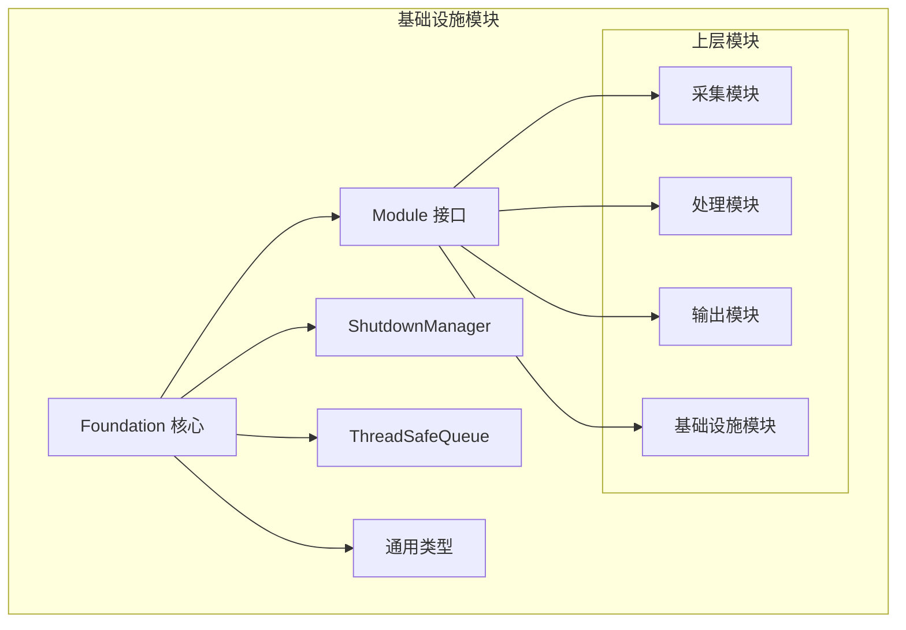
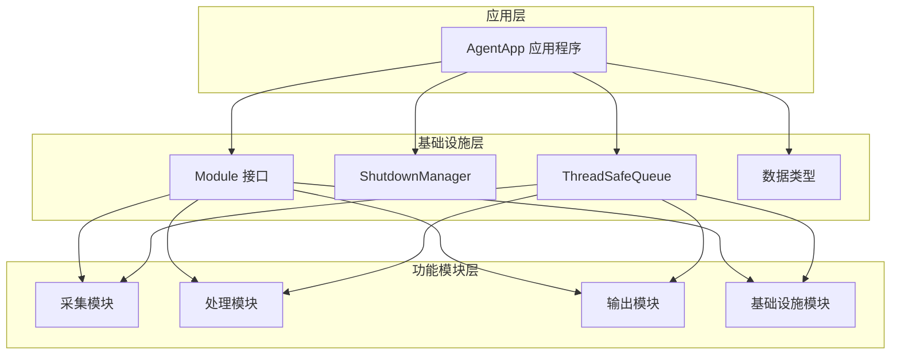
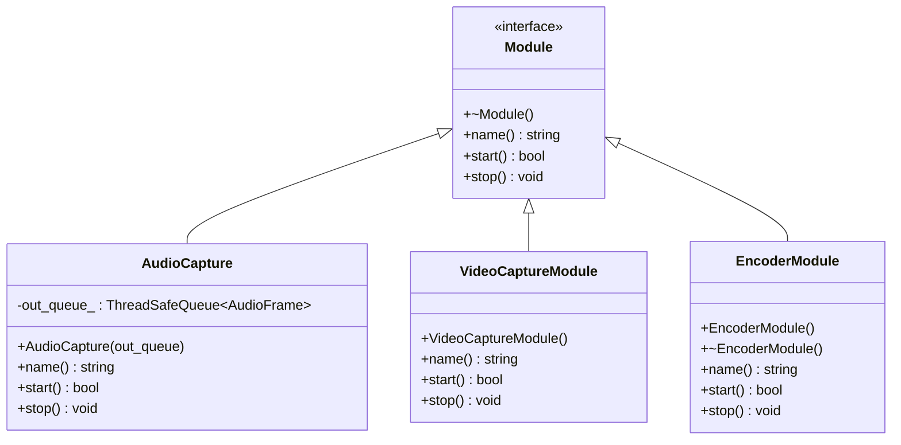
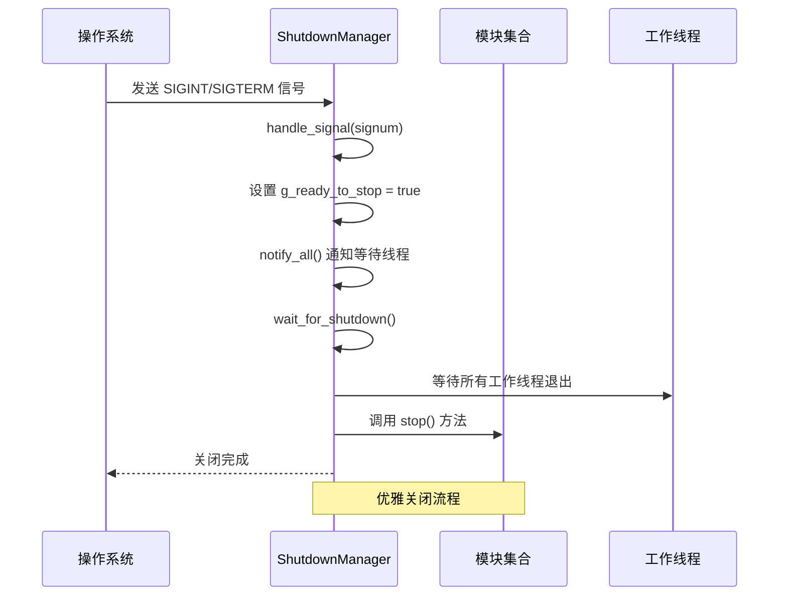
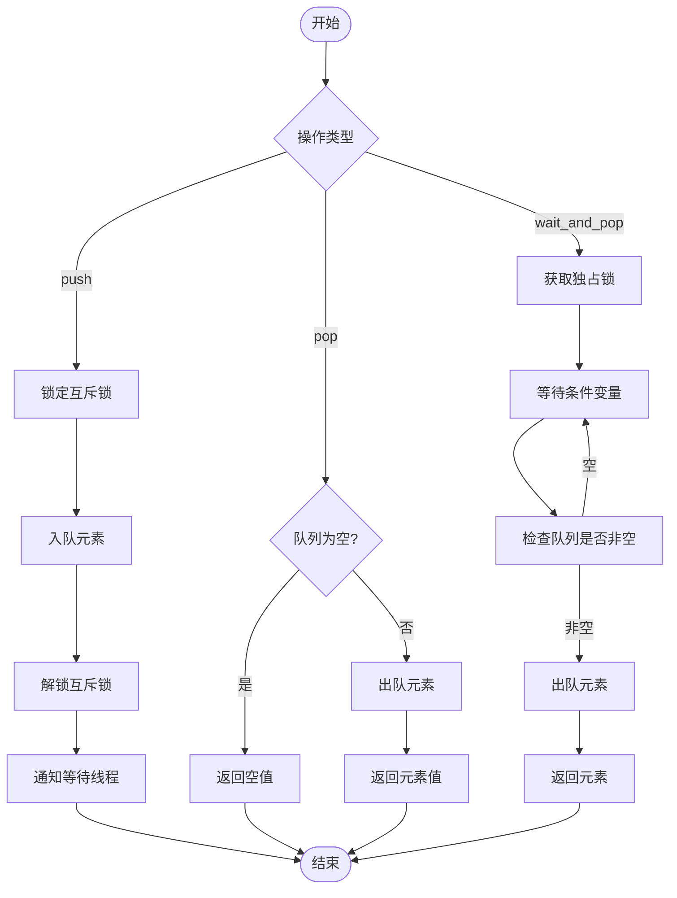
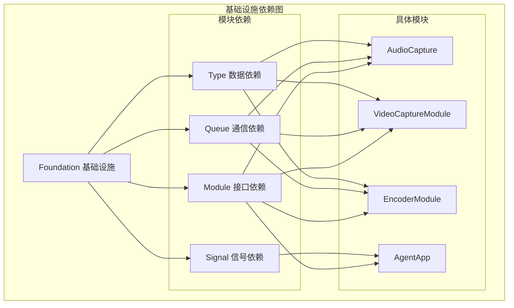
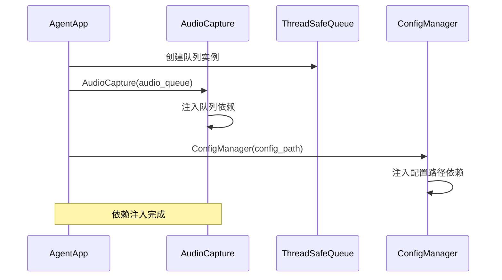

# 基础设施模块

<cite>
**本文档引用的文件**
- [module.hpp](file://project/agent/src/foundation/include/foundation/module.hpp)
- [shutdown_manager.hpp](file://project/agent/src/foundation/include/foundation/shutdown_manager.hpp)
- [shutdown_manager.cpp](file://project/agent/src/foundation/shutdown_manager.cpp)
- [thread_safe_queue.hpp](file://project/agent/src/foundation/include/foundation/thread_safe_queue.hpp)
- [types.hpp](file://project/agent/src/foundation/include/foundation/types.hpp)
- [audio_capture_module.hpp](file://project/agent/src/modules/capture/audio/include/capture_audio/audio_capture_module.hpp)
- [audio_capture_module.cpp](file://project/agent/src/modules/capture/audio/audio_capture_module.cpp)
- [video_capture_module.hpp](file://project/agent/src/modules/capture/video/include/capture_video/video_capture_module.hpp)
- [video_capture_module.cpp](file://project/agent/src/modules/capture/video/video_capture_module.cpp)
- [encoder_module.hpp](file://project/agent/src/modules/processing/encoder/include/processing_encoder/encoder_module.hpp)
- [encoder_module.cpp](file://project/agent/src/modules/processing/encoder/encoder_module.cpp)
- [agent_app.cpp](file://project/agent/src/runtime/app/agent_app.cpp)
- [thread_safe_queue_test.cpp](file://project/agent/tests/foundation/thread_safe_queue_test.cpp)
</cite>

## 目录
1. [简介](#简介)
2. [项目结构](#项目结构)
3. [核心组件](#核心组件)
4. [架构概览](#架构概览)
5. [详细组件分析](#详细组件分析)
6. [依赖关系分析](#依赖关系分析)
7. [性能考虑](#性能考虑)
8. [故障排除指南](#故障排除指南)
9. [结论](#结论)

## 简介

基础设施模块是整个系统的核心基础层，为上层功能模块提供了统一的抽象接口和通用的数据结构支持。该模块包含四个关键组件：Module 接口定义、ShutdownManager 优雅关闭机制、线程安全队列实现和通用类型定义。这些组件共同构成了一个可扩展、可维护的模块化架构，支撑着音视频采集、处理、传输等上层功能模块的开发和集成。

## 项目结构

基础设施模块位于 `project/agent/src/foundation/` 目录下，采用清晰的分层组织方式：



**图表来源**
- [module.hpp:1-17](file://project/agent/src/foundation/include/foundation/module.hpp#L1-L17)
- [shutdown_manager.hpp:1-12](file://project/agent/src/foundation/include/foundation/shutdown_manager.hpp#L1-L12)
- [thread_safe_queue.hpp:1-51](file://project/agent/src/foundation/include/foundation/thread_safe_queue.hpp#L1-L51)
- [types.hpp:1-39](file://project/agent/src/foundation/include/foundation/types.hpp#L1-L39)

**章节来源**
- [module.hpp:1-17](file://project/agent/src/foundation/include/foundation/module.hpp#L1-L17)
- [shutdown_manager.hpp:1-12](file://project/agent/src/foundation/include/foundation/shutdown_manager.hpp#L1-L12)
- [thread_safe_queue.hpp:1-51](file://project/agent/src/foundation/include/foundation/thread_safe_queue.hpp#L1-L51)
- [types.hpp:1-39](file://project/agent/src/foundation/include/foundation/types.hpp#L1-L39)

## 核心组件

基础设施模块由四个核心组件构成，每个组件都有其特定的设计职责和使用场景：

### Module 接口设计
Module 接口定义了所有模块的统一抽象，确保不同类型的模块可以以一致的方式进行管理。接口包含三个核心方法：
- `name()`: 返回模块名称，用于标识和日志记录
- `start()`: 启动模块，返回启动结果状态
- `stop()`: 停止模块，释放资源

### ShutdownManager 优雅关闭
ShutdownManager 提供了统一的信号处理和等待机制，支持 SIGINT 和 SIGTERM 信号，确保应用程序能够优雅地关闭所有模块和线程。

### ThreadSafeQueue 线程安全队列
基于模板的线程安全队列实现了生产者-消费者模式，提供了多种操作方法：
- `push()`: 非阻塞入队
- `pop()`: 非阻塞出队，返回空值表示队列为空
- `wait_and_pop()`: 阻塞式出队，直到有元素可用
- `size()`: 获取队列大小

### 通用类型定义
定义了事件、视频帧和音频帧等核心数据结构，为上层模块提供统一的数据交换格式。

**章节来源**
- [module.hpp:7-14](file://project/agent/src/foundation/include/foundation/module.hpp#L7-L14)
- [shutdown_manager.hpp:5-9](file://project/agent/src/foundation/include/foundation/shutdown_manager.hpp#L5-L9)
- [thread_safe_queue.hpp:10-48](file://project/agent/src/foundation/include/foundation/thread_safe_queue.hpp#L10-L48)
- [types.hpp:9-36](file://project/agent/src/foundation/include/foundation/types.hpp#L9-L36)

## 架构概览

基础设施模块采用模块化设计理念，通过统一的接口抽象和数据结构定义，为上层功能模块提供标准化的支持：



**图表来源**
- [agent_app.cpp:7-12](file://project/agent/src/runtime/app/agent_app.cpp#L7-L12)
- [module.hpp:7-14](file://project/agent/src/foundation/include/foundation/module.hpp#L7-L14)
- [thread_safe_queue.hpp:10-48](file://project/agent/src/foundation/include/foundation/thread_safe_queue.hpp#L10-L48)

## 详细组件分析

### Module 接口实现分析

Module 接口是整个基础设施模块的核心抽象，定义了所有模块必须实现的标准接口：



**图表来源**
- [module.hpp:7-14](file://project/agent/src/foundation/include/foundation/module.hpp#L7-L14)
- [audio_capture_module.hpp:11-21](file://project/agent/src/modules/capture/audio/include/capture_audio/audio_capture_module.hpp#L11-L21)
- [video_capture_module.cpp:13-22](file://project/agent/src/modules/capture/video/video_capture_module.cpp#L13-L22)
- [encoder_module.hpp:9-18](file://project/agent/src/modules/processing/encoder/include/processing_encoder/encoder_module.hpp#L9-L18)

#### 接口设计特点
- **虚析构函数**: 确保派生类对象正确销毁
- **纯虚函数**: 强制派生类实现必需的方法
- **无参数构造**: 简化模块实例化的复杂度
- **返回值设计**: start() 返回布尔值表示启动成功与否

**章节来源**
- [module.hpp:7-14](file://project/agent/src/foundation/include/foundation/module.hpp#L7-L14)
- [audio_capture_module.hpp:11-21](file://project/agent/src/modules/capture/audio/include/capture_audio/audio_capture_module.hpp#L11-L21)
- [video_capture_module.cpp:13-22](file://project/agent/src/modules/capture/video/video_capture_module.cpp#L13-L22)
- [encoder_module.hpp:9-18](file://project/agent/src/modules/processing/encoder/include/processing_encoder/encoder_module.hpp#L9-L18)

### ShutdownManager 优雅关闭机制

ShutdownManager 实现了统一的信号处理和等待机制，确保应用程序能够优雅地关闭：



**图表来源**
- [shutdown_manager.cpp:16-33](file://project/agent/src/foundation/shutdown_manager.cpp#L16-L33)

#### 关键实现细节
- **静态成员函数**: 提供全局访问点，无需实例化
- **原子标志位**: 使用 memory_order_release/acquire 确保内存可见性
- **条件变量**: 支持多线程同步等待
- **信号处理**: 仅响应 SIGINT 和 SIGTERM 信号

**章节来源**
- [shutdown_manager.hpp:5-9](file://project/agent/src/foundation/include/foundation/shutdown_manager.hpp#L5-L9)
- [shutdown_manager.cpp:16-33](file://project/agent/src/foundation/shutdown_manager.cpp#L16-L33)

### 线程安全队列实现

ThreadSafeQueue 是基础设施模块的核心通信组件，实现了生产者-消费者模式：



**图表来源**
- [thread_safe_queue.hpp:13-37](file://project/agent/src/foundation/include/foundation/thread_safe_queue.hpp#L13-L37)

#### 设计模式分析
- **RAII 模式**: 使用 lock_guard 自动管理锁的生命周期
- **生产者-消费者模式**: 支持多生产者多消费者场景
- **条件变量**: 实现高效的等待-唤醒机制
- **模板设计**: 支持任意类型的安全队列

**章节来源**
- [thread_safe_queue.hpp:10-48](file://project/agent/src/foundation/include/foundation/thread_safe_queue.hpp#L10-L48)

### 通用类型定义

基础设施模块定义了统一的数据交换格式，确保各模块间的数据一致性：

```mermaid
erDiagram
EVENT {
EventType type
int64 timestamp_ms
string payload
}
VIDEO_FRAME {
int64 pts_ms
int width
int height
vector<uint8> data
}
AUDIO_FRAME {
int64 pts_ms
int sample_rate
int channels
vector<int16> samples
}
EVENT ||--|| VIDEO_FRAME : "包含"
EVENT ||--|| AUDIO_FRAME : "包含"
```

**图表来源**
- [types.hpp:18-36](file://project/agent/src/foundation/include/foundation/types.hpp#L18-L36)

#### 类型设计特点
- **EventType 枚举**: 定义了运动检测、录制控制、连接状态等事件类型
- **VideoFrame 结构**: 包含时间戳、分辨率和像素数据
- **AudioFrame 结构**: 包含采样率、声道数和音频样本
- **Event 结构**: 统一的事件载体，包含类型、时间戳和载荷

**章节来源**
- [types.hpp:9-36](file://project/agent/src/foundation/include/foundation/types.hpp#L9-L36)

## 依赖关系分析

基础设施模块与上层功能模块之间形成了清晰的依赖关系：



**图表来源**
- [audio_capture_module.hpp:5-7](file://project/agent/src/modules/capture/audio/include/capture_audio/audio_capture_module.hpp#L5-L7)
- [video_capture_module.cpp:3-5](file://project/agent/src/modules/capture/video/video_capture_module.cpp#L3-L5)
- [encoder_module.hpp](file://project/agent/src/modules/processing/encoder/include/processing_encoder/encoder_module.hpp#L6)
- [agent_app.cpp:1-5](file://project/agent/src/runtime/app/agent_app.cpp#L1-L5)

### 依赖注入模式

基础设施模块采用了依赖注入的设计模式，通过构造函数参数传递依赖关系：



**图表来源**
- [agent_app.cpp:7-12](file://project/agent/src/runtime/app/agent_app.cpp#L7-L12)
- [audio_capture_module.hpp](file://project/agent/src/modules/capture/audio/include/capture_audio/audio_capture_module.hpp#L13)

**章节来源**
- [audio_capture_module.hpp:5-7](file://project/agent/src/modules/capture/audio/include/capture_audio/audio_capture_module.hpp#L5-L7)
- [video_capture_module.cpp:3-5](file://project/agent/src/modules/capture/video/video_capture_module.cpp#L3-L5)
- [encoder_module.hpp](file://project/agent/src/modules/processing/encoder/include/processing_encoder/encoder_module.hpp#L6)
- [agent_app.cpp:7-12](file://project/agent/src/runtime/app/agent_app.cpp#L7-L12)

## 性能考虑

基础设施模块在设计时充分考虑了性能优化：

### 线程安全队列性能特性
- **最小锁粒度**: push 操作使用 lock_guard，pop 操作直接返回，减少锁竞争
- **条件变量优化**: wait_and_pop 使用 unique_lock 和谓词，避免虚假唤醒
- **内存管理**: 使用移动语义减少不必要的拷贝操作

### 模块启动顺序优化
- **并行启动**: AgentApp 中多个模块可以并行启动
- **资源预分配**: 在构造函数中完成必要的资源分配
- **懒加载策略**: 按需启动模块，减少启动时间

### 内存使用优化
- **智能指针**: 使用 shared_ptr 管理模块生命周期
- **RAII 模式**: 自动资源管理，避免内存泄漏
- **模板特化**: 编译时优化，减少运行时开销

## 故障排除指南

### 常见问题及解决方案

#### 线程安全队列问题
- **问题**: 多线程环境下数据竞争
- **解决方案**: 确保使用 ThreadSafeQueue 的线程安全方法
- **验证**: 参考单元测试中的并发场景

#### 模块启动失败
- **问题**: start() 方法返回 false
- **解决方案**: 检查模块依赖是否正确初始化
- **调试**: 查看模块的 name() 返回值进行识别

#### 优雅关闭异常
- **问题**: 程序无法正常退出
- **解决方案**: 确保所有模块都正确实现 stop() 方法
- **验证**: 检查 ShutdownManager 的信号处理是否正常

**章节来源**
- [thread_safe_queue_test.cpp:13-39](file://project/agent/tests/foundation/thread_safe_queue_test.cpp#L13-L39)

## 结论

基础设施模块通过精心设计的接口抽象、优雅的关闭机制、可靠的线程安全通信和标准化的数据格式，为整个系统的稳定运行奠定了坚实基础。该模块的设计体现了以下核心价值：

1. **统一抽象**: Module 接口确保了模块间的一致性和可替换性
2. **可靠通信**: ThreadSafeQueue 提供了高效的跨线程数据传递
3. **优雅关闭**: ShutdownManager 确保了系统的稳定退出
4. **标准化数据**: 通用类型定义促进了模块间的协作

这些基础设施为上层功能模块（如音视频采集、处理、传输等）提供了强大的支撑，使得开发者可以专注于业务逻辑的实现，而不必担心底层的基础设施问题。通过遵循这些基础设施的设计原则，新的功能模块可以轻松地集成到现有系统中，形成一个高度模块化、可扩展的完整解决方案。