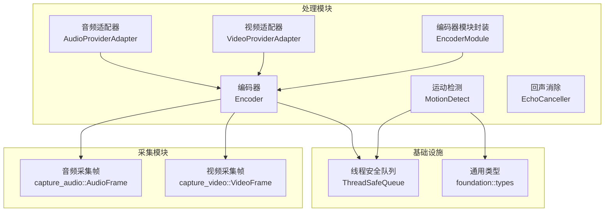
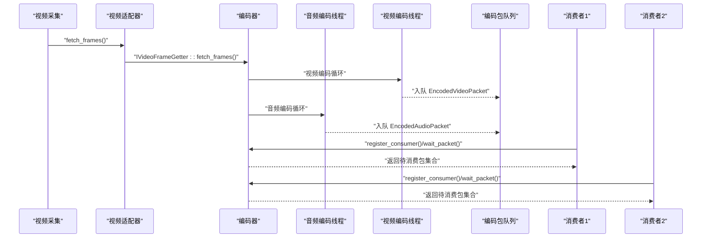
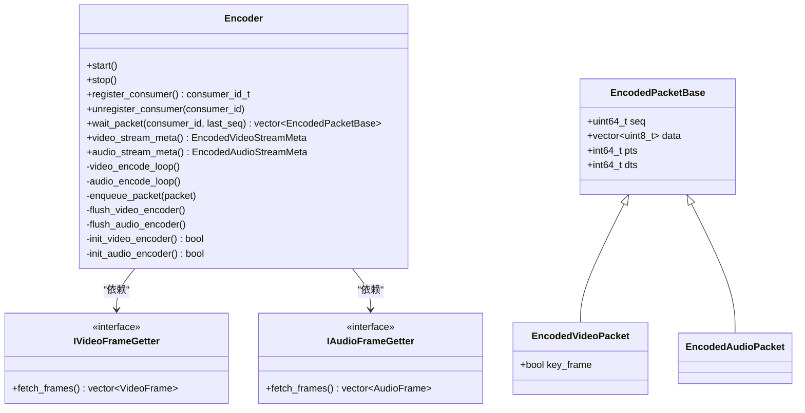
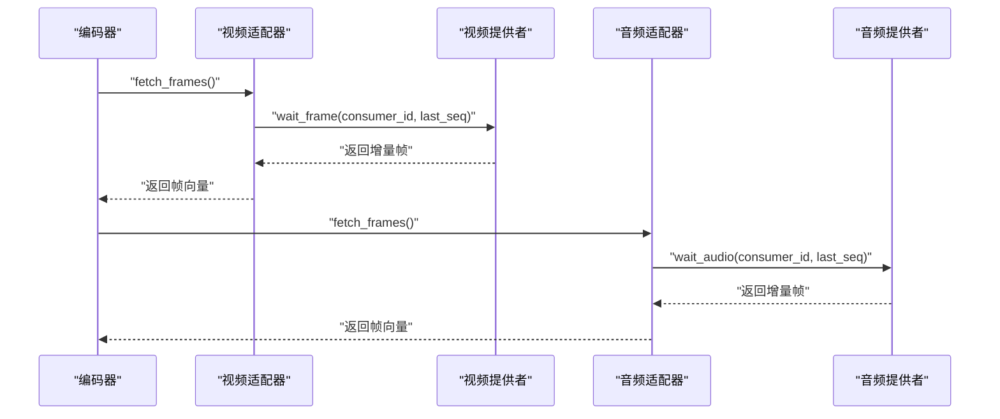
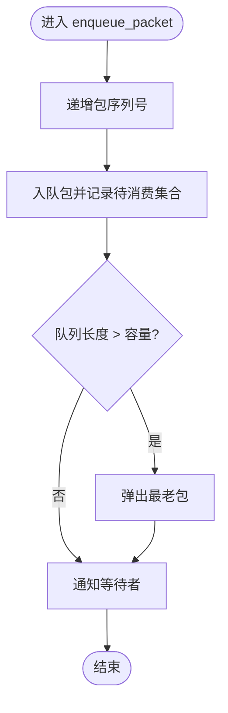
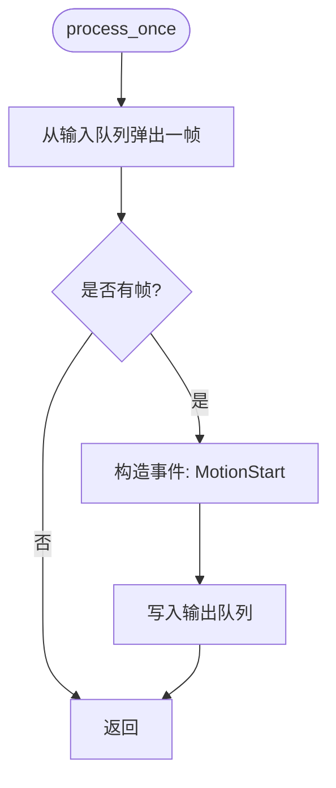
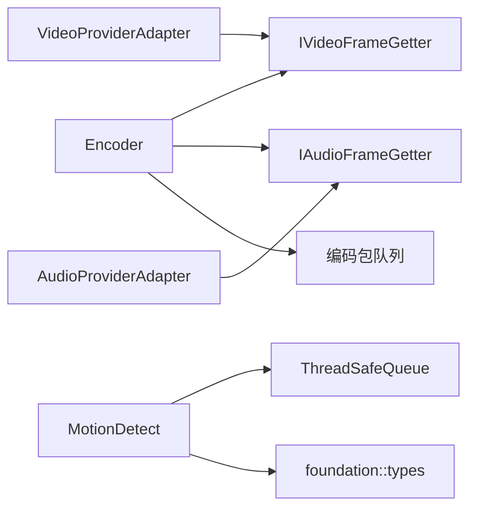

# 处理模块

<cite>
**本文引用的文件**
- [encoder.cpp](file://project/agent/src/modules/processing/encoder/encoder.cpp)
- [encoder.hpp](file://project/agent/src/modules/processing/encoder/include/processing_encoder/encoder.hpp)
- [encoder_types.hpp](file://project/agent/src/modules/processing/encoder/include/processing_encoder/encoder_types.hpp)
- [audio_provider_adapter.cpp](file://project/agent/src/modules/processing/encoder/audio_provider_adapter.cpp)
- [video_provider_adapter.cpp](file://project/agent/src/modules/processing/encoder/video_provider_adapter.cpp)
- [audio_provider_adapter.hpp](file://project/agent/src/modules/processing/encoder/include/processing_encoder/audio_provider_adapter.hpp)
- [video_provider_adapter.hpp](file://project/agent/src/modules/processing/encoder/include/processing_encoder/video_provider_adapter.hpp)
- [encoder_module.cpp](file://project/agent/src/modules/processing/encoder/encoder_module.cpp)
- [motion_detect.cpp](file://project/agent/src/modules/processing/motion_detect/motion_detect.cpp)
- [motion_detect.hpp](file://project/agent/src/modules/processing/motion_detect/include/processing_motion_detect/motion_detect.hpp)
- [echo_canceller.cpp](file://project/agent/src/modules/processing/echo_canceller/echo_canceller.cpp)
- [echo_canceller.hpp](file://project/agent/src/modules/processing/echo_canceller/include/processing_echo_canceller/echo_canceller.hpp)
- [thread_safe_queue.hpp](file://project/agent/src/foundation/include/foundation/thread_safe_queue.hpp)
- [types.hpp](file://project/agent/src/foundation/include/foundation/types.hpp)
- [audio_frame.hpp](file://project/agent/src/modules/capture/audio/include/capture_audio/audio_frame.hpp)
- [video_frame.hpp](file://project/agent/src/modules/capture/video/include/capture_video/video_frame.hpp)
</cite>

## 目录
1. [简介](#简介)
2. [项目结构](#项目结构)
3. [核心组件](#核心组件)
4. [架构总览](#架构总览)
5. [详细组件分析](#详细组件分析)
6. [依赖关系分析](#依赖关系分析)
7. [性能考虑](#性能考虑)
8. [故障排查指南](#故障排查指南)
9. [结论](#结论)
10. [附录](#附录)

## 简介
本文件面向“处理模块”的技术文档，聚焦以下能力：
- 编码模块：基于 FFmpeg 的 H.264/AAC 编码实现，含视频像素格式转换、音频重采样与打包、多消费者队列分发。
- 运动检测模块：基于线程安全队列的简单运动事件生成器（当前为占位实现，输出固定事件）。
- 回声消除模块：占位实现，预留扩展空间。

文档同时解释适配器模式在音频/视频提供者中的应用、多消费者队列的处理机制，并给出性能调优、内存管理与实时性保障策略。

## 项目结构
处理模块位于 agent 子工程的 processing 目录下，按功能划分为：
- 编码子模块：包含编码器主体、适配器、模块封装与类型定义。
- 运动检测子模块：包含检测器实现与接口声明。
- 回声消除子模块：包含回声消除器实现与接口声明。
- 基础设施：线程安全队列与通用类型定义。

图表来源
- [encoder.cpp:1-606](file://project/agent/src/modules/processing/encoder/encoder.cpp#L1-L606)
- [encoder.hpp:1-90](file://project/agent/src/modules/processing/encoder/include/processing_encoder/encoder.hpp#L1-L90)
- [audio_provider_adapter.cpp:1-23](file://project/agent/src/modules/processing/encoder/audio_provider_adapter.cpp#L1-L23)
- [video_provider_adapter.cpp:1-23](file://project/agent/src/modules/processing/encoder/video_provider_adapter.cpp#L1-L23)
- [encoder_module.cpp:1-23](file://project/agent/src/modules/processing/encoder/encoder_module.cpp#L1-L23)
- [motion_detect.cpp:1-34](file://project/agent/src/modules/processing/motion_detect/motion_detect.cpp#L1-L34)
- [echo_canceller.cpp:1-21](file://project/agent/src/modules/processing/echo_canceller/echo_canceller.cpp#L1-L21)
- [thread_safe_queue.hpp:1-51](file://project/agent/src/foundation/include/foundation/thread_safe_queue.hpp#L1-L51)
- [types.hpp:1-39](file://project/agent/src/foundation/include/foundation/types.hpp#L1-L39)
- [audio_frame.hpp:1-18](file://project/agent/src/modules/capture/audio/include/capture_audio/audio_frame.hpp#L1-L18)
- [video_frame.hpp:1-23](file://project/agent/src/modules/capture/video/include/capture_video/video_frame.hpp#L1-L23)

章节来源
- [encoder.cpp:1-606](file://project/agent/src/modules/processing/encoder/encoder.cpp#L1-L606)
- [encoder.hpp:1-90](file://project/agent/src/modules/processing/encoder/include/processing_encoder/encoder.hpp#L1-L90)
- [encoder_types.hpp:1-75](file://project/agent/src/modules/processing/encoder/include/processing_encoder/encoder_types.hpp#L1-L75)
- [audio_provider_adapter.cpp:1-23](file://project/agent/src/modules/processing/encoder/audio_provider_adapter.cpp#L1-L23)
- [video_provider_adapter.cpp:1-23](file://project/agent/src/modules/processing/encoder/video_provider_adapter.cpp#L1-L23)
- [encoder_module.cpp:1-23](file://project/agent/src/modules/processing/encoder/encoder_module.cpp#L1-L23)
- [motion_detect.cpp:1-34](file://project/agent/src/modules/processing/motion_detect/motion_detect.cpp#L1-L34)
- [echo_canceller.cpp:1-21](file://project/agent/src/modules/processing/echo_canceller/echo_canceller.cpp#L1-L21)
- [thread_safe_queue.hpp:1-51](file://project/agent/src/foundation/include/foundation/thread_safe_queue.hpp#L1-L51)
- [types.hpp:1-39](file://project/agent/src/foundation/include/foundation/types.hpp#L1-L39)
- [audio_frame.hpp:1-18](file://project/agent/src/modules/capture/audio/include/capture_audio/audio_frame.hpp#L1-L18)
- [video_frame.hpp:1-23](file://project/agent/src/modules/capture/video/include/capture_video/video_frame.hpp#L1-L23)

## 核心组件
- 编码器（Encoder）
  - 负责初始化并运行视频/音频编码线程，使用 FFmpeg 完成 H.264/H.265（当前硬编码为 H.264）、AAC 编码与打包。
  - 提供注册消费者、等待并分发编码后的包、查询媒体元信息等接口。
  - 关键实现路径：[编码器主实现:1-606](file://project/agent/src/modules/processing/encoder/encoder.cpp#L1-L606)、[类型与接口:1-75](file://project/agent/src/modules/processing/encoder/include/processing_encoder/encoder_types.hpp#L1-L75)、[类声明:1-90](file://project/agent/src/modules/processing/encoder/include/processing_encoder/encoder.hpp#L1-L90)。
- 音频/视频提供者适配器（AudioProviderAdapter、VideoProviderAdapter）
  - 将采集模块的提供者对象适配为编码器期望的 IAudioFrameGetter/IVideoFrameGetter 接口，负责消费者注册与按序列号拉取帧。
  - 关键实现路径：[音频适配器:1-23](file://project/agent/src/modules/processing/encoder/audio_provider_adapter.cpp#L1-L23)、[视频适配器:1-23](file://project/agent/src/modules/processing/encoder/video_provider_adapter.cpp#L1-L23)、[接口声明:1-29](file://project/agent/src/modules/processing/encoder/include/processing_encoder/audio_provider_adapter.hpp#L1-L29)、[接口声明:1-29](file://project/agent/src/modules/processing/encoder/include/processing_encoder/video_provider_adapter.hpp#L1-L29)。
- 编码器模块封装（EncoderModule）
  - 模块生命周期管理（启动/停止），当前为空实现，便于后续扩展。
  - 关键实现路径：[模块封装:1-23](file://project/agent/src/modules/processing/encoder/encoder_module.cpp#L1-L23)。
- 运动检测（MotionDetect）
  - 基于线程安全队列的简单事件生成器，当前输出固定“运动开始”事件，用于演示数据流与事件分发。
  - 关键实现路径：[检测器:1-34](file://project/agent/src/modules/processing/motion_detect/motion_detect.cpp#L1-L34)、[接口声明:1-28](file://project/agent/src/modules/processing/motion_detect/include/processing_motion_detect/motion_detect.hpp#L1-L28)。
- 回声消除（EchoCanceller）
  - 占位实现，当前不进行任何处理，预留扩展空间。
  - 关键实现路径：[回声消除器:1-21](file://project/agent/src/modules/processing/echo_canceller/echo_canceller.cpp#L1-L21)、[接口声明:1-22](file://project/agent/src/modules/processing/echo_canceller/include/processing_echo_canceller/echo_canceller.hpp#L1-L22)。

章节来源
- [encoder.cpp:1-606](file://project/agent/src/modules/processing/encoder/encoder.cpp#L1-L606)
- [encoder.hpp:1-90](file://project/agent/src/modules/processing/encoder/include/processing_encoder/encoder.hpp#L1-L90)
- [encoder_types.hpp:1-75](file://project/agent/src/modules/processing/encoder/include/processing_encoder/encoder_types.hpp#L1-L75)
- [audio_provider_adapter.cpp:1-23](file://project/agent/src/modules/processing/encoder/audio_provider_adapter.cpp#L1-L23)
- [video_provider_adapter.cpp:1-23](file://project/agent/src/modules/processing/encoder/video_provider_adapter.cpp#L1-L23)
- [encoder_module.cpp:1-23](file://project/agent/src/modules/processing/encoder/encoder_module.cpp#L1-L23)
- [motion_detect.cpp:1-34](file://project/agent/src/modules/processing/motion_detect/motion_detect.cpp#L1-L34)
- [echo_canceller.cpp:1-21](file://project/agent/src/modules/processing/echo_canceller/echo_canceller.cpp#L1-L21)

## 架构总览
编码器采用“生产者-消费者-分发器”架构：
- 视频/音频采集线程从硬件/设备获取原始帧。
- 适配器将帧转换为编码器可用的接口形式。
- 编码线程完成像素格式转换、编码与打包，生成编码包。
- 多个消费者通过序列号感知最新包并进行消费。
- 运动检测与回声消除作为独立处理单元接入数据流。

图表来源
- [encoder.cpp:267-583](file://project/agent/src/modules/processing/encoder/encoder.cpp#L267-L583)
- [video_provider_adapter.cpp:1-23](file://project/agent/src/modules/processing/encoder/video_provider_adapter.cpp#L1-L23)
- [audio_provider_adapter.cpp:1-23](file://project/agent/src/modules/processing/encoder/audio_provider_adapter.cpp#L1-L23)

## 详细组件分析

### 编码器（Encoder）
- 功能职责
  - 初始化并打开 H.264 视频编码器与 AAC 音频编码器，设置分辨率、帧率、比特率、通道布局等参数。
  - 使用 swscale 进行 YUYV422 到 YUV420P 的像素格式转换；使用 swresample 进行音频重采样与格式转换。
  - 维护音视频 PTS 基准，确保与采集端统一时间轴。
  - 提供多消费者队列：每个编码包记录序列号与待消费集合，消费者按 last_seq 过滤未消费包。
  - 支持优雅停止与刷新：停止前清空剩余包，关闭上下文。
- 关键数据结构与复杂度
  - 编码包队列：双端队列，入队 O(1)，出队 O(1)，容量受选项控制，超限丢弃最老包。
  - 消费者集合：哈希集合，注册/注销 O(1)，过滤 O(N)（N 为队列长度）。
- 错误处理与边界条件
  - 编码器初始化失败、FFmpeg 上下文分配失败、sws/swr 初始化失败均会记录日志并回滚。
  - 对空帧、不可写帧、缓冲区不足等情况进行跳过与告警。
- 性能影响因素
  - 线程模型：视频/音频分别独立线程，避免相互阻塞。
  - 队列容量：过小导致频繁丢包，过大增加内存占用。
  - PTS 计算：依赖 steady_clock 时间戳，需保证采集端与编码端时间基准一致。

图表来源
- [encoder.hpp:1-90](file://project/agent/src/modules/processing/encoder/include/processing_encoder/encoder.hpp#L1-L90)
- [encoder_types.hpp:1-75](file://project/agent/src/modules/processing/encoder/include/processing_encoder/encoder_types.hpp#L1-L75)

章节来源
- [encoder.cpp:1-606](file://project/agent/src/modules/processing/encoder/encoder.cpp#L1-L606)
- [encoder.hpp:1-90](file://project/agent/src/modules/processing/encoder/include/processing_encoder/encoder.hpp#L1-L90)
- [encoder_types.hpp:1-75](file://project/agent/src/modules/processing/encoder/include/processing_encoder/encoder_types.hpp#L1-L75)

### 音频/视频提供者适配器（Adapter 模式）
- 设计动机
  - 采集模块提供者与编码器期望的接口不一致，需要通过适配器桥接。
  - 适配器负责消费者注册、序列号跟踪与按需拉取帧。
- 实现要点
  - 注册消费者后，提供者内部维护消费者 ID 与 last_seq，编码器通过 wait_frame/wait_audio 获取增量帧。
  - 适配器在析构时自动注销消费者，避免资源泄漏。
- 适用场景
  - 任意新的提供者只需实现对应接口，即可无缝接入编码器。

图表来源
- [video_provider_adapter.cpp:1-23](file://project/agent/src/modules/processing/encoder/video_provider_adapter.cpp#L1-L23)
- [audio_provider_adapter.cpp:1-23](file://project/agent/src/modules/processing/encoder/audio_provider_adapter.cpp#L1-L23)
- [video_provider_adapter.hpp:1-29](file://project/agent/src/modules/processing/encoder/include/processing_encoder/video_provider_adapter.hpp#L1-L29)
- [audio_provider_adapter.hpp:1-29](file://project/agent/src/modules/processing/encoder/include/processing_encoder/audio_provider_adapter.hpp#L1-L29)

章节来源
- [video_provider_adapter.cpp:1-23](file://project/agent/src/modules/processing/encoder/video_provider_adapter.cpp#L1-L23)
- [audio_provider_adapter.cpp:1-23](file://project/agent/src/modules/processing/encoder/audio_provider_adapter.cpp#L1-L23)
- [video_provider_adapter.hpp:1-29](file://project/agent/src/modules/processing/encoder/include/processing_encoder/video_provider_adapter.hpp#L1-L29)
- [audio_provider_adapter.hpp:1-29](file://project/agent/src/modules/processing/encoder/include/processing_encoder/audio_provider_adapter.hpp#L1-L29)

### 多消费者队列与分发机制
- 序列号与去重
  - 每个编码包携带自增序列号；消费者以 last_seq 为游标，仅接收大于 last_seq 的包。
- 待消费集合
  - 每个包记录“待消费消费者集合”，当集合为空时从队列移除，避免内存膨胀。
- 等待与通知
  - wait_packet 使用条件变量等待“有新包可取”或“停止”，避免忙等。
- 容量控制
  - 当队列长度超过配置上限时，丢弃最老包，保证实时性优先。

图表来源
- [encoder.cpp:512-522](file://project/agent/src/modules/processing/encoder/encoder.cpp#L512-L522)

章节来源
- [encoder.cpp:512-583](file://project/agent/src/modules/processing/encoder/encoder.cpp#L512-L583)
- [encoder_types.hpp:39-47](file://project/agent/src/modules/processing/encoder/include/processing_encoder/encoder_types.hpp#L39-L47)

### FFmpeg 集成与编解码配置
- 视频编码（H.264）
  - 编码器：H.264（硬编码为 H.264，当前未暴露外部选择）。
  - 参数：分辨率、帧率、比特率、GOP、B 帧、像素格式（YUV420P）、全局头标志。
  - 优化选项：preset=veryfast、tune=zerolatency，降低延迟，适合实时推流。
  - 像素格式转换：YUYV422 -> YUV420P，使用 sws_getContext。
- 音频编码（AAC）
  - 编码器：AAC。
  - 参数：采样率、比特率、声道布局（单声道/立体声）、时间基、全局头标志。
  - 重采样：当编码采样格式非 S16/S16P 时，使用 swr_alloc_set_opts2 进行重采样。
- PTS 计算
  - 以程序启动时间为基准（steady_clock），将采集时间戳换算到各编解码器 time_base，保证音视频同步。

章节来源
- [encoder.cpp:56-138](file://project/agent/src/modules/processing/encoder/encoder.cpp#L56-L138)
- [encoder.cpp:140-227](file://project/agent/src/modules/processing/encoder/encoder.cpp#L140-L227)
- [encoder.cpp:395-419](file://project/agent/src/modules/processing/encoder/encoder.cpp#L395-L419)
- [encoder.cpp:473-489](file://project/agent/src/modules/processing/encoder/encoder.cpp#L473-L489)

### 运动检测模块
- 实现现状
  - 从输入队列取出一帧，构造“运动开始”事件并写入输出队列。
  - 当前为占位实现，未进行实际的帧间差分或阈值判断。
- 可扩展方向
  - 帧差分：计算相邻帧的绝对差值，统计超过阈值的像素数量。
  - 运动区域掩膜：对感兴趣区域进行加权，减少误检。
  - 状态机：区分“运动开始/持续/结束”，并输出对应事件。

图表来源
- [motion_detect.cpp:18-31](file://project/agent/src/modules/processing/motion_detect/motion_detect.cpp#L18-L31)
- [motion_detect.hpp:1-28](file://project/agent/src/modules/processing/motion_detect/include/processing_motion_detect/motion_detect.hpp#L1-L28)
- [types.hpp:9-16](file://project/agent/src/foundation/include/foundation/types.hpp#L9-L16)

章节来源
- [motion_detect.cpp:1-34](file://project/agent/src/modules/processing/motion_detect/motion_detect.cpp#L1-L34)
- [motion_detect.hpp:1-28](file://project/agent/src/modules/processing/motion_detect/include/processing_motion_detect/motion_detect.hpp#L1-L28)
- [types.hpp:1-39](file://project/agent/src/foundation/include/foundation/types.hpp#L1-L39)

### 回声消除模块
- 实现现状
  - 占位实现，start/stop 控制运行状态，process_once 不做任何处理。
- 数字信号处理建议
  - 参考实现思路：FIR/IIR 滤波器设计、自适应滤波（LMS/RLS）、回声路径估计、静音检测（VAD）。
  - 输入/输出接口：以 AudioFrame 为单位，支持单声道/立体声，采样率与编码器一致。

章节来源
- [echo_canceller.cpp:1-21](file://project/agent/src/modules/processing/echo_canceller/echo_canceller.cpp#L1-L21)
- [echo_canceller.hpp:1-22](file://project/agent/src/modules/processing/echo_canceller/include/processing_echo_canceller/echo_canceller.hpp#L1-L22)

## 依赖关系分析
- 组件耦合
  - 编码器依赖 IVideoFrameGetter/IAudioFrameGetter 接口，通过适配器与采集模块解耦。
  - 运动检测与回声消除作为独立模块，通过事件与数据流与其他模块交互。
- 外部依赖
  - FFmpeg：libavcodec/libavutil/libswscale/libswresample。
  - 基础设施：线程安全队列、通用类型定义。
- 潜在环路
  - 当前模块间无直接循环依赖；适配器仅单向依赖提供者。

图表来源
- [encoder.hpp:1-90](file://project/agent/src/modules/processing/encoder/include/processing_encoder/encoder.hpp#L1-L90)
- [video_provider_adapter.hpp:1-29](file://project/agent/src/modules/processing/encoder/include/processing_encoder/video_provider_adapter.hpp#L1-L29)
- [audio_provider_adapter.hpp:1-29](file://project/agent/src/modules/processing/encoder/include/processing_encoder/audio_provider_adapter.hpp#L1-L29)
- [motion_detect.hpp:1-28](file://project/agent/src/modules/processing/motion_detect/include/processing_motion_detect/motion_detect.hpp#L1-L28)
- [thread_safe_queue.hpp:1-51](file://project/agent/src/foundation/include/foundation/thread_safe_queue.hpp#L1-L51)
- [types.hpp:1-39](file://project/agent/src/foundation/include/foundation/types.hpp#L1-L39)

章节来源
- [encoder.hpp:1-90](file://project/agent/src/modules/processing/encoder/include/processing_encoder/encoder.hpp#L1-L90)
- [video_provider_adapter.hpp:1-29](file://project/agent/src/modules/processing/encoder/include/processing_encoder/video_provider_adapter.hpp#L1-L29)
- [audio_provider_adapter.hpp:1-29](file://project/agent/src/modules/processing/encoder/include/processing_encoder/audio_provider_adapter.hpp#L1-L29)
- [motion_detect.hpp:1-28](file://project/agent/src/modules/processing/motion_detect/include/processing_motion_detect/motion_detect.hpp#L1-L28)
- [thread_safe_queue.hpp:1-51](file://project/agent/src/foundation/include/foundation/thread_safe_queue.hpp#L1-L51)
- [types.hpp:1-39](file://project/agent/src/foundation/include/foundation/types.hpp#L1-L39)

## 性能考虑
- 实时性保障
  - 编码线程分离：视频/音频独立线程，避免互相阻塞。
  - 队列容量限制：防止积压导致延迟累积；根据目标帧率与缓冲需求调整。
  - 丢包策略：超限时丢弃最老包，保证“最新优先”。
- 内存管理
  - FFmpeg 上下文与帧/包在停止时显式释放，避免泄漏。
  - 适配器在析构时注销消费者，确保提供者内部资源回收。
- 编码参数调优
  - 视频：降低 GOP、启用 zerolatency 预设；根据带宽动态调整比特率。
  - 音频：保持与采集一致的采样率与声道布局，必要时启用轻量重采样。
- 时间同步
  - 统一以 steady_clock 为基准，PTS 换算到各编解码器 time_base，避免漂移。

[本节为通用指导，无需列出具体文件来源]

## 故障排查指南
- 编码器初始化失败
  - 现象：日志报错“video encoder not found”或“failed to open video encoder”。
  - 排查：确认系统已安装 FFmpeg 开发库，编码器 ID 是否正确。
  - 参考路径：[视频初始化:56-138](file://project/agent/src/modules/processing/encoder/encoder.cpp#L56-L138)、[音频初始化:140-227](file://project/agent/src/modules/processing/encoder/encoder.cpp#L140-L227)。
- 像素格式/重采样错误
  - 现象：日志提示“failed to create sws context”或“failed to init swr context”。
  - 排查：检查输入/输出像素格式与声道布局，确认 sws/swr 参数组合。
  - 参考路径：[像素格式转换:105-118](file://project/agent/src/modules/processing/encoder/encoder.cpp#L105-L118)、[重采样初始化:187-206](file://project/agent/src/modules/processing/encoder/encoder.cpp#L187-L206)。
- 音频缓冲区异常
  - 现象：日志提示“send frame failed, clearing buffer”或“unsupported sample fmt”。
  - 排查：确认音频采样格式与通道数配置，避免不支持的格式。
  - 参考路径：[音频编码循环:422-510](file://project/agent/src/modules/processing/encoder/encoder.cpp#L422-L510)。
- 多消费者队列溢出
  - 现象：日志出现“packet queue overflow, dropped oldest packet”。
  - 排查：提高队列容量或加快消费者消费速度。
  - 参考路径：[队列溢出处理:517-521](file://project/agent/src/modules/processing/encoder/encoder.cpp#L517-L521)。

章节来源
- [encoder.cpp:56-227](file://project/agent/src/modules/processing/encoder/encoder.cpp#L56-L227)
- [encoder.cpp:422-510](file://project/agent/src/modules/processing/encoder/encoder.cpp#L422-L510)
- [encoder.cpp:517-521](file://project/agent/src/modules/processing/encoder/encoder.cpp#L517-L521)

## 结论
处理模块以编码器为核心，结合适配器模式与多消费者队列，实现了视频/音频的实时编码与分发；运动检测与回声消除作为可插拔组件，便于后续扩展。通过合理的线程模型、队列容量与 PTS 同步策略，可在保证实时性的前提下获得稳定的编码质量。

[本节为总结性内容，无需列出具体文件来源]

## 附录

### 编码参数配置参考路径
- 视频编码参数设置：[H.264 参数:73-81](file://project/agent/src/modules/processing/encoder/encoder.cpp#L73-L81)
- 音频编码参数设置：[AAC 参数:157-165](file://project/agent/src/modules/processing/encoder/encoder.cpp#L157-L165)
- 编码器优化选项：[预设与调优:83-84](file://project/agent/src/modules/processing/encoder/encoder.cpp#L83-L84)

### 适配器使用参考路径
- 视频适配器注册/注销：[注册与析构:7-12](file://project/agent/src/modules/processing/encoder/video_provider_adapter.cpp#L7-L12)
- 音频适配器注册/注销：[注册与析构:7-12](file://project/agent/src/modules/processing/encoder/audio_provider_adapter.cpp#L7-L12)
- 拉取帧实现：[视频:14-20](file://project/agent/src/modules/processing/encoder/video_provider_adapter.cpp#L14-L20)、[音频:14-20](file://project/agent/src/modules/processing/encoder/audio_provider_adapter.cpp#L14-L20)

### 多消费者队列参考路径
- 注册消费者与序列号：[注册:524-529](file://project/agent/src/modules/processing/encoder/encoder.cpp#L524-L529)
- 等待并返回包：[等待与清理:553-583](file://project/agent/src/modules/processing/encoder/encoder.cpp#L553-L583)
- 入队与溢出处理：[入队与丢弃:512-522](file://project/agent/src/modules/processing/encoder/encoder.cpp#L512-L522)