# 编码器技术文档

<cite>
**本文档引用的文件**
- [encoder.hpp](file://project/agent/src/modules/processing/encoder/include/processing_encoder/encoder.hpp)
- [encoder.cpp](file://project/agent/src/modules/processing/encoder/encoder.cpp)
- [encoder_types.hpp](file://project/agent/src/modules/processing/encoder/include/processing_encoder/encoder_types.hpp)
- [audio_provider_adapter.hpp](file://project/agent/src/modules/processing/encoder/include/processing_encoder/audio_provider_adapter.hpp)
- [audio_provider_adapter.cpp](file://project/agent/src/modules/processing/encoder/audio_provider_adapter.cpp)
- [video_provider_adapter.hpp](file://project/agent/src/modules/processing/encoder/include/processing_encoder/video_provider_adapter.hpp)
- [video_provider_adapter.cpp](file://project/agent/src/modules/processing/encoder/video_provider_adapter.cpp)
- [encoder_module.hpp](file://project/agent/src/modules/processing/encoder/include/processing_encoder/encoder_module.hpp)
- [encoder_module.cpp](file://project/agent/src/modules/processing/encoder/encoder_module.cpp)
- [audio_capture_provider.hpp](file://project/agent/src/modules/capture/audio/include/capture_audio/audio_capture_provider.hpp)
- [video_capture_provider.hpp](file://project/agent/src/modules/capture/video/include/capture_video/video_capture_provider.hpp)
</cite>

## 更新摘要
**变更内容**
- 更新多消费者状态管理实现，反映 `consumers_` 变量重命名为 `active_consumers_` 的重构
- 优化编码器多消费者状态管理的实现细节说明
- 更新相关架构图和代码示例以反映最新的状态管理机制

## 目录
1. [简介](#简介)
2. [项目结构](#项目结构)
3. [核心组件](#核心组件)
4. [架构概览](#架构概览)
5. [详细组件分析](#详细组件分析)
6. [依赖关系分析](#依赖关系分析)
7. [性能考虑](#性能考虑)
8. [故障排除指南](#故障排除指南)
9. [结论](#结论)

## 简介

Pi-Guard 编码器模块是实时视频音频编码系统的核心组件，基于 FFmpeg 库实现了高效的 H.264 视频编码和 AAC 音频编码功能。该模块采用多线程架构设计，支持独立的音视频编码线程，通过生产者-消费者模式实现音视频数据的实时编码和分发。

编码器模块的主要特点包括：
- 支持独立的音视频编码线程，提高系统并发性能
- 基于 FFmpeg 的专业编码库，确保编码质量和兼容性
- 实现了完整的编码参数配置和动态调整能力
- 提供消费者注册机制，支持多路数据分发
- 内置错误处理和资源管理机制

## 项目结构

编码器模块位于 `project/agent/src/modules/processing/encoder/` 目录下，采用清晰的分层架构：

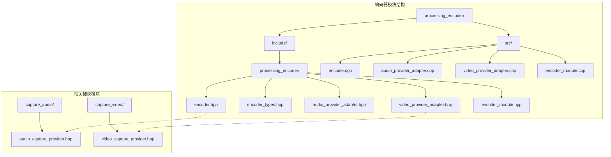

**图表来源**
- [encoder.hpp:1-90](file://project/agent/src/modules/processing/encoder/include/processing_encoder/encoder.hpp#L1-L90)
- [encoder.cpp:1-606](file://project/agent/src/modules/processing/encoder/encoder.cpp#L1-L606)

**章节来源**
- [encoder.hpp:1-90](file://project/agent/src/modules/processing/encoder/include/processing_encoder/encoder.hpp#L1-L90)
- [encoder.cpp:1-606](file://project/agent/src/modules/processing/encoder/encoder.cpp#L1-L606)

## 核心组件

编码器模块包含以下核心组件：

### 主要类结构

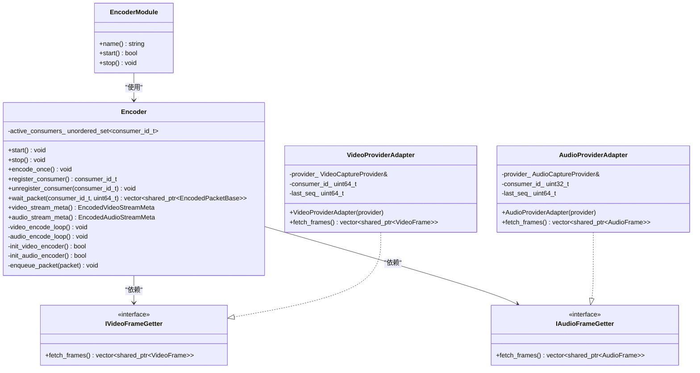

**图表来源**
- [encoder.hpp:16-87](file://project/agent/src/modules/processing/encoder/include/processing_encoder/encoder.hpp#L16-L87)
- [encoder_types.hpp:13-23](file://project/agent/src/modules/processing/encoder/include/processing_encoder/encoder_types.hpp#L13-L23)
- [audio_provider_adapter.hpp:12-26](file://project/agent/src/modules/processing/encoder/include/processing_encoder/audio_provider_adapter.hpp#L12-L26)
- [video_provider_adapter.hpp:12-26](file://project/agent/src/modules/processing/encoder/include/processing_encoder/video_provider_adapter.hpp#L12-L26)
- [encoder_module.hpp:9-18](file://project/agent/src/modules/processing/encoder/include/processing_encoder/encoder_module.hpp#L9-L18)

### 编码器选项配置

编码器支持丰富的配置选项，包括视频和音频参数：

| 参数类别 | 参数名称 | 默认值 | 描述 |
|---------|---------|--------|------|
| 视频参数 | video_width | 640 | 视频宽度 |
| 视频参数 | video_height | 480 | 视频高度 |
| 视频参数 | video_fps | 25 | 视频帧率 |
| 视频参数 | video_bitrate | 1,500,000 | 视频比特率 (bps) |
| 音频参数 | audio_sample_rate | 16,000 | 音频采样率 (Hz) |
| 音频参数 | audio_channels | 1 | 音频声道数 |
| 音频参数 | audio_bitrate | 64,000 | 音频比特率 (bps) |
| 通用参数 | packet_queue_capacity | 300 | 包队列容量 |

**章节来源**
- [encoder_types.hpp:25-34](file://project/agent/src/modules/processing/encoder/include/processing_encoder/encoder_types.hpp#L25-L34)

## 架构概览

编码器采用分层架构设计，实现了音视频分离编码和统一的数据分发机制：

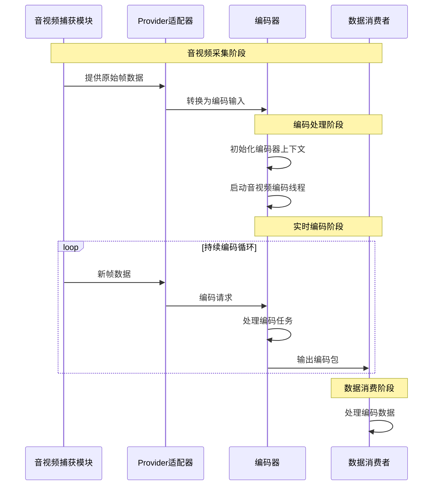

**图表来源**
- [encoder.cpp:267-297](file://project/agent/src/modules/processing/encoder/encoder.cpp#L267-L297)
- [video_provider_adapter.cpp:14-20](file://project/agent/src/modules/processing/encoder/video_provider_adapter.cpp#L14-L20)
- [audio_provider_adapter.cpp:14-20](file://project/agent/src/modules/processing/encoder/audio_provider_adapter.cpp#L14-L20)

### 线程架构设计

编码器采用双线程架构，分别处理音视频编码任务：

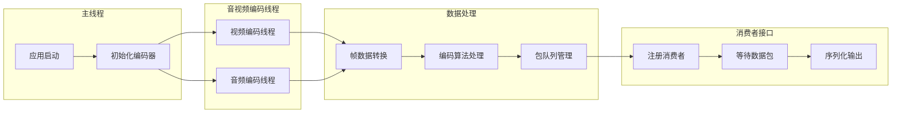

**图表来源**
- [encoder.cpp:290-295](file://project/agent/src/modules/processing/encoder/encoder.cpp#L290-L295)
- [encoder.cpp:524-583](file://project/agent/src/modules/processing/encoder/encoder.cpp#L524-L583)

## 详细组件分析

### 编码器核心实现

编码器类是整个模块的核心，负责协调音视频编码过程：

#### 编码器初始化流程

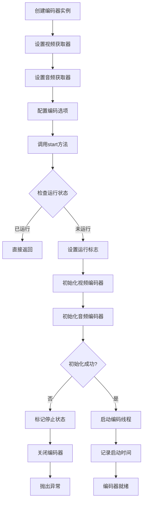

**图表来源**
- [encoder.cpp:267-297](file://project/agent/src/modules/processing/encoder/encoder.cpp#L267-L297)
- [encoder.cpp:56-138](file://project/agent/src/modules/processing/encoder/encoder.cpp#L56-L138)
- [encoder.cpp:140-227](file://project/agent/src/modules/processing/encoder/encoder.cpp#L140-L227)

#### 音频编码处理流程

音频编码涉及复杂的PCM数据处理和重采样：

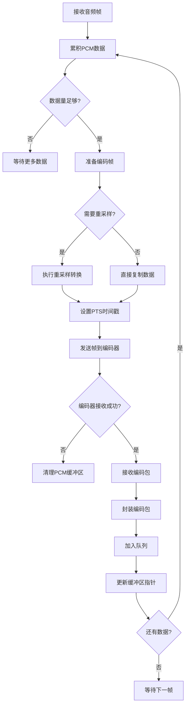

**图表来源**
- [encoder.cpp:422-510](file://project/agent/src/modules/processing/encoder/encoder.cpp#L422-L510)
- [encoder.cpp:448-508](file://project/agent/src/modules/processing/encoder/encoder.cpp#L448-L508)

**章节来源**
- [encoder.cpp:267-606](file://project/agent/src/modules/processing/encoder/encoder.cpp#L267-L606)

### 多消费者状态管理

编码器实现了高效的多消费者状态管理系统，使用 `active_consumers_` 变量来跟踪当前活跃的消费者：

#### 消费者注册与注销流程

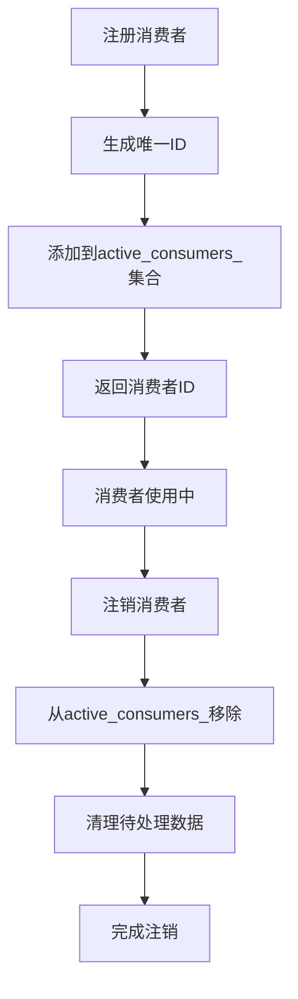

**图表来源**
- [encoder.cpp:524-551](file://project/agent/src/modules/processing/encoder/encoder.cpp#L524-L551)

#### 包队列与消费者关联

编码器将每个编码包与当前活跃的消费者集合关联：

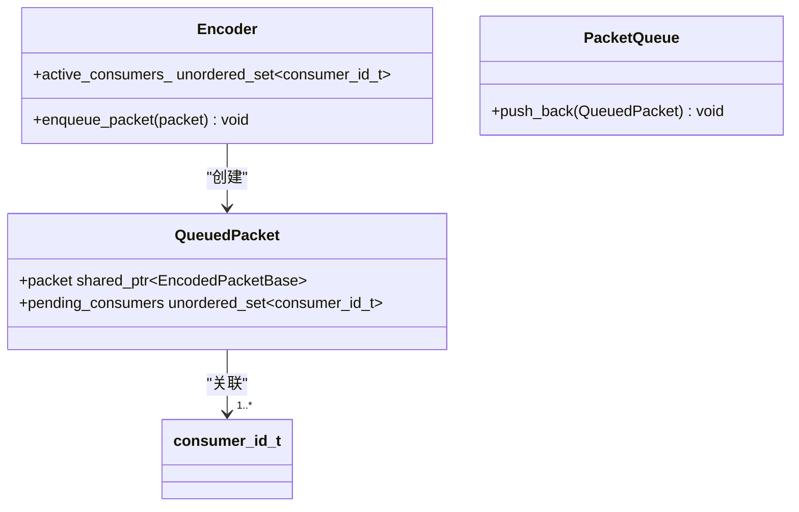

**图表来源**
- [encoder.hpp:39-42](file://project/agent/src/modules/processing/encoder/include/processing_encoder/encoder.hpp#L39-L42)
- [encoder.cpp:512-522](file://project/agent/src/modules/processing/encoder/encoder.cpp#L512-L522)

**章节来源**
- [encoder.cpp:512-583](file://project/agent/src/modules/processing/encoder/encoder.cpp#L512-L583)

### Provider适配器实现

适配器模式用于将捕获模块与编码器解耦：

#### 视频Provider适配器

视频适配器负责将视频捕获提供者的数据转换为编码器所需的格式：

**图表来源**
- [video_provider_adapter.hpp:12-26](file://project/agent/src/modules/processing/encoder/include/processing_encoder/video_provider_adapter.hpp#L12-L26)
- [video_capture_provider.hpp:15-45](file://project/agent/src/modules/capture/video/include/capture_video/video_capture_provider.hpp#L15-L45)

#### 音频Provider适配器

音频适配器处理PCM音频数据的累积和分发：

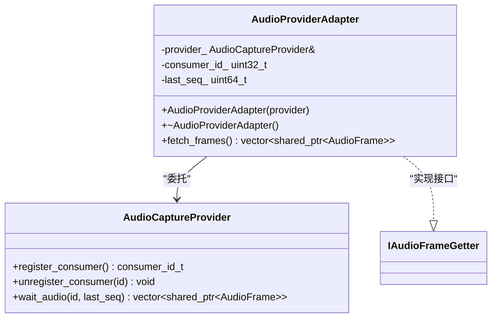

**图表来源**
- [audio_provider_adapter.hpp:12-26](file://project/agent/src/modules/processing/encoder/include/processing_encoder/audio_provider_adapter.hpp#L12-L26)
- [audio_capture_provider.hpp:20-68](file://project/agent/src/modules/capture/audio/include/capture_audio/audio_capture_provider.hpp#L20-L68)

**章节来源**
- [video_provider_adapter.cpp:1-23](file://project/agent/src/modules/processing/encoder/video_provider_adapter.cpp#L1-L23)
- [audio_provider_adapter.cpp:1-23](file://project/agent/src/modules/processing/encoder/audio_provider_adapter.cpp#L1-L23)

### 编码器模块管理

编码器模块作为系统的一部分，提供生命周期管理：

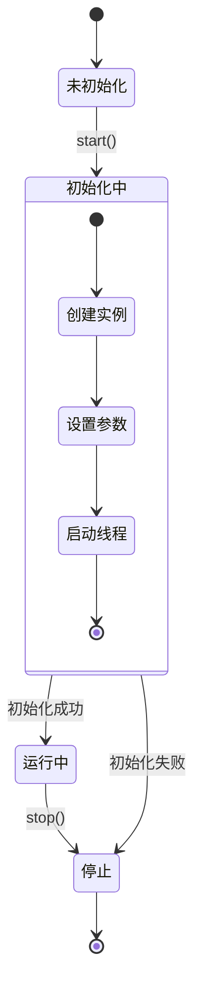

**图表来源**
- [encoder_module.cpp:15-20](file://project/agent/src/modules/processing/encoder/encoder_module.cpp#L15-L20)

**章节来源**
- [encoder_module.hpp:1-21](file://project/agent/src/modules/processing/encoder/include/processing_encoder/encoder_module.hpp#L1-L21)
- [encoder_module.cpp:1-23](file://project/agent/src/modules/processing/encoder/encoder_module.cpp#L1-L23)

## 依赖关系分析

编码器模块的依赖关系体现了清晰的分层架构：

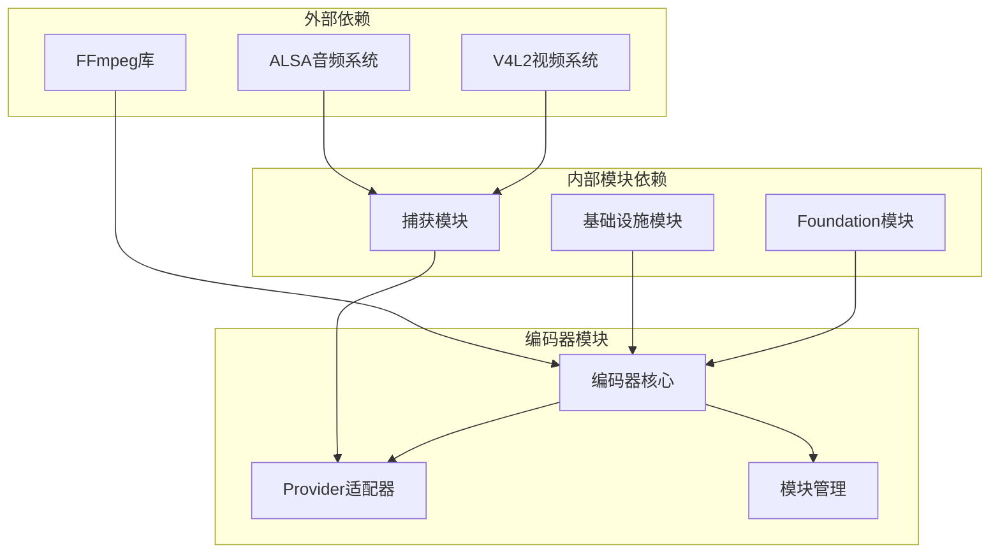

**图表来源**
- [encoder.cpp:14-21](file://project/agent/src/modules/processing/encoder/encoder.cpp#L14-L21)
- [encoder.cpp:1-10](file://project/agent/src/modules/processing/encoder/encoder.cpp#L1-L10)

### 关键依赖说明

1. **FFmpeg库依赖**：编码器基于FFmpeg的libavcodec、libswscale、libswresample等组件
2. **系统接口依赖**：通过ALSA和V4L2系统接口访问硬件设备
3. **模块间通信**：通过Provider适配器实现松耦合的数据传递
4. **基础设施支持**：利用日志系统和线程安全队列等基础设施

**章节来源**
- [encoder.cpp:14-21](file://project/agent/src/modules/processing/encoder/encoder.cpp#L14-L21)

## 性能考虑

编码器模块在设计时充分考虑了实时性能要求：

### 编码性能优化

1. **双线程架构**：音视频分离编码，避免相互阻塞
2. **缓冲区管理**：合理的队列容量配置，平衡内存使用和延迟
3. **零拷贝优化**：尽量减少数据复制操作
4. **批处理机制**：视频帧采用最新帧覆盖策略，减少处理负担
5. **多消费者优化**：使用 `active_consumers_` 集合高效管理消费者状态

### 内存管理策略

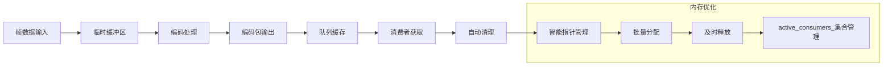

### 性能监控指标

- **编码延迟**：从采集到输出的端到端延迟
- **CPU利用率**：编码过程的处理器占用率
- **内存占用**：各组件的内存使用情况
- **丢帧率**：由于性能不足导致的帧丢失比例
- **消费者数量**：当前活跃消费者的数量对性能的影响

## 故障排除指南

### 常见问题及解决方案

#### 编码器初始化失败

**问题症状**：启动时抛出初始化异常

**可能原因**：
1. FFmpeg编解码器不可用
2. 硬件设备访问权限不足
3. 编码参数配置不正确

**解决步骤**：
1. 检查FFmpeg库安装完整性
2. 验证设备权限和可用性
3. 确认编码参数的有效性

#### 音频编码异常

**问题症状**：音频编码过程中出现警告或中断

**可能原因**：
1. PCM数据格式不支持
2. 采样率转换失败
3. 缓冲区溢出

**解决步骤**：
1. 检查音频设备配置
2. 验证PCM数据格式兼容性
3. 调整缓冲区大小参数

#### 多消费者状态管理问题

**问题症状**：消费者无法正确接收数据或数据丢失

**可能原因**：
1. `active_consumers_` 集合状态不一致
2. 消费者注册/注销时机不当
3. 包队列清理逻辑错误

**诊断方法**：
1. 检查 `active_consumers_` 集合的完整性
2. 验证消费者注册和注销的配对关系
3. 分析包队列中 `pending_consumers` 字段的状态

**解决步骤**：
1. 确保每次注册都有对应的注销
2. 检查 `active_consumers_` 集合的并发访问
3. 验证包队列清理逻辑的正确性

#### 性能问题诊断

**问题症状**：系统响应缓慢或丢帧严重

**诊断方法**：
1. 监控CPU使用率和内存占用
2. 检查编码队列长度
3. 分析线程阻塞情况
4. 监控 `active_consumers_` 集合的大小变化

**优化建议**：
1. 调整编码参数降低负载
2. 增加系统资源
3. 优化数据传输路径
4. 控制消费者数量以避免过度竞争

**章节来源**
- [encoder.cpp:64-66](file://project/agent/src/modules/processing/encoder/encoder.cpp#L64-L66)
- [encoder.cpp:148-149](file://project/agent/src/modules/processing/encoder/encoder.cpp#L148-L149)
- [encoder.cpp:468-470](file://project/agent/src/modules/processing/encoder/encoder.cpp#L468-L470)
- [encoder.cpp:524-551](file://project/agent/src/modules/processing/encoder/encoder.cpp#L524-L551)

## 结论

Pi-Guard编码器模块是一个设计精良的实时音视频编码系统，具有以下优势：

1. **架构清晰**：采用分层设计和适配器模式，实现了良好的模块解耦
2. **性能优异**：双线程架构和优化的数据处理流程确保了低延迟编码
3. **扩展性强**：支持灵活的参数配置和多消费者数据分发
4. **稳定性好**：完善的错误处理和资源管理机制
5. **状态管理优化**：使用 `active_consumers_` 集合实现了高效的多消费者状态管理

该模块为Pi-Guard系统的实时视频监控功能提供了坚实的技术基础，能够满足各种应用场景下的音视频编码需求。通过持续的优化和维护，编码器模块将继续为系统提供高质量的编码服务。

**更新** 本次更新反映了编码器模块中多消费者状态管理的重构，将 `consumers_` 变量重命名为 `active_consumers_`，优化了状态管理的实现细节，提高了代码的可读性和维护性。