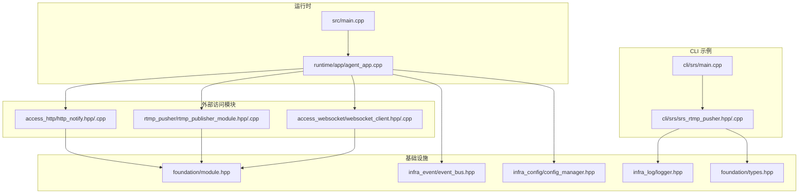
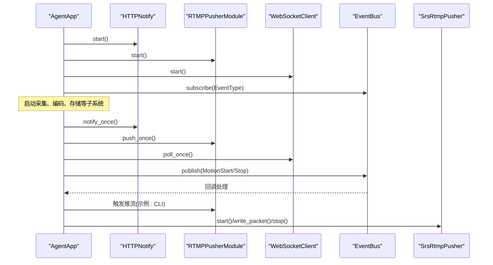
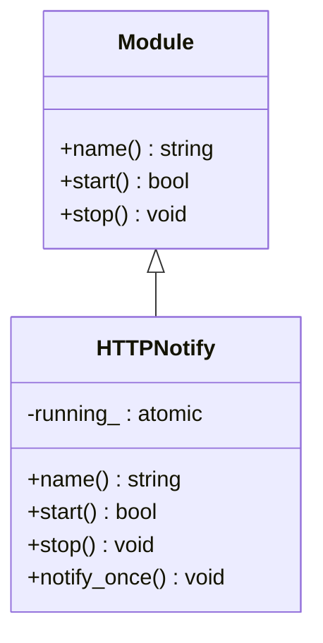
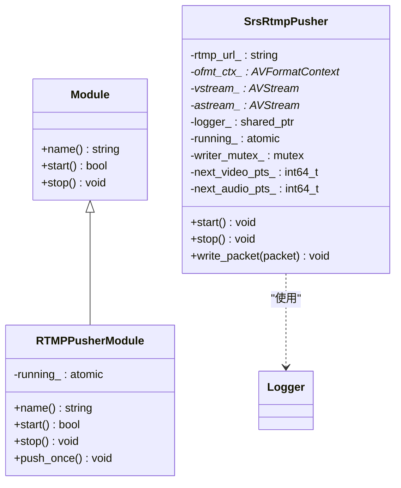
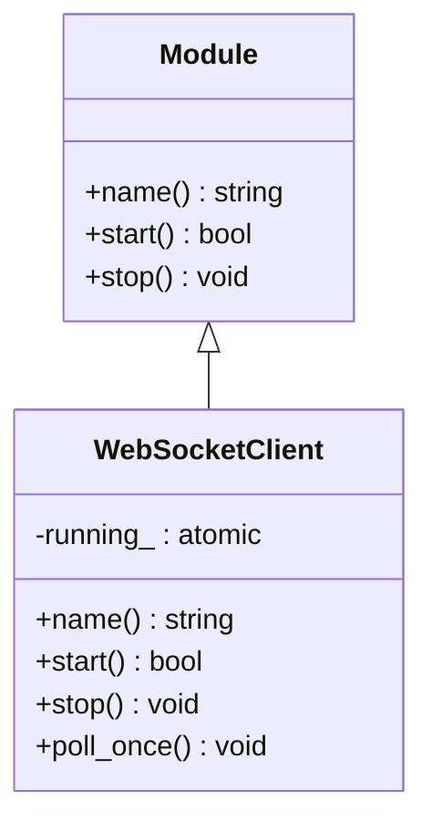
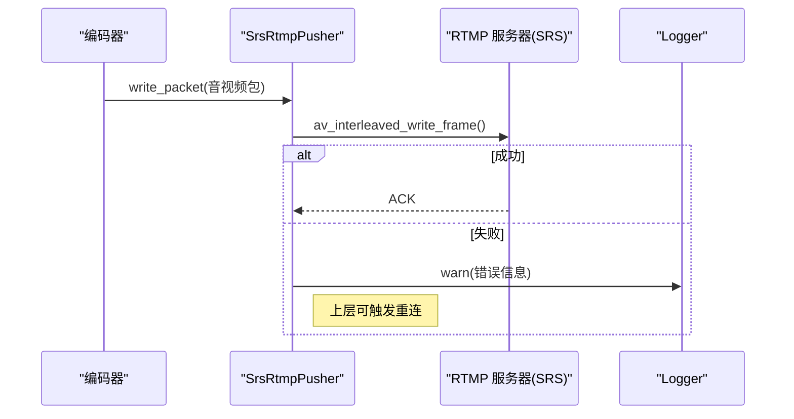
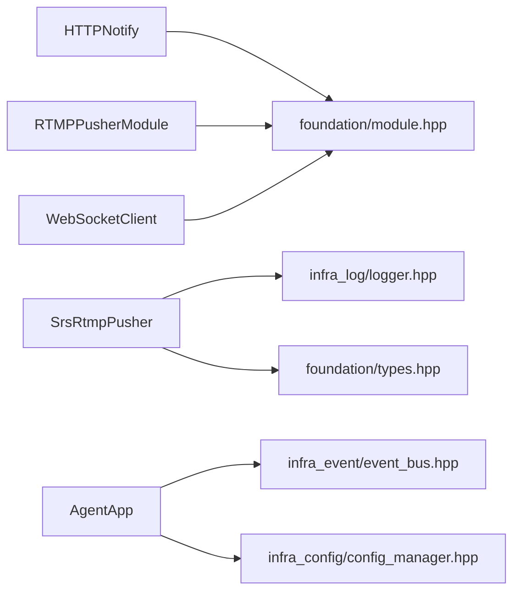

# 外部访问模块

<cite>
**本文引用的文件**
- [http_notify.cpp](file://project/agent/src/modules/external_access/http/http_notify.cpp)
- [http_notify.hpp](file://project/agent/src/modules/external_access/http/include/access_http/http_notify.hpp)
- [rtmp_publisher_module.cpp](file://project/agent/src/modules/external_access/rtmp_pusher/rtmp_publisher_module.cpp)
- [rtmp_publisher_module.hpp](file://project/agent/src/modules/external_access/rtmp_pusher/include/rtmp_pusher/rtmp_publisher_module.hpp)
- [websocket_client.cpp](file://project/agent/src/modules/external_access/websocket/websocket_client.cpp)
- [websocket_client.hpp](file://project/agent/src/modules/external_access/websocket/include/access_websocket/websocket_client.hpp)
- [module.hpp](file://project/agent/src/foundation/include/foundation/module.hpp)
- [types.hpp](file://project/agent/src/foundation/include/foundation/types.hpp)
- [config_manager.hpp](file://project/agent/src/modules/infra/config/include/infra_config/config_manager.hpp)
- [event_bus.hpp](file://project/agent/src/modules/infra/event_bus/include/infra_event/event_bus.hpp)
- [logger.hpp](file://project/agent/src/modules/infra/log/include/infra_log/logger.hpp)
- [srs_rtmp_pusher.cpp](file://project/agent/cli/srs/srs_rtmp_pusher.cpp)
- [srs_rtmp_pusher.hpp](file://project/agent/cli/srs/srs_rtmp_pusher.hpp)
- [main.cpp](file://project/agent/src/main.cpp)
- [agent_app.cpp](file://project/agent/src/runtime/app/agent_app.cpp)
- [srs_main.cpp](file://project/agent/cli/srs/main.cpp)
</cite>

## 目录
1. [简介](#简介)
2. [项目结构](#项目结构)
3. [核心组件](#核心组件)
4. [架构总览](#架构总览)
5. [详细组件分析](#详细组件分析)
6. [依赖关系分析](#依赖关系分析)
7. [性能考量](#性能考量)
8. [故障排查指南](#故障排查指南)
9. [结论](#结论)
10. [附录](#附录)

## 简介
本文件面向外部访问模块，系统性阐述以下能力的设计与实现：
- HTTP 通知模块：对外部系统进行事件通知的接口与扩展点
- RTMP 推流模块：基于 FFmpeg 的 RTMP 推流实现，对接 SRS 等服务端
- WebSocket 客户端模块：与远端服务建立双向通信的客户端实现

文档同时解释：
- HTTP 请求发送机制与 Webhook 通知格式建议
- RTMP 协议实现要点、时间戳处理与错误恢复
- WebSocket 连接管理、心跳与重连策略
- 与 SRS 服务器的集成方式、实时通信协议与错误重连机制
- 网络优化、超时处理与安全考虑

## 项目结构
外部访问模块位于 Agent 端的模块化框架中，采用统一的 Module 接口规范，通过事件总线与运行时应用编排启动与停止。

**更新** 目录结构已从 'pusher' 重命名为 'rtmp_pusher'

图表来源
- [module.hpp:1-17](file://project/agent/src/foundation/include/foundation/module.hpp#L1-L17)
- [types.hpp:1-39](file://project/agent/src/foundation/include/foundation/types.hpp#L1-L39)
- [event_bus.hpp:1-25](file://project/agent/src/modules/infra/event_bus/include/infra_event/event_bus.hpp#L1-L25)
- [config_manager.hpp:1-30](file://project/agent/src/modules/infra/config/include/infra_config/config_manager.hpp#L1-L30)
- [logger.hpp:1-25](file://project/agent/src/modules/infra/log/include/infra_log/logger.hpp#L1-L25)
- [http_notify.hpp:1-22](file://project/agent/src/modules/external_access/http/include/access_http/http_notify.hpp#L1-L22)
- [rtmp_publisher_module.hpp:1-22](file://project/agent/src/modules/external_access/rtmp_pusher/include/rtmp_pusher/rtmp_publisher_module.hpp#L1-L22)
- [websocket_client.hpp:1-22](file://project/agent/src/modules/external_access/websocket/include/access_websocket/websocket_client.hpp#L1-L22)
- [srs_rtmp_pusher.hpp:1-48](file://project/agent/cli/srs/srs_rtmp_pusher.hpp#L1-L48)
- [srs_main.cpp:1-131](file://project/agent/cli/srs/main.cpp#L1-L131)
- [agent_app.cpp:1-138](file://project/agent/src/runtime/app/agent_app.cpp#L1-L138)
- [main.cpp:1-19](file://project/agent/src/main.cpp#L1-L19)

章节来源
- [module.hpp:1-17](file://project/agent/src/foundation/include/foundation/module.hpp#L1-L17)
- [agent_app.cpp:16-63](file://project/agent/src/runtime/app/agent_app.cpp#L16-L63)

## 核心组件
- HTTP 通知模块：提供事件通知的扩展点，当前骨架实现仅包含生命周期控制与空实现的通知逻辑，便于后续接入具体 HTTP 发送器与 Webhook 格式
- RTMP 推流模块：提供推流生命周期控制与空实现的触发接口，实际推流由 CLI 示例中的 SrsRtmpPusher 完成
- WebSocket 客户端模块：提供连接生命周期控制与轮询接口，用于后续接入具体 WebSocket 客户端库与消息编解码

**更新** RTMP 推流模块现在位于 'rtmp_pusher' 目录下

章节来源
- [http_notify.hpp:10-19](file://project/agent/src/modules/external_access/http/include/access_http/http_notify.hpp#L10-L19)
- [rtmp_publisher_module.hpp:10-19](file://project/agent/src/modules/external_access/rtmp_pusher/include/rtmp_pusher/rtmp_publisher_module.hpp#L10-L19)
- [websocket_client.hpp:10-19](file://project/agent/src/modules/external_access/websocket/include/access_websocket/websocket_client.hpp#L10-L19)

## 架构总览
外部访问模块遵循统一的模块化设计，通过 AgentApp 统一启动与停止各模块，并通过事件总线分发内部事件。CLI 示例展示了如何使用 FFmpeg 将编码后的音视频包写入 FLV 并推送到 RTMP 服务器。

**更新** RTMP 模块引用已更新为新的目录结构

图表来源
- [agent_app.cpp:36-125](file://project/agent/src/runtime/app/agent_app.cpp#L36-L125)
- [http_notify.cpp:14-18](file://project/agent/src/modules/external_access/http/http_notify.cpp#L14-L18)
- [rtmp_publisher_module.cpp:14-18](file://project/agent/src/modules/external_access/rtmp_pusher/rtmp_publisher_module.cpp#L14-L18)
- [websocket_client.cpp:14-18](file://project/agent/src/modules/external_access/websocket/websocket_client.cpp#L14-L18)
- [srs_rtmp_pusher.cpp:24-129](file://project/agent/cli/srs/srs_rtmp_pusher.cpp#L24-L129)

## 详细组件分析

### HTTP 通知模块
- 设计要点
  - 继承 Module 接口，提供 name/start/stop 生命周期方法
  - 提供 notify_once 触发点，当前为空实现，便于后续接入 HTTP 客户端与 Webhook 格式
  - 使用原子布尔量 running_ 控制执行状态
- 扩展建议
  - 在 notify_once 中实现 HTTP POST 请求发送
  - Webhook 通知格式建议包含事件类型、时间戳、设备标识与可选负载
  - 支持批量发送与退避重试策略
- 典型调用链
  - AgentApp 启动后周期性调用 notify_once
  - 可在事件总线回调中触发通知

**更新** 类定义和继承关系保持不变，但文件路径已更新

图表来源
- [module.hpp:7-14](file://project/agent/src/foundation/include/foundation/module.hpp#L7-L14)
- [http_notify.hpp:10-19](file://project/agent/src/modules/external_access/http/include/access_http/http_notify.hpp#L10-L19)

章节来源
- [http_notify.cpp:5-18](file://project/agent/src/modules/external_access/http/http_notify.cpp#L5-L18)
- [http_notify.hpp:10-19](file://project/agent/src/modules/external_access/http/include/access_http/http_notify.hpp#L10-L19)

### RTMP 推流模块
- 设计要点
  - 继承 Module 接口，提供 name/start/stop 生命周期方法
  - 提供 push_once 触发点，当前为空实现，实际推流由 CLI 示例中的 SrsRtmpPusher 完成
  - 使用原子布尔量 running_ 控制执行状态
- 实现参考（CLI 示例）
  - 初始化网络与输出上下文，创建视频/音频流并设置参数
  - 打开 RTMP 输出 URL，写入 FLV 头部
  - 写入封装后的音视频包，处理 PTS/DTS 与关键帧标志
  - 正确关闭并释放资源
- 错误处理
  - 每个步骤均进行错误检查与日志记录
  - 写包失败时记录警告并继续运行

**更新** 模块现在位于 'rtmp_pusher' 目录下，文件路径已相应更新

**更新** 类定义和继承关系保持不变，但文件路径已更新

图表来源
- [module.hpp:7-14](file://project/agent/src/foundation/include/foundation/module.hpp#L7-L14)
- [rtmp_publisher_module.hpp:10-19](file://project/agent/src/modules/external_access/rtmp_pusher/include/rtmp_pusher/rtmp_publisher_module.hpp#L10-L19)
- [srs_rtmp_pusher.hpp:17-46](file://project/agent/cli/srs/srs_rtmp_pusher.hpp#L17-L46)
- [logger.hpp:7-22](file://project/agent/src/modules/infra/log/include/infra_log/logger.hpp#L7-L22)

章节来源
- [rtmp_publisher_module.cpp:5-18](file://project/agent/src/modules/external_access/rtmp_pusher/rtmp_publisher_module.cpp#L5-L18)
- [rtmp_publisher_module.hpp:10-19](file://project/agent/src/modules/external_access/rtmp_pusher/include/rtmp_pusher/rtmp_publisher_module.hpp#L10-L19)
- [srs_rtmp_pusher.cpp:24-129](file://project/agent/cli/srs/srs_rtmp_pusher.cpp#L24-L129)
- [srs_rtmp_pusher.hpp:17-46](file://project/agent/cli/srs/srs_rtmp_pusher.hpp#L17-L46)

### WebSocket 客户端模块
- 设计要点
  - 继承 Module 接口，提供 name/start/stop 生命周期方法
  - 提供 poll_once 轮询接口，当前为空实现，便于后续接入具体 WebSocket 客户端库
  - 使用原子布尔量 running_ 控制执行状态
- 扩展建议
  - 在 poll_once 中执行连接维护、心跳与消息收发
  - 支持断线自动重连、指数退避与最大重试次数
  - 对消息进行序列化/反序列化，支持文本与二进制帧

**更新** 文件路径已更新，类定义保持不变

**更新** 类定义和继承关系保持不变，但文件路径已更新

图表来源
- [module.hpp:7-14](file://project/agent/src/foundation/include/foundation/module.hpp#L7-L14)
- [websocket_client.hpp:10-19](file://project/agent/src/modules/external_access/websocket/include/access_websocket/websocket_client.hpp#L10-L19)

章节来源
- [websocket_client.cpp:5-18](file://project/agent/src/modules/external_access/websocket/websocket_client.cpp#L5-L18)
- [websocket_client.hpp:10-19](file://project/agent/src/modules/external_access/websocket/include/access_websocket/websocket_client.hpp#L10-L19)

### 与 SRS 服务器的集成
- 集成方式
  - 使用 FFmpeg libavformat 将封装好的 FLV 包写入 RTMP URL
  - 在 CLI 示例中完成初始化、打开输出、写入头、写包与关闭流程
- 实时通信协议
  - RTMP/FLV：基于时间戳与关键帧标志的音视频复用
  - 通过编码器提供的元数据配置流参数与时基
- 错误重连机制
  - 当前实现未内置自动重连逻辑，可在上层应用或模块中增加重试与退避策略
  - 建议在写包失败时记录错误并触发重连流程

**更新** 图表和说明保持不变，但模块引用已更新

图表来源
- [srs_rtmp_pusher.cpp:132-191](file://project/agent/cli/srs/srs_rtmp_pusher.cpp#L132-L191)
- [srs_main.cpp:95-127](file://project/agent/cli/srs/main.cpp#L95-L127)

章节来源
- [srs_rtmp_pusher.cpp:24-129](file://project/agent/cli/srs/srs_rtmp_pusher.cpp#L24-L129)
- [srs_main.cpp:81-130](file://project/agent/cli/srs/main.cpp#L81-L130)

## 依赖关系分析
- 模块耦合
  - 外部访问模块均依赖基础 Module 接口，保持一致的生命周期管理
  - CLI 示例中的 SrsRtmpPusher 依赖 Logger 与编码器元数据类型
- 事件与配置
  - AgentApp 通过 EventBus 订阅内部事件，便于触发通知或推流
  - ConfigManager 提供配置读取能力，可用于动态调整通知与推流行为
- 外部依赖
  - FFmpeg（libavformat/libavcodec/libavutil）用于 RTMP 推流
  - 日志接口抽象，便于替换具体日志实现

**更新** 依赖关系保持不变，但模块路径已更新

**更新** 模块引用已更新到新的目录结构

图表来源
- [module.hpp:1-17](file://project/agent/src/foundation/include/foundation/module.hpp#L1-L17)
- [logger.hpp:1-25](file://project/agent/src/modules/infra/log/include/infra_log/logger.hpp#L1-L25)
- [types.hpp:1-39](file://project/agent/src/foundation/include/foundation/types.hpp#L1-L39)
- [event_bus.hpp:1-25](file://project/agent/src/modules/infra/event_bus/include/infra_event/event_bus.hpp#L1-L25)
- [config_manager.hpp:1-30](file://project/agent/src/modules/infra/config/include/infra_config/config_manager.hpp#L1-L30)
- [agent_app.cpp:36-102](file://project/agent/src/runtime/app/agent_app.cpp#L36-L102)

章节来源
- [agent_app.cpp:16-63](file://project/agent/src/runtime/app/agent_app.cpp#L16-L63)

## 性能考量
- 推流性能
  - 使用互斥锁保护写包操作，避免并发写入导致的资源竞争
  - 通过时间戳对齐与关键帧标志确保播放端正确渲染
- 网络优化
  - 合理设置缓冲区大小与队列容量，避免阻塞主循环
  - 在写包失败时快速失败并记录，减少阻塞时间
- 资源管理
  - 正确释放 FFmpeg 上下文与网络资源，防止内存泄漏
  - 在停止流程中先写尾部再关闭输出，保证 FLV 完整性

## 故障排查指南
- HTTP 通知
  - 确认 notify_once 是否被周期性调用
  - 检查目标地址与请求头配置，启用详细日志定位失败原因
- RTMP 推流
  - 关注初始化网络、分配输出上下文、打开 URL、写入头部阶段的日志
  - 写包失败时查看返回码与错误字符串，确认时间戳与关键帧标志是否正确
  - 若出现连接中断，结合上层重连策略进行恢复
- WebSocket 客户端
  - 检查连接建立、心跳与消息收发流程
  - 实现断线检测与指数退避重连，限制最大重试次数

**更新** 故障排查指南保持不变，但模块引用已更新

章节来源
- [srs_rtmp_pusher.cpp:24-129](file://project/agent/cli/srs/srs_rtmp_pusher.cpp#L24-L129)
- [logger.hpp:7-22](file://project/agent/src/modules/infra/log/include/infra_log/logger.hpp#L7-L22)

## 结论
外部访问模块提供了统一的生命周期管理与扩展点，当前 HTTP 通知与 WebSocket 客户端处于骨架实现阶段，RTMP 推流通过 CLI 示例展示了与 SRS 的完整集成路径。建议在现有骨架基础上：
- 补充 HTTP 发送器与 Webhook 格式
- 实现 WebSocket 客户端与消息编解码
- 在 RTMP 推流侧增加自动重连与退避策略
- 引入配置驱动与动态开关，提升可运维性

**更新** 结论保持不变，但模块引用已更新

## 附录

### HTTP 请求发送机制与 Webhook 通知格式建议
- 请求发送机制
  - 在 notify_once 中构造 HTTP 请求（POST），设置 Content-Type 与超时
  - 支持批量事件合并发送，降低网络开销
- Webhook 通知格式
  - 字段建议：事件类型、时间戳、设备标识、负载（如告警详情）
  - 建议使用 JSON 格式，便于解析与扩展

### RTMP 协议实现要点
- 流参数配置：基于编码器元数据设置视频/音频时基、分辨率、采样率等
- 时间戳处理：当编码器输出 AV_NOPTS_VALUE 时，使用单调递增时间戳补齐
- 关键帧标志：I 帧设置关键帧标志，确保播放端正确解码
- 错误处理：写包失败时记录并继续运行，必要时触发重连

**更新** RTMP 协议实现要点保持不变，但模块引用已更新

### WebSocket 连接管理
- 连接建立：在 start 中发起握手，成功后进入轮询循环
- 心跳与保活：定期发送 Ping/Pong，检测异常断开
- 重连策略：指数退避与最大重试次数，避免频繁重连造成拥塞

### 与 SRS 服务器的集成
- 推流地址：使用标准 RTMP URL（如 rtmp://host:port/app/stream_key）
- 服务器配置：确保应用与流名存在，开启 FLV 推流权限
- 监控与日志：通过 SRS 日志与统计接口定位问题

**更新** SRS 集成说明保持不变，但模块引用已更新