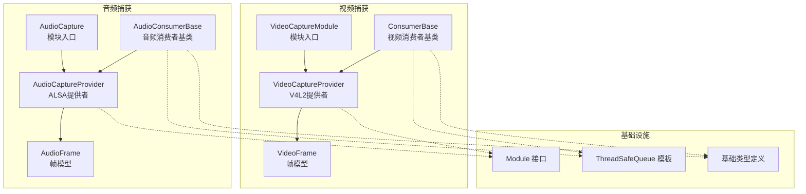
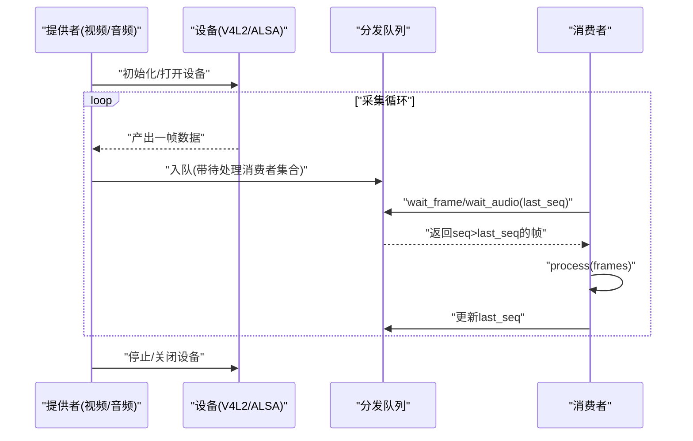
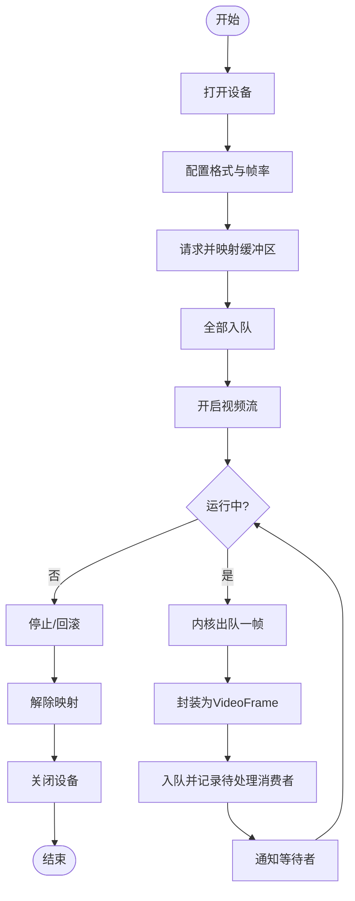
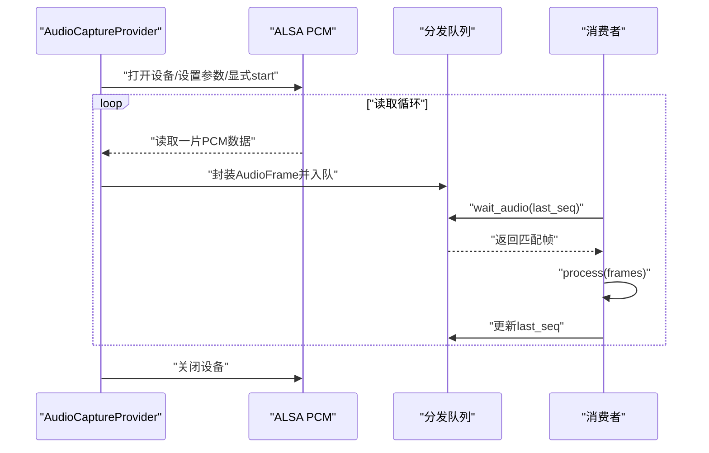
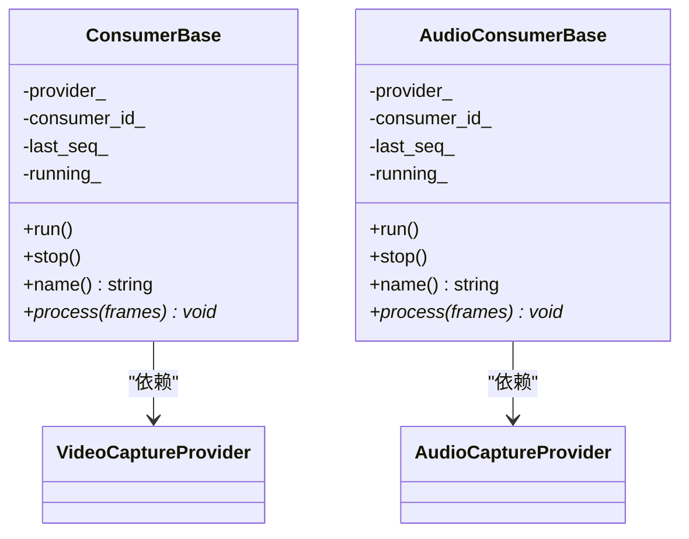
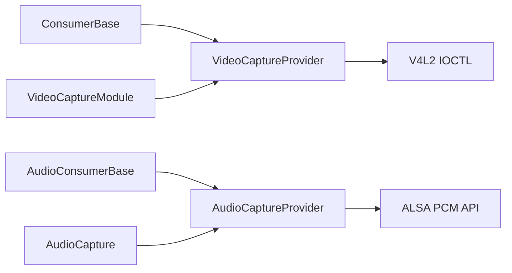

# 捕获模块

<cite>
**本文档引用的文件**
- [video_capture_module.cpp](file://project/agent/src/modules/capture/video/video_capture_module.cpp)
- [video_capture_provider.cpp](file://project/agent/src/modules/capture/video/video_capture_provider.cpp)
- [video_capture_provider.hpp](file://project/agent/src/modules/capture/video/include/capture_video/video_capture_provider.hpp)
- [video_frame.hpp](file://project/agent/src/modules/capture/video/include/capture_video/video_frame.hpp)
- [consumer_base.hpp](file://project/agent/src/modules/capture/video/include/capture_video/consumer_base.hpp)
- [audio_capture_module.cpp](file://project/agent/src/modules/capture/audio/audio_capture_module.cpp)
- [audio_capture_provider.cpp](file://project/agent/src/modules/capture/audio/audio_capture_provider.cpp)
- [audio_capture_provider.hpp](file://project/agent/src/modules/capture/audio/include/capture_audio/audio_capture_provider.hpp)
- [audio_frame.hpp](file://project/agent/src/modules/capture/audio/include/capture_audio/audio_frame.hpp)
- [consumer_base.hpp](file://project/agent/src/modules/capture/audio/include/capture_audio/consumer_base.hpp)
- [module.hpp](file://project/agent/src/foundation/include/foundation/module.hpp)
- [thread_safe_queue.hpp](file://project/agent/src/foundation/include/foundation/thread_safe_queue.hpp)
- [types.hpp](file://project/agent/src/foundation/include/foundation/types.hpp)
</cite>

## 目录
1. [简介](#简介)
2. [项目结构](#项目结构)
3. [核心组件](#核心组件)
4. [架构总览](#架构总览)
5. [详细组件分析](#详细组件分析)
6. [依赖关系分析](#依赖关系分析)
7. [性能考虑](#性能考虑)
8. [故障排查指南](#故障排查指南)
9. [结论](#结论)
10. [附录](#附录)

## 简介
本文件为“捕获模块”的技术文档，聚焦于视频捕获与音频捕获两大子系统的设计与实现，覆盖以下要点：
- 视频捕获：基于 V4L2 的设备管理、缓冲区映射与出队入队、帧队列与多消费者分发、设备资源生命周期管理。
- 音频捕获：基于 ALSA 的设备打开、参数设置、读取循环与错误恢复、帧队列与多消费者分发。
- 多消费者支持：通过“待处理消费者集合”实现按消费者粒度的去重与分发，避免重复处理。
- 帧队列管理：固定容量的环形/滑动窗口式队列，支持丢帧策略与条件变量唤醒。
- 设备资源管理：幂等 stop、STREAMOFF/UNMAP/CLOSE 的有序释放，防止资源泄漏。
- 与底层库的集成：V4L2 ioctl 流水线与 ALSA snd_pcm_* API 的正确使用与错误处理。

## 项目结构
捕获模块位于 Agent 子工程中，采用“功能域+跨域复用基类”的组织方式：
- 视频捕获：模块类负责生命周期，提供者类负责 V4L2 设备与帧分发。
- 音频捕获：模块类负责生命周期，提供者类负责 ALSA 设备与帧分发。
- 基类消费者：统一注册/注销、轮询等待、处理回调与停止控制。
- 基础设施：Module 接口、线程安全队列、通用帧类型。

图表来源
- [video_capture_module.cpp:1-25](file://project/agent/src/modules/capture/video/video_capture_module.cpp#L1-L25)
- [video_capture_provider.cpp:1-457](file://project/agent/src/modules/capture/video/video_capture_provider.cpp#L1-L457)
- [video_capture_provider.hpp:1-109](file://project/agent/src/modules/capture/video/include/capture_video/video_capture_provider.hpp#L1-L109)
- [video_frame.hpp:1-23](file://project/agent/src/modules/capture/video/include/capture_video/video_frame.hpp#L1-L23)
- [consumer_base.hpp:1-51](file://project/agent/src/modules/capture/video/include/capture_video/consumer_base.hpp#L1-L51)
- [audio_capture_module.cpp:1-19](file://project/agent/src/modules/capture/audio/audio_capture_module.cpp#L1-L19)
- [audio_capture_provider.cpp:1-271](file://project/agent/src/modules/capture/audio/audio_capture_provider.cpp#L1-L271)
- [audio_capture_provider.hpp:1-105](file://project/agent/src/modules/capture/audio/include/capture_audio/audio_capture_provider.hpp#L1-L105)
- [audio_frame.hpp:1-18](file://project/agent/src/modules/capture/audio/include/capture_audio/audio_frame.hpp#L1-L18)
- [consumer_base.hpp:1-61](file://project/agent/src/modules/capture/audio/include/capture_audio/consumer_base.hpp#L1-L61)
- [module.hpp:1-17](file://project/agent/src/foundation/include/foundation/module.hpp#L1-L17)
- [thread_safe_queue.hpp:1-51](file://project/agent/src/foundation/include/foundation/thread_safe_queue.hpp#L1-L51)
- [types.hpp:1-39](file://project/agent/src/foundation/include/foundation/types.hpp#L1-L39)

章节来源
- [video_capture_module.cpp:1-25](file://project/agent/src/modules/capture/video/video_capture_module.cpp#L1-L25)
- [audio_capture_module.cpp:1-19](file://project/agent/src/modules/capture/audio/audio_capture_module.cpp#L1-L19)
- [module.hpp:1-17](file://project/agent/src/foundation/include/foundation/module.hpp#L1-L17)

## 核心组件
- 视频捕获模块与提供者
  - VideoCaptureModule：模块生命周期（name/start/stop），当前为空实现，预留扩展点。
  - VideoCaptureProvider：V4L2 设备初始化流水线、缓冲区映射、出队入队、帧分发与资源释放。
  - VideoFrame：包含序列号、时间戳、内存映射指针与长度，以及 V4L2 引用计数回收（自定义删除器）。
  - ConsumerBase：多消费者基类，封装注册/注销、等待可用帧、处理回调与停止控制。
- 音频捕获模块与提供者
  - AudioCapture：模块生命周期（name/start/stop），当前为空实现，预留扩展点。
  - AudioCaptureProvider：ALSA 设备打开、参数设置、显式 start、读取循环与错误恢复、帧分发。
  - AudioFrame：包含序列号、PCM 数据与采集时间戳。
  - AudioConsumerBase：多消费者基类，封装注册/注销、等待可用帧、处理回调与停止控制。
- 基础设施
  - Module：统一模块接口。
  - ThreadSafeQueue：线程安全队列模板（非本模块直接使用，但与消费者基类配合良好）。
  - 基础类型：VideoFrame、AudioFrame、Event 等。

章节来源
- [video_capture_module.cpp:1-25](file://project/agent/src/modules/capture/video/video_capture_module.cpp#L1-L25)
- [video_capture_provider.hpp:1-109](file://project/agent/src/modules/capture/video/include/capture_video/video_capture_provider.hpp#L1-L109)
- [video_frame.hpp:1-23](file://project/agent/src/modules/capture/video/include/capture_video/video_frame.hpp#L1-L23)
- [consumer_base.hpp:1-51](file://project/agent/src/modules/capture/video/include/capture_video/consumer_base.hpp#L1-L51)
- [audio_capture_module.cpp:1-19](file://project/agent/src/modules/capture/audio/audio_capture_module.cpp#L1-L19)
- [audio_capture_provider.hpp:1-105](file://project/agent/src/modules/capture/audio/include/capture_audio/audio_capture_provider.hpp#L1-L105)
- [audio_frame.hpp:1-18](file://project/agent/src/modules/capture/audio/include/capture_audio/audio_frame.hpp#L1-L18)
- [consumer_base.hpp:1-61](file://project/agent/src/modules/capture/audio/include/capture_audio/consumer_base.hpp#L1-L61)
- [module.hpp:1-17](file://project/agent/src/foundation/include/foundation/module.hpp#L1-L17)
- [thread_safe_queue.hpp:1-51](file://project/agent/src/foundation/include/foundation/thread_safe_queue.hpp#L1-L51)
- [types.hpp:1-39](file://project/agent/src/foundation/include/foundation/types.hpp#L1-L39)

## 架构总览
视频与音频均采用“单生产者-多消费者”模型：
- 生产者：VideoCaptureProvider（V4L2）或 AudioCaptureProvider（ALSA）在后台线程中采集并入队。
- 消费者：ConsumerBase/AudioConsumerBase 注册后通过 wait_frame/wait_audio 获取帧，逐个处理并更新 last_seq。
- 同步：使用互斥锁与条件变量协调“有新帧可取/停止”两类事件。
- 资源：提供者负责设备打开/关闭、缓冲区映射/解除映射、流开关与幂等 stop。

图表来源
- [video_capture_provider.cpp:310-401](file://project/agent/src/modules/capture/video/video_capture_provider.cpp#L310-L401)
- [audio_capture_provider.cpp:170-268](file://project/agent/src/modules/capture/audio/audio_capture_provider.cpp#L170-L268)
- [consumer_base.hpp:27-34](file://project/agent/src/modules/capture/video/include/capture_video/consumer_base.hpp#L27-L34)
- [consumer_base.hpp:34-43](file://project/agent/src/modules/capture/audio/include/capture_audio/consumer_base.hpp#L34-L43)

## 详细组件分析

### 视频捕获组件分析
- 设备管理与初始化流水线
  - 打开设备、配置格式与帧率、请求并映射缓冲区、全部入队、开启流。
  - 错误处理：任一步失败均回滚并记录日志，最终抛出异常或报告启动失败。
- 帧队列与多消费者分发
  - 每帧记录“待处理消费者集合”，消费者取走后从集合中移除；集合为空则回收该帧。
  - 队列容量超限时丢弃最旧帧，周期性告警避免刷屏。
- 引用计数与资源回收
  - 使用 shared_ptr 自定义删除器，在帧被分发器队列与所有消费者线程释放后自动执行 QBUF，避免手动管理。
- 生命周期与幂等停止
  - stop 幂等：重复调用只保证线程 join；STREAMOFF/UNMAP/CLOSE 仅在需要时执行。
- 关键实现位置
  - 初始化流水线与错误回滚：[video_capture_provider.cpp:104-124](file://project/agent/src/modules/capture/video/video_capture_provider.cpp#L104-L124)
  - V4L2 参数配置（格式/帧率）：[video_capture_provider.cpp:164-199](file://project/agent/src/modules/capture/video/video_capture_provider.cpp#L164-L199)
  - 缓冲区请求与映射：[video_capture_provider.cpp:201-246](file://project/agent/src/modules/capture/video/video_capture_provider.cpp#L201-L246)
  - 全部入队与开启流：[video_capture_provider.cpp:248-278](file://project/agent/src/modules/capture/video/video_capture_provider.cpp#L248-L278)
  - 采集循环与引用计数回收：[video_capture_provider.cpp:310-401](file://project/agent/src/modules/capture/video/video_capture_provider.cpp#L310-L401)
  - 多消费者等待与清理：[video_capture_provider.cpp:420-454](file://project/agent/src/modules/capture/video/video_capture_provider.cpp#L420-L454)

图表来源
- [video_capture_provider.cpp:104-124](file://project/agent/src/modules/capture/video/video_capture_provider.cpp#L104-L124)
- [video_capture_provider.cpp:164-199](file://project/agent/src/modules/capture/video/video_capture_provider.cpp#L164-L199)
- [video_capture_provider.cpp:201-246](file://project/agent/src/modules/capture/video/video_capture_provider.cpp#L201-L246)
- [video_capture_provider.cpp:248-278](file://project/agent/src/modules/capture/video/video_capture_provider.cpp#L248-L278)
- [video_capture_provider.cpp:310-401](file://project/agent/src/modules/capture/video/video_capture_provider.cpp#L310-L401)

章节来源
- [video_capture_provider.cpp:104-124](file://project/agent/src/modules/capture/video/video_capture_provider.cpp#L104-L124)
- [video_capture_provider.cpp:164-199](file://project/agent/src/modules/capture/video/video_capture_provider.cpp#L164-L199)
- [video_capture_provider.cpp:201-246](file://project/agent/src/modules/capture/video/video_capture_provider.cpp#L201-L246)
- [video_capture_provider.cpp:248-278](file://project/agent/src/modules/capture/video/video_capture_provider.cpp#L248-L278)
- [video_capture_provider.cpp:310-401](file://project/agent/src/modules/capture/video/video_capture_provider.cpp#L310-L401)
- [video_capture_provider.cpp:420-454](file://project/agent/src/modules/capture/video/video_capture_provider.cpp#L420-L454)
- [video_frame.hpp:1-23](file://project/agent/src/modules/capture/video/include/capture_video/video_frame.hpp#L1-L23)

### 音频捕获组件分析
- 设备管理与初始化
  - 打开 ALSA 设备、设置参数（格式/交错访问/声道/采样率）、显式 start，确保设备进入 RUNNING。
  - 首次 start_threshold 由 snd_pcm_set_params 设置，显式 start 避免部分 USB 驱动的 -EIO。
- 读取循环与错误恢复
  - 循环读取固定片长数据，遇到可恢复错误通过 snd_pcm_recover 统一处理；不可恢复错误记录日志并短暂退避。
- 帧队列与多消费者分发
  - 每帧记录“待处理消费者集合”，消费者取走后从集合中移除；集合为空则回收该帧。
  - 固定容量上限，超过则丢弃最旧帧。
- 生命周期与幂等停止
  - stop 幂等：重复调用只保证线程 join；设备句柄在退出时关闭。
- 关键实现位置
  - 设备打开与参数设置：[audio_capture_provider.cpp:171-209](file://project/agent/src/modules/capture/audio/audio_capture_provider.cpp#L171-L209)
  - 显式 start 与读取循环：[audio_capture_provider.cpp:216-263](file://project/agent/src/modules/capture/audio/audio_capture_provider.cpp#L216-L263)
  - 多消费者等待与清理：[audio_capture_provider.cpp:108-143](file://project/agent/src/modules/capture/audio/audio_capture_provider.cpp#L108-L143)

图表来源
- [audio_capture_provider.cpp:171-209](file://project/agent/src/modules/capture/audio/audio_capture_provider.cpp#L171-L209)
- [audio_capture_provider.cpp:216-263](file://project/agent/src/modules/capture/audio/audio_capture_provider.cpp#L216-L263)
- [audio_capture_provider.cpp:108-143](file://project/agent/src/modules/capture/audio/audio_capture_provider.cpp#L108-L143)

章节来源
- [audio_capture_provider.cpp:171-209](file://project/agent/src/modules/capture/audio/audio_capture_provider.cpp#L171-L209)
- [audio_capture_provider.cpp:216-263](file://project/agent/src/modules/capture/audio/audio_capture_provider.cpp#L216-L263)
- [audio_capture_provider.cpp:108-143](file://project/agent/src/modules/capture/audio/audio_capture_provider.cpp#L108-L143)

### 消费者基类分析
- 统一注册/注销：构造时注册，析构时注销，避免遗漏。
- 等待与处理：run 循环中通过 wait_frame/wait_audio 获取帧，调用纯虚函数 process 处理，更新 last_seq。
- 停止控制：原子布尔 running_ 控制循环退出，stop 设置为 false。
- 关键实现位置
  - 视频消费者基类：[consumer_base.hpp:1-51](file://project/agent/src/modules/capture/video/include/capture_video/consumer_base.hpp#L1-L51)
  - 音频消费者基类：[consumer_base.hpp:1-61](file://project/agent/src/modules/capture/audio/include/capture_audio/consumer_base.hpp#L1-L61)

图表来源
- [consumer_base.hpp:1-51](file://project/agent/src/modules/capture/video/include/capture_video/consumer_base.hpp#L1-L51)
- [consumer_base.hpp:1-61](file://project/agent/src/modules/capture/audio/include/capture_audio/consumer_base.hpp#L1-L61)
- [video_capture_provider.hpp:1-109](file://project/agent/src/modules/capture/video/include/capture_video/video_capture_provider.hpp#L1-L109)
- [audio_capture_provider.hpp:1-105](file://project/agent/src/modules/capture/audio/include/capture_audio/audio_capture_provider.hpp#L1-L105)

章节来源
- [consumer_base.hpp:1-51](file://project/agent/src/modules/capture/video/include/capture_video/consumer_base.hpp#L1-L51)
- [consumer_base.hpp:1-61](file://project/agent/src/modules/capture/audio/include/capture_audio/consumer_base.hpp#L1-L61)

## 依赖关系分析
- 组件耦合
  - 提供者与消费者通过接口解耦：消费者仅依赖提供者的注册/注销与等待接口。
  - 提供者内部对 V4L2/ALSA 的依赖明确，对外暴露统一的帧分发接口。
- 直接与间接依赖
  - 视频：VideoCaptureProvider 依赖 V4L2 头文件与 Linux 内核接口；音频：AudioCaptureProvider 依赖 ALSA 库。
  - 模块类仅负责生命周期，不直接参与设备细节。
- 外部依赖与集成点
  - V4L2：VIDIOC_S_FMT、VIDIOC_S_PARM、VIDIOC_REQBUFS、VIDIOC_QUERYBUF、VIDIOC_QBUF/VIDIOC_DQBUF、VIDIOC_STREAMON/OFF。
  - ALSA：snd_pcm_open、snd_pcm_set_params、snd_pcm_start、snd_pcm_readi、snd_pcm_recover、snd_pcm_close。
- 潜在循环依赖
  - 无直接循环依赖；模块类与提供者类通过接口隔离。

图表来源
- [video_capture_provider.cpp:1-11](file://project/agent/src/modules/capture/video/video_capture_provider.cpp#L1-L11)
- [audio_capture_provider.cpp:1-11](file://project/agent/src/modules/capture/audio/audio_capture_provider.cpp#L1-L11)
- [video_capture_module.cpp:1-25](file://project/agent/src/modules/capture/video/video_capture_module.cpp#L1-L25)
- [audio_capture_module.cpp:1-19](file://project/agent/src/modules/capture/audio/audio_capture_module.cpp#L1-L19)

章节来源
- [video_capture_provider.cpp:1-11](file://project/agent/src/modules/capture/video/video_capture_provider.cpp#L1-L11)
- [audio_capture_provider.cpp:1-11](file://project/agent/src/modules/capture/audio/audio_capture_provider.cpp#L1-L11)
- [video_capture_module.cpp:1-25](file://project/agent/src/modules/capture/video/video_capture_module.cpp#L1-L25)
- [audio_capture_module.cpp:1-19](file://project/agent/src/modules/capture/audio/audio_capture_module.cpp#L1-L19)

## 性能考虑
- 缓冲区与队列容量
  - 视频：可配置 mmap 缓冲区数量与分发队列容量，避免过小导致频繁丢帧或过大导致内存占用过高。
  - 音频：固定容量上限，约 1 秒缓冲，平衡延迟与抗突发能力。
- 丢帧策略
  - 队列满时丢弃最旧帧，周期性告警避免刷屏。
- 错误处理与退避
  - V4L2 出队失败采用指数节奏告警；ALSA 读取失败统一 recover，不可恢复时短暂停顿。
- 时间同步
  - 视频与音频帧均携带 steady_clock 时间戳，便于跨路对齐与调试。
- 建议
  - 根据目标帧率与 CPU/内存资源调整 buffer_count 与 max_capacity。
  - 对高负载场景，优先保证关键消费者（如编码器）的队列容量，其他消费者可适当降低容量。

## 故障排查指南
- 视频捕获
  - 设备打开失败：检查设备路径与权限，确认内核驱动加载正常。
  - 格式/帧率设置失败：确认设备支持的像素格式与帧率范围。
  - 映射失败：检查缓冲区数量与权限，避免小于最小要求。
  - 出队失败：关注告警日志，确认 STREAMON 正常；停止时会收到预期的关闭返回码。
  - 资源释放：stop 幂等，确保线程 join 与资源回收。
- 音频捕获
  - 设备打开失败：检查 ALSA 设备名称与权限。
  - 参数设置失败：确认采样率、声道数与访问方式组合有效。
  - 首次读取 -EIO：显式 start 已启用，若仍失败，检查设备独占与混音器状态。
  - 读取错误：snd_pcm_recover 无法恢复时记录日志并短暂退避。
- 通用
  - 多消费者未取帧：确认消费者已注册且 last_seq 更新正确。
  - 队列拥塞：适当降低消费者处理速度或提高队列容量。

章节来源
- [video_capture_provider.cpp:108-124](file://project/agent/src/modules/capture/video/video_capture_provider.cpp#L108-L124)
- [video_capture_provider.cpp:180-196](file://project/agent/src/modules/capture/video/video_capture_provider.cpp#L180-L196)
- [video_capture_provider.cpp:224-242](file://project/agent/src/modules/capture/video/video_capture_provider.cpp#L224-L242)
- [video_capture_provider.cpp:334-352](file://project/agent/src/modules/capture/video/video_capture_provider.cpp#L334-L352)
- [audio_capture_provider.cpp:174-208](file://project/agent/src/modules/capture/audio/audio_capture_provider.cpp#L174-L208)
- [audio_capture_provider.cpp:224-236](file://project/agent/src/modules/capture/audio/audio_capture_provider.cpp#L224-L236)

## 结论
捕获模块通过清晰的职责划分与严格的资源管理，实现了稳定的视频与音频采集能力。视频端采用 V4L2 的 mmap 缓冲与引用计数回收，音频端采用 ALSA 的参数设置与错误恢复，两者均支持多消费者分发与幂等停止。建议在实际部署中结合硬件能力与业务需求，合理配置缓冲区与队列容量，以获得更优的实时性与稳定性。

## 附录
- 代码示例路径（不展示具体代码内容）
  - 配置摄像头参数（分辨率/像素格式/帧率）：[video_capture_provider.cpp:164-199](file://project/agent/src/modules/capture/video/video_capture_provider.cpp#L164-L199)
  - 处理音频输入（打开设备/设置参数/显式 start/读取循环）：[audio_capture_provider.cpp:171-209](file://project/agent/src/modules/capture/audio/audio_capture_provider.cpp#L171-L209)
  - 实现多路视频流（注册多个消费者并分别处理）：[consumer_base.hpp:13-34](file://project/agent/src/modules/capture/video/include/capture_video/consumer_base.hpp#L13-L34)
  - 多消费者等待与清理（按消费者粒度去重与回收）：[video_capture_provider.cpp:420-454](file://project/agent/src/modules/capture/video/video_capture_provider.cpp#L420-L454)，[audio_capture_provider.cpp:108-143](file://project/agent/src/modules/capture/audio/audio_capture_provider.cpp#L108-L143)
- 与底层库的集成
  - V4L2：格式设置、参数设置、缓冲区请求与映射、入队/出队、流开关。
  - ALSA：打开、参数设置、显式 start、读取与恢复、关闭。
- 错误处理策略
  - 视频：任一步失败回滚并记录日志；出队失败指数节奏告警；停止时忽略预期的关闭返回码。
  - 音频：snd_pcm_recover 统一处理可恢复错误；不可恢复时记录日志并退避。