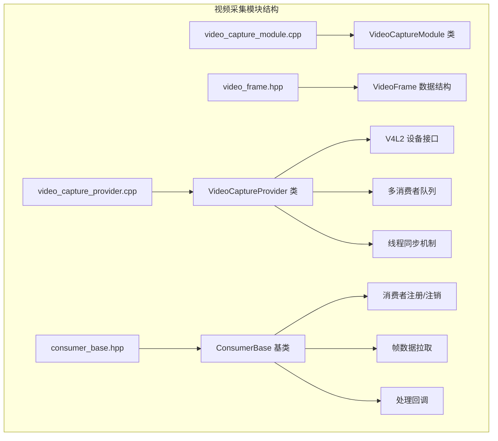
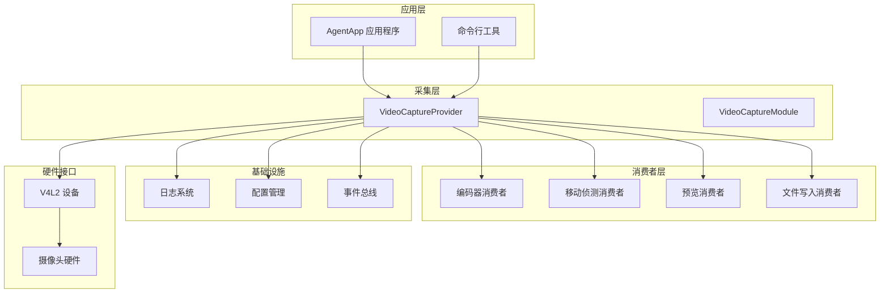
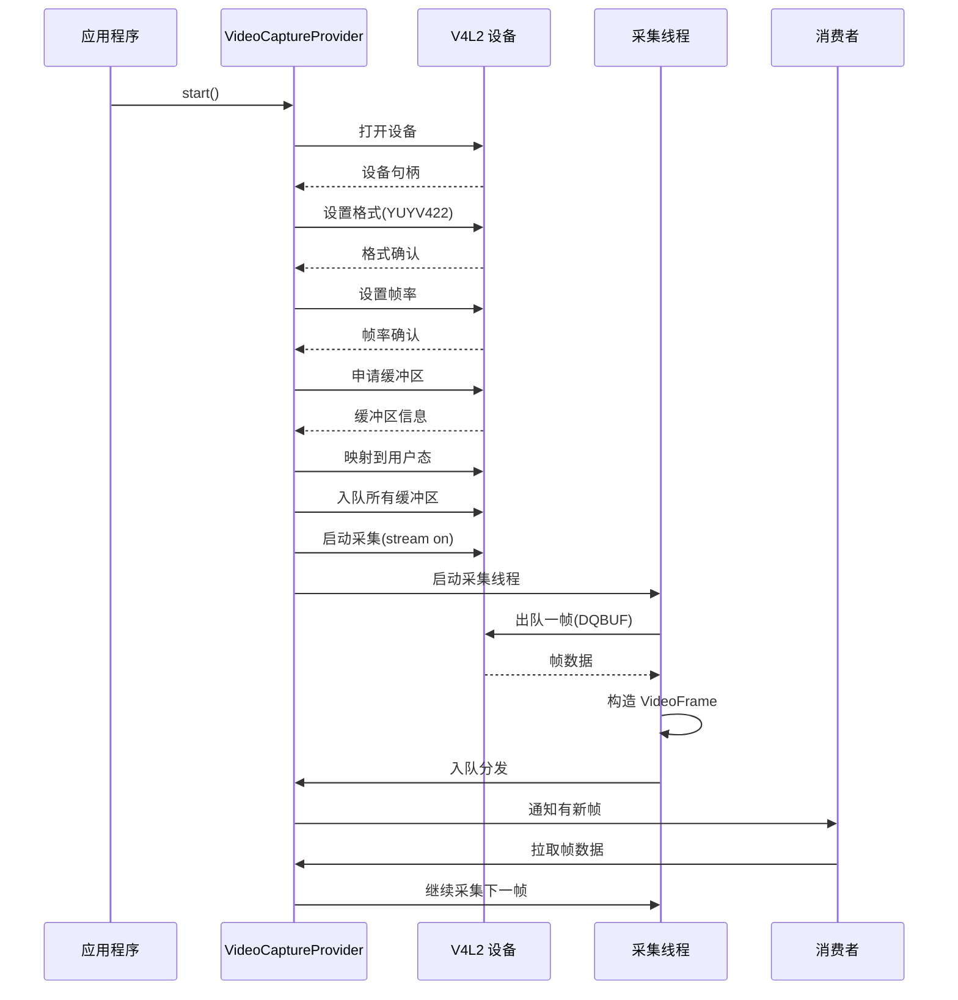
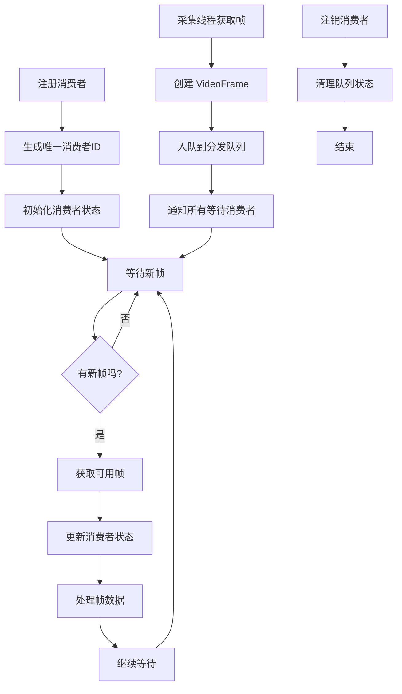
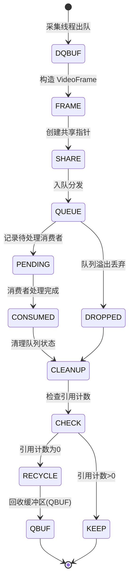
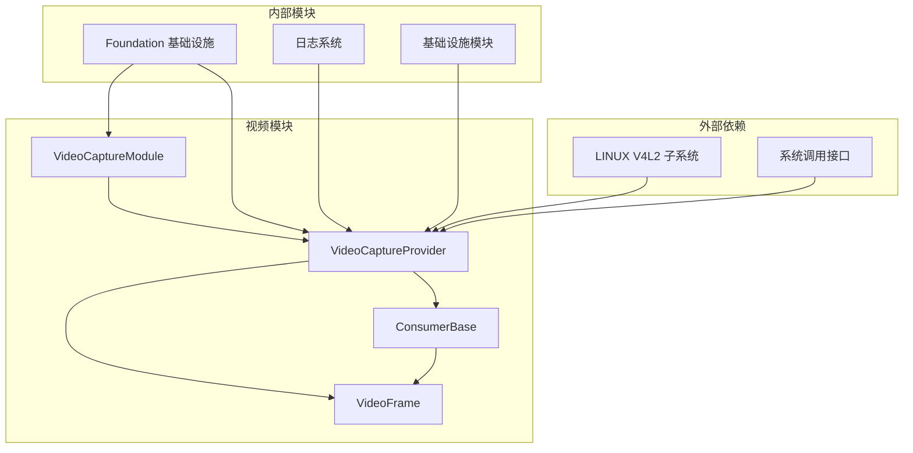
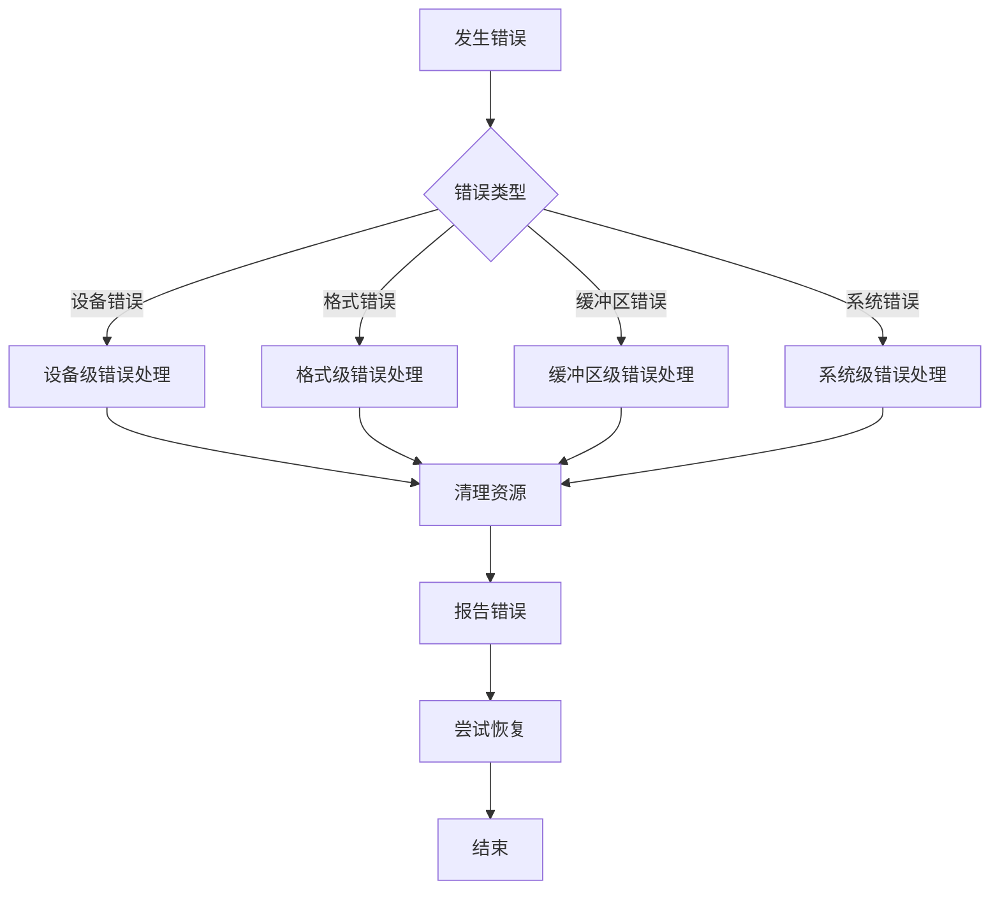

# 视频采集技术文档

<cite>
**本文档引用的文件**
- [视频采集技术文档.md](file://docs/agent/视频采集技术文档.md)
- [video_capture_provider.cpp](file://project/agent/src/modules/capture/video/video_capture_provider.cpp)
- [video_capture_provider.hpp](file://project/agent/src/modules/capture/video/include/capture_video/video_capture_provider.hpp)
- [video_capture_module.cpp](file://project/agent/src/modules/capture/video/video_capture_module.cpp)
- [video_capture_module.hpp](file://project/agent/src/modules/capture/video/include/capture_video/video_capture_module.hpp)
- [video_frame.hpp](file://project/agent/src/modules/capture/video/include/capture_video/video_frame.hpp)
- [consumer_base.hpp](file://project/agent/src/modules/capture/video/include/capture_video/consumer_base.hpp)
- [types.hpp](file://project/agent/src/foundation/include/foundation/types.hpp)
- [module.hpp](file://project/agent/src/foundation/include/foundation/module.hpp)
- [main.cpp](file://project/agent/cli/preview-video/main.cpp)
- [frame_viewer_consumer.cpp](file://project/agent/cli/preview-video/frame_viewer_consumer.cpp)
- [agent_app.cpp](file://project/agent/src/runtime/app/agent_app.cpp)
- [CMakeLists.txt](file://project/agent/CMakeLists.txt)
</cite>

## 更新摘要
**变更内容**
- 更新多消费者队列状态跟踪机制的描述，反映 `consumers_` 变量重命名为 `active_consumers_`
- 改进消费者集合管理的语义清晰度说明，明确区分活跃消费者与已注销消费者
- 更新相关架构图和流程图中的变量命名
- 强调内存映射缓冲区的正确使用方式和生命周期管理
- 完善多消费者状态管理的内存影响分析

## 目录
1. [简介](#简介)
2. [项目结构](#项目结构)
3. [核心组件](#核心组件)
4. [架构概览](#架构概览)
5. [详细组件分析](#详细组件分析)
6. [依赖关系分析](#依赖关系分析)
7. [性能考虑](#性能考虑)
8. [故障排除指南](#故障排除指南)
9. [结论](#结论)
10. [附录](#附录)

## 简介

视频采集模块是 pi-guard 系统的核心组件之一，通过 V4L2 接口从摄像头捕获原始视频帧，采用多消费者队列模式分发给下游处理单元（编码器、移动侦测、预览等）。该模块实现了高效的视频数据采集和分发机制，支持多线程并发处理和灵活的消费者管理。

**输入**：V4L2 视频设备（如 `/dev/video0`）
**输出**：VideoFrame（YUYV422 原始像素）
**下游**：编码器、移动侦测、预览等消费者独立拉取

## 项目结构

视频采集模块位于 `project/agent/src/modules/capture/video/` 目录下，包含以下主要组件：



**图表来源**
- [video_capture_module.cpp:1-25](file://project/agent/src/modules/capture/video/video_capture_module.cpp#L1-L25)
- [video_capture_provider.cpp:1-457](file://project/agent/src/modules/capture/video/video_capture_provider.cpp#L1-L457)
- [video_frame.hpp:1-23](file://project/agent/src/modules/capture/video/include/capture_video/video_frame.hpp#L1-L23)
- [consumer_base.hpp:1-51](file://project/agent/src/modules/capture/video/include/capture_video/consumer_base.hpp#L1-L51)

**章节来源**
- [CMakeLists.txt:11-26](file://project/agent/CMakeLists.txt#L11-L26)
- [video_capture_module.cpp:1-25](file://project/agent/src/modules/capture/video/video_capture_module.cpp#L1-L25)

## 核心组件

### VideoCaptureProvider 类

VideoCaptureProvider 是视频采集的核心类，负责 V4L2 设备的初始化、视频帧的采集和分发。该类实现了完整的生命周期管理，包括设备打开、格式配置、缓冲区管理和采集线程控制。

**主要功能特性**：
- V4L2 设备初始化和配置
- 多消费者队列管理
- 线程安全的帧分发机制
- 自动化的资源清理和回收

**关键数据结构**：
- `QueuedFrame`：封装 VideoFrame 和待处理消费者集合
- `MMapBuffer`：存储 mmap 缓冲区信息
- `consumer_id_t`：消费者唯一标识符类型

### VideoFrame 结构体

VideoFrame 是视频采集的基本数据单元，包含帧的元数据和像素数据指针。该结构体设计精简，专注于提供最小必要的信息给下游消费者。

**字段说明**：
- `seq`：全局递增帧序号，用于跟踪帧的先后顺序
- `timestamp_ns`：采集时刻的时间戳（纳秒精度）
- `data`：指向 mmap 映射内存的指针
- `length`：帧数据的实际大小
- `v4l2_ref`：V4L2 缓冲区引用计数，确保缓冲区正确回收

### ConsumerBase 基类

ConsumerBase 提供了视频消费者的通用框架，简化了消费者的实现过程。该基类自动处理消费者注册、帧数据拉取和生命周期管理。

**核心方法**：
- `run()`：主循环，自动拉取和处理视频帧
- `process()`：纯虚函数，子类实现具体的处理逻辑
- `stop()`：优雅停止消费者运行

**章节来源**
- [video_capture_provider.hpp:15-109](file://project/agent/src/modules/capture/video/include/capture_video/video_capture_provider.hpp#L15-L109)
- [video_frame.hpp:10-20](file://project/agent/src/modules/capture/video/include/capture_video/video_frame.hpp#L10-L20)
- [consumer_base.hpp:11-48](file://project/agent/src/modules/capture/video/include/capture_video/consumer_base.hpp#L11-L48)

## 架构概览

视频采集系统采用模块化设计，遵循清晰的职责分离原则。整个架构围绕 VideoCaptureProvider 核心组件构建，通过多消费者模式实现视频数据的高效分发。



**图表来源**
- [agent_app.cpp:7-42](file://project/agent/src/runtime/app/agent_app.cpp#L7-L42)
- [video_capture_provider.cpp:48-82](file://project/agent/src/modules/capture/video/video_capture_provider.cpp#L48-L82)
- [main.cpp:25-59](file://project/agent/cli/preview-video/main.cpp#L25-L59)

系统架构的关键特点：

1. **模块化设计**：每个组件都有明确的职责和接口
2. **多消费者支持**：单个采集器可以同时服务多个下游消费者
3. **线程安全**：使用互斥锁和条件变量确保并发安全
4. **资源管理**：自动化的资源分配和回收机制
5. **错误处理**：完善的异常处理和恢复机制

## 详细组件分析

### V4L2 采集流程

视频采集的核心流程基于 V4L2 标准接口，实现了完整的设备初始化和数据采集过程。



**图表来源**
- [video_capture_provider.cpp:48-82](file://project/agent/src/modules/capture/video/video_capture_provider.cpp#L48-L82)
- [video_capture_provider.cpp:310-401](file://project/agent/src/modules/capture/video/video_capture_provider.cpp#L310-L401)

**关键步骤详解**：

1. **设备初始化阶段**：
   - 打开 V4L2 设备文件
   - 设置像素格式为 YUYV422
   - 配置采集帧率
   - 申请并映射 mmap 缓冲区

2. **采集循环阶段**：
   - 从驱动出队一帧数据
   - 构造 VideoFrame 对象
   - 设置引用计数删除器
   - 入队到分发队列
   - 通知等待的消费者

3. **资源清理阶段**：
   - 停止视频流采集
   - 解除所有 mmap 映射
   - 关闭设备文件描述符

### 多消费者队列机制

视频采集模块实现了高效的多消费者队列机制，允许多个消费者独立地从采集器获取视频帧数据。



**图表来源**
- [video_capture_provider.cpp:126-162](file://project/agent/src/modules/capture/video/video_capture_provider.cpp#L126-L162)
- [video_capture_provider.cpp:420-454](file://project/agent/src/modules/capture/video/video_capture_provider.cpp#L420-L454)

**队列管理策略**：

1. **消费者注册**：每个消费者获得唯一的 ID，用于区分不同的数据流
2. **帧分发**：新帧入队时，记录所有活跃消费者的集合到 `active_consumers_`
3. **消费者拉取**：消费者根据 last_seq 参数获取未处理的帧
4. **状态清理**：消费者处理完成后，从队列中清除其待处理标记

**更新** 多消费者队列状态跟踪现在使用 `active_consumers_` 变量名，提高了语义清晰度，明确表示这是当前已注册的活跃消费者集合。已注销的消费者不会出现在此集合中，确保内存管理的准确性。

### 引用计数与缓冲区回收

这是视频采集模块最核心的设计创新，解决了 V4L2 缓冲区必须正确回收的问题。



**图表来源**
- [video_capture_provider.cpp:368-376](file://project/agent/src/modules/capture/video/video_capture_provider.cpp#L368-L376)
- [video_frame.hpp:17-19](file://project/agent/src/modules/capture/video/include/capture_video/video_frame.hpp#L17-L19)

**双重引用计数机制**：

| 引用来源 | 引用计数 +1 时机 | 引用计数 -1 时机 |
|---|---|---|
| 队列节点 | queue_.push_back() | queue_.erase() 或 pop_front() |
| 消费者 A | wait_frame() 返回的 vector 中 | 消费者释放 vector |
| 消费者 B | wait_frame() 返回的 vector 中 | 消费者释放 vector |

**关键保证**：即使消费者崩溃未释放帧，或队列溢出丢弃旧帧，引用计数机制确保 QBUF 最终一定会发生。

**更新** 内存映射缓冲区的处理方式得到进一步澄清：VideoFrame 中的 `data` 字段直接指向 mmap 映射的内存区域，而不是复制数据。这确保了零拷贝的高效性，但要求消费者必须在使用完帧数据后及时释放，以避免内存泄漏。

### 线程架构设计

视频采集模块采用多线程架构，确保高并发环境下的稳定性和性能。

```mermaid
graph TB
subgraph "主线程"
START[start() 启动]
INIT[V4L2 初始化]
LAUNCH[启动采集线程]
HANDSHAKE[启动握手]
end
subgraph "采集线程"
LOOP[produce_loop() 主循环]
DQBUF[VIDIOC_DQBUF 出队]
FRAME[构造 VideoFrame]
BIND[绑定 QBUF 删除器]
ENQ[入队分发]
NOTIFY[通知消费者]
end
subgraph "消费者线程"
WAIT[wait_frame() 等待]
PROC[处理 VideoFrame]
NEXT[继续等待]
end
START --> INIT --> LAUNCH --> HANDSHAKE
LAUNCH --> LOOP
LOOP --> DQBUF --> FRAME --> BIND --> ENQ --> NOTIFY
NOTIFY --> WAIT
WAIT --> PROC --> NEXT --> WAIT
```

**图表来源**
- [video_capture_provider.cpp:48-82](file://project/agent/src/modules/capture/video/video_capture_provider.cpp#L48-L82)
- [video_capture_provider.cpp:310-401](file://project/agent/src/modules/capture/video/video_capture_provider.cpp#L310-L401)

**线程同步机制**：

1. **启动握手**：主线程等待采集线程完成初始化
2. **状态保护**：使用互斥锁保护共享状态
3. **条件变量**：用于线程间的协调和通知
4. **优雅停止**：通过 running_ 标志实现安全的线程终止

**章节来源**
- [video_capture_provider.cpp:48-102](file://project/agent/src/modules/capture/video/video_capture_provider.cpp#L48-L102)
- [video_capture_provider.cpp:310-401](file://project/agent/src/modules/capture/video/video_capture_provider.cpp#L310-L401)

## 依赖关系分析

视频采集模块的依赖关系清晰明确，遵循了良好的软件工程原则。



**图表来源**
- [video_capture_provider.cpp:1-16](file://project/agent/src/modules/capture/video/video_capture_provider.cpp#L1-L16)
- [video_capture_module.cpp:3-6](file://project/agent/src/modules/capture/video/video_capture_module.cpp#L3-L6)

**依赖层次分析**：

1. **硬件抽象层**：V4L2 子系统提供统一的设备访问接口
2. **基础设施层**：Foundation 提供基础的模块化框架
3. **日志系统**：提供统一的日志记录机制
4. **业务逻辑层**：视频采集的具体实现

**章节来源**
- [video_capture_provider.cpp:1-16](file://project/agent/src/modules/capture/video/video_capture_provider.cpp#L1-L16)
- [module.hpp:7-14](file://project/agent/src/foundation/include/foundation/module.hpp#L7-L14)

## 性能考虑

视频采集模块在设计时充分考虑了性能优化，采用了多种策略来提升系统的整体表现。

### 缓冲区管理优化

- **mmap 映射**：使用内存映射减少数据复制开销
- **双缓冲策略**：至少 2 个缓冲区确保连续采集
- **动态调整**：可根据负载动态调整缓冲区数量

### 线程性能优化

- **无锁设计**：在非竞争情况下避免不必要的锁竞争
- **批量处理**：消费者可以批量获取多帧数据
- **条件变量**：精确的线程唤醒机制

### 内存管理优化

- **智能指针**：自动化的内存管理，避免内存泄漏
- **引用计数**：确保资源的正确回收
- **队列容量控制**：防止内存过度占用

**更新** 多消费者状态管理的内存影响分析：
- `active_consumers_` 集合只包含当前活跃的消费者，减少了不必要的内存占用
- 每个消费者只持有其需要的帧数据，避免了重复内存分配
- 引用计数机制确保内存的精确回收，防止内存泄漏

## 故障排除指南

### 常见问题诊断

**设备打开失败**：
- 检查设备路径是否正确
- 验证用户权限是否足够
- 确认设备是否被其他程序占用

**格式设置失败**：
- 验证摄像头是否支持所需的像素格式
- 检查分辨率参数是否在设备支持范围内
- 确认帧率设置是否合理

**缓冲区申请失败**：
- 检查系统内存是否充足
- 验证 mmap 功能是否正常
- 确认缓冲区数量配置是否合理

**内存泄漏问题**：
- 确保消费者正确释放帧数据
- 验证 `active_consumers_` 集合的正确更新
- 检查引用计数的完整性

### 错误处理机制

视频采集模块实现了完善的错误处理机制，能够优雅地处理各种异常情况：



**图表来源**
- [video_capture_provider.cpp:104-124](file://project/agent/src/modules/capture/video/video_capture_provider.cpp#L104-L124)

**章节来源**
- [video_capture_provider.cpp:48-82](file://project/agent/src/modules/capture/video/video_capture_provider.cpp#L48-L82)
- [video_capture_provider.cpp:320-401](file://project/agent/src/modules/capture/video/video_capture_provider.cpp#L320-L401)

## 结论

视频采集模块是 pi-guard 系统的重要组成部分，通过精心设计的架构和实现，提供了高效、可靠的视频数据采集能力。该模块的主要优势包括：

1. **模块化设计**：清晰的职责分离和接口定义
2. **多消费者支持**：灵活的数据分发机制
3. **线程安全**：完善的并发控制和资源管理
4. **性能优化**：高效的内存和 CPU 使用策略
5. **错误处理**：健壮的异常处理和恢复机制

**更新** 最新的改进包括：
- 更清晰的多消费者状态管理，使用 `active_consumers_` 变量名
- 改进的内存映射缓冲区处理方式
- 更准确的消费者类型区分和内存影响分析

该模块为整个 pi-guard 系统奠定了坚实的基础，支持后续的视频编码、处理和传输等功能的开发和集成。

## 附录

### 快速开始示例

以下是一个简单的使用示例，展示了如何使用视频采集模块：

```cpp
#include "capture_video/video_capture_provider.hpp"
#include "capture_video/consumer_base.hpp"

// 创建视频采集器
auto provider = std::make_shared<piguard::capture_video::VideoCaptureProvider>(
    "/dev/video0",   // V4L2 设备路径
    25,              // 采集帧率 fps
    640,             // 宽度
    480,             // 高度
    4,               // mmap 缓冲区个数
    30               // 队列最大容量
);

// 启动采集
provider->start();

// 注册消费者并拉取数据
auto consumer_id = provider->register_consumer();
uint64_t last_seq = 0;

while (running) {
    auto frames = provider->wait_frame(consumer_id, last_seq);
    for (const auto& frame : frames) {
        // 处理视频帧数据
    }
    if (!frames.empty()) {
        last_seq = frames.back()->seq;
    }
}

// 注销并停止
provider->unregister_consumer(consumer_id);
provider->stop();
```

### 配置参数说明

| 参数名称 | 类型 | 默认值 | 说明 |
|---|---|---|---|
| device | string | "/dev/video0" | V4L2 设备路径 |
| capture_fps | int | 25 | 期望采集帧率 |
| capture_width | int | 640 | 期望分辨率宽度 |
| capture_height | int | 480 | 期望分辨率高度 |
| buffer_count | uint32_t | 4 | mmap 缓冲区个数 |
| max_capacity | size_t | 30 | 分发队列最大帧数 |

### 性能基准

基于 YUYV422 格式的视频数据量估算：

- 640×480 分辨率：约 600 KB/帧
- 1280×720 分辨率：约 1.8 MB/帧  
- 1920×1080 分辨率：约 4 MB/帧

在 25fps 帧率下，不同分辨率的带宽需求：
- 640×480：约 15 MB/s
- 1280×720：约 45 MB/s
- 1920×1080：约 100 MB/s

**更新** 内存使用优化：
- 使用 mmap 直接访问硬件缓冲区，避免额外内存复制
- `active_consumers_` 集合只维护活跃消费者，减少内存占用
- 引用计数确保精确的内存回收，防止泄漏