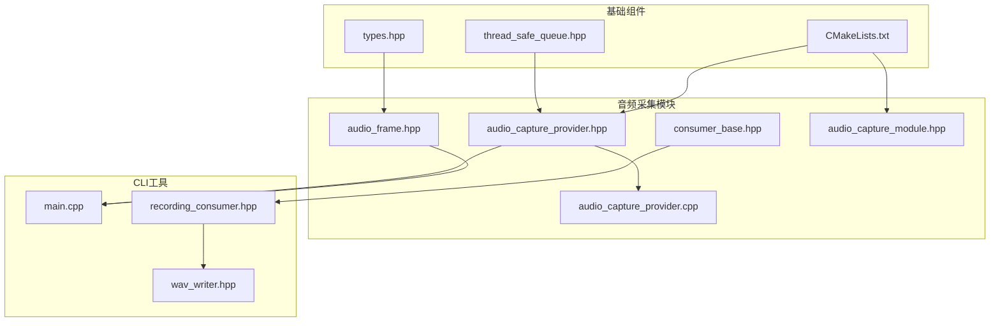
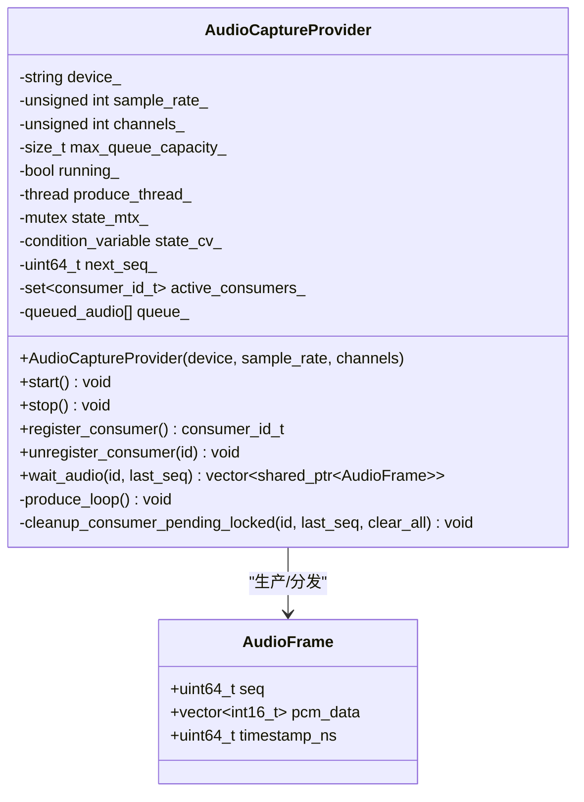
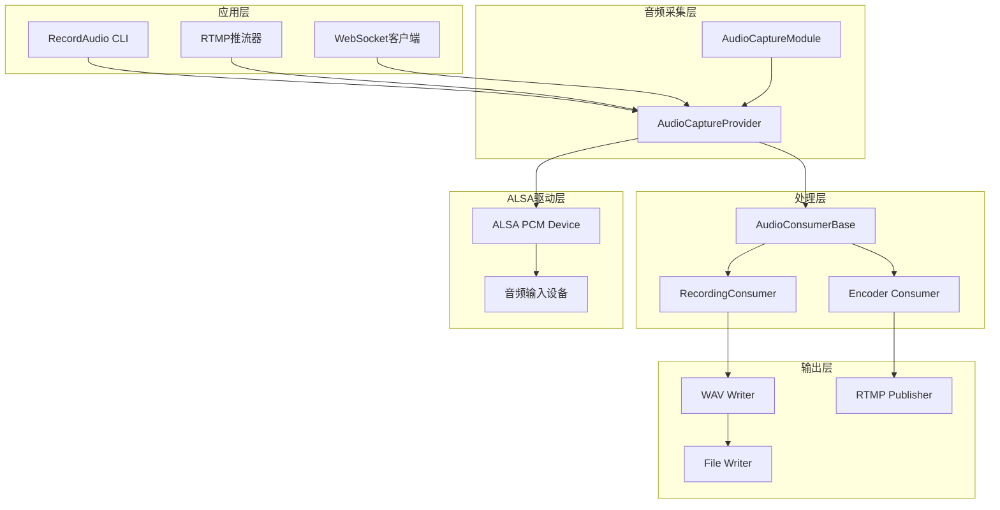
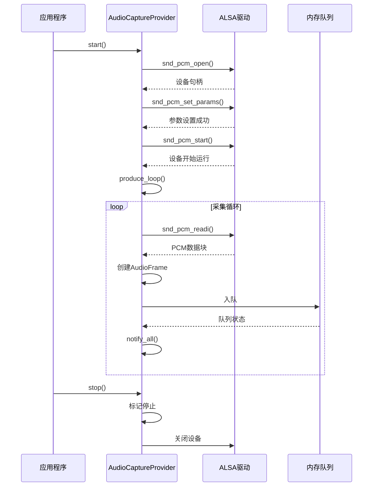
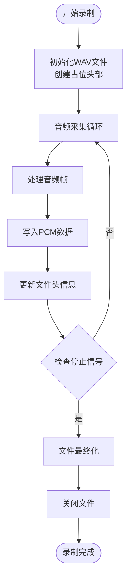
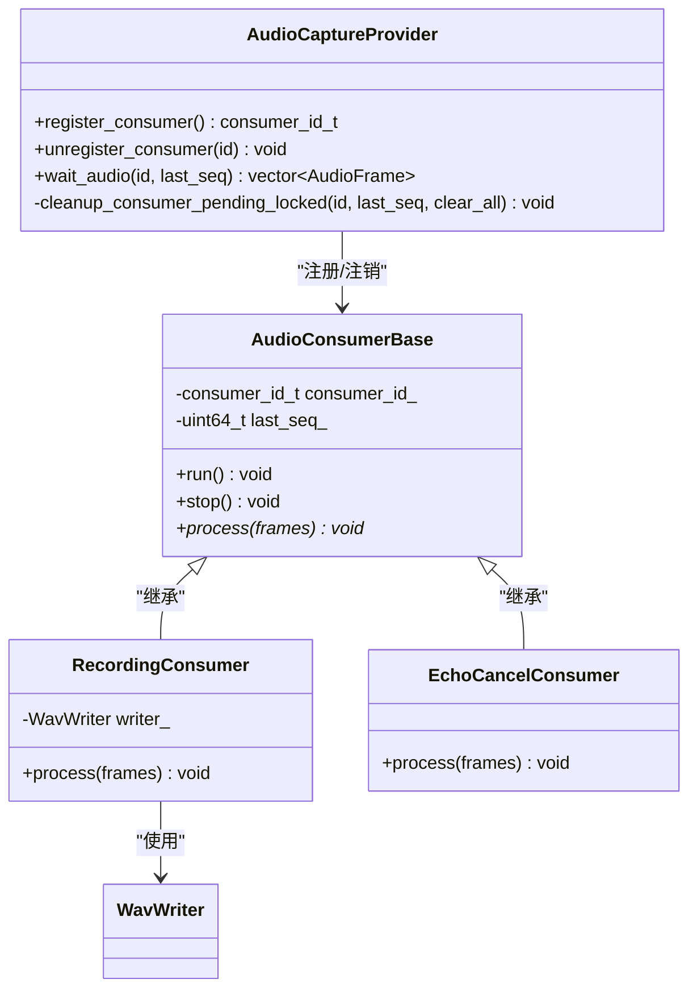
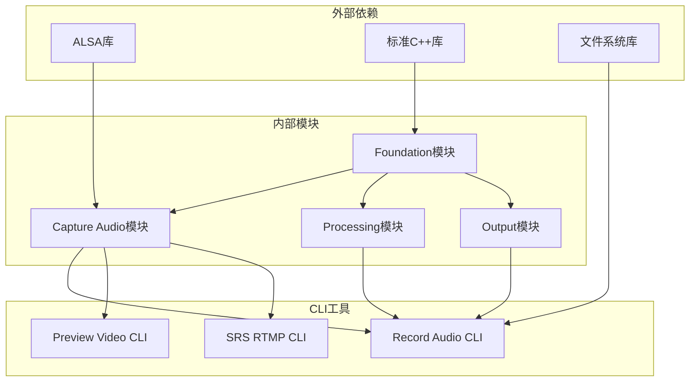

# 音频采集技术文档

<cite>
**本文档引用的文件**
- [audio_capture_provider.hpp](file://project/agent/src/modules/capture/audio/include/capture_audio/audio_capture_provider.hpp)
- [audio_capture_provider.cpp](file://project/agent/src/modules/capture/audio/audio_capture_provider.cpp)
- [audio_frame.hpp](file://project/agent/src/modules/capture/audio/include/capture_audio/audio_frame.hpp)
- [consumer_base.hpp](file://project/agent/src/modules/capture/audio/include/capture_audio/consumer_base.hpp)
- [audio_capture_module.hpp](file://project/agent/src/modules/capture/audio/include/capture_audio/audio_capture_module.hpp)
- [types.hpp](file://project/agent/src/foundation/include/foundation/types.hpp)
- [thread_safe_queue.hpp](file://project/agent/src/foundation/include/foundation/thread_safe_queue.hpp)
- [main.cpp](file://project/agent/cli/record-audio/main.cpp)
- [recording_consumer.hpp](file://project/agent/cli/record-audio/recording_consumer.hpp)
- [wav_writer.hpp](file://project/agent/cli/record-audio/wav_writer.hpp)
- [CMakeLists.txt](file://project/agent/CMakeLists.txt)
</cite>

## 更新摘要
**所做变更**
- 更新了音频采集提供者类的状态跟踪机制，将 `consumers_` 变量重命名为 `active_consumers_`
- 改进了多消费者并发处理架构的状态管理
- 更新了相关文档中的变量命名和状态跟踪说明

## 目录
1. [简介](#简介)
2. [项目结构](#项目结构)
3. [核心组件](#核心组件)
4. [架构概览](#架构概览)
5. [详细组件分析](#详细组件分析)
6. [依赖关系分析](#依赖关系分析)
7. [性能考虑](#性能考虑)
8. [故障排除指南](#故障排除指南)
9. [结论](#结论)

## 简介

本技术文档详细介绍了Pi-Guard项目中的音频采集系统。该系统基于ALSA音频框架，实现了高效的音频数据采集、处理和存储功能。系统采用模块化设计，支持多消费者并发处理，具备良好的实时性和可靠性。

音频采集系统主要包含以下核心特性：
- 基于ALSA的音频设备驱动接口
- 实时音频数据采集和缓冲管理
- 多消费者并发处理架构
- WAV格式音频文件录制功能
- 完善的错误处理和资源管理机制

## 项目结构

音频采集系统位于项目的Agent子模块中，采用清晰的层次化组织结构：

**图表来源**
- [audio_capture_provider.hpp:1-105](file://project/agent/src/modules/capture/audio/include/capture_audio/audio_capture_provider.hpp#L1-L105)
- [audio_capture_provider.cpp:1-271](file://project/agent/src/modules/capture/audio/audio_capture_provider.cpp#L1-L271)
- [main.cpp:1-79](file://project/agent/cli/record-audio/main.cpp#L1-L79)

**章节来源**
- [CMakeLists.txt:1-51](file://project/agent/CMakeLists.txt#L1-L51)

## 核心组件

### 音频帧数据结构

音频帧是系统中最小的数据传输单元，封装了完整的PCM音频数据信息：

| 字段名称 | 类型 | 描述 | 大小 |
|---------|------|------|------|
| seq | uint64_t | 序列号，用于帧顺序跟踪 | 8字节 |
| pcm_data | vector<int16_t> | PCM S16_LE交织音频数据 | 可变长度 |
| timestamp_ns | uint64_t | 采集时间戳（纳秒） | 8字节 |

### 音频捕获提供者

AudioCaptureProvider是音频采集的核心组件，实现了单生产者-多消费者的架构模式：

**图表来源**
- [audio_capture_provider.hpp:20-105](file://project/agent/src/modules/capture/audio/include/capture_audio/audio_capture_provider.hpp#L20-L105)
- [audio_frame.hpp:11-18](file://project/agent/src/modules/capture/audio/include/capture_audio/audio_frame.hpp#L11-L18)

### 音频消费者基类

AudioConsumerBase提供了统一的消费者接口，支持自动注册和注销机制：

| 方法名称 | 功能描述 | 返回值 |
|---------|----------|--------|
| register_consumer() | 自动注册消费者ID | consumer_id_t |
| unregister_consumer(id) | 注销指定消费者 | void |
| wait_audio(id, last_seq) | 等待并获取音频帧 | vector~shared_ptr~AudioFrame~~ |
| run() | 主要处理循环 | void |
| stop() | 停止处理 | void |

**章节来源**
- [consumer_base.hpp:19-61](file://project/agent/src/modules/capture/audio/include/capture_audio/consumer_base.hpp#L19-L61)

## 架构概览

音频采集系统采用分层架构设计，确保了模块间的松耦合和高内聚性：

**图表来源**
- [audio_capture_provider.cpp:170-268](file://project/agent/src/modules/capture/audio/audio_capture_provider.cpp#L170-L268)
- [main.cpp:27-79](file://project/agent/cli/record-audio/main.cpp#L27-L79)

## 详细组件分析

### ALSA音频采集实现

系统使用ALSA（Advanced Linux Sound Architecture）作为底层音频驱动接口，实现了高效的音频数据采集：

**图表来源**
- [audio_capture_provider.cpp:170-268](file://project/agent/src/modules/capture/audio/audio_capture_provider.cpp#L170-L268)

#### 关键实现细节

1. **设备初始化流程**：
   - 设备打开：`snd_pcm_open()`
   - 参数设置：`snd_pcm_set_params()`
   - 显式启动：`snd_pcm_start()`

2. **数据采集策略**：
   - 使用固定大小的缓冲区（约20ms音频片段）
   - 实时转换为AudioFrame对象
   - 多消费者广播机制

3. **错误处理机制**：
   - 自动错误恢复：`snd_pcm_recover()`
   - 优雅降级处理
   - 资源清理保证

**章节来源**
- [audio_capture_provider.cpp:170-268](file://project/agent/src/modules/capture/audio/audio_capture_provider.cpp#L170-L268)

### WAV文件录制功能

系统提供了完整的WAV格式音频文件录制功能，支持实时录制和文件格式化：

**图表来源**
- [wav_writer.hpp:11-49](file://project/agent/cli/record-audio/wav_writer.hpp#L11-L49)

#### WAV文件格式规范

| 字段名称 | 大小(字节) | 值 | 描述 |
|---------|-----------|----|------|
| RIFF标记 | 4 | "RIFF" | 文件标识 |
| 文件大小 | 4 | 36 + 数据大小 | 整个文件大小 |
| WAVE标记 | 4 | "WAVE" | WAVE格式标识 |
| fmt标记 | 4 | "fmt " | 格式块标识 |
| 格式大小 | 4 | 16 | fmt块大小 |
| 格式类型 | 2 | 1 | PCM格式 |
| 声道数 | 2 | 1或2 | 单声道或立体声 |
| 采样率 | 4 | 16000 | 采样频率(Hz) |
| 字节率 | 4 | 通道数×采样率×位深/8 | 数据传输速率 |
| 块对齐 | 2 | 通道数×位深/8 | 数据块对齐 |
| 位深 | 2 | 16 | PCM位深度 |
| data标记 | 4 | "data" | 数据块标识 |
| 数据大小 | 4 | 实际数据大小 | PCM数据大小 |

**章节来源**
- [wav_writer.hpp:8-49](file://project/agent/cli/record-audio/wav_writer.hpp#L8-L49)

### 多消费者并发处理

系统支持多个消费者同时处理同一音频流，采用消费者ID和序列号机制确保数据一致性：

**图表来源**
- [consumer_base.hpp:19-61](file://project/agent/src/modules/capture/audio/include/capture_audio/consumer_base.hpp#L19-L61)
- [recording_consumer.hpp:10-21](file://project/agent/cli/record-audio/recording_consumer.hpp#L10-L21)

**章节来源**
- [audio_capture_provider.cpp:92-159](file://project/agent/src/modules/capture/audio/audio_capture_provider.cpp#L92-L159)

## 依赖关系分析

音频采集系统的依赖关系体现了清晰的分层架构：

**图表来源**
- [CMakeLists.txt:11-27](file://project/agent/CMakeLists.txt#L11-L27)

### 关键依赖关系

1. **ALSA驱动依赖**：系统直接依赖ALSA库进行音频设备操作
2. **基础组件依赖**：所有模块都依赖Foundation提供的通用基础设施
3. **模块间通信**：通过AudioFrame和ThreadSafeQueue实现松耦合通信
4. **构建系统集成**：CMakeLists.txt定义了完整的模块依赖关系

**章节来源**
- [CMakeLists.txt:11-27](file://project/agent/CMakeLists.txt#L11-L27)

## 性能考虑

### 内存管理优化

系统采用了多种内存管理策略来确保高性能运行：

1. **环形缓冲区设计**：最大队列容量限制为50帧，约1秒的音频缓冲
2. **智能指针使用**：AudioFrame使用shared_ptr避免内存泄漏
3. **批量数据处理**：消费者端采用批量处理减少上下文切换
4. **零拷贝优化**：尽量避免不必要的数据复制操作

### 实时性保障

1. **优先级调度**：音频采集线程具有较高的执行优先级
2. **非阻塞I/O**：ALSA操作采用适当的超时机制
3. **缓冲区管理**：动态调整缓冲区大小适应不同硬件条件
4. **错误快速恢复**：ALSA错误自动恢复机制减少停顿时间

### 资源管理

1. **RAII模式**：所有资源使用RAII确保正确释放
2. **异常安全**：关键操作具有强异常安全性
3. **连接监控**：实时监控音频设备连接状态
4. **内存泄漏防护**：完善的资源生命周期管理

## 故障排除指南

### 常见问题及解决方案

#### ALSA设备访问问题

**问题症状**：
- 启动时提示无法打开音频设备
- ALSA错误码显示设备忙或权限不足

**解决步骤**：
1. 检查ALSA设备名称是否正确
2. 验证用户是否有audio组权限
3. 确认设备未被其他应用程序占用
4. 查看系统日志获取详细错误信息

**相关代码位置**：
- [audio_capture_provider.cpp:170-210](file://project/agent/src/modules/capture/audio/audio_capture_provider.cpp#L170-L210)

#### 音频质量异常

**问题症状**：
- 录制音频出现杂音或失真
- 声音断断续续或完全无声

**诊断方法**：
1. 检查采样率和声道数配置
2. 验证音频设备增益设置
3. 确认缓冲区大小设置合理
4. 测试不同ALSA设备驱动

**相关代码位置**：
- [audio_capture_provider.cpp:182-208](file://project/agent/src/modules/capture/audio/audio_capture_provider.cpp#L182-L208)

#### 内存使用过高

**问题症状**：
- 系统内存占用持续增长
- 应用程序响应缓慢

**排查步骤**：
1. 检查队列长度是否超过预期
2. 验证消费者是否及时处理音频帧
3. 确认资源释放机制正常工作
4. 分析内存泄漏可能的来源

**相关代码位置**：
- [audio_capture_provider.cpp:251-257](file://project/agent/src/modules/capture/audio/audio_capture_provider.cpp#L251-L257)

### 调试工具和方法

1. **日志级别调整**：通过修改日志工厂配置获取更详细的调试信息
2. **性能监控**：使用系统监控工具观察CPU和内存使用情况
3. **音频测试**：使用标准音频测试工具验证设备功能
4. **网络诊断**：对于RTMP推流功能，使用网络分析工具检查连接状态

**章节来源**
- [audio_capture_provider.cpp:14-16](file://project/agent/src/modules/capture/audio/audio_capture_provider.cpp#L14-L16)

## 结论

Pi-Guard项目的音频采集系统展现了优秀的工程实践，具有以下突出特点：

1. **架构设计优秀**：采用模块化和分层设计，确保了系统的可维护性和扩展性
2. **性能表现优异**：通过合理的缓冲管理和实时调度机制，实现了低延迟的音频处理
3. **可靠性强**：完善的错误处理和资源管理机制，确保了系统稳定运行
4. **兼容性好**：基于ALSA的标准接口，支持广泛的音频设备
5. **易于使用**：提供了简单易用的CLI工具和API接口

该系统为后续的功能扩展（如音频编码、噪声抑制、语音识别等）奠定了坚实的基础，是一个值得学习和借鉴的优秀音频处理系统实现。

**更新** 本次更新反映了代码重构中将 `consumers_` 变量重命名为 `active_consumers_` 的改进，这一变更改善了音频采集模块的状态跟踪机制，使变量命名更加清晰地表达了其含义，提高了代码的可读性和维护性。