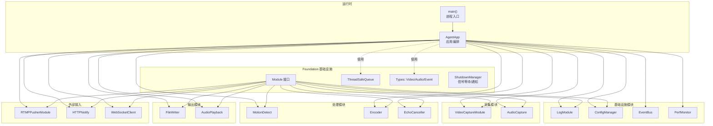
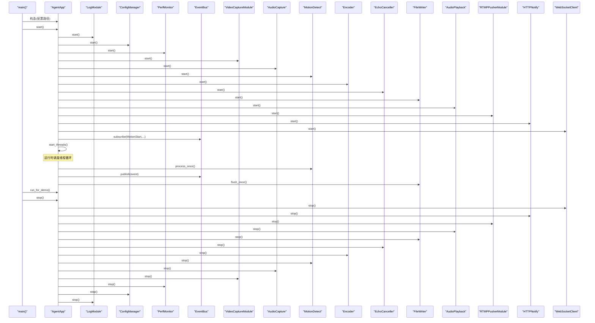
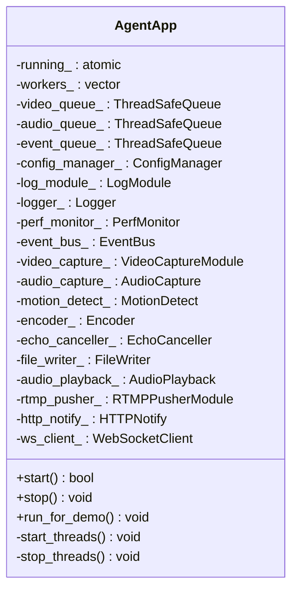
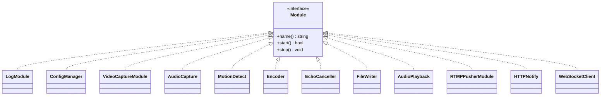
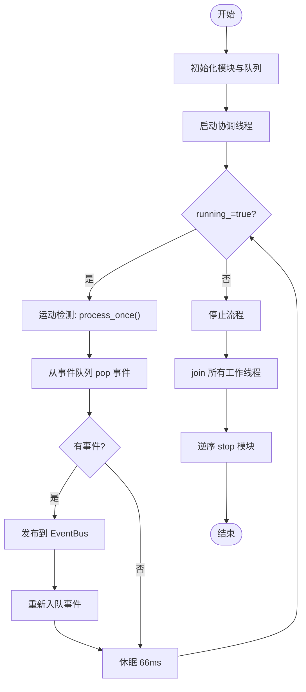
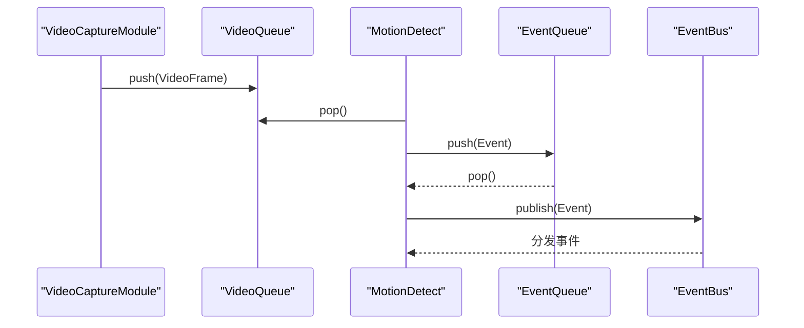
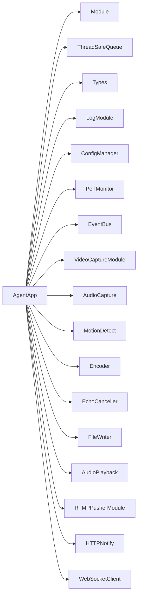

# 核心应用架构

<cite>
**本文引用的文件**
- [agent_app.hpp](file://project/agent/src/runtime/include/agent_app.hpp)
- [agent_app.cpp](file://project/agent/src/runtime/app/agent_app.cpp)
- [main.cpp](file://project/agent/src/main.cpp)
- [module.hpp](file://project/agent/src/foundation/include/foundation/module.hpp)
- [shutdown_manager.cpp](file://project/agent/src/foundation/shutdown_manager.cpp)
- [video_capture_module.hpp](file://project/agent/src/modules/capture/video/include/capture_video/video_capture_module.hpp)
- [audio_capture_module.hpp](file://project/agent/src/modules/capture/audio/include/capture_audio/audio_capture_module.hpp)
- [encoder_module.hpp](file://project/agent/src/modules/processing/encoder/include/processing_encoder/encoder_module.hpp)
- [log_module.hpp](file://project/agent/src/modules/infra/log/include/infra_log/log_module.hpp)
- [config_manager.hpp](file://project/agent/src/modules/infra/config/include/infra_config/config_manager.hpp)
- [types.hpp](file://project/agent/src/foundation/include/foundation/types.hpp)
- [thread_safe_queue.hpp](file://project/agent/src/foundation/include/foundation/thread_safe_queue.hpp)
</cite>

## 目录
1. [引言](#引言)
2. [项目结构](#项目结构)
3. [核心组件](#核心组件)
4. [架构总览](#架构总览)
5. [详细组件分析](#详细组件分析)
6. [依赖分析](#依赖分析)
7. [性能考虑](#性能考虑)
8. [故障排查指南](#故障排查指南)
9. [结论](#结论)
10. [附录](#附录)

## 引言
本文件面向 AgentApp 核心应用架构，系统性阐述其设计原理、模块生命周期管理、线程管理策略与配置加载流程；详述应用启动、运行时调度与优雅停机；覆盖模块注册、初始化顺序、依赖注入与错误处理；并给出扩展新模块、配置应用行为与异常处理的实践指引。同时解释与 Foundation 层的交互关系及模块间通信模式。

## 项目结构
AgentApp 所在工程采用分层+功能域混合组织方式：Foundation 提供通用基础设施（模块接口、线程安全队列、事件类型等）；Runtime 负责应用编排与生命周期；Modules 按功能域划分具体模块（采集、处理、输出、外部接入、基础设施等）。入口程序负责实例化 AgentApp 并驱动其生命周期。

图表来源
- [agent_app.hpp:27-68](file://project/agent/src/runtime/include/agent_app.hpp#L27-L68)
- [agent_app.cpp:7-42](file://project/agent/src/runtime/app/agent_app.cpp#L7-L42)
- [module.hpp:7-14](file://project/agent/src/foundation/include/foundation/module.hpp#L7-L14)
- [main.cpp:6-18](file://project/agent/src/main.cpp#L6-L18)

章节来源
- [agent_app.hpp:1-71](file://project/agent/src/runtime/include/agent_app.hpp#L1-L71)
- [agent_app.cpp:1-138](file://project/agent/src/runtime/app/agent_app.cpp#L1-L138)
- [main.cpp:1-19](file://project/agent/src/main.cpp#L1-L19)

## 核心组件
- 应用编排器（AgentApp）
  - 职责：统一管理各子模块的生命周期、线程池与跨模块数据通路；提供启动/停止/演示运行能力。
  - 关键成员：日志模块、配置管理、性能监控、事件总线、采集/处理/输出/外部接入等模块实例；视频/音频/事件三类线程安全队列。
  - 生命周期：start()/stop()；内部通过原子标志 running_ 控制线程循环与退出。
- 基础设施（Foundation）
  - Module 接口：统一模块的 name/start/stop 约定。
  - ThreadSafeQueue<T>：带条件变量的线程安全队列，支持 push/wait_and_pop/size 等。
  - Types：定义 VideoFrame、AudioFrame、Event 及 EventType 枚举。
- 运行时入口（main）
  - 实例化 AgentApp，调用 start/run_for_demo/stop，完成一次完整生命周期。

章节来源
- [agent_app.hpp:27-68](file://project/agent/src/runtime/include/agent_app.hpp#L27-L68)
- [agent_app.cpp:7-42](file://project/agent/src/runtime/app/agent_app.cpp#L7-L42)
- [module.hpp:7-14](file://project/agent/src/foundation/include/foundation/module.hpp#L7-L14)
- [thread_safe_queue.hpp:10-48](file://project/agent/src/foundation/include/foundation/thread_safe_queue.hpp#L10-L48)
- [types.hpp:9-36](file://project/agent/src/foundation/include/foundation/types.hpp#L9-L36)
- [main.cpp:6-18](file://project/agent/src/main.cpp#L6-L18)

## 架构总览
AgentApp 将“采集-处理-编码-输出-外部接入”链路以模块化形式组织，并通过线程安全队列实现解耦。Foundation 层提供统一的模块接口与通用工具；基础设施模块负责日志、配置、事件总线与性能监控；业务模块按职责拆分，彼此通过队列与事件总线协作。

图表来源
- [agent_app.cpp:16-63](file://project/agent/src/runtime/app/agent_app.cpp#L16-L63)
- [log_module.hpp:9-14](file://project/agent/src/modules/infra/log/include/infra_log/log_module.hpp#L9-L14)
- [config_manager.hpp:11-27](file://project/agent/src/modules/infra/config/include/infra_config/config_manager.hpp#L11-L27)
- [video_capture_module.hpp:9-19](file://project/agent/src/modules/capture/video/include/capture_video/video_capture_module.hpp#L9-L19)
- [audio_capture_module.hpp:11-21](file://project/agent/src/modules/capture/audio/include/capture_audio/audio_capture_module.hpp#L11-L21)
- [encoder_module.hpp:9-18](file://project/agent/src/modules/processing/encoder/include/processing_encoder/encoder_module.hpp#L9-L18)

## 详细组件分析

### AgentApp 设计与生命周期
- 设计要点
  - 组合优先：将所有模块作为成员变量组合，避免复杂的继承层次。
  - 队列解耦：通过三个线程安全队列承载视频帧、音频帧与事件，降低模块间直接耦合。
  - 统一接口：所有模块遵循 Module 接口，保证一致的生命周期管理。
- 启动流程
  - 初始化顺序：日志模块 -> 配置管理 -> 性能监控 -> 各采集模块 -> 处理模块 -> 输出模块 -> 外部接入模块 -> 事件总线订阅。
  - 订阅事件：对运动检测事件进行订阅，便于记录与后续处理。
- 停止流程
  - 逆序停止：先停止外部接入，再停止输出，然后处理模块，最后采集与基础设施模块；使用原子标志控制线程退出。
- 线程管理
  - 独立工作线程：视频采集、音频采集、运动检测、文件写入、通用轮询等线程各自循环，周期性执行任务。
  - 优雅退出：stop_threads() 对每个可连接线程进行 join，确保资源回收。

图表来源
- [agent_app.hpp:27-68](file://project/agent/src/runtime/include/agent_app.hpp#L27-L68)

章节来源
- [agent_app.hpp:27-68](file://project/agent/src/runtime/include/agent_app.hpp#L27-L68)
- [agent_app.cpp:16-135](file://project/agent/src/runtime/app/agent_app.cpp#L16-L135)

### 模块接口与依赖注入
- 模块接口（Module）
  - 规范：name/start/stop 三个虚函数，派生类必须实现。
  - 作用：统一模块生命周期与命名约定。
- 依赖注入与构造顺序
  - AgentApp 在构造函数中显式传入依赖（如队列、配置路径），体现“构造注入”。
  - 示例：AudioCapture 构造时接收一个对音频队列的引用，形成“构造注入”的依赖传递。
- 模块注册与发现
  - 当前实现采用显式组合：在 AgentApp 中直接声明并管理模块实例，未见自动扫描或注册表。
  - 若需扩展新模块，建议在 AgentApp 的构造列表与 start/stop 中添加对应实例与调用。

图表来源
- [module.hpp:7-14](file://project/agent/src/foundation/include/foundation/module.hpp#L7-L14)
- [log_module.hpp:9-14](file://project/agent/src/modules/infra/log/include/infra_log/log_module.hpp#L9-L14)
- [config_manager.hpp:11-27](file://project/agent/src/modules/infra/config/include/infra_config/config_manager.hpp#L11-L27)
- [video_capture_module.hpp:9-19](file://project/agent/src/modules/capture/video/include/capture_video/video_capture_module.hpp#L9-L19)
- [audio_capture_module.hpp:11-21](file://project/agent/src/modules/capture/audio/include/capture_audio/audio_capture_module.hpp#L11-L21)
- [encoder_module.hpp:9-18](file://project/agent/src/modules/processing/encoder/include/processing_encoder/encoder_module.hpp#L9-L18)

章节来源
- [module.hpp:7-14](file://project/agent/src/foundation/include/foundation/module.hpp#L7-L14)
- [audio_capture_module.hpp:11-21](file://project/agent/src/modules/capture/audio/include/capture_audio/audio_capture_module.hpp#L11-L21)

### 线程管理策略与运行时调度
- 线程模型
  - 单线程模块：部分模块（如采集、编码、播放）可能在自身内部维护线程或阻塞调用，AgentApp 通过独立工作线程进行协调。
  - 协调线程：运动检测、文件写入等线程在循环中调用模块的 process_once/flush_once，并与事件总线交互。
- 调度策略
  - 固定休眠：各线程采用固定休眠时间（如 33ms/20ms/66ms/50ms/30ms）控制节奏，避免忙轮询。
  - 事件驱动：事件队列 pop/publish 形成事件驱动的联动。
- 优雅停机
  - 使用原子标志 running_ 控制循环退出；stop_threads() 对所有工作线程进行 join，确保资源释放。

图表来源
- [agent_app.cpp:78-135](file://project/agent/src/runtime/app/agent_app.cpp#L78-L135)

章节来源
- [agent_app.cpp:78-135](file://project/agent/src/runtime/app/agent_app.cpp#L78-L135)

### 配置加载与基础设施模块
- 配置管理（ConfigManager）
  - 职责：加载配置文件、提供读写接口、支持重载；内部使用共享互斥锁保护键值存储。
  - 使用：AgentApp 在启动阶段调用 start() 完成初始化；随后可通过 get_string/set_string 获取/设置配置项。
- 日志模块（LogModule）
  - 职责：提供日志模块生命周期；AgentApp 启动后通过工厂获取 Logger 实例用于调试与运行时信息输出。
- 性能监控（PerfMonitor）
  - 职责：收集 CPU/内存/温度等指标；AgentApp 在演示阶段定期采集并输出日志。
- 事件总线（EventBus）
  - 职责：模块间解耦通信；AgentApp 订阅运动检测事件并在日志中记录。

章节来源
- [config_manager.hpp:11-27](file://project/agent/src/modules/infra/config/include/infra_config/config_manager.hpp#L11-L27)
- [log_module.hpp:9-14](file://project/agent/src/modules/infra/log/include/infra_log/log_module.hpp#L9-L14)
- [agent_app.cpp:21-41](file://project/agent/src/runtime/app/agent_app.cpp#L21-L41)

### Foundation 层交互与数据通路
- 线程安全队列（ThreadSafeQueue<T>）
  - 作用：视频帧、音频帧、事件在模块间传递的桥梁；提供 push/wait_and_pop/size 等操作。
  - 特性：内部互斥锁与条件变量配合，支持阻塞等待与非阻塞弹出。
- 事件类型（EventType）
  - 定义：包含运动开始/停止、录制开始/停止、连接变化、控制命令等枚举，用于事件总线分发。

图表来源
- [thread_safe_queue.hpp:10-48](file://project/agent/src/foundation/include/foundation/thread_safe_queue.hpp#L10-L48)
- [types.hpp:9-36](file://project/agent/src/foundation/include/foundation/types.hpp#L9-L36)
- [agent_app.cpp:96-102](file://project/agent/src/runtime/app/agent_app.cpp#L96-L102)

章节来源
- [thread_safe_queue.hpp:10-48](file://project/agent/src/foundation/include/foundation/thread_safe_queue.hpp#L10-L48)
- [types.hpp:9-36](file://project/agent/src/foundation/include/foundation/types.hpp#L9-L36)

### 与外部信号的交互（优雅停机）
- 信号处理
  - 通过 Foundation 的 ShutdownManager 注册 SIGINT/SIGTERM 处理函数；收到信号后设置原子标志并通知等待线程。
  - wait_for_shutdown() 提供阻塞等待，便于主控线程在合适时机进入 stop 流程。
- 与 AgentApp 的集成
  - 建议在 main 中注册信号处理器，并在循环中轮询 running_ 或使用 wait_for_shutdown() 来触发 stop()，从而实现真正的优雅停机。

章节来源
- [shutdown_manager.cpp:16-33](file://project/agent/src/foundation/shutdown_manager.cpp#L16-L33)

## 依赖分析
- 内聚与耦合
  - AgentApp 对各模块为组合关系，内聚度高；模块间通过队列与事件总线耦合，符合松耦合原则。
- 直接依赖
  - AgentApp 直接依赖 Foundation 的 Module 接口、ThreadSafeQueue、Types。
  - 各模块均实现 Module 接口，遵循统一生命周期。
- 循环依赖
  - 未发现循环依赖；模块间数据流单向（采集->处理->编码->输出/外部接入）。

图表来源
- [agent_app.hpp:27-68](file://project/agent/src/runtime/include/agent_app.hpp#L27-L68)
- [module.hpp:7-14](file://project/agent/src/foundation/include/foundation/module.hpp#L7-L14)

章节来源
- [agent_app.hpp:27-68](file://project/agent/src/runtime/include/agent_app.hpp#L27-L68)

## 性能考虑
- 调度周期
  - 各线程采用固定休眠时间，建议结合实际硬件与实时性需求调整；过短会增加 CPU 占用，过长会影响延迟。
- 队列长度
  - 队列容量直接影响缓冲与延迟；应根据帧率、采样率与处理耗时评估合理阈值。
- 日志开销
  - debug 级别日志在高频循环中可能带来额外开销，建议在生产环境降级为 info 或关闭。
- 编码与播放
  - 编码与播放模块若存在内部线程或阻塞调用，需关注与 AgentApp 协调线程的同步，避免竞争与死锁。

## 故障排查指南
- 启动失败
  - 检查配置文件路径与权限；确认 ConfigManager.start() 成功返回。
  - 查看日志模块是否成功初始化，确认 Logger 是否可用。
- 模块无响应
  - 确认模块的 start() 已被调用且未抛出异常；检查对应线程是否仍在运行。
  - 核对队列状态：ThreadSafeQueue.size() 是否持续增长或停滞。
- 事件未到达
  - 检查事件队列是否正确 push/pop；确认 EventBus 订阅是否生效。
- 优雅停机无效
  - 确认 SIGINT/SIGTERM 信号已注册；在主循环中使用 wait_for_shutdown() 或轮询 running_。
- 性能异常
  - 使用 PerfMonitor 收集指标；结合日志输出定位瓶颈模块。

章节来源
- [agent_app.cpp:16-63](file://project/agent/src/runtime/app/agent_app.cpp#L16-L63)
- [shutdown_manager.cpp:28-33](file://project/agent/src/foundation/shutdown_manager.cpp#L28-L33)

## 结论
AgentApp 以模块化与队列解耦为核心设计思想，通过 Foundation 层提供统一接口与通用工具，实现了清晰的生命周期管理与运行时调度。当前实现强调显式组合与顺序初始化，扩展新模块只需遵循 Module 接口并在 AgentApp 中注册即可。建议在生产环境中完善信号处理与日志级别控制，并针对不同硬件平台优化调度周期与队列参数。

## 附录

### 如何扩展新模块
- 步骤
  - 新建模块类，继承自 Module 接口，实现 name/start/stop。
  - 在 AgentApp 的头文件中声明模块成员，在构造函数中完成依赖注入（如队列/配置）。
  - 在 AgentApp::start() 中添加模块的 start() 调用；在 AgentApp::stop() 中添加模块的 stop() 调用。
  - 如需事件驱动，将模块加入事件总线订阅或发布逻辑。
- 参考路径
  - [module.hpp:7-14](file://project/agent/src/foundation/include/foundation/module.hpp#L7-L14)
  - [agent_app.hpp:27-68](file://project/agent/src/runtime/include/agent_app.hpp#L27-L68)
  - [agent_app.cpp:16-63](file://project/agent/src/runtime/app/agent_app.cpp#L16-L63)

### 如何配置应用行为
- 配置项访问
  - 使用 ConfigManager.get_string()/set_string() 读取/设置配置；在模块初始化阶段读取所需参数。
- 日志级别
  - 通过 LogModule.start() 初始化日志系统；在 AgentApp 中获取 Logger 并按需输出 debug/info/warn/error。
- 参考路径
  - [config_manager.hpp:11-27](file://project/agent/src/modules/infra/config/include/infra_config/config_manager.hpp#L11-L27)
  - [log_module.hpp:9-14](file://project/agent/src/modules/infra/log/include/infra_log/log_module.hpp#L9-L14)
  - [agent_app.cpp:21-23](file://project/agent/src/runtime/app/agent_app.cpp#L21-L23)

### 如何处理异常情况
- 模块内部异常
  - 建议在模块的 start() 中捕获异常并记录日志；若无法恢复，返回 false 并由上层决定是否继续启动。
- 线程异常
  - 协调线程中的异常应被捕获并记录，避免影响其他线程；必要时触发 stop() 进入优雅停机。
- 参考路径
  - [module.hpp:7-14](file://project/agent/src/foundation/include/foundation/module.hpp#L7-L14)
  - [agent_app.cpp:78-135](file://project/agent/src/runtime/app/agent_app.cpp#L78-L135)