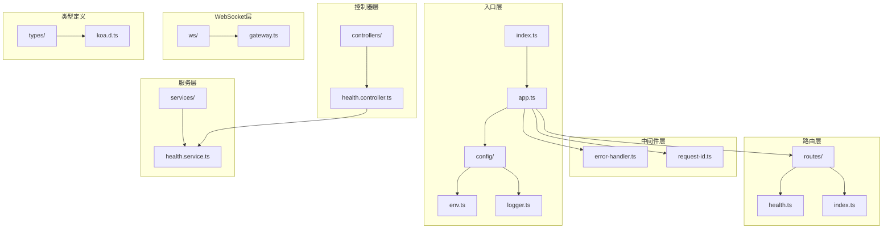
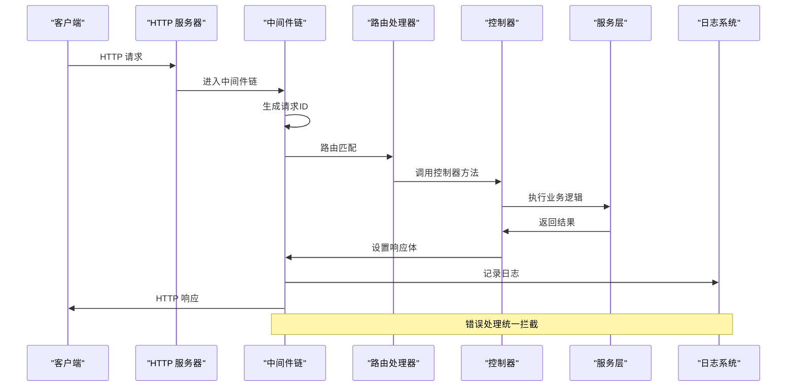
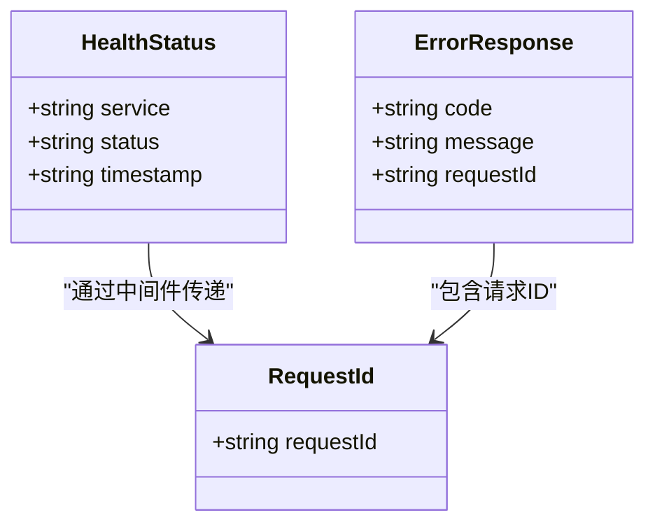
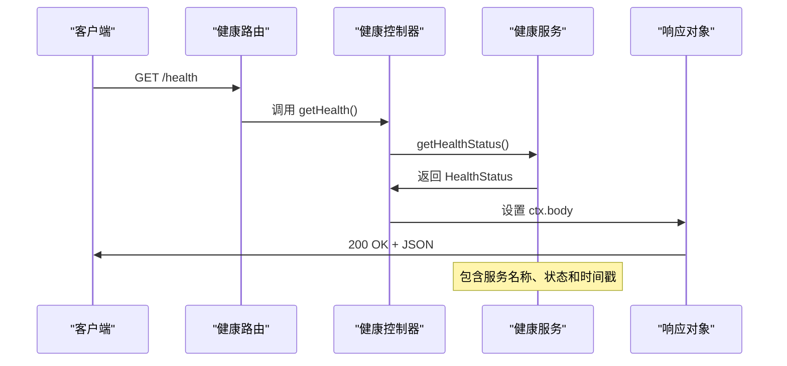
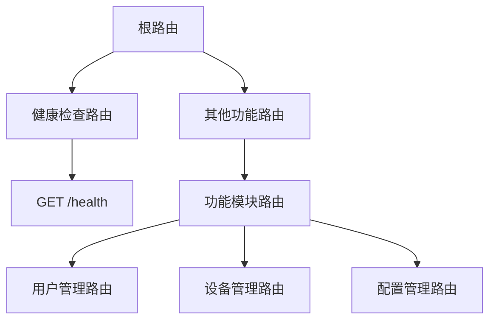
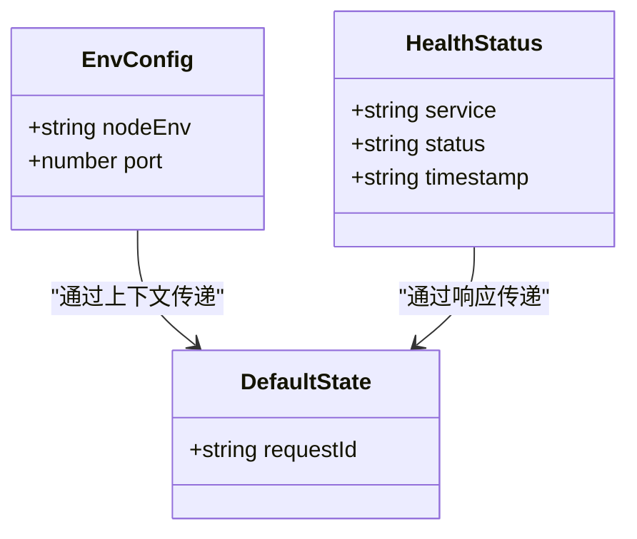
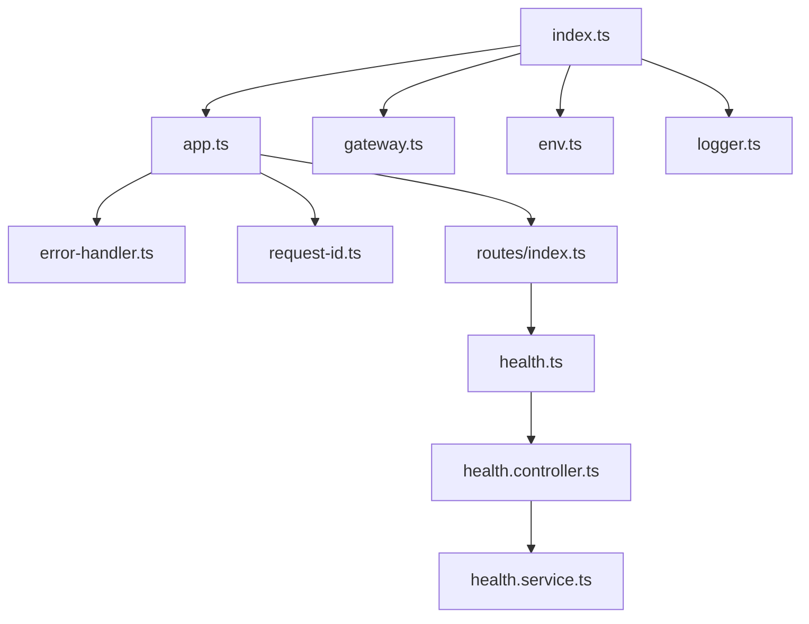

# API 接口设计

<cite>
**本文档引用的文件**
- [index.ts](file://project/server/src/index.ts)
- [app.ts](file://project/server/src/app.ts)
- [package.json](file://project/server/src/package.json)
- [env.ts](file://project/server/src/config/env.ts)
- [logger.ts](file://project/server/src/config/logger.ts)
- [error-handler.ts](file://project/server/src/middlewares/error-handler.ts)
- [request-id.ts](file://project/server/src/middlewares/request-id.ts)
- [health.controller.ts](file://project/server/src/controllers/health.controller.ts)
- [health.service.ts](file://project/server/src/services/health.service.ts)
- [health.ts](file://project/server/src/routes/health.ts)
- [index.ts](file://project/server/src/routes/index.ts)
- [gateway.ts](file://project/server/src/ws/gateway.ts)
- [koa.d.ts](file://project/server/src/types/koa.d.ts)
</cite>

## 目录
1. [简介](#简介)
2. [项目结构](#项目结构)
3. [核心组件](#核心组件)
4. [架构概览](#架构概览)
5. [详细组件分析](#详细组件分析)
6. [依赖关系分析](#依赖关系分析)
7. [性能考虑](#性能考虑)
8. [故障排除指南](#故障排除指南)
9. [结论](#结论)
10. [附录](#附录)

## 简介

本项目是一个基于 Node.js 和 TypeScript 的服务器端应用，采用 Koa.js 框架构建 RESTful API 接口。该系统提供了基础的健康检查接口，并建立了可扩展的 API 架构设计，支持未来功能模块的集成。

主要技术栈：
- **运行时环境**: Node.js (TypeScript)
- **Web 框架**: Koa.js
- **路由管理**: @koa/router
- **开发工具**: ts-node-dev, TypeScript 编译器
- **日志系统**: 自定义轻量级日志记录器

## 项目结构

项目的服务器端代码采用模块化组织方式，按照功能层次进行分离：



**图表来源**
- [index.ts:1-15](file://project/server/src/index.ts#L1-L15)
- [app.ts:1-14](file://project/server/src/app.ts#L1-L14)
- [routes/index.ts:1-9](file://project/server/src/routes/index.ts#L1-L9)

**章节来源**
- [index.ts:1-15](file://project/server/src/index.ts#L1-L15)
- [app.ts:1-14](file://project/server/src/app.ts#L1-L14)
- [package.json:1-28](file://project/server/src/package.json#L1-L28)

## 核心组件

### 应用入口与配置

应用通过主入口文件启动，负责初始化环境配置、HTTP 服务器和 WebSocket 网关。

**关键特性**:
- 环境变量加载和验证
- HTTP 服务器创建和监听
- WebSocket 网关初始化预留
- 日志记录器集成

### 中间件体系

系统实现了两个核心中间件来确保 API 的稳定性和可观测性：

1. **请求 ID 中间件**: 为每个请求生成唯一标识符，便于日志追踪
2. **错误处理器中间件**: 统一处理异常，返回标准错误响应

### 路由与控制器模式

采用经典的 MVC 架构模式：
- **路由层**: 定义 URL 路径和 HTTP 方法映射
- **控制器层**: 处理业务逻辑和响应格式化
- **服务层**: 封装具体业务功能

**章节来源**
- [index.ts:1-15](file://project/server/src/index.ts#L1-L15)
- [app.ts:1-14](file://project/server/src/app.ts#L1-L14)
- [error-handler.ts:1-18](file://project/server/src/middlewares/error-handler.ts#L1-L18)
- [request-id.ts:1-11](file://project/server/src/middlewares/request-id.ts#L1-L11)

## 架构概览

系统采用分层架构设计，各层职责明确，耦合度低，便于维护和扩展：



**图表来源**
- [app.ts:1-14](file://project/server/src/app.ts#L1-L14)
- [error-handler.ts:1-18](file://project/server/src/middlewares/error-handler.ts#L1-L18)
- [request-id.ts:1-11](file://project/server/src/middlewares/request-id.ts#L1-L11)

## 详细组件分析

### 健康检查接口

健康检查是系统监控的重要组成部分，提供了快速的状态验证能力。

#### 接口规范

**HTTP 方法**: GET  
**URL 路径**: `/health`  
**请求头**: 无特殊要求  
**响应格式**: JSON 对象

#### 响应数据结构



**图表来源**
- [health.service.ts:1-14](file://project/server/src/services/health.service.ts#L1-L14)
- [error-handler.ts:1-18](file://project/server/src/middlewares/error-handler.ts#L1-L18)

#### 实现流程



**图表来源**
- [health.ts:1-9](file://project/server/src/routes/health.ts#L1-L9)
- [health.controller.ts:1-7](file://project/server/src/controllers/health.controller.ts#L1-L7)
- [health.service.ts:1-14](file://project/server/src/services/health.service.ts#L1-L14)

**章节来源**
- [health.ts:1-9](file://project/server/src/routes/health.ts#L1-L9)
- [health.controller.ts:1-7](file://project/server/src/controllers/health.controller.ts#L1-L7)
- [health.service.ts:1-14](file://project/server/src/services/health.service.ts#L1-L14)

### 中间件系统

#### 请求 ID 中间件

该中间件为每个请求生成唯一的标识符，便于分布式系统的请求追踪。

**生成算法**: 时间戳 + 随机字符串组合  
**格式特点**: 不可预测、全局唯一  
**生命周期**: 请求处理期间有效

#### 错误处理中间件

提供统一的异常处理机制，确保 API 响应的一致性。

**错误分类**: 
- 已知错误: 返回 500 状态码和标准错误结构
- 未知错误: 记录详细日志并返回通用错误信息

**错误响应结构**:
```json
{
  "code": "INTERNAL_ERROR",
  "message": "Internal server error",
  "requestId": "generated-request-id"
}
```

**章节来源**
- [request-id.ts:1-11](file://project/server/src/middlewares/request-id.ts#L1-L11)
- [error-handler.ts:1-18](file://project/server/src/middlewares/error-handler.ts#L1-L18)

### 路由系统

路由系统采用模块化设计，支持多层级路由的组合和复用。

#### 路由层次结构



**图表来源**
- [routes/index.ts:1-9](file://project/server/src/routes/index.ts#L1-L9)
- [routes/health.ts:1-9](file://project/server/src/routes/health.ts#L1-L9)

**章节来源**
- [routes/index.ts:1-9](file://project/server/src/routes/index.ts#L1-L9)
- [routes/health.ts:1-9](file://project/server/src/routes/health.ts#L1-L9)

### 类型安全设计

系统采用 TypeScript 提供完整的类型安全保障：

#### 自定义类型定义



**图表来源**
- [env.ts:1-12](file://project/server/src/config/env.ts#L1-L12)
- [koa.d.ts:1-8](file://project/server/src/types/koa.d.ts#L1-L8)
- [health.service.ts:1-14](file://project/server/src/services/health.service.ts#L1-L14)

**章节来源**
- [env.ts:1-12](file://project/server/src/config/env.ts#L1-L12)
- [koa.d.ts:1-8](file://project/server/src/types/koa.d.ts#L1-L8)

## 依赖关系分析

### 外部依赖

系统依赖精简且功能明确：

```mermaid
graph LR
subgraph "核心依赖"
A[Koa.js] --> B[Web 框架]
C[@koa/router] --> D[路由管理]
end
subgraph "开发依赖"
E[TypeScript] --> F[类型检查]
G[ts-node-dev] --> H[开发服务器]
end
subgraph "运行时依赖"
I[Node.js] --> J[运行环境]
end
```

**图表来源**
- [package.json:16-26](file://project/server/src/package.json#L16-L26)

### 内部模块依赖



**图表来源**
- [index.ts:1-15](file://project/server/src/index.ts#L1-L15)
- [app.ts:1-14](file://project/server/src/app.ts#L1-L14)

**章节来源**
- [package.json:1-28](file://project/server/src/package.json#L1-L28)

## 性能考虑

### 启动性能

- **冷启动优化**: 使用 ts-node-dev 进行开发时热重载
- **生产部署**: TypeScript 编译后运行，避免运行时编译开销
- **内存管理**: 中间件链按需执行，避免不必要的资源消耗

### 并发处理

- **异步处理**: 所有中间件和控制器均采用异步模式
- **非阻塞 I/O**: 基于 Node.js 的事件驱动架构
- **连接池**: HTTP 服务器复用连接，减少连接建立开销

### 监控与诊断

- **请求追踪**: 通过请求 ID 实现端到端的请求追踪
- **日志记录**: 结构化的日志格式，便于日志分析和问题定位
- **错误监控**: 统一的错误处理机制，确保异常不会影响系统稳定性

## 故障排除指南

### 常见问题诊断

#### 健康检查失败

**症状**: 请求 `/health` 返回 500 错误  
**可能原因**:
1. 服务依赖未正确初始化
2. 数据库连接失败
3. 文件权限问题

**排查步骤**:
1. 检查服务日志输出
2. 验证环境变量配置
3. 确认依赖服务可用性

#### 请求超时

**症状**: API 请求长时间无响应  
**可能原因**:
1. 中间件执行时间过长
2. 路由处理逻辑阻塞
3. 外部服务调用超时

**解决方案**:
1. 优化中间件性能
2. 实施超时控制机制
3. 添加异步处理支持

#### 错误响应不一致

**症状**: 错误响应格式不符合预期  
**排查方法**:
1. 检查错误处理中间件配置
2. 验证请求 ID 生成逻辑
3. 确认日志记录格式

**章节来源**
- [error-handler.ts:1-18](file://project/server/src/middlewares/error-handler.ts#L1-L18)
- [logger.ts:1-18](file://project/server/src/config/logger.ts#L1-L18)

## 结论

本项目成功构建了一个简洁而强大的 Node.js API 服务器框架，具有以下优势：

1. **架构清晰**: 分层设计明确，职责分离合理
2. **类型安全**: 完整的 TypeScript 支持，编译时类型检查
3. **可扩展性**: 模块化设计支持功能的平滑扩展
4. **可观测性**: 完善的日志和追踪机制
5. **稳定性**: 统一的错误处理和中间件体系

建议在现有基础上继续完善：
- 添加 API 版本管理机制
- 实施更严格的输入验证
- 增加缓存策略
- 完善单元测试覆盖

## 附录

### API 设计最佳实践

#### RESTful 设计原则
- 使用名词而非动词作为资源标识
- 保持 URL 结构简洁明了
- 使用适当的 HTTP 状态码
- 实现幂等操作

#### 错误码规范
- **200**: 成功请求
- **400**: 请求参数错误
- **404**: 资源不存在
- **500**: 服务器内部错误

#### 版本管理策略
- 在 URL 中包含版本号：`/api/v1/resource`
- 使用 Accept 头部指定版本
- 保持向后兼容性
- 渐进式弃用旧版本