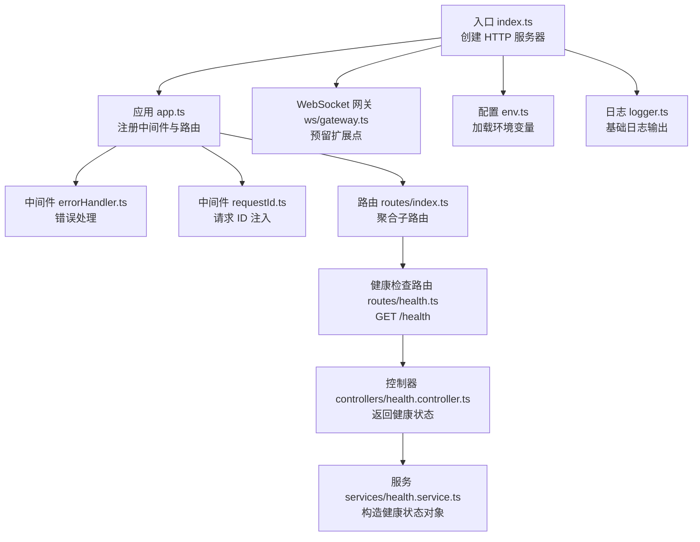
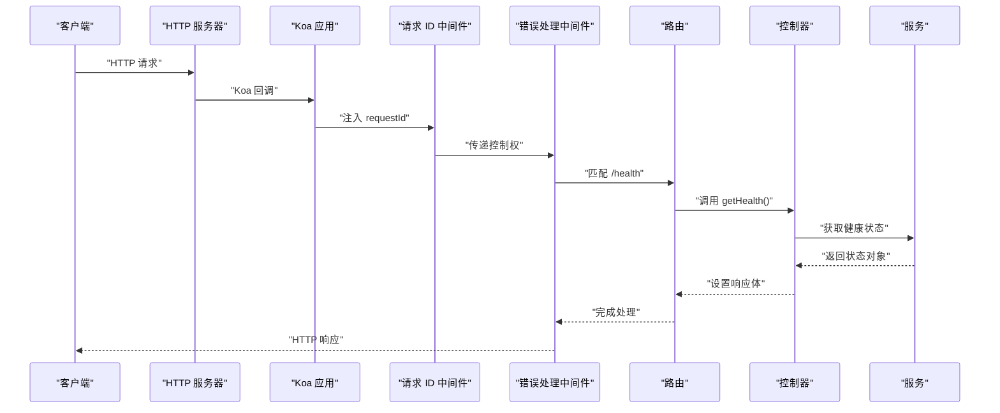
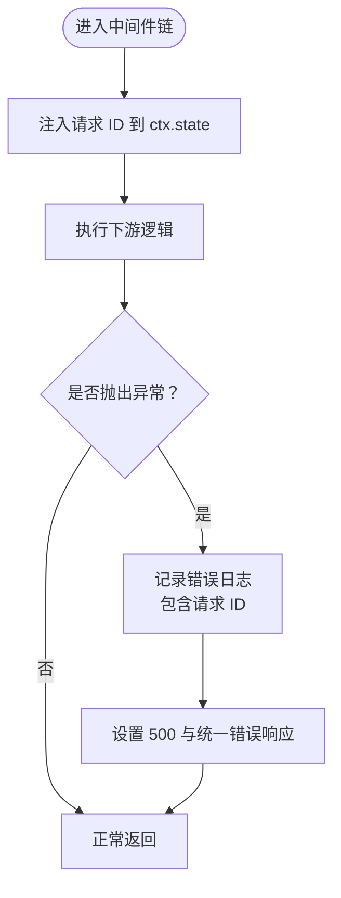
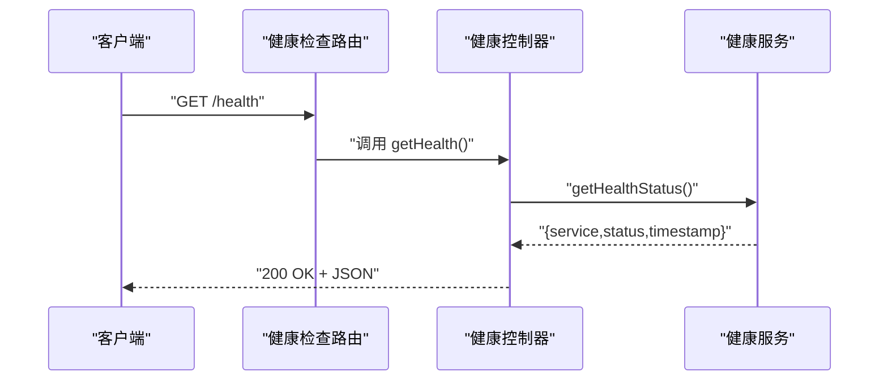
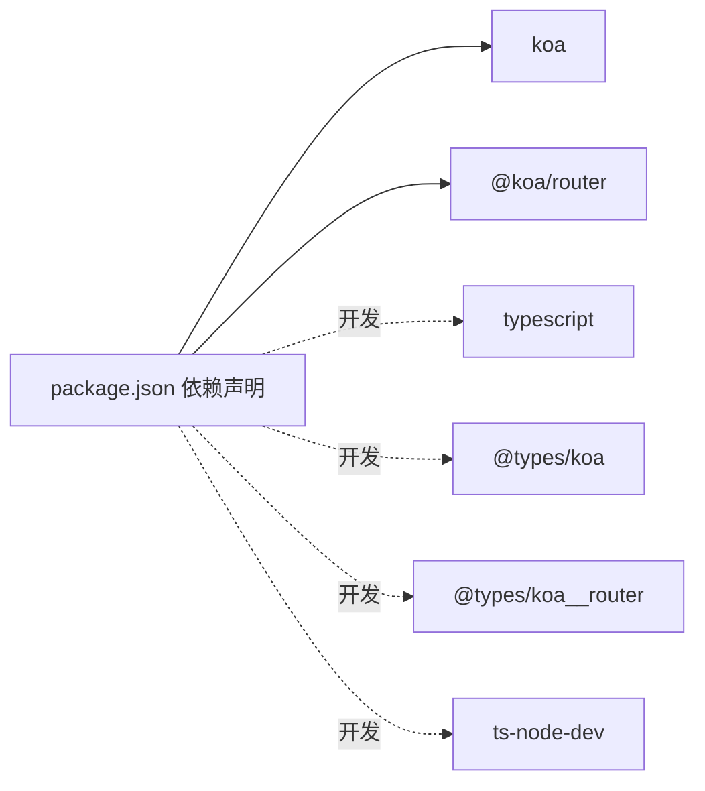

# Node.js 服务器

<cite>
**本文引用的文件**
- [index.ts](file://project/server/src/index.ts)
- [app.ts](file://project/server/src/app.ts)
- [env.ts](file://project/server/src/config/env.ts)
- [logger.ts](file://project/server/src/config/logger.ts)
- [error-handler.ts](file://project/server/src/middlewares/error-handler.ts)
- [request-id.ts](file://project/server/src/middlewares/request-id.ts)
- [routes/index.ts](file://project/server/src/routes/index.ts)
- [routes/health.ts](file://project/server/src/routes/health.ts)
- [controllers/health.controller.ts](file://project/server/src/controllers/health.controller.ts)
- [services/health.service.ts](file://project/server/src/services/health.service.ts)
- [types/koa.d.ts](file://project/server/src/types/koa.d.ts)
- [ws/gateway.ts](file://project/server/src/ws/gateway.ts)
- [package.json](file://project/server/package.json)
- [tsconfig.json](file://project/server/tsconfig.json)
</cite>

## 目录
1. [简介](#简介)
2. [项目结构](#项目结构)
3. [核心组件](#核心组件)
4. [架构总览](#架构总览)
5. [详细组件分析](#详细组件分析)
6. [依赖分析](#依赖分析)
7. [性能考虑](#性能考虑)
8. [故障排查指南](#故障排查指南)
9. [结论](#结论)
10. [附录](#附录)

## 简介
本项目是一个基于 Koa.js 的 Node.js 服务器，采用 TypeScript 开发，提供最小可用的健康检查 HTTP 接口，并预留了 WebSocket 网关扩展点。服务器通过中间件统一处理请求 ID 注入与全局错误捕获，路由层采用 @koa/router 进行模块化组织，控制器与服务层分离以提升可维护性。配置管理与日志模块提供了环境变量加载与基础日志输出能力。

## 项目结构
后端服务位于 project/server 目录，采用按功能域分层的目录组织方式：
- config：环境变量加载与日志模块
- middlewares：Koa 中间件（请求 ID、错误处理）
- routes：路由定义与聚合
- controllers：HTTP 控制器
- services：业务服务
- ws：WebSocket 网关初始化入口
- types：类型增强（如 Koa 默认状态扩展）

图表来源
- [index.ts:1-15](file://project/server/src/index.ts#L1-L15)
- [app.ts:1-14](file://project/server/src/app.ts#L1-L14)
- [routes/index.ts:1-9](file://project/server/src/routes/index.ts#L1-L9)
- [routes/health.ts:1-9](file://project/server/src/routes/health.ts#L1-L9)
- [controllers/health.controller.ts:1-7](file://project/server/src/controllers/health.controller.ts#L1-L7)
- [services/health.service.ts:1-14](file://project/server/src/services/health.service.ts#L1-L14)
- [ws/gateway.ts:1-8](file://project/server/src/ws/gateway.ts#L1-L8)
- [env.ts:1-12](file://project/server/src/config/env.ts#L1-L12)
- [logger.ts:1-18](file://project/server/src/config/logger.ts#L1-L18)

章节来源
- [package.json:1-28](file://project/server/package.json#L1-L28)
- [tsconfig.json:1-18](file://project/server/tsconfig.json#L1-L18)

## 核心组件
- 应用入口与服务器启动
  - 创建 HTTP 服务器并绑定 Koa 回调，监听指定端口，同时初始化 WebSocket 网关。
- 中间件体系
  - 请求 ID 中间件：在请求上下文中注入唯一标识，便于日志追踪与问题定位。
  - 错误处理中间件：捕获下游抛出的异常，记录错误日志，返回统一的错误响应格式。
- 路由与控制器
  - 健康检查路由 GET /health，控制器负责调用服务层获取健康状态并写入响应体。
- 配置与日志
  - 环境变量加载：支持 NODE_ENV 与 PORT，默认开发环境与默认端口。
  - 日志模块：提供 info/warn/error 三类基础日志方法，统一时间戳与级别格式。
- 类型增强
  - 扩展 Koa DefaultState，允许在 ctx.state 上访问 requestId 字段。

章节来源
- [index.ts:1-15](file://project/server/src/index.ts#L1-L15)
- [app.ts:1-14](file://project/server/src/app.ts#L1-L14)
- [request-id.ts:1-11](file://project/server/src/middlewares/request-id.ts#L1-L11)
- [error-handler.ts:1-18](file://project/server/src/middlewares/error-handler.ts#L1-L18)
- [routes/health.ts:1-9](file://project/server/src/routes/health.ts#L1-L9)
- [controllers/health.controller.ts:1-7](file://project/server/src/controllers/health.controller.ts#L1-L7)
- [services/health.service.ts:1-14](file://project/server/src/services/health.service.ts#L1-L14)
- [env.ts:1-12](file://project/server/src/config/env.ts#L1-L12)
- [logger.ts:1-18](file://project/server/src/config/logger.ts#L1-L18)
- [types/koa.d.ts:1-8](file://project/server/src/types/koa.d.ts#L1-L8)

## 架构总览
下图展示了从请求进入服务器到响应返回的关键路径，以及中间件与路由的协作关系。

图表来源
- [index.ts:1-15](file://project/server/src/index.ts#L1-L15)
- [app.ts:1-14](file://project/server/src/app.ts#L1-L14)
- [request-id.ts:1-11](file://project/server/src/middlewares/request-id.ts#L1-L11)
- [error-handler.ts:1-18](file://project/server/src/middlewares/error-handler.ts#L1-L18)
- [routes/health.ts:1-9](file://project/server/src/routes/health.ts#L1-L9)
- [controllers/health.controller.ts:1-7](file://project/server/src/controllers/health.controller.ts#L1-L7)
- [services/health.service.ts:1-14](file://project/server/src/services/health.service.ts#L1-L14)

## 详细组件分析

### 应用入口与服务器启动
- 功能职责
  - 加载环境变量，创建 HTTP 服务器并绑定 Koa 回调。
  - 初始化 WebSocket 网关（当前为空实现，预留扩展）。
  - 启动监听，输出启动日志。
- 关键行为
  - 使用 process.env.NODE_ENV 与 PORT 决定运行环境与端口。
  - 通过 logger 输出启动信息，包含端口与环境。

章节来源
- [index.ts:1-15](file://project/server/src/index.ts#L1-L15)
- [env.ts:1-12](file://project/server/src/config/env.ts#L1-L12)
- [logger.ts:1-18](file://project/server/src/config/logger.ts#L1-L18)
- [ws/gateway.ts:1-8](file://project/server/src/ws/gateway.ts#L1-L8)

### 中间件系统
- 请求 ID 中间件
  - 在每个请求进入时生成唯一标识并写入 ctx.state.requestId，供后续中间件与日志使用。
- 错误处理中间件
  - 包裹所有下游逻辑，捕获异常并记录日志；统一返回 500 与标准化错误响应结构，包含错误码、消息与请求 ID。

图表来源
- [request-id.ts:1-11](file://project/server/src/middlewares/request-id.ts#L1-L11)
- [error-handler.ts:1-18](file://project/server/src/middlewares/error-handler.ts#L1-L18)

章节来源
- [request-id.ts:1-11](file://project/server/src/middlewares/request-id.ts#L1-L11)
- [error-handler.ts:1-18](file://project/server/src/middlewares/error-handler.ts#L1-L18)
- [types/koa.d.ts:1-8](file://project/server/src/types/koa.d.ts#L1-L8)

### 路由管理与控制器模式
- 路由聚合
  - 主路由聚合各子路由，当前仅包含健康检查子路由。
- 健康检查路由
  - 定义 GET /health，映射至控制器函数。
- 控制器与服务
  - 控制器负责调用服务层获取健康状态并写入响应体。
  - 服务层封装健康状态数据结构与构造逻辑。

图表来源
- [routes/index.ts:1-9](file://project/server/src/routes/index.ts#L1-L9)
- [routes/health.ts:1-9](file://project/server/src/routes/health.ts#L1-L9)
- [controllers/health.controller.ts:1-7](file://project/server/src/controllers/health.controller.ts#L1-L7)
- [services/health.service.ts:1-14](file://project/server/src/services/health.service.ts#L1-L14)

章节来源
- [routes/index.ts:1-9](file://project/server/src/routes/index.ts#L1-L9)
- [routes/health.ts:1-9](file://project/server/src/routes/health.ts#L1-L9)
- [controllers/health.controller.ts:1-7](file://project/server/src/controllers/health.controller.ts#L1-L7)
- [services/health.service.ts:1-14](file://project/server/src/services/health.service.ts#L1-L14)

### WebSocket 服务实现
- 当前状态
  - 提供 initWsGateway(server) 入口，当前为占位实现，用于预留 WebSocket 网关集成。
- 建议扩展方向
  - 引入 ws 或 socket.io 等库，实现连接生命周期管理、房间/频道路由、消息广播与私信。
  - 结合现有中间件与日志模块，完善连接事件、消息事件与错误事件的日志记录。
  - 与健康检查等 HTTP 接口协同，提供统一的运维监控指标。

章节来源
- [ws/gateway.ts:1-8](file://project/server/src/ws/gateway.ts#L1-L8)

### 配置管理与日志记录
- 环境变量加载
  - 支持 NODE_ENV 与 PORT，未设置时采用默认值。
- 日志模块
  - 提供 info/warn/error 三类方法，统一格式化时间戳与级别。
  - 应用启动与错误处理中均有使用示例。

章节来源
- [env.ts:1-12](file://project/server/src/config/env.ts#L1-L12)
- [logger.ts:1-18](file://project/server/src/config/logger.ts#L1-L18)

## 依赖分析
- 运行时依赖
  - koa：Web 框架核心
  - @koa/router：路由管理
- 开发依赖
  - TypeScript、@types/koa、@types/koa__router、ts-node-dev 等
- 构建与脚本
  - dev：热重载开发
  - build：TypeScript 编译
  - start：生产启动
  - typecheck：类型检查

图表来源
- [package.json:1-28](file://project/server/package.json#L1-L28)

章节来源
- [package.json:1-28](file://project/server/package.json#L1-L28)
- [tsconfig.json:1-18](file://project/server/tsconfig.json#L1-L18)

## 性能考虑
- 中间件顺序
  - 将轻量且无副作用的中间件（如请求 ID 注入）置于错误处理之前，减少异常捕获成本。
- 路由与控制器
  - 控制器仅做薄薄的编排，复杂逻辑下沉至服务层，有利于单元测试与复用。
- 日志与错误
  - 统一错误响应与日志格式，避免重复序列化与字符串拼接。
- WebSocket
  - 连接数与消息吞吐需结合实际场景评估，建议引入连接池与背压策略，配合健康检查与监控指标进行容量规划。

## 故障排查指南
- 健康检查失败
  - 确认服务器已启动并监听正确端口。
  - 查看启动日志中的端口与环境信息。
- 500 错误与日志
  - 错误处理中间件会记录包含请求 ID 的错误日志，优先根据 requestId 定位问题。
  - 检查下游控制器或服务层是否存在未捕获异常。
- 端口占用
  - 修改 PORT 环境变量或释放占用端口后重启服务。

章节来源
- [index.ts:1-15](file://project/server/src/index.ts#L1-L15)
- [error-handler.ts:1-18](file://project/server/src/middlewares/error-handler.ts#L1-L18)
- [logger.ts:1-18](file://project/server/src/config/logger.ts#L1-L18)

## 结论
该 Node.js 服务器以 Koa 为基础，采用中间件、路由与控制器/服务分层的清晰架构，提供了最小可用的健康检查接口与可扩展的 WebSocket 网关入口。通过统一的请求 ID 注入与错误处理机制，提升了可观测性与稳定性。建议在后续迭代中完善 WebSocket 实现、增加更多业务接口与监控指标，并持续优化中间件与路由的性能与可维护性。

## 附录
- 启动与构建
  - 开发：使用脚本 dev 启动热重载服务
  - 构建：使用脚本 build 生成 dist
  - 生产：使用脚本 start 启动
- 环境变量
  - NODE_ENV：运行环境（默认 development）
  - PORT：监听端口（默认 3000）

章节来源
- [package.json:1-28](file://project/server/package.json#L1-L28)
- [env.ts:1-12](file://project/server/src/config/env.ts#L1-L12)