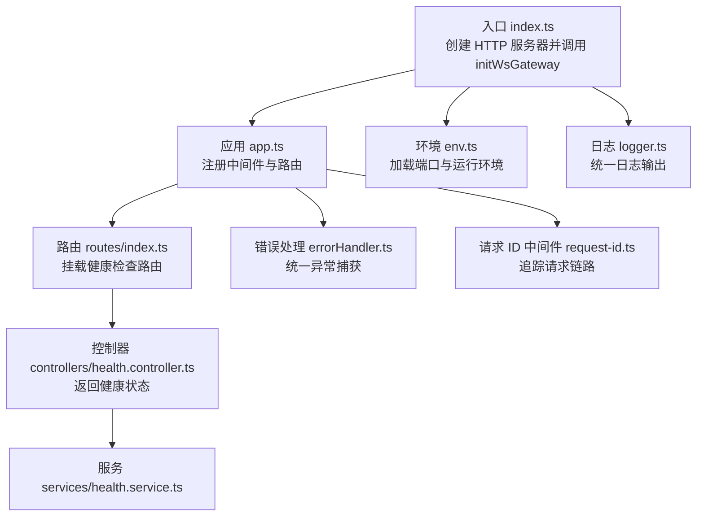
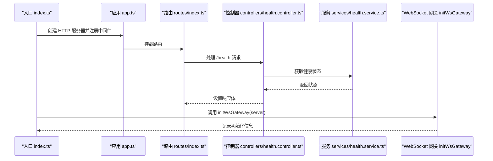
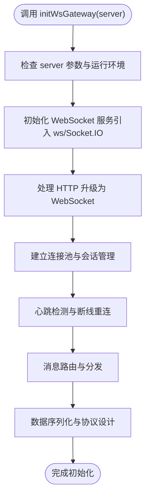
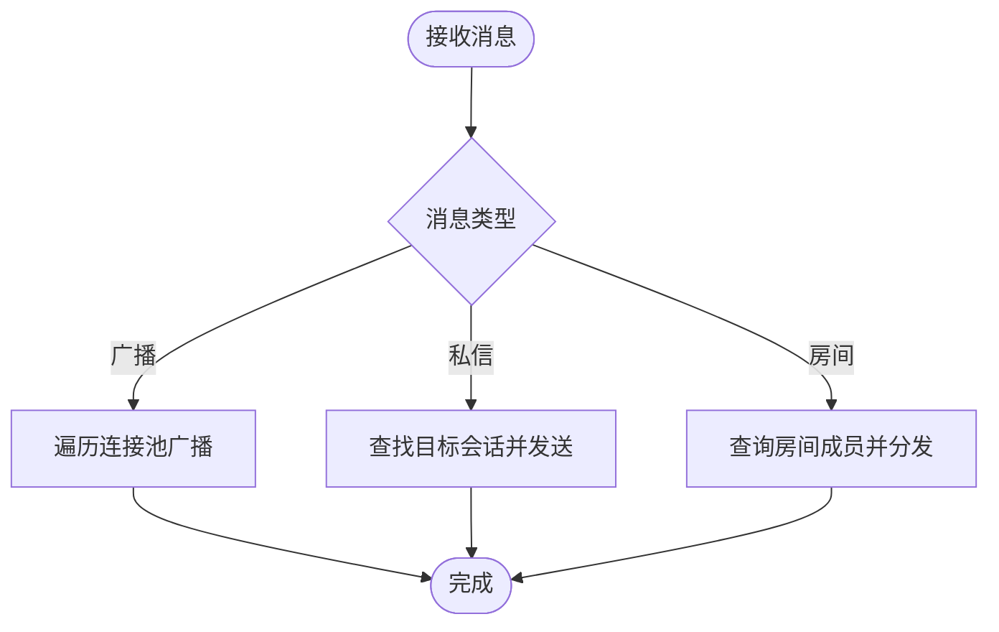
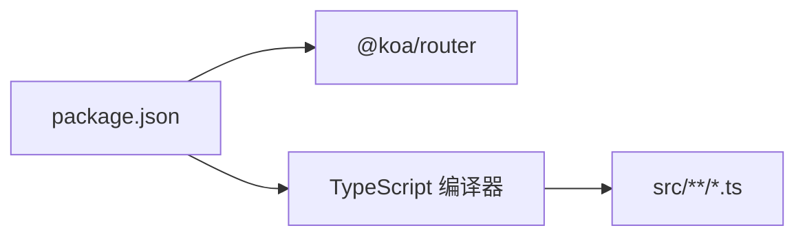

# WebSocket 服务

<cite>
**本文引用的文件**
- [gateway.ts](file://project/server/src/ws/gateway.ts)
- [index.ts](file://project/server/src/index.ts)
- [app.ts](file://project/server/src/app.ts)
- [env.ts](file://project/server/src/config/env.ts)
- [logger.ts](file://project/server/src/config/logger.ts)
- [error-handler.ts](file://project/server/src/middlewares/error-handler.ts)
- [request-id.ts](file://project/server/src/middlewares/request-id.ts)
- [routes/index.ts](file://project/server/src/routes/index.ts)
- [routes/health.ts](file://project/server/src/routes/health.ts)
- [controllers/health.controller.ts](file://project/server/src/controllers/health.controller.ts)
- [services/health.service.ts](file://project/server/src/services/health.service.ts)
- [package.json](file://project/server/package.json)
- [tsconfig.json](file://project/server/tsconfig.json)
</cite>

## 目录
1. [简介](#简介)
2. [项目结构](#项目结构)
3. [核心组件](#核心组件)
4. [架构总览](#架构总览)
5. [详细组件分析](#详细组件分析)
6. [依赖关系分析](#依赖关系分析)
7. [性能考虑](#性能考虑)
8. [故障排查指南](#故障排查指南)
9. [结论](#结论)
10. [附录](#附录)

## 简介
本文件面向 Node.js 服务器的 WebSocket 服务，基于当前仓库中的现有实现进行技术文档梳理与扩展说明。当前仓库在服务启动入口中预留了 WebSocket 网关初始化函数，但未包含具体的 WebSocket 连接管理、心跳检测、断线重连、消息路由与分发、房间管理等完整实现。本文将以“现有能力 + 扩展建议”的方式，帮助读者理解当前状态、明确后续开发方向，并提供可操作的集成与优化建议。

## 项目结构
后端采用 Koa 应用框架，通过 HTTP 服务器承载路由与中间件；WebSocket 网关初始化函数已预留，便于后续接入具体 WebSocket 实现（如 ws、Socket.IO 等）。



**图表来源**
- [index.ts:1-15](file://project/server/src/index.ts#L1-L15)
- [app.ts:1-14](file://project/server/src/app.ts#L1-L14)
- [routes/index.ts:1-9](file://project/server/src/routes/index.ts#L1-L9)
- [routes/health.ts:1-9](file://project/server/src/routes/health.ts#L1-L9)
- [controllers/health.controller.ts:1-7](file://project/server/src/controllers/health.controller.ts#L1-L7)
- [services/health.service.ts:1-14](file://project/server/src/services/health.service.ts#L1-L14)
- [env.ts:1-12](file://project/server/src/config/env.ts#L1-L12)
- [logger.ts:1-18](file://project/server/src/config/logger.ts#L1-L18)
- [error-handler.ts:1-18](file://project/server/src/middlewares/error-handler.ts#L1-L18)
- [request-id.ts:1-11](file://project/server/src/middlewares/request-id.ts#L1-L11)

**章节来源**
- [index.ts:1-15](file://project/server/src/index.ts#L1-L15)
- [app.ts:1-14](file://project/server/src/app.ts#L1-L14)
- [routes/index.ts:1-9](file://project/server/src/routes/index.ts#L1-L9)
- [routes/health.ts:1-9](file://project/server/src/routes/health.ts#L1-L9)
- [controllers/health.controller.ts:1-7](file://project/server/src/controllers/health.controller.ts#L1-L7)
- [services/health.service.ts:1-14](file://project/server/src/services/health.service.ts#L1-L14)
- [env.ts:1-12](file://project/server/src/config/env.ts#L1-L12)
- [logger.ts:1-18](file://project/server/src/config/logger.ts#L1-L18)
- [error-handler.ts:1-18](file://project/server/src/middlewares/error-handler.ts#L1-L18)
- [request-id.ts:1-11](file://project/server/src/middlewares/request-id.ts#L1-L11)

## 核心组件
- 入口与服务器
  - 入口文件负责创建 HTTP 服务器并调用 WebSocket 网关初始化函数，随后监听端口。
  - 参考路径：[入口 index.ts:1-15](file://project/server/src/index.ts#L1-L15)
- 应用与中间件
  - 应用层注册错误处理与请求 ID 中间件，并挂载路由。
  - 参考路径：[应用 app.ts:1-14](file://project/server/src/app.ts#L1-L14)
  - 错误处理中间件：[错误处理 errorHandler.ts:1-18](file://project/server/src/middlewares/error-handler.ts#L1-18)
  - 请求 ID 中间件：[请求 ID request-id.ts:1-11](file://project/server/src/middlewares/request-id.ts#L1-11)
- 路由与控制器
  - 健康检查路由与控制器示例，展示标准的 Koa 路由与控制器写法。
  - 参考路径：[路由 routes/index.ts:1-9](file://project/server/src/routes/index.ts#L1-L9)、[健康路由 routes/health.ts:1-9](file://project/server/src/routes/health.ts#L1-L9)、[控制器 controllers/health.controller.ts:1-7](file://project/server/src/controllers/health.controller.ts#L1-L7)、[服务 services/health.service.ts:1-14](file://project/server/src/services/health.service.ts#L1-L14)
- 配置与日志
  - 环境变量加载与日志输出工具，便于后续在 WebSocket 初始化与运行时使用。
  - 参考路径：[环境 env.ts:1-12](file://project/server/src/config/env.ts#L1-L12)、[日志 logger.ts:1-18](file://project/server/src/config/logger.ts#L1-L18)

**章节来源**
- [index.ts:1-15](file://project/server/src/index.ts#L1-L15)
- [app.ts:1-14](file://project/server/src/app.ts#L1-L14)
- [error-handler.ts:1-18](file://project/server/src/middlewares/error-handler.ts#L1-L18)
- [request-id.ts:1-11](file://project/server/src/middlewares/request-id.ts#L1-L11)
- [routes/index.ts:1-9](file://project/server/src/routes/index.ts#L1-L9)
- [routes/health.ts:1-9](file://project/server/src/routes/health.ts#L1-L9)
- [controllers/health.controller.ts:1-7](file://project/server/src/controllers/health.controller.ts#L1-L7)
- [services/health.service.ts:1-14](file://project/server/src/services/health.service.ts#L1-L14)
- [env.ts:1-12](file://project/server/src/config/env.ts#L1-L12)
- [logger.ts:1-18](file://project/server/src/config/logger.ts#L1-L18)

## 架构总览
当前 WebSocket 服务处于“预留集成点”阶段：HTTP 服务器已就绪，WebSocket 网关初始化函数已定义，但尚未实现具体连接管理与消息处理逻辑。下图展示了从入口到网关初始化的整体流程。



**图表来源**
- [index.ts:1-15](file://project/server/src/index.ts#L1-L15)
- [app.ts:1-14](file://project/server/src/app.ts#L1-L14)
- [routes/index.ts:1-9](file://project/server/src/routes/index.ts#L1-L9)
- [routes/health.ts:1-9](file://project/server/src/routes/health.ts#L1-L9)
- [controllers/health.controller.ts:1-7](file://project/server/src/controllers/health.controller.ts#L1-L7)
- [services/health.service.ts:1-14](file://project/server/src/services/health.service.ts#L1-L14)
- [gateway.ts:1-8](file://project/server/src/ws/gateway.ts#L1-L8)

## 详细组件分析

### WebSocket 网关初始化（预留）
- 当前实现
  - 在入口文件中调用 WebSocket 网关初始化函数，记录初始化日志。
  - 参考路径：[入口 index.ts:1-15](file://project/server/src/index.ts#L1-L15)、[网关 gateway.ts:1-8](file://project/server/src/ws/gateway.ts#L1-L8)
- 后续扩展建议
  - 引入 WebSocket 库（如 ws 或 Socket.IO），在该函数内完成：
    - 协议升级与握手校验
    - 连接池与会话管理
    - 心跳检测与断线重连策略
    - 消息路由与分发（广播、私信、房间）
    - 数据序列化与协议设计
  - 参考路径：[package.json 依赖声明:16-26](file://project/server/package.json#L16-L26)



**图表来源**
- [gateway.ts:1-8](file://project/server/src/ws/gateway.ts#L1-L8)
- [index.ts:1-15](file://project/server/src/index.ts#L1-L15)

**章节来源**
- [gateway.ts:1-8](file://project/server/src/ws/gateway.ts#L1-L8)
- [index.ts:1-15](file://project/server/src/index.ts#L1-L15)

### 连接管理（建议设计）
- 连接建立
  - 在协议升级阶段校验鉴权与参数，建立会话标识。
- 心跳检测
  - 定期发送 Ping/Pong，超时判定断开，触发重连。
- 断线重连
  - 客户端指数退避重连，服务端恢复订阅或状态。

```mermaid
sequenceDiagram
participant Client as "客户端"
participant Server as "WebSocket 服务"
participant Pool as "连接池/会话管理"
Client->>Server : 发起握手请求
Server->>Pool : 创建会话并加入连接池
Server-->>Client : 握手成功
loop 心跳周期
Server->>Client : 发送 Ping
Client-->>Server : 返回 Pong
end
Client--/Server : 网络异常/断开
Server->>Pool : 标记离线并触发重连策略
```

[本图为概念性流程，不对应具体源码文件]

### 消息路由与分发（建议设计）
- 广播
  - 将消息推送给所有在线会话。
- 私信
  - 通过目标会话 ID 路由到指定客户端。
- 房间管理
  - 维护房间成员集合，按房间分发消息。



[本图为概念性流程，不对应具体源码文件]

### 实时通信协议（建议设计）
- 消息格式
  - JSON 结构：包含事件类型、时间戳、数据体、签名等字段。
- 事件类型
  - 连接类：握手、心跳、断开通知
  - 业务类：房间进入/退出、消息发送、状态同步
- 数据序列化
  - 使用紧凑二进制或高效 JSON 序列化库，降低带宽占用。

[本图为概念性设计，不对应具体源码文件]

### 客户端集成指南（建议）
- 连接配置
  - 指定服务地址、协议版本、鉴权参数、重连策略。
- 消息发送
  - 统一封装发送方法，自动填充时间戳与事件类型。
- 事件监听
  - 分别监听连接、消息、断开等事件，执行相应 UI 更新或重连逻辑。

[本图为概念性指南，不对应具体源码文件]

## 依赖关系分析
- 运行时依赖
  - Koa 与 @koa/router 提供 Web 服务能力。
  - 参考路径：[package.json 依赖声明:16-26](file://project/server/package.json#L16-L26)
- 编译配置
  - TypeScript 编译选项与包含目录。
  - 参考路径：[tsconfig.json:1-18](file://project/server/tsconfig.json#L1-L18)



**图表来源**
- [package.json:1-28](file://project/server/package.json#L1-L28)
- [tsconfig.json:1-18](file://project/server/tsconfig.json#L1-L18)

**章节来源**
- [package.json:1-28](file://project/server/package.json#L1-L28)
- [tsconfig.json:1-18](file://project/server/tsconfig.json#L1-L18)

## 性能考虑
- 连接池管理
  - 控制最大连接数，避免内存与 FD 泄漏；定期清理无效会话。
- 心跳与保活
  - 合理的心跳间隔与超时阈值，避免频繁探测造成 CPU 开销。
- 消息分发
  - 使用批量推送与去重策略，减少重复广播；对大包消息采用压缩。
- 序列化优化
  - 选择高效的序列化方案，控制消息体积；必要时启用二进制帧。
- 资源清理
  - 显式关闭连接、注销事件监听、释放定时器与缓存。

[本节为通用性能建议，不直接分析具体文件]

## 故障排查指南
- 日志与追踪
  - 使用统一日志模块输出关键事件；结合请求 ID 中间件定位问题。
  - 参考路径：[日志 logger.ts:1-18](file://project/server/src/config/logger.ts#L1-L18)、[请求 ID request-id.ts:1-11](file://project/server/src/middlewares/request-id.ts#L1-L11)
- 异常处理
  - 统一捕获中间件，避免未处理异常导致进程崩溃。
  - 参考路径：[错误处理 errorHandler.ts:1-18](file://project/server/src/middlewares/error-handler.ts#L1-18)
- 健康检查
  - 通过健康路由验证服务可用性。
  - 参考路径：[路由 routes/health.ts:1-9](file://project/server/src/routes/health.ts#L1-L9)、[控制器 controllers/health.controller.ts:1-7](file://project/server/src/controllers/health.controller.ts#L1-L7)、[服务 services/health.service.ts:1-14](file://project/server/src/services/health.service.ts#L1-L14)

**章节来源**
- [logger.ts:1-18](file://project/server/src/config/logger.ts#L1-L18)
- [request-id.ts:1-11](file://project/server/src/middlewares/request-id.ts#L1-L11)
- [error-handler.ts:1-18](file://project/server/src/middlewares/error-handler.ts#L1-L18)
- [routes/health.ts:1-9](file://project/server/src/routes/health.ts#L1-L9)
- [controllers/health.controller.ts:1-7](file://project/server/src/controllers/health.controller.ts#L1-L7)
- [services/health.service.ts:1-14](file://project/server/src/services/health.service.ts#L1-L14)

## 结论
当前仓库已完成 WebSocket 网关的预留集成点，具备良好的扩展基础。建议在 initWsGateway 函数中逐步实现连接管理、心跳与重连、消息路由与分发、房间管理以及协议设计，并配套完善的日志、监控与健康检查机制。通过合理的性能优化与资源清理策略，可构建稳定高效的实时通信服务。

## 附录
- 环境变量加载
  - 参考路径：[env.ts:1-12](file://project/server/src/config/env.ts#L1-L12)
- 应用启动与监听
  - 参考路径：[index.ts:1-15](file://project/server/src/index.ts#L1-L15)

**章节来源**
- [env.ts:1-12](file://project/server/src/config/env.ts#L1-L12)
- [index.ts:1-15](file://project/server/src/index.ts#L1-L15)