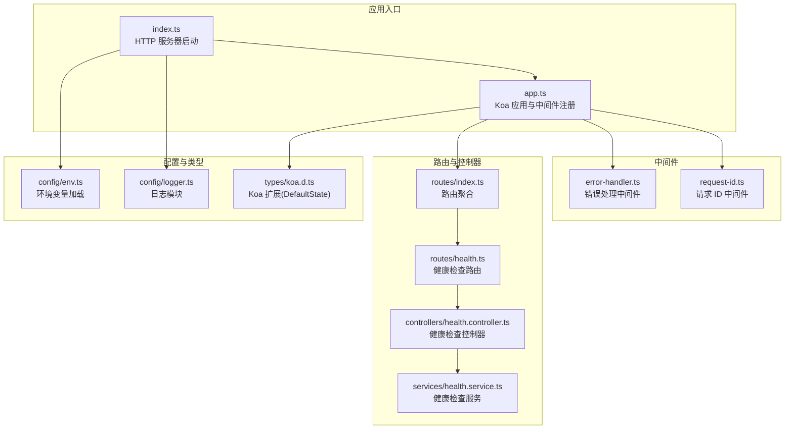
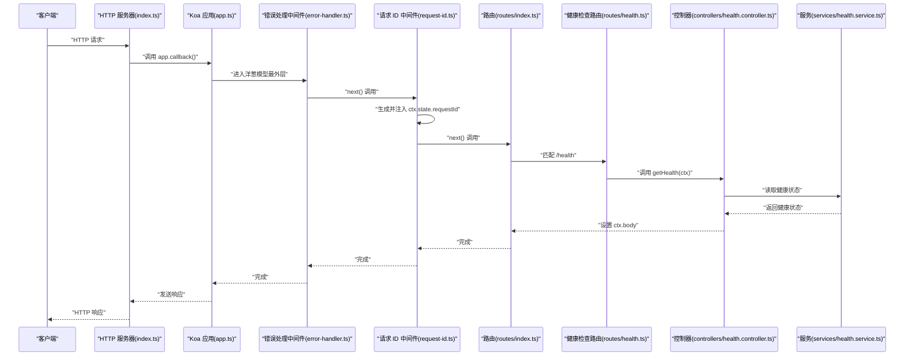
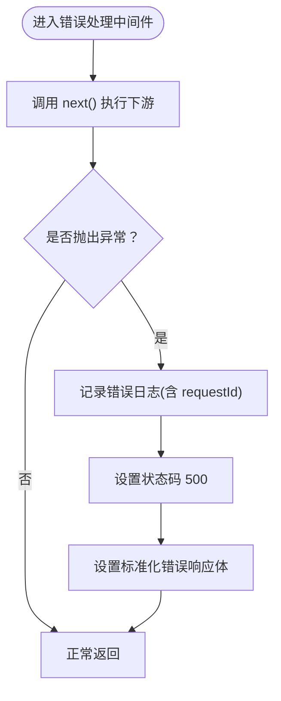
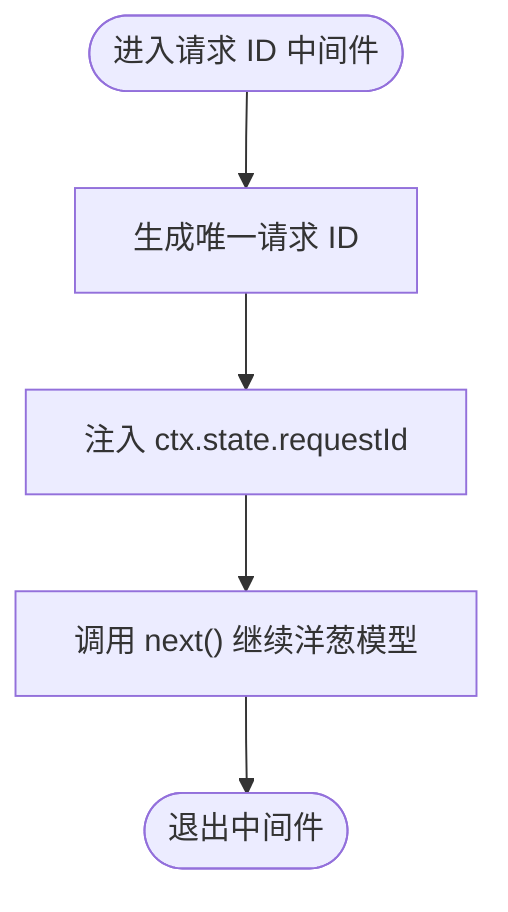
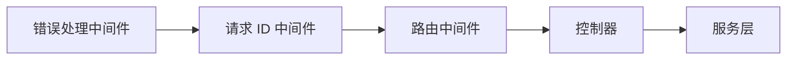
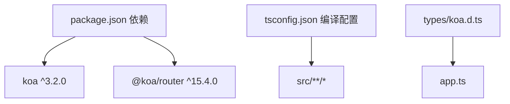

# 中间件系统

<cite>
**本文引用的文件**
- [error-handler.ts](file://project/server/src/middlewares/error-handler.ts)
- [request-id.ts](file://project/server/src/middlewares/request-id.ts)
- [app.ts](file://project/server/src/app.ts)
- [index.ts](file://project/server/src/index.ts)
- [env.ts](file://project/server/src/config/env.ts)
- [logger.ts](file://project/server/src/config/logger.ts)
- [koa.d.ts](file://project/server/src/types/koa.d.ts)
- [health.ts](file://project/server/src/routes/health.ts)
- [index.ts](file://project/server/src/routes/index.ts)
- [health.controller.ts](file://project/server/src/controllers/health.controller.ts)
- [health.service.ts](file://project/server/src/services/health.service.ts)
- [package.json](file://project/server/package.json)
- [tsconfig.json](file://project/server/tsconfig.json)
</cite>

## 目录
1. [简介](#简介)
2. [项目结构](#项目结构)
3. [核心组件](#核心组件)
4. [架构总览](#架构总览)
5. [详细组件分析](#详细组件分析)
6. [依赖关系分析](#依赖关系分析)
7. [性能考量](#性能考量)
8. [故障排查指南](#故障排查指南)
9. [结论](#结论)
10. [附录](#附录)

## 简介
本文件面向 Node.js 服务器中间件系统，基于 Koa 框架实现。重点阐述中间件的执行顺序与生命周期管理（洋葱模型）、错误处理中间件的实现机制（异常捕获、错误分类与响应格式化）、请求 ID 中间件的功能（请求跟踪、日志关联与调试支持），并提供中间件开发最佳实践（异步处理、错误传播、性能优化）以及自定义中间件的开发指南与集成示例。该系统采用 TypeScript 编写，使用 @koa/router 进行路由管理，通过环境变量与简单日志模块进行运行时配置与输出。

## 项目结构
后端服务位于 project/server 目录，采用按功能分层的组织方式：
- 配置：环境变量加载与日志模块
- 类型扩展：Koa 默认状态扩展（DefaultState）
- 路由：顶层路由聚合与具体业务路由
- 控制器与服务：业务控制器与服务层
- 中间件：错误处理与请求 ID
- 应用入口：Koa 应用实例与 HTTP 服务器启动

图表来源
- [index.ts:1-15](file://project/server/src/index.ts#L1-L15)
- [app.ts:1-14](file://project/server/src/app.ts#L1-L14)
- [error-handler.ts:1-18](file://project/server/src/middlewares/error-handler.ts#L1-L18)
- [request-id.ts:1-11](file://project/server/src/middlewares/request-id.ts#L1-L11)
- [routes/index.ts:1-9](file://project/server/src/routes/index.ts#L1-L9)
- [routes/health.ts:1-9](file://project/server/src/routes/health.ts#L1-L9)
- [controllers/health.controller.ts:1-7](file://project/server/src/controllers/health.controller.ts#L1-L7)
- [services/health.service.ts:1-14](file://project/server/src/services/health.service.ts#L1-L14)
- [env.ts:1-12](file://project/server/src/config/env.ts#L1-L12)
- [logger.ts:1-18](file://project/server/src/config/logger.ts#L1-L18)
- [koa.d.ts:1-8](file://project/server/src/types/koa.d.ts#L1-L8)

章节来源
- [index.ts:1-15](file://project/server/src/index.ts#L1-L15)
- [app.ts:1-14](file://project/server/src/app.ts#L1-L14)
- [routes/index.ts:1-9](file://project/server/src/routes/index.ts#L1-L9)
- [routes/health.ts:1-9](file://project/server/src/routes/health.ts#L1-L9)
- [controllers/health.controller.ts:1-7](file://project/server/src/controllers/health.controller.ts#L1-L7)
- [services/health.service.ts:1-14](file://project/server/src/services/health.service.ts#L1-L14)
- [env.ts:1-12](file://project/server/src/config/env.ts#L1-L12)
- [logger.ts:1-18](file://project/server/src/config/logger.ts#L1-L18)
- [koa.d.ts:1-8](file://project/server/src/types/koa.d.ts#L1-L8)

## 核心组件
- 错误处理中间件：在洋葱模型最外层包裹，统一捕获下游抛出的异常，记录带请求 ID 的错误日志，返回标准化错误响应。
- 请求 ID 中间件：在每个请求进入时生成唯一标识，注入到 ctx.state.requestId，供后续中间件与日志使用。
- Koa 应用与路由：注册中间件与路由，形成标准的请求处理链路。
- 环境与日志：加载运行时配置与基础日志输出能力。

章节来源
- [error-handler.ts:1-18](file://project/server/src/middlewares/error-handler.ts#L1-L18)
- [request-id.ts:1-11](file://project/server/src/middlewares/request-id.ts#L1-L11)
- [app.ts:1-14](file://project/server/src/app.ts#L1-L14)
- [env.ts:1-12](file://project/server/src/config/env.ts#L1-L12)
- [logger.ts:1-18](file://project/server/src/config/logger.ts#L1-L18)

## 架构总览
下图展示了请求从进入服务器到返回响应的完整流程，以及中间件的执行顺序与洋葱模型的体现。

图表来源
- [index.ts:1-15](file://project/server/src/index.ts#L1-L15)
- [app.ts:1-14](file://project/server/src/app.ts#L1-L14)
- [error-handler.ts:1-18](file://project/server/src/middlewares/error-handler.ts#L1-L18)
- [request-id.ts:1-11](file://project/server/src/middlewares/request-id.ts#L1-L11)
- [routes/index.ts:1-9](file://project/server/src/routes/index.ts#L1-L9)
- [routes/health.ts:1-9](file://project/server/src/routes/health.ts#L1-L9)
- [controllers/health.controller.ts:1-7](file://project/server/src/controllers/health.controller.ts#L1-L7)
- [services/health.service.ts:1-14](file://project/server/src/services/health.service.ts#L1-L14)

## 详细组件分析

### 错误处理中间件
- 功能定位：作为洋葱模型最外层的守门员，负责捕获下游中间件或业务逻辑抛出的异常。
- 执行流程：
  - 包裹 next() 调用，等待下游执行。
  - 若下游抛出异常，则捕获并记录带请求 ID 的错误日志。
  - 设置响应状态码为 500，并返回包含错误码、消息与请求 ID 的标准化响应体。
- 错误分类与响应格式化：
  - 统一返回结构包含错误码、人类可读消息与请求 ID，便于前端与监控系统识别与追踪。
  - 对于非 Error 实例，回退为“未知错误”提示，保证响应一致性。
- 日志关联：
  - 使用 logger.error 输出，消息中包含 ctx.state.requestId，若未生成则显示占位符，确保日志可追溯。

图表来源
- [error-handler.ts:4-17](file://project/server/src/middlewares/error-handler.ts#L4-L17)
- [logger.ts:14-16](file://project/server/src/config/logger.ts#L14-L16)

章节来源
- [error-handler.ts:1-18](file://project/server/src/middlewares/error-handler.ts#L1-L18)
- [logger.ts:1-18](file://project/server/src/config/logger.ts#L1-L18)

### 请求 ID 中间件
- 功能定位：在请求进入时生成唯一标识，注入到 ctx.state.requestId，供后续中间件与日志使用。
- 生成策略：结合时间戳与随机字符串，保证高并发下的唯一性与可读性。
- 生命周期：仅在进入阶段设置，不修改响应，不影响业务逻辑返回值。
- 与日志的协作：错误处理中间件在记录错误时会携带 requestId，便于跨服务与多实例的日志关联。

图表来源
- [request-id.ts:3-10](file://project/server/src/middlewares/request-id.ts#L3-L10)

章节来源
- [request-id.ts:1-11](file://project/server/src/middlewares/request-id.ts#L1-L11)
- [koa.d.ts:3-7](file://project/server/src/types/koa.d.ts#L3-L7)

### Koa 应用与路由集成
- 中间件注册顺序：
  - 错误处理中间件置于最外层，确保所有请求均被保护。
  - 请求 ID 中间件次之，确保后续中间件与日志能获取到 requestId。
  - 路由中间件最后注册，承接匹配后的业务处理。
- 路由组织：
  - 顶层路由聚合器引入各业务路由模块，统一挂载。
  - 健康检查路由示例展示 GET /health 的控制器绑定与服务层调用。

图表来源
- [app.ts:8-11](file://project/server/src/app.ts#L8-L11)
- [routes/index.ts:6](file://project/server/src/routes/index.ts#L6)
- [routes/health.ts:6](file://project/server/src/routes/health.ts#L6)
- [controllers/health.controller.ts:4-6](file://project/server/src/controllers/health.controller.ts#L4-L6)

章节来源
- [app.ts:1-14](file://project/server/src/app.ts#L1-L14)
- [routes/index.ts:1-9](file://project/server/src/routes/index.ts#L1-L9)
- [routes/health.ts:1-9](file://project/server/src/routes/health.ts#L1-L9)
- [controllers/health.controller.ts:1-7](file://project/server/src/controllers/health.controller.ts#L1-L7)
- [services/health.service.ts:1-14](file://project/server/src/services/health.service.ts#L1-L14)

### 环境与日志配置
- 环境变量加载：提供 NODE_ENV 与 PORT 的默认值，便于本地与生产环境切换。
- 日志模块：提供 info/warn/error 三类方法，统一输出格式，便于与请求 ID 关联。

章节来源
- [env.ts:1-12](file://project/server/src/config/env.ts#L1-L12)
- [logger.ts:1-18](file://project/server/src/config/logger.ts#L1-L18)

## 依赖关系分析
- 运行时依赖：Koa 3.x 与 @koa/router，提供中间件与路由能力。
- 开发依赖：TypeScript、ts-node-dev、@types/koa 与 @types/koa__router，保障类型安全与开发体验。
- 类型扩展：通过模块声明扩展 Koa 的 DefaultState，允许 ctx.state.requestId 存在。

图表来源
- [package.json:16-26](file://project/server/package.json#L16-L26)
- [tsconfig.json:2-14](file://project/server/tsconfig.json#L2-L14)
- [koa.d.ts:3-7](file://project/server/src/types/koa.d.ts#L3-L7)
- [app.ts:1-14](file://project/server/src/app.ts#L1-L14)

章节来源
- [package.json:1-28](file://project/server/package.json#L1-L28)
- [tsconfig.json:1-18](file://project/server/tsconfig.json#L1-L18)
- [koa.d.ts:1-8](file://project/server/src/types/koa.d.ts#L1-L8)
- [app.ts:1-14](file://project/server/src/app.ts#L1-L14)

## 性能考量
- 中间件数量与顺序：中间件越多，洋葱模型调用链越长，建议将高频路径的中间件置于靠前位置，减少不必要的 next() 调用。
- 异步开销：错误处理与请求 ID 中间件均为轻量级操作，通常不会成为瓶颈；但需避免在中间件中执行阻塞 I/O。
- 日志输出：日志模块使用同步 console 输出，建议在生产环境接入异步日志库以降低 I/O 阻塞风险。
- 内存占用：请求 ID 字符串短小，内存开销可忽略；注意不要在 ctx.state 中存储大对象。
- 并发唯一性：请求 ID 生成策略在高并发下表现良好，但如需更强的一致性，可考虑使用更严格的唯一标识生成方案。

## 故障排查指南
- 无请求 ID 的错误日志：
  - 现象：错误日志中 requestId 显示为占位符。
  - 排查：确认请求 ID 中间件已注册且优先级高于错误处理中间件。
  - 参考：错误处理中间件在记录日志时会读取 ctx.state.requestId。
- 500 错误但响应体不符合预期：
  - 现象：业务抛错后返回标准化错误响应，但字段缺失或不一致。
  - 排查：检查错误处理中间件的响应体结构是否被下游覆盖。
- 路由未生效：
  - 现象：访问 /health 返回 404 或 405。
  - 排查：确认路由聚合与 allowedMethods 是否正确挂载。
- 端口占用或启动失败：
  - 现象：服务器无法监听指定端口。
  - 排查：检查环境变量 PORT 与 NODE_ENV，确认端口可用。

章节来源
- [error-handler.ts:9](file://project/server/src/middlewares/error-handler.ts#L9)
- [app.ts:8-11](file://project/server/src/app.ts#L8-L11)
- [routes/index.ts:6](file://project/server/src/routes/index.ts#L6)
- [env.ts:6-11](file://project/server/src/config/env.ts#L6-L11)

## 结论
该中间件系统以最小实现满足了请求追踪与错误统一处理的核心需求。通过洋葱模型的清晰边界，错误处理中间件与请求 ID 中间件分别承担“兜底保护”与“可追溯性”的职责，配合简洁的日志模块与路由体系，形成了稳定、可扩展的基础能力。建议在后续演进中引入更完善的错误分类与响应模板、异步日志与指标采集，以及更丰富的中间件生态（如鉴权、限流、审计等）。

## 附录

### 自定义中间件开发指南
- 设计原则
  - 轻量与职责单一：每个中间件只做一件事，避免过度耦合。
  - 保持 next() 调用：确保洋葱模型完整，避免中断后续中间件链。
  - 异常隔离：在中间件内部捕获并转换异常，避免泄漏到上游。
- 开发步骤
  - 定义函数签名：接收 ctx 与 next，并返回 Promise<void>。
  - 在进入时注入上下文信息（如请求 ID、用户信息、审计字段）。
  - 调用 next() 执行下游。
  - 在退出时根据需要设置响应头、状态码或日志。
- 集成示例
  - 将新中间件注册在请求 ID 中间件之后、路由之前，确保其能读取到 ctx.state.requestId 并在日志中体现。
  - 如需在错误处理前执行，将其置于错误处理中间件内层（靠近业务逻辑）。

章节来源
- [request-id.ts:7-10](file://project/server/src/middlewares/request-id.ts#L7-L10)
- [app.ts:8-11](file://project/server/src/app.ts#L8-L11)

### 洋葱模型与执行顺序
- 注册顺序即执行顺序：错误处理中间件最先注册，请求 ID 中间件其次，路由中间件最后。
- 执行路径：进入时从外到内，退出时从内到外；错误处理中间件在外层，负责兜底。
- 典型流程：请求进入 -> 错误处理中间件 -> 请求 ID 中间件 -> 路由 -> 控制器 -> 服务 -> 响应返回 -> 退出洋葱模型。

章节来源
- [app.ts:8-11](file://project/server/src/app.ts#L8-L11)
- [error-handler.ts:4-6](file://project/server/src/middlewares/error-handler.ts#L4-L6)
- [request-id.ts:7-9](file://project/server/src/middlewares/request-id.ts#L7-L9)