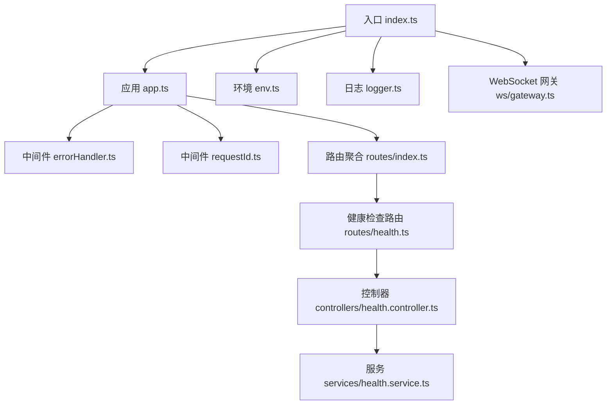
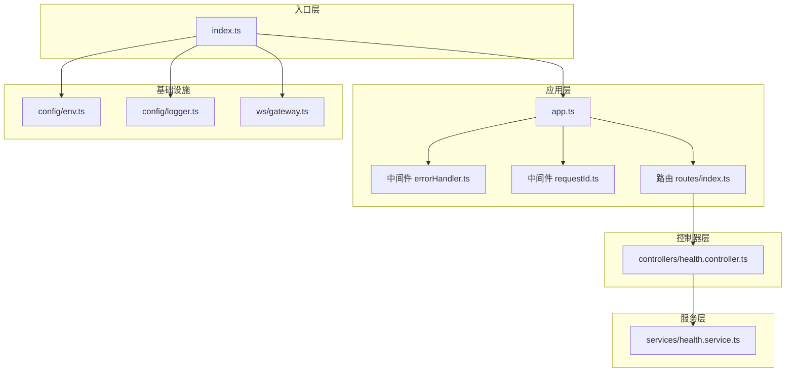
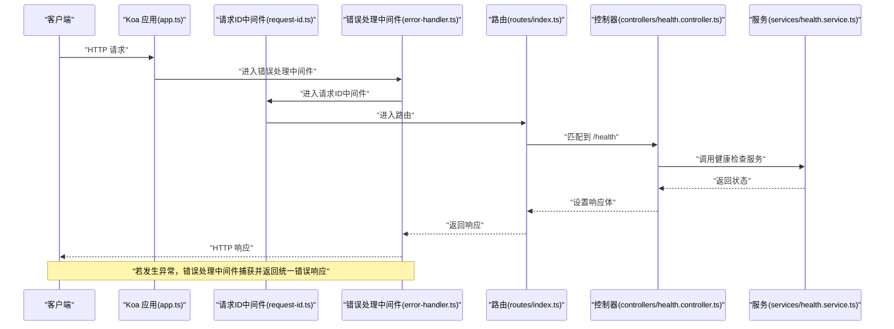
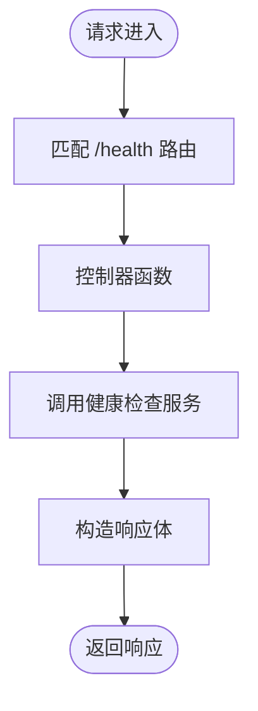
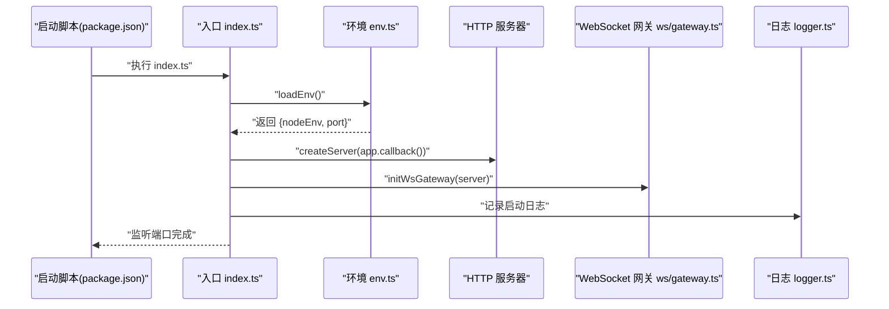
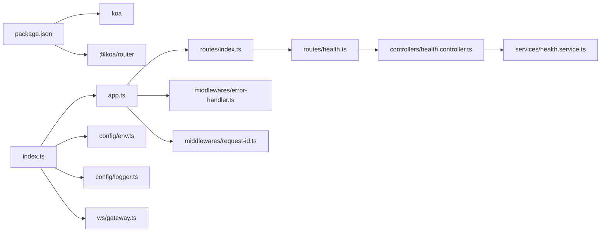

# 服务器架构设计

<cite>
**本文引用的文件**
- [index.ts](file://project/server/src/index.ts)
- [app.ts](file://project/server/src/app.ts)
- [env.ts](file://project/server/src/config/env.ts)
- [logger.ts](file://project/server/src/config/logger.ts)
- [error-handler.ts](file://project/server/src/middlewares/error-handler.ts)
- [request-id.ts](file://project/server/src/middlewares/request-id.ts)
- [routes/index.ts](file://project/server/src/routes/index.ts)
- [routes/health.ts](file://project/server/src/routes/health.ts)
- [controllers/health.controller.ts](file://project/server/src/controllers/health.controller.ts)
- [services/health.service.ts](file://project/server/src/services/health.service.ts)
- [ws/gateway.ts](file://project/server/src/ws/gateway.ts)
- [types/koa.d.ts](file://project/server/src/types/koa.d.ts)
- [package.json](file://project/server/package.json)
- [tsconfig.json](file://project/server/tsconfig.json)
</cite>

## 目录
1. [简介](#简介)
2. [项目结构](#项目结构)
3. [核心组件](#核心组件)
4. [架构总览](#架构总览)
5. [详细组件分析](#详细组件分析)
6. [依赖关系分析](#依赖关系分析)
7. [性能考量](#性能考量)
8. [故障排查指南](#故障排查指南)
9. [结论](#结论)
10. [附录](#附录)

## 简介
本项目是一个基于 Koa.js 的 Node.js 服务器，采用 TypeScript 开发，遵循模块化与分层架构（MVC 风格）。其核心目标是提供一个轻量、可扩展、易维护的服务端基础框架，当前已实现环境配置加载、HTTP 服务启动、请求链路中间件、路由与控制器、简单服务层以及预留的 WebSocket 网关集成点。本文档将系统阐述应用实例初始化、中间件注册与路由配置、服务器启动流程、配置加载与模块导入机制，并从架构模式、设计权衡、性能优化与可扩展性角度给出建议。

## 项目结构
后端工程位于 project/server，采用按功能域划分的模块化组织方式：
- config：环境变量加载与日志工具
- middlewares：通用中间件（错误处理、请求 ID）
- routes：路由定义与聚合
- controllers：控制器函数（业务入口）
- services：服务层（业务逻辑）
- ws：WebSocket 网关预留
- types：类型增强（如 Koa 默认状态扩展）

图表来源
- [index.ts:1-15](file://project/server/src/index.ts#L1-L15)
- [app.ts:1-14](file://project/server/src/app.ts#L1-L14)
- [routes/index.ts:1-9](file://project/server/src/routes/index.ts#L1-L9)
- [routes/health.ts:1-9](file://project/server/src/routes/health.ts#L1-L9)
- [controllers/health.controller.ts:1-7](file://project/server/src/controllers/health.controller.ts#L1-L7)
- [services/health.service.ts:1-14](file://project/server/src/services/health.service.ts#L1-L14)
- [env.ts:1-12](file://project/server/src/config/env.ts#L1-L12)
- [logger.ts:1-18](file://project/server/src/config/logger.ts#L1-L18)
- [ws/gateway.ts:1-8](file://project/server/src/ws/gateway.ts#L1-L8)

章节来源
- [index.ts:1-15](file://project/server/src/index.ts#L1-L15)
- [app.ts:1-14](file://project/server/src/app.ts#L1-L14)
- [routes/index.ts:1-9](file://project/server/src/routes/index.ts#L1-L9)
- [routes/health.ts:1-9](file://project/server/src/routes/health.ts#L1-L9)
- [controllers/health.controller.ts:1-7](file://project/server/src/controllers/health.controller.ts#L1-L7)
- [services/health.service.ts:1-14](file://project/server/src/services/health.service.ts#L1-L14)
- [env.ts:1-12](file://project/server/src/config/env.ts#L1-L12)
- [logger.ts:1-18](file://project/server/src/config/logger.ts#L1-L18)
- [ws/gateway.ts:1-8](file://project/server/src/ws/gateway.ts#L1-L8)

## 核心组件
- 应用实例与中间件
  - 应用实例在 app.ts 中创建并注册全局中间件：错误处理与请求 ID 注入。
  - 路由通过 @koa/router 注册到应用实例上。
- 路由与控制器
  - 路由在 routes/health.ts 定义 GET /health；控制器 health.controller.ts 调用服务层返回状态。
- 服务层
  - health.service.ts 提供健康检查数据模型与状态生成。
- 配置与日志
  - env.ts 加载 NODE_ENV 与 PORT；logger.ts 提供格式化的日志输出。
- 启动流程
  - index.ts 负责加载环境、创建 HTTP 服务器、初始化 WebSocket 网关并监听端口。
- 类型增强
  - types/koa.d.ts 扩展 Koa 默认状态，加入 requestId 字段。

章节来源
- [app.ts:1-14](file://project/server/src/app.ts#L1-L14)
- [routes/health.ts:1-9](file://project/server/src/routes/health.ts#L1-L9)
- [controllers/health.controller.ts:1-7](file://project/server/src/controllers/health.controller.ts#L1-L7)
- [services/health.service.ts:1-14](file://project/server/src/services/health.service.ts#L1-L14)
- [env.ts:1-12](file://project/server/src/config/env.ts#L1-L12)
- [logger.ts:1-18](file://project/server/src/config/logger.ts#L1-L18)
- [index.ts:1-15](file://project/server/src/index.ts#L1-L15)
- [types/koa.d.ts:1-8](file://project/server/src/types/koa.d.ts#L1-L8)

## 架构总览
该服务器采用“控制器-服务”分层风格，结合 Koa 的洋葱模型中间件机制，形成清晰的职责边界：
- 入口层：index.ts 负责应用生命周期与外部集成（HTTP 与 WebSocket）。
- 控制器层：controllers 处理请求参数与响应封装，调用服务层。
- 服务层：services 实现具体业务逻辑，保持无状态与可测试性。
- 基础设施：config 提供环境与日志；middlewares 提供横切关注点（错误处理、追踪）。

图表来源
- [index.ts:1-15](file://project/server/src/index.ts#L1-L15)
- [app.ts:1-14](file://project/server/src/app.ts#L1-L14)
- [routes/index.ts:1-9](file://project/server/src/routes/index.ts#L1-L9)
- [controllers/health.controller.ts:1-7](file://project/server/src/controllers/health.controller.ts#L1-L7)
- [services/health.service.ts:1-14](file://project/server/src/services/health.service.ts#L1-L14)
- [env.ts:1-12](file://project/server/src/config/env.ts#L1-L12)
- [logger.ts:1-18](file://project/server/src/config/logger.ts#L1-L18)
- [ws/gateway.ts:1-8](file://project/server/src/ws/gateway.ts#L1-L8)

## 详细组件分析

### 应用实例初始化与中间件注册
- 初始化流程
  - 在 app.ts 创建 Koa 实例，依次注册错误处理中间件、请求 ID 中间件，再挂载路由。
  - 中间件顺序决定洋葱模型的执行顺序：错误处理在外层，请求 ID 在内层，路由在最里层。
- 请求 ID 中间件
  - 为每个请求生成唯一标识并写入 ctx.state，便于日志追踪与问题定位。
- 错误处理中间件
  - 捕获下游抛出的异常，记录日志，设置统一的 500 响应体与 requestId 关联。

图表来源
- [app.ts:1-14](file://project/server/src/app.ts#L1-L14)
- [request-id.ts:1-11](file://project/server/src/middlewares/request-id.ts#L1-L11)
- [error-handler.ts:1-18](file://project/server/src/middlewares/error-handler.ts#L1-L18)
- [routes/index.ts:1-9](file://project/server/src/routes/index.ts#L1-L9)
- [controllers/health.controller.ts:1-7](file://project/server/src/controllers/health.controller.ts#L1-L7)
- [services/health.service.ts:1-14](file://project/server/src/services/health.service.ts#L1-L14)

章节来源
- [app.ts:1-14](file://project/server/src/app.ts#L1-L14)
- [request-id.ts:1-11](file://project/server/src/middlewares/request-id.ts#L1-L11)
- [error-handler.ts:1-18](file://project/server/src/middlewares/error-handler.ts#L1-L18)

### 路由配置与控制器
- 路由聚合
  - routes/index.ts 创建 Router 实例并将子路由 healthRouter 注册进来。
- 健康检查路由
  - routes/health.ts 定义 GET /health，映射到控制器函数。
- 控制器职责
  - controllers/health.controller.ts 仅负责读取服务返回的状态并写入响应体。
- 服务层职责
  - services/health.service.ts 返回标准化的健康状态对象，包含服务名、状态与时间戳。

图表来源
- [routes/health.ts:1-9](file://project/server/src/routes/health.ts#L1-L9)
- [controllers/health.controller.ts:1-7](file://project/server/src/controllers/health.controller.ts#L1-L7)
- [services/health.service.ts:1-14](file://project/server/src/services/health.service.ts#L1-L14)

章节来源
- [routes/index.ts:1-9](file://project/server/src/routes/index.ts#L1-L9)
- [routes/health.ts:1-9](file://project/server/src/routes/health.ts#L1-L9)
- [controllers/health.controller.ts:1-7](file://project/server/src/controllers/health.controller.ts#L1-L7)
- [services/health.service.ts:1-14](file://project/server/src/services/health.service.ts#L1-L14)

### 服务器启动流程、配置加载与模块导入
- 启动流程
  - index.ts 加载环境配置，创建 HTTP 服务器并绑定 Koa 回调，随后初始化 WebSocket 网关，最后监听端口。
- 配置加载
  - env.ts 从进程环境变量读取 NODE_ENV 与 PORT，并提供默认值。
- 日志与类型
  - logger.ts 提供统一的日志格式化输出；types/koa.d.ts 为 Koa 默认状态扩展 requestId 字段，确保类型安全。

图表来源
- [index.ts:1-15](file://project/server/src/index.ts#L1-L15)
- [env.ts:1-12](file://project/server/src/config/env.ts#L1-L12)
- [ws/gateway.ts:1-8](file://project/server/src/ws/gateway.ts#L1-L8)
- [logger.ts:1-18](file://project/server/src/config/logger.ts#L1-L18)

章节来源
- [index.ts:1-15](file://project/server/src/index.ts#L1-L15)
- [env.ts:1-12](file://project/server/src/config/env.ts#L1-L12)
- [logger.ts:1-18](file://project/server/src/config/logger.ts#L1-L18)
- [package.json:1-28](file://project/server/package.json#L1-L28)

### 架构模式与设计权衡
- MVC 风格
  - 控制器层（controllers）负责请求到响应的映射；服务层（services）承载业务逻辑；路由层（routes）负责路径与方法分发。
- 中间件机制
  - 通过洋葱模型实现横切关注点（日志、追踪、异常），提升代码复用与可维护性。
- 模块化组织
  - 按功能域划分目录，降低耦合度，便于团队协作与测试。
- 设计权衡
  - 当前未引入依赖注入容器，简化了启动与调试成本；若未来业务复杂度上升，可考虑引入轻量 DI 或模块化注册机制以进一步解耦。
  - WebSocket 网关处于预留阶段，建议后续引入 ws 或 socket.io 并与现有中间件体系对齐。

章节来源
- [app.ts:1-14](file://project/server/src/app.ts#L1-L14)
- [routes/index.ts:1-9](file://project/server/src/routes/index.ts#L1-L9)
- [controllers/health.controller.ts:1-7](file://project/server/src/controllers/health.controller.ts#L1-L7)
- [services/health.service.ts:1-14](file://project/server/src/services/health.service.ts#L1-L14)
- [ws/gateway.ts:1-8](file://project/server/src/ws/gateway.ts#L1-L8)

## 依赖关系分析
- 运行时依赖
  - Koa 与 @koa/router 提供 Web 框架与路由能力。
- 开发时依赖
  - TypeScript、ts-node-dev、@types/* 提供类型支持与开发体验。
- 模块导入关系
  - index.ts 导入 app.ts、env.ts、logger.ts、ws/gateway.ts；app.ts 导入路由与中间件；路由导入控制器；控制器调用服务。

图表来源
- [package.json:1-28](file://project/server/package.json#L1-L28)
- [index.ts:1-15](file://project/server/src/index.ts#L1-L15)
- [app.ts:1-14](file://project/server/src/app.ts#L1-L14)
- [routes/index.ts:1-9](file://project/server/src/routes/index.ts#L1-L9)
- [routes/health.ts:1-9](file://project/server/src/routes/health.ts#L1-L9)
- [controllers/health.controller.ts:1-7](file://project/server/src/controllers/health.controller.ts#L1-L7)
- [services/health.service.ts:1-14](file://project/server/src/services/health.service.ts#L1-L14)
- [error-handler.ts:1-18](file://project/server/src/middlewares/error-handler.ts#L1-L18)
- [request-id.ts:1-11](file://project/server/src/middlewares/request-id.ts#L1-L11)

章节来源
- [package.json:1-28](file://project/server/package.json#L1-L28)
- [index.ts:1-15](file://project/server/src/index.ts#L1-L15)
- [app.ts:1-14](file://project/server/src/app.ts#L1-L14)

## 性能考量
- 中间件顺序与开销
  - 将轻量中间件置于外层，避免阻塞后续处理；错误处理中间件应尽量快速返回，减少异常路径的额外开销。
- 路由与控制器
  - 控制器仅做薄封装，避免在控制器中进行重计算或 IO；将耗时逻辑下沉至服务层并可缓存结果。
- 日志与追踪
  - 使用请求 ID 统一串联日志，便于性能分析与问题定位；避免在高频路径打印大量结构化日志。
- 启动与资源
  - WebSocket 网关初始化建议延迟到需要时再建立连接，避免不必要的资源占用。
- 可扩展性
  - 引入限流、熔断与超时控制等中间件；对静态资源与缓存策略进行优化；数据库连接池与查询优化作为后续扩展点。

## 故障排查指南
- 常见问题定位
  - 通过错误处理中间件的统一响应与日志输出定位异常；结合请求 ID 快速关联到对应请求上下文。
- 环境与端口
  - 若端口被占用或环境变量未正确设置，检查 env.ts 的默认值与进程环境变量；确认 index.ts 的监听回调是否触发。
- 日志输出
  - logger.ts 提供 info/warn/error 三类输出，建议在开发与生产分别调整日志级别与输出介质。
- WebSocket 网关
  - 当前为预留实现，若出现连接问题，优先检查 HTTP 服务器是否正常监听与路由是否可达。

章节来源
- [error-handler.ts:1-18](file://project/server/src/middlewares/error-handler.ts#L1-L18)
- [logger.ts:1-18](file://project/server/src/config/logger.ts#L1-L18)
- [env.ts:1-12](file://project/server/src/config/env.ts#L1-L12)
- [index.ts:1-15](file://project/server/src/index.ts#L1-L15)
- [ws/gateway.ts:1-8](file://project/server/src/ws/gateway.ts#L1-L8)

## 结论
本项目以 Koa 为核心，构建了清晰的分层架构与模块化组织，具备良好的可读性与可扩展性。通过中间件机制实现了横切关注点的集中管理，路由与控制器分离明确了职责边界。当前版本聚焦于最小可用能力（健康检查），为后续引入认证、鉴权、数据库、消息队列与 WebSocket 等能力提供了稳固基础。建议在演进过程中逐步引入依赖注入、限流与监控、缓存与异步任务等机制，持续提升系统的稳定性与性能表现。

## 附录
- TypeScript 编译配置
  - tsconfig.json 指定编译目标、模块解析策略与严格模式等选项，确保类型安全与兼容性。
- 包管理与脚本
  - package.json 提供开发、构建与运行脚本，便于本地开发与部署。

章节来源
- [tsconfig.json:1-18](file://project/server/tsconfig.json#L1-L18)
- [package.json:1-28](file://project/server/package.json#L1-L28)