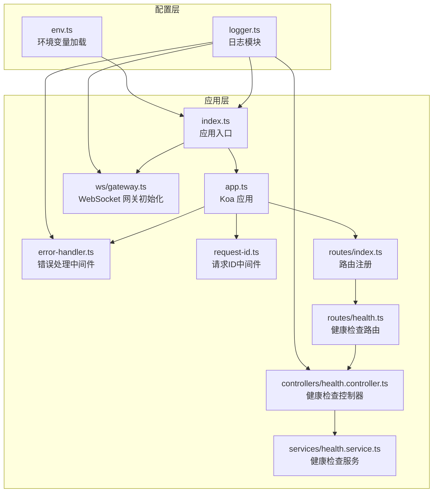
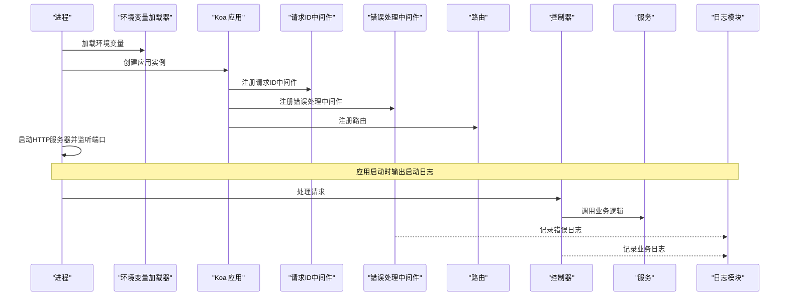
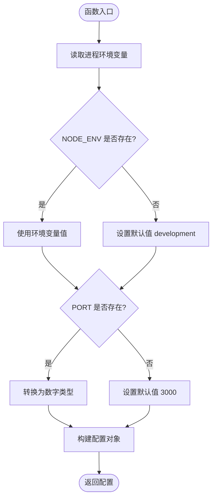
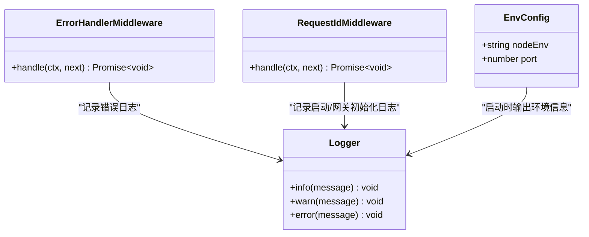
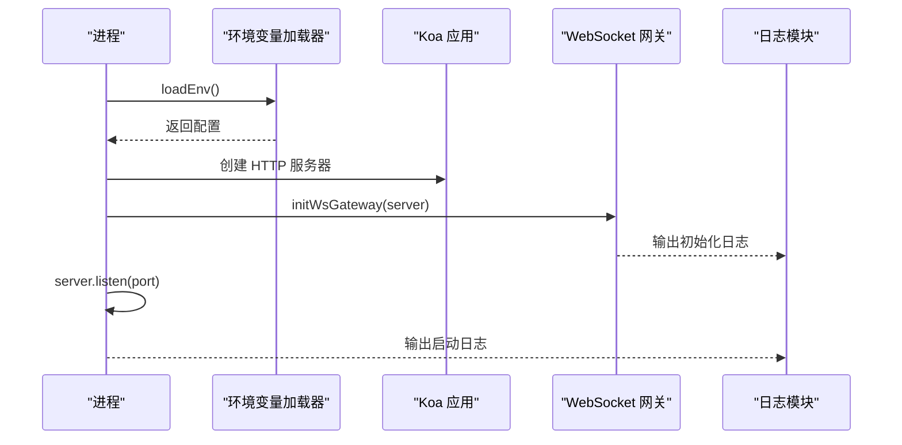
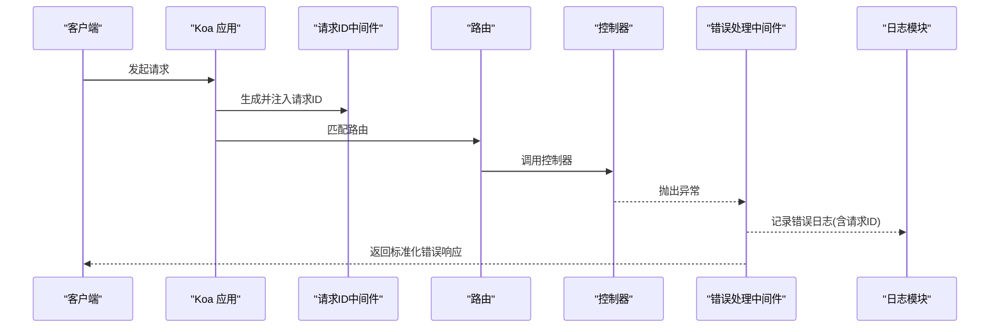
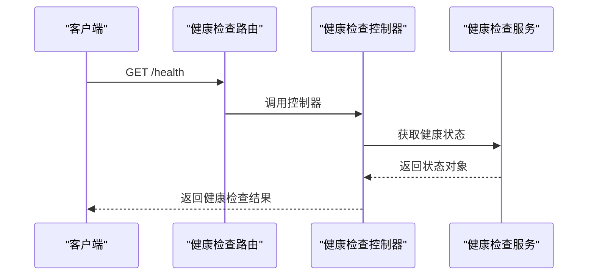
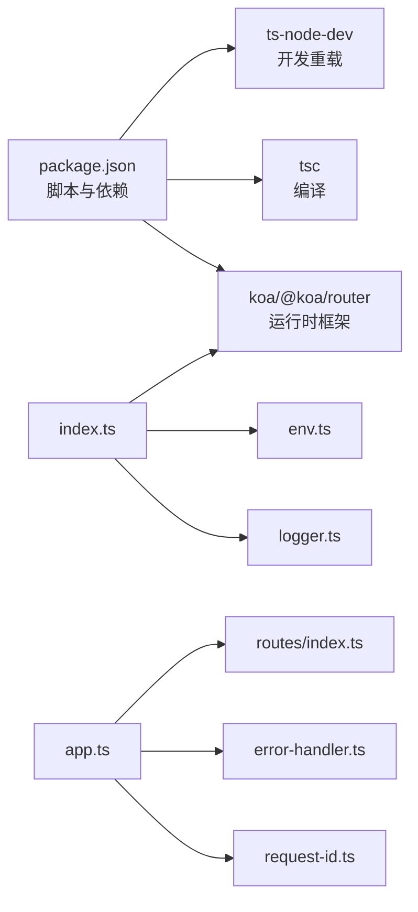

# 配置管理

<cite>
**本文引用的文件**
- [env.ts](file://project/server/src/config/env.ts)
- [logger.ts](file://project/server/src/config/logger.ts)
- [index.ts](file://project/server/src/index.ts)
- [app.ts](file://project/server/src/app.ts)
- [error-handler.ts](file://project/server/src/middlewares/error-handler.ts)
- [request-id.ts](file://project/server/src/middlewares/request-id.ts)
- [health.ts](file://project/server/src/routes/health.ts)
- [health.controller.ts](file://project/server/src/controllers/health.controller.ts)
- [health.service.ts](file://project/server/src/services/health.service.ts)
- [gateway.ts](file://project/server/src/ws/gateway.ts)
- [package.json](file://project/server/package.json)
</cite>

## 目录
1. [简介](#简介)
2. [项目结构](#项目结构)
3. [核心组件](#核心组件)
4. [架构总览](#架构总览)
5. [详细组件分析](#详细组件分析)
6. [依赖关系分析](#依赖关系分析)
7. [性能考虑](#性能考虑)
8. [故障排查指南](#故障排查指南)
9. [结论](#结论)
10. [附录](#附录)

## 简介
本文件面向 Node.js 服务器的配置管理，聚焦于环境变量配置加载与类型转换、日志模块的实现与使用、以及整体应用启动流程中的配置集成。当前代码库提供了最小但完整的配置与日志基础设施：通过环境变量加载基础运行参数（如 NODE_ENV 和 PORT），并通过自定义 logger 组件统一输出格式；同时，错误处理中间件与请求 ID 中间件展示了如何在运行时对请求进行追踪与错误记录。该文档将帮助读者理解现有实现，并给出在生产环境中可扩展的配置管理策略与最佳实践。

## 项目结构
后端服务位于 project/server 目录，采用 TypeScript + Koa 的典型结构：
- config：环境变量与日志配置
- src：应用入口、中间件、路由、控制器、服务与 WebSocket 网关
- package.json：脚本与依赖声明

图表来源
- [env.ts:1-12](file://project/server/src/config/env.ts#L1-L12)
- [logger.ts:1-18](file://project/server/src/config/logger.ts#L1-L18)
- [index.ts:1-15](file://project/server/src/index.ts#L1-L15)
- [app.ts:1-14](file://project/server/src/app.ts#L1-L14)
- [error-handler.ts:1-18](file://project/server/src/middlewares/error-handler.ts#L1-L18)
- [request-id.ts:1-11](file://project/server/src/middlewares/request-id.ts#L1-L11)
- [routes/index.ts:1-9](file://project/server/src/routes/index.ts#L1-L9)
- [routes/health.ts:1-9](file://project/server/src/routes/health.ts#L1-L9)
- [controllers/health.controller.ts:1-7](file://project/server/src/controllers/health.controller.ts#L1-L7)
- [services/health.service.ts:1-14](file://project/server/src/services/health.service.ts#L1-L14)
- [ws/gateway.ts:1-8](file://project/server/src/ws/gateway.ts#L1-L8)

章节来源
- [index.ts:1-15](file://project/server/src/index.ts#L1-L15)
- [app.ts:1-14](file://project/server/src/app.ts#L1-L14)
- [env.ts:1-12](file://project/server/src/config/env.ts#L1-L12)
- [logger.ts:1-18](file://project/server/src/config/logger.ts#L1-L18)

## 核心组件
- 环境变量加载器：从进程环境读取运行参数，提供默认值与基本类型转换。
- 日志模块：统一输出格式，支持 info/warn/error 三种级别。
- 应用入口：加载环境配置、创建 HTTP 服务器、初始化 WebSocket 网关并监听端口。
- 错误处理中间件：捕获异常、记录日志、返回标准化错误响应。
- 请求 ID 中间件：为每个请求生成唯一标识，便于日志关联与问题定位。
- 健康检查服务：提供基础可用性检测接口。

章节来源
- [env.ts:6-11](file://project/server/src/config/env.ts#L6-L11)
- [logger.ts:7-17](file://project/server/src/config/logger.ts#L7-L17)
- [index.ts:7-14](file://project/server/src/index.ts#L7-L14)
- [error-handler.ts:4-17](file://project/server/src/middlewares/error-handler.ts#L4-L17)
- [request-id.ts:3-10](file://project/server/src/middlewares/request-id.ts#L3-L10)
- [health.service.ts:7-13](file://project/server/src/services/health.service.ts#L7-L13)

## 架构总览
下图展示了从进程启动到请求处理的关键路径，以及配置与日志的集成点。

图表来源
- [index.ts:7-14](file://project/server/src/index.ts#L7-L14)
- [app.ts:6-11](file://project/server/src/app.ts#L6-L11)
- [request-id.ts:7-10](file://project/server/src/middlewares/request-id.ts#L7-L10)
- [error-handler.ts:4-17](file://project/server/src/middlewares/error-handler.ts#L4-L17)
- [health.controller.ts:4-6](file://project/server/src/controllers/health.controller.ts#L4-L6)
- [health.service.ts:7-13](file://project/server/src/services/health.service.ts#L7-L13)
- [logger.ts:7-17](file://project/server/src/config/logger.ts#L7-L17)

## 详细组件分析

### 环境变量配置加载器
- 功能职责
  - 从进程环境变量中读取运行参数，提供默认值与基础类型转换。
  - 输出类型安全的配置对象，供应用其他模块使用。
- 关键行为
  - 默认环境模式：开发模式。
  - 默认端口：3000。
  - 类型转换：端口值转换为数字类型。
- 可扩展点
  - 当前仅包含少量字段，建议按需扩展，例如数据库连接、日志级别、超时等。
  - 建议增加类型验证与分组校验，确保配置一致性。
  - 建议引入配置文件（如 JSON/YAML）与环境变量的合并策略，形成“全局配置 + 环境特定配置”的层次化结构。

图表来源
- [env.ts:6-11](file://project/server/src/config/env.ts#L6-L11)

章节来源
- [env.ts:1-12](file://project/server/src/config/env.ts#L1-L12)

### 日志模块
- 功能职责
  - 提供统一的日志输出格式，包含时间戳与级别。
  - 支持 info/warn/error 三个级别，分别映射到标准输出或错误输出。
- 关键行为
  - 输出格式包含 ISO 时间戳与大写的日志级别。
  - 控制台输出，便于容器与本地调试。
- 可扩展点
  - 建议引入结构化日志（JSON）以利于日志聚合系统。
  - 建议增加日志级别动态调整能力（运行时配置热更新）。
  - 建议增加日志轮转策略（按大小或时间）与保留策略。

图表来源
- [logger.ts:7-17](file://project/server/src/config/logger.ts#L7-L17)
- [error-handler.ts:4-17](file://project/server/src/middlewares/error-handler.ts#L4-L17)
- [request-id.ts:7-10](file://project/server/src/middlewares/request-id.ts#L7-L10)
- [env.ts:6-11](file://project/server/src/config/env.ts#L6-L11)

章节来源
- [logger.ts:1-18](file://project/server/src/config/logger.ts#L1-L18)
- [error-handler.ts:1-18](file://project/server/src/middlewares/error-handler.ts#L1-L18)
- [request-id.ts:1-11](file://project/server/src/middlewares/request-id.ts#L1-L11)

### 应用入口与启动流程
- 功能职责
  - 加载环境配置，创建 HTTP 服务器，初始化 WebSocket 网关，启动监听。
  - 使用日志模块输出启动信息，包含端口与环境模式。
- 关键行为
  - 顺序：加载环境 -> 创建服务器 -> 初始化 WebSocket -> 监听端口。
  - 启动日志包含端口与环境模式，便于快速确认运行状态。
- 可扩展点
  - 建议在启动前执行配置验证与健康检查。
  - 建议增加优雅关闭与信号处理，配合配置热更新。

图表来源
- [index.ts:7-14](file://project/server/src/index.ts#L7-L14)
- [env.ts:6-11](file://project/server/src/config/env.ts#L6-L11)
- [gateway.ts:4-7](file://project/server/src/ws/gateway.ts#L4-L7)
- [logger.ts:7-17](file://project/server/src/config/logger.ts#L7-L17)

章节来源
- [index.ts:1-15](file://project/server/src/index.ts#L1-L15)
- [gateway.ts:1-8](file://project/server/src/ws/gateway.ts#L1-L8)

### 中间件链路与错误处理
- 功能职责
  - 请求 ID 中间件：为每个请求生成唯一标识，便于日志关联。
  - 错误处理中间件：捕获异常、记录错误日志、返回标准化错误响应。
- 关键行为
  - 请求 ID 写入 ctx.state，后续中间件与控制器可读取。
  - 错误处理中间件统一返回包含错误码、消息与请求 ID 的响应体。
- 可扩展点
  - 建议将错误码与国际化结合，支持多语言错误消息。
  - 建议区分业务错误与系统错误，设置不同日志级别与响应策略。

图表来源
- [app.ts:8-11](file://project/server/src/app.ts#L8-L11)
- [request-id.ts:7-10](file://project/server/src/middlewares/request-id.ts#L7-L10)
- [error-handler.ts:4-17](file://project/server/src/middlewares/error-handler.ts#L4-L17)
- [logger.ts:7-17](file://project/server/src/config/logger.ts#L7-L17)

章节来源
- [app.ts:1-14](file://project/server/src/app.ts#L1-L14)
- [request-id.ts:1-11](file://project/server/src/middlewares/request-id.ts#L1-L11)
- [error-handler.ts:1-18](file://project/server/src/middlewares/error-handler.ts#L1-L18)

### 健康检查服务
- 功能职责
  - 提供健康检查接口，返回服务名称、状态与时间戳。
- 关键行为
  - 接口路径：GET /health
  - 返回结构包含服务名、状态与时间戳。
- 可扩展点
  - 建议增加更详细的子系统健康检查（数据库、缓存、外部服务等）。
  - 建议支持多种响应格式（JSON/文本）与自定义状态字段。

图表来源
- [routes/health.ts](file://project/server/src/routes/health.ts#L6)
- [controllers/health.controller.ts:4-6](file://project/server/src/controllers/health.controller.ts#L4-L6)
- [services/health.service.ts:7-13](file://project/server/src/services/health.service.ts#L7-L13)

章节来源
- [routes/health.ts:1-9](file://project/server/src/routes/health.ts#L1-L9)
- [controllers/health.controller.ts:1-7](file://project/server/src/controllers/health.controller.ts#L1-L7)
- [services/health.service.ts:1-14](file://project/server/src/services/health.service.ts#L1-L14)

## 依赖关系分析
- 运行时依赖
  - Koa 与 @koa/router：Web 框架与路由。
- 开发时依赖
  - TypeScript、ts-node-dev：编译与开发调试。
- 启动脚本
  - dev：使用 ts-node-dev 实时重载。
  - build：TypeScript 编译。
  - start：运行编译后的产物。
  - typecheck：类型检查。

图表来源
- [package.json:6-11](file://project/server/package.json#L6-L11)
- [index.ts:1-15](file://project/server/src/index.ts#L1-L15)
- [app.ts:1-14](file://project/server/src/app.ts#L1-L14)
- [env.ts:1-12](file://project/server/src/config/env.ts#L1-L12)
- [logger.ts:1-18](file://project/server/src/config/logger.ts#L1-L18)

章节来源
- [package.json:1-28](file://project/server/package.json#L1-L28)
- [index.ts:1-15](file://project/server/src/index.ts#L1-L15)

## 性能考虑
- 环境变量加载成本极低，通常可忽略不计。
- 日志输出为同步控制台输出，适合开发与小规模部署；在高并发场景建议引入异步日志或缓冲队列。
- 错误处理中间件与请求 ID 中间件均为轻量级，对性能影响较小。
- WebSocket 网关目前为空实现，实际接入时应评估连接数与消息吞吐量。

## 故障排查指南
- 启动失败
  - 检查端口占用与权限，确认 PORT 环境变量是否有效。
  - 查看启动日志输出，确认环境模式与端口信息。
- 健康检查异常
  - 确认路由已正确注册，控制器与服务实现无语法错误。
  - 检查控制器返回的数据结构是否符合预期。
- 错误日志缺失
  - 确认错误处理中间件已注册且未被后续中间件覆盖。
  - 检查请求 ID 中间件是否先于错误处理中间件执行。
- 日志格式不符合预期
  - 确认日志模块的格式化函数未被替换或覆盖。
  - 在生产环境建议迁移到结构化日志以便于采集与检索。

章节来源
- [index.ts:12-14](file://project/server/src/index.ts#L12-L14)
- [app.ts:8-11](file://project/server/src/app.ts#L8-L11)
- [error-handler.ts:4-17](file://project/server/src/middlewares/error-handler.ts#L4-L17)
- [request-id.ts:7-10](file://project/server/src/middlewares/request-id.ts#L7-L10)
- [logger.ts:3-5](file://project/server/src/config/logger.ts#L3-L5)

## 结论
当前代码库提供了简洁而实用的配置与日志基础设施：通过环境变量加载基础运行参数，借助自定义日志模块统一输出格式，并在中间件链路中实现了请求追踪与错误处理。为进一步提升生产可用性，建议引入配置文件与环境变量的层次化合并策略、增强配置验证与热更新能力、完善日志轮转与结构化输出，并在启动阶段增加更全面的健康检查与优雅关闭机制。

## 附录

### 配置层次结构建议
- 全局配置：默认值与通用参数，来自配置文件与内置默认值。
- 环境特定配置：按 NODE_ENV 或环境变量覆盖全局配置。
- 运行时配置：通过环境变量或外部配置中心在启动后注入，支持有限的热更新（如日志级别、采样率等）。

### 配置最佳实践
- 敏感信息保护
  - 将密钥、令牌等敏感信息置于环境变量或密钥管理服务，避免硬编码与提交到版本库。
  - 在 CI/CD 中使用受控的密钥注入与最小权限原则。
- 配置验证
  - 在加载配置后执行严格校验，确保类型与范围合法。
  - 对关键配置项建立白名单与默认值策略。
- 配置热更新
  - 对于日志级别、采样率等非关键配置，可在运行时通过信号或管理接口动态调整。
  - 对于数据库连接、鉴权等关键配置，建议通过滚动重启或蓝绿部署进行变更。
- Docker 环境策略
  - 使用环境变量注入配置，避免在镜像中携带敏感信息。
  - 通过 docker-compose 或 Kubernetes ConfigMap/Secret 管理配置与密钥。
  - 在容器内启用日志轮转与输出到标准输出，便于容器平台收集。
- 生产环境建议
  - 引入结构化日志与集中式日志系统（如 ELK/Fluentd）。
  - 增加健康检查与存活探针，确保服务可观测性。
  - 采用灰度发布与回滚策略，降低配置变更风险。