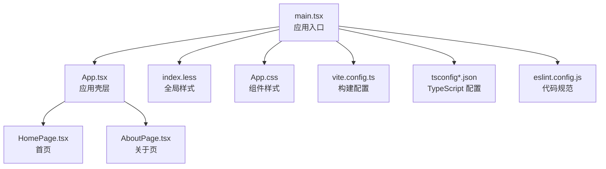
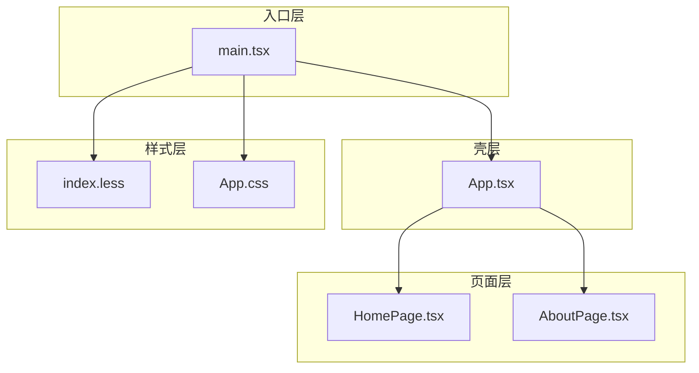
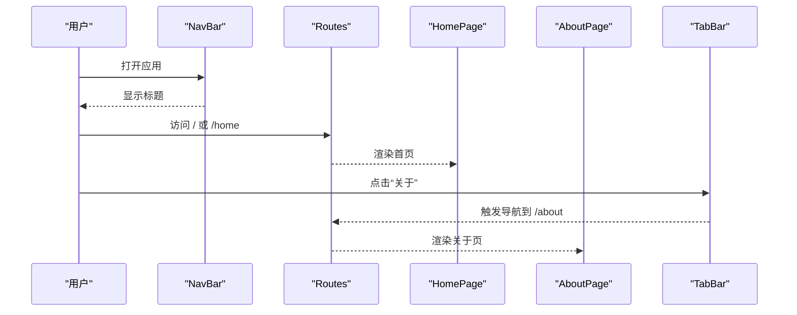
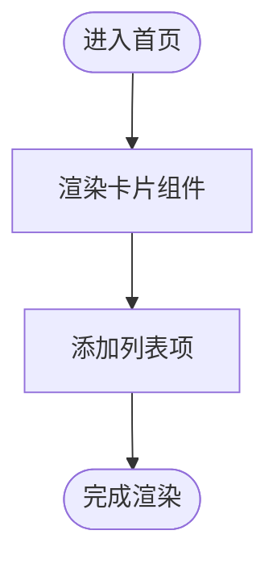
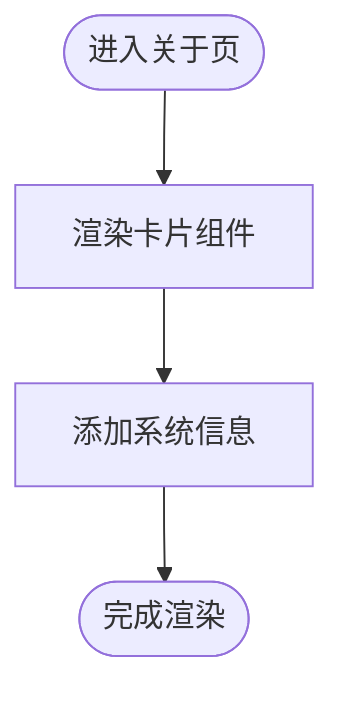
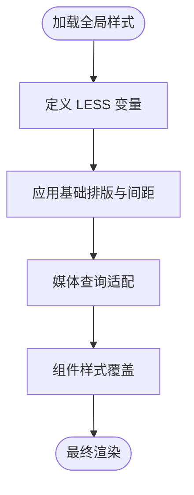
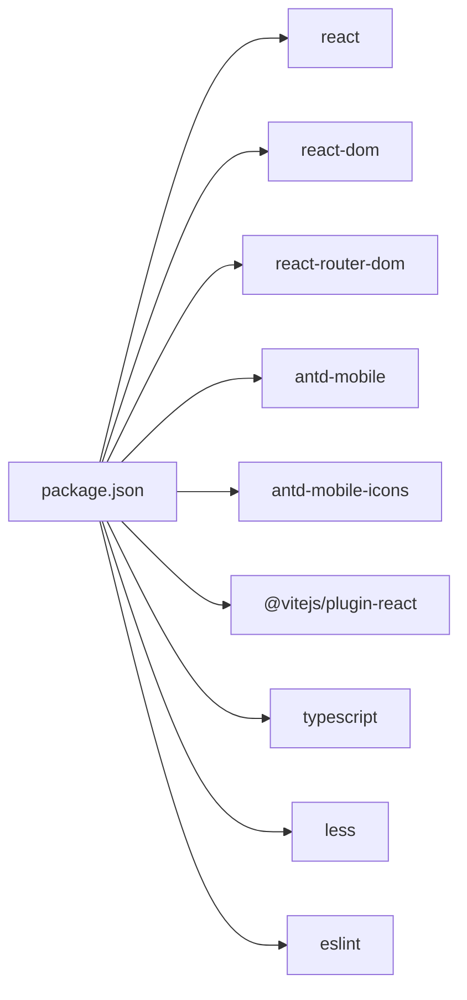

# React 前端应用

<cite>
**本文引用的文件**
- [package.json](file://project/web/package.json)
- [vite.config.ts](file://project/web/vite.config.ts)
- [tsconfig.json](file://project/web/tsconfig.json)
- [tsconfig.app.json](file://project/web/tsconfig.app.json)
- [tsconfig.node.json](file://project/web/tsconfig.node.json)
- [eslint.config.js](file://project/web/eslint.config.js)
- [main.tsx](file://project/web/src/main.tsx)
- [App.tsx](file://project/web/src/App.tsx)
- [HomePage.tsx](file://project/web/src/pages/HomePage.tsx)
- [AboutPage.tsx](file://project/web/src/pages/AboutPage.tsx)
- [index.less](file://project/web/src/index.less)
- [App.css](file://project/web/src/App.css)
</cite>

## 目录
1. [简介](#简介)
2. [项目结构](#项目结构)
3. [核心组件](#核心组件)
4. [架构总览](#架构总览)
5. [详细组件分析](#详细组件分析)
6. [依赖关系分析](#依赖关系分析)
7. [性能考虑](#性能考虑)
8. [故障排查指南](#故障排查指南)
9. [结论](#结论)
10. [附录](#附录)

## 简介
本项目是一个基于 React 的前端应用，采用现代工具链与移动端优先的设计理念。应用通过 React Router 实现多页面路由，Ant Design Mobile 提供移动端 UI 组件库，Vite 作为构建与开发服务器，TypeScript 提供类型安全，ESLint 保障代码质量。整体架构简洁清晰，适合在移动端场景下快速迭代与扩展。

## 项目结构
前端工程位于 project/web 目录，采用按功能模块划分的组织方式：
- 根级配置：Vite、TypeScript、ESLint 配置文件集中管理
- 入口文件：main.tsx 负责挂载根组件与全局样式
- 应用壳层：App.tsx 定义导航栏与底部标签页，并承载路由
- 页面组件：HomePage.tsx 与 AboutPage.tsx 分别对应首页与关于页
- 样式系统：index.less 提供全局样式与变量，App.css 包含部分组件样式

图表来源
- [main.tsx:1-15](file://project/web/src/main.tsx#L1-L15)
- [App.tsx:1-38](file://project/web/src/App.tsx#L1-L38)
- [HomePage.tsx:1-15](file://project/web/src/pages/HomePage.tsx#L1-L15)
- [AboutPage.tsx:1-13](file://project/web/src/pages/AboutPage.tsx#L1-L13)
- [index.less:1-55](file://project/web/src/index.less#L1-L55)
- [App.css:1-185](file://project/web/src/App.css#L1-L185)
- [vite.config.ts:1-8](file://project/web/vite.config.ts#L1-L8)
- [tsconfig.json:1-8](file://project/web/tsconfig.json#L1-L8)
- [eslint.config.js:1-24](file://project/web/eslint.config.js#L1-L24)

章节来源
- [main.tsx:1-15](file://project/web/src/main.tsx#L1-L15)
- [App.tsx:1-38](file://project/web/src/App.tsx#L1-L38)
- [package.json:1-34](file://project/web/package.json#L1-L34)

## 核心组件
- 应用壳层 AppShell：负责顶部导航栏、主内容区与底部标签页的布局；通过 useLocation/useNavigate 管理当前路径与跳转
- 首页 HomePage：展示实时监控卡片与告警事件列表
- 关于页 AboutPage：展示系统信息与技术栈说明
- 全局入口 main.tsx：启用严格模式、引入全局样式与路由容器，渲染根组件

章节来源
- [App.tsx:7-33](file://project/web/src/App.tsx#L7-L33)
- [HomePage.tsx:3-14](file://project/web/src/pages/HomePage.tsx#L3-L14)
- [AboutPage.tsx:3-12](file://project/web/src/pages/AboutPage.tsx#L3-L12)
- [main.tsx:8-14](file://project/web/src/main.tsx#L8-L14)

## 架构总览
应用采用“入口 -> 壳层 -> 页面”的分层架构：
- 入口层：main.tsx 引入路由与全局样式，挂载根组件
- 壳层：App.tsx 统一处理导航与路由切换
- 页面层：各页面组件按需渲染
- 样式层：LESS 变量与全局样式统一风格，CSS 用于局部组件样式

图表来源
- [main.tsx:1-15](file://project/web/src/main.tsx#L1-L15)
- [App.tsx:1-38](file://project/web/src/App.tsx#L1-L38)
- [HomePage.tsx:1-15](file://project/web/src/pages/HomePage.tsx#L1-L15)
- [AboutPage.tsx:1-13](file://project/web/src/pages/AboutPage.tsx#L1-L13)
- [index.less:1-55](file://project/web/src/index.less#L1-L55)
- [App.css:1-185](file://project/web/src/App.css#L1-L185)

## 详细组件分析

### 应用壳层（AppShell）与路由
- 导航栏：顶部 NavBar 显示标题
- 主内容区：Routes 定义 /home 与 /about 两个路由，未匹配时重定向到 /home
- 底部标签页：TabBar 与 useLocation/useNavigate 同步当前路径并触发跳转
- 图标：使用 antd-mobile-icons 中的图标组件

图表来源
- [App.tsx:16-32](file://project/web/src/App.tsx#L16-L32)

章节来源
- [App.tsx:1-38](file://project/web/src/App.tsx#L1-L38)

### 首页组件（HomePage）
- 使用 Card 与 List 组件展示“实时监控”与“告警事件”等信息
- 结构简单，便于扩展更多监控项或事件列表

图表来源
- [HomePage.tsx:3-14](file://project/web/src/pages/HomePage.tsx#L3-L14)

章节来源
- [HomePage.tsx:1-15](file://project/web/src/pages/HomePage.tsx#L1-L15)

### 关于页组件（AboutPage）
- 展示系统名称与技术栈信息
- 结构简洁，适合后续扩展版本信息、开发者信息等

图表来源
- [AboutPage.tsx:3-12](file://project/web/src/pages/AboutPage.tsx#L3-L12)

章节来源
- [AboutPage.tsx:1-13](file://project/web/src/pages/AboutPage.tsx#L1-L13)

### 样式系统与响应式设计
- 全局样式：index.less 定义背景色、字体、容器间距与基础排版，使用 LESS 变量统一管理
- 组件样式：App.css 使用 CSS 变量与媒体查询实现响应式布局
- 移动端优先：通过媒体查询在小屏设备上调整布局与间距

图表来源
- [index.less:1-55](file://project/web/src/index.less#L1-L55)
- [App.css:1-185](file://project/web/src/App.css#L1-L185)

章节来源
- [index.less:1-55](file://project/web/src/index.less#L1-L55)
- [App.css:1-185](file://project/web/src/App.css#L1-L185)

### TypeScript 配置
- 多配置文件组织：tsconfig.json 作为根引用，分别指向 tsconfig.app.json 与 tsconfig.node.json
- 应用配置（tsconfig.app.json）：目标环境 ES2023、JSX 使用 react-jsx、bundler 模式解析、严格无 emit
- Node 配置（tsconfig.node.json）：仅用于 Vite 配置文件的类型检查

章节来源
- [tsconfig.json:1-8](file://project/web/tsconfig.json#L1-L8)
- [tsconfig.app.json:1-26](file://project/web/tsconfig.app.json#L1-L26)
- [tsconfig.node.json:1-25](file://project/web/tsconfig.node.json#L1-L25)

### Vite 构建配置
- 插件：使用 @vitejs/plugin-react 进行 React JSX 转换与开发体验优化
- 开发脚本：dev 启动本地开发服务器
- 构建脚本：先执行 tsc -b 再进行打包，确保类型检查与构建一致性

章节来源
- [vite.config.ts:1-8](file://project/web/vite.config.ts#L1-L8)
- [package.json:6-11](file://project/web/package.json#L6-L11)

### ESLint 配置
- 推荐规则：继承 @eslint/js、typescript-eslint、react-hooks、react-refresh
- 语言选项：浏览器环境、ECMAScript 2020
- 文件范围：对 .ts 与 .tsx 文件生效

章节来源
- [eslint.config.js:1-24](file://project/web/eslint.config.js#L1-L24)

## 依赖关系分析
- 运行时依赖：react、react-dom、react-router-dom、antd-mobile、antd-mobile-icons
- 开发依赖：@vitejs/plugin-react、typescript、less、eslint 及相关插件

图表来源
- [package.json:12-32](file://project/web/package.json#L12-L32)

章节来源
- [package.json:1-34](file://project/web/package.json#L1-L34)

## 性能考虑
- 构建阶段：Vite 以原生 ESM 与按需编译提供快速冷启动与热更新
- 类型检查：通过 tsc -b 在构建前进行类型校验，避免运行时错误
- 样式体积：LESS 变量集中管理，减少重复定义；CSS 使用媒体查询按需适配
- 组件拆分：页面组件保持单一职责，利于后续懒加载与分割包

## 故障排查指南
- 路由不生效：确认 BrowserRouter 已包裹根组件，且路由路径与 TabBar.activeKey 对齐
- 样式异常：检查 index.less 是否正确引入，LESS 变量是否被正确解析
- 类型错误：执行 tsc -b 或使用 IDE 的类型检查功能定位问题
- ESLint 报错：根据 eslint.config.js 的规则修正代码风格或禁用特定规则（谨慎使用）

章节来源
- [main.tsx:8-14](file://project/web/src/main.tsx#L8-L14)
- [App.tsx:16-32](file://project/web/src/App.tsx#L16-L32)
- [index.less:1-55](file://project/web/src/index.less#L1-L55)
- [eslint.config.js:8-23](file://project/web/eslint.config.js#L8-L23)

## 结论
该 React 前端应用采用现代化工具链与清晰的分层架构，具备良好的可维护性与扩展性。通过 Ant Design Mobile 的移动端组件与 Vite 的高效构建，能够快速迭代并稳定交付。建议后续在现有基础上增加状态管理、国际化与测试体系，进一步完善工程化能力。

## 附录
- 组件使用示例（路径参考）
  - 首页组件：[HomePage.tsx:3-14](file://project/web/src/pages/HomePage.tsx#L3-L14)
  - 关于页组件：[AboutPage.tsx:3-12](file://project/web/src/pages/AboutPage.tsx#L3-L12)
  - 应用壳层与路由：[App.tsx:7-33](file://project/web/src/App.tsx#L7-L33)
- 样式与主题
  - 全局样式与变量：[index.less:1-55](file://project/web/src/index.less#L1-L55)
  - 组件样式与响应式：[App.css:1-185](file://project/web/src/App.css#L1-L185)
- TypeScript 与构建
  - 根配置：[tsconfig.json:1-8](file://project/web/tsconfig.json#L1-L8)
  - 应用配置：[tsconfig.app.json:1-26](file://project/web/tsconfig.app.json#L1-L26)
  - Node 配置：[tsconfig.node.json:1-25](file://project/web/tsconfig.node.json#L1-L25)
  - Vite 配置：[vite.config.ts:1-8](file://project/web/vite.config.ts#L1-L8)
  - ESLint 配置：[eslint.config.js:1-24](file://project/web/eslint.config.js#L1-L24)