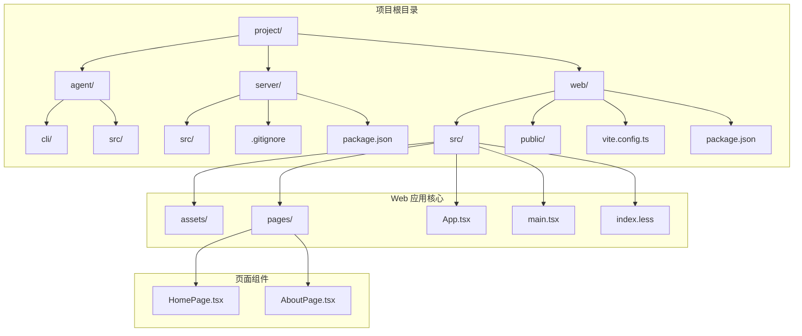
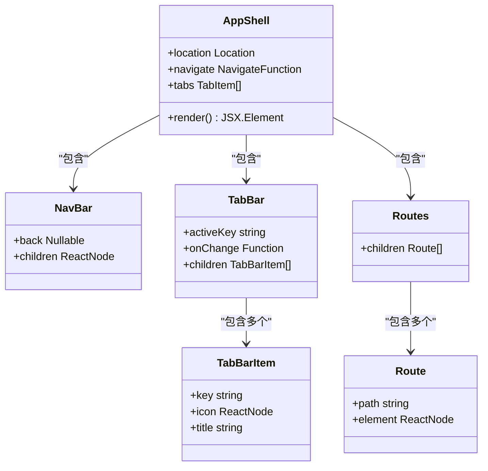
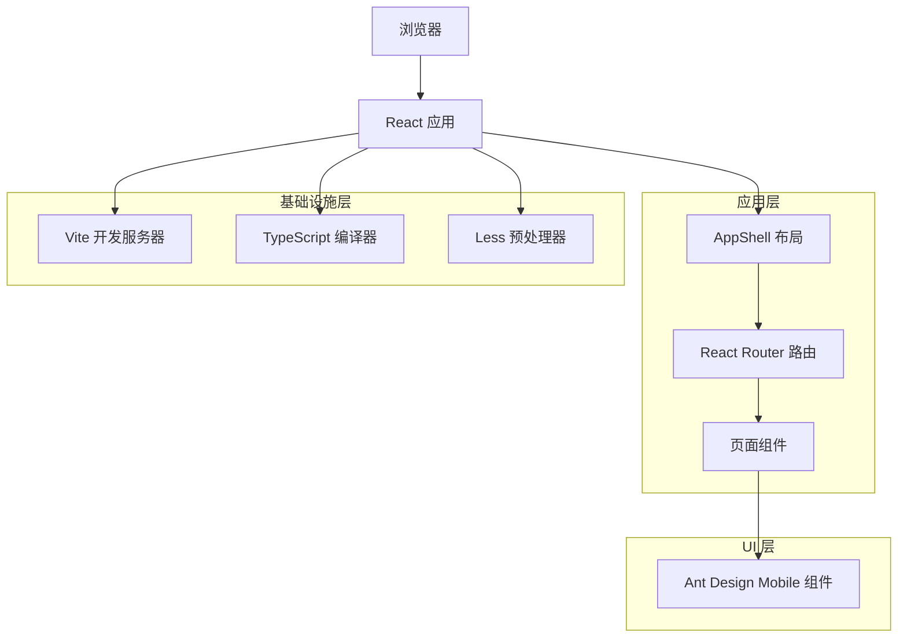
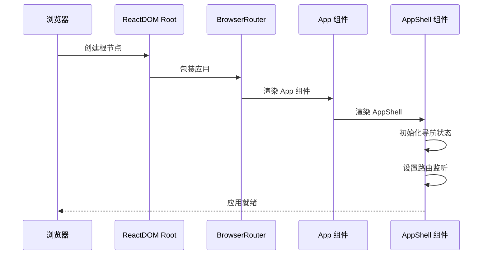
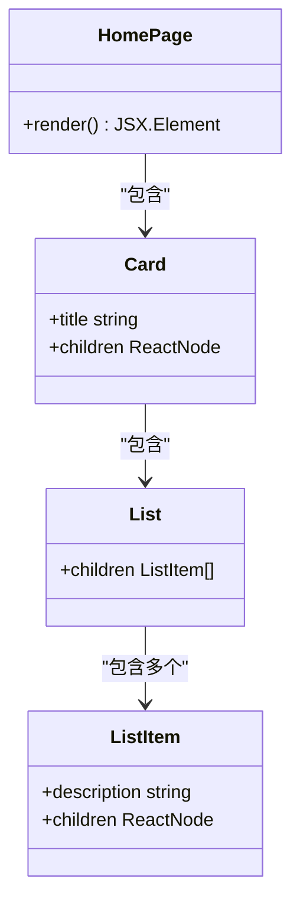
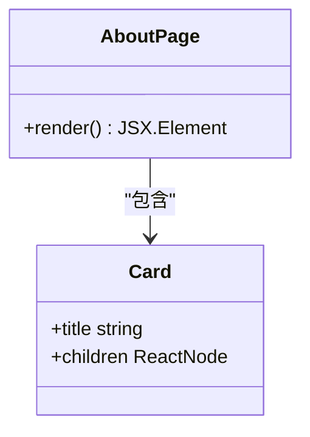
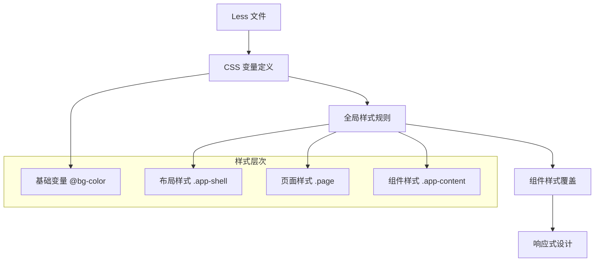
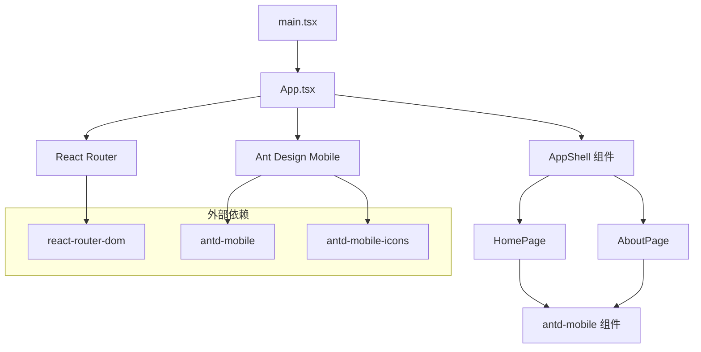
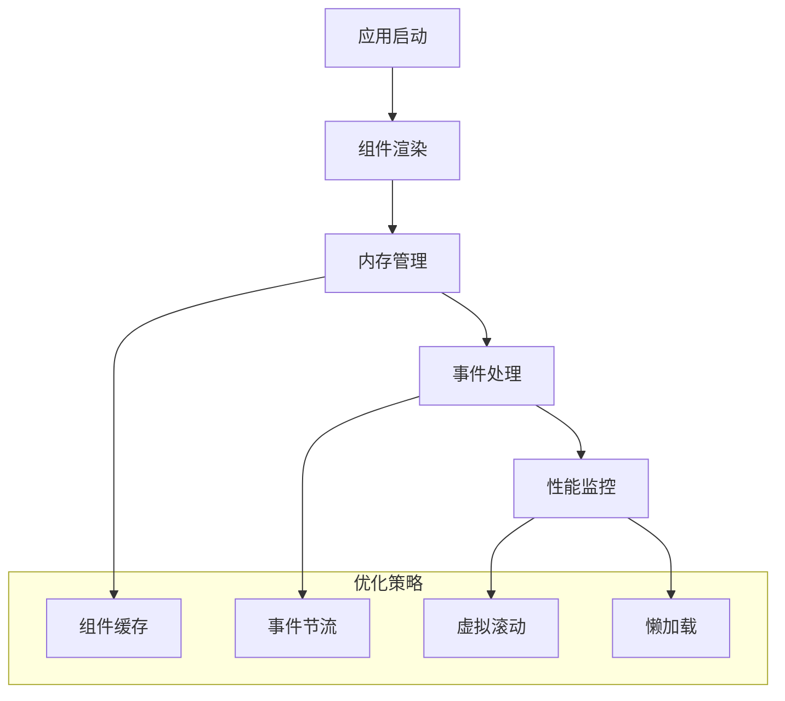

# 应用架构设计

<cite>
**本文档引用的文件**
- [App.tsx](file://project/web/src/App.tsx)
- [main.tsx](file://project/web/src/main.tsx)
- [HomePage.tsx](file://project/web/src/pages/HomePage.tsx)
- [AboutPage.tsx](file://project/web/src/pages/AboutPage.tsx)
- [index.less](file://project/web/src/index.less)
- [package.json](file://project/web/package.json)
- [vite.config.ts](file://project/web/vite.config.ts)
- [tsconfig.app.json](file://project/web/tsconfig.app.json)
</cite>

## 目录
1. [简介](#简介)
2. [项目结构](#项目结构)
3. [核心组件](#核心组件)
4. [架构概览](#架构概览)
5. [详细组件分析](#详细组件分析)
6. [依赖关系分析](#依赖关系分析)
7. [性能考虑](#性能考虑)
8. [故障排除指南](#故障排除指南)
9. [结论](#结论)

## 简介

本项目是一个基于 React 19 和 Ant Design Mobile 5 的移动端 Web 应用，采用现代化的前端技术栈构建。应用采用了简洁而高效的架构设计，通过 AppShell 组件实现了统一的布局结构，结合 React Router 7 实现了灵活的路由管理，并通过 Vite 8 提供了快速的开发体验。

该应用主要服务于 Pi-Guard 边缘计算设备的 Web 管理界面，提供了实时监控和系统信息展示的核心功能。整体架构设计注重移动端适配、组件复用性和可维护性。

## 项目结构

项目采用清晰的分层组织结构，主要包含以下核心目录：



**图表来源**
- [main.tsx:1-15](file://project/web/src/main.tsx#L1-L15)
- [App.tsx:1-38](file://project/web/src/App.tsx#L1-L38)

**章节来源**
- [main.tsx:1-15](file://project/web/src/main.tsx#L1-L15)
- [package.json:1-34](file://project/web/package.json#L1-L34)

## 核心组件

### AppShell 组件架构

AppShell 是整个应用的核心布局组件，采用了 Ant Design Mobile 的 NavBar 和 TabBar 组件来实现统一的移动端界面设计。



**图表来源**
- [App.tsx:7-33](file://project/web/src/App.tsx#L7-L33)

AppShell 组件的设计理念体现了以下特点：

1. **响应式布局**：使用 Flexbox 实现垂直布局，确保在不同屏幕尺寸下的良好表现
2. **状态管理**：通过 React Hooks 管理当前活动标签和导航状态
3. **路由集成**：与 React Router 无缝集成，实现页面切换和导航控制
4. **组件复用**：将导航逻辑抽象化，便于后续扩展和维护

**章节来源**
- [App.tsx:7-33](file://project/web/src/App.tsx#L7-L33)

## 架构概览

应用采用分层架构设计，从底层到顶层的结构如下：



**图表来源**
- [main.tsx:8-14](file://project/web/src/main.tsx#L8-L14)
- [App.tsx:16-32](file://project/web/src/App.tsx#L16-L32)

### 启动流程

应用的启动流程遵循标准的 React 应用初始化过程：



**图表来源**
- [main.tsx:8-14](file://project/web/src/main.tsx#L8-L14)
- [App.tsx:7-33](file://project/web/src/App.tsx#L7-L33)

**章节来源**
- [main.tsx:8-14](file://project/web/src/main.tsx#L8-L14)

## 详细组件分析

### 页面组件设计

应用包含两个主要页面组件，每个都采用了 Ant Design Mobile 的卡片和列表组件来提供一致的用户体验。

#### 主页组件 (HomePage)

HomePage 组件专注于展示实时监控功能，采用了卡片和列表组件来组织内容：



**图表来源**
- [HomePage.tsx:3-14](file://project/web/src/pages/HomePage.tsx#L3-L14)

#### 关于页面组件 (AboutPage)

AboutPage 组件用于展示系统信息，结构相对简单但同样遵循了 Ant Design Mobile 的设计规范：



**图表来源**
- [AboutPage.tsx:3-12](file://project/web/src/pages/AboutPage.tsx#L3-L12)

**章节来源**
- [HomePage.tsx:3-14](file://project/web/src/pages/HomePage.tsx#L3-L14)
- [AboutPage.tsx:3-12](file://project/web/src/pages/AboutPage.tsx#L3-L12)

### 样式系统

应用采用了 Less 预处理器和 CSS 变量来实现主题定制和样式管理：



**图表来源**
- [index.less:1-55](file://project/web/src/index.less#L1-L55)

**章节来源**
- [index.less:1-55](file://project/web/src/index.less#L1-L55)

## 依赖关系分析

### 技术栈依赖

应用的技术栈选择体现了现代前端开发的最佳实践：

```mermaid
graph LR
subgraph "运行时依赖"
A[react ^19.2.5]
B[react-dom ^19.2.5]
C[react-router-dom ^7.14.2]
D[antd-mobile ^5.42.3]
end
subgraph "开发时依赖"
E[@vitejs/plugin-react ^6.0.1]
F[typescript ~6.0.2]
G[less ^4.6.4]
H[eslint ^9.39.4]
end
subgraph "构建工具"
I[Vite 8]
J[TypeScript 编译器]
K[Less 预处理器]
end
A --> I
C --> I
D --> I
E --> I
F --> J
G --> K
```

**图表来源**
- [package.json:12-32](file://project/web/package.json#L12-L32)

### 组件依赖关系

应用中各组件之间的依赖关系清晰明确：



**图表来源**
- [main.tsx:1-6](file://project/web/src/main.tsx#L1-L6)
- [App.tsx:1-5](file://project/web/src/App.tsx#L1-L5)

**章节来源**
- [package.json:12-32](file://project/web/package.json#L12-L32)

## 性能考虑

### 构建优化

应用采用了多种性能优化策略：

1. **按需加载**：Ant Design Mobile 支持按需导入，减少打包体积
2. **Tree Shaking**：通过 ES6 模块系统实现无用代码消除
3. **代码分割**：React Router 的懒加载能力支持页面级别的代码分割

### 运行时优化



### 最佳实践建议

1. **组件拆分**：保持组件职责单一，便于测试和维护
2. **状态提升**：将共享状态提升到合适的层级
3. **错误边界**：为关键组件添加错误边界处理
4. **性能监控**：定期监控应用性能指标

## 故障排除指南

### 常见问题诊断

1. **路由不生效**：检查 BrowserRouter 是否正确包装应用
2. **样式不显示**：确认 Less 文件是否正确导入
3. **组件图标缺失**：验证 antd-mobile-icons 是否正确安装
4. **构建失败**：检查 TypeScript 配置和依赖版本兼容性

### 调试技巧

1. **React DevTools**：使用开发者工具检查组件树和状态
2. **网络面板**：监控资源加载和 API 请求
3. **控制台日志**：添加必要的调试信息
4. **性能面板**：分析应用性能瓶颈

**章节来源**
- [main.tsx:3](file://project/web/src/main.tsx#L3)
- [App.tsx:1](file://project/web/src/App.tsx#L1)

## 结论

本项目展示了现代 React 应用架构的最佳实践，通过合理的组件设计、清晰的路由配置和有效的样式管理，构建了一个功能完整且具有良好扩展性的移动端 Web 应用。

### 主要优势

1. **架构清晰**：AppShell 模式提供了统一的布局解决方案
2. **技术先进**：采用最新的 React 19 和 Ant Design Mobile 5
3. **开发友好**：Vite 提供了快速的开发体验
4. **移动端优化**：专门针对移动设备进行了界面优化

### 扩展建议

1. **状态管理**：可以考虑引入 Zustand 或 Redux Toolkit 来管理复杂状态
2. **国际化**：添加多语言支持以服务更广泛的用户群体
3. **测试覆盖**：增加单元测试和集成测试以提高代码质量
4. **性能监控**：集成性能监控工具以持续优化用户体验

该架构设计为未来的功能扩展奠定了良好的基础，同时保持了代码的可维护性和可读性。