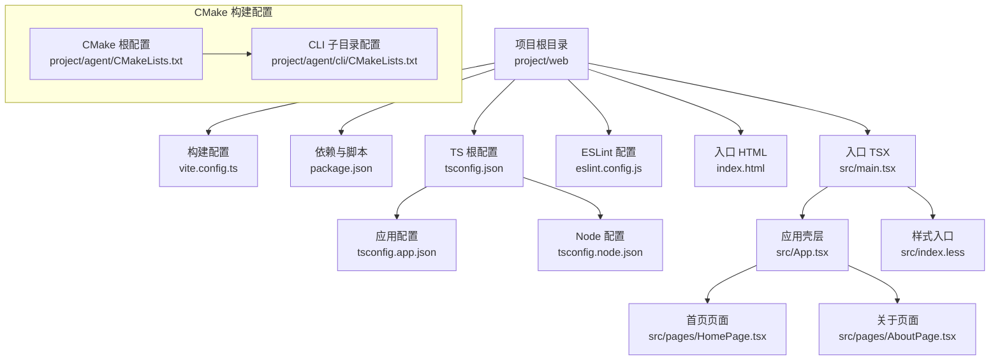
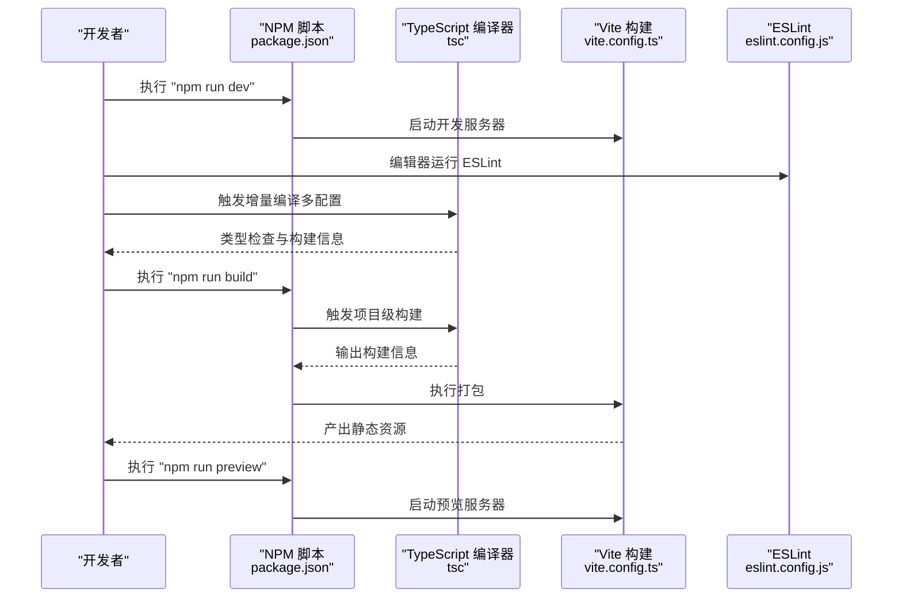
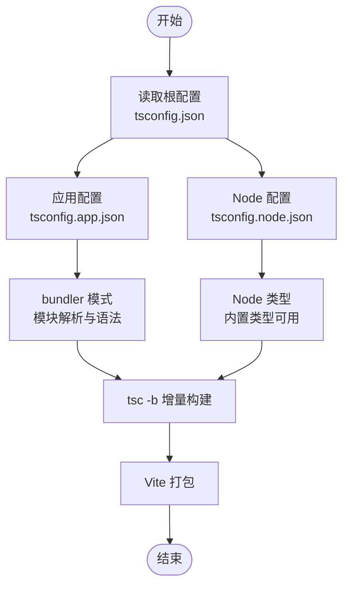
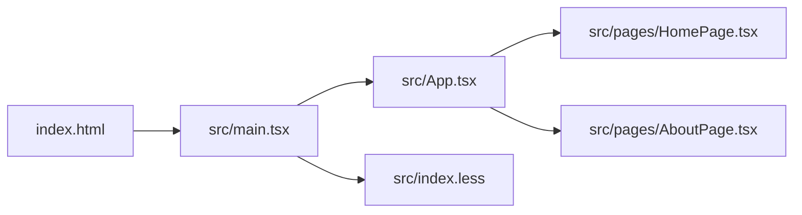
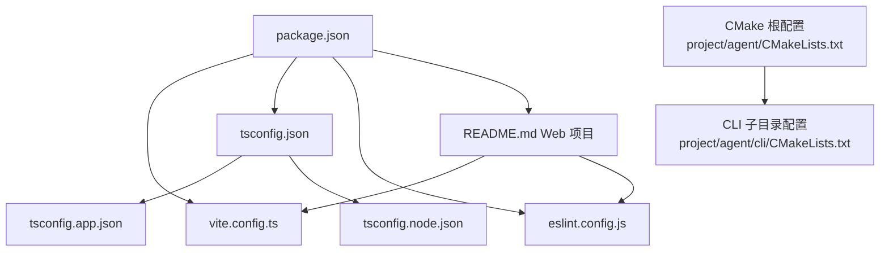

# 构建与配置管理

<cite>
**本文档引用的文件**
- [vite.config.ts](file://project/web/vite.config.ts)
- [package.json](file://project/web/package.json)
- [tsconfig.json](file://project/web/tsconfig.json)
- [tsconfig.app.json](file://project/web/tsconfig.app.json)
- [tsconfig.node.json](file://project/web/tsconfig.node.json)
- [eslint.config.js](file://project/web/eslint.config.js)
- [index.html](file://project/web/index.html)
- [main.tsx](file://project/web/src/main.tsx)
- [App.tsx](file://project/web/src/App.tsx)
- [index.less](file://project/web/src/index.less)
- [HomePage.tsx](file://project/web/src/pages/HomePage.tsx)
- [AboutPage.tsx](file://project/web/src/pages/AboutPage.tsx)
- [README.md（Web 项目）](file://project/web/README.md)
- [README.md（根项目）](file://README.md)
- [CMakeLists.txt](file://project/agent/CMakeLists.txt)
- [CMakeLists.txt（CLI）](file://project/agent/cli/CMakeLists.txt)
</cite>

## 目录
1. [简介](#简介)
2. [项目结构](#项目结构)
3. [核心组件](#核心组件)
4. [架构总览](#架构总览)
5. [详细组件分析](#详细组件分析)
6. [依赖关系分析](#依赖关系分析)
7. [性能考量](#性能考量)
8. [故障排查指南](#故障排查指南)
9. [结论](#结论)
10. [附录](#附录)

## 简介
本文件聚焦于前端工程（pi-guard-web）的构建与配置管理，围绕 Vite 构建工具、TypeScript 编译配置、ESLint 代码质量保障、依赖与脚本命令、开发与生产优化、部署与最佳实践展开，帮助开发者快速理解并高效维护前端构建体系。同时，文档也涵盖了与前端构建相关的 CMake 构建配置，确保前后端构建流程的一致性和完整性。

## 项目结构
前端工程位于 project/web，采用 React + TypeScript + Vite 技术栈，核心文件包括：
- 构建配置：vite.config.ts
- 依赖与脚本：package.json
- TypeScript 多配置文件：tsconfig.json、tsconfig.app.json、tsconfig.node.json
- 代码质量：eslint.config.js
- 入口与页面：index.html、src/main.tsx、src/App.tsx、src/pages/*.tsx
- 样式：src/index.less

此外，项目还包含 CMake 构建配置文件，用于后端 C++ 代理程序的构建管理。

**图表来源**
- [vite.config.ts](file://project/web/vite.config.ts)
- [package.json](file://project/web/package.json)
- [tsconfig.json](file://project/web/tsconfig.json)
- [tsconfig.app.json](file://project/web/tsconfig.app.json)
- [tsconfig.node.json](file://project/web/tsconfig.node.json)
- [eslint.config.js](file://project/web/eslint.config.js)
- [index.html](file://project/web/index.html)
- [main.tsx](file://project/web/src/main.tsx)
- [App.tsx](file://project/web/src/App.tsx)
- [HomePage.tsx](file://project/web/src/pages/HomePage.tsx)
- [AboutPage.tsx](file://project/web/src/pages/AboutPage.tsx)
- [index.less](file://project/web/src/index.less)
- [CMakeLists.txt](file://project/agent/CMakeLists.txt)
- [CMakeLists.txt（CLI）](file://project/agent/cli/CMakeLists.txt)

**章节来源**
- [vite.config.ts](file://project/web/vite.config.ts)
- [package.json](file://project/web/package.json)
- [tsconfig.json](file://project/web/tsconfig.json)
- [tsconfig.app.json](file://project/web/tsconfig.app.json)
- [tsconfig.node.json](file://project/web/tsconfig.node.json)
- [eslint.config.js](file://project/web/eslint.config.js)
- [index.html](file://project/web/index.html)
- [main.tsx](file://project/web/src/main.tsx)
- [App.tsx](file://project/web/src/App.tsx)
- [index.less](file://project/web/src/index.less)
- [CMakeLists.txt](file://project/agent/CMakeLists.txt)
- [CMakeLists.txt（CLI）](file://project/agent/cli/CMakeLists.txt)

## 核心组件
- Vite 构建配置：启用 React 插件，提供开发服务器与打包能力。
- TypeScript 多配置：应用侧与 Node 侧分离，确保 bundler 模式与类型检查一致性。
- ESLint 配置：基于 Flat Config，集成 ts+react+hooks+refresh 规则集，覆盖浏览器全局。
- 依赖与脚本：统一管理运行时与开发时依赖，提供 dev/build/lint/preview 四大脚本。
- 入口与路由：index.html 引入入口脚本；main.tsx 渲染根节点；App.tsx 提供路由与底部导航。
- CMake 构建配置：管理后端 C++ 代理程序的构建流程，包含模块化子目录组织和测试配置。

**章节来源**
- [vite.config.ts](file://project/web/vite.config.ts)
- [tsconfig.app.json](file://project/web/tsconfig.app.json)
- [tsconfig.node.json](file://project/web/tsconfig.node.json)
- [eslint.config.js](file://project/web/eslint.config.js)
- [package.json](file://project/web/package.json)
- [index.html](file://project/web/index.html)
- [main.tsx](file://project/web/src/main.tsx)
- [App.tsx](file://project/web/src/App.tsx)
- [CMakeLists.txt](file://project/agent/CMakeLists.txt)

## 架构总览
下图展示了从开发到生产的典型流程：开发脚本启动 Vite 开发服务器，TypeScript 编译器参与增量构建，ESLint 提供编辑期质量保障，最终产物由 Vite 打包并可预览。

**图表来源**
- [package.json](file://project/web/package.json)
- [vite.config.ts](file://project/web/vite.config.ts)
- [tsconfig.json](file://project/web/tsconfig.json)
- [eslint.config.js](file://project/web/eslint.config.js)

**章节来源**
- [package.json](file://project/web/package.json)
- [vite.config.ts](file://project/web/vite.config.ts)
- [tsconfig.json](file://project/web/tsconfig.json)
- [eslint.config.js](file://project/web/eslint.config.js)

## 详细组件分析

### Vite 构建配置与优化
- 插件体系：启用 React 插件，结合 Oxc/SWC 等高性能解析器，提升开发体验与构建速度。
- 开发服务器：默认行为满足 HMR 与本地调试需求；可通过扩展配置实现代理、HTTPS、端口定制等。
- 构建输出：默认输出至 dist，遵循现代浏览器目标；可结合压缩、资源指纹、产物分析等进行优化。
- 性能优化建议：
  - 代码分割：利用动态导入与路由级懒加载，拆分首屏与非关键路径。
  - 资源优化：开启压缩与资源内联策略，合理配置 externals 与预构建依赖。
  - 缓存策略：利用浏览器缓存与长效缓存命名，降低重复下载成本。
  - 分析与可视化：使用插件输出产物分析报告，定位体积瓶颈。

**章节来源**
- [vite.config.ts](file://project/web/vite.config.ts)
- [package.json](file://project/web/package.json)
- [README.md（Web 项目）](file://project/web/README.md)

### TypeScript 配置与编译策略
- 多配置组织：
  - tsconfig.json 作为根配置，references 引用应用与 Node 两套配置。
  - tsconfig.app.json：应用侧配置，bundler 模式、ES2023 目标、React JSX、严格未使用检测。
  - tsconfig.node.json：Node 侧配置，bundler 模式、ES2023 目标、Node 类型、严格未使用检测。
- 编译选项要点：
  - bundler 模式与 verbatimModuleSyntax：确保与 Vite 打包器兼容。
  - noEmit 与 tsBuildInfoFile：仅生成构建信息，实际打包由 Vite/TSC 双轨协作。
  - skipLibCheck：加速类型检查。
  - 严格 Linting 选项：未使用局部变量/参数、switch 穷举等，提升代码质量。
- 与构建脚本联动：
  - npm run build：先执行 tsc -b 进行项目级增量构建，再由 Vite 执行打包，确保类型安全与产物一致。

**图表来源**
- [tsconfig.json](file://project/web/tsconfig.json)
- [tsconfig.app.json](file://project/web/tsconfig.app.json)
- [tsconfig.node.json](file://project/web/tsconfig.node.json)
- [package.json](file://project/web/package.json)

**章节来源**
- [tsconfig.json](file://project/web/tsconfig.json)
- [tsconfig.app.json](file://project/web/tsconfig.app.json)
- [tsconfig.node.json](file://project/web/tsconfig.node.json)
- [package.json](file://project/web/package.json)

### ESLint 配置与代码质量保障
- 配置结构：Flat Config，集中管理全局忽略与语言选项。
- 规则集扩展：
  - 基础推荐：@eslint/js.recommended
  - TypeScript 推荐：typescript-eslint.recommended
  - React Hooks 推荐：eslint-plugin-react-hooks
  - Vite 环境：eslint-plugin-react-refresh（Vite 场景）
- 语言选项：ECMAScript 2020，浏览器全局。
- 与编辑器联动：在保存或编辑时自动执行，结合 tsserver 获取类型感知规则，提升诊断准确性。

**章节来源**
- [eslint.config.js](file://project/web/eslint.config.js)
- [package.json](file://project/web/package.json)
- [README.md（Web 项目）](file://project/web/README.md)

### 依赖管理与脚本命令
- 运行时依赖：React 生态、Ant Design Mobile、路由等。
- 开发时依赖：Vite、React 插件、TypeScript、ESLint 及其插件、Less、类型定义等。
- 脚本命令：
  - dev：启动 Vite 开发服务器，支持 HMR。
  - build：先 tsc -b 进行项目级构建，再由 Vite 执行打包。
  - lint：执行 ESLint 检查。
  - preview：启动本地预览服务器，验证生产构建效果。
- 版本策略：锁定关键依赖版本，确保团队与 CI 环境一致性。

**章节来源**
- [package.json](file://project/web/package.json)

### 入口与页面结构
- 入口 HTML：定义基础 meta、图标与挂载点，引入入口脚本。
- 入口 TSX：创建根容器，注入路由与主题样式，渲染应用。
- 应用壳层：提供顶部导航与底部标签栏，承载路由视图。
- 页面组件：首页与关于页，分别承载业务卡片与系统信息展示。

**图表来源**
- [index.html](file://project/web/index.html)
- [main.tsx](file://project/web/src/main.tsx)
- [App.tsx](file://project/web/src/App.tsx)
- [HomePage.tsx](file://project/web/src/pages/HomePage.tsx)
- [AboutPage.tsx](file://project/web/src/pages/AboutPage.tsx)
- [index.less](file://project/web/src/index.less)

**章节来源**
- [index.html](file://project/web/index.html)
- [main.tsx](file://project/web/src/main.tsx)
- [App.tsx](file://project/web/src/App.tsx)
- [HomePage.tsx](file://project/web/src/pages/HomePage.tsx)
- [AboutPage.tsx](file://project/web/src/pages/AboutPage.tsx)
- [index.less](file://project/web/src/index.less)

### CMake 构建配置管理
- 项目配置：CMake 最低版本要求 3.16，C++17 标准，禁用扩展。
- 模块化组织：通过 add_subdirectory 将各个功能模块（采集、处理、输出、基础设施）独立管理。
- 测试配置：条件编译支持，根据 BUILD_TESTING 变量控制测试模块的构建。
- 安装配置：定义可执行文件安装路径，支持系统集成部署。

**章节来源**
- [CMakeLists.txt](file://project/agent/CMakeLists.txt)
- [CMakeLists.txt（CLI）](file://project/agent/cli/CMakeLists.txt)

## 依赖关系分析
- 构建链路：package.json 的 dev/build/lint/preview 脚本串联 Vite、TypeScript 与 ESLint。
- 类型链路：tsconfig.json 引用 tsconfig.app.json 与 tsconfig.node.json，确保应用与 Node 环境类型一致。
- 质量链路：eslint.config.js 与编辑器协同，提供类型感知与 React 规则校验。
- CMake 链路：根 CMakeLists.txt 管理子目录构建，CLI 子目录进一步细分具体功能模块。

**图表来源**
- [package.json](file://project/web/package.json)
- [tsconfig.json](file://project/web/tsconfig.json)
- [tsconfig.app.json](file://project/web/tsconfig.app.json)
- [tsconfig.node.json](file://project/web/tsconfig.node.json)
- [eslint.config.js](file://project/web/eslint.config.js)
- [README.md（Web 项目）](file://project/web/README.md)
- [CMakeLists.txt](file://project/agent/CMakeLists.txt)
- [CMakeLists.txt（CLI）](file://project/agent/cli/CMakeLists.txt)

**章节来源**
- [package.json](file://project/web/package.json)
- [tsconfig.json](file://project/web/tsconfig.json)
- [eslint.config.js](file://project/web/eslint.config.js)
- [README.md（Web 项目）](file://project/web/README.md)
- [CMakeLists.txt](file://project/agent/CMakeLists.txt)
- [CMakeLists.txt（CLI）](file://project/agent/cli/CMakeLists.txt)

## 性能考量
- 开发体验
  - HMR：Vite 默认启用，配合 React 插件提升热更新效率。
  - 类型检查：tsc -b 增量构建，避免每次全量编译。
  - ESLint：在编辑器中即时反馈，减少构建期负担。
- 生产优化
  - 代码分割：按路由与功能模块拆分，结合动态导入降低首屏体积。
  - 资源优化：启用压缩、Tree Shaking、资源指纹与 CDN 友好命名。
  - 预加载策略：关键资源预加载，非关键资源懒加载。
- 工程化
  - 多配置隔离：应用与 Node 配置分离，避免类型与模块解析冲突。
  - 严格 Lint：通过未使用检测与穷举检查，减少冗余与潜在错误。
- CMake 优化
  - 条件编译：根据构建类型启用相应功能，减少不必要的编译开销。
  - 模块化：独立的模块构建，支持增量编译和并行构建。

## 故障排查指南
- 开发服务器无法启动
  - 检查端口占用与网络权限，确认 Vite 插件加载正常。
  - 参考：[vite.config.ts](file://project/web/vite.config.ts)
- 类型检查失败或不一致
  - 确认 tsconfig.json 的 references 是否正确指向应用与 Node 配置。
  - 参考：[tsconfig.json](file://project/web/tsconfig.json)
- ESLint 报错或规则缺失
  - 校验 flat config 的 extends 与语言选项，确保类型感知规则启用。
  - 参考：[eslint.config.js](file://project/web/eslint.config.js)
- 构建产物异常或体积过大
  - 检查动态导入与代码分割策略，启用压缩与资源指纹。
  - 参考：[package.json](file://project/web/package.json)
- 预览与生产不一致
  - 使用 npm run preview 对比生产构建，定位差异。
  - 参考：[package.json](file://project/web/package.json)
- CMake 构建失败
  - 检查 C++17 标准支持和依赖库安装，确认模块路径正确。
  - 参考：[CMakeLists.txt](file://project/agent/CMakeLists.txt)

**章节来源**
- [vite.config.ts](file://project/web/vite.config.ts)
- [tsconfig.json](file://project/web/tsconfig.json)
- [eslint.config.js](file://project/web/eslint.config.js)
- [package.json](file://project/web/package.json)
- [CMakeLists.txt](file://project/agent/CMakeLists.txt)

## 结论
本前端工程以 Vite 为核心，结合 TypeScript 多配置与 ESLint 平台化规则，形成高可靠、可维护的构建与质量保障体系。通过合理的开发与生产策略、严格的类型与规范约束，能够稳定支撑移动端 Web 端的实时监控与交互需求。同时，完善的 CMake 构建配置确保了后端 C++ 代理程序的模块化管理和可维护性，为整个系统的完整构建提供了坚实基础。

## 附录
- 术语对照
  - HMR：热模块替换
  - bundler 模式：与打包器兼容的模块解析策略
  - Flat Config：ESLint 新版配置格式
  - CMake：跨平台构建系统
- 相关文档
  - Web 项目说明：[README.md（Web 项目）](file://project/web/README.md)
  - 根项目概览：[README.md（根项目）](file://README.md)
  - CMake 构建指南：[CMake 官方文档](https://cmake.org/documentation/)