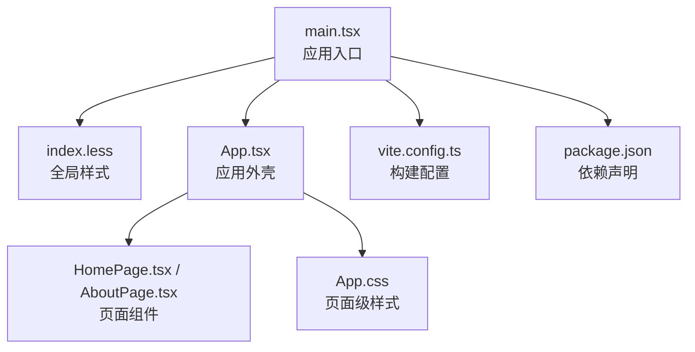
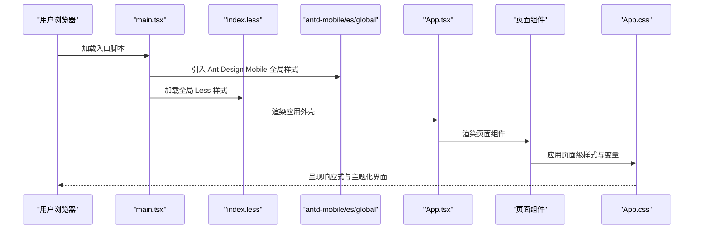
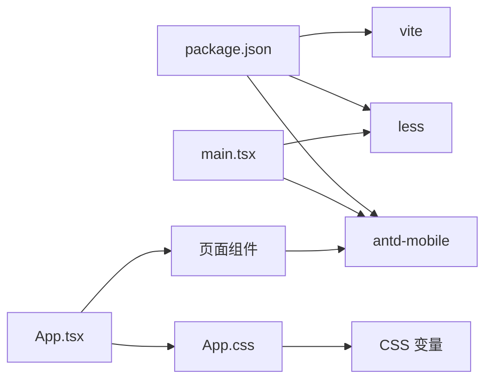

# 样式系统与主题

<cite>
**本文引用的文件**
- [项目 Web 入口 main.tsx](file://project/web/src/main.tsx)
- [Ant Design Mobile 全局样式导入](file://project/web/src/main.tsx)
- [应用外壳 App.tsx](file://project/web/src/App.tsx)
- [页面组件 HomePage.tsx](file://project/web/src/pages/HomePage.tsx)
- [页面组件 AboutPage.tsx](file://project/web/src/pages/AboutPage.tsx)
- [全局样式 index.less](file://project/web/src/index.less)
- [页面级样式 App.css](file://project/web/src/App.css)
- [Vite 配置 vite.config.ts](file://project/web/vite.config.ts)
- [Web 依赖 package.json](file://project/web/package.json)
</cite>

## 目录
1. [简介](#简介)
2. [项目结构](#项目结构)
3. [核心组件](#核心组件)
4. [架构总览](#架构总览)
5. [详细组件分析](#详细组件分析)
6. [依赖关系分析](#依赖关系分析)
7. [性能考量](#性能考量)
8. [故障排查指南](#故障排查指南)
9. [结论](#结论)
10. [附录](#附录)

## 简介
本文件面向“样式系统与主题”主题，聚焦于当前代码库中基于 Ant Design Mobile 的移动端前端样式体系。内容涵盖：
- 样式组织与加载顺序（全局样式、页面样式）
- Ant Design Mobile 主题定制路径与变量使用
- 响应式设计断点与媒体查询策略
- 样式命名规范、CSS 变量复用与最佳实践
- 移动端适配、暗色模式支持与浏览器兼容性建议

## 项目结构
前端位于 project/web，采用 Vite + React + TypeScript 技术栈，Ant Design Mobile 作为 UI 基础组件库。样式体系由两部分组成：
- 全局样式：通过 Less 定义基础排版、布局与通用变量
- 页面级样式：通过 CSS 变量与媒体查询实现主题化与响应式

图表来源
- [项目 Web 入口 main.tsx:1-15](file://project/web/src/main.tsx#L1-L15)
- [全局样式 index.less:1-55](file://project/web/src/index.less#L1-L55)
- [应用外壳 App.tsx:1-38](file://project/web/src/App.tsx#L1-L38)
- [页面组件 HomePage.tsx:1-15](file://project/web/src/pages/HomePage.tsx#L1-L15)
- [页面组件 AboutPage.tsx:1-13](file://project/web/src/pages/AboutPage.tsx#L1-L13)
- [页面级样式 App.css:1-185](file://project/web/src/App.css#L1-L185)
- [Vite 配置 vite.config.ts:1-8](file://project/web/vite.config.ts#L1-L8)
- [Web 依赖 package.json:1-34](file://project/web/package.json#L1-L34)

章节来源
- [项目 Web 入口 main.tsx:1-15](file://project/web/src/main.tsx#L1-L15)
- [全局样式 index.less:1-55](file://project/web/src/index.less#L1-L55)
- [应用外壳 App.tsx:1-38](file://project/web/src/App.tsx#L1-L38)
- [页面组件 HomePage.tsx:1-15](file://project/web/src/pages/HomePage.tsx#L1-L15)
- [页面组件 AboutPage.tsx:1-13](file://project/web/src/pages/AboutPage.tsx#L1-L13)
- [页面级样式 App.css:1-185](file://project/web/src/App.css#L1-L185)
- [Vite 配置 vite.config.ts:1-8](file://project/web/vite.config.ts#L1-L8)
- [Web 依赖 package.json:1-34](file://project/web/package.json#L1-L34)

## 核心组件
- 应用入口与全局样式加载
  - 在入口文件中引入 Ant Design Mobile 全局样式与路由容器，并加载全局 Less 样式，确保主题变量与基础样式在应用启动时生效。
- 应用外壳与页面容器
  - 使用导航栏与标签栏作为外壳，页面内容通过 className 绑定到页面级样式类名，形成“外壳 + 页面”的结构化样式组织。
- 页面组件
  - 页面组件直接消费 Ant Design Mobile 组件，样式通过组件库默认主题与自定义变量协同工作。

章节来源
- [项目 Web 入口 main.tsx:1-15](file://project/web/src/main.tsx#L1-L15)
- [应用外壳 App.tsx:1-38](file://project/web/src/App.tsx#L1-L38)
- [页面组件 HomePage.tsx:1-15](file://project/web/src/pages/HomePage.tsx#L1-L15)
- [页面组件 AboutPage.tsx:1-13](file://project/web/src/pages/AboutPage.tsx#L1-L13)

## 架构总览
下图展示了从入口到页面渲染的样式加载与主题应用流程：

图表来源
- [项目 Web 入口 main.tsx:1-15](file://project/web/src/main.tsx#L1-L15)
- [全局样式 index.less:1-55](file://project/web/src/index.less#L1-L55)
- [应用外壳 App.tsx:1-38](file://project/web/src/App.tsx#L1-L38)
- [页面级样式 App.css:1-185](file://project/web/src/App.css#L1-L185)

## 详细组件分析

### 全局样式与变量体系（Less）
- 设计目标
  - 提供基础排版、布局与通用间距变量，统一页面骨架风格。
- 关键点
  - 使用 Less 变量集中管理背景色、内边距与页面间隙等基础参数，便于后续主题扩展。
  - 通过全局选择器与通用类名，确保根节点与页面容器具备一致的最小高度与盒模型行为。
- 与 Ant Design Mobile 的关系
  - Ant Design Mobile 的主题变量优先级高于全局样式；若需覆盖组件库默认变量，可在全局样式中进行补充或在页面级样式中通过 CSS 变量进行局部覆盖。

章节来源
- [全局样式 index.less:1-55](file://project/web/src/index.less#L1-L55)

### 页面级样式与响应式策略（CSS 变量 + 媒体查询）
- 设计目标
  - 通过 CSS 变量实现主题化与动态切换能力；通过媒体查询实现移动端响应式布局。
- 关键点
  - 大量使用 CSS 变量（如 --border、--text-h、--social-bg、--shadow）承载主题色彩与阴影等视觉属性，便于集中管理与切换。
  - 在多个选择器中嵌套媒体查询，针对不同屏幕宽度调整布局间距、排列方向与元素尺寸，断点集中在 1024px 左右。
- 与 Ant Design Mobile 的关系
  - 页面级样式对组件库提供的类名进行补充与增强，例如在列表项、卡片等组件上叠加阴影、边框与交互态，保持品牌一致性。

章节来源
- [页面级样式 App.css:1-185](file://project/web/src/App.css#L1-L185)

### Ant Design Mobile 主题定制与变量使用
- 当前状态
  - 项目通过引入 antd-mobile/es/global 实现组件库的基础主题与交互样式。
- 定制建议
  - 颜色系统：建议在全局样式中定义一组语义化颜色变量（如主色、强调色、危险色、成功色），并在 Ant Design Mobile 支持的范围内通过 CSS 自定义属性进行映射。
  - 字体规范：在全局样式中统一设置字体族与字号基准，保证标题、正文与辅助文本的一致性。
  - 间距标准：将栅格与间距抽象为变量，结合媒体查询在不同断点下调整，提升可维护性。
  - 暗色模式：通过根节点或特定容器切换 CSS 变量值，实现明/暗主题的无缝切换。
  - 动画与交互：利用组件库内置动画与过渡效果，配合 CSS 变量控制速度与缓动曲线。

章节来源
- [项目 Web 入口 main.tsx:1-15](file://project/web/src/main.tsx#L1-L15)
- [页面级样式 App.css:1-185](file://project/web/src/App.css#L1-L185)

### 响应式设计与断点设置
- 断点策略
  - 以 1024px 为关键断点，针对移动端与平板设备进行差异化布局。
- 实施要点
  - 在容器与列表等组件上使用媒体查询，动态调整间距、排列方向与元素尺寸，确保在小屏设备上的可读性与可用性。
  - 结合 Flexbox 与 Grid 的特性，在不同断点下实现自适应布局。

章节来源
- [页面级样式 App.css:67-71](file://project/web/src/App.css#L67-L71)
- [页面级样式 App.css:81-84](file://project/web/src/App.css#L81-L84)
- [页面级样式 App.css:92-96](file://project/web/src/App.css#L92-L96)
- [页面级样式 App.css:101-105](file://project/web/src/App.css#L101-L105)
- [页面级样式 App.css:139-154](file://project/web/src/App.css#L139-L154)
- [页面级样式 App.css:159-162](file://project/web/src/App.css#L159-L162)

### 样式命名规范与复用最佳实践
- 命名规范
  - 采用 BEM 或功能域前缀（如 page、app-shell）避免冲突，结合语义化类名提升可读性。
- 复用策略
  - 将通用布局与排版抽离为独立类，页面组件仅负责业务语义，减少重复样式。
  - 使用 CSS 变量承载主题属性，便于跨组件共享与统一更新。
- 可维护性
  - 将媒体查询集中放置在相关选择器内部，避免分散导致难以定位。
  - 对交互态（hover、focus-visible）进行明确的可访问性与一致性约束。

章节来源
- [全局样式 index.less:16-36](file://project/web/src/index.less#L16-L36)
- [页面级样式 App.css:1-185](file://project/web/src/App.css#L1-L185)

### 移动端适配与浏览器兼容性
- 移动端适配
  - 使用相对单位（rem/em/%）与视口元标签配合，确保在不同 DPR 下的清晰度。
  - 针对触摸交互优化点击区域与反馈，避免过小的可点元素。
- 浏览器兼容性
  - 通过构建工具链与目标环境配置，确保现代语法在主流移动端浏览器中正常运行。
  - 对不支持的特性提供降级方案或 polyfill，保障核心体验。

章节来源
- [Vite 配置 vite.config.ts:1-8](file://project/web/vite.config.ts#L1-L8)
- [Web 依赖 package.json:1-34](file://project/web/package.json#L1-L34)

## 依赖关系分析
- 组件耦合
  - 应用外壳与页面组件之间通过路由与类名解耦，页面组件依赖 Ant Design Mobile 组件库。
- 样式耦合
  - 全局样式与页面级样式通过 CSS 变量建立弱耦合关系，便于主题切换与维护。
- 外部依赖
  - Ant Design Mobile 提供主题与交互基础；Less 用于全局样式编译；Vite 负责开发与构建。

图表来源
- [Web 依赖 package.json:1-34](file://project/web/package.json#L1-L34)
- [项目 Web 入口 main.tsx:1-15](file://project/web/src/main.tsx#L1-L15)
- [应用外壳 App.tsx:1-38](file://project/web/src/App.tsx#L1-L38)
- [页面组件 HomePage.tsx:1-15](file://project/web/src/pages/HomePage.tsx#L1-L15)
- [页面组件 AboutPage.tsx:1-13](file://project/web/src/pages/AboutPage.tsx#L1-L13)
- [页面级样式 App.css:1-185](file://project/web/src/App.css#L1-L185)

章节来源
- [Web 依赖 package.json:1-34](file://project/web/package.json#L1-L34)
- [项目 Web 入口 main.tsx:1-15](file://project/web/src/main.tsx#L1-L15)
- [应用外壳 App.tsx:1-38](file://project/web/src/App.tsx#L1-L38)
- [页面组件 HomePage.tsx:1-15](file://project/web/src/pages/HomePage.tsx#L1-L15)
- [页面组件 AboutPage.tsx:1-13](file://project/web/src/pages/AboutPage.tsx#L1-L13)
- [页面级样式 App.css:1-185](file://project/web/src/App.css#L1-L185)

## 性能考量
- 样式体积控制
  - 合理拆分全局样式与页面级样式，避免一次性注入过多规则。
  - 使用 CSS 变量替代重复颜色与阴影定义，降低冗余。
- 运行时性能
  - 减少复杂选择器层级，避免深度嵌套带来的匹配成本。
  - 在媒体查询中尽量使用简单条件，避免频繁触发重排与重绘。
- 构建优化
  - 利用构建工具的 Tree Shaking 与压缩能力，剔除未使用的样式与变量。

## 故障排查指南
- 样式未生效
  - 检查全局样式是否在入口正确引入，确认加载顺序与作用域。
  - 确认 Ant Design Mobile 全局样式已正确加载，避免被后续样式覆盖。
- 响应式异常
  - 核对媒体查询断点与容器宽度计算，确保在目标设备上触发预期规则。
  - 检查是否存在更高优先级的选择器覆盖了响应式规则。
- 主题不一致
  - 统一使用 CSS 变量承载主题属性，避免硬编码颜色与阴影。
  - 在暗色模式切换时，确保根节点或容器的变量值同步更新。

章节来源
- [项目 Web 入口 main.tsx:1-15](file://project/web/src/main.tsx#L1-L15)
- [页面级样式 App.css:1-185](file://project/web/src/App.css#L1-L185)

## 结论
当前项目采用“全局 Less + 页面 CSS 变量 + Ant Design Mobile 组件库”的样式架构，具备良好的可维护性与扩展性。建议在现有基础上进一步完善：
- 明确的颜色、字体与间距变量体系
- 基于 CSS 变量的暗色模式切换机制
- 更细粒度的主题定制与组件级覆盖策略
- 针对不同设备的响应式断点与交互优化

## 附录
- 术语说明
  - CSS 变量：以 -- 开头的自定义属性，可在整个文档树中复用与动态修改。
  - 媒体查询：根据设备特性（如宽度）应用不同的样式规则。
  - BEM：一种 CSS 类名命名约定，有助于提高可读性与可维护性。
- 参考实现路径
  - 全局样式与变量：[全局样式 index.less:1-55](file://project/web/src/index.less#L1-L55)
  - 页面级样式与变量：[页面级样式 App.css:1-185](file://project/web/src/App.css#L1-L185)
  - 组件库引入：[项目 Web 入口 main.tsx:1-15](file://project/web/src/main.tsx#L1-L15)