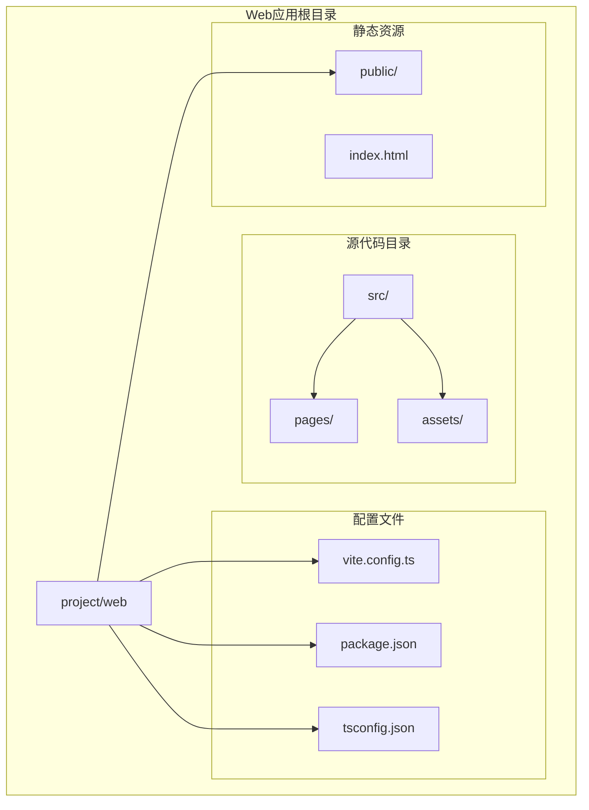
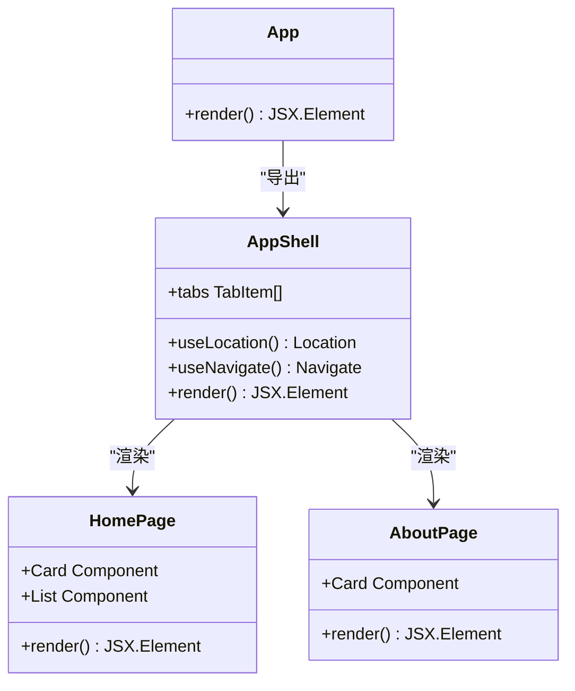
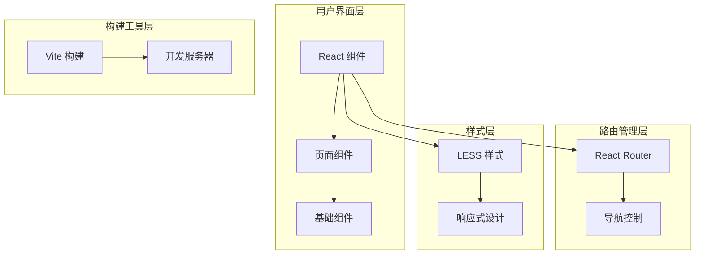
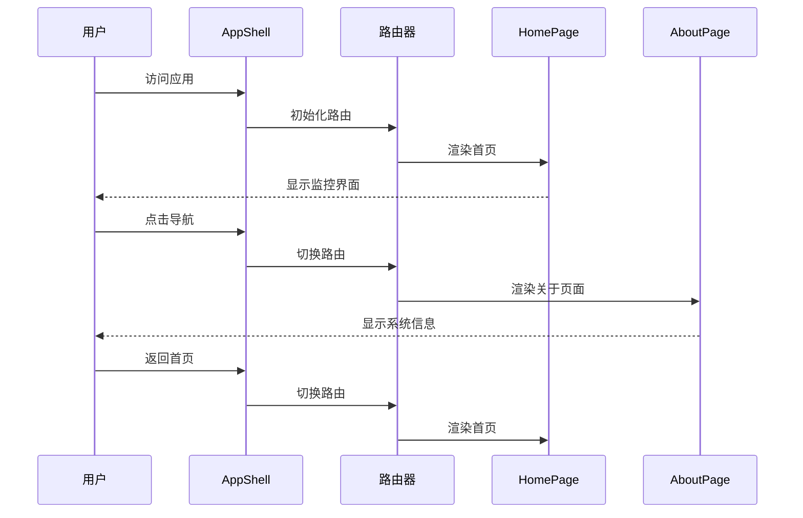
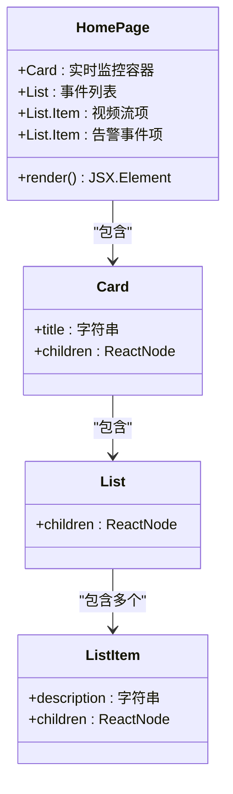
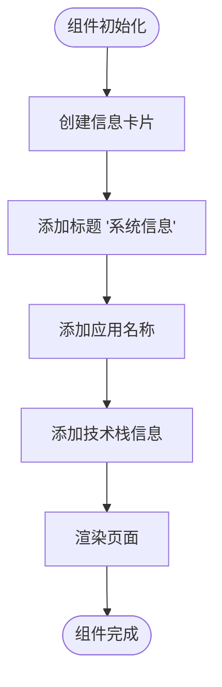
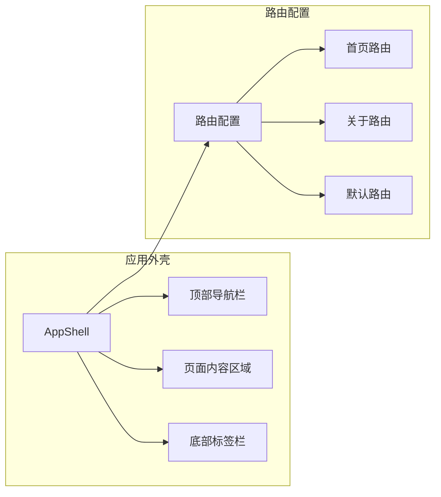
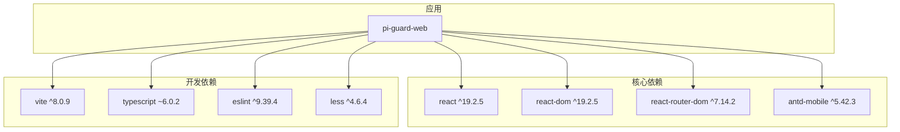
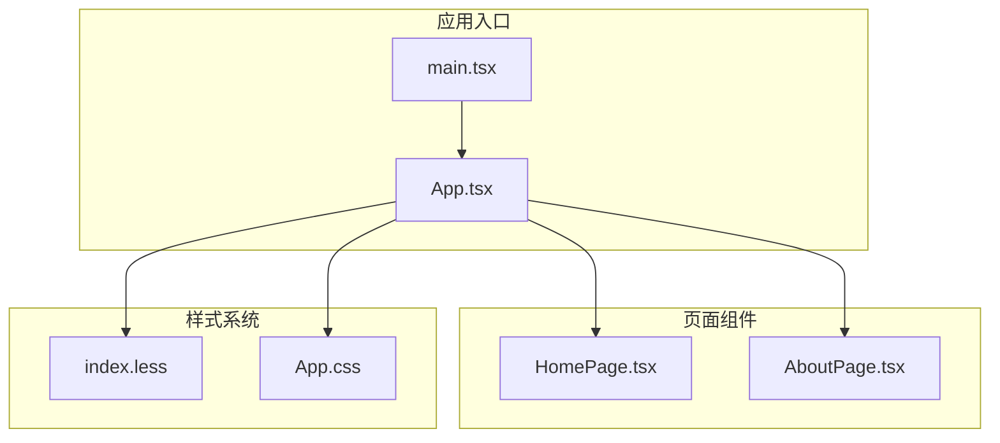

# 页面组件实现

<cite>
**本文档引用的文件**
- [HomePage.tsx](file://project/web/src/pages/HomePage.tsx)
- [AboutPage.tsx](file://project/web/src/pages/AboutPage.tsx)
- [App.tsx](file://project/web/src/App.tsx)
- [main.tsx](file://project/web/src/main.tsx)
- [index.less](file://project/web/src/index.less)
- [package.json](file://project/web/package.json)
- [vite.config.ts](file://project/web/vite.config.ts)
- [App.css](file://project/web/src/App.css)
</cite>

## 目录
1. [简介](#简介)
2. [项目结构](#项目结构)
3. [核心组件](#核心组件)
4. [架构概览](#架构概览)
5. [详细组件分析](#详细组件分析)
6. [依赖关系分析](#依赖关系分析)
7. [性能考虑](#性能考虑)
8. [故障排除指南](#故障排除指南)
9. [结论](#结论)

## 简介

本项目是一个基于 React 和 Ant Design Mobile 的 Web 应用程序，专注于设备监控和管理系统。项目采用现代化的前端技术栈，实现了简洁高效的用户界面。当前版本包含两个核心页面组件：HomePage（主页）和 AboutPage（关于页面），通过路由系统进行导航切换。

该应用程序具有以下特点：
- 基于 React 19 的现代前端框架
- 使用 Ant Design Mobile 提供移动端友好的 UI 组件
- 采用 React Router 进行页面路由管理
- 支持响应式设计和移动端适配
- 使用 Vite 作为构建工具和开发服务器

## 项目结构

项目采用模块化的目录结构，主要分为以下几个部分：

**图表来源**
- [main.tsx:1-15](file://project/web/src/main.tsx#L1-L15)
- [App.tsx:1-38](file://project/web/src/App.tsx#L1-L38)

**章节来源**
- [main.tsx:1-15](file://project/web/src/main.tsx#L1-L15)
- [package.json:1-34](file://project/web/package.json#L1-L34)

## 核心组件

### 组件架构概述

项目采用函数式组件和 Hooks 的现代 React 开发模式，所有页面组件都遵循统一的结构和样式规范。

**图表来源**
- [App.tsx:7-37](file://project/web/src/App.tsx#L7-L37)
- [HomePage.tsx:1-15](file://project/web/src/pages/HomePage.tsx#L1-L15)
- [AboutPage.tsx:1-13](file://project/web/src/pages/AboutPage.tsx#L1-L13)

### 组件职责分配

- **AppShell 组件**：负责应用的整体布局、导航栏、标签栏和路由管理
- **HomePage 组件**：展示设备监控信息，包括实时视频流和告警事件
- **AboutPage 组件**：显示系统信息和技术栈详情

**章节来源**
- [App.tsx:7-37](file://project/web/src/App.tsx#L7-L37)
- [HomePage.tsx:1-15](file://project/web/src/pages/HomePage.tsx#L1-L15)
- [AboutPage.tsx:1-13](file://project/web/src/pages/AboutPage.tsx#L1-L13)

## 架构概览

### 整体架构设计

应用程序采用分层架构，清晰分离了视图层、路由层和数据层：

**图表来源**
- [App.tsx:1-38](file://project/web/src/App.tsx#L1-L38)
- [main.tsx:1-15](file://project/web/src/main.tsx#L1-L15)
- [index.less:1-55](file://project/web/src/index.less#L1-L55)

### 数据流设计

**图表来源**
- [App.tsx:20-24](file://project/web/src/App.tsx#L20-L24)
- [HomePage.tsx:1-15](file://project/web/src/pages/HomePage.tsx#L1-L15)
- [AboutPage.tsx:1-13](file://project/web/src/pages/AboutPage.tsx#L1-L13)

## 详细组件分析

### HomePage 组件分析

#### 功能实现

HomePage 组件是应用的核心监控界面，主要功能包括：

1. **实时监控展示**：提供视频流播放入口
2. **告警事件管理**：展示移动侦测等安全事件
3. **用户交互支持**：通过列表项提供操作入口

**图表来源**
- [HomePage.tsx:3-14](file://project/web/src/pages/HomePage.tsx#L3-L14)

#### 组件结构

组件采用卡片式布局，使用 Ant Design Mobile 的 Card 和 List 组件构建：

- **外层容器**：`.page` 类提供统一的页面间距和布局
- **监控卡片**：标题为"实时监控"的卡片容器
- **功能列表**：包含两个主要功能项

**章节来源**
- [HomePage.tsx:1-15](file://project/web/src/pages/HomePage.tsx#L1-L15)
- [index.less:28-36](file://project/web/src/index.less#L28-L36)

### AboutPage 组件分析

#### 信息展示设计

AboutPage 组件专注于系统信息的展示，采用简洁的信息卡片布局：

**图表来源**
- [AboutPage.tsx:3-12](file://project/web/src/pages/AboutPage.tsx#L3-L12)

#### 内容组织

组件内容结构清晰，包含：
- **应用标识**：显示应用名称 "pi-guard-web"
- **技术栈**：明确标注使用的前端技术组合

**章节来源**
- [AboutPage.tsx:1-13](file://project/web/src/pages/AboutPage.tsx#L1-L13)

### AppShell 组件分析

#### 导航架构

AppShell 是应用的外壳组件，负责整体的导航和布局：

**图表来源**
- [App.tsx:7-37](file://project/web/src/App.tsx#L7-L37)

#### 路由管理

使用 React Router 进行页面路由管理：
- **首页路由**：`/home` 对应 HomePage 组件
- **关于页面路由**：`/about` 对应 AboutPage 组件
- **默认路由**：`*` 重定向到首页

**章节来源**
- [App.tsx:11-29](file://project/web/src/App.tsx#L11-L29)

## 依赖关系分析

### 外部依赖

项目使用的主要外部依赖包括：

**图表来源**
- [package.json:12-32](file://project/web/package.json#L12-L32)

### 内部模块依赖

**图表来源**
- [main.tsx:1-15](file://project/web/src/main.tsx#L1-L15)
- [App.tsx:1-38](file://project/web/src/App.tsx#L1-L38)

**章节来源**
- [package.json:1-34](file://project/web/package.json#L1-L34)

## 性能考虑

### 构建优化

项目使用 Vite 作为构建工具，具有以下性能优势：
- **快速冷启动**：基于 ES Modules 的原生支持
- **热更新**：开发时的即时反馈
- **生产构建**：优化的打包和压缩

### 样式优化

采用 LESS 预处理器的优势：
- **变量系统**：统一的颜色和间距管理
- **嵌套语法**：清晰的样式层次结构
- **编译优化**：生产环境的 CSS 压缩

### 移动端性能

Ant Design Mobile 的移动端优化：
- **触摸友好**：适合移动端手势操作
- **轻量级**：按需加载组件
- **响应式**：自动适配不同屏幕尺寸

## 故障排除指南

### 常见问题诊断

#### 路由问题
- **症状**：页面无法正确跳转
- **解决方案**：检查路由配置和路径设置

#### 样式问题
- **症状**：组件样式异常或布局错乱
- **解决方案**：验证 LESS 变量定义和样式优先级

#### 依赖问题
- **症状**：构建失败或运行时错误
- **解决方案**：检查 package.json 中的依赖版本兼容性

### 开发调试建议

1. **使用浏览器开发者工具**：检查组件渲染和样式应用
2. **启用严格模式**：在开发环境中发现潜在问题
3. **检查控制台日志**：定位运行时错误

**章节来源**
- [main.tsx:8-14](file://project/web/src/main.tsx#L8-L14)
- [App.tsx:35-37](file://project/web/src/App.tsx#L35-L37)

## 结论

该项目展示了现代 React 应用开发的最佳实践，具有以下优势：

1. **清晰的架构设计**：模块化组织和职责分离
2. **优秀的用户体验**：基于 Ant Design Mobile 的移动端优化
3. **高效的开发流程**：Vite 提供的快速开发体验
4. **可维护的代码结构**：标准化的组件设计和样式管理

未来可以考虑的改进方向：
- 添加状态管理（如 Redux 或 Zustand）
- 实现更丰富的设备监控功能
- 增强实时数据更新机制
- 扩展移动端适配能力