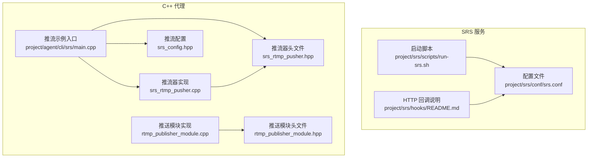
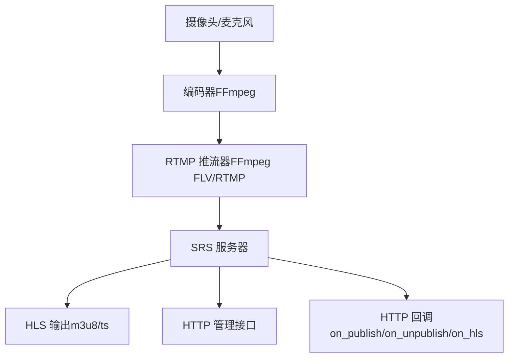
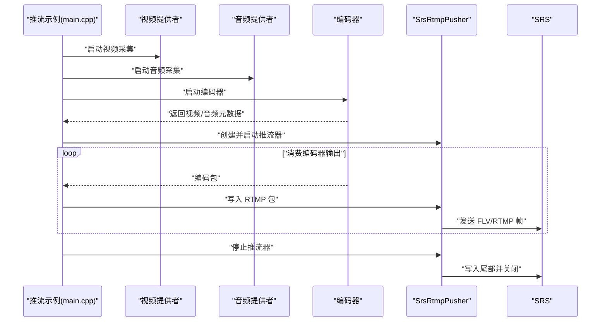
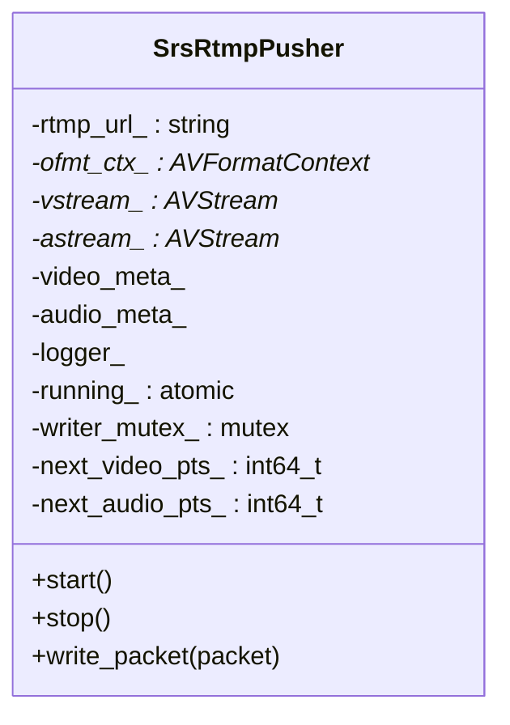
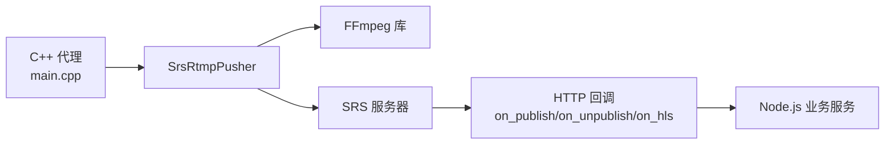

# SRS RTMP 服务器

<cite>
**本文引用的文件**
- [srs.conf](file://project/srs/conf/srs.conf)
- [run-srs.sh](file://project/srs/scripts/run-srs.sh)
- [README.md（SRS Hooks）](file://project/srs/hooks/README.md)
- [main.cpp（SRS 推流示例）](file://project/agent/cli/srs/main.cpp)
- [srs_rtmp_pusher.hpp](file://project/agent/cli/srs/srs_rtmp_pusher.hpp)
- [srs_rtmp_pusher.cpp](file://project/agent/cli/srs/srs_rtmp_pusher.cpp)
- [srs_config.hpp](file://project/agent/cli/srs/srs_config.hpp)
- [README.md（SRS 推流示例）](file://project/agent/cli/srs/README.md)
- [rtmp_publisher_module.hpp](file://project/agent/src/modules/external_access/pusher/include/access_pusher/rtmp_publisher_module.hpp)
- [rtmp_publisher_module.cpp](file://project/agent/src/modules/external_access/pusher/rtmp_publisher_module.cpp)
- [README.md（项目总览）](file://README.md)
- [version.hpp](file://project/agent/include/piguard/version.hpp)
</cite>

## 目录
1. [简介](#简介)
2. [项目结构](#项目结构)
3. [核心组件](#核心组件)
4. [架构总览](#架构总览)
5. [详细组件分析](#详细组件分析)
6. [依赖分析](#依赖分析)
7. [性能考虑](#性能考虑)
8. [故障排除指南](#故障排除指南)
9. [结论](#结论)
10. [附录](#附录)

## 简介
本文件面向 SRS RTMP 服务器在本项目中的配置与使用，重点覆盖：
- SRS 配置文件结构与关键参数（端口、协议、流媒体参数）
- 服务器启动脚本与部署策略（Docker 与 systemd）
- RTMP 推流实现原理与 C++ 代理程序的集成方式
- 监控、性能调优与故障排除
- 安全配置与最佳实践

## 项目结构
本项目将 SRS 作为独立的流媒体服务，配合 C++ 代理进行本地音视频采集与编码，并通过 RTMP 推送到 SRS。SRS 的配置与启动脚本位于 project/srs 目录，C++ 推流示例位于 project/agent/cli/srs。

图表来源
- [srs.conf:1-61](file://project/srs/conf/srs.conf#L1-L61)
- [run-srs.sh:1-14](file://project/srs/scripts/run-srs.sh#L1-L14)
- [README.md（SRS Hooks）:1-12](file://project/srs/hooks/README.md#L1-L12)
- [main.cpp（SRS 推流示例）:1-131](file://project/agent/cli/srs/main.cpp#L1-L131)
- [srs_rtmp_pusher.hpp:1-48](file://project/agent/cli/srs/srs_rtmp_pusher.hpp#L1-L48)
- [srs_rtmp_pusher.cpp:1-193](file://project/agent/cli/srs/srs_rtmp_pusher.cpp#L1-L193)
- [srs_config.hpp:1-19](file://project/agent/cli/srs/srs_config.hpp#L1-L19)
- [rtmp_publisher_module.hpp:1-22](file://project/agent/src/modules/external_access/pusher/include/access_pusher/rtmp_publisher_module.hpp#L1-L22)
- [rtmp_publisher_module.cpp:1-21](file://project/agent/src/modules/external_access/pusher/rtmp_publisher_module.cpp#L1-L21)

章节来源
- [README.md（项目总览）:1-68](file://README.md#L1-L68)
- [srs.conf:1-61](file://project/srs/conf/srs.conf#L1-L61)
- [run-srs.sh:1-14](file://project/srs/scripts/run-srs.sh#L1-L14)
- [README.md（SRS 推流示例）:1-106](file://project/agent/cli/srs/README.md#L1-L106)

## 核心组件
- SRS 配置与启动
  - 配置文件包含监听端口、HTTP 管理接口、统计信息、虚拟主机（vhost）下的发布/播放策略、HTTP 重 mux、HLS 参数、HTTP Hooks 等。
  - 启动脚本负责定位配置文件并执行 SRS 命令。
- 推流侧（C++ 代理）
  - 推流示例程序负责采集音视频、编码、对接 FFmpeg libavformat 推送 RTMP。
  - 推流器封装了 FLV/RTMP 输出上下文、流参数设置、时间戳补齐与写入流程。
  - 推流配置集中定义了分辨率、帧率、采样率、设备与默认 RTMP 地址等。
- 推送模块（框架预留）
  - 外部访问模块中预留 RTMP 推送模块接口，当前实现为空操作，可用于后续接入完整推送链路。

章节来源
- [srs.conf:1-61](file://project/srs/conf/srs.conf#L1-L61)
- [run-srs.sh:1-14](file://project/srs/scripts/run-srs.sh#L1-L14)
- [main.cpp（SRS 推流示例）:1-131](file://project/agent/cli/srs/main.cpp#L1-L131)
- [srs_rtmp_pusher.hpp:1-48](file://project/agent/cli/srs/srs_rtmp_pusher.hpp#L1-L48)
- [srs_rtmp_pusher.cpp:1-193](file://project/agent/cli/srs/srs_rtmp_pusher.cpp#L1-L193)
- [srs_config.hpp:1-19](file://project/agent/cli/srs/srs_config.hpp#L1-L19)
- [rtmp_publisher_module.hpp:1-22](file://project/agent/src/modules/external_access/pusher/include/access_pusher/rtmp_publisher_module.hpp#L1-L22)
- [rtmp_publisher_module.cpp:1-21](file://project/agent/src/modules/external_access/pusher/rtmp_publisher_module.cpp#L1-L21)

## 架构总览
下图展示了从采集到推流再到 SRS 的整体链路，以及 SRS 的 HTTP 回调与管理接口。

图表来源
- [srs.conf:6-19](file://project/srs/conf/srs.conf#L6-L19)
- [srs.conf:34-48](file://project/srs/conf/srs.conf#L34-L48)
- [srs.conf:54-59](file://project/srs/conf/srs.conf#L54-L59)
- [srs_rtmp_pusher.cpp:24-104](file://project/agent/cli/srs/srs_rtmp_pusher.cpp#L24-L104)

## 详细组件分析

### SRS 配置文件解析
- 监听与并发
  - RTMP 监听端口、最大连接数、守护进程开关、日志输出目标。
- HTTP 服务器
  - 开启 HTTP 服务，监听端口与静态资源目录，便于网页调试与查看。
- HTTP API
  - 开启 SRS 自身的 HTTP 管理接口，便于查询状态与控制。
- 统计
  - 网络统计开关。
- 虚拟主机（vhost）
  - 最小延迟与 TCP NoDelay。
  - 发布策略：媒体重传（mr）关闭。
  - 播放策略：GOP 缓存开启、队列长度限制。
  - HTTP 重 mux：按 [vhost]/[app]/[stream].flv 输出。
  - HLS：开启、路径、片段时长、窗口大小、清理策略、m3u8/ts 文件命名模板。
  - DVR：关闭。
  - HTTP Hooks：发布/取消发布/HLS 事件回调，指向本机 Node.js 服务。

章节来源
- [srs.conf:1-61](file://project/srs/conf/srs.conf#L1-L61)

### SRS 启动脚本与部署策略
- 启动脚本
  - 校验 SRS 命令是否存在，定位配置文件路径，执行带参启动。
- 部署策略
  - Docker：映射 RTMP/HTTP API/HTTP 服务端口，直接运行官方镜像。
  - systemd：可参考项目总览中的服务定义位置，结合本机环境编写服务单元文件。

章节来源
- [run-srs.sh:1-14](file://project/srs/scripts/run-srs.sh#L1-L14)
- [README.md（项目总览）:50-68](file://README.md#L50-L68)

### RTMP 推流实现与 C++ 代理集成
- 推流示例主流程
  - 解析命令行参数（视频设备、音频设备、RTMP 地址）。
  - 注册信号处理器，启动音视频提供者与编码器。
  - 等待编码器元数据就绪，创建 RTMP 推流器并启动。
  - 注册编码器消费者，循环从编码器拉取包并写入 RTMP。
  - 接收关闭信号后停止全部组件。
- 推流器设计
  - 初始化网络、分配输出上下文、创建视频/音频流并设置编解码参数与 extradata。
  - 打开输出 URL、写入容器头。
  - 写包阶段：根据包类型设置 PTS/DTS、关键帧标记、时间基转换与交错写入。
  - 停止流程：写入尾部、关闭 IO、释放上下文。
- 推流配置
  - 定义分辨率、帧率、缓冲区数量、队列容量、采样率、声道数、默认设备与默认 RTMP 地址。

图表来源
- [main.cpp（SRS 推流示例）:24-131](file://project/agent/cli/srs/main.cpp#L24-L131)
- [srs_rtmp_pusher.cpp:24-104](file://project/agent/cli/srs/srs_rtmp_pusher.cpp#L24-L104)
- [srs_rtmp_pusher.cpp:132-193](file://project/agent/cli/srs/srs_rtmp_pusher.cpp#L132-L193)

图表来源
- [srs_rtmp_pusher.hpp:17-48](file://project/agent/cli/srs/srs_rtmp_pusher.hpp#L17-L48)

章节来源
- [main.cpp（SRS 推流示例）:1-131](file://project/agent/cli/srs/main.cpp#L1-L131)
- [srs_rtmp_pusher.hpp:1-48](file://project/agent/cli/srs/srs_rtmp_pusher.hpp#L1-L48)
- [srs_rtmp_pusher.cpp:1-193](file://project/agent/cli/srs/srs_rtmp_pusher.cpp#L1-L193)
- [srs_config.hpp:1-19](file://project/agent/cli/srs/srs_config.hpp#L1-L19)

### 推送模块（框架预留）
- 模块接口
  - 名称、启动/停止与一次性推送接口。
- 当前实现
  - 空操作，仅维护运行状态标志位，便于后续接入完整推送链路。

章节来源
- [rtmp_publisher_module.hpp:1-22](file://project/agent/src/modules/external_access/pusher/include/access_pusher/rtmp_publisher_module.hpp#L1-L22)
- [rtmp_publisher_module.cpp:1-21](file://project/agent/src/modules/external_access/pusher/rtmp_publisher_module.cpp#L1-L21)

### SRS HTTP Hooks 与回调
- 回调接口
  - on_publish、on_unpublish、on_hls，分别在发布开始、取消发布、HLS 事件时触发。
- 用途
  - 与 Node.js 业务服务联动，记录事件、触发 DVR/HLS 等动作。
- 调试
  - hooks 目录可用于放置本地 mock 服务或回调日志脚本。

章节来源
- [srs.conf:54-59](file://project/srs/conf/srs.conf#L54-L59)
- [README.md（SRS Hooks）:1-12](file://project/srs/hooks/README.md#L1-L12)

## 依赖分析
- 组件耦合
  - 推流示例依赖编码器与推流器；推流器依赖 FFmpeg 库；SRS 依赖 HTTP 管理与回调服务。
- 外部依赖
  - FFmpeg（libavformat、libavcodec、libavutil）、SRS 二进制、Node.js（用于 HTTP 回调与业务逻辑）。
- 潜在风险
  - 时间戳缺失导致的 PTS/DTS 异常；H.264 打包格式不一致导致的 Annex B/AVCC 解析差异；网络中断与缓冲溢出。

图表来源
- [main.cpp（SRS 推流示例）:24-131](file://project/agent/cli/srs/main.cpp#L24-L131)
- [srs_rtmp_pusher.cpp:24-104](file://project/agent/cli/srs/srs_rtmp_pusher.cpp#L24-L104)
- [srs.conf:54-59](file://project/srs/conf/srs.conf#L54-L59)

## 性能考虑
- 编码与推流
  - 合理设置分辨率、帧率与音频采样率，避免过高的码率导致网络拥塞。
  - 使用 GOP 缓存与队列长度限制，平衡延迟与稳定性。
- SRS 参数
  - 播放端启用 gop_cache 与合理队列长度，有助于平滑播放。
  - HLS 片段时长与窗口大小需与播放端兼容，避免频繁切换。
- 网络与并发
  - 控制最大连接数，避免高并发导致内存与 CPU 压力过大。
  - 启用 TCP NoDelay 降低 RTMP 时延。

章节来源
- [srs.conf:17-61](file://project/srs/conf/srs.conf#L17-L61)

## 故障排除指南
- 常见问题与处理
  - SRS 报 HlsDecode / not annexb，推流端 Broken pipe
    - 原因：H.264 打包格式为 AVCC（非 Annex B）时，SRS 启发式误判导致解析失败。
    - 处理（服务端）：在 vhost 的 publish 下关闭 try_annexb_first，优先按 AVCC 解析。
    - 处理（推流端）：确保编码器输出合法 PTS/DTS；若仍出现 AV_NOPTS_VALUE，检查编码器时间戳生成逻辑。
  - 音视频不同步
    - 原因：视频与音频时间基准未对齐，或仅保留最新帧导致画面跳跃。
    - 处理：视频帧 PTS 与音频按统一 wall-clock 对齐，编码器与推流侧保证时间戳一致性。
- 排查步骤
  - 检查 SRS 日志与 HTTP API 状态。
  - 使用 ffplay 或 VLC 拉流验证。
  - 核对推流端时间戳与 SRS 统计信息。

章节来源
- [README.md（SRS 推流示例）:63-106](file://project/agent/cli/srs/README.md#L63-L106)
- [srs.conf:25-32](file://project/srs/conf/srs.conf#L25-L32)

## 结论
本项目通过清晰的分层架构实现了从本地采集到 RTMP 推流再到 SRS 分发的完整链路。SRS 配置简洁实用，结合 HTTP Hooks 与管理接口，满足实时监控与 HLS 录制需求。C++ 代理以 FFmpeg 为核心实现低延迟推流，具备良好的扩展性。建议在生产环境中进一步完善安全策略与性能调优，并持续监控与排障。

## 附录
- 版本信息
  - 系统版本号定义于版本头文件，便于追踪与发布管理。
- 快速开始
  - 启动 SRS：使用 Docker 映射必要端口，或通过启动脚本加载配置。
  - 运行推流示例：在 agent 目录构建并运行推流程序，默认推流地址为 rtmp://127.0.0.1/live/livestream。
  - 拉流验证：使用 ffplay 或 VLC 打开相同 RTMP URL。

章节来源
- [version.hpp:1-8](file://project/agent/include/piguard/version.hpp#L1-L8)
- [README.md（SRS 推流示例）:5-62](file://project/agent/cli/srs/README.md#L5-L62)
- [run-srs.sh:1-14](file://project/srs/scripts/run-srs.sh#L1-L14)