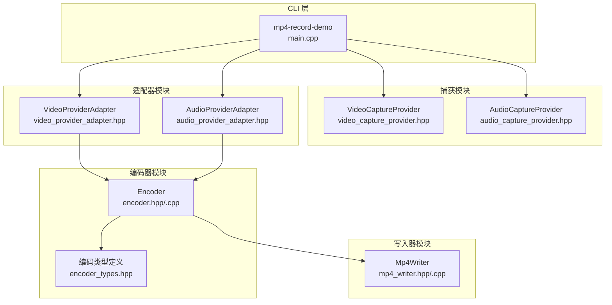
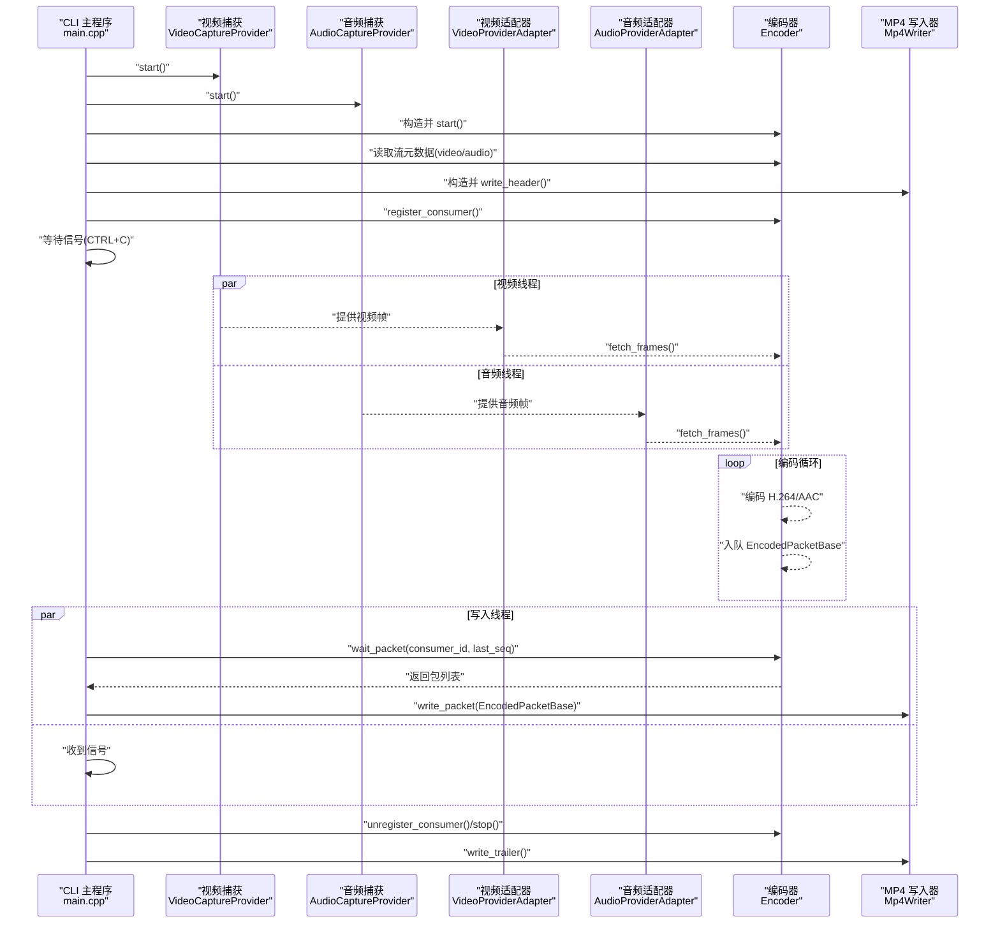
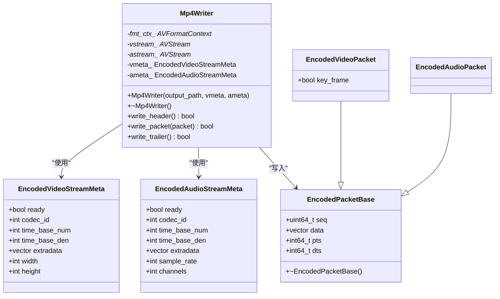
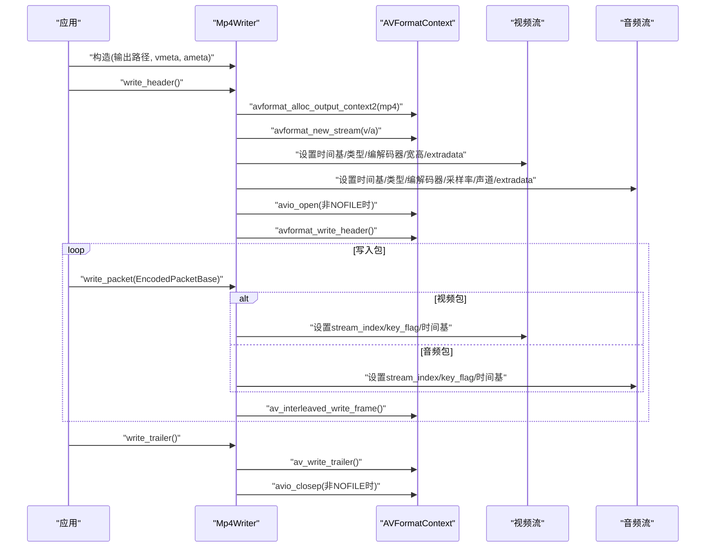
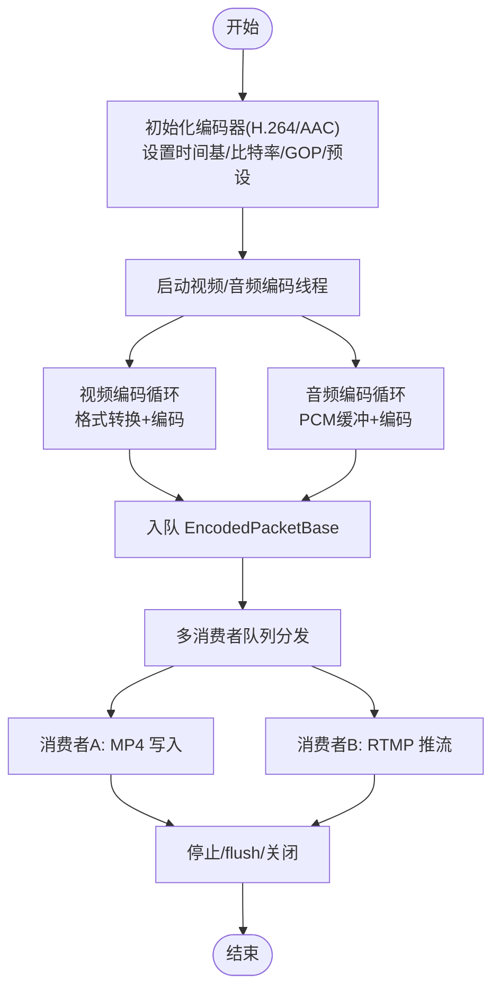
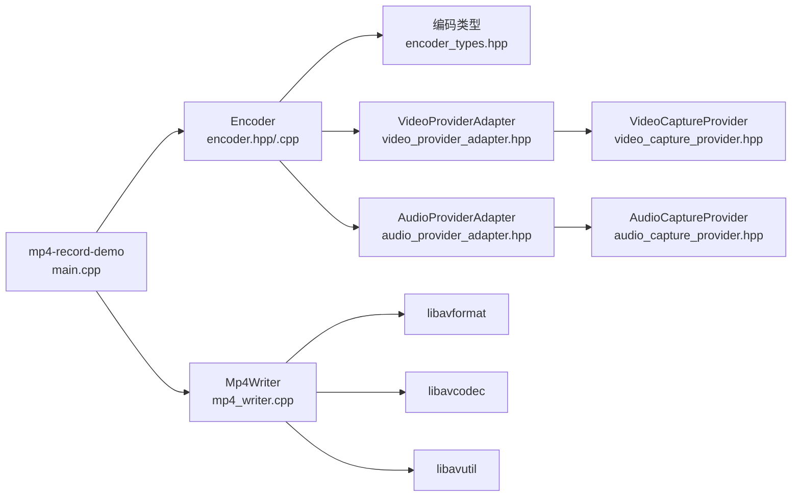

# MP4 录制工具

<cite>
**本文档引用的文件**
- [mp4_writer.hpp](file://project/agent/cli/mp4/mp4_writer.hpp)
- [mp4_writer.cpp](file://project/agent/cli/mp4/mp4_writer.cpp)
- [main.cpp](file://project/agent/cli/mp4/main.cpp)
- [CMakeLists.txt](file://project/agent/cli/mp4/CMakeLists.txt)
- [encoder_types.hpp](file://project/agent/src/modules/processing/encoder/include/processing_encoder/encoder_types.hpp)
- [encoder.hpp](file://project/agent/src/modules/processing/encoder/include/processing_encoder/encoder.hpp)
- [encoder.cpp](file://project/agent/src/modules/processing/encoder/encoder.cpp)
- [video_provider_adapter.hpp](file://project/agent/src/modules/processing/encoder/include/processing_encoder/video_provider_adapter.hpp)
- [audio_provider_adapter.hpp](file://project/agent/src/modules/processing/encoder/include/processing_encoder/audio_provider_adapter.hpp)
- [video_capture_provider.hpp](file://project/agent/src/modules/capture/video/include/capture_video/video_capture_provider.hpp)
- [audio_capture_provider.hpp](file://project/agent/src/modules/capture/audio/include/capture_audio/audio_capture_provider.hpp)
- [技术方案-encoder.md](file://docs/agent/技术方案-encoder.md)
- [技术方案-capture-video.md](file://docs/agent/技术方案-capture-video.md)
- [README.md](file://README.md)
</cite>

## 目录
1. [简介](#简介)
2. [项目结构](#项目结构)
3. [核心组件](#核心组件)
4. [架构总览](#架构总览)
5. [详细组件分析](#详细组件分析)
6. [依赖关系分析](#依赖关系分析)
7. [性能考虑](#性能考虑)
8. [故障排除指南](#故障排除指南)
9. [结论](#结论)
10. [附录](#附录)

## 简介
本文件为 MP4 录制工具的技术文档，聚焦于如何将编码后的音视频数据保存为 MP4 文件格式。文档详细解释 Mp4Writer 类的实现原理，涵盖 FFmpeg 库的使用、容器格式配置、编解码器参数设置；并提供工具的使用方法（命令行参数、输入数据格式、输出文件配置）、实际使用示例、错误处理机制、性能优化建议与故障排除指导。

## 项目结构
MP4 录制工具位于 C++ Agent 子工程中，采用模块化设计：
- CLI 层：提供 mp4-record-demo 可执行程序，负责采集、编码与写入 MP4。
- 编码器模块：基于 FFmpeg 的 H.264/AAC 编码器，支持多消费者分发。
- 捕获模块：通过 V4L2 和 ALSA 采集原始音视频帧。
- 写入器模块：Mp4Writer 使用 FFmpeg 容器 API 将编码包写入 MP4 文件。

图表来源
- [main.cpp:37-123](file://project/agent/cli/mp4/main.cpp#L37-L123)
- [video_capture_provider.hpp:15-109](file://project/agent/src/modules/capture/video/include/capture_video/video_capture_provider.hpp#L15-L109)
- [audio_capture_provider.hpp:20-105](file://project/agent/src/modules/capture/audio/include/capture_audio/audio_capture_provider.hpp#L20-L105)
- [video_provider_adapter.hpp:12-29](file://project/agent/src/modules/processing/encoder/include/processing_encoder/video_provider_adapter.hpp#L12-L29)
- [audio_provider_adapter.hpp:12-29](file://project/agent/src/modules/processing/encoder/include/processing_encoder/audio_provider_adapter.hpp#L12-L29)
- [encoder.hpp:16-90](file://project/agent/src/modules/processing/encoder/include/processing_encoder/encoder.hpp#L16-L90)
- [encoder.cpp:45-138](file://project/agent/src/modules/processing/encoder/encoder.cpp#L45-L138)
- [encoder_types.hpp:11-75](file://project/agent/src/modules/processing/encoder/include/processing_encoder/encoder_types.hpp#L11-L75)
- [mp4_writer.hpp:17-39](file://project/agent/cli/mp4/mp4_writer.hpp#L17-L39)
- [mp4_writer.cpp:9-120](file://project/agent/cli/mp4/mp4_writer.cpp#L9-L120)

章节来源
- [main.cpp:37-123](file://project/agent/cli/mp4/main.cpp#L37-L123)
- [CMakeLists.txt:1-22](file://project/agent/cli/mp4/CMakeLists.txt#L1-L22)

## 核心组件
- Mp4Writer：封装 FFmpeg 容器写入逻辑，负责创建 MP4 输出上下文、配置音视频流参数、写入封装包与尾部。
- Encoder：基于 FFmpeg 的 H.264/AAC 编码器，提供多消费者队列分发能力，输出 EncodedPacketBase 及其子类。
- VideoCaptureProvider/AudioCaptureProvider：分别通过 V4L2 和 ALSA 提供原始帧。
- VideoProviderAdapter/AudioProviderAdapter：将捕获模块的帧接口适配为编码器的 IVideoFrameGetter/IAudioFrameGetter。
- 编码类型定义：定义 EncodedPacketBase、EncodedVideoPacket、EncodedAudioPacket、EncodedStreamMetaBase 及其子类，承载编码元数据与数据包。

章节来源
- [mp4_writer.hpp:17-39](file://project/agent/cli/mp4/mp4_writer.hpp#L17-L39)
- [mp4_writer.cpp:9-120](file://project/agent/cli/mp4/mp4_writer.cpp#L9-L120)
- [encoder_types.hpp:11-75](file://project/agent/src/modules/processing/encoder/include/processing_encoder/encoder_types.hpp#L11-L75)
- [encoder.hpp:16-90](file://project/agent/src/modules/processing/encoder/include/processing_encoder/encoder.hpp#L16-L90)
- [encoder.cpp:45-138](file://project/agent/src/modules/processing/encoder/encoder.cpp#L45-L138)
- [video_provider_adapter.hpp:12-29](file://project/agent/src/modules/processing/encoder/include/processing_encoder/video_provider_adapter.hpp#L12-L29)
- [audio_provider_adapter.hpp:12-29](file://project/agent/src/modules/processing/encoder/include/processing_encoder/audio_provider_adapter.hpp#L12-L29)
- [video_capture_provider.hpp:15-109](file://project/agent/src/modules/capture/video/include/capture_video/video_capture_provider.hpp#L15-L109)
- [audio_capture_provider.hpp:20-105](file://project/agent/src/modules/capture/audio/include/capture_audio/audio_capture_provider.hpp#L20-L105)

## 架构总览
下图展示了从采集到写入 MP4 的端到端流程，包括信号处理、多线程与消费者分发。

图表来源
- [main.cpp:48-123](file://project/agent/cli/mp4/main.cpp#L48-L123)
- [encoder.hpp:32-36](file://project/agent/src/modules/processing/encoder/include/processing_encoder/encoder.hpp#L32-L36)
- [encoder.cpp:267-297](file://project/agent/src/modules/processing/encoder/encoder.cpp#L267-L297)
- [mp4_writer.cpp:70-117](file://project/agent/cli/mp4/mp4_writer.cpp#L70-L117)

## 详细组件分析

### Mp4Writer 类实现原理
Mp4Writer 封装了 FFmpeg 容器写入的核心步骤，职责包括：
- 初始化输出上下文并选择 mp4 容器格式。
- 创建音视频流，设置时间基、编解码器类型与 ID、像素格式/采样率/声道布局等参数。
- 处理编解码器额外数据（extradata），如 H.264 的 SPS/PPS。
- 写入封装包并进行时间基转换，确保音视频同步。
- 写入尾部并关闭输出。

图表来源
- [mp4_writer.hpp:17-39](file://project/agent/cli/mp4/mp4_writer.hpp#L17-L39)
- [mp4_writer.cpp:9-120](file://project/agent/cli/mp4/mp4_writer.cpp#L9-L120)
- [encoder_types.hpp:41-75](file://project/agent/src/modules/processing/encoder/include/processing_encoder/encoder_types.hpp#L41-L75)

章节来源
- [mp4_writer.hpp:17-39](file://project/agent/cli/mp4/mp4_writer.hpp#L17-L39)
- [mp4_writer.cpp:9-120](file://project/agent/cli/mp4/mp4_writer.cpp#L9-L120)

### 写入流程时序
下图展示 Mp4Writer 的写入过程，包括头、包与尾部阶段。

图表来源
- [mp4_writer.cpp:22-117](file://project/agent/cli/mp4/mp4_writer.cpp#L22-L117)

章节来源
- [mp4_writer.cpp:22-117](file://project/agent/cli/mp4/mp4_writer.cpp#L22-L117)

### 编码器与多消费者分发
编码器模块负责将原始帧编码为 H.264/AAC，并通过多消费者队列分发给不同下游（如 MP4 写入器、RTMP 推流等）。其关键特性包括：
- 独立的视频/音频编码线程，异步 send/receive 模型。
- 基于采集序号的 PTS 校准，避免丢帧导致的时间轴偏移。
- 低延迟配置（preset=veryfast、tune=zerolatency、禁用B帧、GOP=1秒）。
- flush 机制确保编码器内部缓冲被完全刷出。

图表来源
- [encoder.cpp:267-349](file://project/agent/src/modules/processing/encoder/encoder.cpp#L267-L349)
- [技术方案-encoder.md:108-235](file://docs/agent/技术方案-encoder.md#L108-L235)

章节来源
- [encoder.hpp:16-90](file://project/agent/src/modules/processing/encoder/include/processing_encoder/encoder.hpp#L16-L90)
- [encoder.cpp:45-138](file://project/agent/src/modules/processing/encoder/encoder.cpp#L45-L138)
- [技术方案-encoder.md:108-235](file://docs/agent/技术方案-encoder.md#L108-L235)

### 捕获模块与数据准备
- 视频捕获：通过 V4L2 采集 YUYV 帧，采用单生产者多消费者模型，支持批量取帧与队列容量控制。
- 音频捕获：通过 ALSA 采集 PCM 帧，同样采用单生产者多消费者模型，支持批量取音频与队列容量控制。

章节来源
- [video_capture_provider.hpp:15-109](file://project/agent/src/modules/capture/video/include/capture_video/video_capture_provider.hpp#L15-L109)
- [audio_capture_provider.hpp:20-105](file://project/agent/src/modules/capture/audio/include/capture_audio/audio_capture_provider.hpp#L20-L105)
- [技术方案-capture-video.md:1-123](file://docs/agent/技术方案-capture-video.md#L1-123)

## 依赖关系分析
- 外部库：libavformat、libavcodec、libavutil 通过 pkg-config 链接。
- 内部模块：CLI 依赖捕获、适配器、编码器与日志模块；编码器内部封装 FFmpeg 类型，避免外部重编译。
- 构建系统：CMakeLists.txt 指定依赖库与目标链接。

图表来源
- [CMakeLists.txt:1-22](file://project/agent/cli/mp4/CMakeLists.txt#L1-L22)
- [main.cpp:10-17](file://project/agent/cli/mp4/main.cpp#L10-L17)
- [mp4_writer.cpp:1-6](file://project/agent/cli/mp4/mp4_writer.cpp#L1-L6)

章节来源
- [CMakeLists.txt:1-22](file://project/agent/cli/mp4/CMakeLists.txt#L1-L22)

## 性能考虑
- 低延迟配置：编码器使用 veryfast 预设与 zerolatency 调优，禁用 B 帧，GOP 为 1 秒，减少端到端延迟。
- 实时丢帧策略：视频编码线程仅保留最新帧，避免积压导致的延迟。
- 时间基与 PTS 校准：基于采集序号计算视频 PTS，确保音视频同步与时间轴准确性。
- 异步 send/receive：编码循环使用 while 循环持续接收包，避免丢包。
- 写入交错：使用 av_interleaved_write_frame 按 PTS 交错音视频包，提升播放一致性。

章节来源
- [技术方案-encoder.md:236-315](file://docs/agent/技术方案-encoder.md#L236-L315)
- [encoder.cpp:299-330](file://project/agent/src/modules/processing/encoder/encoder.cpp#L299-L330)
- [mp4_writer.cpp:70-103](file://project/agent/cli/mp4/mp4_writer.cpp#L70-L103)

## 故障排除指南
- 初始化失败
  - 现象：write_header 返回失败或日志报错。
  - 排查：检查输出路径权限、容器格式支持、编解码器可用性；确认 vmeta/ameta 已就绪。
  - 参考：[mp4_writer.cpp:22-68](file://project/agent/cli/mp4/mp4_writer.cpp#L22-L68)，[main.cpp:70-87](file://project/agent/cli/mp4/main.cpp#L70-L87)
- 写入失败
  - 现象：write_packet 返回失败或警告。
  - 排查：确认包数据有效、时间基转换正确、流索引与关键帧标志设置合理。
  - 参考：[mp4_writer.cpp:70-103](file://project/agent/cli/mp4/mp4_writer.cpp#L70-L103)
- 停止与尾部
  - 现象：录制结束后文件损坏或无法播放。
  - 排查：确保调用 write_trailer 并正确关闭 IO；检查编码器 flush 与停止顺序。
  - 参考：[mp4_writer.cpp:105-117](file://project/agent/cli/mp4/mp4_writer.cpp#L105-L117)，[encoder.cpp:332-349](file://project/agent/src/modules/processing/encoder/encoder.cpp#L332-L349)
- 信号处理
  - 现象：Ctrl+C 后未正常停止。
  - 排查：确认信号处理器注册成功、ShutdownManager 正常工作、消费者注销与线程 join。
  - 参考：[main.cpp:42-46](file://project/agent/cli/mp4/main.cpp#L42-L46)，[main.cpp:109-122](file://project/agent/cli/mp4/main.cpp#L109-L122)

章节来源
- [mp4_writer.cpp:22-117](file://project/agent/cli/mp4/mp4_writer.cpp#L22-L117)
- [main.cpp:42-122](file://project/agent/cli/mp4/main.cpp#L42-L122)
- [encoder.cpp:332-349](file://project/agent/src/modules/processing/encoder/encoder.cpp#L332-L349)

## 结论
MP4 录制工具通过清晰的模块划分与 FFmpeg 容器 API，实现了从原始音视频采集到高质量 MP4 文件写入的完整链路。Mp4Writer 负责容器层的参数配置与包写入，Encoder 提供低延迟、高可靠性的编码与分发能力。结合完善的错误处理与性能优化策略，该工具可在边缘设备上稳定运行并满足实时录制需求。

## 附录

### 使用方法与命令行参数
- 可执行程序：mp4-record-demo
- 命令行参数
  - 第1个参数：视频设备路径（默认 /dev/video0）
  - 第2个参数：音频设备名称（默认 default）
  - 第3个参数：输出文件路径（默认 .tmp/demo.mp4）
- 输入数据格式
  - 视频：V4L2 YUYV 帧，经适配器转换为编码器输入。
  - 音频：ALSA PCM 帧，经适配器转换为编码器输入。
- 输出文件配置
  - 容器：MP4
  - 视频：H.264（全局头）
  - 音频：AAC（全局头）

章节来源
- [main.cpp:37-41](file://project/agent/cli/mp4/main.cpp#L37-L41)
- [video_capture_provider.hpp:15-109](file://project/agent/src/modules/capture/video/include/capture_video/video_capture_provider.hpp#L15-L109)
- [audio_capture_provider.hpp:20-105](file://project/agent/src/modules/capture/audio/include/capture_audio/audio_capture_provider.hpp#L20-L105)

### 实际使用示例
- 示例 1：使用默认设备与输出
  - 运行：./mp4-record-demo
  - 行为：自动使用 /dev/video0 与 default 设备，输出至 .tmp/demo.mp4
- 示例 2：自定义设备与输出
  - 运行：./mp4-record-demo /dev/video1 default /tmp/myrecording.mp4
  - 行为：使用 /dev/video1 与 default 设备，输出至 /tmp/myrecording.mp4
- 示例 3：自定义 ALSA 设备
  - 运行：./mp4-record-demo /dev/video0 hw:0,0 /tmp/test.mp4
  - 行为：使用 /dev/video0 与 hw:0,0 设备，输出至 /tmp/test.mp4

章节来源
- [main.cpp:37-41](file://project/agent/cli/mp4/main.cpp#L37-L41)

### 错误处理机制
- 日志级别
  - info：启动成功、停止完成
  - error：编码器未找到、分配/打开失败、格式转换器失败
  - debug：初始化成功（含参数）、视频丢帧、音视频首帧编码成功
  - warn：不支持的音频采样格式、编码发送失败、包队列溢出丢包
- 关键检查点
  - 编码器元数据就绪：vmeta.ready 与 ameta.ready
  - 写入器初始化：write_header 成功
  - 包写入：write_packet 成功，关键帧标志与时间基正确
  - 停止顺序：先注销消费者、停止编码器、再写入尾部

章节来源
- [技术方案-encoder.md:303-315](file://docs/agent/技术方案-encoder.md#L303-L315)
- [main.cpp:70-87](file://project/agent/cli/mp4/main.cpp#L70-L87)
- [mp4_writer.cpp:70-103](file://project/agent/cli/mp4/mp4_writer.cpp#L70-L103)

### 性能优化建议
- 降低延迟
  - 使用 veryfast 预设与 zerolatency 调优
  - 禁用 B 帧，GOP=1秒
  - 保留最新视频帧，避免积压
- 提升稳定性
  - 使用 av_interleaved_write_frame 交错写入
  - 确保 flush 与关闭顺序正确
  - 控制队列容量，避免内存压力

章节来源
- [技术方案-encoder.md:236-315](file://docs/agent/技术方案-encoder.md#L236-L315)
- [mp4_writer.cpp:70-103](file://project/agent/cli/mp4/mp4_writer.cpp#L70-L103)