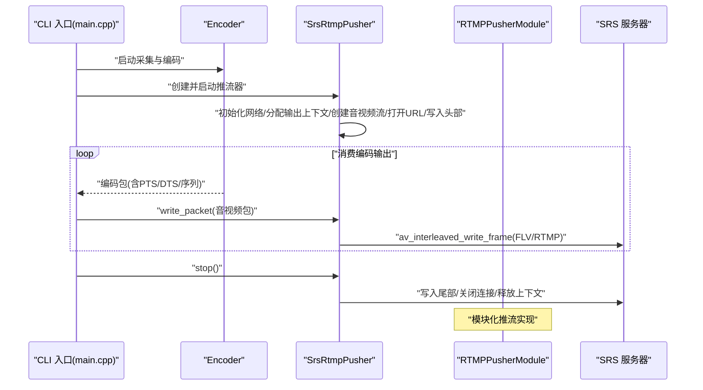
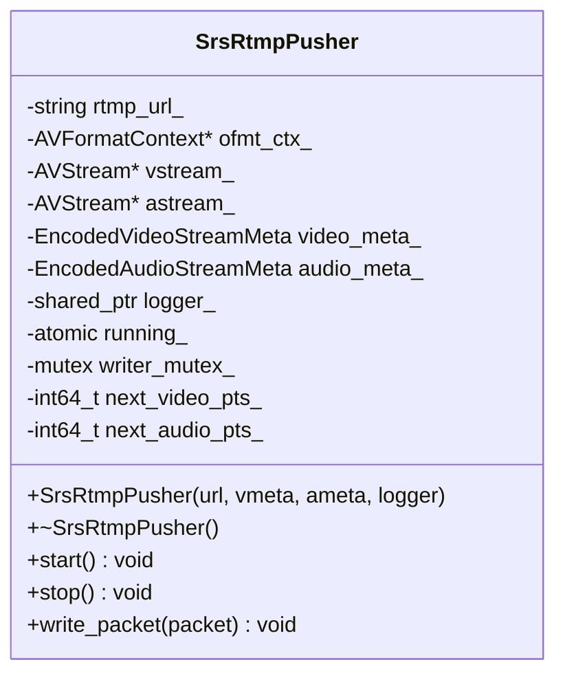
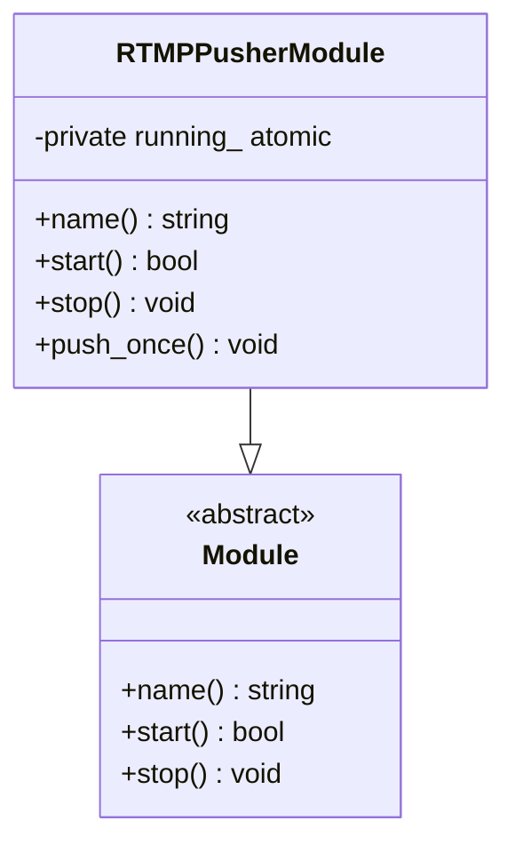
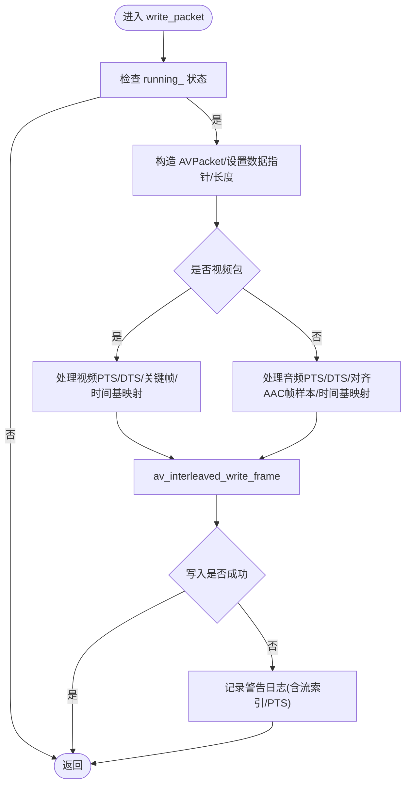
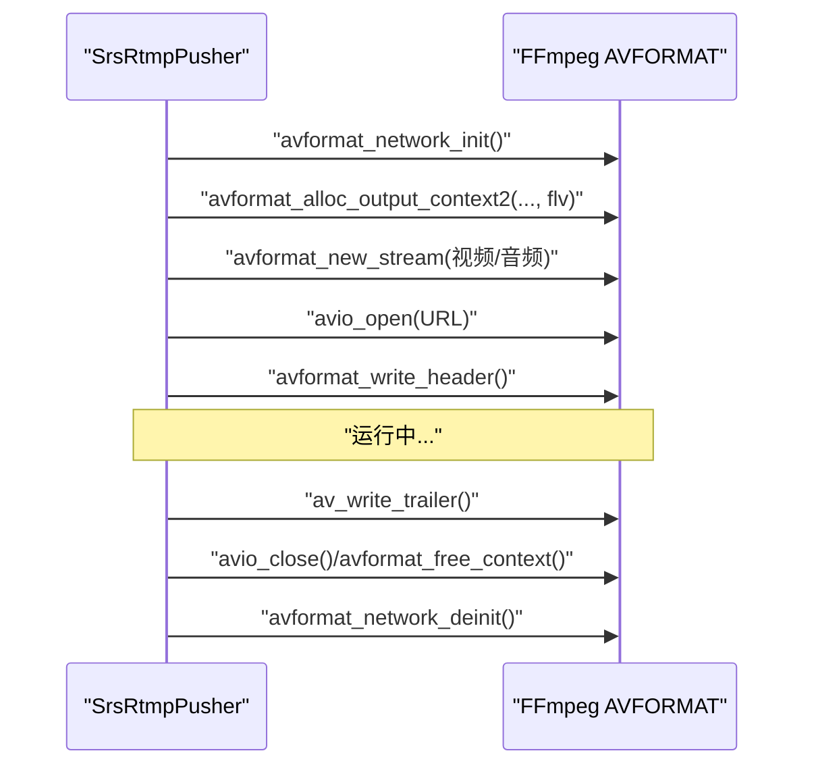
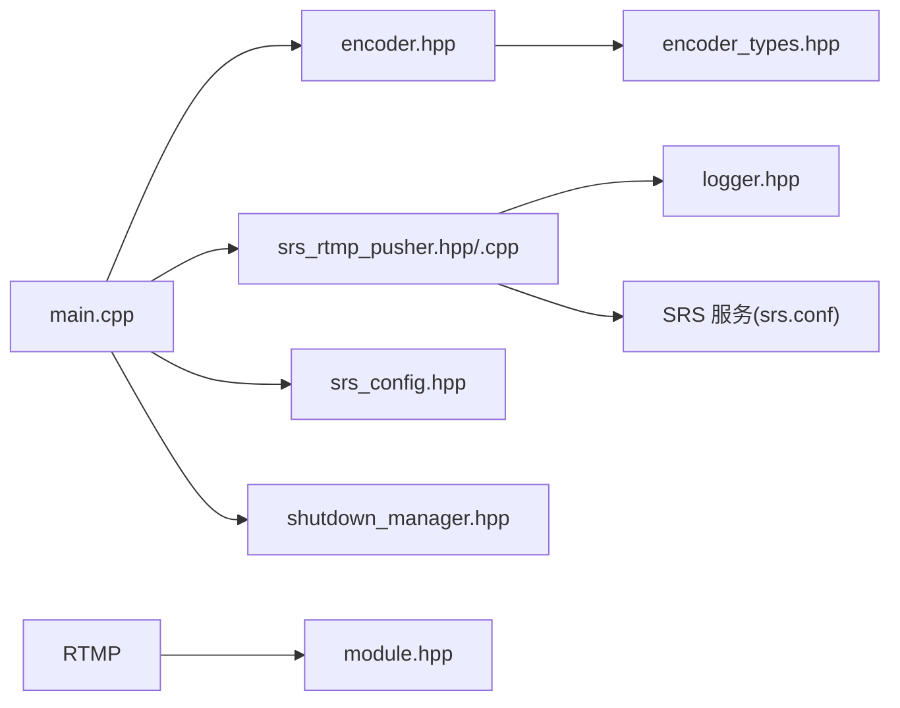
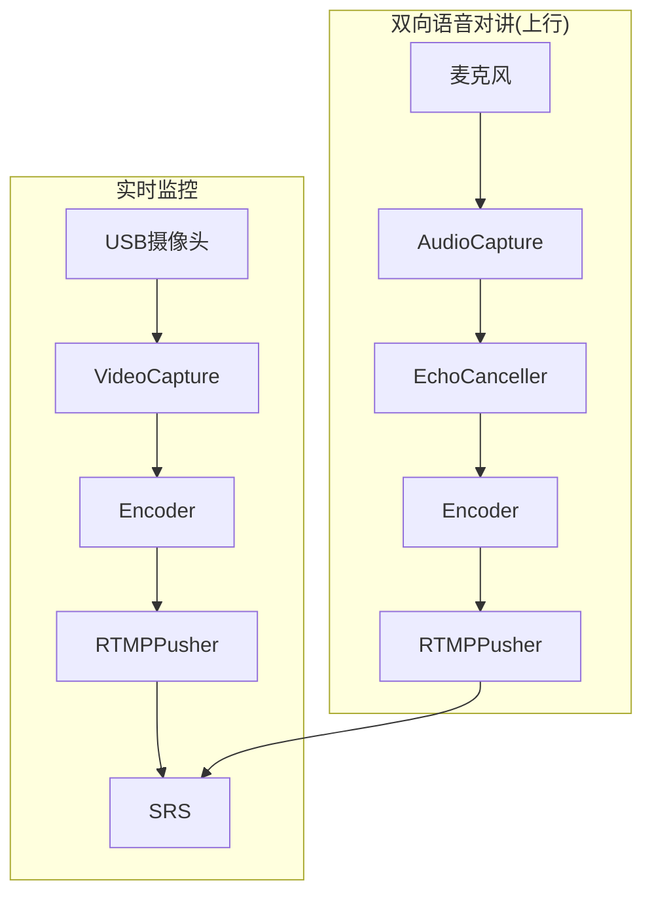

# RTMP 推流工具

<cite>
**本文引用的文件**
- [rtmp_publisher_module.hpp](file://project/agent/src/modules/external_access/rtmp_pusher/include/rtmp_pusher/rtmp_publisher_module.hpp)
- [rtmp_publisher_module.cpp](file://project/agent/src/modules/external_access/rtmp_pusher/rtmp_publisher_module.cpp)
- [srs_rtmp_pusher.hpp](file://project/agent/cli/srs/srs_rtmp_pusher.hpp)
- [srs_rtmp_pusher.cpp](file://project/agent/cli/srs/srs_rtmp_pusher.cpp)
- [main.cpp](file://project/agent/cli/srs/main.cpp)
- [srs_config.hpp](file://project/agent/cli/srs/srs_config.hpp)
- [README.md](file://project/agent/cli/srs/README.md)
- [encoder.hpp](file://project/agent/src/modules/processing/encoder/include/processing_encoder/encoder.hpp)
- [encoder_types.hpp](file://project/agent/src/modules/processing/encoder/include/processing_encoder/encoder_types.hpp)
- [module.hpp](file://project/agent/src/foundation/include/foundation/module.hpp)
- [shutdown_manager.hpp](file://project/agent/src/foundation/include/foundation/shutdown_manager.hpp)
- [logger.hpp](file://project/agent/src/modules/infra/log/include/infra_log/logger.hpp)
- [数据流.md](file://docs/数据流.md)
- [srs.conf](file://project/srs/conf/srs.conf)
- [run-srs.sh](file://project/srs/scripts/run-srs.sh)
</cite>

## 更新摘要
**所做更改**
- 更新了模块目录重命名为 'rtmp_pusher' 后的相关引用和路径说明
- 新增了 RTMPPusherModule 类的详细分析，作为外部访问模块的一部分
- 更新了项目结构图和依赖关系图，反映新的模块组织方式
- 完善了 RTMP 推流工具的架构说明，包括模块化设计和组件交互

## 目录
1. [简介](#简介)
2. [项目结构](#项目结构)
3. [核心组件](#核心组件)
4. [架构总览](#架构总览)
5. [详细组件分析](#详细组件分析)
6. [依赖分析](#依赖分析)
7. [性能考虑](#性能考虑)
8. [故障排除指南](#故障排除指南)
9. [结论](#结论)
10. [附录](#附录)

## 简介
本文件面向 RTMP 推流工具的技术文档，重点解释如何将音视频数据通过 SRS RTMP 服务器进行实时分发。文档围绕 SrsRtmpPusher 和 RTMPPusherModule 的实现原理展开，涵盖 RTMP 协议处理、网络连接管理、流媒体数据传输、配置方法、使用示例、网络优化建议、断线重连机制、推流质量监控与故障排除。

## 项目结构
该工具位于 agent 子项目的 CLI 示例中，采用模块化设计，结合采集、编码、推流三个阶段完成从本地设备到 SRS 的完整链路。模块目录已重命名为 'rtmp_pusher'，体现了更好的代码组织和功能分离。

```mermaid
graph TB
subgraph "CLI 示例"
M["main.cpp<br/>命令行入口"]
CFG["srs_config.hpp<br/>默认配置"]
PUSH["srs_rtmp_pusher.hpp/.cpp<br/>SrsRtmpPusher"]
END
subgraph "外部访问模块"
RTMP["rtmp_publisher_module.hpp/.cpp<br/>RTMPPusherModule"]
END
subgraph "编码模块"
ENC["encoder.hpp<br/>Encoder"]
ET["encoder_types.hpp<br/>编码类型/元数据"]
END
subgraph "基础设施"
LOG["logger.hpp<br/>日志接口"]
SHD["shutdown_manager.hpp<br/>关机管理"]
MOD["module.hpp<br/>模块基类"]
END
subgraph "SRS 服务"
SRS["srs.conf<br/>服务配置"]
RUN["run-srs.sh<br/>启动脚本"]
END
M --> ENC
M --> PUSH
M --> CFG
M --> SHD
PUSH --> LOG
RTMP --> MOD
ENC --> ET
M --> LOG
PUSH --> SRS
RUN --> SRS
```

**图表来源**
- [main.cpp:24-131](file://project/agent/cli/srs/main.cpp#L24-L131)
- [srs_rtmp_pusher.hpp:17-46](file://project/agent/cli/srs/srs_rtmp_pusher.hpp#L17-L46)
- [srs_rtmp_pusher.cpp:10-104](file://project/agent/cli/srs/srs_rtmp_pusher.cpp#L10-L104)
- [rtmp_publisher_module.hpp:10-19](file://project/agent/src/modules/external_access/rtmp_pusher/include/rtmp_pusher/rtmp_publisher_module.hpp#L10-L19)
- [rtmp_publisher_module.cpp:3-21](file://project/agent/src/modules/external_access/rtmp_pusher/rtmp_publisher_module.cpp#L3-L21)
- [encoder.hpp:16-90](file://project/agent/src/modules/processing/encoder/include/processing_encoder/encoder.hpp#L16-L90)
- [encoder_types.hpp:13-75](file://project/agent/src/modules/processing/encoder/include/processing_encoder/encoder_types.hpp#L13-L75)
- [srs_config.hpp:5-17](file://project/agent/cli/srs/srs_config.hpp#L5-L17)
- [shutdown_manager.hpp:5-9](file://project/agent/src/foundation/include/foundation/shutdown_manager.hpp#L5-L9)
- [logger.hpp:7-22](file://project/agent/src/modules/infra/log/include/infra_log/logger.hpp#L7-L22)
- [srs.conf:21-60](file://project/srs/conf/srs.conf#L21-L60)
- [run-srs.sh:1-13](file://project/srs/scripts/run-srs.sh#L1-L13)

**章节来源**
- [main.cpp:24-131](file://project/agent/cli/srs/main.cpp#L24-L131)
- [srs_rtmp_pusher.hpp:17-46](file://project/agent/cli/srs/srs_rtmp_pusher.hpp#L17-L46)
- [srs_rtmp_pusher.cpp:10-104](file://project/agent/cli/srs/srs_rtmp_pusher.cpp#L10-L104)
- [rtmp_publisher_module.hpp:10-19](file://project/agent/src/modules/external_access/rtmp_pusher/include/rtmp_pusher/rtmp_publisher_module.hpp#L10-L19)
- [rtmp_publisher_module.cpp:3-21](file://project/agent/src/modules/external_access/rtmp_pusher/rtmp_publisher_module.cpp#L3-L21)
- [encoder.hpp:16-90](file://project/agent/src/modules/processing/encoder/include/processing_encoder/encoder.hpp#L16-L90)
- [encoder_types.hpp:13-75](file://project/agent/src/modules/processing/encoder/include/processing_encoder/encoder_types.hpp#L13-L75)
- [srs_config.hpp:5-17](file://project/agent/cli/srs/srs_config.hpp#L5-L17)
- [shutdown_manager.hpp:5-9](file://project/agent/src/foundation/include/foundation/shutdown_manager.hpp#L5-L9)
- [logger.hpp:7-22](file://project/agent/src/modules/infra/log/include/infra_log/logger.hpp#L7-L22)
- [srs.conf:21-60](file://project/srs/conf/srs.conf#L21-L60)
- [run-srs.sh:1-13](file://project/srs/scripts/run-srs.sh#L1-L13)

## 核心组件
- SrsRtmpPusher：负责 RTMP 推流生命周期管理、FFmpeg/AVFORMAT 初始化、流参数配置、音视频包写入与时间戳处理。
- RTMPPusherModule：作为外部访问模块的 RTMP 推流实现，继承自基础 Module 类，提供模块化的推流功能。
- Encoder：负责音视频采集、编码、元数据产出与多消费者分发。
- CLI 入口：负责设备参数解析、组件编排、信号处理与优雅停机。
- 日志与关机管理：统一的日志接口与信号处理，确保稳定退出。
- SRS 配置：服务端配置与启动脚本，便于快速验证推流效果。

**章节来源**
- [srs_rtmp_pusher.hpp:17-46](file://project/agent/cli/srs/srs_rtmp_pusher.hpp#L17-L46)
- [srs_rtmp_pusher.cpp:10-193](file://project/agent/cli/srs/srs_rtmp_pusher.cpp#L10-L193)
- [rtmp_publisher_module.hpp:10-19](file://project/agent/src/modules/external_access/rtmp_pusher/include/rtmp_pusher/rtmp_publisher_module.hpp#L10-L19)
- [rtmp_publisher_module.cpp:3-21](file://project/agent/src/modules/external_access/rtmp_pusher/rtmp_publisher_module.cpp#L3-L21)
- [encoder.hpp:16-90](file://project/agent/src/modules/processing/encoder/include/processing_encoder/encoder.hpp#L16-L90)
- [main.cpp:24-131](file://project/agent/cli/srs/main.cpp#L24-L131)
- [logger.hpp:7-22](file://project/agent/src/modules/infra/log/include/infra_log/logger.hpp#L7-L22)
- [shutdown_manager.hpp:5-9](file://project/agent/src/foundation/include/foundation/shutdown_manager.hpp#L5-L9)

## 架构总览
下图展示了从采集到推流的关键交互流程，以及与 SRS 的对接方式。新的模块化架构将推流功能封装为独立的 RTMPPusherModule。



**图表来源**
- [main.cpp:42-131](file://project/agent/cli/srs/main.cpp#L42-L131)
- [srs_rtmp_pusher.cpp:24-104](file://project/agent/cli/srs/srs_rtmp_pusher.cpp#L24-L104)
- [encoder.hpp:32-36](file://project/agent/src/modules/processing/encoder/include/processing_encoder/encoder.hpp#L32-L36)
- [rtmp_publisher_module.cpp:7-18](file://project/agent/src/modules/external_access/rtmp_pusher/rtmp_publisher_module.cpp#L7-L18)

## 详细组件分析

### SrsRtmpPusher 实现原理
SrsRtmpPusher 基于 FFmpeg 的 libavformat/avcodec/avutil，完成 RTMP 推流的核心职责：
- 网络初始化与资源清理：在 start()/stop() 中调用网络初始化/反初始化，确保资源正确释放。
- 输出上下文与流创建：分配 FLV 输出上下文，创建视频/音频流并设置时间基、编解码参数与 extradata。
- 连接与头部写入：打开 RTMP URL，写入 FLV 头部，准备发送音视频帧。
- 包写入与时间戳处理：将编码器输出的包转换为 AVPacket，处理 PTS/DTS（含 AV_NOPTS_VALUE 的单调补齐），设置关键帧标志与流索引，最终通过 av_interleaved_write_frame 写出。



**图表来源**
- [srs_rtmp_pusher.hpp:17-46](file://project/agent/cli/srs/srs_rtmp_pusher.hpp#L17-L46)

**章节来源**
- [srs_rtmp_pusher.hpp:17-46](file://project/agent/cli/srs/srs_rtmp_pusher.hpp#L17-L46)
- [srs_rtmp_pusher.cpp:10-193](file://project/agent/cli/srs/srs_rtmp_pusher.cpp#L10-L193)

### RTMPPusherModule 模块化设计
RTMPPusherModule 作为外部访问模块的一部分，提供了模块化的 RTMP 推流功能：
- 继承自基础 Module 类，遵循统一的模块接口规范
- 提供模块名称标识、启动/停止控制和单次推送接口
- 使用原子布尔变量管理运行状态，支持线程安全的操作
- 作为独立模块可与其他外部访问功能（HTTP、WebSocket）协同工作



**图表来源**
- [rtmp_publisher_module.hpp:10-19](file://project/agent/src/modules/external_access/rtmp_pusher/include/rtmp_pusher/rtmp_publisher_module.hpp#L10-L19)
- [module.hpp:7-14](file://project/agent/src/foundation/include/foundation/module.hpp#L7-L14)

**章节来源**
- [rtmp_publisher_module.hpp:10-19](file://project/agent/src/modules/external_access/rtmp_pusher/include/rtmp_pusher/rtmp_publisher_module.hpp#L10-L19)
- [rtmp_publisher_module.cpp:3-21](file://project/agent/src/modules/external_access/rtmp_pusher/rtmp_publisher_module.cpp#L3-L21)

### RTMP 协议处理与时间戳策略
- 时间基映射：将编码器提供的 time_base 映射到对应 AVStream 的 time_base，保证 PTS/DTS 与流时间基一致。
- 无效 PTS/DTS 补齐：当编码器输出 AV_NOPTS_VALUE 时，使用单调递增的 next_video_pts_/next_audio_pts_ 进行补齐，避免 FLV 时间轴紊乱。
- 音频时间戳对齐：针对 AAC-LC 常见帧样本数（如 1024）进行对齐，确保音频时间戳与实际采样点对齐。
- 关键帧标记：对视频关键帧设置 AV_PKT_FLAG_KEY，提升播放器解码效率与稳定性。



**图表来源**
- [srs_rtmp_pusher.cpp:132-191](file://project/agent/cli/srs/srs_rtmp_pusher.cpp#L132-L191)

**章节来源**
- [srs_rtmp_pusher.cpp:132-191](file://project/agent/cli/srs/srs_rtmp_pusher.cpp#L132-L191)

### 网络连接管理与生命周期
- start()：初始化网络、分配输出上下文、创建音视频流、打开 RTMP URL、写入头部，设置运行状态。
- stop()：写入尾部、关闭 IO、释放上下文、反初始化网络、记录完成日志。
- 并发安全：写包路径使用互斥锁保护，运行状态使用原子变量读取，避免竞态。



**图表来源**
- [srs_rtmp_pusher.cpp:24-129](file://project/agent/cli/srs/srs_rtmp_pusher.cpp#L24-L129)

**章节来源**
- [srs_rtmp_pusher.cpp:24-129](file://project/agent/cli/srs/srs_rtmp_pusher.cpp#L24-L129)

### 配置方法与参数说明
- 服务器地址：可通过命令行第三个参数覆盖默认 RTMP 地址。
- 流参数：由编码器生成的视频/音频元数据决定，包含编解码 ID、时间基、分辨率/采样率/声道等。
- 设备参数：可通过命令行前两个参数指定视频/音频设备，默认值来自配置结构体。
- 默认配置：包含分辨率、帧率、音频采样率/声道、设备名称与默认 RTMP 地址。

**章节来源**
- [main.cpp:25-31](file://project/agent/cli/srs/main.cpp#L25-L31)
- [srs_config.hpp:5-17](file://project/agent/cli/srs/srs_config.hpp#L5-L17)

### 使用示例与最佳实践
- 启动 SRS：使用提供的 Docker 命令或本地二进制启动，监听 1935 端口。
- 构建与运行：在 agent 目录下构建 CLI 示例，运行默认推流或传入自定义设备与 RTMP 地址。
- 验证拉流：使用 ffplay 或 VLC 播放默认 RTMP 地址。
- 优雅停机：按 Ctrl+C 触发信号，系统依次停止消费线程、编码器、推流器与采集器。

**章节来源**
- [README.md:1-106](file://project/agent/cli/srs/README.md#L1-L106)
- [main.cpp:24-131](file://project/agent/cli/srs/main.cpp#L24-L131)
- [run-srs.sh:1-13](file://project/srs/scripts/run-srs.sh#L1-L13)

### 断线重连机制与稳定性建议
- 当前实现未内置自动重连逻辑。建议在调用层（CLI 或上层模块）检测写入错误后进行指数退避重试，重建推流器实例并重新写入头部。
- 保持编码器与推流器的时钟对齐，避免因时间基准漂移导致的抖动或卡顿。
- 在高负载场景下，适当降低帧率或分辨率，或调整编码器比特率，以减轻网络拥塞风险。

**章节来源**
- [srs_rtmp_pusher.cpp:183-190](file://project/agent/cli/srs/srs_rtmp_pusher.cpp#L183-L190)

## 依赖分析
- 组件耦合：CLI 入口依赖 Encoder 与 SrsRtmpPusher；SrsRtmpPusher 依赖日志接口与 FFmpeg 库；RTMPPusherModule 依赖基础 Module 接口；Encoder 依赖采集提供者与编码类型定义。
- 外部依赖：FFmpeg（libavformat/libavcodec/libavutil）、SRS 服务端。
- 潜在循环依赖：当前文件组织清晰，未发现直接循环依赖。



**图表来源**
- [main.cpp:1-131](file://project/agent/cli/srs/main.cpp#L1-L131)
- [srs_rtmp_pusher.hpp:1-13](file://project/agent/cli/srs/srs_rtmp_pusher.hpp#L1-L13)
- [rtmp_publisher_module.hpp:1-13](file://project/agent/src/modules/external_access/rtmp_pusher/include/rtmp_pusher/rtmp_publisher_module.hpp#L1-L13)
- [encoder.hpp:1-90](file://project/agent/src/modules/processing/encoder/include/processing_encoder/encoder.hpp#L1-L90)
- [encoder_types.hpp:1-75](file://project/agent/src/modules/processing/encoder/include/processing_encoder/encoder_types.hpp#L1-L75)
- [srs_config.hpp:1-19](file://project/agent/cli/srs/srs_config.hpp#L1-L19)
- [logger.hpp:1-25](file://project/agent/src/modules/infra/log/include/infra_log/logger.hpp#L1-L25)
- [srs.conf:1-60](file://project/srs/conf/srs.conf#L1-L60)

**章节来源**
- [main.cpp:1-131](file://project/agent/cli/srs/main.cpp#L1-L131)
- [srs_rtmp_pusher.hpp:1-13](file://project/agent/cli/srs/srs_rtmp_pusher.hpp#L1-L13)
- [rtmp_publisher_module.hpp:1-13](file://project/agent/src/modules/external_access/rtmp_pusher/include/rtmp_pusher/rtmp_publisher_module.hpp#L1-L13)
- [encoder.hpp:1-90](file://project/agent/src/modules/processing/encoder/include/processing_encoder/encoder.hpp#L1-L90)
- [encoder_types.hpp:1-75](file://project/agent/src/modules/processing/encoder/include/processing_encoder/encoder_types.hpp#L1-L75)
- [logger.hpp:1-25](file://project/agent/src/modules/infra/log/include/infra_log/logger.hpp#L1-L25)
- [srs.conf:1-60](file://project/srs/conf/srs.conf#L1-L60)

## 性能考虑
- 时间戳一致性：确保视频/音频 PTS/DTS 基于统一的采集时刻对齐，减少声画不同步与抖动。
- 缓冲与批处理：编码器输出批处理后逐包推流，避免单包阻塞；合理设置编码器队列容量与消费线程批大小。
- 网络拥塞控制：在高带宽场景下适当降低帧率/分辨率或启用硬件编码，减少丢包与重传。
- 日志级别：生产环境建议降低日志级别，避免频繁 I/O 影响吞吐。

## 故障排除指南
- H.264 打包格式不匹配（Annex B vs AVCC）：SRS 在 HLS 转封装时可能误判，需在服务端关闭"优先尝试 Annex B"，或确保推流端使用正确的 AVCC 打包。
- 无效 PTS（AV_NOPTS_VALUE）：推流端会进行单调补齐，但频繁出现提示编码器未正确设置时间戳，应检查编码器时间戳生成逻辑。
- 声画不同步：确认视频/音频基于同一采集时刻对齐，避免仅使用帧序号或采样点计数不一致。
- Broken pipe：SRS 在发布失败后会断开 RTMP，客户端继续写入会报错，需在上层实现重连与错误恢复。

**章节来源**
- [README.md:63-106](file://project/agent/cli/srs/README.md#L63-L106)
- [srs_rtmp_pusher.cpp:146-173](file://project/agent/cli/srs/srs_rtmp_pusher.cpp#L146-L173)

## 结论
SrsRtmpPusher 通过 FFmpeg 完成 RTMP 推流的底层协议处理，具备完善的生命周期管理与时间戳处理能力。RTMPPusherModule 作为模块化设计的体现，提供了标准化的推流接口。结合编码器与 CLI 入口，可快速搭建从本地采集到 SRS 的稳定推流链路。针对生产环境，建议补充断线重连、动态参数调节与更细粒度的质量监控，以进一步提升稳定性与用户体验。

## 附录

### 数据流概览
以下图示展示了主要数据路径，其中 RTMP 推流位于"实时监控"与"双向语音对讲"的上行链路中。



**图表来源**
- [数据流.md:1-33](file://docs/数据流.md#L1-L33)

**章节来源**
- [数据流.md:1-33](file://docs/数据流.md#L1-L33)