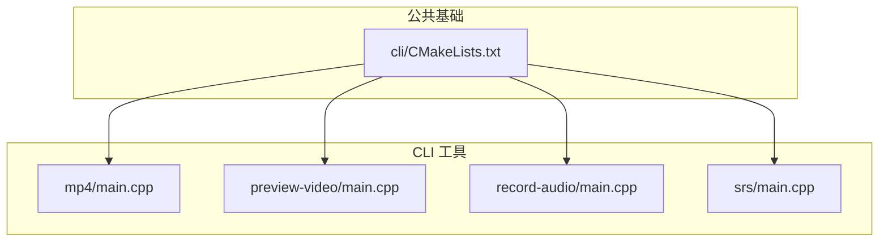
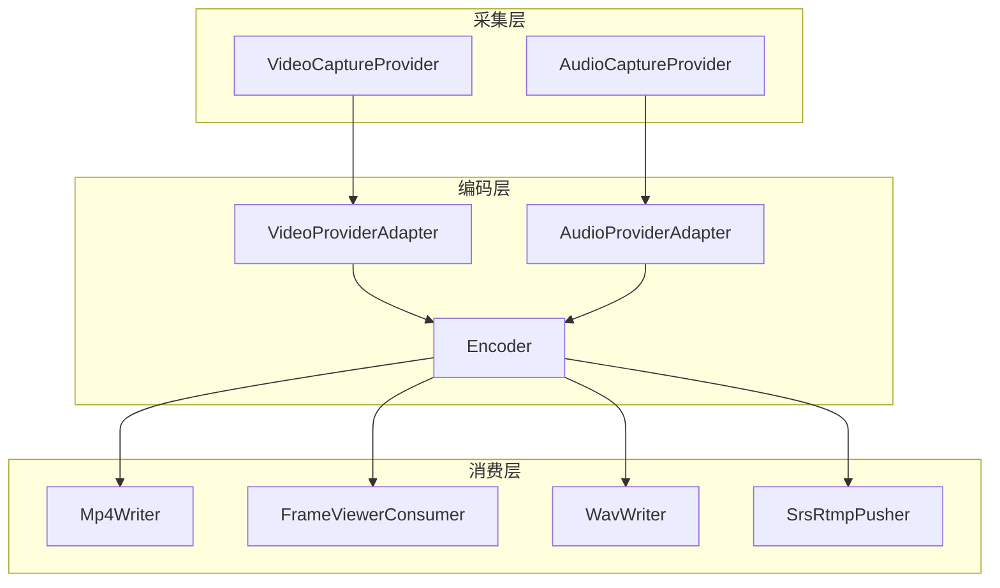
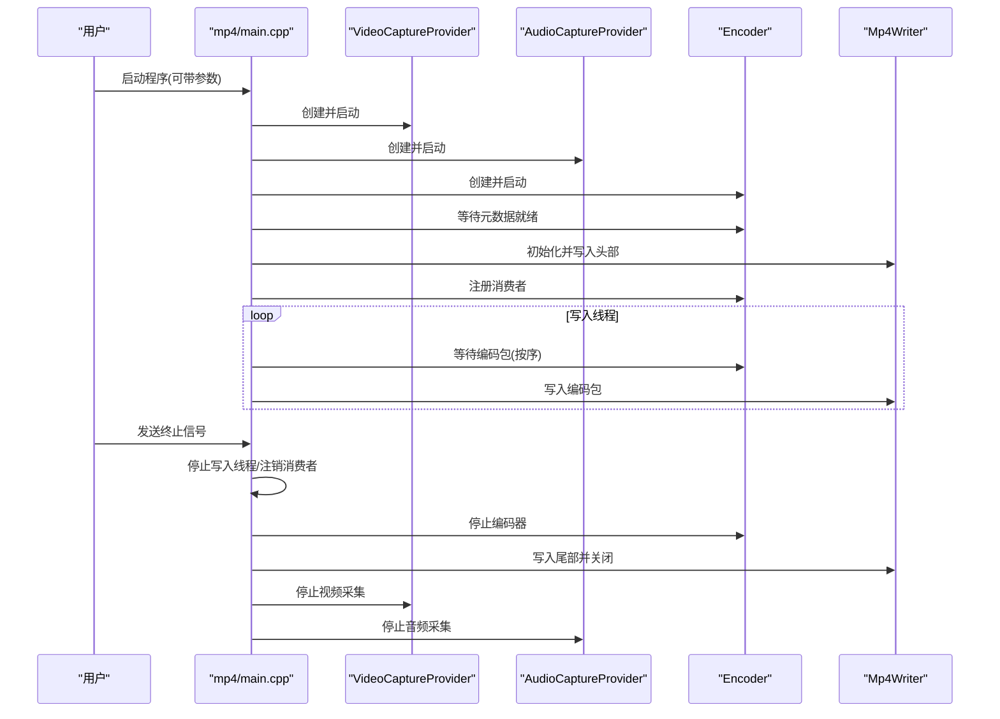
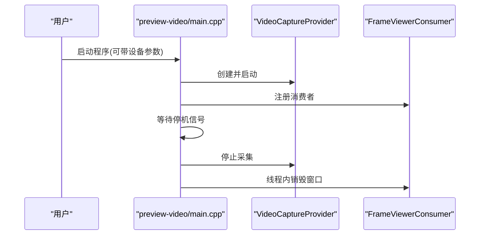
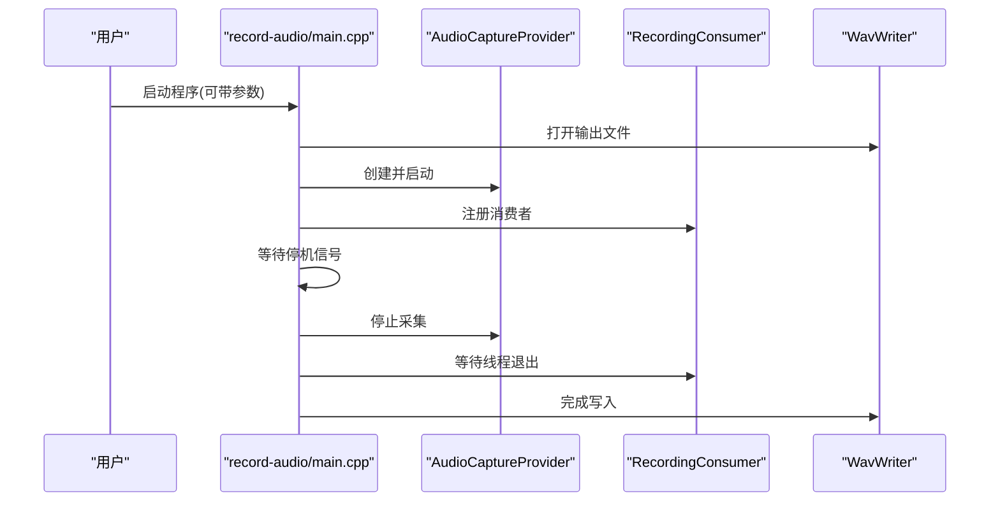
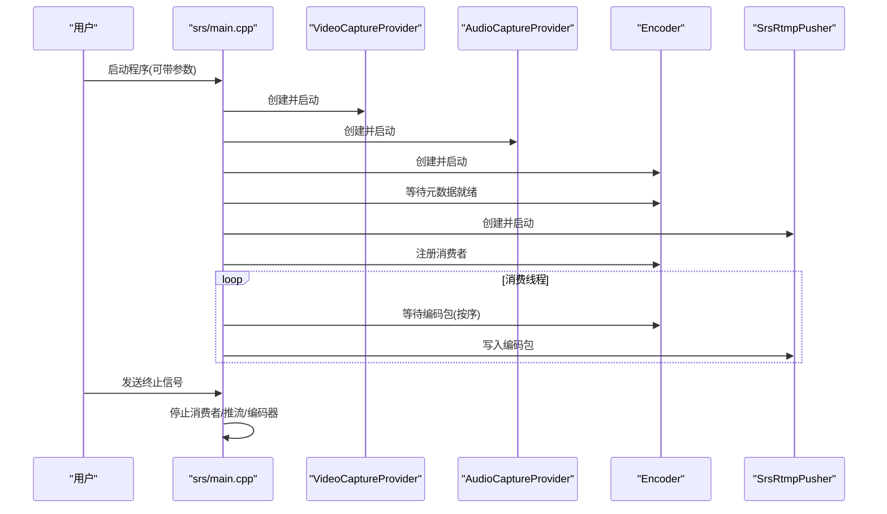
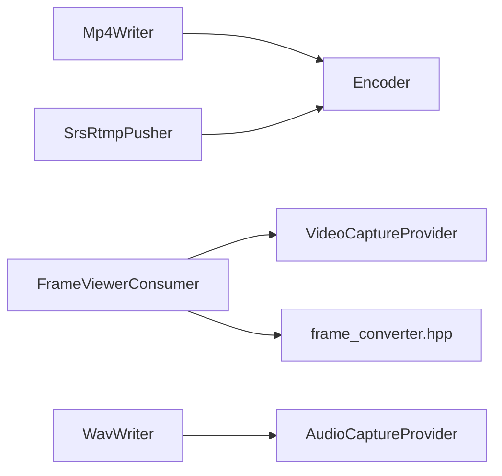

# 命令行工具集

<cite>
**本文引用的文件**
- [project/agent/cli/CMakeLists.txt](file://project/agent/cli/CMakeLists.txt)
- [project/agent/cli/mp4/main.cpp](file://project/agent/cli/mp4/main.cpp)
- [project/agent/cli/mp4/mp4_writer.hpp](file://project/agent/cli/mp4/mp4_writer.hpp)
- [project/agent/cli/preview-video/main.cpp](file://project/agent/cli/preview-video/main.cpp)
- [project/agent/cli/preview-video/frame_viewer_consumer.hpp](file://project/agent/cli/preview-video/frame_viewer_consumer.hpp)
- [project/agent/cli/preview-video/frame_converter.hpp](file://project/agent/cli/preview-video/frame_converter.hpp)
- [project/agent/cli/record-audio/main.cpp](file://project/agent/cli/record-audio/main.cpp)
- [project/agent/cli/record-audio/recording_consumer.hpp](file://project/agent/cli/record-audio/recording_consumer.hpp)
- [project/agent/cli/record-audio/wav_writer.hpp](file://project/agent/cli/record-audio/wav_writer.hpp)
- [project/agent/cli/srs/main.cpp](file://project/agent/cli/srs/main.cpp)
- [project/agent/cli/srs/srs_config.hpp](file://project/agent/cli/srs/srs_config.hpp)
- [project/agent/cli/srs/srs_rtmp_pusher.hpp](file://project/agent/cli/srs/srs_rtmp_pusher.hpp)
</cite>

## 目录
1. [简介](#简介)
2. [项目结构](#项目结构)
3. [核心组件](#核心组件)
4. [架构总览](#架构总览)
5. [详细组件分析](#详细组件分析)
6. [依赖分析](#依赖分析)
7. [性能考虑](#性能考虑)
8. [故障排除指南](#故障排除指南)
9. [结论](#结论)
10. [附录](#附录)

## 简介
本文件为命令行工具集的技术文档，覆盖以下四个 CLI 工具：
- MP4 录制工具：将摄像头与麦克风采集的音视频实时编码并写入 MP4 文件。
- 视频预览工具：以本地窗口实时显示摄像头画面，便于调试与确认。
- 音频录制工具：将麦克风采集的 PCM 音频写入 WAV 文件。
- RTMP 推流工具：将摄像头与麦克风采集的音视频实时编码并通过 RTMP 推送到 SRS。

文档内容涵盖各工具的功能、命令行参数、配置项、使用示例、实现原理（视频帧转换、音频处理、文件写入、网络传输）、集成与自动化建议以及故障排除。

## 项目结构
命令行工具位于 agent 的 CLI 子目录中，采用按功能分层的组织方式：
- mp4：MP4 录制工具
- preview-video：视频预览工具
- record-audio：音频录制工具
- srs：RTMP 推流工具
- 根级 CMakeLists.txt 负责聚合子目录构建

图表来源
- [project/agent/cli/CMakeLists.txt:1-5](file://project/agent/cli/CMakeLists.txt#L1-L5)
- [project/agent/cli/mp4/main.cpp:1-124](file://project/agent/cli/mp4/main.cpp#L1-L124)
- [project/agent/cli/preview-video/main.cpp:1-60](file://project/agent/cli/preview-video/main.cpp#L1-L60)
- [project/agent/cli/record-audio/main.cpp:1-79](file://project/agent/cli/record-audio/main.cpp#L1-L79)
- [project/agent/cli/srs/main.cpp:1-131](file://project/agent/cli/srs/main.cpp#L1-L131)

章节来源
- [project/agent/cli/CMakeLists.txt:1-5](file://project/agent/cli/CMakeLists.txt#L1-L5)

## 核心组件
- 音视频采集提供者：封装摄像头与麦克风的采集接口，支持设置分辨率、帧率、缓冲区与队列容量。
- 编码器与适配器：对采集到的原始帧进行编码，生成可写入容器或推流的编码包。
- 容器写入器：将编码后的包写入 MP4 或 RTMP 输出格式上下文。
- 消费者模式：各 CLI 工具通过“消费者”从编码器拉取编码包，执行具体动作（写文件/推流/显示）。

章节来源
- [project/agent/cli/mp4/main.cpp:48-68](file://project/agent/cli/mp4/main.cpp#L48-L68)
- [project/agent/cli/preview-video/main.cpp:34-39](file://project/agent/cli/preview-video/main.cpp#L34-L39)
- [project/agent/cli/record-audio/main.cpp:53-57](file://project/agent/cli/record-audio/main.cpp#L53-L57)
- [project/agent/cli/srs/main.cpp:42-61](file://project/agent/cli/srs/main.cpp#L42-L61)

## 架构总览
四个工具共享统一的采集-编码-消费架构，差异在于“消费者”实现与输出目标：
- 采集层：VideoCaptureProvider/AudioCaptureProvider
- 编码层：VideoProviderAdapter/AudioProviderAdapter + Encoder
- 消费层：Mp4Writer/FrameViewerConsumer/WavWriter/SrsRtmpPusher
- 控制层：统一的信号处理与优雅停机

图表来源
- [project/agent/cli/mp4/main.cpp:48-68](file://project/agent/cli/mp4/main.cpp#L48-L68)
- [project/agent/cli/preview-video/main.cpp:34-39](file://project/agent/cli/preview-video/main.cpp#L34-L39)
- [project/agent/cli/record-audio/main.cpp:53-57](file://project/agent/cli/record-audio/main.cpp#L53-L57)
- [project/agent/cli/srs/main.cpp:42-61](file://project/agent/cli/srs/main.cpp#L42-L61)

## 详细组件分析

### MP4 录制工具
- 功能概述
  - 实时采集摄像头与麦克风音视频，经编码后写入 MP4 文件。
  - 支持通过命令行指定视频设备、音频设备与输出文件路径。
- 命令行参数
  - 可选参数：视频设备路径、音频设备名称、输出文件路径
  - 默认值：视频设备默认为 /dev/video0；音频设备默认为 ALSA default；输出文件默认为 .tmp/demo.mp4
- 关键流程
  - 初始化采集提供者与编码器，启动采集与编码
  - 等待编码器元数据就绪后初始化 Mp4Writer 并写入头部
  - 启动写入线程持续从编码器消费编码包并写入文件
  - 接收信号后停止写入线程、注销消费者、停止编码器与采集器，并写入尾部
- 实现要点
  - 使用编码器提供的消费者注册机制，按序列号顺序消费包
  - 写入线程与主线程分离，保证优雅停机
  - 错误处理：任一阶段失败均清理资源并返回非零退出码

图表来源
- [project/agent/cli/mp4/main.cpp:37-123](file://project/agent/cli/mp4/main.cpp#L37-L123)
- [project/agent/cli/mp4/mp4_writer.hpp:17-37](file://project/agent/cli/mp4/mp4_writer.hpp#L17-L37)

章节来源
- [project/agent/cli/mp4/main.cpp:37-123](file://project/agent/cli/mp4/main.cpp#L37-L123)
- [project/agent/cli/mp4/mp4_writer.hpp:17-37](file://project/agent/cli/mp4/mp4_writer.hpp#L17-L37)

### 视频预览工具
- 功能概述
  - 实时读取摄像头帧并在本地窗口显示，支持按键退出与信号停机。
- 命令行参数
  - 可选参数：视频设备路径，默认 /dev/video0
- 关键流程
  - 注册 FrameViewerConsumer 并启动 VideoCaptureProvider
  - 在独立线程中创建窗口、循环显示帧，等待按键或信号
  - 主线程等待停机信号后停止采集并销毁窗口

图表来源
- [project/agent/cli/preview-video/main.cpp:25-59](file://project/agent/cli/preview-video/main.cpp#L25-L59)
- [project/agent/cli/preview-video/frame_viewer_consumer.hpp:8-20](file://project/agent/cli/preview-video/frame_viewer_consumer.hpp#L8-L20)

章节来源
- [project/agent/cli/preview-video/main.cpp:25-59](file://project/agent/cli/preview-video/main.cpp#L25-L59)
- [project/agent/cli/preview-video/frame_viewer_consumer.hpp:8-20](file://project/agent/cli/preview-video/frame_viewer_consumer.hpp#L8-L20)
- [project/agent/cli/preview-video/frame_converter.hpp:7-7](file://project/agent/cli/preview-video/frame_converter.hpp#L7-L7)

### 音频录制工具
- 功能概述
  - 实时采集音频 PCM，写入 WAV 文件，支持指定 ALSA 设备与输出路径。
- 命令行参数
  - 可选参数：ALSA 设备名、输出 WAV 路径
  - 默认值：ALSA 设备 default；输出路径为当前目录下的 .tmp/record.wav
- 关键流程
  - 初始化 WavWriter 并打开输出文件
  - 创建 AudioCaptureProvider 与 RecordingConsumer，启动采集
  - 在独立线程中循环消费音频帧并写入 WAV
  - 接收信号后停止采集、等待线程退出并完成文件写入

图表来源
- [project/agent/cli/record-audio/main.cpp:27-78](file://project/agent/cli/record-audio/main.cpp#L27-L78)
- [project/agent/cli/record-audio/recording_consumer.hpp:10-20](file://project/agent/cli/record-audio/recording_consumer.hpp#L10-L20)
- [project/agent/cli/record-audio/wav_writer.hpp:11-48](file://project/agent/cli/record-audio/wav_writer.hpp#L11-L48)

章节来源
- [project/agent/cli/record-audio/main.cpp:27-78](file://project/agent/cli/record-audio/main.cpp#L27-L78)
- [project/agent/cli/record-audio/recording_consumer.hpp:10-20](file://project/agent/cli/record-audio/recording_consumer.hpp#L10-L20)
- [project/agent/cli/record-audio/wav_writer.hpp:11-48](file://project/agent/cli/record-audio/wav_writer.hpp#L11-L48)

### RTMP 推流工具
- 功能概述
  - 实时采集音视频并编码，通过 SrsRtmpPusher 推送到 RTMP 服务器（如 SRS）。
- 命令行参数
  - 可选参数：视频设备、音频设备、RTMP 推流地址
  - 默认值：视频设备 /dev/video0；音频设备 ALSA default；RTMP 地址默认本地 live 流
- 关键流程
  - 初始化采集与编码器，等待元数据就绪
  - 创建 SrsRtmpPusher 并启动，注册消费者持续消费编码包并写入推流器
  - 接收信号后停止消费者、注销消费者、停止推流与编码器并释放资源

图表来源
- [project/agent/cli/srs/main.cpp:24-131](file://project/agent/cli/srs/main.cpp#L24-L131)
- [project/agent/cli/srs/srs_config.hpp:5-17](file://project/agent/cli/srs/srs_config.hpp#L5-L17)
- [project/agent/cli/srs/srs_rtmp_pusher.hpp:17-46](file://project/agent/cli/srs/srs_rtmp_pusher.hpp#L17-L46)

章节来源
- [project/agent/cli/srs/main.cpp:24-131](file://project/agent/cli/srs/main.cpp#L24-L131)
- [project/agent/cli/srs/srs_config.hpp:5-17](file://project/agent/cli/srs/srs_config.hpp#L5-L17)
- [project/agent/cli/srs/srs_rtmp_pusher.hpp:17-46](file://project/agent/cli/srs/srs_rtmp_pusher.hpp#L17-L46)

## 依赖分析
- 组件耦合
  - 四个 CLI 工具均依赖采集层与编码层，消费层各自独立，耦合度低，便于扩展与维护。
- 外部依赖
  - FFmpeg/Libav（用于容器与编解码）
  - OpenCV（用于视频预览）
  - ALSA（用于音频采集）
- 关键依赖关系
  - Mp4Writer 依赖编码器输出的元数据与编码包
  - SrsRtmpPusher 依赖编码器输出的元数据与编码包
  - FrameViewerConsumer 依赖视频采集提供者与帧转换函数
  - WavWriter 依赖音频采集提供者与 PCM 数据

图表来源
- [project/agent/cli/mp4/mp4_writer.hpp:17-37](file://project/agent/cli/mp4/mp4_writer.hpp#L17-L37)
- [project/agent/cli/srs/srs_rtmp_pusher.hpp:17-46](file://project/agent/cli/srs/srs_rtmp_pusher.hpp#L17-L46)
- [project/agent/cli/preview-video/frame_viewer_consumer.hpp:8-20](file://project/agent/cli/preview-video/frame_viewer_consumer.hpp#L8-L20)
- [project/agent/cli/preview-video/frame_converter.hpp:7-7](file://project/agent/cli/preview-video/frame_converter.hpp#L7-L7)
- [project/agent/cli/record-audio/wav_writer.hpp:11-48](file://project/agent/cli/record-audio/wav_writer.hpp#L11-L48)

## 性能考虑
- 线程模型
  - 采集与消费分离，避免阻塞主控制线程，提升响应性与稳定性。
- 队列与缓冲
  - 提供者侧设置队列容量与缓冲数量，平衡延迟与吞吐；编码器侧按序消费，避免乱序。
- 编码参数
  - 合理设置分辨率、帧率与采样率，兼顾质量与资源占用。
- I/O 优化
  - MP4/RTMP 写入采用批量处理与顺序写入，减少系统调用次数。
- 时钟同步
  - RTMP 推流器对 PTS 进行单调递增补齐，避免时间戳非法导致播放异常。

## 故障排除指南
- 无法打开摄像头/麦克风
  - 检查设备路径与权限；确认设备未被其他进程占用。
- 无法创建输出文件
  - 检查输出路径是否存在写权限；必要时清理已有文件。
- 编码器元数据未就绪
  - 确认采集设备正常工作；适当增加队列容量或降低分辨率/帧率。
- 推流失败
  - 检查 RTMP 地址与网络连通性；确认服务器端已创建对应流。
- 预览窗口无画面
  - 确认 OpenCV 版本与依赖正确安装；检查帧转换函数是否可用。
- 停机后仍有残留进程
  - 确保信号处理正常；必要时手动结束相关进程。

## 结论
该命令行工具集以统一的采集-编码-消费架构为基础，分别实现了 MP4 录制、视频预览、音频录制与 RTMP 推流四大功能。通过清晰的线程模型、稳定的信号处理与良好的错误处理机制，满足了本地调试、离线录制与在线直播等多种使用场景。建议在生产环境中结合监控与日志策略，进一步完善自动化与容错能力。

## 附录
- 使用示例（命令行）
  - MP4 录制：./mp4 [/dev/videoX] [alsa_device] [output.mp4]
  - 视频预览：./preview-video [/dev/videoX]
  - 音频录制：./record-audio [default|hw:X,Y] [output.wav]
  - RTMP 推流：./srs [/dev/videoX] [alsa_device] [rtmp://host/app/stream]
- 自动化脚本建议
  - 使用定时任务或 systemd 服务管理工具生命周期
  - 结合日志轮转与磁盘空间监控
  - 对 RTMP 推流增加重试与断线自动恢复逻辑
  - 将设备参数与输出路径抽象为配置文件，便于集中管理