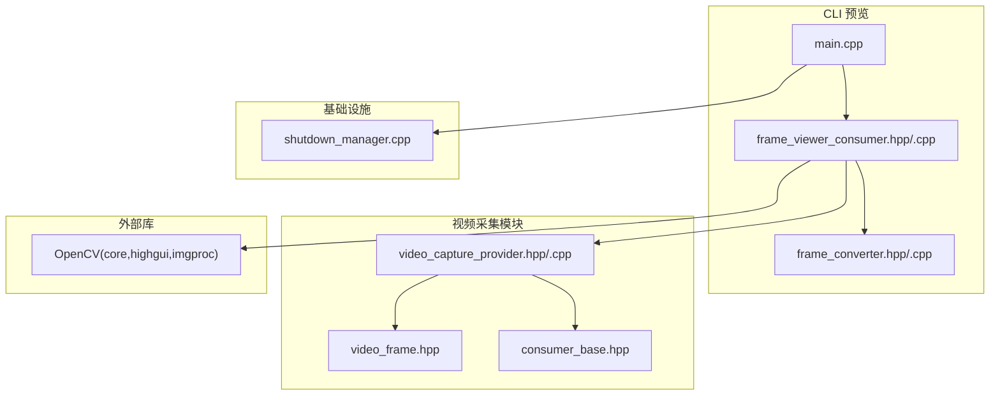
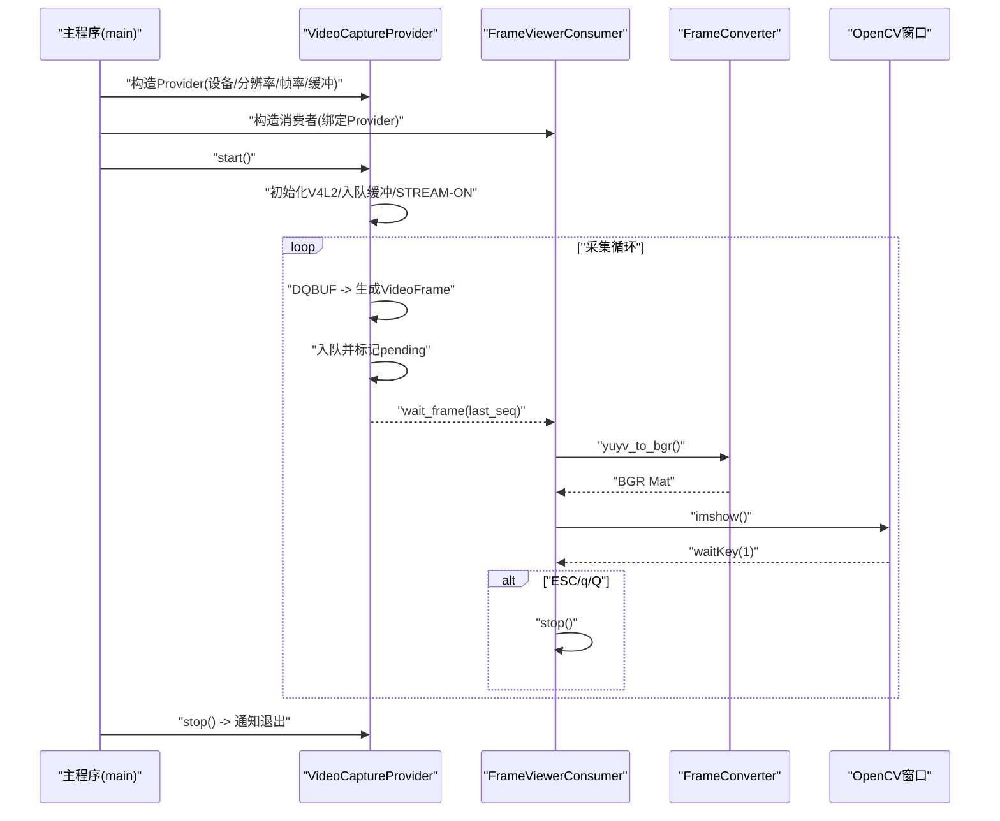
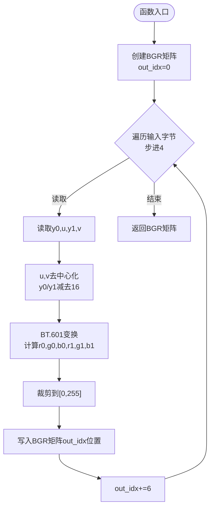
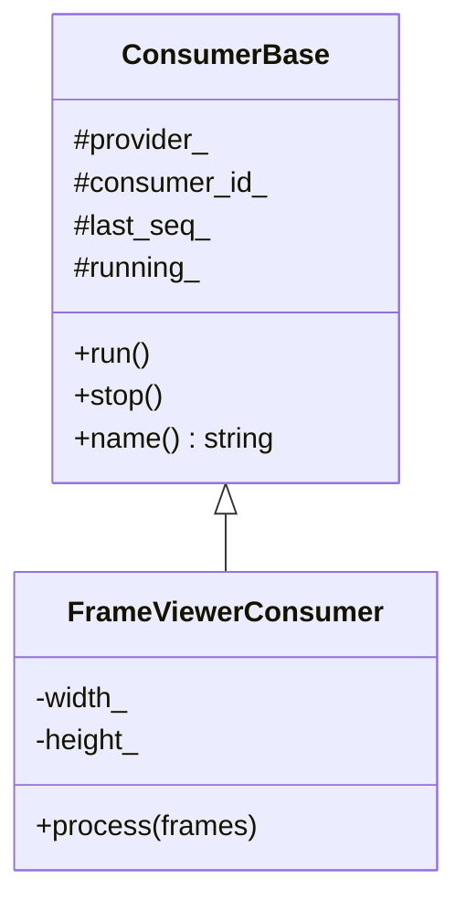
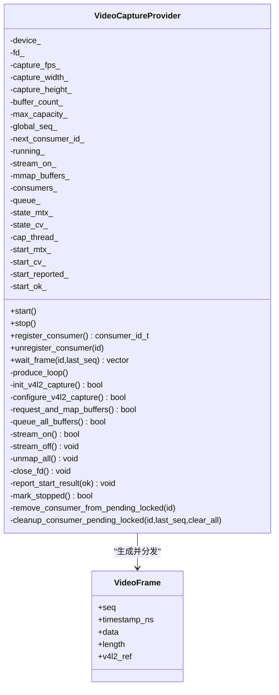
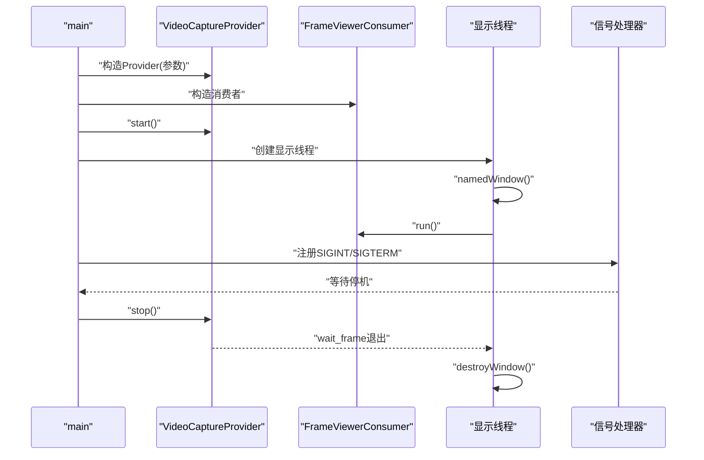
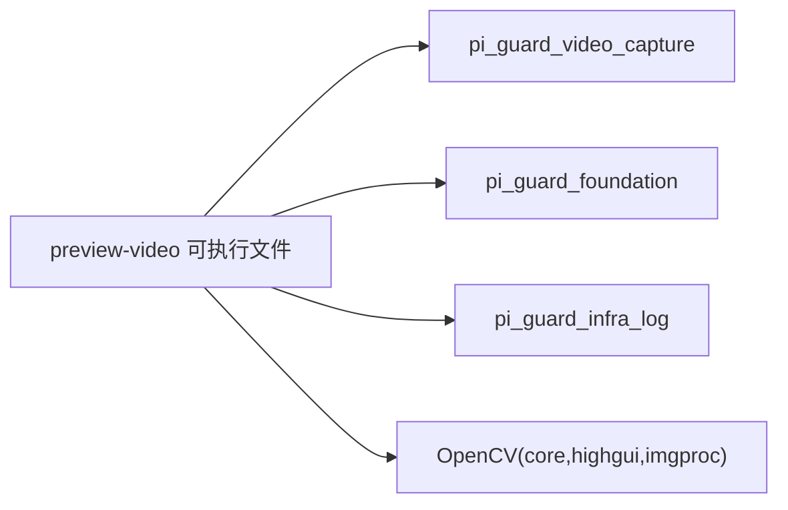

# 视频预览工具

<cite>
**本文档引用的文件**
- [frame_converter.hpp](file://project/agent/cli/preview-video/frame_converter.hpp)
- [frame_converter.cpp](file://project/agent/cli/preview-video/frame_converter.cpp)
- [frame_viewer_consumer.hpp](file://project/agent/cli/preview-video/frame_viewer_consumer.hpp)
- [frame_viewer_consumer.cpp](file://project/agent/cli/preview-video/frame_viewer_consumer.cpp)
- [main.cpp](file://project/agent/cli/preview-video/main.cpp)
- [CMakeLists.txt](file://project/agent/cli/preview-video/CMakeLists.txt)
- [consumer_base.hpp](file://project/agent/src/modules/capture/video/include/capture_video/consumer_base.hpp)
- [video_capture_provider.hpp](file://project/agent/src/modules/capture/video/include/capture_video/video_capture_provider.hpp)
- [video_capture_provider.cpp](file://project/agent/src/modules/capture/video/video_capture_provider.cpp)
- [video_frame.hpp](file://project/agent/src/modules/capture/video/include/capture_video/video_frame.hpp)
- [shutdown_manager.cpp](file://project/agent/src/foundation/shutdown_manager.cpp)
- [CMakeLists.txt](file://project/agent/CMakeLists.txt)
</cite>

## 目录
1. [简介](#简介)
2. [项目结构](#项目结构)
3. [核心组件](#核心组件)
4. [架构总览](#架构总览)
5. [详细组件分析](#详细组件分析)
6. [依赖关系分析](#依赖关系分析)
7. [性能考虑](#性能考虑)
8. [故障排查指南](#故障排查指南)
9. [结论](#结论)
10. [附录](#附录)

## 简介
本工具用于实时显示摄像头捕获的视频帧，支持以下能力：
- 通过 V4L2 采集 YUYV 格式的摄像头帧
- 将 YUYV 帧转换为 BGR 图像
- 使用 OpenCV 实时显示窗口并支持按键退出
- 提供可配置的分辨率、帧率与缓冲策略
- 支持优雅停机与线程安全的生命周期管理

## 项目结构
预览工具位于 CLI 子模块中，核心文件组织如下：
- CLI 预览程序入口与消费者
  - main.cpp
  - frame_viewer_consumer.{hpp,cpp}
  - frame_converter.{hpp,cpp}
- 视频采集与分发
  - video_capture_provider.{hpp,cpp}
  - video_frame.hpp
  - consumer_base.hpp
- 构建与依赖
  - preview-video/CMakeLists.txt
  - agent/CMakeLists.txt

图表来源
- [main.cpp:1-60](file://project/agent/cli/preview-video/main.cpp#L1-L60)
- [frame_viewer_consumer.cpp:1-35](file://project/agent/cli/preview-video/frame_viewer_consumer.cpp#L1-L35)
- [frame_converter.cpp:1-47](file://project/agent/cli/preview-video/frame_converter.cpp#L1-L47)
- [video_capture_provider.cpp:1-457](file://project/agent/src/modules/capture/video/video_capture_provider.cpp#L1-L457)
- [video_frame.hpp:1-23](file://project/agent/src/modules/capture/video/include/capture_video/video_frame.hpp#L1-L23)
- [consumer_base.hpp:1-51](file://project/agent/src/modules/capture/video/include/capture_video/consumer_base.hpp#L1-L51)
- [shutdown_manager.cpp:1-36](file://project/agent/src/foundation/shutdown_manager.cpp#L1-L36)

章节来源
- [main.cpp:1-60](file://project/agent/cli/preview-video/main.cpp#L1-L60)
- [CMakeLists.txt:1-16](file://project/agent/cli/preview-video/CMakeLists.txt#L1-L16)
- [CMakeLists.txt:1-51](file://project/agent/CMakeLists.txt#L1-L51)

## 核心组件
- FrameConverter：将 YUYV 帧转换为 BGR 图像矩阵，包含像素格式转换与数值裁剪。
- FrameViewerConsumer：继承自 ConsumerBase，负责从 Provider 拉取帧、校验数据完整性、调用转换器并显示。
- VideoCaptureProvider：封装 V4L2 采集流程，提供多消费者帧分发、队列容量控制与引用计数回收。
- ConsumerBase：抽象消费者基类，统一注册/注销、拉帧循环与停止机制。
- 主程序：初始化 Provider、注册消费者、启动采集线程、创建显示线程并处理信号停机。

章节来源
- [frame_converter.hpp:1-8](file://project/agent/cli/preview-video/frame_converter.hpp#L1-L8)
- [frame_converter.cpp:1-47](file://project/agent/cli/preview-video/frame_converter.cpp#L1-L47)
- [frame_viewer_consumer.hpp:1-21](file://project/agent/cli/preview-video/frame_viewer_consumer.hpp#L1-L21)
- [frame_viewer_consumer.cpp:1-35](file://project/agent/cli/preview-video/frame_viewer_consumer.cpp#L1-L35)
- [consumer_base.hpp:1-51](file://project/agent/src/modules/capture/video/include/capture_video/consumer_base.hpp#L1-L51)
- [video_capture_provider.hpp:1-109](file://project/agent/src/modules/capture/video/include/capture_video/video_capture_provider.hpp#L1-L109)
- [video_capture_provider.cpp:1-457](file://project/agent/src/modules/capture/video/video_capture_provider.cpp#L1-L457)
- [video_frame.hpp:1-23](file://project/agent/src/modules/capture/video/include/capture_video/video_frame.hpp#L1-L23)
- [main.cpp:1-60](file://project/agent/cli/preview-video/main.cpp#L1-L60)

## 架构总览
整体架构采用“采集-分发-消费”三层设计：
- 采集层：VideoCaptureProvider 在后台线程中通过 V4L2 DQBUF 出队帧，封装为 VideoFrame 并入队分发。
- 分发层：Provider 维护队列与 pending 集合，按消费者 last_seq 过滤可用帧，支持多消费者并行消费。
- 消费层：FrameViewerConsumer 作为具体消费者，接收帧后进行格式转换与显示，支持按键退出与优雅停机。

图表来源
- [main.cpp:25-59](file://project/agent/cli/preview-video/main.cpp#L25-L59)
- [video_capture_provider.cpp:310-401](file://project/agent/src/modules/capture/video/video_capture_provider.cpp#L310-L401)
- [frame_viewer_consumer.cpp:15-34](file://project/agent/cli/preview-video/frame_viewer_consumer.cpp#L15-L34)
- [frame_converter.cpp:15-46](file://project/agent/cli/preview-video/frame_converter.cpp#L15-L46)

## 详细组件分析

### FrameConverter：YUYV 到 BGR 转换
- 输入：原始 YUYV 数据指针、宽、高
- 处理：逐像素对 YUV 参数进行缩放与偏移，应用 BT.601 系列公式计算 RGB，最后裁剪到 0-255。
- 输出：OpenCV Mat（BGR/8UC3）

图表来源
- [frame_converter.cpp:15-46](file://project/agent/cli/preview-video/frame_converter.cpp#L15-L46)

章节来源
- [frame_converter.hpp:1-8](file://project/agent/cli/preview-video/frame_converter.hpp#L1-L8)
- [frame_converter.cpp:1-47](file://project/agent/cli/preview-video/frame_converter.cpp#L1-L47)

### FrameViewerConsumer：窗口显示与交互
- 继承 ConsumerBase，实现 process(frames)。
- 从帧向量取最新帧，校验数据非空与长度满足 YUYV@分辨率。
- 调用 yuyv_to_bgr 转换为 BGR，imshow 显示。
- waitKey(1) 获取按键，ESC/q/Q 触发 stop()。

图表来源
- [consumer_base.hpp:11-48](file://project/agent/src/modules/capture/video/include/capture_video/consumer_base.hpp#L11-L48)
- [frame_viewer_consumer.hpp:8-20](file://project/agent/cli/preview-video/frame_viewer_consumer.hpp#L8-L20)

章节来源
- [frame_viewer_consumer.hpp:1-21](file://project/agent/cli/preview-video/frame_viewer_consumer.hpp#L1-L21)
- [frame_viewer_consumer.cpp:1-35](file://project/agent/cli/preview-video/frame_viewer_consumer.cpp#L1-L35)

### VideoCaptureProvider：V4L2 采集与分发
- 初始化流程：open -> configure -> reqbufs+mmap -> qbuf -> stream on。
- 生产循环：DQBUF -> 生成 VideoFrame -> 入队 -> 通知等待消费者。
- 引用计数：通过 shared_ptr 自定义删除器在帧被队列与所有消费者释放时自动 QBUF。
- 多消费者：维护 pending 集合，按 last_seq 过滤可用帧，支持清理过期 pending。

图表来源
- [video_capture_provider.hpp:15-106](file://project/agent/src/modules/capture/video/include/capture_video/video_capture_provider.hpp#L15-L106)
- [video_frame.hpp:10-20](file://project/agent/src/modules/capture/video/include/capture_video/video_frame.hpp#L10-L20)

章节来源
- [video_capture_provider.hpp:1-109](file://project/agent/src/modules/capture/video/include/capture_video/video_capture_provider.hpp#L1-L109)
- [video_capture_provider.cpp:1-457](file://project/agent/src/modules/capture/video/video_capture_provider.cpp#L1-L457)
- [video_frame.hpp:1-23](file://project/agent/src/modules/capture/video/include/capture_video/video_frame.hpp#L1-L23)

### ConsumerBase：消费者抽象与生命周期
- 注册/注销：构造时注册，析构时注销，避免悬挂 pending。
- 拉帧循环：run() 中循环 wait_frame，调用虚函数 process，更新 last_seq。
- 停止机制：stop() 设置 atomic 标志，配合 Provider 的条件变量退出循环。

章节来源
- [consumer_base.hpp:1-51](file://project/agent/src/modules/capture/video/include/capture_video/consumer_base.hpp#L1-L51)

### 主程序：启动、显示与停机
- 参数：默认设备 /dev/video0，分辨率 640x480，帧率 30fps，缓冲数 4，Provider 队列容量 30。
- 生命周期：注册消费者 -> start() -> 创建显示线程 -> namedWindow -> run() -> destroyWindow -> stop()。
- 信号处理：SIGINT/SIGTERM 注册 ShutdownManager，主线程等待停机信号，随后 stop() 唤醒等待并 join 显示线程。

图表来源
- [main.cpp:25-59](file://project/agent/cli/preview-video/main.cpp#L25-L59)
- [shutdown_manager.cpp:16-33](file://project/agent/src/foundation/shutdown_manager.cpp#L16-L33)

章节来源
- [main.cpp:1-60](file://project/agent/cli/preview-video/main.cpp#L1-L60)
- [shutdown_manager.cpp:1-36](file://project/agent/src/foundation/shutdown_manager.cpp#L1-L36)

## 依赖关系分析
- 预览可执行文件链接：
  - pi_guard_video_capture（采集模块）
  - pi_guard_foundation（停机管理）
  - pi_guard_infra_log（日志）
  - OpenCV（core、highgui、imgproc）
- 构建系统：
  - 顶层 CMakeLists 管理子模块与安装目标
  - preview-video 子目录独立构建可执行文件

图表来源
- [CMakeLists.txt:9-15](file://project/agent/cli/preview-video/CMakeLists.txt#L9-L15)
- [CMakeLists.txt:11-27](file://project/agent/CMakeLists.txt#L11-L27)

章节来源
- [CMakeLists.txt:1-16](file://project/agent/cli/preview-video/CMakeLists.txt#L1-L16)
- [CMakeLists.txt:1-51](file://project/agent/CMakeLists.txt#L1-L51)

## 性能考虑
- 帧率与缓冲
  - 采集帧率与分辨率直接影响 CPU/GPU 占用与内存带宽。建议根据摄像头能力与显示需求调整。
  - Provider 队列容量与缓冲数影响延迟与丢帧概率，容量过小易丢帧，过大增加内存占用。
- 转换开销
  - YUYV→BGR 转换为纯 CPU 计算，复杂度 O(W×H)。可通过降低分辨率或减少刷新频率缓解。
- 显示刷新
  - waitKey(1) 控制轮询频率，建议保持低延迟同时避免过度占用 CPU。
- 线程模型
  - V4L2 采集线程与显示线程分离，满足 OpenCV HighGUI 的线程一致性要求，避免跨线程 GUI 调用。
- 丢帧策略
  - Provider 在队列满时丢弃最旧帧，避免阻塞采集线程。可通过增大队列容量或降低帧率缓解。

## 故障排查指南
- 无法打开设备
  - 症状：启动时报错，无法打开 V4L2 设备。
  - 排查：确认设备路径正确、权限足够、驱动加载正常。
  - 参考
    - [video_capture_provider.cpp:104-124](file://project/agent/src/modules/capture/video/video_capture_provider.cpp#L104-L124)
- 分辨率/帧率不生效
  - 症状：实际输出与期望不符。
  - 排查：检查 VIDIOC_S_FMT/VIDIOC_S_PARM 返回值与日志。
  - 参考
    - [video_capture_provider.cpp:164-199](file://project/agent/src/modules/capture/video/video_capture_provider.cpp#L164-L199)
- 画面花屏/黑屏
  - 症状：显示异常或无画面。
  - 排查：确认帧长度满足 YUYV@分辨率；检查转换器输入指针与尺寸。
  - 参考
    - [frame_viewer_consumer.cpp:21-24](file://project/agent/cli/preview-video/frame_viewer_consumer.cpp#L21-L24)
    - [frame_converter.cpp:15-46](file://project/agent/cli/preview-video/frame_converter.cpp#L15-L46)
- 窗口无响应
  - 症状：窗口卡死或退出困难。
  - 排查：确保 GUI 操作在同一线程执行；按键 ESC/q/Q 正常触发 stop()。
  - 参考
    - [frame_viewer_consumer.cpp:27-34](file://project/agent/cli/preview-video/frame_viewer_consumer.cpp#L27-L34)
    - [main.cpp:41-49](file://project/agent/cli/preview-video/main.cpp#L41-L49)
- 优雅停机无效
  - 症状：Ctrl+C 后程序未退出。
  - 排查：确认信号处理注册成功；主线程在 ShutdownManager 上等待；Provider.stop() 被调用。
  - 参考
    - [main.cpp:28-32](file://project/agent/cli/preview-video/main.cpp#L28-L32)
    - [shutdown_manager.cpp:16-33](file://project/agent/src/foundation/shutdown_manager.cpp#L16-L33)
    - [video_capture_provider.cpp:84-102](file://project/agent/src/modules/capture/video/video_capture_provider.cpp#L84-L102)

## 结论
该视频预览工具通过清晰的分层设计实现了从 V4L2 采集到实时显示的完整链路。FrameConverter 与 FrameViewerConsumer 负责高效的像素格式转换与窗口显示，VideoCaptureProvider 提供稳定的多消费者分发与资源管理。结合合理的参数配置与性能优化策略，可在多种平台上稳定运行并满足视频调试与验证需求。

## 附录

### 使用方法与参数配置
- 启动命令
  - 默认设备：/dev/video0
  - 可选参数：设备路径（如 /dev/video1）
- 关键参数（硬编码于 main.cpp）
  - 分辨率：640x480
  - 帧率：30fps
  - V4L2 缓冲数：4
  - Provider 队列容量：30
- 退出方式
  - 按键：ESC 或 q/Q
  - 信号：Ctrl+C

章节来源
- [main.cpp:17-22](file://project/agent/cli/preview-video/main.cpp#L17-L22)
- [main.cpp:25-59](file://project/agent/cli/preview-video/main.cpp#L25-L59)

### 实际使用示例
- 在 Linux 开发环境（已安装 OpenCV）中编译并运行：
  - 构建：进入构建目录，执行构建命令生成 preview-video
  - 运行：./preview-video 或 ./preview-video /dev/video1
- 调试与验证
  - 观察日志输出，确认 V4L2 初始化成功、队列容量与丢帧情况
  - 调整分辨率/帧率参数，观察显示流畅度与 CPU 占用
  - 使用按键 ESC/q/Q 验证优雅停机流程

章节来源
- [CMakeLists.txt:1-16](file://project/agent/cli/preview-video/CMakeLists.txt#L1-L16)
- [main.cpp:1-60](file://project/agent/cli/preview-video/main.cpp#L1-L60)