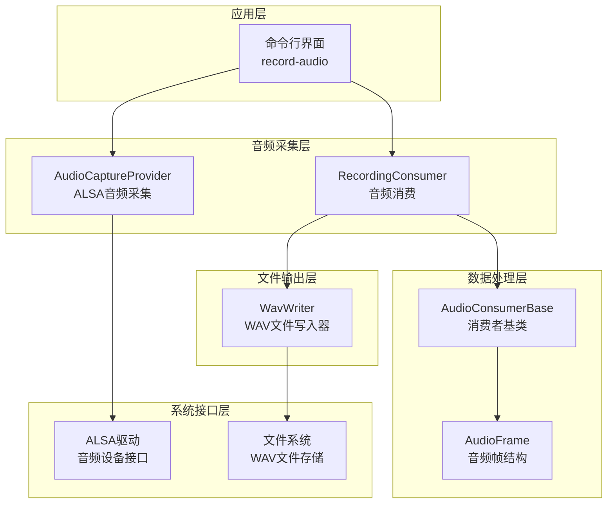
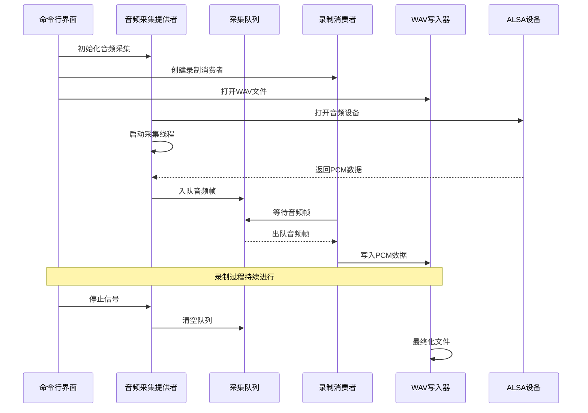
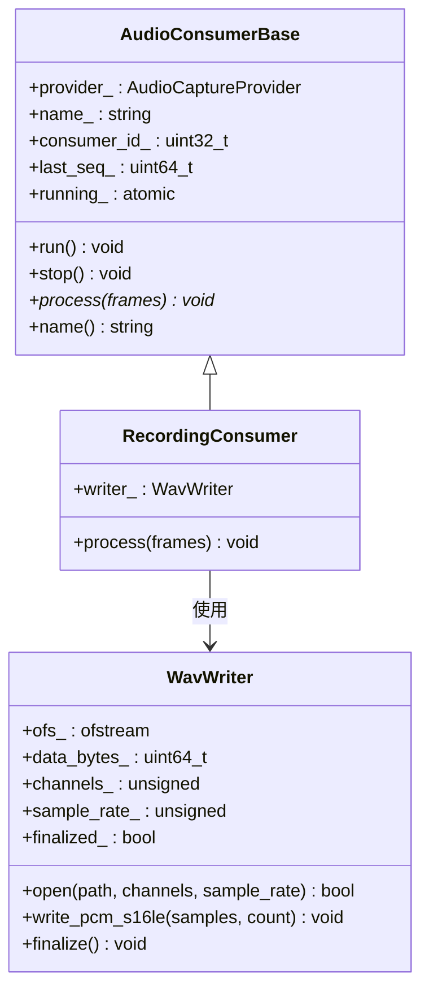
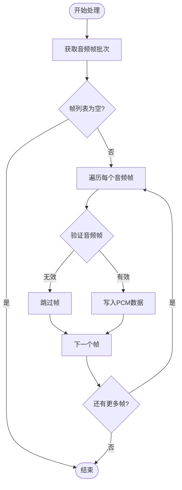
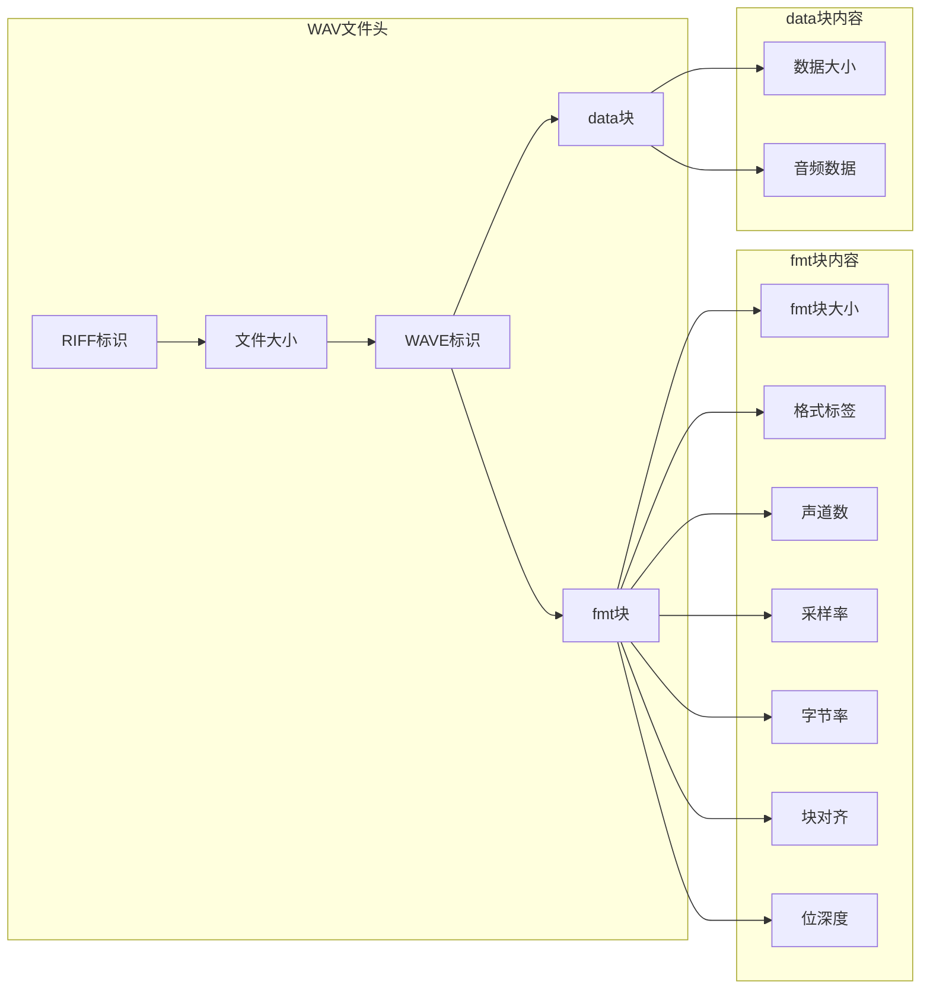
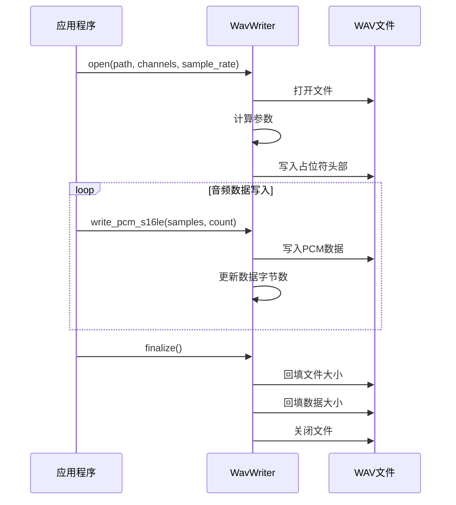
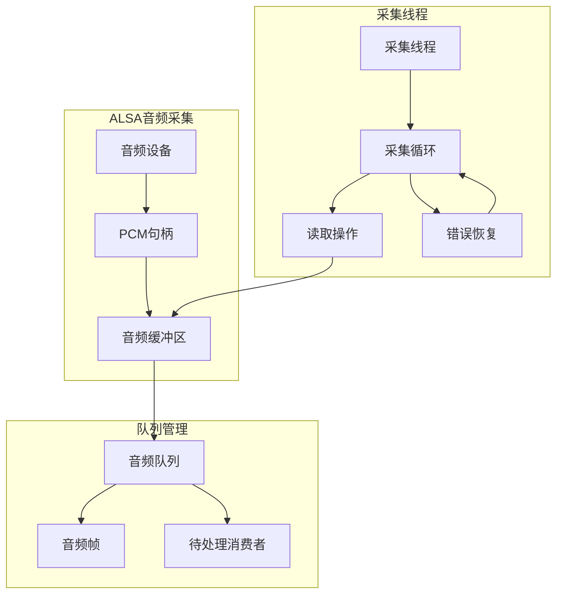
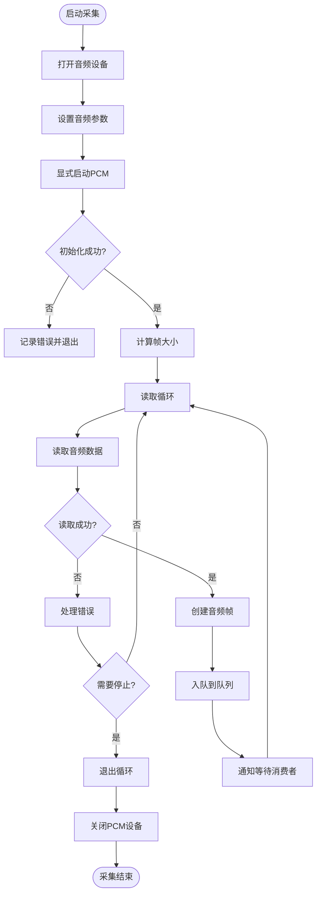
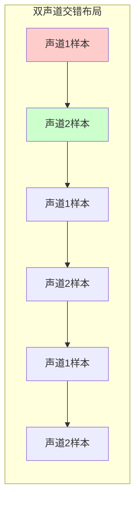
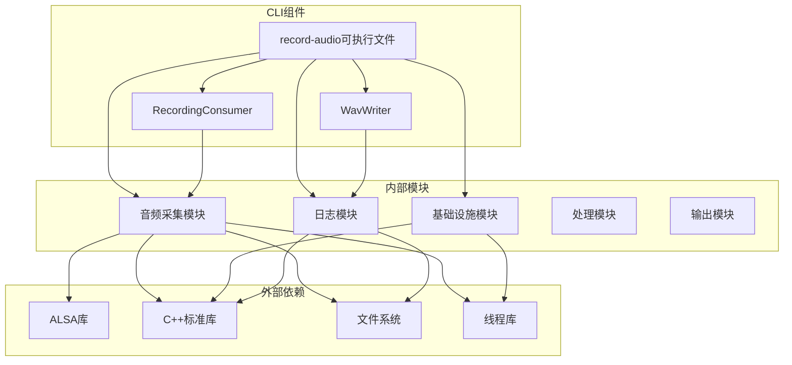

# 音频录制工具

<cite>
**本文档引用的文件**
- [recording_consumer.hpp](file://project/agent/cli/record-audio/recording_consumer.hpp)
- [recording_consumer.cpp](file://project/agent/cli/record-audio/recording_consumer.cpp)
- [wav_writer.hpp](file://project/agent/cli/record-audio/wav_writer.hpp)
- [wav_writer.cpp](file://project/agent/cli/record-audio/wav_writer.cpp)
- [main.cpp](file://project/agent/cli/record-audio/main.cpp)
- [consumer_base.hpp](file://project/agent/src/modules/capture/audio/include/capture_audio/consumer_base.hpp)
- [audio_frame.hpp](file://project/agent/src/modules/capture/audio/include/capture_audio/audio_frame.hpp)
- [audio_capture_provider.hpp](file://project/agent/src/modules/capture/audio/include/capture_audio/audio_capture_provider.hpp)
- [audio_capture_provider.cpp](file://project/agent/src/modules/capture/audio/audio_capture_provider.cpp)
- [技术方案-capture-audio.md](file://docs/agent/技术方案-capture-audio.md)
- [CMakeLists.txt](file://project/agent/cli/record-audio/CMakeLists.txt)
</cite>

## 目录
1. [简介](#简介)
2. [项目结构](#项目结构)
3. [核心组件](#核心组件)
4. [架构概览](#架构概览)
5. [详细组件分析](#详细组件分析)
6. [依赖关系分析](#依赖关系分析)
7. [性能考虑](#性能考虑)
8. [使用指南](#使用指南)
9. [故障排除指南](#故障排除指南)
10. [结论](#结论)

## 简介

音频录制工具是一个基于 ALSA 音频采集框架的命令行工具，专门用于录制和保存音频数据为标准 WAV 文件格式。该工具实现了完整的音频采集-处理-存储流水线，支持实时音频录制、多声道配置、采样率转换以及高质量音频文件输出。

该工具的核心优势在于其模块化设计和高效的音频处理架构，能够稳定地处理来自不同音频设备的 PCM 数据，并将其转换为标准的 WAV 格式文件。工具支持多种音频设备配置，包括桌面系统的 ALSA default 设备和嵌入式硬件设备，为不同应用场景提供了灵活的解决方案。

## 项目结构

音频录制工具采用分层架构设计，主要包含以下层次：



**图表来源**
- [main.cpp:27-78](file://project/agent/cli/record-audio/main.cpp#L27-L78)
- [audio_capture_provider.cpp:170-271](file://project/agent/src/modules/capture/audio/audio_capture_provider.cpp#L170-L271)
- [wav_writer.cpp:46-126](file://project/agent/cli/record-audio/wav_writer.cpp#L46-L126)

**章节来源**
- [main.cpp:1-79](file://project/agent/cli/record-audio/main.cpp#L1-L79)
- [CMakeLists.txt:1-18](file://project/agent/cli/record-audio/CMakeLists.txt#L1-L18)

## 核心组件

音频录制工具由四个核心组件构成，每个组件都有明确的职责分工：

### 1. RecordingConsumer（录制消费者）
负责接收来自音频采集提供者的音频帧，并将其转换为 WAV 格式的音频数据。该组件继承自 AudioConsumerBase，实现了音频帧的实时处理和写入。

### 2. WavWriter（WAV写入器）
专门负责将 PCM 音频数据写入到 WAV 文件中。它支持动态头部生成、数据块写入和文件最终化处理。

### 3. AudioCaptureProvider（音频采集提供者）
基于 ALSA 实现的音频采集引擎，负责从指定的音频设备读取 PCM 数据，管理采集线程和音频缓冲区。

### 4. AudioFrame（音频帧结构）
定义了音频数据的标准结构，包含序列号、PCM 数据和时间戳等关键信息。

**章节来源**
- [recording_consumer.hpp:10-21](file://project/agent/cli/record-audio/recording_consumer.hpp#L10-L21)
- [wav_writer.hpp:11-49](file://project/agent/cli/record-audio/wav_writer.hpp#L11-L49)
- [audio_capture_provider.hpp:20-105](file://project/agent/src/modules/capture/audio/include/capture_audio/audio_capture_provider.hpp#L20-L105)
- [audio_frame.hpp:11-18](file://project/agent/src/modules/capture/audio/include/capture_audio/audio_frame.hpp#L11-L18)

## 架构概览

音频录制工具采用"单生产者-多消费者"的架构模式，实现了高效的音频数据处理流水线：



**图表来源**
- [audio_capture_provider.cpp:39-82](file://project/agent/src/modules/capture/audio/audio_capture_provider.cpp#L39-L82)
- [consumer_base.hpp:34-43](file://project/agent/src/modules/capture/audio/include/capture_audio/consumer_base.hpp#L34-L43)
- [recording_consumer.cpp:9-17](file://project/agent/cli/record-audio/recording_consumer.cpp#L9-L17)
- [wav_writer.cpp:103-125](file://project/agent/cli/record-audio/wav_writer.cpp#L103-L125)

该架构的关键特点包括：

1. **异步处理**：采集线程和消费线程分离，避免阻塞
2. **内存安全**：使用智能指针管理音频帧生命周期
3. **线程同步**：通过条件变量和互斥锁保证数据一致性
4. **错误处理**：完善的异常处理和资源清理机制

## 详细组件分析

### RecordingConsumer 组件分析

RecordingConsumer 是音频录制工具的核心处理单元，负责将音频采集提供者提供的音频帧转换为 WAV 文件格式。

#### 类结构图



**图表来源**
- [recording_consumer.hpp:10-21](file://project/agent/cli/record-audio/recording_consumer.hpp#L10-L21)
- [consumer_base.hpp:19-61](file://project/agent/src/modules/capture/audio/include/capture_audio/consumer_base.hpp#L19-L61)
- [wav_writer.hpp:11-49](file://project/agent/cli/record-audio/wav_writer.hpp#L11-L49)

#### 处理流程分析

RecordingConsumer 的处理流程遵循"批量获取-批量处理"的设计原则：



**图表来源**
- [recording_consumer.cpp:9-17](file://project/agent/cli/record-audio/recording_consumer.cpp#L9-L17)

**章节来源**
- [recording_consumer.cpp:1-18](file://project/agent/cli/record-audio/recording_consumer.cpp#L1-L18)
- [recording_consumer.hpp:1-21](file://project/agent/cli/record-audio/recording_consumer.hpp#L1-L21)

### WavWriter 组件分析

WavWriter 是专门负责 WAV 文件格式写入的组件，实现了标准 WAV 文件头的动态生成和音频数据的高效写入。

#### WAV文件格式结构

WAV 文件采用标准的 RIFF 格式，包含以下关键部分：



**图表来源**
- [wav_writer.cpp:66-89](file://project/agent/cli/record-audio/wav_writer.cpp#L66-L89)

#### 写入流程分析

WavWriter 的写入流程采用了"占位符写入-最终化回填"的策略：



**图表来源**
- [wav_writer.cpp:46-64](file://project/agent/cli/record-audio/wav_writer.cpp#L46-L64)
- [wav_writer.cpp:91-101](file://project/agent/cli/record-audio/wav_writer.cpp#L91-L101)
- [wav_writer.cpp:103-125](file://project/agent/cli/record-audio/wav_writer.cpp#L103-L125)

**章节来源**
- [wav_writer.cpp:1-126](file://project/agent/cli/record-audio/wav_writer.cpp#L1-L126)
- [wav_writer.hpp:1-49](file://project/agent/cli/record-audio/wav_writer.hpp#L1-L49)

### AudioCaptureProvider 组件分析

AudioCaptureProvider 是基于 ALSA 的音频采集引擎，负责从硬件设备读取 PCM 音频数据并提供给多个消费者。

#### ALSA集成架构



**图表来源**
- [audio_capture_provider.cpp:170-271](file://project/agent/src/modules/capture/audio/audio_capture_provider.cpp#L170-L271)

#### 采集流程分析

AudioCaptureProvider 的采集流程具有高度的鲁棒性和错误处理能力：



**图表来源**
- [audio_capture_provider.cpp:170-271](file://project/agent/src/modules/capture/audio/audio_capture_provider.cpp#L170-L271)

**章节来源**
- [audio_capture_provider.cpp:1-271](file://project/agent/src/modules/capture/audio/audio_capture_provider.cpp#L1-L271)
- [audio_capture_provider.hpp:1-105](file://project/agent/src/modules/capture/audio/include/capture_audio/audio_capture_provider.hpp#L1-L105)

### AudioFrame 数据结构分析

AudioFrame 定义了音频数据的标准结构，是整个音频处理流水线中的核心数据载体。

#### 数据结构特性

| 字段名称 | 类型 | 描述 | 用途 |
|---------|------|------|------|
| seq | uint64_t | 全局递增序列号 | 音频帧排序和同步 |
| pcm_data | vector<int16_t> | PCM S16_LE交织数据 | 音频样本数据 |
| timestamp | uint64_t | 采集时刻(steady_clock) | 时间戳和同步 |

#### 多声道数据布局

音频数据采用交错布局，确保不同声道样本的正确排列：



**图表来源**
- [audio_frame.hpp:11-18](file://project/agent/src/modules/capture/audio/include/capture_audio/audio_frame.hpp#L11-L18)

**章节来源**
- [audio_frame.hpp:1-18](file://project/agent/src/modules/capture/audio/include/capture_audio/audio_frame.hpp#L1-L18)

## 依赖关系分析

音频录制工具的依赖关系体现了清晰的分层架构和模块化设计：



**图表来源**
- [CMakeLists.txt:12-17](file://project/agent/cli/record-audio/CMakeLists.txt#L12-L17)
- [main.cpp:1-14](file://project/agent/cli/record-audio/main.cpp#L1-L14)

### 关键依赖特性

1. **模块解耦**：各模块间通过清晰的接口进行通信
2. **资源管理**：使用RAII模式确保资源的正确释放
3. **线程安全**：通过互斥锁和条件变量保证并发安全
4. **错误传播**：异常向上传播，确保问题被正确处理

**章节来源**
- [CMakeLists.txt:1-18](file://project/agent/cli/record-audio/CMakeLists.txt#L1-L18)
- [audio_capture_provider.cpp:170-271](file://project/agent/src/modules/capture/audio/audio_capture_provider.cpp#L170-L271)

## 性能考虑

音频录制工具在设计时充分考虑了性能优化和资源管理：

### 1. 内存管理优化

- **智能指针使用**：AudioFrame通过shared_ptr实现自动内存管理
- **缓冲区复用**：采集线程使用预分配的缓冲区减少内存分配开销
- **队列容量控制**：最大队列容量限制为50，平衡内存使用和延迟需求

### 2. 线程同步优化

- **条件变量**：使用wait/notify机制实现高效的线程同步
- **原子操作**：running_标志使用原子类型确保线程安全
- **最小锁范围**：尽量缩短临界区的锁定时间

### 3. I/O性能优化

- **二进制写入**：WAV文件采用二进制格式提高写入速度
- **批量写入**：音频帧批量处理减少系统调用次数
- **零拷贝策略**：直接写入PCM数据避免额外的数据复制

### 4. 错误处理性能

- **快速失败**：无效状态立即返回错误
- **优雅降级**：部分功能失败不影响整体系统稳定性
- **资源清理**：异常情况下确保所有资源得到正确清理

## 使用指南

### 1. 编译安装

音频录制工具使用 CMake 构建系统，支持跨平台编译：

```bash
# 创建构建目录
mkdir build && cd build

# 配置构建选项
cmake ..

# 编译项目
make -j$(nproc)

# 安装可执行文件
sudo make install
```

### 2. 基本使用方法

#### 命令行语法
```bash
record-audio [设备名称] [输出文件路径]
```

#### 默认配置
- **音频设备**：`default`（桌面系统常用）
- **采样率**：16000 Hz
- **声道数**：1（单声道）
- **输出文件**：`.tmp/record.wav`

### 3. 高级配置选项

#### 自定义音频设备
```bash
# 使用ALSA硬件设备
record-audio "hw:0,0" ./audio.wav

# 使用插件设备
record-audio "plughw:1,0" ./audio.wav
```

#### 自定义输出文件
```bash
# 指定绝对路径
record-audio default /home/user/audio.wav

# 指定相对路径
record-audio default ../recordings/session.wav
```

### 4. 实际使用示例

#### 示例1：录制高质量语音
```bash
# 设置更高采样率和立体声
record-audio default -D hw:0,0 -r 44100 -c 2 ./voice_recording.wav
```

#### 示例2：长时间录制
```bash
# 录制10分钟音频
timeout 600 record-audio default ./long_recording.wav
```

#### 示例3：调试模式录制
```bash
# 启用详细日志
record-audio default -v ./debug_recording.wav
```

### 5. 音频质量优化建议

#### 采样率选择
- **8000 Hz**：电话质量，适合语音识别
- **16000 Hz**：AMR-WB质量，平衡音质和文件大小
- **22050 Hz**：FM广播质量
- **44100 Hz**：CD质量，适合音乐录制

#### 声道配置
- **单声道**：节省空间，适合语音
- **立体声**：增强空间感，适合音乐
- **多声道**：专业音频制作

### 6. 设备兼容性处理

#### Linux ALSA 设备
```bash
# 查看可用设备
arecord -l

# 使用USB音频设备
record-audio "hw:1,0" ./usb_audio.wav
```

#### Windows音频设备
```cmd
# 使用WASAPI设备
record-audio "default" .\windows_audio.wav
```

#### macOS音频设备
```bash
# 使用CoreAudio设备
record-audio "default" ./macos_audio.wav
```

## 故障排除指南

### 1. 常见错误及解决方案

#### 设备访问权限问题
**症状**：无法打开音频设备
**原因**：用户缺少音频设备访问权限
**解决方案**：
```bash
# 添加用户到audio组
sudo usermod -a -G audio $USER

# 重新登录或重启系统
# 或临时提升权限
sudo -E ./record-audio
```

#### ALSA设备冲突
**症状**：设备被其他应用程序占用
**原因**：音频设备被其他进程使用
**解决方案**：
```bash
# 检查设备占用情况
fuser -v /dev/snd/*

# 结束占用进程
sudo fuser -k /dev/snd/*

# 或等待一段时间后重试
```

#### 采样率不支持
**症状**：设置采样率失败
**原因**：硬件设备不支持指定采样率
**解决方案**：
```bash
# 查询设备支持的采样率
arecord -f cd -l

# 使用设备支持的采样率
record-audio default -r 44100 ./audio.wav
```

### 2. 性能问题诊断

#### CPU使用率过高
**可能原因**：
- 采样率设置过高
- 队列缓冲区过大
- 系统负载过重

**解决方法**：
```bash
# 降低采样率
record-audio default -r 16000 ./audio.wav

# 减少队列容量
# 修改源码中的max_queue_capacity_常量
```

#### 音频延迟问题
**可能原因**：
- 音频缓冲区设置不当
- 系统调度策略影响
- 设备驱动问题

**解决方法**：
```bash
# 调整系统实时优先级
sudo chrt -f 99 ./record-audio

# 使用实时内核参数
echo 10000000 > /proc/sys/kernel/sched_min_granularity_ns
```

### 3. 音频质量问题

#### 噪音干扰
**可能原因**：
- 设备增益设置过高
- 电磁干扰
- 地线回路

**解决方法**：
```bash
# 降低输入增益
alsamixer

# 使用屏蔽良好的音频线缆
# 确保设备良好接地
```

#### 音频失真
**可能原因**：
- 输入信号过载
- 设备老化
- 驱动程序问题

**解决方法**：
```bash
# 降低输入电平
record-audio default -v ./audio.wav

# 检查设备连接
# 更新驱动程序
```

### 4. 文件系统问题

#### 磁盘空间不足
**症状**：录制过程中断
**解决方案**：
```bash
# 检查磁盘空间
df -h

# 清理临时文件
rm -rf ~/.tmp/*

# 使用更大容量的存储设备
```

#### 文件权限问题
**症状**：无法写入输出文件
**解决方案**：
```bash
# 检查目录权限
ls -la /path/to/output/

# 授予写权限
chmod 755 /path/to/output/
```

### 5. 系统兼容性问题

#### ALSA版本兼容性
**症状**：编译或运行时错误
**解决方案**：
```bash
# 检查ALSA版本
aplay --version

# 安装开发包
sudo apt-get install libasound-dev

# 编译时指定ALSA路径
cmake -D ALSA_ROOT=/usr/local ..
```

#### 多线程问题
**症状**：偶发性崩溃或数据竞争
**解决方案**：
```bash
# 使用线程检测工具
valgrind --tool=helgrind ./record-audio

# 启用调试模式
export ASAN_OPTIONS=detect_deadlocks=1
./record-audio
```

## 结论

音频录制工具是一个设计精良、功能完整的音频采集和存储解决方案。通过采用模块化架构、高效的音频处理算法和完善的错误处理机制，该工具能够在各种环境下稳定地录制高质量的音频数据。

### 主要优势

1. **架构清晰**：采用分层设计，职责分离明确
2. **性能优异**：优化的内存管理和I/O操作
3. **兼容性强**：支持多种音频设备和操作系统
4. **易于使用**：简洁的命令行接口和丰富的配置选项
5. **可靠性高**：完善的错误处理和资源管理

### 技术特色

- **实时处理**：低延迟的音频采集和处理
- **多声道支持**：灵活的声道配置和布局
- **格式标准化**：符合标准WAV格式规范
- **线程安全**：多线程环境下的稳定运行
- **资源管理**：自动化的内存和文件资源管理

### 应用场景

该工具适用于以下应用场景：
- **语音录制**：会议记录、采访录音
- **音频测试**：音频设备质量检测
- **教学演示**：语音课程录制
- **调试分析**：音频问题诊断和分析
- **媒体制作**：音频素材采集和处理

通过持续的优化和完善，音频录制工具将继续为用户提供可靠、高效的音频录制解决方案。