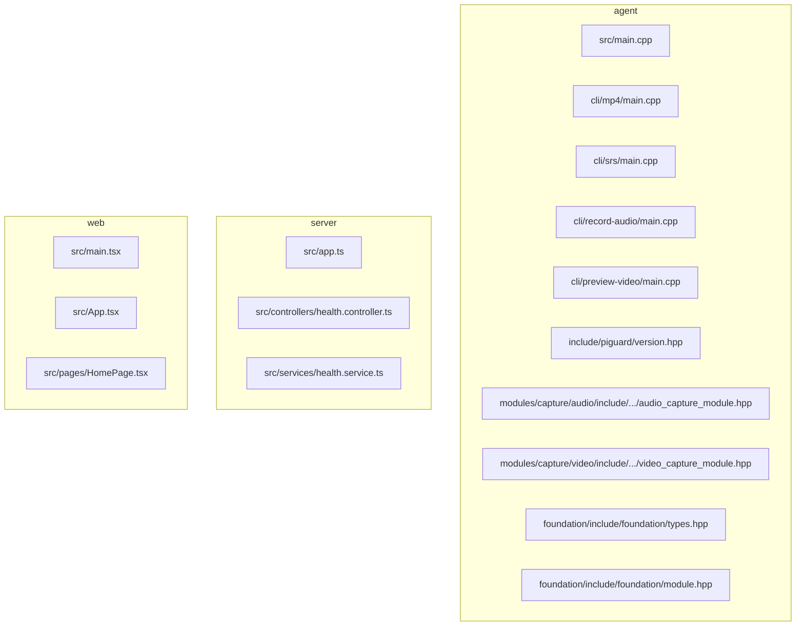
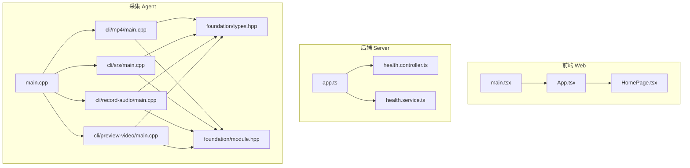
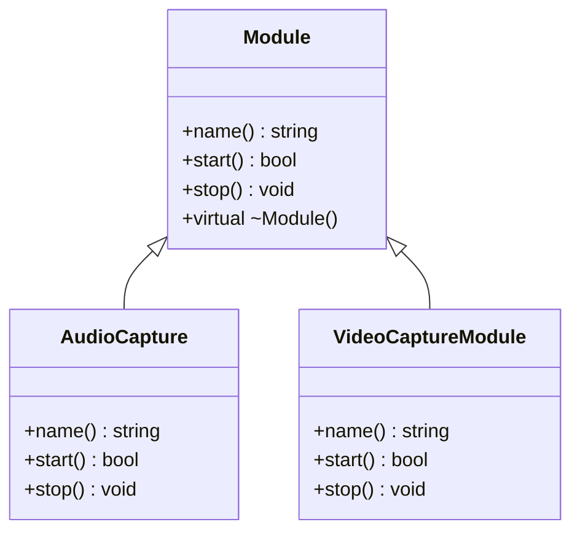
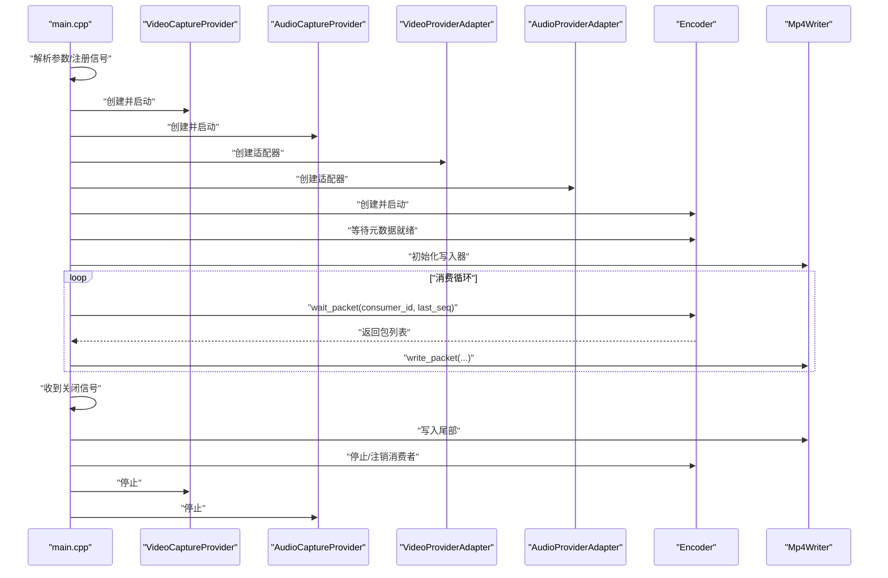
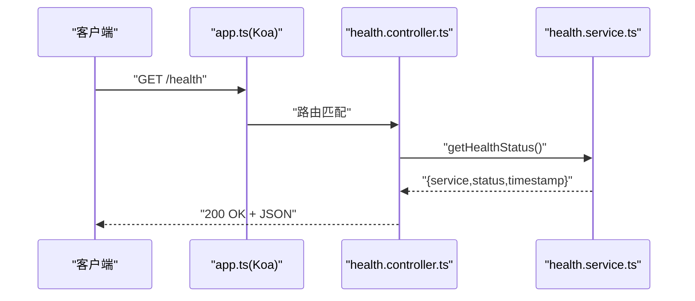
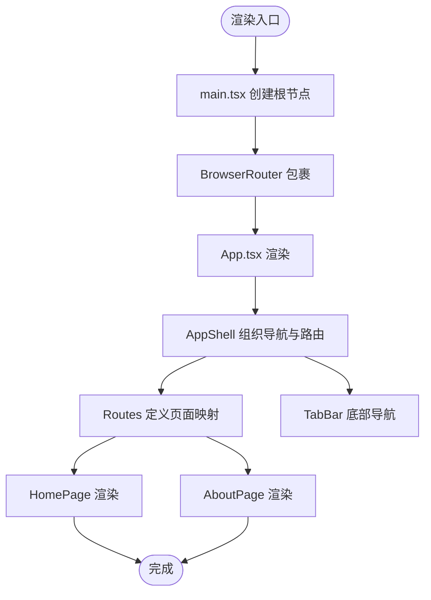
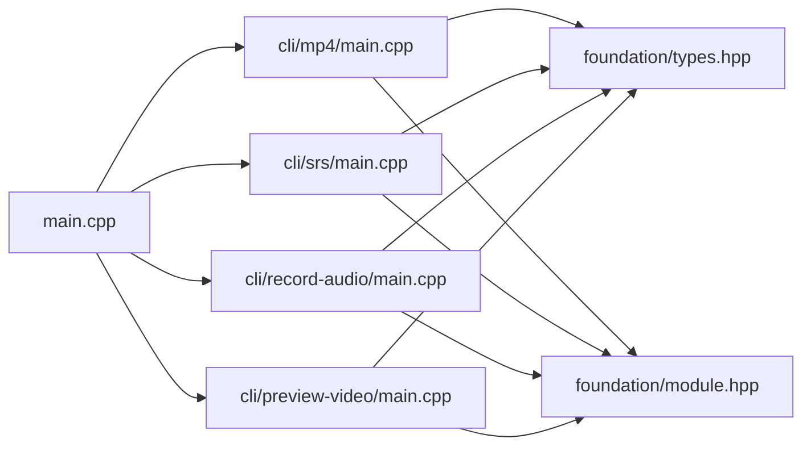

# 代码规范

<cite>
**本文引用的文件**
- [project/agent/src/main.cpp](file://project/agent/src/main.cpp)
- [project/agent/cli/mp4/main.cpp](file://project/agent/cli/mp4/main.cpp)
- [project/agent/cli/srs/main.cpp](file://project/agent/cli/srs/main.cpp)
- [project/agent/cli/record-audio/main.cpp](file://project/agent/cli/record-audio/main.cpp)
- [project/agent/cli/preview-video/main.cpp](file://project/agent/cli/preview-video/main.cpp)
- [project/agent/include/piguard/version.hpp](file://project/agent/include/piguard/version.hpp)
- [project/agent/src/foundation/include/foundation/module.hpp](file://project/agent/src/foundation/include/foundation/module.hpp)
- [project/agent/src/foundation/include/foundation/types.hpp](file://project/agent/src/foundation/include/foundation/types.hpp)
- [project/agent/src/modules/capture/audio/include/capture_audio/audio_capture_module.hpp](file://project/agent/src/modules/capture/audio/include/capture_audio/audio_capture_module.hpp)
- [project/agent/src/modules/capture/video/include/capture_video/video_capture_module.hpp](file://project/agent/src/modules/capture/video/include/capture_video/video_capture_module.hpp)
- [project/server/src/app.ts](file://project/server/src/app.ts)
- [project/server/src/controllers/health.controller.ts](file://project/server/src/controllers/health.controller.ts)
- [project/server/src/services/health.service.ts](file://project/server/src/services/health.service.ts)
- [project/web/src/App.tsx](file://project/web/src/App.tsx)
- [project/web/src/main.tsx](file://project/web/src/main.tsx)
- [project/web/src/pages/HomePage.tsx](file://project/web/src/pages/HomePage.tsx)
</cite>

## 目录
1. [引言](#引言)
2. [项目结构](#项目结构)
3. [核心组件](#核心组件)
4. [架构总览](#架构总览)
5. [详细组件分析](#详细组件分析)
6. [依赖分析](#依赖分析)
7. [性能考虑](#性能考虑)
8. [故障排查指南](#故障排查指南)
9. [结论](#结论)
10. [附录](#附录)

## 引言
本文件为 Pi-Guard 项目制定统一的代码规范与质量保障流程，覆盖 C++ 与 TypeScript/JavaScript 两类语言。内容基于仓库现有实现进行提炼与总结，旨在提升可读性、可维护性与协作效率。

## 项目结构
Pi-Guard 采用多子项目分层组织：
- agent：C++ 核心采集与处理模块，包含基础设施、模块化功能、CLI 示例等
- server：Koa TypeScript 后端服务
- web：React TypeScript 前端应用
- srs：外部服务配置与脚本（非本文重点）

下图给出与本文相关的目录关系概览：

**图表来源**
- [project/agent/src/main.cpp:1-19](file://project/agent/src/main.cpp#L1-L19)
- [project/agent/cli/mp4/main.cpp:1-124](file://project/agent/cli/mp4/main.cpp#L1-L124)
- [project/agent/cli/srs/main.cpp:1-131](file://project/agent/cli/srs/main.cpp#L1-L131)
- [project/agent/cli/record-audio/main.cpp:1-79](file://project/agent/cli/record-audio/main.cpp#L1-L79)
- [project/agent/cli/preview-video/main.cpp:1-60](file://project/agent/cli/preview-video/main.cpp#L1-L60)
- [project/agent/include/piguard/version.hpp:1-8](file://project/agent/include/piguard/version.hpp#L1-L8)
- [project/agent/src/foundation/include/foundation/module.hpp:1-17](file://project/agent/src/foundation/include/foundation/module.hpp#L1-L17)
- [project/agent/src/foundation/include/foundation/types.hpp:1-39](file://project/agent/src/foundation/include/foundation/types.hpp#L1-L39)
- [project/agent/src/modules/capture/audio/include/capture_audio/audio_capture_module.hpp:1-24](file://project/agent/src/modules/capture/audio/include/capture_audio/audio_capture_module.hpp#L1-L24)
- [project/agent/src/modules/capture/video/include/capture_video/video_capture_module.hpp:1-22](file://project/agent/src/modules/capture/video/include/capture_video/video_capture_module.hpp#L1-L22)
- [project/server/src/app.ts:1-14](file://project/server/src/app.ts#L1-L14)
- [project/server/src/controllers/health.controller.ts:1-7](file://project/server/src/controllers/health.controller.ts#L1-L7)
- [project/server/src/services/health.service.ts:1-14](file://project/server/src/services/health.service.ts#L1-L14)
- [project/web/src/main.tsx:1-15](file://project/web/src/main.tsx#L1-L15)
- [project/web/src/App.tsx:1-38](file://project/web/src/App.tsx#L1-L38)
- [project/web/src/pages/HomePage.tsx:1-15](file://project/web/src/pages/HomePage.tsx#L1-L15)

**章节来源**
- [project/agent/src/main.cpp:1-19](file://project/agent/src/main.cpp#L1-L19)
- [project/server/src/app.ts:1-14](file://project/server/src/app.ts#L1-L14)
- [project/web/src/main.tsx:1-15](file://project/web/src/main.tsx#L1-L15)

## 核心组件
本节从命名、注释、头文件组织、模块接口等方面总结现有实现中的最佳实践，并提出规范化建议。

- 命名约定（C++）
  - 类名：PascalCase（如 Module、AudioCapture、VideoCaptureModule）
  - 函数名：camelCase（如 name()、start()、stop()）
  - 常量：UPPER_CASE（如 kVersion、kVideoWidth、kDefaultOutput）
  - 文件命名：小写，单词间以下划线分隔（如 version.hpp、module.hpp、types.hpp）
  - 命名空间：piguard 及子域（如 piguard::foundation、piguard::capture_audio）

- 命名约定（TypeScript/JavaScript）
  - 类型与接口：PascalCase（如 HealthStatus）
  - 函数与变量：camelCase（如 getHealthStatus）
  - 常量：UPPER_CASE（如 MAX_RETRY）
  - 文件命名：小写，单词间用中划线或下划线（如 health.controller.ts、health.service.ts）
  - 模块导出：默认导出用于单例/应用实例，具名导出用于工具函数与类型

- 头文件包含顺序与组织（C++）
  - 标准库头文件（按字母序）
  - 第三方库头文件（按字母序）
  - 项目内部头文件（按层级从低到高，先子模块后父模块）
  - 使用空行分隔不同来源的头文件组
  - 优先使用前置声明减少耦合，必要时再包含头文件

- 注释规范（C++）
  - 类与接口：在头文件中对类、虚接口、关键方法进行简要说明
  - 行内注释：解释复杂逻辑或边界条件，避免显而易见的注释
  - 常量注释：对魔法值、路径、默认参数添加注释说明来源与用途

- 注释规范（TypeScript/JavaScript）
  - 公共接口与函数：使用 JSDoc 注释，描述参数、返回值、异常与副作用
  - 类型定义：对枚举、接口字段进行语义说明
  - 导出项：对对外 API 进行简要说明，便于 IDE 提示与文档生成

- 代码格式化规则（C++）
  - 缩进：4 空格
  - 大括号：控制块独占一行，函数体与大括号各占一行
  - 空行：逻辑段落之间使用空行分隔，避免过度空行
  - 行宽：建议不超过 120 列，超长表达式分行书写

- 代码格式化规则（TypeScript/JavaScript）
  - 缩进：4 空格
  - 大括号：函数体与大括号各占一行
  - 空行：逻辑段落之间使用空行分隔
  - 行宽：建议不超过 120 列

- 错误处理与日志
  - 统一通过 Logger 输出错误信息，避免直接使用标准输出
  - 对系统调用与第三方库返回值进行显式检查与错误分支处理

**章节来源**
- [project/agent/include/piguard/version.hpp:1-8](file://project/agent/include/piguard/version.hpp#L1-L8)
- [project/agent/src/foundation/include/foundation/module.hpp:1-17](file://project/agent/src/foundation/include/foundation/module.hpp#L1-L17)
- [project/agent/src/foundation/include/foundation/types.hpp:1-39](file://project/agent/src/foundation/include/foundation/types.hpp#L1-L39)
- [project/agent/src/modules/capture/audio/include/capture_audio/audio_capture_module.hpp:1-24](file://project/agent/src/modules/capture/audio/include/capture_audio/audio_capture_module.hpp#L1-L24)
- [project/agent/src/modules/capture/video/include/capture_video/video_capture_module.hpp:1-22](file://project/agent/src/modules/capture/video/include/capture_video/video_capture_module.hpp#L1-L22)
- [project/server/src/controllers/health.controller.ts:1-7](file://project/server/src/controllers/health.controller.ts#L1-L7)
- [project/server/src/services/health.service.ts:1-14](file://project/server/src/services/health.service.ts#L1-L14)
- [project/web/src/App.tsx:1-38](file://project/web/src/App.tsx#L1-L38)

## 架构总览
Pi-Guard 由前端 Web、后端 Server 与采集 Agent 三部分组成。Agent 负责采集音视频、编码与推流，Server 提供健康检查等接口，Web 展示页面与导航。

**图表来源**
- [project/web/src/main.tsx:1-15](file://project/web/src/main.tsx#L1-L15)
- [project/web/src/App.tsx:1-38](file://project/web/src/App.tsx#L1-L38)
- [project/web/src/pages/HomePage.tsx:1-15](file://project/web/src/pages/HomePage.tsx#L1-L15)
- [project/server/src/app.ts:1-14](file://project/server/src/app.ts#L1-L14)
- [project/server/src/controllers/health.controller.ts:1-7](file://project/server/src/controllers/health.controller.ts#L1-L7)
- [project/server/src/services/health.service.ts:1-14](file://project/server/src/services/health.service.ts#L1-L14)
- [project/agent/src/main.cpp:1-19](file://project/agent/src/main.cpp#L1-L19)
- [project/agent/cli/mp4/main.cpp:1-124](file://project/agent/cli/mp4/main.cpp#L1-L124)
- [project/agent/cli/srs/main.cpp:1-131](file://project/agent/cli/srs/main.cpp#L1-L131)
- [project/agent/cli/record-audio/main.cpp:1-79](file://project/agent/cli/record-audio/main.cpp#L1-L79)
- [project/agent/cli/preview-video/main.cpp:1-60](file://project/agent/cli/preview-video/main.cpp#L1-L60)
- [project/agent/src/foundation/include/foundation/types.hpp:1-39](file://project/agent/src/foundation/include/foundation/types.hpp#L1-L39)
- [project/agent/src/foundation/include/foundation/module.hpp:1-17](file://project/agent/src/foundation/include/foundation/module.hpp#L1-L17)

## 详细组件分析

### C++ 命名与头文件组织规范
- 类与接口
  - 接口基类使用 Module，派生类遵循 PascalCase（如 AudioCapture、VideoCaptureModule）
  - 成员函数遵循 camelCase（如 name()、start()、stop()）
- 常量
  - 内联常量使用 kPrefix 形式（如 kVersion、kVideoWidth、kDefaultOutput）
- 头文件组织
  - 标准库 → 第三方 → 项目内部
  - 使用空行分组，避免跨组混排
  - 优先前置声明，减少编译依赖

**图表来源**
- [project/agent/src/foundation/include/foundation/module.hpp:1-17](file://project/agent/src/foundation/include/foundation/module.hpp#L1-L17)
- [project/agent/src/modules/capture/audio/include/capture_audio/audio_capture_module.hpp:1-24](file://project/agent/src/modules/capture/audio/include/capture_audio/audio_capture_module.hpp#L1-L24)
- [project/agent/src/modules/capture/video/include/capture_video/video_capture_module.hpp:1-22](file://project/agent/src/modules/capture/video/include/capture_video/video_capture_module.hpp#L1-L22)

**章节来源**
- [project/agent/src/foundation/include/foundation/module.hpp:1-17](file://project/agent/src/foundation/include/foundation/module.hpp#L1-L17)
- [project/agent/src/modules/capture/audio/include/capture_audio/audio_capture_module.hpp:1-24](file://project/agent/src/modules/capture/audio/include/capture_audio/audio_capture_module.hpp#L1-L24)
- [project/agent/src/modules/capture/video/include/capture_video/video_capture_module.hpp:1-22](file://project/agent/src/modules/capture/video/include/capture_video/video_capture_module.hpp#L1-L22)

### C++ CLI 示例流程（以 MP4 录制为例）
该流程展示了典型的数据采集、编码与输出写入链路，适合作为规范化的流程模板。

**图表来源**
- [project/agent/cli/mp4/main.cpp:1-124](file://project/agent/cli/mp4/main.cpp#L1-L124)

**章节来源**
- [project/agent/cli/mp4/main.cpp:1-124](file://project/agent/cli/mp4/main.cpp#L1-L124)

### TypeScript/JavaScript 规范要点
- 应用入口与路由
  - 应用实例通过默认导出，中间件与路由集中配置
- 控制器与服务
  - 控制器只负责请求响应，业务逻辑下沉至服务层
  - 服务层返回明确的数据结构（如 HealthStatus）
- 组件与页面
  - 页面组件以默认导出为主，路由按需引入
  - 使用语义化标签与样式类名，保持结构清晰

**图表来源**
- [project/server/src/app.ts:1-14](file://project/server/src/app.ts#L1-L14)
- [project/server/src/controllers/health.controller.ts:1-7](file://project/server/src/controllers/health.controller.ts#L1-L7)
- [project/server/src/services/health.service.ts:1-14](file://project/server/src/services/health.service.ts#L1-L14)

**章节来源**
- [project/server/src/app.ts:1-14](file://project/server/src/app.ts#L1-L14)
- [project/server/src/controllers/health.controller.ts:1-7](file://project/server/src/controllers/health.controller.ts#L1-L7)
- [project/server/src/services/health.service.ts:1-14](file://project/server/src/services/health.service.ts#L1-L14)

### React 前端组件结构
- 应用壳层 AppShell 负责导航与路由容器
- 主页组件展示卡片与列表，体现页面职责单一

**图表来源**
- [project/web/src/main.tsx:1-15](file://project/web/src/main.tsx#L1-L15)
- [project/web/src/App.tsx:1-38](file://project/web/src/App.tsx#L1-L38)
- [project/web/src/pages/HomePage.tsx:1-15](file://project/web/src/pages/HomePage.tsx#L1-L15)

**章节来源**
- [project/web/src/main.tsx:1-15](file://project/web/src/main.tsx#L1-L15)
- [project/web/src/App.tsx:1-38](file://project/web/src/App.tsx#L1-L38)
- [project/web/src/pages/HomePage.tsx:1-15](file://project/web/src/pages/HomePage.tsx#L1-L15)

## 依赖分析
- C++ 侧
  - CLI 示例依赖采集提供者、编码器与适配器，形成“提供者 → 适配器 → 编码器 → 输出”的链路
  - 基础设施模块（如 ShutdownManager、Logger）贯穿多个 CLI
- TypeScript 侧
  - 应用实例聚合中间件与路由，控制器与服务解耦
  - 前端通过路由与组件组织页面

**图表来源**
- [project/agent/src/main.cpp:1-19](file://project/agent/src/main.cpp#L1-L19)
- [project/agent/cli/mp4/main.cpp:1-124](file://project/agent/cli/mp4/main.cpp#L1-L124)
- [project/agent/cli/srs/main.cpp:1-131](file://project/agent/cli/srs/main.cpp#L1-L131)
- [project/agent/cli/record-audio/main.cpp:1-79](file://project/agent/cli/record-audio/main.cpp#L1-L79)
- [project/agent/cli/preview-video/main.cpp:1-60](file://project/agent/cli/preview-video/main.cpp#L1-L60)
- [project/agent/src/foundation/include/foundation/types.hpp:1-39](file://project/agent/src/foundation/include/foundation/types.hpp#L1-L39)
- [project/agent/src/foundation/include/foundation/module.hpp:1-17](file://project/agent/src/foundation/include/foundation/module.hpp#L1-L17)

**章节来源**
- [project/agent/src/main.cpp:1-19](file://project/agent/src/main.cpp#L1-L19)
- [project/agent/cli/mp4/main.cpp:1-124](file://project/agent/cli/mp4/main.cpp#L1-L124)
- [project/agent/cli/srs/main.cpp:1-131](file://project/agent/cli/srs/main.cpp#L1-L131)
- [project/agent/cli/record-audio/main.cpp:1-79](file://project/agent/cli/record-audio/main.cpp#L1-L79)
- [project/agent/cli/preview-video/main.cpp:1-60](file://project/agent/cli/preview-video/main.cpp#L1-L60)

## 性能考虑
- 队列与并发
  - 使用线程安全队列传递帧数据，避免锁竞争
  - 生产者与消费者分离，合理设置队列容量与缓冲数量
- 编码与推流
  - 元数据就绪后再启动写入器，避免无效开销
  - 批量处理包时更新最大序列号，确保有序写入
- 日志与错误
  - 统一错误日志输出，避免频繁 I/O
  - 对异常进行捕获与降级处理，防止进程崩溃

## 故障排查指南
- 常见问题定位
  - 采集失败：检查设备路径与权限，确认 Provider 启动返回值
  - 编码器未就绪：确认元数据 ready 字段，避免提前初始化写入器
  - 推流中断：捕获异常并记录堆栈，及时停止其他组件
- 日志与信号
  - 注册信号处理器，优雅关闭所有组件
  - 在关闭前释放线程与资源，避免悬挂

**章节来源**
- [project/agent/cli/srs/main.cpp:1-131](file://project/agent/cli/srs/main.cpp#L1-L131)
- [project/agent/cli/record-audio/main.cpp:1-79](file://project/agent/cli/record-audio/main.cpp#L1-L79)
- [project/agent/cli/preview-video/main.cpp:1-60](file://project/agent/cli/preview-video/main.cpp#L1-L60)

## 结论
本文基于现有实现总结了 Pi-Guard 的代码规范与质量流程，涵盖 C++ 与 TypeScript/JavaScript 的命名、注释、头文件组织与模块化设计。建议在后续开发中严格执行上述规范，并结合代码审查清单持续改进。

## 附录

### 代码审查检查清单（C++）
- 命名
  - 类名是否为 PascalCase，函数名是否为 camelCase，常量是否为 UPPER_CASE
  - 头文件命名是否符合小写与下划线风格
- 头文件
  - 是否按标准库 → 第三方 → 项目内部顺序组织
  - 是否存在不必要的包含，是否使用前置声明
- 注释
  - 类与接口是否具备简要说明
  - 复杂逻辑是否有行内注释
- 错误处理
  - 返回值与异常是否被显式检查
  - 日志输出是否统一且包含上下文信息
- 并发与资源
  - 线程安全队列使用是否正确
  - 资源释放与信号处理是否完整

### 代码审查检查清单（TypeScript/JavaScript）
- 命名
  - 接口与类型是否为 PascalCase，函数与变量是否为 camelCase
  - 常量是否为 UPPER_CASE
- 注释
  - JSDoc 是否覆盖参数、返回值与异常
  - 导出项是否具备简要说明
- 结构
  - 控制器是否仅负责响应，业务逻辑是否下沉至服务
  - 组件是否职责单一，路由是否清晰
- 格式
  - 缩进与大括号是否一致
  - 行宽是否控制在合理范围

### 反例与正例指引（示例路径）
- C++ 常量命名
  - 正例：kVersion、kVideoWidth、kDefaultOutput
  - 反例：g_version、VIDEO_WIDTH、default_output
  - 参考文件：[project/agent/include/piguard/version.hpp:1-8](file://project/agent/include/piguard/version.hpp#L1-L8)
- C++ 接口与派生类
  - 正例：Module 为抽象接口，AudioCapture、VideoCaptureModule 为具体实现
  - 反例：直接在接口中实现具体逻辑
  - 参考文件：
    - [project/agent/src/foundation/include/foundation/module.hpp:1-17](file://project/agent/src/foundation/include/foundation/module.hpp#L1-L17)
    - [project/agent/src/modules/capture/audio/include/capture_audio/audio_capture_module.hpp:1-24](file://project/agent/src/modules/capture/audio/include/capture_audio/audio_capture_module.hpp#L1-L24)
    - [project/agent/src/modules/capture/video/include/capture_video/video_capture_module.hpp:1-22](file://project/agent/src/modules/capture/video/include/capture_video/video_capture_module.hpp#L1-L22)
- TypeScript 接口与函数
  - 正例：HealthStatus 接口、getHealthStatus 函数
  - 反例：未导出的内部类型与函数
  - 参考文件：
    - [project/server/src/services/health.service.ts:1-14](file://project/server/src/services/health.service.ts#L1-L14)
    - [project/server/src/controllers/health.controller.ts:1-7](file://project/server/src/controllers/health.controller.ts#L1-L7)
- React 组件
  - 正例：AppShell 负责导航与路由容器，HomePage 展示页面内容
  - 反例：在入口文件中混入页面逻辑
  - 参考文件：
    - [project/web/src/App.tsx:1-38](file://project/web/src/App.tsx#L1-L38)
    - [project/web/src/pages/HomePage.tsx:1-15](file://project/web/src/pages/HomePage.tsx#L1-L15)
    - [project/web/src/main.tsx:1-15](file://project/web/src/main.tsx#L1-L15)