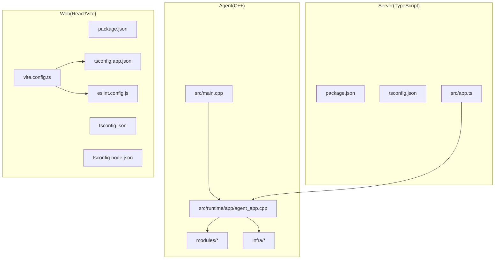
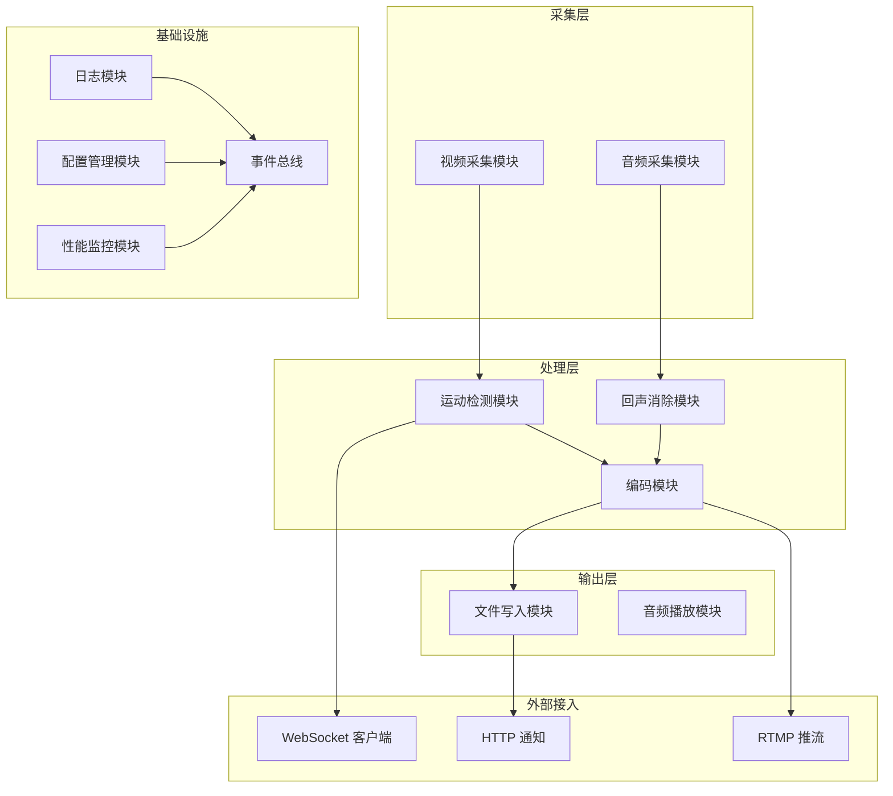
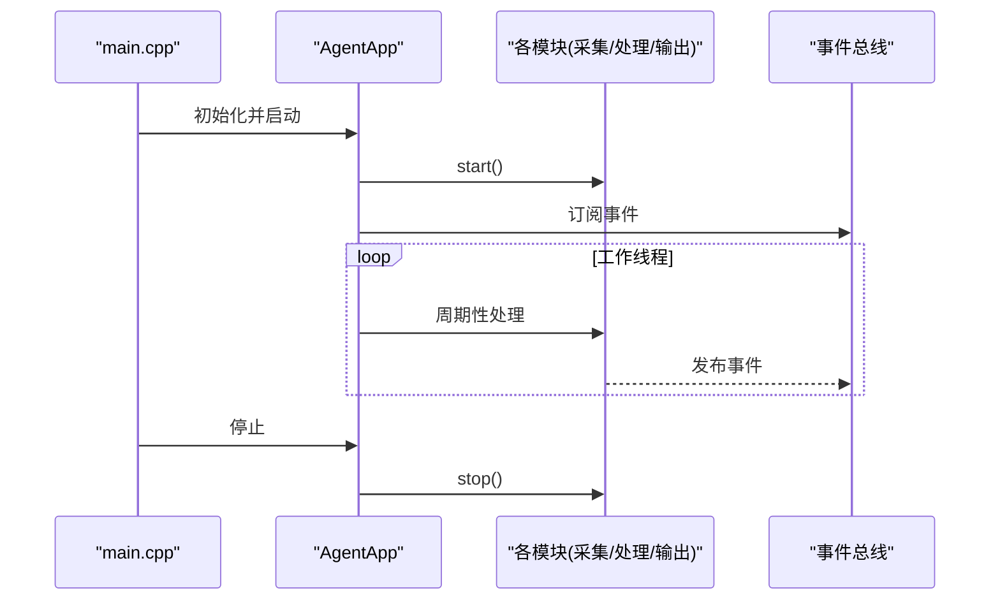
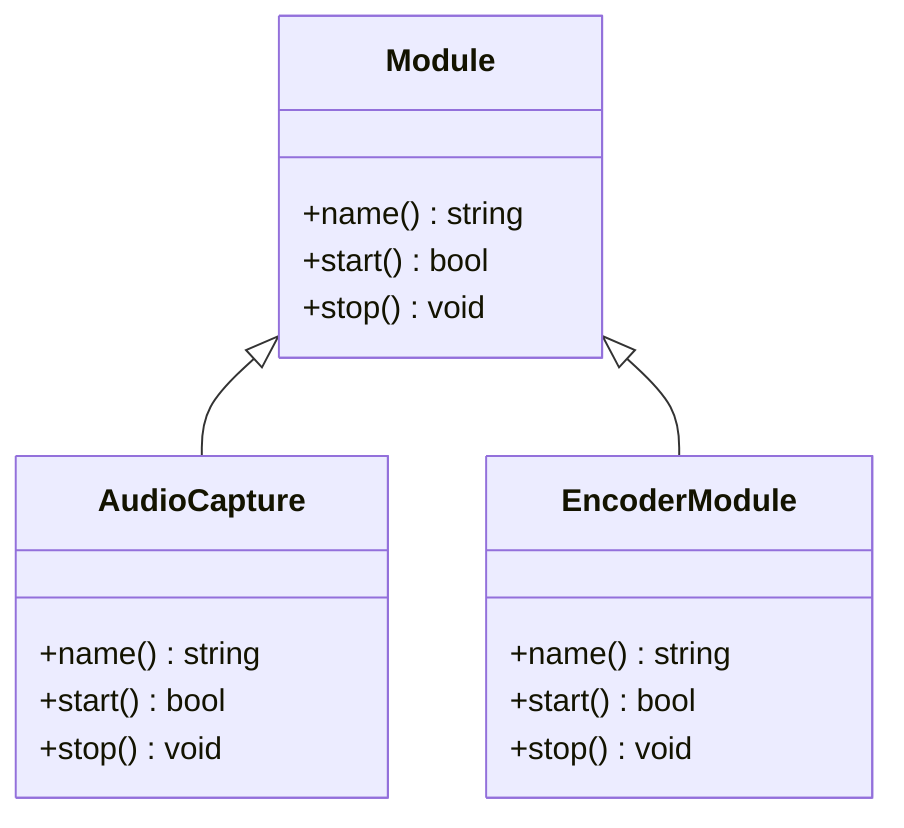
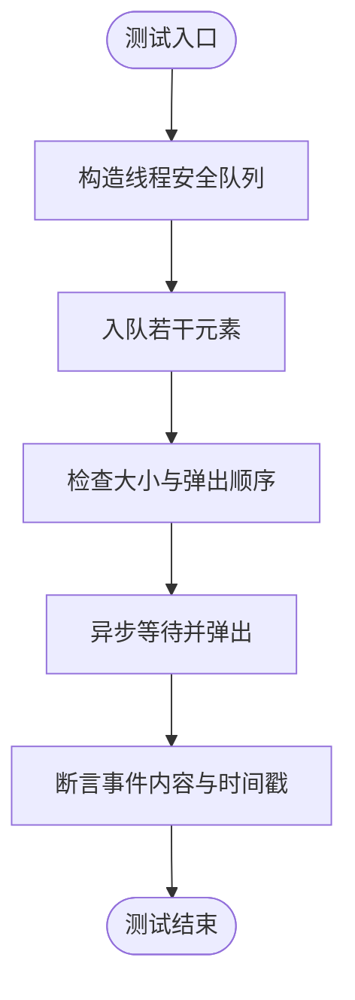
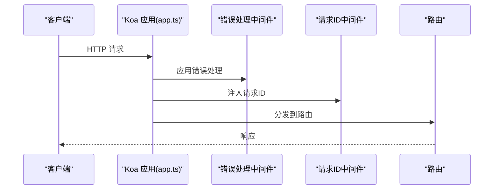
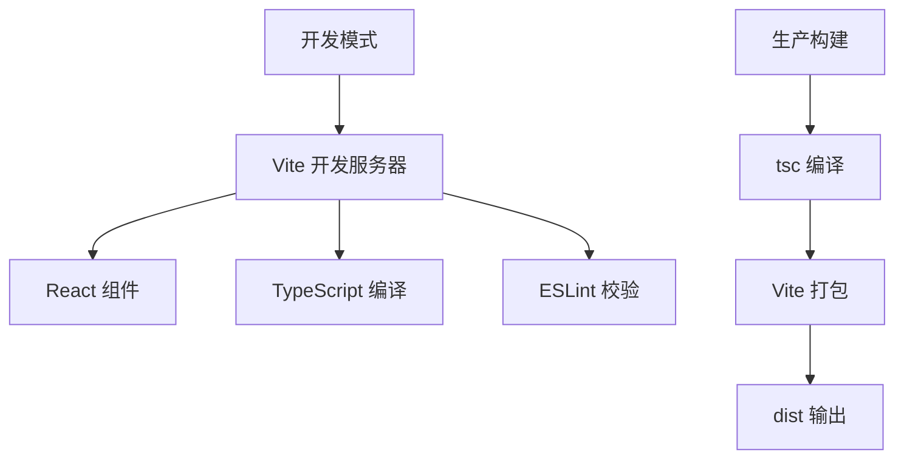

# 开发指南

<cite>
**本文引用的文件**
- [.clangd](file://.clangd)
- [project/agent/CMakeLists.txt](file://project/agent/CMakeLists.txt)
- [docs/agent/工程结构.md](file://docs/agent/工程结构.md)
- [project/agent/src/main.cpp](file://project/agent/src/main.cpp)
- [project/agent/src/runtime/app/agent_app.cpp](file://project/agent/src/runtime/app/agent_app.cpp)
- [project/agent/src/foundation/include/foundation/module.hpp](file://project/agent/src/foundation/include/foundation/module.hpp)
- [project/agent/src/modules/capture/audio/include/capture_audio/audio_capture_module.hpp](file://project/agent/src/modules/capture/audio/include/capture_audio/audio_capture_module.hpp)
- [project/agent/src/modules/processing/encoder/include/processing_encoder/encoder_module.hpp](file://project/agent/src/modules/processing/encoder/include/processing_encoder/encoder_module.hpp)
- [project/agent/tests/foundation/thread_safe_queue_test.cpp](file://project/agent/tests/foundation/thread_safe_queue_test.cpp)
- [project/server/package.json](file://project/server/package.json)
- [project/server/tsconfig.json](file://project/server/tsconfig.json)
- [project/server/src/app.ts](file://project/server/src/app.ts)
- [project/web/package.json](file://project/web/package.json)
- [project/web/tsconfig.json](file://project/web/tsconfig.json)
- [project/web/tsconfig.app.json](file://project/web/tsconfig.app.json)
- [project/web/tsconfig.node.json](file://project/web/tsconfig.node.json)
- [project/web/vite.config.ts](file://project/web/vite.config.ts)
- [project/web/eslint.config.js](file://project/web/eslint.config.js)
- [build/agent/compile_commands.json](file://build/agent/compile_commands.json)
</cite>

## 更新摘要
**所做更改**
- 新增 C++ 开发工具链配置章节，介绍 .clangd 配置文件的作用和优势
- 更新开发环境搭建章节，增加 Clangd 和编译命令文件的支持说明
- 新增代码补全和静态分析能力章节，展示 .clangd 如何提升开发体验
- 更新工具链配置，强调 CMAKE_EXPORT_COMPILE_COMMANDS 的重要性

## 目录
1. [简介](#简介)
2. [项目结构](#项目结构)
3. [核心组件](#核心组件)
4. [架构总览](#架构总览)
5. [详细组件分析](#详细组件分析)
6. [依赖分析](#依赖分析)
7. [性能考虑](#性能考虑)
8. [故障排查指南](#故障排查指南)
9. [结论](#结论)
10. [附录](#附录)

## 简介
本开发指南面向 Pi-Guard 项目的开发者，覆盖开发环境搭建、工具链与 IDE 配置、调试环境准备、代码规范与最佳实践、代码审查与质量保证流程、新功能开发与模块扩展方法、API 设计原则以及贡献与版本管理策略。Pi-Guard 由三部分组成：C++ Agent（实时采集、处理与输出）、TypeScript Server（Koa + TypeScript Web 服务）与 React Vite 前端（Web 控制台）。本文以仓库现有配置与源码为依据，提供可操作的开发指引。

## 项目结构
Pi-Guard 采用多语言分层与能力域划分的组织方式：
- C++ Agent：按"基础层/模块层/运行时/CLI"分层，模块按能力域拆分为独立静态库，便于编译与复用。
- TypeScript Server：基于 Koa 的后端服务，包含路由、中间件、服务与 WebSocket 网关。
- React Vite Web：前端应用，使用 Vite + React + TypeScript，配合 ESLint 进行代码质量控制。

**图表来源**
- [project/agent/src/main.cpp:1-19](file://project/agent/src/main.cpp#L1-L19)
- [project/agent/src/runtime/app/agent_app.cpp:1-138](file://project/agent/src/runtime/app/agent_app.cpp#L1-L138)
- [project/server/src/app.ts:1-14](file://project/server/src/app.ts#L1-L14)
- [project/web/vite.config.ts:1-8](file://project/web/vite.config.ts#L1-L8)
- [project/web/eslint.config.js:1-24](file://project/web/eslint.config.js#L1-L24)

**章节来源**
- [docs/agent/工程结构.md:1-48](file://docs/agent/工程结构.md#L1-L48)
- [project/agent/CMakeLists.txt:1-51](file://project/agent/CMakeLists.txt#L1-L51)

## 核心组件
- Agent 应用入口与生命周期
  - 入口函数负责打印版本、初始化配置、启动应用并进行演示运行与停止。
  - 运行时编排器负责启动日志、配置、性能监控、采集、处理、输出、推送与通知等模块，并维护工作线程与事件总线。
- 基础模块接口
  - 所有模块均实现统一的 Module 接口，具备名称、启动与停止能力，确保一致的生命周期管理。
- 典型模块示例
  - 音频采集模块：通过线程安全队列向下游传递音频帧。
  - 编码模块：作为处理链中的一个节点，负责编码任务的启动与停止。

**章节来源**
- [project/agent/src/main.cpp:1-19](file://project/agent/src/main.cpp#L1-L19)
- [project/agent/src/runtime/app/agent_app.cpp:1-138](file://project/agent/src/runtime/app/agent_app.cpp#L1-L138)
- [project/agent/src/foundation/include/foundation/module.hpp:1-17](file://project/agent/src/foundation/include/foundation/module.hpp#L1-L17)
- [project/agent/src/modules/capture/audio/include/capture_audio/audio_capture_module.hpp:1-24](file://project/agent/src/modules/capture/audio/include/capture_audio/audio_capture_module.hpp#L1-L24)
- [project/agent/src/modules/processing/encoder/include/processing_encoder/encoder_module.hpp:1-21](file://project/agent/src/modules/processing/encoder/include/processing_encoder/encoder_module.hpp#L1-L21)

## 架构总览
Pi-Guard 的运行时架构围绕"模块化 + 事件总线"的设计展开：采集模块产生数据帧，处理模块对数据进行变换，输出模块持久化或推送，基础设施模块提供配置、日志与性能监控，外部接入模块负责 HTTP/WebSocket/RTMP 等对外通信。

**图表来源**
- [project/agent/src/runtime/app/agent_app.cpp:16-63](file://project/agent/src/runtime/app/agent_app.cpp#L16-L63)
- [project/agent/src/foundation/include/foundation/module.hpp:7-14](file://project/agent/src/foundation/include/foundation/module.hpp#L7-L14)

## 详细组件分析

### Agent 应用生命周期与线程模型
Agent 应用在启动阶段依次启动各类模块，并在停止阶段逆序关闭；同时维护多个工作线程，分别驱动不同模块的周期性处理逻辑。该设计确保模块间解耦且具备清晰的资源生命周期。

**图表来源**
- [project/agent/src/main.cpp:6-17](file://project/agent/src/main.cpp#L6-L17)
- [project/agent/src/runtime/app/agent_app.cpp:16-63](file://project/agent/src/runtime/app/agent_app.cpp#L16-L63)

**章节来源**
- [project/agent/src/main.cpp:1-19](file://project/agent/src/main.cpp#L1-L19)
- [project/agent/src/runtime/app/agent_app.cpp:1-138](file://project/agent/src/runtime/app/agent_app.cpp#L1-L138)

### 模块接口与继承关系
所有模块遵循统一的 Module 接口，派生类负责具体业务逻辑与资源管理。下图展示了典型模块的类关系与职责边界。

**图表来源**
- [project/agent/src/foundation/include/foundation/module.hpp:7-14](file://project/agent/src/foundation/include/foundation/module.hpp#L7-L14)
- [project/agent/src/modules/capture/audio/include/capture_audio/audio_capture_module.hpp:11-21](file://project/agent/src/modules/capture/audio/include/capture_audio/audio_capture_module.hpp#L11-L21)
- [project/agent/src/modules/processing/encoder/include/processing_encoder/encoder_module.hpp:9-18](file://project/agent/src/modules/processing/encoder/include/processing_encoder/encoder_module.hpp#L9-L18)

**章节来源**
- [project/agent/src/foundation/include/foundation/module.hpp:1-17](file://project/agent/src/foundation/include/foundation/module.hpp#L1-L17)
- [project/agent/src/modules/capture/audio/include/capture_audio/audio_capture_module.hpp:1-24](file://project/agent/src/modules/capture/audio/include/capture_audio/audio_capture_module.hpp#L1-L24)
- [project/agent/src/modules/processing/encoder/include/processing_encoder/encoder_module.hpp:1-21](file://project/agent/src/modules/processing/encoder/include/processing_encoder/encoder_module.hpp#L1-L21)

### 测试与并发模型
Agent 提供基础并发容器的单元测试，验证线程安全队列的弹出、等待弹出与大小等行为，确保跨线程数据传递的可靠性。

**图表来源**
- [project/agent/tests/foundation/thread_safe_queue_test.cpp:13-39](file://project/agent/tests/foundation/thread_safe_queue_test.cpp#L13-L39)

**章节来源**
- [project/agent/tests/foundation/thread_safe_queue_test.cpp:1-40](file://project/agent/tests/foundation/thread_safe_queue_test.cpp#L1-L40)

### Server 应用与中间件
Server 使用 Koa 组织中间件与路由，提供错误处理与请求 ID 中间件，统一处理异常与追踪。

**图表来源**
- [project/server/src/app.ts:1-14](file://project/server/src/app.ts#L1-L14)

**章节来源**
- [project/server/src/app.ts:1-14](file://project/server/src/app.ts#L1-L14)

### Web 前端与开发工具链
Web 项目采用 Vite + React + TypeScript，ESLint 与 TypeScript-ESLint 提供类型与风格约束，Vite 提供开发服务器与打包能力。

**图表来源**
- [project/web/vite.config.ts:1-8](file://project/web/vite.config.ts#L1-L8)
- [project/web/eslint.config.js:1-24](file://project/web/eslint.config.js#L1-L24)
- [project/web/tsconfig.app.json:1-26](file://project/web/tsconfig.app.json#L1-L26)
- [project/web/tsconfig.node.json:1-25](file://project/web/tsconfig.node.json#L1-L25)

**章节来源**
- [project/web/package.json:1-34](file://project/web/package.json#L1-L34)
- [project/web/vite.config.ts:1-8](file://project/web/vite.config.ts#L1-L8)
- [project/web/eslint.config.js:1-24](file://project/web/eslint.config.js#L1-L24)
- [project/web/tsconfig.json:1-8](file://project/web/tsconfig.json#L1-L8)
- [project/web/tsconfig.app.json:1-26](file://project/web/tsconfig.app.json#L1-L26)
- [project/web/tsconfig.node.json:1-25](file://project/web/tsconfig.node.json#L1-L25)

## 依赖分析
- C++ Agent
  - 使用 CMake 3.16+，C++17 标准，目标产物为可执行程序 pi-guard-agent，链接 runtime 目标。
  - 顶层 CMake 将各模块子目录纳入构建，形成独立静态库，最终汇聚到运行时与可执行体。
  - **新增** 通过 `CMAKE_EXPORT_COMPILE_COMMANDS ON` 导出编译命令，为 Clangd 等工具提供精确的编译上下文。
- TypeScript Server
  - 依赖 Koa 与 @koa/router，开发依赖 ts-node-dev、typescript。
  - tsconfig 严格模式，CommonJS 模块解析，输出至 dist。
- Web 前端
  - 依赖 React、antd-mobile、react-router-dom，开发依赖 Vite、ESLint、TypeScript、React 插件。
  - tsconfig 采用复合项目，分别针对应用与 Node 环境配置。

**章节来源**
- [project/agent/CMakeLists.txt:1-51](file://project/agent/CMakeLists.txt#L1-L51)
- [project/server/package.json:1-28](file://project/server/package.json#L1-L28)
- [project/server/tsconfig.json:1-18](file://project/server/tsconfig.json#L1-L18)
- [project/web/package.json:1-34](file://project/web/package.json#L1-L34)

## 性能考虑
- Agent 线程模型
  - 不同模块的工作线程采用固定休眠间隔驱动，避免忙轮询；建议根据实际硬件与负载调整休眠时间，减少 CPU 占用。
  - 性能监控模块用于收集 CPU、内存与温度指标，可在运行时打印日志辅助定位瓶颈。
- 编码与处理
  - 编码模块与回声消除模块的处理频率应与采集速率匹配，避免缓冲堆积或丢帧。
- Server 与 Web
  - Server 中间件链路简洁，建议在生产环境开启压缩与限流；前端构建启用 Tree-shaking 与按需加载，减少首屏体积。

**章节来源**
- [project/agent/src/runtime/app/agent_app.cpp:78-126](file://project/agent/src/runtime/app/agent_app.cpp#L78-L126)

## 故障排查指南
- Agent 启动失败
  - 检查配置文件路径与权限；确认各模块 start 返回值与日志输出。
  - 关注事件总线订阅是否成功，必要时增加调试日志。
- 并发问题
  - 若出现数据丢失或竞态，优先检查线程安全队列的使用与消费者/生产者同步。
- Server 异常
  - 查看错误处理中间件捕获的异常栈；核对路由与中间件顺序。
- Web 开发问题
  - 使用 ESLint 修复规则警告；确认 tsconfig 与插件版本兼容；Vite 预览模式验证构建结果。
- **新增** C++ 开发工具问题
  - 如果 Clangd 无法正确解析头文件或提供代码补全，检查 `.clangd` 文件中的编译命令路径是否正确。
  - 确认 `compile_commands.json` 文件存在且包含正确的编译选项。

**章节来源**
- [project/agent/src/main.cpp:10-13](file://project/agent/src/main.cpp#L10-L13)
- [project/agent/src/runtime/app/agent_app.cpp:36-41](file://project/agent/src/runtime/app/agent_app.cpp#L36-L41)
- [project/agent/tests/foundation/thread_safe_queue_test.cpp:13-39](file://project/agent/tests/foundation/thread_safe_queue_test.cpp#L13-L39)
- [project/server/src/app.ts:8-10](file://project/server/src/app.ts#L8-L10)
- [project/web/eslint.config.js:8-23](file://project/web/eslint.config.js#L8-L23)

## 结论
Pi-Guard 通过清晰的模块化与统一的生命周期接口，实现了从采集到输出的全链路闭环。结合严格的类型与风格约束、完善的中间件与测试机制，能够支撑稳定高效的开发与运维。新增的 .clangd 配置进一步提升了 C++ 开发体验，通过精确的编译命令提供更好的代码补全和静态分析能力。建议在新增模块时遵循现有接口与命名约定，保持构建与测试流程的一致性。

## 附录

### 开发环境搭建与工具链配置
- C++ Agent
  - 构建命令参考工程文档中的示例，使用 CMake 生成构建系统并编译。
  - 版本与导出编译命令由顶层 CMake 控制，便于 IDE 与补全工具集成。
  - **新增** Clangd 支持：通过 `.clangd` 文件指定编译命令文件路径，实现精确的代码补全和静态分析。
- TypeScript Server
  - 使用 npm/yarn/pnpm 安装依赖，开发脚本提供热重载与类型检查。
  - 构建产物输出至 dist，生产启动使用 Node 运行。
- Web 前端
  - 安装依赖后使用 Vite 启动开发服务器，ESLint 与 TypeScript-ESLint 提供实时校验。
  - 生产构建先执行 tsc 再 vite build，输出 dist。

**章节来源**
- [docs/agent/工程结构.md:40-47](file://docs/agent/工程结构.md#L40-L47)
- [project/agent/CMakeLists.txt:5-5](file://project/agent/CMakeLists.txt#L5-L5)
- [.clangd:1-1](file://.clangd#L1-L1)
- [project/server/package.json:6-11](file://project/server/package.json#L6-L11)
- [project/web/package.json:6-11](file://project/web/package.json#L6-L11)

### C++ 开发工具链配置
- **Clangd 配置文件**
  - 位置：根目录下的 `.clangd` 文件
  - 配置：指向 `build/agent/compile_commands.json` 编译命令文件
  - 作用：为 Clangd 提供精确的编译上下文，支持智能代码补全、符号跳转、静态分析等功能
- **编译命令导出**
  - 通过 `CMAKE_EXPORT_COMPILE_COMMANDS ON` 在构建目录生成 `compile_commands.json`
  - 包含完整的编译选项、头文件路径、预处理器定义等信息
  - 支持多模块、多目标的编译配置统一管理
- **开发体验提升**
  - IDE（如 VS Code、Vim/Neovim）可直接读取编译命令，获得准确的代码分析
  - 支持跨模块头文件包含的正确解析
  - 提供更精确的错误诊断和代码补全建议

**章节来源**
- [.clangd:1-1](file://.clangd#L1-L1)
- [project/agent/CMakeLists.txt:5-5](file://project/agent/CMakeLists.txt#L5-L5)
- [build/agent/compile_commands.json:1-200](file://build/agent/compile_commands.json#L1-L200)

### 代码规范与最佳实践
- C++（基于现有配置）
  - C++17 标准，禁止扩展特性，使用现代语法与 RAII 管理资源。
  - 模块接口统一，命名空间与头文件组织遵循现有层级，避免短名冲突。
  - **新增** 利用 Clangd 的静态分析能力，提前发现潜在的代码问题。
- TypeScript（基于现有配置）
  - 严格模式，CommonJS 模块解析，输出至 dist。
  - 类型检查与未使用变量/参数告警开启，提升代码质量。
- React/Vite（基于现有配置）
  - ESLint 与 TypeScript-ESLint 配置推荐集，React Hooks 与 React Refresh 插件启用。
  - tsconfig 复合项目分别针对应用与 Node 环境，避免类型污染。

**章节来源**
- [project/agent/CMakeLists.txt:7-9](file://project/agent/CMakeLists.txt#L7-L9)
- [project/agent/CMakeLists.txt:11-27](file://project/agent/CMakeLists.txt#L11-L27)
- [project/server/tsconfig.json:2-13](file://project/server/tsconfig.json#L2-L13)
- [project/web/tsconfig.app.json:18-22](file://project/web/tsconfig.app.json#L18-L22)
- [project/web/tsconfig.node.json:17-21](file://project/web/tsconfig.node.json#L17-L21)
- [project/web/eslint.config.js:12-17](file://project/web/eslint.config.js#L12-L17)

### 代码审查与质量保证流程
- 代码审查要点
  - 模块实现是否遵循 Module 接口；生命周期 start/stop 是否成对调用。
  - 并发与线程安全：队列使用、锁与条件变量、无共享状态设计。
  - 日志与错误处理：错误路径是否被中间件捕获，日志级别是否合理。
  - 前端代码：ESLint 规则是否全部通过，类型定义是否完善。
  - **新增** C++ 代码：利用 Clangd 的静态分析报告，重点关注潜在的内存泄漏、空指针访问等问题。
- 质量保证
  - 单元测试：优先补充线程安全队列与模块生命周期相关测试。
  - 集成测试：模拟事件总线与模块交互，验证端到端流程。
  - 构建与发布：确保 CMake、TypeScript 与 Vite 构建均通过。
  - **新增** 静态分析：定期运行 Clang Static Analyzer 或其他静态分析工具，提高代码质量。

**章节来源**
- [project/agent/src/foundation/include/foundation/module.hpp:7-14](file://project/agent/src/foundation/include/foundation/module.hpp#L7-L14)
- [project/agent/tests/foundation/thread_safe_queue_test.cpp:1-40](file://project/agent/tests/foundation/thread_safe_queue_test.cpp#L1-L40)
- [project/server/src/app.ts:8-10](file://project/server/src/app.ts#L8-L10)
- [project/web/eslint.config.js:12-17](file://project/web/eslint.config.js#L12-L17)

### 新功能开发流程与模块扩展方法
- 新增 C++ 模块
  - 在对应能力域创建子目录，实现 Module 接口，提供 PUBLIC 头文件与实现。
  - 在顶层 CMake 中添加子目录与链接目标，确保运行时 PUBLIC 链接。
  - **新增** 自动获得 Clangd 支持：新增模块会自动出现在 `compile_commands.json` 中，无需额外配置。
- 新增 Server 路由与服务
  - 在 routes 与 services 中新增路由与服务，注册中间件，确保错误处理与请求 ID 中间件生效。
- 新增 Web 页面与组件
  - 在 src/pages 中新增页面组件，配置路由，使用 antd-mobile 组件库，保持 ESLint 与类型检查通过。

**章节来源**
- [docs/agent/工程结构.md:3-17](file://docs/agent/工程结构.md#L3-L17)
- [project/agent/CMakeLists.txt:11-27](file://project/agent/CMakeLists.txt#L11-L27)
- [project/server/src/app.ts:1-14](file://project/server/src/app.ts#L1-L14)
- [project/web/package.json:12-17](file://project/web/package.json#L12-L17)

### API 设计原则
- 统一性：模块接口统一，生命周期与命名一致。
- 解耦性：模块间通过事件总线与线程安全队列解耦，避免紧耦合。
- 可观测性：日志模块与性能监控模块贯穿始终，便于诊断。
- 可测试性：模块职责单一，便于单元测试与集成测试。
- **新增** 可维护性：利用 Clangd 的代码补全和静态分析，降低维护成本，提高代码一致性。

**章节来源**
- [project/agent/src/foundation/include/foundation/module.hpp:7-14](file://project/agent/src/foundation/include/foundation/module.hpp#L7-L14)
- [project/agent/src/runtime/app/agent_app.cpp:36-41](file://project/agent/src/runtime/app/agent_app.cpp#L36-L41)

### 贡献流程与版本管理策略
- 贡献流程
  - Fork 仓库 -> 创建分支 -> 提交代码与测试 -> 发起 Pull Request -> 代码审查 -> 合并。
  - 提交信息与变更说明清晰，遵循现有目录与命名约定。
  - **新增** C++ 贡献：建议使用 Clangd 进行本地代码检查，确保符合项目编码规范。
- 版本管理
  - 语义化版本：主版本号用于破坏性变更，次版本号用于新增功能，修订号用于修复。
  - 标签与发布：在合并后打标签并发布，保持版本与构建产物一致。

**章节来源**
- [project/agent/src/main.cpp:7-7](file://project/agent/src/main.cpp#L7-L7)