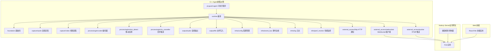
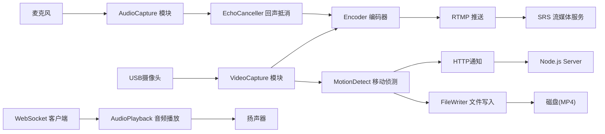
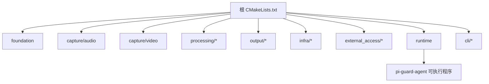

# 开发流程

<cite>
**本文引用的文件**
- [README.md](file://README.md)
- [工程结构.md](file://docs/agent/工程结构.md)
- [构建.md](file://docs/agent/构建.md)
- [数据流.md](file://docs/数据流.md)
- [CMakeLists.txt](file://project/agent/CMakeLists.txt)
- [module.hpp](file://project/agent/src/foundation/include/foundation/module.hpp)
- [audio_capture_module.hpp](file://project/agent/src/modules/capture/audio/include/capture_audio/audio_capture_module.hpp)
- [encoder_module.hpp](file://project/agent/src/modules/processing/encoder/include/processing_encoder/encoder_module.hpp)
- [logger.hpp](file://project/agent/src/modules/infra/log/include/infra_log/logger.hpp)
- [agent_app.cpp](file://project/agent/src/runtime/app/agent_app.cpp)
- [thread_safe_queue_test.cpp](file://project/agent/tests/foundation/thread_safe_queue_test.cpp)
- [package.json](file://project/server/package.json)
- [app.ts](file://project/server/src/app.ts)
- [health.controller.ts](file://project/server/src/controllers/health.controller.ts)
- [.gitignore](file://.gitignore)
</cite>

## 目录
1. [引言](#引言)
2. [项目结构](#项目结构)
3. [核心组件](#核心组件)
4. [架构总览](#架构总览)
5. [详细组件分析](#详细组件分析)
6. [依赖关系分析](#依赖关系分析)
7. [性能考量](#性能考量)
8. [故障排查指南](#故障排查指南)
9. [结论](#结论)
10. [附录](#附录)

## 引言
本指南面向 Pi-Guard 项目的开发者，提供从需求分析到上线运维的完整开发流程建议，覆盖新功能开发、模块扩展、API 设计原则、分支与合并策略、CI/CD 与自动化测试、提交规范、调试与性能分析等。Pi-Guard 采用多语言协作架构：硬件采集与实时处理在 C++ Agent（树莓派侧），流媒体与业务逻辑在 Node.js Server，前端在 Web。本文以现有工程结构与代码为依据，给出可操作的实践建议。

## 项目结构
Pi-Guard 的工程位于 project/ 目录下，分为 agent（C++）、server（Node.js）、web（前端）、srs（流媒体）四大子工程。C++ Agent 采用 CMake 组织，模块按能力域分目录，每个叶子目录是一个独立静态库，最终由 runtime 编排形成可执行程序。Node.js Server 使用 Koa，提供健康检查等基础能力。

图表来源
- [工程结构.md:1-48](file://docs/agent/工程结构.md#L1-L48)
- [CMakeLists.txt:1-51](file://project/agent/CMakeLists.txt#L1-L51)
- [agent_app.cpp:1-138](file://project/agent/src/runtime/app/agent_app.cpp#L1-L138)
- [app.ts:1-14](file://project/server/src/app.ts#L1-L14)

章节来源
- [README.md:1-68](file://README.md#L1-L68)
- [工程结构.md:1-48](file://docs/agent/工程结构.md#L1-L48)
- [CMakeLists.txt:1-51](file://project/agent/CMakeLists.txt#L1-L51)

## 核心组件
- 基础设施与接口
  - Module 接口：所有模块统一实现 name/start/stop 生命周期管理，确保 runtime 可编排启动与停止。
  - 线程安全队列：Foundation 提供线程安全队列，用于跨线程传递事件与帧数据。
  - 日志接口：Logger 抽象定义日志级别与启用查询，便于替换具体后端（如 spdlog）。
- 模块分类
  - 采集：capture/audio、capture/video
  - 处理：processing/encoder、processing/motion_detect、processing/echo_canceller
  - 输出：output/audio、output/file
  - 基础设施：infra/config、infra/event_bus、infra/log、infra/perf_monitor
  - 外部访问：external_access/http、external_access/pusher、external_access/websocket
- 运行时编排
  - AgentApp 负责初始化各模块、启动线程池、订阅事件并驱动处理循环，提供性能采样与日志记录。

章节来源
- [module.hpp:1-17](file://project/agent/src/foundation/include/foundation/module.hpp#L1-L17)
- [audio_capture_module.hpp:1-24](file://project/agent/src/modules/capture/audio/include/capture_audio/audio_capture_module.hpp#L1-L24)
- [encoder_module.hpp:1-21](file://project/agent/src/modules/processing/encoder/include/processing_encoder/encoder_module.hpp#L1-L21)
- [logger.hpp:1-25](file://project/agent/src/modules/infra/log/include/infra_log/logger.hpp#L1-L25)
- [agent_app.cpp:1-138](file://project/agent/src/runtime/app/agent_app.cpp#L1-L138)

## 架构总览
Pi-Guard 的数据流贯穿采集、处理、输出与外部访问四类模块，并通过 runtime 统一编排。下图展示典型数据通路与模块交互。

图表来源
- [数据流.md:1-33](file://docs/数据流.md#L1-L33)
- [agent_app.cpp:1-138](file://project/agent/src/runtime/app/agent_app.cpp#L1-L138)

## 详细组件分析

### 新功能开发流程（需求到上线）
- 需求分析
  - 明确输入/输出、吞吐与延迟约束、可靠性与资源占用目标。
  - 评估是否属于采集/处理/输出/基础设施/外部访问范畴，决定模块归属。
- 设计文档
  - 描述算法/协议、数据结构、线程模型、错误传播与恢复策略。
  - 对照现有模块（如 capture/processing/output/infra/external_access）选择复用点与边界。
- 模块设计
  - 实现 Module 接口，提供 name/start/stop。
  - 使用 Foundation 类型与线程安全队列进行数据传递。
  - 将头文件置于 include/<子模块>/...，遵循现有命名空间与目录结构。
- 实现步骤
  - 新增 CMake 子目录与 CMakeLists.txt，导出静态库目标。
  - 在 runtime 中注册模块实例与线程任务，接入事件总线与配置管理。
  - 如需 CLI 工具，新增子目录并 add_subdirectory。
- 单元测试
  - 在 tests/ 下新增测试用例，参考现有线程安全队列测试模式。
  - 使用 CTest（根 CMakeLists.txt 已启用）进行编译与执行。
- 集成测试
  - 在 AgentApp 中以最小闭环验证模块工作流，结合日志与性能监控观察行为。
  - 与 Node.js Server/Web 前端联调，验证端到端数据通路。

章节来源
- [工程结构.md:1-48](file://docs/agent/工程结构.md#L1-L48)
- [CMakeLists.txt:1-51](file://project/agent/CMakeLists.txt#L1-L51)
- [thread_safe_queue_test.cpp:1-40](file://project/agent/tests/foundation/thread_safe_queue_test.cpp#L1-L40)
- [agent_app.cpp:1-138](file://project/agent/src/runtime/app/agent_app.cpp#L1-L138)

### 模块扩展方法
- 添加新的处理模块
  - 在 processing/ 下新建子目录，实现 Module 接口，声明头文件与 CMake 目标。
  - 在 runtime 中构造实例并加入启动/停止序列，必要时创建专用线程。
- 添加新的外部访问模块
  - 在 external_access/ 下新建子目录，实现网络/协议适配（如 HTTP/WebSocket/RTMP）。
  - 通过事件总线或配置驱动触发外部动作。
- 添加新的基础设施模块
  - 在 infra/ 下新建子目录，封装通用能力（日志、配置、事件总线、性能监控）。
  - 保证接口稳定，避免对上层模块产生耦合。

章节来源
- [CMakeLists.txt:1-51](file://project/agent/CMakeLists.txt#L1-L51)
- [agent_app.cpp:1-138](file://project/agent/src/runtime/app/agent_app.cpp#L1-L138)

### API 设计原则
- 接口设计
  - 统一使用 Module 接口，生命周期清晰，避免隐式状态依赖。
  - 数据通道使用线程安全队列，明确生产者/消费者职责。
- 错误处理
  - 模块内部失败应向上游传播事件或错误码，避免静默失败。
  - 日志接口提供多级别输出，便于定位问题。
- 版本兼容性
  - 头文件路径与命名空间保持稳定，避免破坏性变更。
  - 新增接口优先向后兼容，旧接口延后弃用并提供迁移指引。

章节来源
- [module.hpp:1-17](file://project/agent/src/foundation/include/foundation/module.hpp#L1-L17)
- [logger.hpp:1-25](file://project/agent/src/modules/infra/log/include/infra_log/logger.hpp#L1-L25)

### 分支管理策略与合并流程
- 分支策略
  - 主干保护：仅允许通过 Pull Request 合并到主分支。
  - 功能分支：feature/<模块>/<子任务>，短期特性可基于 develop 或主分支切出。
  - 修复分支：fix/<问题描述>，用于热修复。
- 合并流程
  - 提交前自检：通过构建、单元测试与类型检查。
  - 代码审查：至少一名维护者批准。
  - CI 自动化：合并前执行构建、测试与覆盖率统计。
  - 合并后清理：删除已合并的分支。

（本节为通用实践建议，未直接分析特定文件）

### 持续集成与自动化测试
- C++ Agent
  - CMake 已启用 CTest，可通过 ctest 执行测试套件。
  - 可在 CI 中设置构建与测试步骤，收集覆盖率报告。
- Node.js Server
  - 使用 npm scripts 提供开发、构建与类型检查命令，CI 可复用。
  - 建议增加 lint 与单元测试步骤，确保路由与中间件正确性。

章节来源
- [CMakeLists.txt:29-32](file://project/agent/CMakeLists.txt#L29-L32)
- [thread_safe_queue_test.cpp:1-40](file://project/agent/tests/foundation/thread_safe_queue_test.cpp#L1-L40)
- [package.json:6-11](file://project/server/package.json#L6-L11)

### 代码提交规范与提交信息格式
- 提交信息格式建议
  - 类型: 摘要（不超过 50 字）
  - 正文: 背景、变更点、影响范围、风险提示（可选）
  - 页脚: 关联 Issue/PR、Breaking Change、Co-authored-by（可选）
- 示例
  - feat(agent): 新增音频回声抵消模块
  - fix(server): 修正健康检查响应体类型
  - docs(agent): 更新构建与模块结构说明
- 代码风格
  - C++：遵循 C++17，禁用扩展，统一命名与头文件包含顺序。
  - TypeScript：遵循项目现有 tsconfig 与 eslint 配置。

章节来源
- [构建.md:1-86](file://docs/agent/构建.md#L1-L86)
- [package.json:1-28](file://project/server/package.json#L1-L28)

### 开发调试技巧与性能分析
- 调试技巧
  - 利用 CMake 导出 compile_commands.json，配合 clangd/IDE 获取智能提示与跳转。
  - 在 runtime 中开启日志与性能监控，观察 CPU/内存/温度等指标。
  - 使用线程安全队列的 wait_and_pop 等接口，验证事件流转与阻塞行为。
- 性能分析
  - 在 Demo 循环中周期性采集性能数据，定位瓶颈模块。
  - 结合编码器/采集器的处理周期，调整线程睡眠间隔以平衡吞吐与延迟。

章节来源
- [构建.md:13-13](file://docs/agent/构建.md#L13-L13)
- [agent_app.cpp:65-76](file://project/agent/src/runtime/app/agent_app.cpp#L65-L76)
- [thread_safe_queue_test.cpp:28-38](file://project/agent/tests/foundation/thread_safe_queue_test.cpp#L28-L38)

## 依赖关系分析
- 组件耦合
  - runtime 通过 Module 接口与各模块解耦，启动/停止顺序可控。
  - Foundation 提供通用类型与线程安全队列，降低模块间耦合。
- 外部依赖
  - C++ Agent：spdlog、OpenCV、ALSA 等（按需启用）。
  - Node.js Server：Koa、@koa/router 等。
- 构建拓扑
  - 根 CMakeLists.txt 串联 foundation → 各模块 → runtime → 可执行文件，CLI 工具按需加入。

图表来源
- [CMakeLists.txt:11-27](file://project/agent/CMakeLists.txt#L11-L27)

章节来源
- [CMakeLists.txt:1-51](file://project/agent/CMakeLists.txt#L1-L51)

## 性能考量
- 线程模型
  - 采用多工作线程分别驱动不同模块，避免阻塞关键路径。
  - 通过 sleep 控制轮询频率，兼顾资源占用与实时性。
- 数据通路
  - 使用线程安全队列降低锁竞争，提升并发吞吐。
- 资源监控
  - 启用性能监控模块，定期采样 CPU/内存/温度，辅助容量规划与优化。

章节来源
- [agent_app.cpp:78-126](file://project/agent/src/runtime/app/agent_app.cpp#L78-L126)

## 故障排查指南
- 构建失败
  - 检查 CMake 选项与依赖安装（如 ALSA/OpenCV/spdlog）。
  - 确认 BUILD_TESTING 与 CMAKE_BUILD_TYPE 设置。
- 运行时异常
  - 查看日志模块输出，确认模块启动/停止顺序与事件订阅是否生效。
  - 使用单元测试验证线程安全队列与事件分发行为。
- 网络/协议问题
  - Node.js Server 提供健康检查接口，先验证服务可用性。
  - 检查 WebSocket/HTTP/RTMP 配置与防火墙策略。

章节来源
- [构建.md:66-85](file://docs/agent/构建.md#L66-L85)
- [agent_app.cpp:16-63](file://project/agent/src/runtime/app/agent_app.cpp#L16-L63)
- [health.controller.ts:1-7](file://project/server/src/controllers/health.controller.ts#L1-L7)

## 结论
Pi-Guard 的模块化架构与统一的 Module 接口为新功能开发提供了清晰的扩展路径。遵循本文的开发流程、模块扩展方法、API 设计原则与调试性能分析方法，可高效地在采集、处理、输出、基础设施与外部访问五大领域迭代增强系统能力。建议在 CI 中固化构建、测试与覆盖率检查，确保质量与稳定性。

## 附录
- 快速构建与安装
  - C++ Agent：在 project/agent 目录执行 out-of-source 构建与安装。
  - Node.js Server：使用 npm scripts 进行开发、构建与类型检查。
- 忽略文件
  - 根据 .gitignore 配置，构建产物与依赖目录不应提交至版本库。

章节来源
- [构建.md:46-85](file://docs/agent/构建.md#L46-L85)
- [package.json:6-11](file://project/server/package.json#L6-L11)
- [.gitignore:1-44](file://.gitignore#L1-L44)