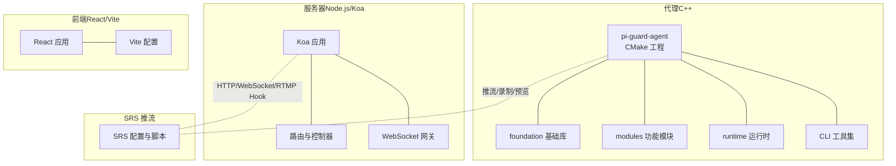
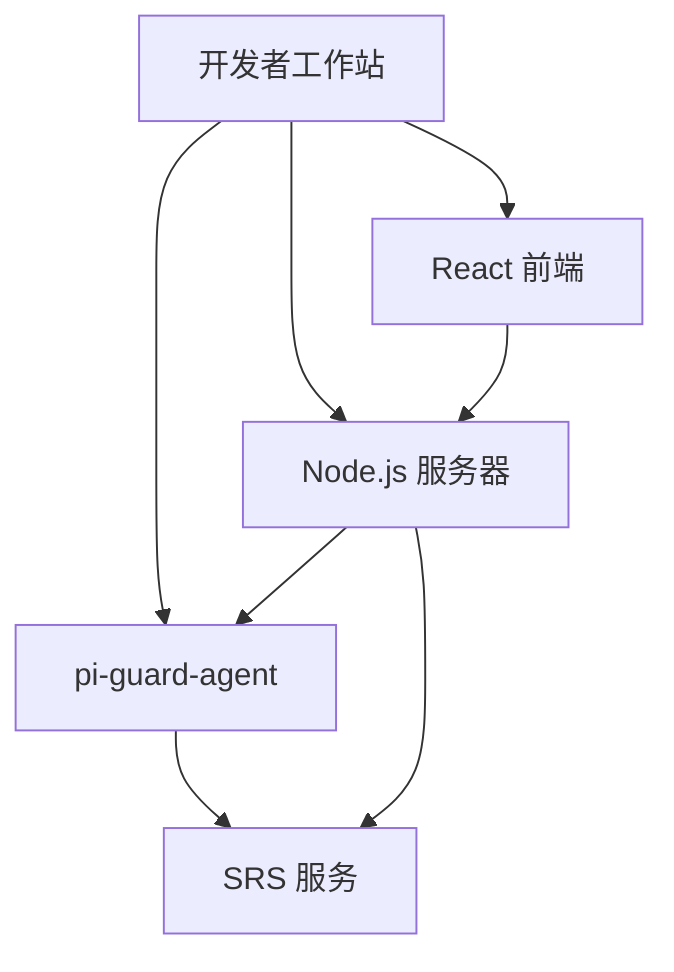
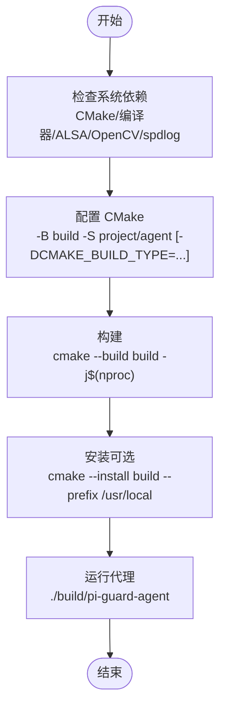
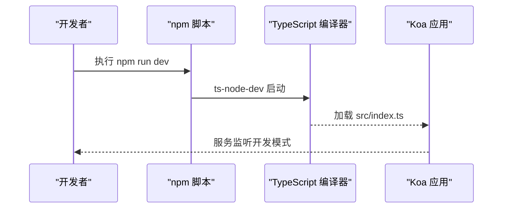
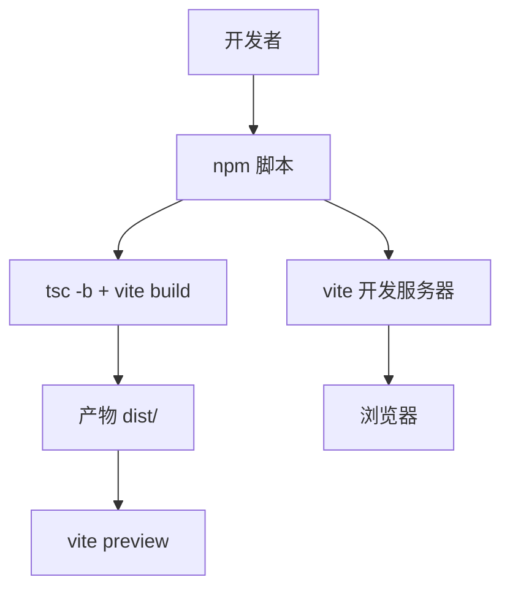
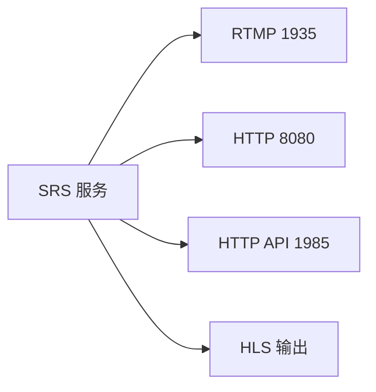
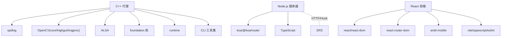

# 开发环境搭建

<cite>
**本文引用的文件**
- [project/agent/CMakeLists.txt](file://project/agent/CMakeLists.txt)
- [docs/agent/构建.md](file://docs/agent/构建.md)
- [docs/agent/技术方案-capture-video.md](file://docs/agent/技术方案-capture-video.md)
- [docs/agent/技术方案-capture-audio.md](file://docs/agent/技术方案-capture-audio.md)
- [project/agent/src/main.cpp](file://project/agent/src/main.cpp)
- [project/agent/src/foundation/CMakeLists.txt](file://project/agent/src/foundation/CMakeLists.txt)
- [project/agent/include/piguard/version.hpp](file://project/agent/include/piguard/version.hpp)
- [project/server/package.json](file://project/server/package.json)
- [project/server/src/app.ts](file://project/server/src/app.ts)
- [project/web/package.json](file://project/web/package.json)
- [project/web/vite.config.ts](file://project/web/vite.config.ts)
- [project/srs/conf/srs.conf](file://project/srs/conf/srs.conf)
</cite>

## 目录
1. [简介](#简介)
2. [项目结构](#项目结构)
3. [核心组件](#核心组件)
4. [架构总览](#架构总览)
5. [详细组件分析](#详细组件分析)
6. [依赖关系分析](#依赖关系分析)
7. [性能考虑](#性能考虑)
8. [故障排查指南](#故障排查指南)
9. [结论](#结论)
10. [附录](#附录)

## 简介
本指南面向希望在本地搭建 Pi-Guard 开发环境的工程师，覆盖系统要求、工具链安装、各子系统依赖、IDE 配置建议、调试工具与常见问题排查。Pi-Guard 由三部分组成：C++ 代理（树莓派侧）、Node.js 服务器（Koa + TypeScript）、React 前端（Vite + React）。此外，项目内置 SRS RTMP 推流服务用于演示。

## 项目结构
- 代理（C++，CMake）：位于 project/agent，包含基础库、模块化功能（采集、处理、输出、基础设施、外部接入）、运行时与命令行工具。
- 服务器（Node.js/Koa）：位于 project/server，TypeScript 源码，Koa 应用、路由、中间件与 WebSocket 网关。
- 前端（React/Vite）：位于 project/web，React 19 + Vite + Ant Design Mobile。
- SRS 推流：位于 project/srs，提供 RTMP/HLS/HTTP API 服务并与服务器联动。

图表来源
- [project/agent/CMakeLists.txt:1-51](file://project/agent/CMakeLists.txt#L1-L51)
- [project/server/src/app.ts:1-14](file://project/server/src/app.ts#L1-L14)
- [project/web/vite.config.ts:1-8](file://project/web/vite.config.ts#L1-L8)
- [project/srs/conf/srs.conf:1-61](file://project/srs/conf/srs.conf#L1-L61)

章节来源
- [project/agent/CMakeLists.txt:1-51](file://project/agent/CMakeLists.txt#L1-L51)
- [project/server/src/app.ts:1-14](file://project/server/src/app.ts#L1-L14)
- [project/web/vite.config.ts:1-8](file://project/web/vite.config.ts#L1-L8)
- [project/srs/conf/srs.conf:1-61](file://project/srs/conf/srs.conf#L1-L61)

## 核心组件
- 代理（pi-guard-agent）
  - 使用 CMake 组织，启用 C++17，导出 compile_commands.json 供 IDE/clangd 使用。
  - 通过 find_package 声明的外部依赖：spdlog、OpenCV（core/highgui/imgproc）、ALSA（音频采集）。
  - 提供 CLI 工具：预览视频、录制音频、MP4 写入、SRS 推流。
- 服务器（Node.js/Koa）
  - TypeScript + Koa，包含路由、中间件（错误处理、请求 ID）、WebSocket 网关。
  - 通过 package.json 管理依赖与脚本（dev/build/start/typecheck）。
- 前端（React/Vite）
  - React 19 + Vite，Ant Design Mobile，ESLint + TypeScript。
  - 通过 package.json 管理依赖与脚本（dev/build/lint/preview）。
- SRS 推流
  - 提供 RTMP/HLS/HTTP API，配置与钩子对接服务器。

章节来源
- [docs/agent/构建.md:1-86](file://docs/agent/构建.md#L1-L86)
- [project/agent/CMakeLists.txt:1-51](file://project/agent/CMakeLists.txt#L1-L51)
- [project/server/package.json:1-28](file://project/server/package.json#L1-L28)
- [project/web/package.json:1-34](file://project/web/package.json#L1-L34)
- [project/srs/conf/srs.conf:1-61](file://project/srs/conf/srs.conf#L1-L61)

## 架构总览
下图展示开发环境中的组件交互：代理负责采集与编码并通过 RTMP 推送到 SRS；服务器提供 HTTP/WebSocket 接口并与 SRS 钩子联动；前端通过 WebSocket 实时查看状态与数据。

图表来源
- [project/agent/src/main.cpp:1-19](file://project/agent/src/main.cpp#L1-L19)
- [project/srs/conf/srs.conf:1-61](file://project/srs/conf/srs.conf#L1-L61)
- [project/server/src/app.ts:1-14](file://project/server/src/app.ts#L1-L14)
- [project/web/vite.config.ts:1-8](file://project/web/vite.config.ts#L1-L8)

## 详细组件分析

### C++ 代理（pi-guard-agent）开发环境
- 系统与工具
  - CMake ≥ 3.16，C++17 标准，禁用扩展。
  - 建议安装 build-essential、cmake、pkg-config 以满足编译与打包工具链。
- 外部依赖
  - 日志：spdlog（通过 find_package 声明）。
  - OpenCV：用于工具（preview-video）。
  - ALSA：音频采集（audio_capture_provider 依赖）。
  - 其他系统库：根据源码链接需求安装对应 dev 包。
- 构建与安装
  - 建议在仓库根目录进行 out-of-source 构建（构建目录 build）。
  - 可选参数：构建类型（Release/Debug）、是否启用测试（BUILD_TESTING）。
  - 安装前缀默认随 CMake 安装规则，可执行文件安装到 bin。
- 常用 CMake 选项
  - PI_GUARD_LOG_BACKEND：日志后端（当前仅支持 spdlog）。
  - BUILD_TESTING：配合 CTest，启用后生成测试可执行文件。
  - -DCMAKE_BUILD_TYPE：选择 Release 或 Debug。
- 视频采集（V4L2）
  - 单生产者+多消费者模型，队列容量与回收机制明确，底层缓冲区生命周期与业务帧生命周期一致。
- 音频采集（ALSA）
  - 单生产者+多消费者，队列容量控制与 EPIPE/EAGAIN 处理策略清晰，建议遵循停止顺序避免竞态。

图表来源
- [docs/agent/构建.md:46-86](file://docs/agent/构建.md#L46-L86)
- [docs/agent/技术方案-capture-video.md:54-103](file://docs/agent/技术方案-capture-video.md#L54-L103)
- [docs/agent/技术方案-capture-audio.md:57-94](file://docs/agent/技术方案-capture-audio.md#L57-L94)

章节来源
- [docs/agent/构建.md:1-86](file://docs/agent/构建.md#L1-L86)
- [docs/agent/技术方案-capture-video.md:1-123](file://docs/agent/技术方案-capture-video.md#L1-L123)
- [docs/agent/技术方案-capture-audio.md:1-139](file://docs/agent/技术方案-capture-audio.md#L1-L139)
- [project/agent/CMakeLists.txt:1-51](file://project/agent/CMakeLists.txt#L1-L51)
- [project/agent/src/foundation/CMakeLists.txt:1-9](file://project/agent/src/foundation/CMakeLists.txt#L1-L9)
- [project/agent/include/piguard/version.hpp:1-8](file://project/agent/include/piguard/version.hpp#L1-L8)

### Node.js 服务器（Koa + TypeScript）开发环境
- 环境要求
  - Node.js（推荐 LTS 版本），npm。
- 依赖管理
  - 运行时依赖：koa、@koa/router。
  - 开发依赖：@types/node、@types/koa、@types/koa__router、ts-node-dev、typescript。
- 构建与运行
  - 开发：脚本 dev 使用 ts-node-dev 启动，支持热重启与转译。
  - 构建：脚本 build 使用 tsc 编译 tsconfig.json。
  - 运行：脚本 start 启动 dist/index.js。
  - 类型检查：脚本 typecheck 使用 tsc --noEmit。
- 配置要点
  - app.ts 注册中间件与路由，确保错误处理与请求 ID 中间件在路由之前。

图表来源
- [project/server/package.json:6-11](file://project/server/package.json#L6-L11)
- [project/server/src/app.ts:1-14](file://project/server/src/app.ts#L1-L14)

章节来源
- [project/server/package.json:1-28](file://project/server/package.json#L1-L28)
- [project/server/src/app.ts:1-14](file://project/server/src/app.ts#L1-L14)

### React 前端（Vite + React）开发环境
- 环境要求
  - Node.js（推荐 LTS），npm。
- 依赖管理
  - 运行时依赖：react、react-dom、react-router-dom、antd-mobile。
  - 开发依赖：@types/react、@types/react-dom、@types/node、@vitejs/plugin-react、eslint、vite、typescript、typescript-eslint 等。
- 构建与运行
  - 开发：脚本 dev 使用 vite 启动本地开发服务器。
  - 构建：脚本 build 先 tsc -b 再 vite build。
  - 预览：脚本 preview 使用 vite preview。
  - Lint：脚本 lint 使用 eslint。
- 配置要点
  - vite.config.ts 启用 @vitejs/plugin-react 插件。

图表来源
- [project/web/package.json:6-11](file://project/web/package.json#L6-L11)
- [project/web/vite.config.ts:1-8](file://project/web/vite.config.ts#L1-L8)

章节来源
- [project/web/package.json:1-34](file://project/web/package.json#L1-L34)
- [project/web/vite.config.ts:1-8](file://project/web/vite.config.ts#L1-L8)

### SRS 推流服务开发环境
- 环境要求
  - Linux（推荐 Ubuntu/Debian/Raspberry Pi OS）。
- 配置要点
  - RTMP 监听 1935，HTTP 服务器 8080，HTTP API 1985。
  - HLS 输出路径与窗口参数可按需调整。
  - HTTP Hooks 与服务器对接（on_publish/on_unpublish/on_hls）。
- 运行方式
  - 使用脚本 run-srs.sh 启动（若存在）。
  - 与服务器联调时，确保服务器能访问 SRS 的 HTTP API 与 RTMP 推流地址。

图表来源
- [project/srs/conf/srs.conf:1-61](file://project/srs/conf/srs.conf#L1-L61)

章节来源
- [project/srs/conf/srs.conf:1-61](file://project/srs/conf/srs.conf#L1-L61)

## 依赖关系分析
- 代理（C++）
  - 依赖：spdlog、OpenCV（core/highgui/imgproc）、ALSA。
  - 模块化组织：foundation → 各模块 → runtime → cli → 可执行文件。
- 服务器（Node.js）
  - 依赖：koa、@koa/router；开发依赖：typescript、ts-node-dev、@types/*。
- 前端（React）
  - 依赖：react、react-dom、react-router-dom、antd-mobile；开发依赖：vite、@vitejs/plugin-react、eslint、typescript。
- SRS
  - 作为独立服务，通过 HTTP API 与服务器交互。

图表来源
- [docs/agent/构建.md:15-39](file://docs/agent/构建.md#L15-L39)
- [project/agent/CMakeLists.txt:11-27](file://project/agent/CMakeLists.txt#L11-L27)
- [project/server/package.json:16-26](file://project/server/package.json#L16-L26)
- [project/web/package.json:12-32](file://project/web/package.json#L12-L32)
- [project/srs/conf/srs.conf:6-15](file://project/srs/conf/srs.conf#L6-L15)

章节来源
- [docs/agent/构建.md:15-39](file://docs/agent/构建.md#L15-L39)
- [project/agent/CMakeLists.txt:11-27](file://project/agent/CMakeLists.txt#L11-L27)
- [project/server/package.json:16-26](file://project/server/package.json#L16-L26)
- [project/web/package.json:12-32](file://project/web/package.json#L12-L32)
- [project/srs/conf/srs.conf:6-15](file://project/srs/conf/srs.conf#L6-L15)

## 性能考虑
- 代理构建
  - 使用 Release 构建类型以获得更优性能；在开发阶段可使用 Debug 以利调试。
  - 合理设置线程与队列容量，避免过高的 CPU 占用与内存占用。
- 服务器
  - 开发阶段使用 ts-node-dev，生产环境使用 tsc 构建后启动。
  - 合理设置中间件顺序，减少不必要的处理。
- 前端
  - 开发服务器使用 Vite，构建时启用压缩与 Tree Shaking。
  - ESLint 与 TypeScript 配置有助于早期发现性能与类型问题。
- SRS
  - HLS 窗口与片段大小影响延迟与存储；根据场景调整 hls_window 与 hls_fragment。

[本节为通用指导，无需列出章节来源]

## 故障排查指南
- C++ 代理（Linux/Ubuntu/树莓派）
  - 缺少 ALSA 开发库：安装 libasound2-dev；运行时通常 libasound2 已存在。
  - 缺少 OpenCV：安装 libopencv-dev（用于 preview-video 工具）。
  - 缺少 spdlog：安装 libspdlog-dev（若启用 spdlog 日志后端）。
  - 构建失败（CMake 版本过低）：升级 CMake 至 ≥ 3.16。
  - 构建失败（C++17 不支持）：更换支持 C++17 的 g++/clang++。
  - 视频采集无画面：检查 /dev/videoX 是否存在、权限与格式（YUYV）。
  - 音频采集无声：检查 ALSA 设备名称、采样率与声道数配置。
- 服务器（Node.js）
  - 依赖缺失：执行 npm ci 或 npm install 安装依赖。
  - 端口冲突：修改 package.json 中的端口或停止占用进程。
  - 类型检查失败：修复 TypeScript 错误后再进行构建。
- 前端（React/Vite）
  - 依赖缺失：执行 npm ci 或 npm install 安装依赖。
  - ESLint 报错：根据提示修复代码风格或忽略规则。
  - 构建失败：检查 vite.config.ts 与 tsconfig 配置。
- SRS
  - RTMP/HLS 不可用：检查 srs.conf 中端口与路径配置。
  - HTTP API 无法访问：确认 HTTP API 端口与防火墙设置。
  - 与服务器钩子通信失败：检查钩子回调地址与服务器可达性。

章节来源
- [docs/agent/构建.md:24-44](file://docs/agent/构建.md#L24-L44)
- [docs/agent/技术方案-capture-video.md:54-103](file://docs/agent/技术方案-capture-video.md#L54-L103)
- [docs/agent/技术方案-capture-audio.md:57-94](file://docs/agent/技术方案-capture-audio.md#L57-L94)
- [project/server/package.json:16-26](file://project/server/package.json#L16-L26)
- [project/web/package.json:12-32](file://project/web/package.json#L12-L32)
- [project/srs/conf/srs.conf:1-61](file://project/srs/conf/srs.conf#L1-L61)

## 结论
通过本指南，您可以在本地完成 Pi-Guard 的完整开发环境搭建：安装系统依赖与工具链，分别配置 C++ 代理、Node.js 服务器与 React 前端，验证 SRS 推流服务，并结合 IDE 与调试工具进行高效开发。遇到问题时，可依据故障排查指南快速定位与解决。

[本节为总结性内容，无需列出章节来源]

## 附录

### IDE 配置建议
- VS Code
  - C++：安装 C/C++、CMake、clangd 扩展；启用 CMAKE_EXPORT_COMPILE_COMMANDS 后，VS Code 可自动识别 compile_commands.json。
  - Node.js：安装 ES Lint、TypeScript Vue Plugin、Debugger for Chrome 扩展。
  - React/Vite：安装 ES Lint、Prettier、Bracket Pair Colorizer 扩展。
- CLion
  - 导入 CMake 工程（project/agent），确保 CMake 版本与 C++17 标准正确。
  - 配置 GDB 调试器，设置断点与变量监视。
- WebStorm/IntelliJ IDEA
  - 为前端项目启用 TypeScript 支持与 ESLint 集成。
  - 为服务器项目启用 Node.js 与 TypeScript 支持。

[本节为通用指导，无需列出章节来源]

### 调试环境配置
- C++ 代理
  - GDB：编译时保留符号信息（Debug），在 CLion 或 VS Code 中设置断点与运行参数。
  - 静态分析：clang-tidy/scan-build（可选）。
- Node.js 服务器
  - Chrome DevTools：使用 --inspect 启动 Node.js，连接 Chrome 进行断点调试。
  - 日志：结合服务器日志与 SRS HTTP API 日志定位问题。
- 前端
  - Chrome DevTools：调试 React 组件与网络请求。
  - WebSocket：使用浏览器开发者工具观察消息收发。
- 网络抓包
  - 使用 tcpdump/ wireshark 抓取 RTMP/HLS/HTTP 流量，辅助定位协议层问题。

[本节为通用指导，无需列出章节来源]