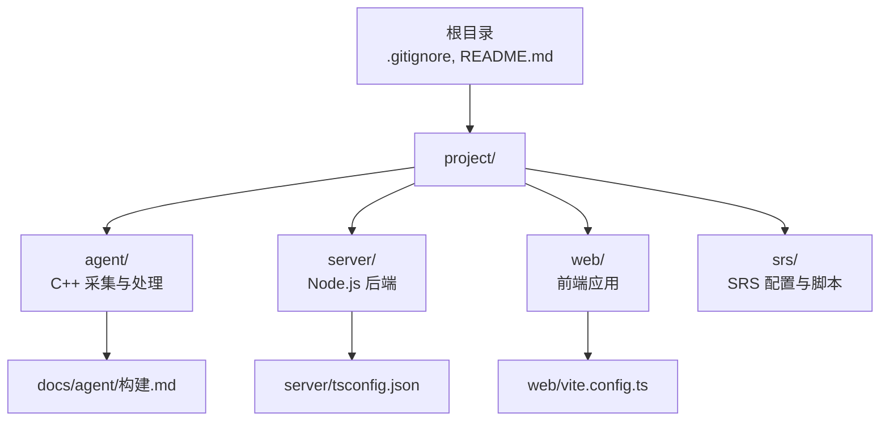
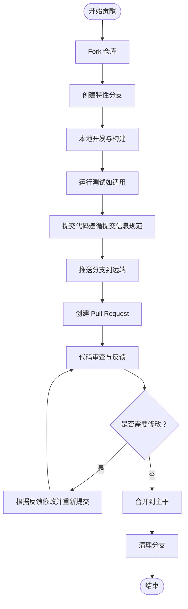
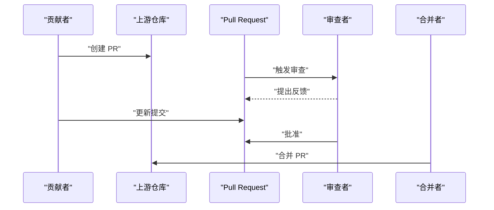
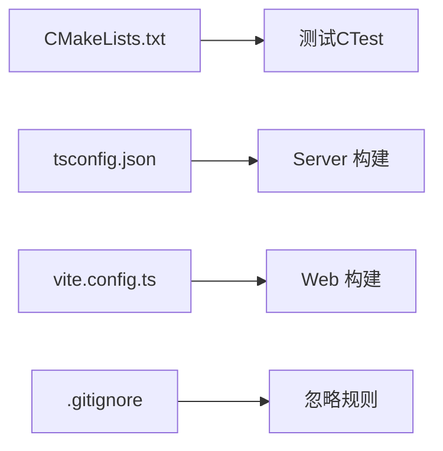

# 贡献指南

<cite>
**本文引用的文件**
- [README.md](file://README.md)
- [.gitignore](file://.gitignore)
- [project/agent/CMakeLists.txt](file://project/agent/CMakeLists.txt)
- [project/agent/tests/CMakeLists.txt](file://project/agent/tests/CMakeLists.txt)
- [project/agent/src/foundation/include/foundation/types.hpp](file://project/agent/src/foundation/include/foundation/types.hpp)
- [docs/agent/构建.md](file://docs/agent/构建.md)
- [project/server/src/app.ts](file://project/server/src/app.ts)
- [project/server/package.json](file://project/server/package.json)
- [project/server/tsconfig.json](file://project/server/tsconfig.json)
- [project/web/vite.config.ts](file://project/web/vite.config.ts)
- [project/web/package.json](file://project/web/package.json)
</cite>

## 目录
1. [简介](#简介)
2. [项目结构](#项目结构)
3. [核心组件](#核心组件)
4. [架构总览](#架构总览)
5. [详细组件分析](#详细组件分析)
6. [依赖分析](#依赖分析)
7. [性能考虑](#性能考虑)
8. [故障排查指南](#故障排查指南)
9. [结论](#结论)
10. [附录](#附录)

## 简介
本指南面向希望为 Pi-Guard 项目做出贡献的开发者，涵盖从 Fork 项目、创建分支、提交代码、创建 Pull Request 的完整流程；Issue 提交规范（Bug 报告、功能请求）；代码审查流程与标准；文档贡献方式（改进、翻译、示例）；社区行为准则与沟通规范；维护者职责与决策流程；以及新贡献者的入门指导与资源链接。

Pi-Guard 是一个面向家庭/轻量工业场景的实时安防系统，采用分层架构，包含硬件与采集层（C++ 代理）、流媒体交换层（SRS）、业务逻辑层（Node.js 后端）、终端交互层（Web 前端）。项目采用多语言混合开发，包含 C++（Agent）、TypeScript（Server/Web）、Shell（SRS 脚本）等。

章节来源
- [README.md:1-68](file://README.md#L1-L68)

## 项目结构
仓库采用“单仓多工程”的组织方式，核心工程位于 project/ 目录下，分别对应 Agent、Server、Web、SRS 四个子项目。根目录提供统一的构建与忽略规则，便于在不同子工程间共享配置与工具链。

- 根目录
  - .gitignore：统一忽略 Node.js、C/C++ 构建产物与日志
  - README.md：项目总体介绍与术语说明
- project/agent：C++ 实时采集与处理模块（基于 CMake）
- project/server：Node.js 后端（Koa + TypeScript）
- project/web：React + Vite 前端
- docs/agent/构建.md：Agent 构建与依赖说明
- project/srs：SRS 流媒体服务配置与脚本

图表来源
- [.gitignore:1-44](file://.gitignore#L1-L44)
- [README.md:50-68](file://README.md#L50-L68)
- [docs/agent/构建.md:46-85](file://docs/agent/构建.md#L46-L85)

章节来源
- [README.md:50-68](file://README.md#L50-L68)
- [.gitignore:22-39](file://.gitignore#L22-L39)

## 核心组件
- Agent（C++）
  - 采用 CMake 构建，模块化设计（capture/processing/infra/external_access 等），支持测试（CTest）与安装规则
  - 关键构建入口与目标定义见根 CMakeLists.txt
- Server（Node.js）
  - Koa 应用，路由与中间件组织清晰，TypeScript 编译配置明确
- Web（前端）
  - Vite + React + Ant Design Mobile，脚手架式配置，支持开发、构建与预览
- 文档（Agent 构建）
  - 提供 ALSA、FFmpeg、OpenCV 等依赖说明与常用 CMake 选项

章节来源
- [project/agent/CMakeLists.txt:1-51](file://project/agent/CMakeLists.txt#L1-L51)
- [project/server/src/app.ts:1-14](file://project/server/src/app.ts#L1-L14)
- [project/server/tsconfig.json:1-17](file://project/server/tsconfig.json#L1-L17)
- [project/web/vite.config.ts:1-8](file://project/web/vite.config.ts#L1-L8)
- [docs/agent/构建.md:31-86](file://docs/agent/构建.md#L31-L86)

## 架构总览
Pi-Guard 的贡献工作流建议遵循“Fork → 分支 → 提交 → PR → 审查 → 合并”的闭环流程。为保证质量与一致性，建议在提交前完成本地构建与测试，并参考各子工程的构建与配置文件进行验证。

## 详细组件分析

### 贡献流程（Fork → PR）
- Fork 项目至个人仓库
- 创建特性分支（建议使用 feat/、fix/、docs/ 等前缀）
- 在本地完成开发与构建验证
- 提交并推送分支
- 在上游仓库创建 Pull Request，填写 PR 描述与关联 Issue
- 根据审查意见迭代修改，直至获得批准并合并

### Issue 提交规范
- Bug 报告
  - 环境信息：操作系统、架构、依赖版本（如 ALSA、FFmpeg、OpenCV）
  - 复现步骤：最小可复现步骤与预期/实际结果
  - 日志与截图：必要时附带日志与截图
- 功能请求
  - 背景与动机：为什么需要该功能
  - 具体需求：期望的行为与接口
  - 可选实现思路：如有建议
- 问题描述要求
  - 清晰标题与完整描述
  - 提供最小可复现示例（如配置、命令、代码片段路径）

### 代码审查流程与标准
- 审查要点
  - 正确性：逻辑正确、边界条件处理、错误处理
  - 可读性：命名规范、注释、模块划分
  - 性能：避免不必要开销、资源泄漏风险
  - 兼容性：跨平台（ARM/x86）、依赖版本
  - 安全性：输入校验、权限控制、敏感信息处理
- 反馈处理
  - 对每条评论逐项回复，说明修改或原因
  - 修改后重新触发审查，确保所有关注点得到解决
- 修改要求
  - 必要时补充单元测试或集成测试
  - 更新相关文档与变更说明

### 文档贡献方式
- 文档改进
  - 修复错别字、语法问题
  - 补充缺失的步骤说明与图示
- 翻译
  - 将现有英文文档翻译为中文（或反之）
  - 保持术语一致与上下文准确
- 示例代码贡献
  - 提供可运行的最小示例（如配置文件、脚本）
  - 注明依赖与运行环境

### 社区行为准则与沟通规范
- 尊重与包容：尊重不同观点与背景
- 建设性反馈：聚焦问题本身，避免人身攻击
- 明确沟通：使用清晰、简洁的语言
- 遵守法律与道德：不传播非法内容

### 维护者职责与决策流程
- 维护者职责
  - 审查 PR 与 Issue，给出专业意见
  - 保证代码质量与文档完整性
  - 协调版本发布与兼容性策略
- 决策流程
  - 重大变更需讨论与共识
  - 无法达成一致时由维护者裁决
  - 记录决策理由与过程

### 新贡献者入门指导与资源链接
- 环境准备
  - C++ 开发：CMake、编译器、ALSA、OpenCV、FFmpeg
  - Node.js 开发：TypeScript、Koa、NPM/Yarn/PNPM
  - 前端开发：Vite、React、Ant Design Mobile
- 快速开始
  - Agent 构建与安装：参考构建文档与 CMake 选项
  - Server 开发：使用提供的脚本与配置
  - Web 开发：使用提供的脚本与插件
- 贡献清单
  - 提交前确保通过本地构建与测试
  - 遵循提交信息规范与审查流程
  - 及时更新相关文档

章节来源
- [docs/agent/构建.md:46-86](file://docs/agent/构建.md#L46-L86)
- [project/server/package.json:6-11](file://project/server/package.json#L6-L11)
- [project/web/package.json:6-11](file://project/web/package.json#L6-L11)

## 依赖分析
- 构建与工具链
  - CMake：Agent 构建与测试（CTest）
  - TypeScript/TSConfig：Server 编译配置
  - Vite：Web 构建与开发服务器
- 忽略规则
  - 根 .gitignore 统一忽略 Node.js、C/C++ 构建产物与日志，避免污染版本库

图表来源
- [project/agent/CMakeLists.txt:29-32](file://project/agent/CMakeLists.txt#L29-L32)
- [project/server/tsconfig.json:1-17](file://project/server/tsconfig.json#L1-L17)
- [project/web/vite.config.ts:1-8](file://project/web/vite.config.ts#L1-L8)
- [.gitignore:22-39](file://.gitignore#L22-L39)

章节来源
- [project/agent/CMakeLists.txt:29-32](file://project/agent/CMakeLists.txt#L29-L32)
- [project/server/tsconfig.json:1-17](file://project/server/tsconfig.json#L1-L17)
- [project/web/vite.config.ts:1-8](file://project/web/vite.config.ts#L1-L8)
- [.gitignore:22-39](file://.gitignore#L22-L39)

## 性能考虑
- 构建优化
  - 使用并行构建（如 -j "$(nproc)"）加速 C++ 构建
  - 按需关闭测试（-DBUILD_TESTING=OFF）以缩短构建时间
- 运行时性能
  - 优先选择硬件编码（如 h264_v4l2m2m）降低 CPU 占用
  - 合理设置缓冲与队列大小，避免阻塞与丢帧
- 资源管理
  - 及时释放音视频资源，避免内存泄漏
  - 控制并发与线程数量，避免竞争与死锁

## 故障排查指南
- 构建失败
  - 检查依赖是否满足（ALSA、OpenCV、FFmpeg 等）
  - 确认 CMake 选项与构建类型（Release/Debug）
- 运行异常
  - 查看日志输出，定位具体模块（Agent/Server/Web）
  - 使用最小可复现配置与命令验证问题
- 测试问题
  - 在构建目录执行 ctest 运行测试套件
  - 检查测试依赖与环境变量

章节来源
- [docs/agent/构建.md:31-86](file://docs/agent/构建.md#L31-L86)
- [project/agent/tests/CMakeLists.txt:1-11](file://project/agent/tests/CMakeLists.txt#L1-L11)

## 结论
通过遵循本贡献指南，新老贡献者可以高效地参与 Pi-Guard 项目的开发与维护。请始终以质量与协作为核心，共同推动项目演进。

## 附录
- 相关文件索引
  - Agent 构建与模块：[project/agent/CMakeLists.txt](file://project/agent/CMakeLists.txt)
  - Agent 类型与事件模型：[project/agent/src/foundation/include/foundation/types.hpp](file://project/agent/src/foundation/include/foundation/types.hpp)
  - Server 应用与配置：[project/server/src/app.ts](file://project/server/src/app.ts), [project/server/tsconfig.json](file://project/server/tsconfig.json)
  - Web 应用与配置：[project/web/vite.config.ts](file://project/web/vite.config.ts), [project/web/package.json](file://project/web/package.json)
  - 构建与依赖说明：[docs/agent/构建.md](file://docs/agent/构建.md)
  - 版本与忽略规则：[README.md](file://README.md), [.gitignore](file://.gitignore)