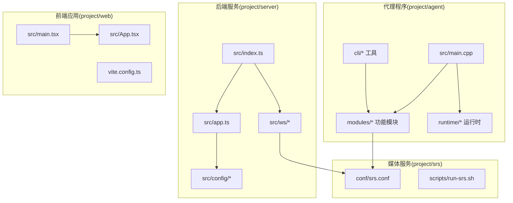
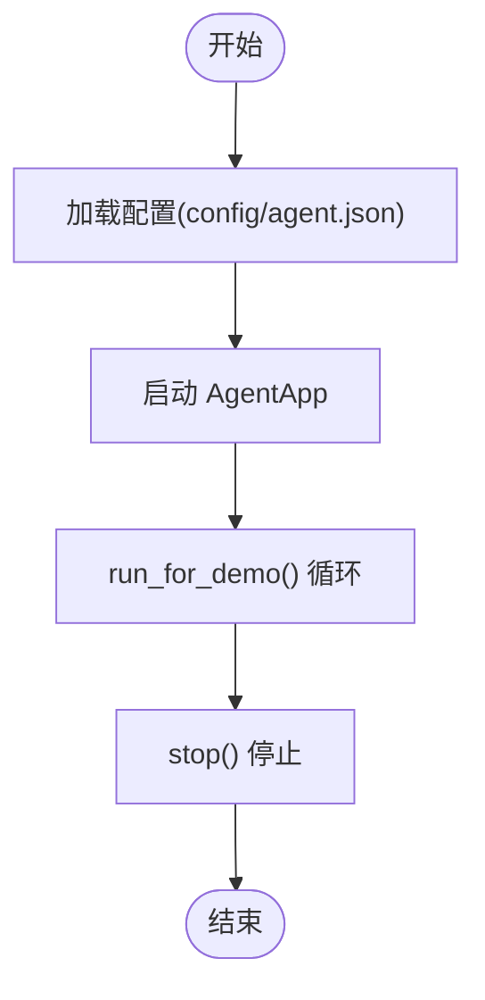
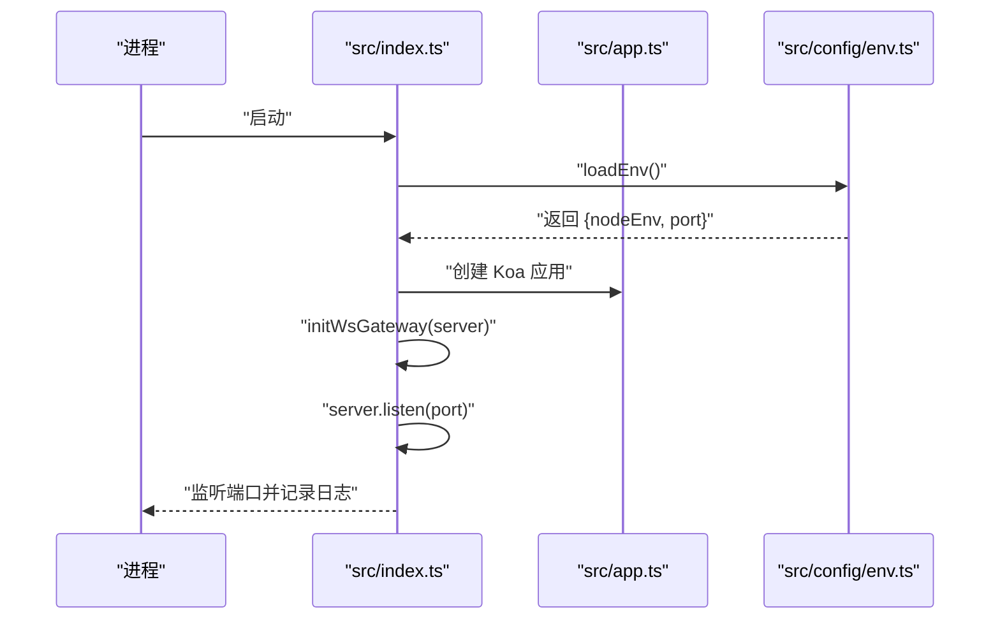
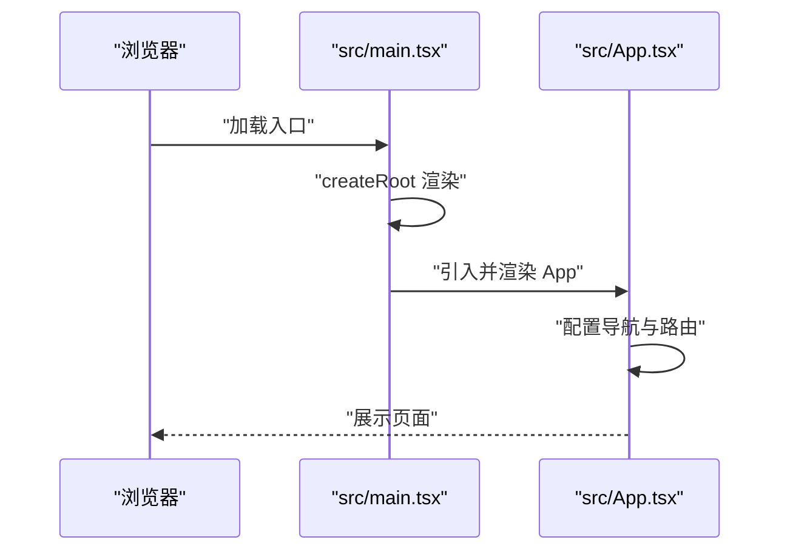
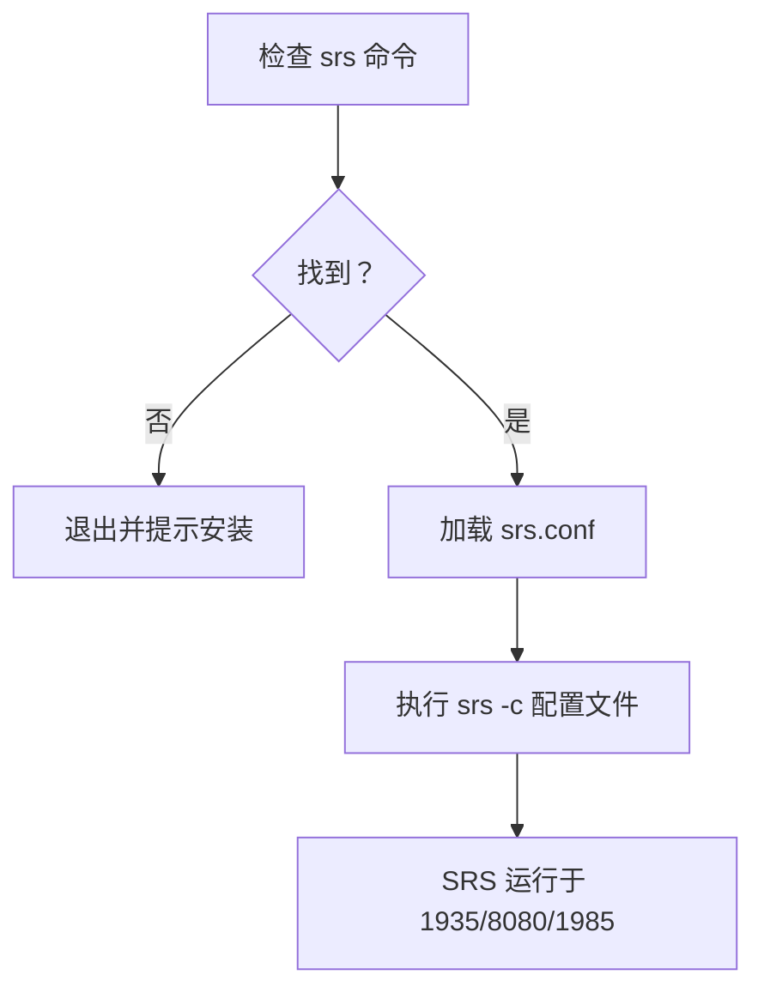
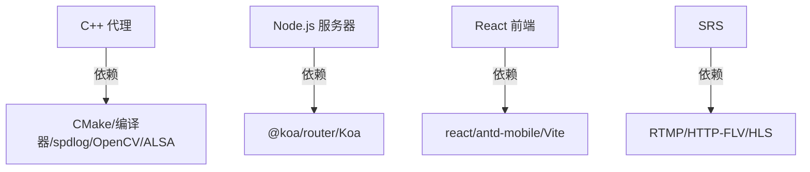

# 快速开始

<cite>
**本文引用的文件**
- [project/agent/CMakeLists.txt](file://project/agent/CMakeLists.txt)
- [docs/agent/构建.md](file://docs/agent/构建.md)
- [project/agent/src/main.cpp](file://project/agent/src/main.cpp)
- [project/agent/include/piguard/version.hpp](file://project/agent/include/piguard/version.hpp)
- [project/agent/cli/CMakeLists.txt](file://project/agent/cli/CMakeLists.txt)
- [project/server/package.json](file://project/server/package.json)
- [project/server/src/index.ts](file://project/server/src/index.ts)
- [project/server/src/app.ts](file://project/server/src/app.ts)
- [project/server/src/config/env.ts](file://project/server/src/config/env.ts)
- [project/web/package.json](file://project/web/package.json)
- [project/web/vite.config.ts](file://project/web/vite.config.ts)
- [project/web/src/main.tsx](file://project/web/src/main.tsx)
- [project/web/src/App.tsx](file://project/web/src/App.tsx)
- [project/srs/conf/srs.conf](file://project/srs/conf/srs.conf)
- [project/srs/scripts/run-srs.sh](file://project/srs/scripts/run-srs.sh)
- [docs/数据流.md](file://docs/数据流.md)
</cite>

## 目录
1. [简介](#简介)
2. [项目结构](#项目结构)
3. [核心组件](#核心组件)
4. [架构总览](#架构总览)
5. [详细组件分析](#详细组件分析)
6. [依赖分析](#依赖分析)
7. [性能考虑](#性能考虑)
8. [故障排除指南](#故障排除指南)
9. [结论](#结论)
10. [附录](#附录)

## 简介
本指南面向首次接触 Pi-Guard 的用户，帮助你在最短时间内完成从环境准备到系统运行的全流程。Pi-Guard 由三部分组成：
- C++ 代理程序（树莓派侧）：负责音视频采集、处理、编码与推流，并提供多种命令行工具用于预览、录制与推流测试。
- Node.js 服务器：基于 Koa 的后端服务，提供 HTTP 接口、WebSocket 网关以及与 SRS 的联动。
- React 前端：基于 Vite 和 React 的移动端 Web 应用，提供首页与关于页等基础界面。

此外，系统通过 SRS 提供 RTMP/HTTP-FLV/HLS 等协议能力，形成完整的音视频分发链路。

## 项目结构
仓库采用多模块组织方式，核心目录与职责如下：
- project/agent：C++ 代理工程，包含基础框架、模块化功能（采集、处理、输出、基础设施、外部接入）、运行时与 CLI 工具。
- project/server：Node.js 后端，Koa 应用、路由、中间件、WebSocket 网关与配置。
- project/web：React 前端，Vite 构建，Ant Design Mobile 移动端 UI。
- project/srs：SRS 配置与启动脚本，提供 RTMP/HTTP-FLV/HLS 服务及 HTTP Hook。
- docs：技术文档与构建说明。



**图表来源**
- [project/agent/src/main.cpp:1-19](file://project/agent/src/main.cpp#L1-L19)
- [project/agent/cli/CMakeLists.txt:1-5](file://project/agent/cli/CMakeLists.txt#L1-L5)
- [project/server/src/index.ts:1-15](file://project/server/src/index.ts#L1-L15)
- [project/server/src/app.ts:1-14](file://project/server/src/app.ts#L1-L14)
- [project/web/src/main.tsx:1-15](file://project/web/src/main.tsx#L1-L15)
- [project/web/src/App.tsx:1-38](file://project/web/src/App.tsx#L1-L38)
- [project/srs/conf/srs.conf:1-61](file://project/srs/conf/srs.conf#L1-L61)

**章节来源**
- [project/agent/CMakeLists.txt:1-51](file://project/agent/CMakeLists.txt#L1-L51)
- [project/agent/src/main.cpp:1-19](file://project/agent/src/main.cpp#L1-L19)
- [project/server/src/index.ts:1-15](file://project/server/src/index.ts#L1-L15)
- [project/web/src/main.tsx:1-15](file://project/web/src/main.tsx#L1-L15)
- [project/srs/conf/srs.conf:1-61](file://project/srs/conf/srs.conf#L1-L61)

## 核心组件
- C++ 代理程序（pi-guard-agent）
  - 入口函数负责打印版本信息、加载配置并启动运行时，随后进入演示运行循环并最终停止。
  - 版本号来自头文件常量，便于统一标识。
- Node.js 服务器
  - 创建 HTTP 服务器并挂载 Koa 应用，注册错误处理与请求 ID 中间件，初始化 WebSocket 网关。
  - 环境变量控制运行模式与端口，默认端口 3000。
- React 前端
  - 使用 Vite 构建，入口渲染 Ant Design Mobile 的导航与路由，提供首页与关于页。
- SRS 媒体服务
  - 默认监听 1935（RTMP）、8080（HTTP-FLV/HLS）、1985（HTTP API），并配置 HTTP Hooks 回调至后端。

**章节来源**
- [project/agent/src/main.cpp:1-19](file://project/agent/src/main.cpp#L1-L19)
- [project/agent/include/piguard/version.hpp:1-8](file://project/agent/include/piguard/version.hpp#L1-L8)
- [project/server/src/index.ts:1-15](file://project/server/src/index.ts#L1-L15)
- [project/server/src/app.ts:1-14](file://project/server/src/app.ts#L1-L14)
- [project/server/src/config/env.ts:1-12](file://project/server/src/config/env.ts#L1-L12)
- [project/web/src/main.tsx:1-15](file://project/web/src/main.tsx#L1-L15)
- [project/web/src/App.tsx:1-38](file://project/web/src/App.tsx#L1-L38)
- [project/srs/conf/srs.conf:1-61](file://project/srs/conf/srs.conf#L1-L61)

## 架构总览
Pi-Guard 的整体数据流与交互关系如下：

```mermaid
graph LR
Cam["USB 摄像头"] --> VC["VideoCapture"]
Mic["麦克风"] --> AC["AudioCapture"]
VC --> ENC["Encoder"]
AC --> EC["EchoCanceller"]
EC --> ENC
ENC --> RTMP["RTMPPusher"]
RTMP --> SRS["SRS(1935/8080/1985)"]
VC --> MD["MotionDetect"]
MD --> HTTPN["HTTPNotify"]
HTTPN --> NODE["Node.js Server(3000)"]
NODE <- --> WS["WebSocketClient"]
WS --> AP["AudioPlayback"]
AP --> Spk["扬声器"]
NODE -.-> HLS["HTTP-FLV/HLS(8080)"]
SRS -.-> HLS
```

**图表来源**
- [docs/数据流.md:1-33](file://docs/数据流.md#L1-L33)
- [project/srs/conf/srs.conf:1-61](file://project/srs/conf/srs.conf#L1-L61)
- [project/server/src/index.ts:1-15](file://project/server/src/index.ts#L1-L15)

**章节来源**
- [docs/数据流.md:1-33](file://docs/数据流.md#L1-L33)

## 详细组件分析

### C++ 代理程序（树莓派侧）
- 环境与工具
  - CMake ≥ 3.16，编译器支持 C++17。
  - 可选依赖：spdlog（日志）、OpenCV（预览工具）、ALSA（音频采集）。
- 构建流程
  - 使用 out-of-source 构建，推荐在仓库根目录创建 build/ 并在 project/agent 下生成构建产物。
  - 主可执行文件：pi-guard-agent；可选 CLI 工具：preview-video、record-audio、mp4、srs。
  - 可通过安装规则将可执行文件安装到系统前缀的 bin 目录。
- 运行流程
  - 启动时打印版本信息，加载配置文件并启动 AgentApp。
  - 进入演示运行循环，随后停止。



**图表来源**
- [project/agent/src/main.cpp:1-19](file://project/agent/src/main.cpp#L1-L19)
- [project/agent/include/piguard/version.hpp:1-8](file://project/agent/include/piguard/version.hpp#L1-L8)

**章节来源**
- [docs/agent/构建.md:1-86](file://docs/agent/构建.md#L1-L86)
- [project/agent/CMakeLists.txt:1-51](file://project/agent/CMakeLists.txt#L1-L51)
- [project/agent/src/main.cpp:1-19](file://project/agent/src/main.cpp#L1-L19)

### Node.js 服务器
- 依赖与脚本
  - 使用 Koa 与 @koa/router，开发依赖 ts-node-dev、typescript 等。
  - 脚本：dev、build、start、typecheck。
- 启动流程
  - 加载环境变量（NODE_ENV、PORT），创建 HTTP 服务器。
  - 初始化 WebSocket 网关，监听端口并记录日志。



**图表来源**
- [project/server/src/index.ts:1-15](file://project/server/src/index.ts#L1-L15)
- [project/server/src/app.ts:1-14](file://project/server/src/app.ts#L1-L14)
- [project/server/src/config/env.ts:1-12](file://project/server/src/config/env.ts#L1-L12)

**章节来源**
- [project/server/package.json:1-28](file://project/server/package.json#L1-L28)
- [project/server/src/index.ts:1-15](file://project/server/src/index.ts#L1-L15)
- [project/server/src/app.ts:1-14](file://project/server/src/app.ts#L1-L14)
- [project/server/src/config/env.ts:1-12](file://project/server/src/config/env.ts#L1-L12)

### React 前端
- 依赖与脚本
  - 依赖 antd-mobile、react、react-router-dom；开发依赖 Vite、TypeScript、ESLint 等。
  - 脚本：dev、build、lint、preview。
- 启动流程
  - 入口文件渲染根节点，包裹 BrowserRouter，导入全局样式与 App 组件。
  - App 组件提供顶部导航与底部标签栏，路由指向首页与关于页。



**图表来源**
- [project/web/src/main.tsx:1-15](file://project/web/src/main.tsx#L1-L15)
- [project/web/src/App.tsx:1-38](file://project/web/src/App.tsx#L1-L38)

**章节来源**
- [project/web/package.json:1-34](file://project/web/package.json#L1-L34)
- [project/web/vite.config.ts:1-8](file://project/web/vite.config.ts#L1-L8)
- [project/web/src/main.tsx:1-15](file://project/web/src/main.tsx#L1-L15)
- [project/web/src/App.tsx:1-38](file://project/web/src/App.tsx#L1-L38)

### SRS 媒体服务
- 配置要点
  - 监听 1935（RTMP）、8080（HTTP-FLV/HLS）、1985（HTTP API）。
  - vhost 下启用 HTTP-Remux、HLS、HTTP Hooks，并回调至后端接口。
- 启动脚本
  - 检查 srs 命令是否存在，存在则以配置文件启动。



**图表来源**
- [project/srs/scripts/run-srs.sh:1-14](file://project/srs/scripts/run-srs.sh#L1-L14)
- [project/srs/conf/srs.conf:1-61](file://project/srs/conf/srs.conf#L1-L61)

**章节来源**
- [project/srs/conf/srs.conf:1-61](file://project/srs/conf/srs.conf#L1-L61)
- [project/srs/scripts/run-srs.sh:1-14](file://project/srs/scripts/run-srs.sh#L1-L14)

## 依赖分析
- C++ 代理
  - CMake 与 C++17 标准要求；可选依赖 spdlog、OpenCV、ALSA。
  - 构建拓扑：foundation → 各模块 → runtime → cli → 可执行文件。
- Node.js 服务器
  - 运行时依赖 Koa 与 @koa/router；开发依赖 ts-node-dev、typescript。
  - 环境变量 PORT 控制监听端口，默认 3000。
- React 前端
  - 运行时依赖 react、react-router-dom、antd-mobile；开发依赖 Vite、ESLint、TypeScript。
- SRS
  - 作为独立媒体服务器，提供 RTMP/HTTP-FLV/HLS 与 HTTP Hooks。



**图表来源**
- [docs/agent/构建.md:15-44](file://docs/agent/构建.md#L15-L44)
- [project/server/package.json:16-26](file://project/server/package.json#L16-L26)
- [project/web/package.json:12-32](file://project/web/package.json#L12-L32)
- [project/srs/conf/srs.conf:1-61](file://project/srs/conf/srs.conf#L1-L61)

**章节来源**
- [docs/agent/构建.md:1-86](file://docs/agent/构建.md#L1-L86)
- [project/server/package.json:1-28](file://project/server/package.json#L1-L28)
- [project/web/package.json:1-34](file://project/web/package.json#L1-L34)
- [project/srs/conf/srs.conf:1-61](file://project/srs/conf/srs.conf#L1-L61)

## 性能考虑
- 构建优化
  - 使用 Release 构建类型以获得更佳运行性能。
  - 在单机开发环境下，合理设置并行编译线程数，避免资源争用。
- 运行时优化
  - 合理配置 SRS 的队列长度与 GOP 缓存，降低播放延迟。
  - 在 Node.js 侧开启必要的中间件与日志级别，避免生产环境产生过多开销。
- 前端优化
  - 生产构建时启用压缩与 Tree Shaking，减少包体积。
  - 使用路由懒加载与按需引入 UI 组件，提升首屏性能。

## 故障排除指南
- C++ 代理构建失败
  - 确认 CMake 版本与编译器支持 C++17。
  - 安装缺失的系统依赖：spdlog、OpenCV、ALSA 开发包。
  - 若模块未生成可执行文件，请检查子目录 CMakeLists 是否正确配置。
- 代理程序无法启动
  - 检查配置文件路径与权限，确认 config/agent.json 存在且可读。
  - 查看启动日志输出，定位启动失败原因。
- Node.js 服务器端口占用
  - 修改环境变量 PORT 或释放 3000 端口占用。
  - 确认防火墙未阻断端口访问。
- SRS 启动失败
  - 确保系统已安装 SRS，并可通过命令行直接启动。
  - 检查配置文件路径与权限，确认 srs.conf 正确加载。
- 媒体流异常
  - 检查 SRS vhost 配置与 HTTP Hooks 回调地址是否可达。
  - 确认客户端播放地址与参数（如 RTMP 地址、HLS m3u8 路径）正确。

**章节来源**
- [docs/agent/构建.md:1-86](file://docs/agent/构建.md#L1-L86)
- [project/agent/src/main.cpp:1-19](file://project/agent/src/main.cpp#L1-L19)
- [project/server/src/config/env.ts:1-12](file://project/server/src/config/env.ts#L1-L12)
- [project/srs/scripts/run-srs.sh:1-14](file://project/srs/scripts/run-srs.sh#L1-L14)
- [project/srs/conf/srs.conf:1-61](file://project/srs/conf/srs.conf#L1-L61)

## 结论
通过本快速开始指南，你已经完成了 Pi-Guard 的环境准备、构建与运行验证。建议在本地完成上述步骤后，结合实际硬件与网络环境进行进一步的设备配置与部署优化。如需深入理解模块细节与数据流，可参考“详细组件分析”与“架构总览”。

## 附录
- 常用命令摘要
  - C++ 代理：在仓库根目录执行 out-of-source 构建与安装。
  - Node.js 服务器：使用 npm/yarn 安装依赖后，运行开发或生产脚本。
  - React 前端：安装依赖后，使用 Vite 启动开发服务器或构建生产包。
  - SRS：使用脚本启动，或直接运行 srs 命令并传入配置文件。