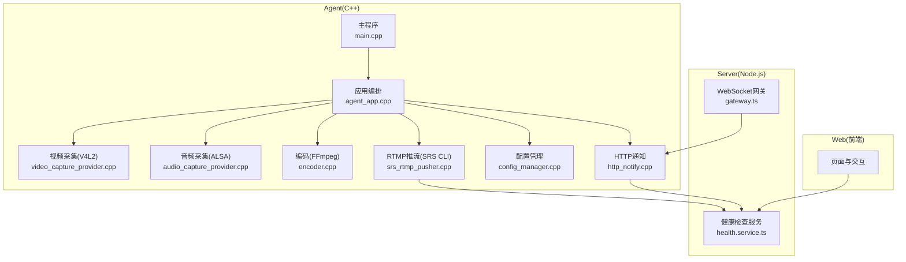
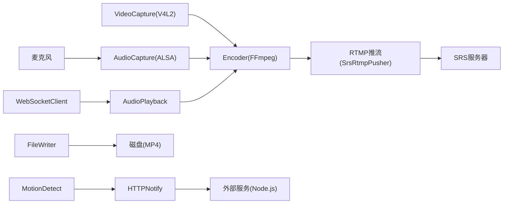
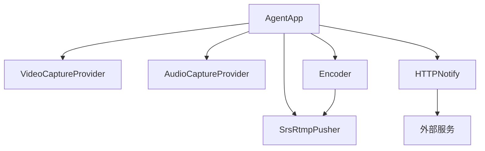

# 常见问题

<cite>
**本文引用的文件**
- [main.cpp](file://project/agent/src/main.cpp)
- [agent_app.cpp](file://project/agent/src/runtime/app/agent_app.cpp)
- [video_capture_provider.cpp](file://project/agent/src/modules/capture/video/video_capture_provider.cpp)
- [audio_capture_provider.cpp](file://project/agent/src/modules/capture/audio/audio_capture_provider.cpp)
- [encoder.cpp](file://project/agent/src/modules/processing/encoder/encoder.cpp)
- [srs_rtmp_pusher.cpp](file://project/agent/cli/srs/srs_rtmp_pusher.cpp)
- [main.cpp](file://project/agent/cli/srs/main.cpp)
- [config_manager.cpp](file://project/agent/src/modules/infra/config/config_manager.cpp)
- [http_notify.cpp](file://project/agent/src/modules/external_access/http/http_notify.cpp)
- [gateway.ts](file://project/server/src/ws/gateway.ts)
- [数据流.md](file://docs/数据流.md)
- [技术方案-capture-video.md](file://docs/agent/技术方案-capture-video.md)
- [技术方案-capture-audio.md](file://docs/agent/技术方案-capture-audio.md)
- [技术方案-encoder.md](file://docs/agent/技术方案-encoder.md)
- [perf_monitor.cpp](file://project/agent/src/modules/infra/perf_monitor/perf_monitor.cpp)
- [log_module.cpp](file://project/agent/src/modules/infra/log/log_module.cpp)
</cite>

## 目录
1. [简介](#简介)
2. [项目结构](#项目结构)
3. [核心组件](#核心组件)
4. [架构总览](#架构总览)
5. [详细组件分析](#详细组件分析)
6. [依赖分析](#依赖分析)
7. [性能考虑](#性能考虑)
8. [故障排查指南](#故障排查指南)
9. [结论](#结论)
10. [附录](#附录)

## 简介
本常见问题解答面向 Pi-Guard 系统使用者与运维人员，聚焦设备无法访问、编码失败、网络连接问题、音频无声、视频卡顿等典型问题，结合源码中的错误日志、参数校验与流程控制，给出原因分析、症状描述与可操作的解决步骤，并提供预防措施与最佳实践。

## 项目结构
Pi-Guard 由三部分组成：
- Agent（C++）：负责采集（视频/V4L2、音频/ALSA）、编码（FFmpeg/AAC/H.264）、推流（RTMP/SRS）、事件通知与文件落盘等。
- Server（Node.js）：提供健康检查、WebSocket 网关预留与 HTTP 通知桥接。
- Web（前端）：用于展示与交互（本 FAQ 侧重后端组件）。

**图表来源**
- [main.cpp:6-18](file://project/agent/src/main.cpp#L6-L18)
- [agent_app.cpp:16-42](file://project/agent/src/runtime/app/agent_app.cpp#L16-L42)
- [video_capture_provider.cpp:48-82](file://project/agent/src/modules/capture/video/video_capture_provider.cpp#L48-L82)
- [audio_capture_provider.cpp:39-73](file://project/agent/src/modules/capture/audio/audio_capture_provider.cpp#L39-L73)
- [encoder.cpp:277-297](file://project/agent/src/modules/processing/encoder/encoder.cpp#L277-L297)
- [srs_rtmp_pusher.cpp:24-104](file://project/agent/cli/srs/srs_rtmp_pusher.cpp#L24-L104)
- [config_manager.cpp:16-23](file://project/agent/src/modules/infra/config/config_manager.cpp#L16-L23)
- [http_notify.cpp:14-18](file://project/agent/src/modules/external_access/http/http_notify.cpp#L14-L18)
- [gateway.ts:4-7](file://project/server/src/ws/gateway.ts#L4-L7)

**章节来源**
- [main.cpp:6-18](file://project/agent/src/main.cpp#L6-L18)
- [agent_app.cpp:16-42](file://project/agent/src/runtime/app/agent_app.cpp#L16-L42)
- [数据流.md:1-33](file://docs/数据流.md#L1-L33)

## 核心组件
- 应用编排（AgentApp）：统一启动/停止各子模块，调度工作线程，订阅事件并打印性能指标。
- 视频采集（VideoCaptureProvider）：基于 V4L2 的视频采集，支持格式/帧率配置、缓冲区映射与队列分发。
- 音频采集（AudioCaptureProvider）：基于 ALSA 的音频采集，支持采样率/通道配置、显式 start 与错误恢复。
- 编码（Encoder）：基于 FFmpeg 的音视频编码，初始化失败会抛异常并回滚，支持音视频元数据就绪检测。
- RTMP 推流（SrsRtmpPusher）：基于 FFmpeg FLV 输出，负责网络初始化、写头、写包与尾部。
- 配置管理（ConfigManager）：加载默认设备参数（摄像头、麦克风、扬声器）。
- HTTP 通知（HTTPNotify）：事件触发时向外部服务发送通知（预留实现）。
- 性能监控（PerfMonitor）：周期性收集 CPU/内存/温度等指标。

**章节来源**
- [agent_app.cpp:16-63](file://project/agent/src/runtime/app/agent_app.cpp#L16-L63)
- [video_capture_provider.cpp:104-124](file://project/agent/src/modules/capture/video/video_capture_provider.cpp#L104-L124)
- [audio_capture_provider.cpp:170-210](file://project/agent/src/modules/capture/audio/audio_capture_provider.cpp#L170-L210)
- [encoder.cpp:277-297](file://project/agent/src/modules/processing/encoder/encoder.cpp#L277-L297)
- [srs_rtmp_pusher.cpp:24-104](file://project/agent/cli/srs/srs_rtmp_pusher.cpp#L24-L104)
- [config_manager.cpp:16-23](file://project/agent/src/modules/infra/config/config_manager.cpp#L16-L23)
- [http_notify.cpp:14-18](file://project/agent/src/modules/external_access/http/http_notify.cpp#L14-L18)
- [perf_monitor.cpp:14-23](file://project/agent/src/modules/infra/perf_monitor/perf_monitor.cpp#L14-L23)

## 架构总览
Pi-Guard 的数据流如下：
- 实时监控：USB 摄像头 → VideoCapture → Encoder → RTMPPusher → SRS
- 移动侦测报警：摄像头 → VideoCapture → MotionDetect → HTTPNotify/ FileWriter
- 双向语音对讲：手机 → WebSocketClient → AudioPlayback（下行）；麦克风 → AudioCapture → EchoCanceller → Encoder → RTMPPusher → SRS（上行）

**图表来源**
- [数据流.md:6-32](file://docs/数据流.md#L6-L32)
- [srs_rtmp_pusher.cpp:30-97](file://project/agent/cli/srs/srs_rtmp_pusher.cpp#L30-L97)

**章节来源**
- [数据流.md:1-33](file://docs/数据流.md#L1-L33)

## 详细组件分析

### 视频采集（V4L2）问题
- 症状
  - 设备无法打开：启动阶段抛出“failed to open V4L2 device”类错误。
  - 采集无画面或频繁丢帧：DQBUF 失败、队列满丢帧告警。
  - 帧率/分辨率不生效：VIDIOC_S_FMT/VIDIOC_S_PARM 失败。
- 原因分析
  - 设备路径错误或权限不足（需具备对 /dev/videoX 的读写权限）。
  - 分辨率/帧率/像素格式不被设备支持。
  - 缓冲区数量过少或映射失败。
  - 驱动/硬件忙，STREAMON/STREAMOFF 异常。
- 解决步骤
  - 确认设备路径存在且可访问：ls -l /dev/video*
  - 将当前用户加入视频组：sudo usermod -aG video $USER
  - 使用 v4l2-ctl 查询设备能力并确认参数组合：v4l2-ctl --device=/dev/videoX --all
  - 调整缓冲区数量与队列容量，避免过小导致 DQBUF 失败。
  - 如设备被其他进程占用，先结束占用进程再重启采集。
- 预防与最佳实践
  - 启动前先探测设备可用性与能力。
  - 严格校验分辨率/帧率/像素格式参数。
  - 保持缓冲区数量≥2，避免 STREAMON 前无缓冲导致失败。
  - 监控队列长度，出现丢帧时降低目标帧率或分辨率。

**章节来源**
- [video_capture_provider.cpp:108-123](file://project/agent/src/modules/capture/video/video_capture_provider.cpp#L108-L123)
- [video_capture_provider.cpp:180-196](file://project/agent/src/modules/capture/video/video_capture_provider.cpp#L180-L196)
- [video_capture_provider.cpp:212-220](file://project/agent/src/modules/capture/video/video_capture_provider.cpp#L212-L220)
- [video_capture_provider.cpp:334-351](file://project/agent/src/modules/capture/video/video_capture_provider.cpp#L334-L351)
- [video_capture_provider.cpp:386-395](file://project/agent/src/modules/capture/video/video_capture_provider.cpp#L386-L395)
- [技术方案-capture-video.md:1-42](file://docs/agent/技术方案-capture-video.md#L1-L42)

### 音频采集（ALSA）问题
- 症状
  - 设备无法打开：启动阶段抛出“failed to open ALSA device”类错误。
  - 采集无声或间歇性断断续续：snd_pcm_readi 返回负值并触发 snd_pcm_recover。
  - 首次读取报错（EIO）：部分 USB 音频驱动在未 RUNNING 状态下直接返回错误。
- 原因分析
  - 设备名称错误或被其他进程占用。
  - 参数设置失败（采样率/通道/访问方式）。
  - 需要显式 start，否则部分驱动会拒绝读取。
- 解决步骤
  - 确认设备名：arecord -l 或 aplay -l。
  - 将当前用户加入 audio 组：sudo usermod -aG audio $USER。
  - 使用默认格式（S16_LE/交错）与合理采样率/通道数。
  - 显式调用 start，避免隐式 start 导致的 EIO。
  - 若出现 EPIPE/ESTRPE/EINTR 等，交由 snd_pcm_recover 自动恢复。
- 预防与最佳实践
  - 启动前检查设备是否被占用。
  - 采用固定帧大小（约 20ms）累积到编码器所需帧大小。
  - 控制队列容量，避免长时间积压导致延迟过大。

**章节来源**
- [audio_capture_provider.cpp:174-195](file://project/agent/src/modules/capture/audio/audio_capture_provider.cpp#L174-L195)
- [audio_capture_provider.cpp:201-208](file://project/agent/src/modules/capture/audio/audio_capture_provider.cpp#L201-L208)
- [audio_capture_provider.cpp:224-236](file://project/agent/src/modules/capture/audio/audio_capture_provider.cpp#L224-L236)
- [技术方案-capture-audio.md:1-45](file://docs/agent/技术方案-capture-audio.md#L1-L45)

### 编码（FFmpeg）问题
- 症状
  - 初始化失败：抛出“Encoder: failed to initialize encoders”并回滚。
  - 元数据未就绪：等待编码器元数据时返回不可用。
  - 音频帧缓冲不足：累积到编码器帧大小（如 1024）才编码。
- 原因分析
  - 视频/音频编码器打开失败（avcodec_open2）。
  - 帧/包分配失败（av_frame_alloc/av_packet_alloc）。
  - 音频 PCM 缓冲不足导致无法形成完整帧。
- 解决步骤
  - 确认编码器可用且参数正确（分辨率、帧率、采样率、通道）。
  - 检查编码线程是否成功启动（video/audio_thread）。
  - 确保编码器元数据 ready 后再创建推流器。
  - 调整 ALSA 帧大小与编码器帧大小对齐，避免长期不足。
- 预防与最佳实践
  - 优先使用低延迟配置（preset/zerolatency/max_b_frames=0/gop_size=fps）。
  - 采用“保留最新帧”的视频丢帧策略，避免历史帧参与编码。
  - 严格校验 extradata 与时间基准，避免推流侧解析失败。

**章节来源**
- [encoder.cpp:167-185](file://project/agent/src/modules/processing/encoder/encoder.cpp#L167-L185)
- [encoder.cpp:277-297](file://project/agent/src/modules/processing/encoder/encoder.cpp#L277-L297)
- [encoder.cpp:452-456](file://project/agent/src/modules/processing/encoder/encoder.cpp#L452-L456)
- [技术方案-encoder.md:236-272](file://docs/agent/技术方案-encoder.md#L236-L272)

### RTMP 推流（SRS）问题
- 症状
  - 网络初始化失败：avformat_network_init 返回错误。
  - 打开 RTMP URL 失败：avio_open 返回错误。
  - 写头失败：avformat_write_header 返回错误。
  - 推流过程中写包告警：av_interleaved_write_frame 返回错误。
- 原因分析
  - 网络库未初始化或初始化失败。
  - RTMP 地址格式错误或目标 SRS 不可用。
  - 输出上下文创建失败或流参数不匹配。
  - 时间戳/索引错误导致写包失败。
- 解决步骤
  - 确认 RTMP 地址格式正确（包含应用与流名）。
  - 检查 SRS 服务可达性与认证配置。
  - 确保编码器元数据（时间基准、extradata、宽高）与推流侧一致。
  - 检查写包前的时间戳重映射与流索引设置。
- 预防与最佳实践
  - 先等待编码器元数据 ready 再启动推流器。
  - 使用稳定的网络与合理的缓冲策略。
  - 记录写包失败的详细信息以便定位。

**章节来源**
- [srs_rtmp_pusher.cpp:24-104](file://project/agent/cli/srs/srs_rtmp_pusher.cpp#L24-L104)
- [srs_rtmp_pusher.cpp:132-191](file://project/agent/cli/srs/srs_rtmp_pusher.cpp#L132-L191)
- [main.cpp:70-87](file://project/agent/cli/srs/main.cpp#L70-L87)

### 网络连接问题
- 症状
  - RTMP 推流连接超时或无法建立。
  - HTTP 通知无法到达外部服务。
  - WebSocket 网关未生效（预留）。
- 原因分析
  - 网络初始化失败或 DNS 解析异常。
  - RTMP 地址不可达或鉴权失败。
  - 外部服务未监听或防火墙阻断。
- 解决步骤
  - 使用 ping/nc 测试网络连通性。
  - 检查代理与防火墙策略。
  - 确认 SRS 地址与鉴权配置正确。
  - 对 HTTP 通知，检查外部服务可达性与端口。
- 预防与最佳实践
  - 在启动时进行网络自检。
  - 使用稳定可靠的 RTMP 服务端。
  - 为 HTTP/WebSocket 预留接口做好边界防护。

**章节来源**
- [srs_rtmp_pusher.cpp:24-104](file://project/agent/cli/srs/srs_rtmp_pusher.cpp#L24-L104)
- [http_notify.cpp:14-18](file://project/agent/src/modules/external_access/http/http_notify.cpp#L14-L18)
- [gateway.ts:4-7](file://project/server/src/ws/gateway.ts#L4-L7)

### 音频无声问题
- 症状
  - 录制/推流无音频或偶发无声。
  - 音频采集线程正常，但编码/推流侧无数据。
- 原因分析
  - 麦克风设备被占用或权限不足。
  - ALSA 参数设置不当（采样率/通道/访问方式）。
  - 音频 PCM 缓冲不足，无法形成编码器帧。
  - 推流侧时间戳或通道布局不匹配。
- 解决步骤
  - 确认麦克风设备存在且非被占用：arecord -l。
  - 将用户加入 audio 组，确保权限。
  - 调整 ALSA 帧大小与编码器帧大小对齐。
  - 检查推流侧采样率与通道布局是否与编码器一致。
- 预防与最佳实践
  - 启动前进行设备自检。
  - 使用固定采样率与通道数，避免动态变化。
  - 监控音频队列长度，防止长时间积压。

**章节来源**
- [audio_capture_provider.cpp:174-195](file://project/agent/src/modules/capture/audio/audio_capture_provider.cpp#L174-L195)
- [encoder.cpp:452-456](file://project/agent/src/modules/processing/encoder/encoder.cpp#L452-L456)
- [srs_rtmp_pusher.cpp:66-78](file://project/agent/cli/srs/srs_rtmp_pusher.cpp#L66-L78)

### 视频卡顿/掉帧问题
- 症状
  - 画面卡顿或频繁丢帧。
  - 编码器处理不过来，导致延迟增大。
- 原因分析
  - V4L2 DQBUF 失败或队列满导致丢帧。
  - 编码器帧大小不足或 CPU 负载过高。
  - 低延迟配置不当导致编码压力增大。
- 解决步骤
  - 降低目标分辨率/帧率，减少编码压力。
  - 提升缓冲区数量与队列容量，避免频繁丢帧。
  - 调整编码器参数（preset/tune/max_b_frames/gop_size）。
  - 监控 CPU/温度，避免过热降频。
- 预防与最佳实践
  - 采用“保留最新帧”的丢帧策略，避免历史帧参与编码。
  - 启动前评估硬件性能，选择合适参数组合。
  - 使用性能监控模块定期观察资源使用情况。

**章节来源**
- [video_capture_provider.cpp:334-351](file://project/agent/src/modules/capture/video/video_capture_provider.cpp#L334-L351)
- [video_capture_provider.cpp:386-395](file://project/agent/src/modules/capture/video/video_capture_provider.cpp#L386-L395)
- [encoder.cpp:236-272](file://project/agent/src/modules/processing/encoder/encoder.cpp#L236-L272)
- [perf_monitor.cpp:14-23](file://project/agent/src/modules/infra/perf_monitor/perf_monitor.cpp#L14-L23)

## 依赖分析
- 组件耦合
  - AgentApp 统一编排视频/音频采集、编码、推流、通知与文件写入。
  - 编码器依赖采集模块提供的帧与音频 PCM，再输出编码包。
  - 推流器依赖编码器的元数据与编码包。
  - HTTP/WebSocket 作为外部接入点，与事件总线/通知模块配合。
- 外部依赖
  - V4L2/ALSA/FFmpeg/SRS/Node.js/Express/WebSocket 等。
- 循环依赖
  - 未发现明显循环依赖，模块职责清晰。

**图表来源**
- [agent_app.cpp:16-42](file://project/agent/src/runtime/app/agent_app.cpp#L16-L42)
- [data流.md:6-32](file://docs/数据流.md#L6-L32)

**章节来源**
- [agent_app.cpp:16-63](file://project/agent/src/runtime/app/agent_app.cpp#L16-L63)
- [数据流.md:1-33](file://docs/数据流.md#L1-L33)

## 性能考虑
- 性能监控
  - AgentApp 启动后周期性收集 CPU/内存/温度等指标，便于定位过载或异常。
- 编码优化
  - 低延迟配置（preset/zerolatency/max_b_frames=0/gop_size=fps）有助于降低端到端延迟。
  - 音频 PCM 缓冲与编码器帧大小对齐，避免频繁碎片化。
- 资源管理
  - V4L2/ALSA/FFmpeg 资源在 stop 时幂等释放，避免泄漏。
  - 日志后端在模块停止时统一关闭，确保优雅退出。

**章节来源**
- [perf_monitor.cpp:14-23](file://project/agent/src/modules/infra/perf_monitor/perf_monitor.cpp#L14-L23)
- [log_module.cpp:22-27](file://project/agent/src/modules/infra/log/log_module.cpp#L22-L27)
- [video_capture_provider.cpp:84-102](file://project/agent/src/modules/capture/video/video_capture_provider.cpp#L84-L102)
- [audio_capture_provider.cpp:75-82](file://project/agent/src/modules/capture/audio/audio_capture_provider.cpp#L75-L82)
- [encoder.cpp:277-297](file://project/agent/src/modules/processing/encoder/encoder.cpp#L277-L297)

## 故障排查指南

### 设备无法访问（V4L2/ALSA）
- 步骤
  - 检查设备是否存在：ls -l /dev/video* 或 arecord -l。
  - 检查权限：确认用户属于 video/audio 组。
  - 使用 v4l2-ctl/alsamixer 检查设备能力与状态。
  - 查看启动日志中“failed to open ... device”错误。
- 常见原因
  - 设备路径错误或权限不足。
  - 设备被其他进程占用。
  - 驱动不支持所选参数组合。

**章节来源**
- [video_capture_provider.cpp:108-113](file://project/agent/src/modules/capture/video/video_capture_provider.cpp#L108-L113)
- [audio_capture_provider.cpp:174-177](file://project/agent/src/modules/capture/audio/audio_capture_provider.cpp#L174-L177)

### 编码失败（FFmpeg 初始化）
- 步骤
  - 确认编码器可用与参数正确（分辨率/帧率/采样率/通道）。
  - 检查 avcodec_open2/av_frame_alloc/av_packet_alloc 是否返回错误。
  - 等待编码器元数据 ready 再创建推流器。
- 常见原因
  - 编码器打开失败或帧/包分配失败。
  - 参数不匹配导致初始化异常。

**章节来源**
- [encoder.cpp:167-185](file://project/agent/src/modules/processing/encoder/encoder.cpp#L167-L185)
- [encoder.cpp:277-297](file://project/agent/src/modules/processing/encoder/encoder.cpp#L277-L297)

### 网络连接问题（RTMP 推流）
- 步骤
  - 检查 avformat_network_init/avio_open/avformat_write_header 是否失败。
  - 确认 RTMP 地址格式与 SRS 可达性。
  - 检查编码器元数据与推流侧参数一致性。
- 常见原因
  - 网络初始化失败或 RTMP 地址不可达。
  - 推流侧时间戳/索引/参数不匹配。

**章节来源**
- [srs_rtmp_pusher.cpp:24-104](file://project/agent/cli/srs/srs_rtmp_pusher.cpp#L24-L104)
- [srs_rtmp_pusher.cpp:132-191](file://project/agent/cli/srs/srs_rtmp_pusher.cpp#L132-L191)

### 音频无声音
- 步骤
  - 确认麦克风设备存在且非被占用。
  - 检查 ALSA 参数设置与显式 start 是否成功。
  - 对齐 ALSA 帧大小与编码器帧大小。
  - 检查推流侧采样率与通道布局。
- 常见原因
  - 设备占用/权限不足。
  - 参数不匹配导致编码器无输入。

**章节来源**
- [audio_capture_provider.cpp:174-208](file://project/agent/src/modules/capture/audio/audio_capture_provider.cpp#L174-L208)
- [encoder.cpp:452-456](file://project/agent/src/modules/processing/encoder/encoder.cpp#L452-L456)

### 视频卡顿/掉帧
- 步骤
  - 降低分辨率/帧率，提升缓冲区数量与队列容量。
  - 调整编码器低延迟参数，避免过度优化导致压力增大。
  - 监控 CPU/温度，避免过热降频。
- 常见原因
  - DQBUF 失败或队列满导致丢帧。
  - 编码器帧大小不足或 CPU 负载过高。

**章节来源**
- [video_capture_provider.cpp:334-351](file://project/agent/src/modules/capture/video/video_capture_provider.cpp#L334-L351)
- [video_capture_provider.cpp:386-395](file://project/agent/src/modules/capture/video/video_capture_provider.cpp#L386-L395)
- [encoder.cpp:236-272](file://project/agent/src/modules/processing/encoder/encoder.cpp#L236-L272)

## 结论
Pi-Guard 的问题多集中在设备权限、参数配置与资源占用三个方面。通过严格的参数校验、合理的缓冲与低延迟配置、完善的日志与性能监控，可以有效降低故障率并快速定位问题。建议在部署前完成设备自检与网络连通性测试，并在生产环境中持续监控资源使用情况。

## 附录

### 常用诊断命令
- 设备检查
  - ls -l /dev/video*；arecord -l
- 能力查询
  - v4l2-ctl --device=/dev/videoX --all
- 网络连通
  - ping/nc 测试 SRS 地址与端口

### 最佳实践清单
- 启动前
  - 校验设备路径与权限；确认参数组合受支持。
  - 初始化网络库与编码器元数据。
- 运行中
  - 监控队列长度与丢帧率；关注 CPU/温度。
  - 记录关键错误日志，便于回溯。
- 停止时
  - 幂等释放 V4L2/ALSA/FFmpeg 资源；优雅关闭日志后端。