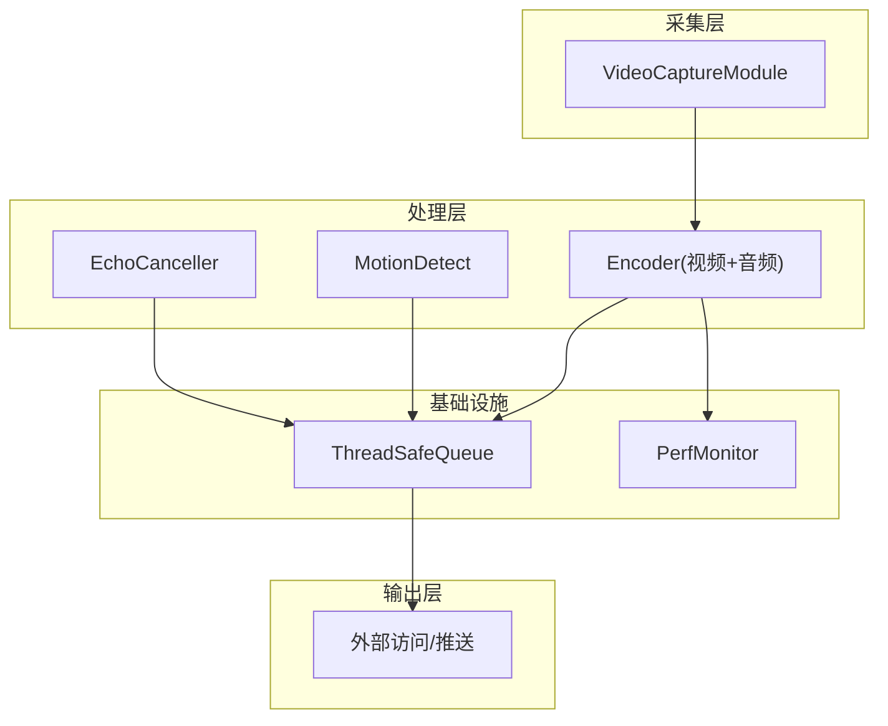
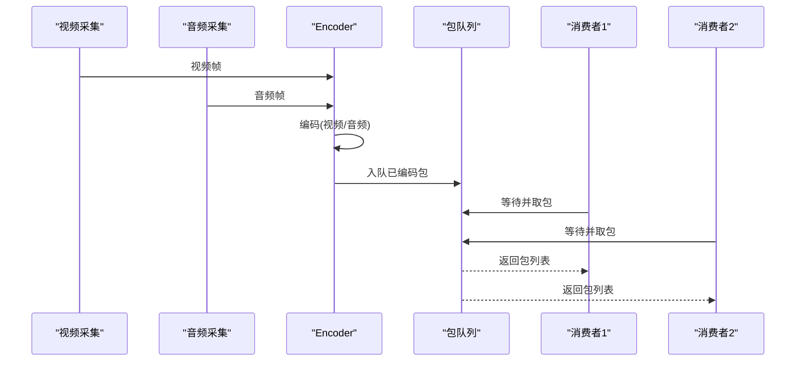
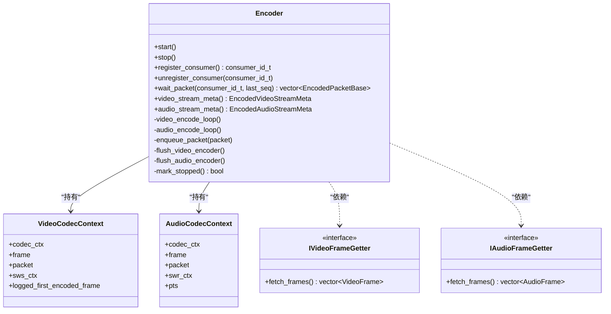
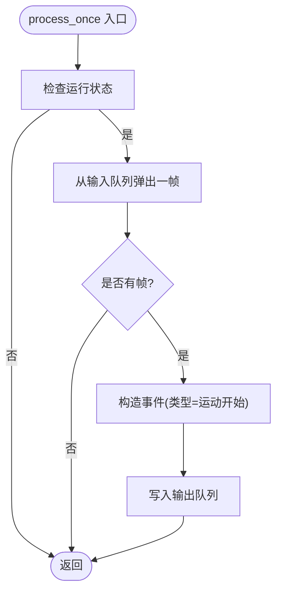
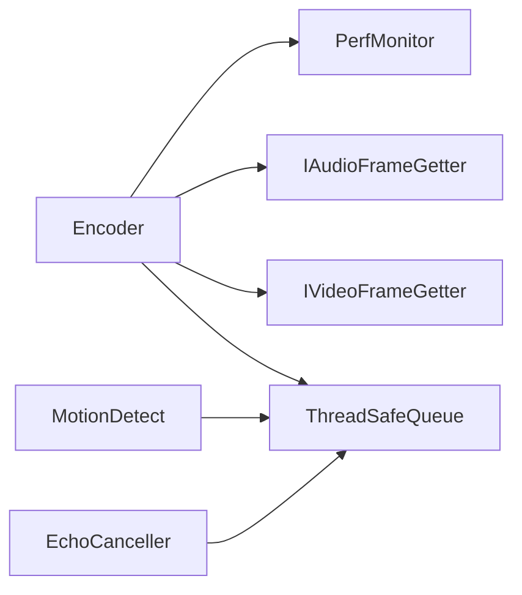
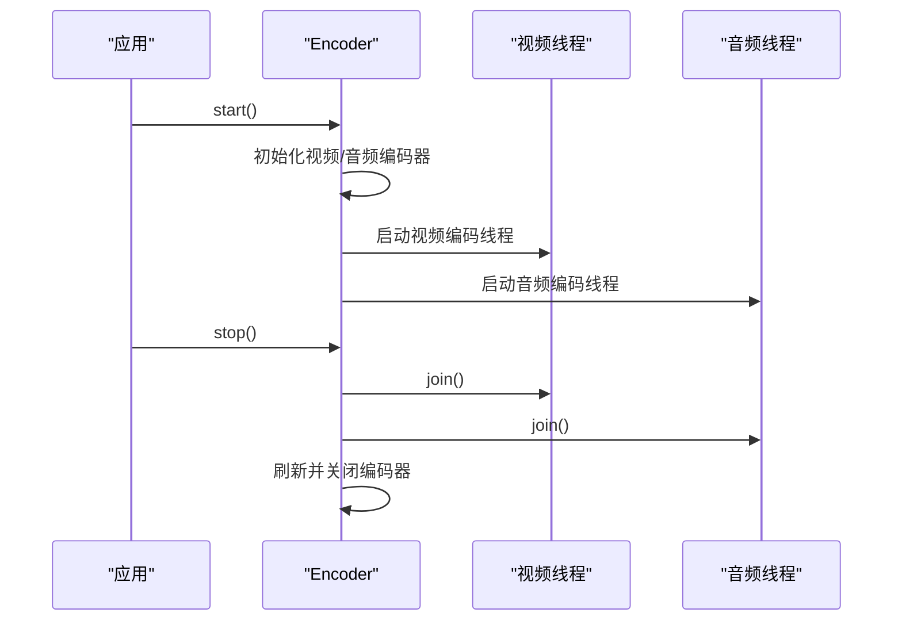
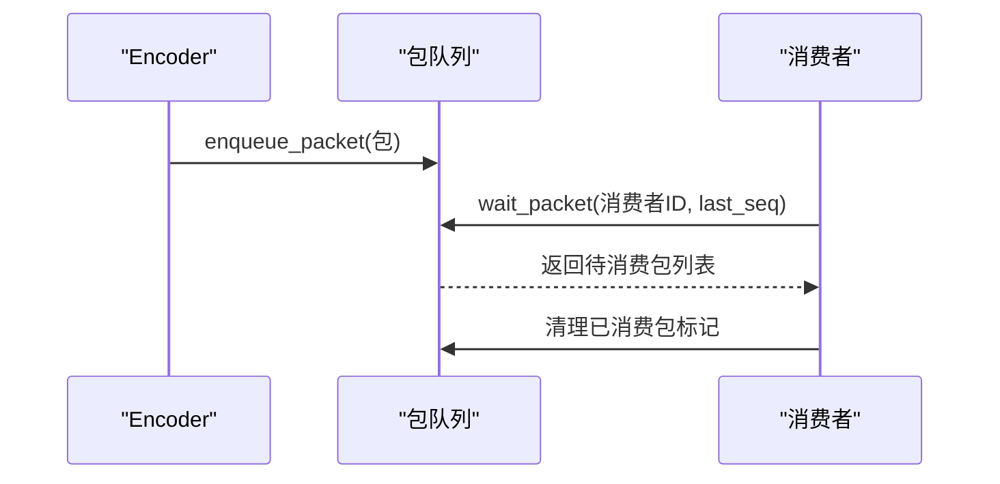

# 性能问题排查

<cite>
**本文引用的文件**
- [encoder.cpp](file://project/agent/src/modules/processing/encoder/encoder.cpp)
- [encoder.hpp](file://project/agent/src/modules/processing/encoder/include/processing_encoder/encoder.hpp)
- [encoder_types.hpp](file://project/agent/src/modules/processing/encoder/include/processing_encoder/encoder_types.hpp)
- [encoder_module.hpp](file://project/agent/src/modules/processing/encoder/include/processing_encoder/encoder_module.hpp)
- [motion_detect.cpp](file://project/agent/src/modules/processing/motion_detect/motion_detect.cpp)
- [echo_canceller.cpp](file://project/agent/src/modules/processing/echo_canceller/echo_canceller.cpp)
- [perf_monitor.hpp](file://project/agent/src/modules/infra/perf_monitor/include/infra_monitor/perf_monitor.hpp)
- [perf_monitor.cpp](file://project/agent/src/modules/infra/perf_monitor/perf_monitor.cpp)
- [thread_safe_queue.hpp](file://project/agent/src/foundation/include/foundation/thread_safe_queue.hpp)
- [video_capture_module.cpp](file://project/agent/src/modules/capture/video/video_capture_module.cpp)
</cite>

## 目录
1. [简介](#简介)
2. [项目结构](#项目结构)
3. [核心组件](#核心组件)
4. [架构总览](#架构总览)
5. [详细组件分析](#详细组件分析)
6. [依赖关系分析](#依赖关系分析)
7. [性能考量](#性能考量)
8. [故障排查指南](#故障排查指南)
9. [结论](#结论)
10. [附录](#附录)

## 简介
本指南面向 Pi-Guard Agent 的性能问题排查与优化，聚焦以下方面：
- 编码性能优化（视频/音频编码参数、线程模型、帧率与分辨率）
- 内存使用优化（缓冲区管理、队列容量、上下文生命周期）
- 线程竞争与同步（互斥锁、条件变量、无锁队列设计）
- 性能分析工具与指标解读（CPU/内存/温度快照采集）
- 关键模块调优建议（视频编码、音频处理、运动检测）
- 资源限制与系统负载均衡策略

## 项目结构
Pi-Guard Agent 采用模块化设计，核心处理链路包含采集、预处理、编码、输出与监控模块。编码器模块基于 FFmpeg 实现，采用双线程（视频/音频）异步编码，并通过线程安全队列进行数据传递。

图示来源
- [video_capture_module.cpp:1-25](file://project/agent/src/modules/capture/video/video_capture_module.cpp#L1-L25)
- [encoder.cpp:267-297](file://project/agent/src/modules/processing/encoder/encoder.cpp#L267-L297)
- [thread_safe_queue.hpp:1-51](file://project/agent/src/foundation/include/foundation/thread_safe_queue.hpp#L1-L51)
- [perf_monitor.cpp:14-23](file://project/agent/src/modules/infra/perf_monitor/perf_monitor.cpp#L14-L23)

章节来源
- [video_capture_module.cpp:1-25](file://project/agent/src/modules/capture/video/video_capture_module.cpp#L1-L25)
- [encoder.cpp:267-297](file://project/agent/src/modules/processing/encoder/encoder.cpp#L267-L297)
- [thread_safe_queue.hpp:1-51](file://project/agent/src/foundation/include/foundation/thread_safe_queue.hpp#L1-L51)
- [perf_monitor.cpp:14-23](file://project/agent/src/modules/infra/perf_monitor/perf_monitor.cpp#L14-L23)

## 核心组件
- 编码器（Encoder）：负责视频与音频的初始化、编码循环、打包与分发，支持消费者注册/注销与包队列管理。
- 运动检测（MotionDetect）：从输入队列取出帧，生成事件并写入输出队列。
- 回声消除（EchoCanceller）：占位实现，当前为空操作。
- 性能监控（PerfMonitor）：提供 CPU/内存/温度快照采集能力。
- 线程安全队列（ThreadSafeQueue）：提供 push/wait_and_pop/pop/size 等接口，用于模块间解耦。

章节来源
- [encoder.hpp:16-90](file://project/agent/src/modules/processing/encoder/include/processing_encoder/encoder.hpp#L16-L90)
- [encoder.cpp:267-583](file://project/agent/src/modules/processing/encoder/encoder.cpp#L267-L583)
- [motion_detect.cpp:18-31](file://project/agent/src/modules/processing/motion_detect/motion_detect.cpp#L18-L31)
- [echo_canceller.cpp:14-18](file://project/agent/src/modules/processing/echo_canceller/echo_canceller.cpp#L14-L18)
- [perf_monitor.hpp:10-28](file://project/agent/src/modules/infra/perf_monitor/include/infra_monitor/perf_monitor.hpp#L10-L28)
- [thread_safe_queue.hpp:10-51](file://project/agent/src/foundation/include/foundation/thread_safe_queue.hpp#L10-L51)

## 架构总览
编码器采用“生产者-消费者”模式，视频/音频分别在独立线程中拉取帧、转换与编码，编码结果进入统一的包队列，供多个消费者并发消费。模块间通过线程安全队列解耦，减少锁竞争范围。

图示来源
- [encoder.cpp:359-420](file://project/agent/src/modules/processing/encoder/encoder.cpp#L359-L420)
- [encoder.cpp:422-510](file://project/agent/src/modules/processing/encoder/encoder.cpp#L422-L510)
- [encoder.cpp:512-583](file://project/agent/src/modules/processing/encoder/encoder.cpp#L512-L583)
- [thread_safe_queue.hpp:31-37](file://project/agent/src/foundation/include/foundation/thread_safe_queue.hpp#L31-L37)

## 详细组件分析

### 编码器（Encoder）性能分析
- 双线程模型：视频与音频分别在独立线程中执行编码循环，避免相互阻塞。
- 同步机制：使用互斥锁与条件变量保护共享状态（运行标志、包队列、消费者集合），并通过谓词唤醒等待者。
- 包队列与消费者管理：支持多消费者注册，每个包记录 pending_consumers 集合，按序列号过滤未消费包。
- 队列溢出处理：当包队列超过容量阈值时丢弃最老包，防止内存膨胀。
- 时间戳与 PTS：以程序启动时间戳为基准换算到各编解码器 time_base，保证时序一致性。
- 预设与调优：视频编码器设置“预设 veryfast”和“调优 zerolatency”，强调低延迟与快速编码。

图示来源
- [encoder.hpp:16-90](file://project/agent/src/modules/processing/encoder/include/processing_encoder/encoder.hpp#L16-L90)
- [encoder.cpp:29-43](file://project/agent/src/modules/processing/encoder/encoder.cpp#L29-L43)
- [encoder.cpp:38-42](file://project/agent/src/modules/processing/encoder/encoder.cpp#L38-L42)

章节来源
- [encoder.cpp:267-297](file://project/agent/src/modules/processing/encoder/encoder.cpp#L267-L297)
- [encoder.cpp:359-420](file://project/agent/src/modules/processing/encoder/encoder.cpp#L359-L420)
- [encoder.cpp:422-510](file://project/agent/src/modules/processing/encoder/encoder.cpp#L422-L510)
- [encoder.cpp:512-583](file://project/agent/src/modules/processing/encoder/encoder.cpp#L512-L583)
- [encoder_types.hpp:25-34](file://project/agent/src/modules/processing/encoder/include/processing_encoder/encoder_types.hpp#L25-L34)

### 运动检测（MotionDetect）性能分析
- 单线程处理：每次 process_once 从输入队列弹出一帧，构造事件并写入输出队列。
- 模块状态：通过原子布尔量控制运行状态，简单高效。
- 当前实现：事件类型固定为“运动开始”，payload 为占位字符串，实际算法可扩展。

图示来源
- [motion_detect.cpp:18-31](file://project/agent/src/modules/processing/motion_detect/motion_detect.cpp#L18-L31)

章节来源
- [motion_detect.cpp:18-31](file://project/agent/src/modules/processing/motion_detect/motion_detect.cpp#L18-L31)

### 回声消除（EchoCanceller）性能分析
- 占位实现：start/stop 仅切换运行状态，process_once 不做任何处理。
- 影响：对吞吐无额外开销，但也不会带来收益；可根据需要启用或移除。

章节来源
- [echo_canceller.cpp:7-18](file://project/agent/src/modules/processing/echo_canceller/echo_canceller.cpp#L7-L18)

### 性能监控（PerfMonitor）指标解读
- 快照字段：CPU 使用率百分比、内存使用率百分比、温度摄氏度。
- 采集时机：仅在运行状态下返回有效快照，否则返回零值。
- 应用场景：结合日志定期采样，绘制趋势图，定位异常峰值。

章节来源
- [perf_monitor.hpp:12-22](file://project/agent/src/modules/infra/perf_monitor/include/infra_monitor/perf_monitor.hpp#L12-L22)
- [perf_monitor.cpp:14-23](file://project/agent/src/modules/infra/perf_monitor/perf_monitor.cpp#L14-L23)

### 线程安全队列（ThreadSafeQueue）设计
- 接口：push、pop、wait_and_pop、size，均通过互斥锁保护。
- 等待机制：wait_and_pop 使用条件变量等待非空，避免忙等。
- 适用性：适合跨线程传递小对象或轻量数据，避免全局锁争用。

章节来源
- [thread_safe_queue.hpp:13-37](file://project/agent/src/foundation/include/foundation/thread_safe_queue.hpp#L13-L37)

## 依赖关系分析
- 编码器依赖 FFmpeg 上下文（视频缩放、音频重采样），并依赖帧提供器接口以解耦采集层。
- 运动检测与回声消除依赖线程安全队列进行数据交换。
- 性能监控作为基础设施模块，被编码器等模块间接使用。

图示来源
- [encoder_types.hpp:13-23](file://project/agent/src/modules/processing/encoder/include/processing_encoder/encoder_types.hpp#L13-L23)
- [encoder.cpp:267-297](file://project/agent/src/modules/processing/encoder/encoder.cpp#L267-L297)
- [thread_safe_queue.hpp:10-51](file://project/agent/src/foundation/include/foundation/thread_safe_queue.hpp#L10-L51)
- [perf_monitor.cpp:14-23](file://project/agent/src/modules/infra/perf_monitor/perf_monitor.cpp#L14-L23)

## 性能考量

### 编码性能优化
- 视频编码
  - 参数：分辨率、帧率、码率、GOP 大小、像素格式、时间基。
  - 预设与调优：当前设置“预设 veryfast + 调优 zerolatency”，降低编码延迟，适合实时推流。
  - 建议：根据设备算力与网络带宽调整分辨率/帧率/码率；必要时启用硬件加速（需在 FFmpeg 层配置）。
- 音频编码
  - 参数：采样率、声道布局、码率、帧大小。
  - 重采样：当目标采样格式非 S16/S16P 时启用 SWR 上下文，注意 CPU 开销。
  - 建议：尽量与采集端一致，减少重采样；若必须重采样，选择合适的滤波器与线程数。
- 包队列容量
  - 当前默认容量较大，有助于抗突发，但会增加内存占用与延迟。
  - 建议：根据目标延迟与内存预算动态调整，避免溢出与丢包。

章节来源
- [encoder.cpp:56-138](file://project/agent/src/modules/processing/encoder/encoder.cpp#L56-L138)
- [encoder.cpp:140-227](file://project/agent/src/modules/processing/encoder/encoder.cpp#L140-L227)
- [encoder_types.hpp:25-34](file://project/agent/src/modules/processing/encoder/include/processing_encoder/encoder_types.hpp#L25-L34)

### 内存使用优化
- 上下文释放：停止时显式释放视频/音频编码器上下文、帧与包，避免泄漏。
- 音频 PCM 缓冲：按目标帧大小切片处理，及时擦除已消费数据，防止累积。
- 包队列溢出：超限时丢弃最老包，防止内存持续增长。
- 建议：监控内存曲线，结合 PerfMonitor 快照定位峰值；必要时降低分辨率/帧率或增大交换空间。

章节来源
- [encoder.cpp:229-265](file://project/agent/src/modules/processing/encoder/encoder.cpp#L229-L265)
- [encoder.cpp:448-509](file://project/agent/src/modules/processing/encoder/encoder.cpp#L448-L509)
- [encoder.cpp:517-522](file://project/agent/src/modules/processing/encoder/encoder.cpp#L517-L522)

### 线程竞争与同步
- 锁粒度：state_mtx_ 保护运行态、包队列、消费者集合等共享状态；enqueue_packet 与 wait_packet 使用同一互斥锁与条件变量。
- 条件变量：wait_packet 使用谓词等待“有新包可取或停止”，避免虚假唤醒。
- 建议：尽量缩短持锁时间；避免在锁内执行耗时操作；确保 stop 流程先置 running_ 再唤醒等待者。

章节来源
- [encoder.hpp:64-67](file://project/agent/src/modules/processing/encoder/include/processing_encoder/encoder.hpp#L64-L67)
- [encoder.cpp:553-583](file://project/agent/src/modules/processing/encoder/encoder.cpp#L553-L583)

### 关键模块调优建议
- 视频编码
  - 降低分辨率/帧率/码率以缓解 CPU 压力；启用硬件编码（如可用）。
  - 调整 GOP 大小与 B 帧，平衡压缩率与解码复杂度。
- 音频处理
  - 减少重采样次数，尽量与编码器采样格式一致。
  - 控制音频帧大小，避免过小导致频繁编码开销。
- 运动检测
  - 当前为占位实现，建议引入轻量级算法（如背景差分）并限制处理频率。
  - 将事件写入队列后尽快返回，避免阻塞主处理流程。

章节来源
- [encoder.cpp:382-413](file://project/agent/src/modules/processing/encoder/encoder.cpp#L382-L413)
- [encoder.cpp:452-499](file://project/agent/src/modules/processing/encoder/encoder.cpp#L452-L499)
- [motion_detect.cpp:18-31](file://project/agent/src/modules/processing/motion_detect/motion_detect.cpp#L18-L31)

### 资源限制与系统负载均衡
- 资源限制
  - 通过 EncoderOptions 控制分辨率、帧率、码率与包队列容量，避免过度消耗。
  - 结合 PerfMonitor 快照设定告警阈值（CPU/内存/温度）。
- 负载均衡
  - 多消费者并行消费编码包，但需注意包队列容量与内存占用。
  - 将高开销模块（如运动检测）置于独立线程或按需启用，避免与编码争抢 CPU。

章节来源
- [encoder_types.hpp:25-34](file://project/agent/src/modules/processing/encoder/include/processing_encoder/encoder_types.hpp#L25-L34)
- [perf_monitor.cpp:14-23](file://project/agent/src/modules/infra/perf_monitor/perf_monitor.cpp#L14-L23)

## 故障排查指南

### 常见性能问题与定位步骤
- 编码卡顿/掉帧
  - 检查视频/音频编码线程是否仍在运行，确认队列是否溢出与丢包日志。
  - 降低分辨率/帧率/码率，观察 CPU 使用率变化。
  - 查看 FFmpeg 初始化与打开编码器日志，确认失败原因。
- 音频破音/延迟
  - 检查重采样上下文是否成功初始化，确认采样格式匹配。
  - 调整音频帧大小与包队列容量，避免缓冲区不足。
- 内存持续上涨
  - 确认停止流程是否正确释放编码器上下文与帧/包。
  - 监控包队列长度与消费者消费速率，避免堆积。
- 线程死锁/唤醒异常
  - 检查 state_mtx_ 的使用是否成对出现，避免在锁内执行阻塞操作。
  - 确保 stop 流程先置 running_ 再唤醒等待者，避免竞态。

章节来源
- [encoder.cpp:267-297](file://project/agent/src/modules/processing/encoder/encoder.cpp#L267-L297)
- [encoder.cpp:359-420](file://project/agent/src/modules/processing/encoder/encoder.cpp#L359-L420)
- [encoder.cpp:422-510](file://project/agent/src/modules/processing/encoder/encoder.cpp#L422-L510)
- [encoder.cpp:517-522](file://project/agent/src/modules/processing/encoder/encoder.cpp#L517-L522)

### 性能分析工具与指标解读
- 工具建议
  - Linux：top/htop、vmstat/iostat/sar、perf、valgrind/callgrind。
  - FFmpeg：ffprobe 分析封装格式与码率，-loglevel verbose 获取详细日志。
  - 自定义：结合 PerfMonitor 快照绘制 CPU/内存/温度趋势。
- 指标解读
  - CPU 使用率：持续高于阈值可能由编码器或重采样引起。
  - 内存使用率：上升且不回落需检查释放逻辑与队列容量。
  - 温度：过高可能导致降频，影响编码性能。

章节来源
- [perf_monitor.hpp:12-22](file://project/agent/src/modules/infra/perf_monitor/include/infra_monitor/perf_monitor.hpp#L12-L22)
- [perf_monitor.cpp:14-23](file://project/agent/src/modules/infra/perf_monitor/perf_monitor.cpp#L14-L23)

### 关键流程时序图

#### 编码器启动与停止

图示来源
- [encoder.cpp:267-297](file://project/agent/src/modules/processing/encoder/encoder.cpp#L267-L297)
- [encoder.cpp:332-349](file://project/agent/src/modules/processing/encoder/encoder.cpp#L332-L349)

#### 包队列消费流程

图示来源
- [encoder.cpp:512-583](file://project/agent/src/modules/processing/encoder/encoder.cpp#L512-L583)

## 结论
Pi-Guard 的编码器通过双线程与线程安全队列实现了较好的解耦与并发性。性能瓶颈通常集中在 CPU 编码压力、内存占用与线程同步上。建议从参数调优、资源限制与监控告警三方面入手，结合 FFmpeg 日志与自定义快照，形成闭环的性能治理流程。

## 附录
- 相关模块入口与生命周期
  - 编码器模块：提供模块生命周期接口，便于集成到系统框架。
  - 视频采集模块：当前为占位实现，后续接入具体采集源。

章节来源
- [encoder_module.hpp:9-18](file://project/agent/src/modules/processing/encoder/include/processing_encoder/encoder_module.hpp#L9-L18)
- [video_capture_module.cpp:13-21](file://project/agent/src/modules/capture/video/video_capture_module.cpp#L13-L21)