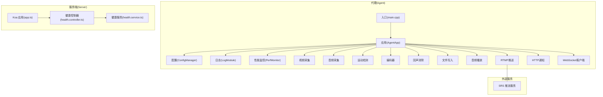
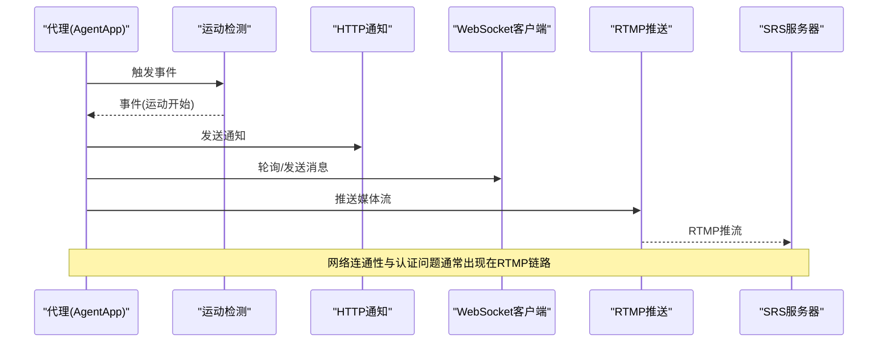
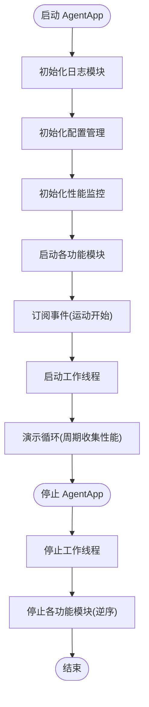
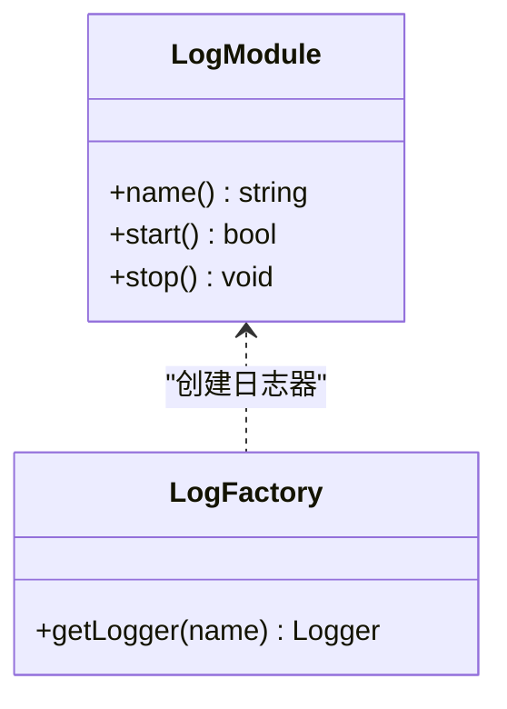
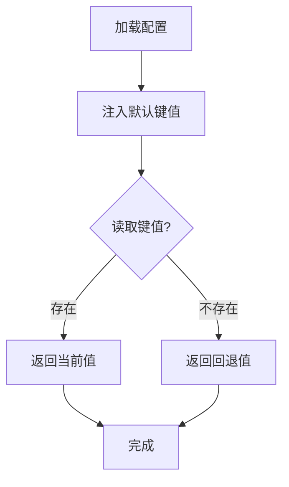
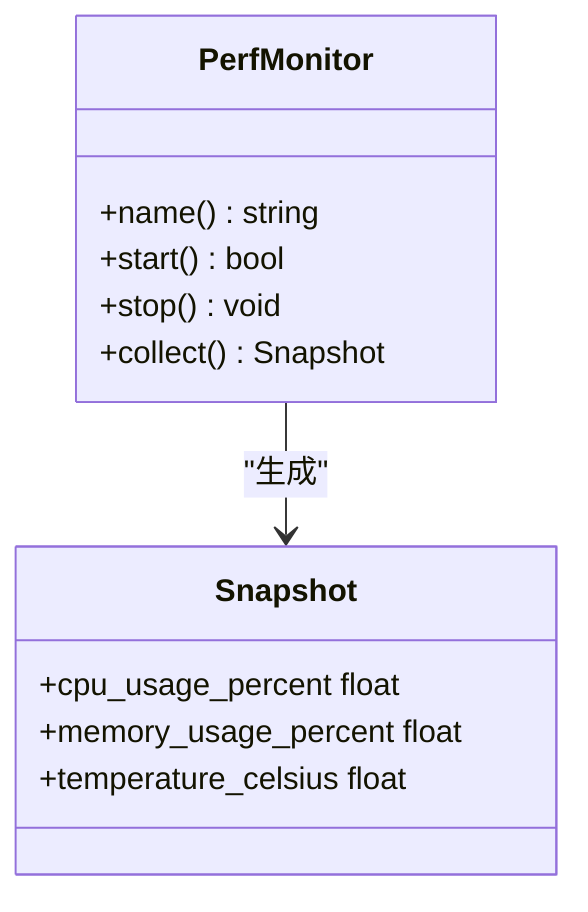
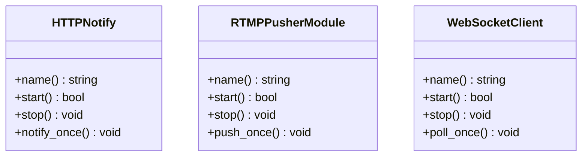
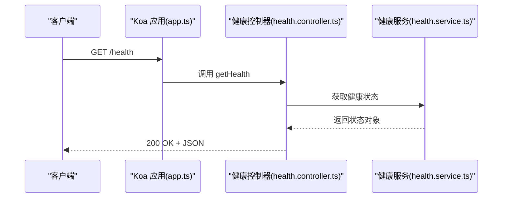
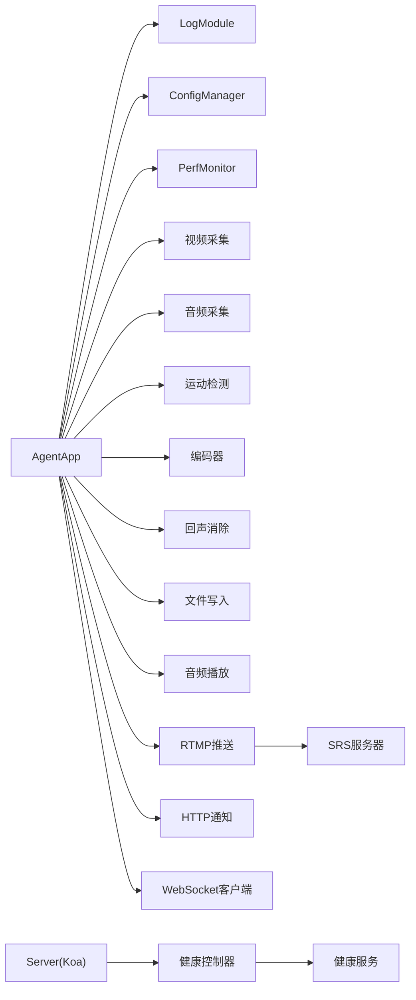

# 故障排除

<cite>
**本文引用的文件**
- [main.cpp](file://project/agent/src/main.cpp)
- [agent_app.cpp](file://project/agent/src/runtime/app/agent_app.cpp)
- [shutdown_manager.cpp](file://project/agent/src/foundation/shutdown_manager.cpp)
- [version.hpp](file://project/agent/include/piguard/version.hpp)
- [log_module.cpp](file://project/agent/src/modules/infra/log/log_module.cpp)
- [logger_factory.cpp](file://project/agent/src/modules/infra/log/logger_factory.cpp)
- [config_manager.cpp](file://project/agent/src/modules/infra/config/config_manager.cpp)
- [perf_monitor.cpp](file://project/agent/src/modules/infra/perf_monitor/perf_monitor.cpp)
- [rtmp_publisher_module.cpp](file://project/agent/src/modules/external_access/pusher/rtmp_publisher_module.cpp)
- [http_notify.cpp](file://project/agent/src/modules/external_access/http/http_notify.cpp)
- [websocket_client.cpp](file://project/agent/src/modules/external_access/websocket/websocket_client.cpp)
- [app.ts](file://project/server/src/app.ts)
- [health.controller.ts](file://project/server/src/controllers/health.controller.ts)
- [health.service.ts](file://project/server/src/services/health.service.ts)
</cite>

## 目录
1. [简介](#简介)
2. [项目结构](#项目结构)
3. [核心组件](#核心组件)
4. [架构总览](#架构总览)
5. [详细组件分析](#详细组件分析)
6. [依赖分析](#依赖分析)
7. [性能考虑](#性能考虑)
8. [故障排除指南](#故障排除指南)
9. [结论](#结论)
10. [附录](#附录)

## 简介
本指南面向 Pi-Guard 系统的运维与开发人员，聚焦于常见问题的快速定位与解决，覆盖设备无法访问、编码失败、网络连接异常以及性能问题等场景。文档同时提供调试方法与工具使用建议（日志分析、网络抓包、性能分析），系统监控与告警配置思路，错误代码解释与日志解读技巧，以及预防性维护与健康检查方法。

## 项目结构
Pi-Guard 由三部分组成：嵌入式代理（C++）、服务端（Node/Koa）与 SRS 推流服务。代理负责采集音视频、运动检测、编码与输出；服务端提供健康检查接口与 Web 路由；SRS 提供 RTMP 推流能力。整体采用模块化设计，通过事件总线与队列解耦各处理阶段。

图表来源
- [main.cpp:1-19](file://project/agent/src/main.cpp#L1-L19)
- [agent_app.cpp:1-138](file://project/agent/src/runtime/app/agent_app.cpp#L1-L138)
- [config_manager.cpp:1-40](file://project/agent/src/modules/infra/config/config_manager.cpp#L1-L40)
- [log_module.cpp:1-30](file://project/agent/src/modules/infra/log/log_module.cpp#L1-L30)
- [perf_monitor.cpp:1-26](file://project/agent/src/modules/infra/perf_monitor/perf_monitor.cpp#L1-L26)
- [rtmp_publisher_module.cpp:1-21](file://project/agent/src/modules/external_access/pusher/rtmp_publisher_module.cpp#L1-L21)
- [http_notify.cpp:1-21](file://project/agent/src/modules/external_access/http/http_notify.cpp#L1-L21)
- [websocket_client.cpp:1-21](file://project/agent/src/modules/external_access/websocket/websocket_client.cpp#L1-L21)
- [app.ts:1-14](file://project/server/src/app.ts#L1-L14)
- [health.controller.ts:1-7](file://project/server/src/controllers/health.controller.ts#L1-L7)
- [health.service.ts:1-14](file://project/server/src/services/health.service.ts#L1-L14)

章节来源
- [main.cpp:1-19](file://project/agent/src/main.cpp#L1-L19)
- [agent_app.cpp:1-138](file://project/agent/src/runtime/app/agent_app.cpp#L1-L138)
- [app.ts:1-14](file://project/server/src/app.ts#L1-L14)

## 核心组件
- 入口与版本信息：代理入口打印版本并启动应用；版本常量用于诊断。
- 应用生命周期：统一启动/停止各模块，注册事件订阅，管理工作线程。
- 配置管理：加载默认参数（如摄像头、麦克风、扬声器设备路径）。
- 日志系统：基于 spdlog 的后端初始化与关闭，提供工厂创建日志器。
- 性能监控：周期性收集 CPU、内存、温度快照。
- 外部接入：HTTP 通知、RTMP 推送、WebSocket 客户端模块均具备启停与轮询接口。
- 服务端健康检查：提供健康状态接口，便于系统级监控。

章节来源
- [version.hpp:1-8](file://project/agent/include/piguard/version.hpp#L1-L8)
- [agent_app.cpp:16-63](file://project/agent/src/runtime/app/agent_app.cpp#L16-L63)
- [config_manager.cpp:16-37](file://project/agent/src/modules/infra/config/config_manager.cpp#L16-L37)
- [log_module.cpp:20-27](file://project/agent/src/modules/infra/log/log_module.cpp#L20-L27)
- [logger_factory.cpp:6-8](file://project/agent/src/modules/infra/log/logger_factory.cpp#L6-L8)
- [perf_monitor.cpp:7-23](file://project/agent/src/modules/infra/perf_monitor/perf_monitor.cpp#L7-L23)
- [http_notify.cpp:7-18](file://project/agent/src/modules/external_access/http/http_notify.cpp#L7-L18)
- [rtmp_publisher_module.cpp:7-18](file://project/agent/src/modules/external_access/pusher/rtmp_publisher_module.cpp#L7-L18)
- [websocket_client.cpp:7-18](file://project/agent/src/modules/external_access/websocket/websocket_client.cpp#L7-L18)
- [health.controller.ts:4-6](file://project/server/src/controllers/health.controller.ts#L4-L6)
- [health.service.ts:7-13](file://project/server/src/services/health.service.ts#L7-L13)

## 架构总览
下图展示从代理到服务端与外部推流的整体交互流程，帮助定位网络与外部集成问题。

图表来源
- [agent_app.cpp:36-41](file://project/agent/src/runtime/app/agent_app.cpp#L36-L41)
- [http_notify.cpp:14-18](file://project/agent/src/modules/external_access/http/http_notify.cpp#L14-L18)
- [websocket_client.cpp:14-18](file://project/agent/src/modules/external_access/websocket/websocket_client.cpp#L14-L18)
- [rtmp_publisher_module.cpp:14-18](file://project/agent/src/modules/external_access/pusher/rtmp_publisher_module.cpp#L14-L18)

## 详细组件分析

### 组件：AgentApp 生命周期与线程模型
- 启动顺序：日志、配置、性能监控、采集、检测、编码、回声消除、输出、播放、推送、HTTP 通知、WebSocket。
- 停止顺序：逆向执行，确保资源有序释放。
- 工作线程：包含视频/音频轮询、运动检测处理、文件刷新等任务，存在固定休眠间隔以控制吞吐与功耗。
- 事件总线：订阅运动检测事件并记录日志。

图表来源
- [agent_app.cpp:16-63](file://project/agent/src/runtime/app/agent_app.cpp#L16-L63)
- [agent_app.cpp:78-126](file://project/agent/src/runtime/app/agent_app.cpp#L78-L126)

章节来源
- [agent_app.cpp:16-63](file://project/agent/src/runtime/app/agent_app.cpp#L16-L63)
- [agent_app.cpp:78-126](file://project/agent/src/runtime/app/agent_app.cpp#L78-L126)

### 组件：日志系统与日志解读
- 初始化与关闭：首次调用时初始化后端，进程退出时安全关闭。
- 日志器创建：通过工厂按名称创建日志器，便于模块化日志分层。
- 使用建议：在关键路径（启动/停止、异常分支、性能采样）输出 debug/info/warn/error 级别日志，结合时间戳与模块名定位问题。

图表来源
- [log_module.cpp:20-27](file://project/agent/src/modules/infra/log/log_module.cpp#L20-L27)
- [logger_factory.cpp:6-8](file://project/agent/src/modules/infra/log/logger_factory.cpp#L6-L8)

章节来源
- [log_module.cpp:20-27](file://project/agent/src/modules/infra/log/log_module.cpp#L20-L27)
- [logger_factory.cpp:6-8](file://project/agent/src/modules/infra/log/logger_factory.cpp#L6-L8)

### 组件：配置管理与设备路径
- 默认参数：包含摄像头设备路径、麦克风与扬声器设备标识等。
- 动态更新：支持运行时设置键值对，便于热更新。
- 故障排查要点：确认设备路径正确、权限充足、驱动可用；若设备变更需通过 set_string 更新。

图表来源
- [config_manager.cpp:16-37](file://project/agent/src/modules/infra/config/config_manager.cpp#L16-L37)

章节来源
- [config_manager.cpp:16-37](file://project/agent/src/modules/infra/config/config_manager.cpp#L16-L37)

### 组件：性能监控与资源占用
- 快照字段：CPU 使用率、内存使用率、温度。
- 采集频率：演示循环中定期收集并记录日志，便于观察短期波动。
- 建议：在高负载场景下增加采样频率，结合系统监控工具（如 top、htop、iotop、sar）进行交叉验证。

图表来源
- [perf_monitor.cpp:5-23](file://project/agent/src/modules/infra/perf_monitor/perf_monitor.cpp#L5-L23)

章节来源
- [perf_monitor.cpp:5-23](file://project/agent/src/modules/infra/perf_monitor/perf_monitor.cpp#L5-L23)

### 组件：外部接入模块（HTTP/RTMP/WebSocket）
- HTTP 通知：提供 notify_once 接口，便于在事件触发时上报。
- RTMP 推送：提供 push_once 接口，实际推流逻辑可扩展至具体实现。
- WebSocket 客户端：提供 poll_once 接口，便于轮询或发送消息。
- 常见问题：认证失败、网络中断、目标地址不可达、超时重试策略不当。

图表来源
- [http_notify.cpp:5-18](file://project/agent/src/modules/external_access/http/http_notify.cpp#L5-L18)
- [rtmp_publisher_module.cpp:5-18](file://project/agent/src/modules/external_access/pusher/rtmp_publisher_module.cpp#L5-L18)
- [websocket_client.cpp:5-18](file://project/agent/src/modules/external_access/websocket/websocket_client.cpp#L5-L18)

章节来源
- [http_notify.cpp:5-18](file://project/agent/src/modules/external_access/http/http_notify.cpp#L5-L18)
- [rtmp_publisher_module.cpp:5-18](file://project/agent/src/modules/external_access/pusher/rtmp_publisher_module.cpp#L5-L18)
- [websocket_client.cpp:5-18](file://project/agent/src/modules/external_access/websocket/websocket_client.cpp#L5-L18)

### 组件：服务端健康检查
- 控制器：返回健康状态对象，包含服务名、状态与时间戳。
- 中间件：全局错误处理与请求 ID 注入，便于跨服务追踪。
- 建议：将健康检查纳入系统监控与自愈策略，设置合理的探测间隔与阈值。

图表来源
- [app.ts:8-11](file://project/server/src/app.ts#L8-L11)
- [health.controller.ts:4-6](file://project/server/src/controllers/health.controller.ts#L4-L6)
- [health.service.ts:7-13](file://project/server/src/services/health.service.ts#L7-L13)

章节来源
- [app.ts:8-11](file://project/server/src/app.ts#L8-L11)
- [health.controller.ts:4-6](file://project/server/src/controllers/health.controller.ts#L4-L6)
- [health.service.ts:7-13](file://project/server/src/services/health.service.ts#L7-L13)

## 依赖分析
- 模块内聚：各模块职责清晰，通过统一的启动/停止接口与事件总线耦合。
- 外部依赖：日志依赖 spdlog；网络模块依赖外部 SRS；设备路径依赖系统硬件与驱动。
- 关键依赖链：AgentApp -> 各子模块 -> 外部服务；服务端 -> 路由 -> 控制器 -> 服务。

图表来源
- [agent_app.cpp:16-63](file://project/agent/src/runtime/app/agent_app.cpp#L16-L63)
- [rtmp_publisher_module.cpp:1-21](file://project/agent/src/modules/external_access/pusher/rtmp_publisher_module.cpp#L1-L21)
- [app.ts:1-14](file://project/server/src/app.ts#L1-L14)

章节来源
- [agent_app.cpp:16-63](file://project/agent/src/runtime/app/agent_app.cpp#L16-L63)
- [app.ts:1-14](file://project/server/src/app.ts#L1-L14)

## 性能考虑
- 线程休眠与吞吐：工作线程采用固定休眠间隔，避免忙轮询，但可能导致延迟上升。可根据设备帧率与网络带宽调整。
- 采样频率：性能监控采样频率应与业务负载匹配，过低会丢失峰值信息，过高增加开销。
- 设备资源：摄像头与音频设备的驱动与权限直接影响吞吐与稳定性，建议在部署环境预检。
- 编码与推流：编码参数（分辨率、码率、GOP）与网络状况密切相关，建议动态调节或提供降级策略。

## 故障排除指南

### 一、设备无法访问
- 症状
  - 采集模块启动失败或无画面/声音
  - 配置中的设备路径不正确或设备被占用
- 诊断步骤
  - 检查配置项中的摄像头、麦克风、扬声器设备路径是否有效且可读写
  - 使用系统命令确认设备节点存在且未被其他进程占用
  - 查看日志中关于设备打开与读取的错误信息
- 解决方案
  - 修正设备路径或更换设备
  - 调整权限或关闭占用设备的进程
  - 在配置管理中通过 set_string 更新设备路径

章节来源
- [config_manager.cpp:16-37](file://project/agent/src/modules/infra/config/config_manager.cpp#L16-L37)
- [log_module.cpp:20-27](file://project/agent/src/modules/infra/log/log_module.cpp#L20-L27)

### 二、编码失败
- 症状
  - 输出为空或报错
  - 性能监控显示 CPU 使用率异常升高
- 诊断步骤
  - 确认编码模块已启动且处于运行状态
  - 检查上游数据（视频/音频帧）是否正常到达
  - 结合性能监控观察 CPU 与温度变化
- 解决方案
  - 调整编码参数（分辨率、码率、帧率）
  - 降低输入帧率或启用降级策略
  - 检查外部依赖（如 SRS）是否可用

章节来源
- [agent_app.cpp:28-29](file://project/agent/src/runtime/app/agent_app.cpp#L28-L29)
- [perf_monitor.cpp:14-23](file://project/agent/src/modules/infra/perf_monitor/perf_monitor.cpp#L14-L23)

### 三、网络连接问题
- 症状
  - HTTP 通知/RTMP 推送/WebSocket 客户端频繁失败
  - 服务端健康检查偶发失败
- 诊断步骤
  - 使用网络抓包工具（如 tcpdump、Wireshark）捕获 RTMP/HTTP 流量，确认握手与心跳
  - 检查防火墙与路由策略，确保端口放行
  - 在代理侧查看对应模块的运行状态与轮询接口是否被调用
  - 服务端检查中间件与路由配置，确认健康接口可达
- 解决方案
  - 修复网络策略与证书配置
  - 增加重试与超时参数
  - 将健康检查纳入监控告警，设置多实例探测与自动切换

章节来源
- [http_notify.cpp:14-18](file://project/agent/src/modules/external_access/http/http_notify.cpp#L14-L18)
- [rtmp_publisher_module.cpp:14-18](file://project/agent/src/modules/external_access/pusher/rtmp_publisher_module.cpp#L14-L18)
- [websocket_client.cpp:14-18](file://project/agent/src/modules/external_access/websocket/websocket_client.cpp#L14-L18)
- [health.controller.ts:4-6](file://project/server/src/controllers/health.controller.ts#L4-L6)
- [health.service.ts:7-13](file://project/server/src/services/health.service.ts#L7-L13)

### 四、性能问题
- 症状
  - CPU 占用高、温度升高、帧率下降
- 诊断步骤
  - 启用性能监控，观察 CPU/内存/温度趋势
  - 分析工作线程休眠间隔与处理耗时
  - 对比系统级监控工具输出
- 解决方案
  - 优化编码参数与输入帧率
  - 调整线程休眠与批处理大小
  - 引入降级策略（如降低分辨率、暂停非关键模块）

章节来源
- [perf_monitor.cpp:14-23](file://project/agent/src/modules/infra/perf_monitor/perf_monitor.cpp#L14-L23)
- [agent_app.cpp:78-126](file://project/agent/src/runtime/app/agent_app.cpp#L78-L126)

### 五、调试方法与工具
- 日志分析
  - 在关键路径添加日志，区分 debug/info/warn/error
  - 使用日志工厂按模块创建日志器，便于过滤与聚合
- 网络抓包
  - 使用 tcpdump 或 Wireshark 捕获 RTMP/HTTP/WS 流量，定位握手、鉴权与断开原因
- 性能分析
  - 结合系统工具（top/htop/iotop/sar）与内部性能监控，交叉验证瓶颈位置

章节来源
- [logger_factory.cpp:6-8](file://project/agent/src/modules/infra/log/logger_factory.cpp#L6-L8)
- [log_module.cpp:20-27](file://project/agent/src/modules/infra/log/log_module.cpp#L20-L27)

### 六、系统监控与告警配置
- 健康检查
  - 服务端健康接口可用于探活与自愈
  - 建议多实例探测与失败切换
- 关键指标
  - CPU/内存/温度、设备可用性、网络连通性、编码成功率、推送成功率
- 告警策略
  - 设置阈值与持续时间，避免误报
  - 区分严重与一般级别，联动通知与自动恢复

章节来源
- [health.controller.ts:4-6](file://project/server/src/controllers/health.controller.ts#L4-L6)
- [health.service.ts:7-13](file://project/server/src/services/health.service.ts#L7-L13)

### 七、错误代码解释与问题定位技巧
- 错误代码
  - 启动失败：检查 AgentApp 启动顺序与各模块返回值
  - 设备不可用：检查设备路径与权限
  - 网络异常：检查 RTMP/HTTP/WS 的握手与认证
- 定位技巧
  - 从入口与版本信息开始，逐步缩小范围
  - 利用事件总线与日志串联关键路径
  - 结合性能监控与系统工具交叉验证

章节来源
- [main.cpp:6-18](file://project/agent/src/main.cpp#L6-L18)
- [agent_app.cpp:16-63](file://project/agent/src/runtime/app/agent_app.cpp#L16-L63)

### 八、预防性维护与健康检查
- 预检清单
  - 设备路径与权限、驱动可用性、网络连通性、证书有效性
- 健康检查
  - 定期执行健康检查接口，记录状态与时间戳
  - 对关键模块进行周期性自检（如编码器、推送器）
- 变更管理
  - 配置变更前备份，变更后验证
  - 版本升级前评估兼容性与影响面

章节来源
- [config_manager.cpp:16-37](file://project/agent/src/modules/infra/config/config_manager.cpp#L16-L37)
- [health.controller.ts:4-6](file://project/server/src/controllers/health.controller.ts#L4-L6)

## 结论
通过明确的模块职责、完善的日志与性能监控、以及系统化的健康检查与告警机制，Pi-Guard 能够在复杂环境中保持稳定运行。遇到问题时，建议遵循“从入口到模块、从日志到网络、从系统到应用”的排查路径，并结合本文提供的工具与策略快速定位与解决。

## 附录

### A. 入口与版本信息
- 入口程序打印版本并启动应用，便于快速确认运行环境与版本。

章节来源
- [main.cpp:6-18](file://project/agent/src/main.cpp#L6-L18)
- [version.hpp:5](file://project/agent/include/piguard/version.hpp#L5)

### B. 信号与优雅停机
- 支持 SIGINT/SIGTERM 信号，统一等待与释放资源，避免资源泄漏。

章节来源
- [shutdown_manager.cpp:16-33](file://project/agent/src/foundation/shutdown_manager.cpp#L16-L33)