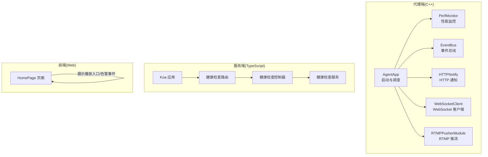
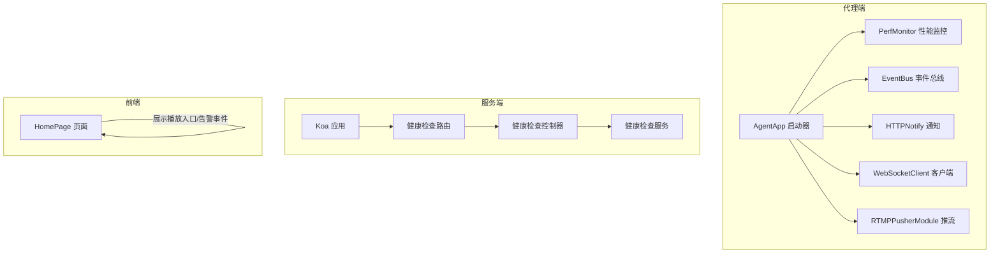
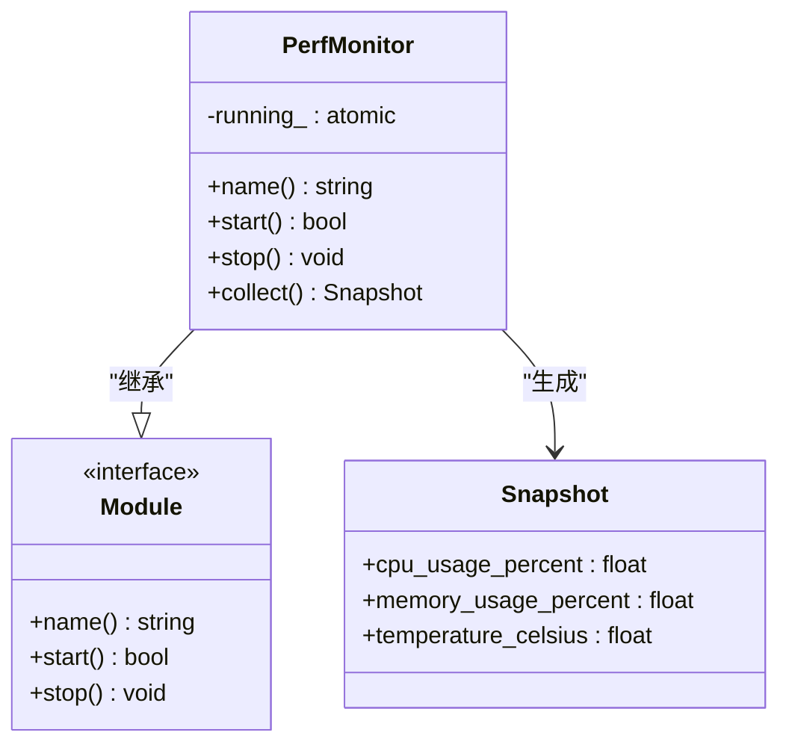
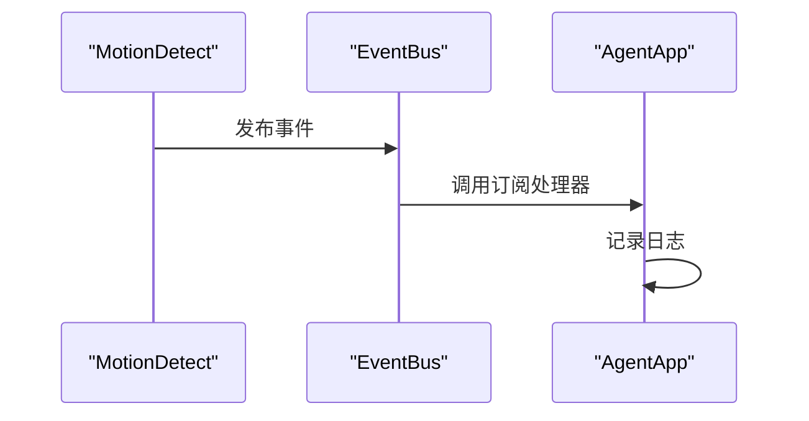
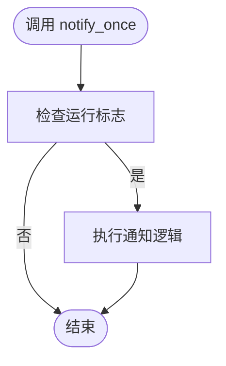
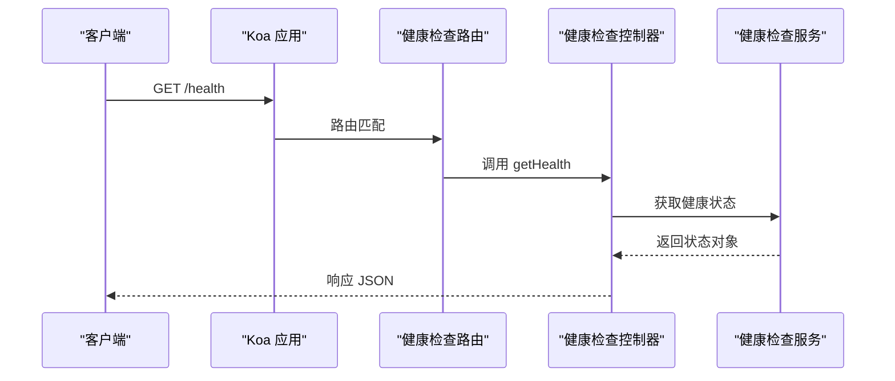
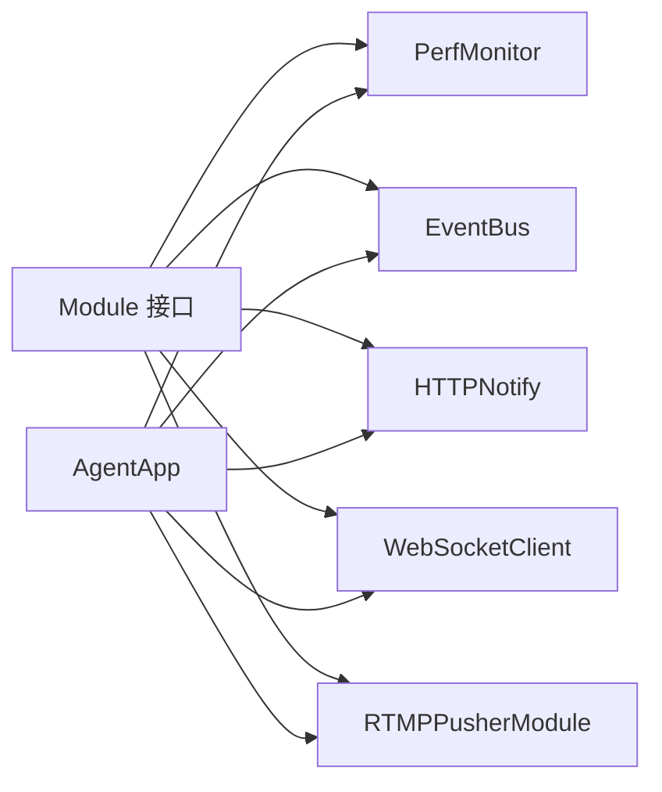

# 监控告警

<cite>
**本文引用的文件**
- [perf_monitor.hpp](file://project/agent/src/modules/infra/perf_monitor/include/infra_monitor/perf_monitor.hpp)
- [perf_monitor.cpp](file://project/agent/src/modules/infra/perf_monitor/perf_monitor.cpp)
- [module.hpp](file://project/agent/src/foundation/include/foundation/module.hpp)
- [agent_app.cpp](file://project/agent/src/runtime/app/agent_app.cpp)
- [health.controller.ts](file://project/server/src/controllers/health.controller.ts)
- [health.service.ts](file://project/server/src/services/health.service.ts)
- [health.ts](file://project/server/src/routes/health.ts)
- [app.ts](file://project/server/src/app.ts)
- [event_bus.hpp](file://project/agent/src/modules/infra/event_bus/include/infra_event/event_bus.hpp)
- [event_bus.cpp](file://project/agent/src/modules/infra/event_bus/event_bus.cpp)
- [http_notify.hpp](file://project/agent/src/modules/external_access/http/include/access_http/http_notify.hpp)
- [http_notify.cpp](file://project/agent/src/modules/external_access/http/http_notify.cpp)
- [websocket_client.hpp](file://project/agent/src/modules/external_access/websocket/include/access_websocket/websocket_client.hpp)
- [rtmp_publisher_module.hpp](file://project/agent/src/modules/external_access/pusher/include/access_pusher/rtmp_publisher_module.hpp)
- [HomePage.tsx](file://project/web/src/pages/HomePage.tsx)
</cite>

## 目录
1. [简介](#简介)
2. [项目结构](#项目结构)
3. [核心组件](#核心组件)
4. [架构总览](#架构总览)
5. [详细组件分析](#详细组件分析)
6. [依赖关系分析](#依赖关系分析)
7. [性能与监控配置](#性能与监控配置)
8. [健康检查与自检流程](#健康检查与自检流程)
9. [告警规则与通知机制](#告警规则与通知机制)
10. [监控数据可视化与趋势分析](#监控数据可视化与趋势分析)
11. [维护与优化建议](#维护与优化建议)
12. [故障排查指南](#故障排查指南)
13. [结论](#结论)

## 简介
本指南面向 Pi-Guard 系统的运维与开发人员，提供一套可落地的监控告警配置方案。内容覆盖性能监控指标（CPU、内存、温度）的采集与阈值设定、系统健康检查接口的使用与自检流程、告警规则与通知机制的配置思路、监控数据的可视化与历史趋势分析方法，以及监控系统的维护与优化建议。文档严格基于仓库中现有代码实现进行说明，并给出可操作的配置步骤与最佳实践。

## 项目结构
Pi-Guard 的监控与告警能力主要分布在以下区域：
- 代理端（C++）：包含性能监控模块、事件总线、HTTP 通知、WebSocket 客户端、RTMP 推流等模块；应用启动时统一初始化并运行。
- 服务端（TypeScript/Koa）：提供健康检查接口，返回服务状态与时间戳。
- Web 前端（React）：页面中包含“实时监控”区域，用于展示播放入口与告警事件列表。

**图表来源**
- [agent_app.cpp:16-42](file://project/agent/src/runtime/app/agent_app.cpp#L16-L42)
- [perf_monitor.hpp:10-25](file://project/agent/src/modules/infra/perf_monitor/include/infra_monitor/perf_monitor.hpp#L10-L25)
- [event_bus.hpp:12-22](file://project/agent/src/modules/infra/event_bus/include/infra_event/event_bus.hpp#L12-L22)
- [http_notify.hpp:10-19](file://project/agent/src/modules/external_access/http/include/access_http/http_notify.hpp#L10-L19)
- [websocket_client.hpp:10-19](file://project/agent/src/modules/external_access/websocket/include/access_websocket/websocket_client.hpp#L10-L19)
- [rtmp_publisher_module.hpp:10-19](file://project/agent/src/modules/external_access/pusher/include/access_pusher/rtmp_publisher_module.hpp#L10-L19)
- [health.controller.ts:1-6](file://project/server/src/controllers/health.controller.ts#L1-L6)
- [health.service.ts:1-13](file://project/server/src/services/health.service.ts#L1-L13)
- [health.ts:1-8](file://project/server/src/routes/health.ts#L1-L8)
- [app.ts:1-14](file://project/server/src/app.ts#L1-L14)
- [HomePage.tsx:1-14](file://project/web/src/pages/HomePage.tsx#L1-L14)

**章节来源**
- [agent_app.cpp:16-42](file://project/agent/src/runtime/app/agent_app.cpp#L16-L42)
- [app.ts:1-14](file://project/server/src/app.ts#L1-L14)

## 核心组件
- 性能监控模块（PerfMonitor）
  - 提供 CPU 使用率、内存占用、温度三类指标快照采集能力。
  - 通过原子布尔标志控制运行状态，支持在运行时收集快照。
- 事件总线（EventBus）
  - 支持订阅与发布事件，用于模块间解耦通信。
- HTTP 通知（HTTPNotify）
  - 提供一次性通知能力，用于对外部系统上报事件或状态。
- WebSocket 客户端（WebSocketClient）
  - 提供轮询接口，可用于推送状态或事件到客户端。
- RTMP 推流（RTMPPusherModule）
  - 提供推流接口，可用于将视频流推送到远端服务器。
- 健康检查（Koa）
  - 提供 /health 接口，返回服务名称、状态与时间戳。

**章节来源**
- [perf_monitor.hpp:10-25](file://project/agent/src/modules/infra/perf_monitor/include/infra_monitor/perf_monitor.hpp#L10-L25)
- [perf_monitor.cpp:14-23](file://project/agent/src/modules/infra/perf_monitor/perf_monitor.cpp#L14-L23)
- [event_bus.hpp:12-22](file://project/agent/src/modules/infra/event_bus/include/infra_event/event_bus.hpp#L12-L22)
- [http_notify.hpp:10-19](file://project/agent/src/modules/external_access/http/include/access_http/http_notify.hpp#L10-L19)
- [websocket_client.hpp:10-19](file://project/agent/src/modules/external_access/websocket/include/access_websocket/websocket_client.hpp#L10-L19)
- [rtmp_publisher_module.hpp:10-19](file://project/agent/src/modules/external_access/pusher/include/access_pusher/rtmp_publisher_module.hpp#L10-L19)
- [health.controller.ts:1-6](file://project/server/src/controllers/health.controller.ts#L1-L6)
- [health.service.ts:1-13](file://project/server/src/services/health.service.ts#L1-L13)

## 架构总览
下图展示了监控与告警在系统中的位置与交互关系：代理端负责采集性能指标并通过事件总线分发；服务端提供健康检查接口；前端页面展示播放入口与告警事件。

**图表来源**
- [agent_app.cpp:16-42](file://project/agent/src/runtime/app/agent_app.cpp#L16-L42)
- [health.ts:1-8](file://project/server/src/routes/health.ts#L1-L8)
- [health.controller.ts:1-6](file://project/server/src/controllers/health.controller.ts#L1-L6)
- [health.service.ts:1-13](file://project/server/src/services/health.service.ts#L1-L13)
- [HomePage.tsx:1-14](file://project/web/src/pages/HomePage.tsx#L1-L14)

## 详细组件分析

### 性能监控模块（PerfMonitor）
- 角色与职责
  - 提供性能指标快照采集接口，包含 CPU 使用率、内存占用、温度。
  - 作为基础模块，被 AgentApp 在启动阶段统一初始化并运行。
- 关键行为
  - 启动后置运行标志为真，停止时置为假。
  - collect() 返回 Snapshot 结构体，若未运行则返回空快照。
- 设计要点
  - 采用原子布尔标志保证线程安全的状态切换。
  - 当前实现返回固定数值，实际部署时应替换为真实系统指标读取逻辑。

**图表来源**
- [module.hpp:7-14](file://project/agent/src/foundation/include/foundation/module.hpp#L7-L14)
- [perf_monitor.hpp:10-25](file://project/agent/src/modules/infra/perf_monitor/include/infra_monitor/perf_monitor.hpp#L10-L25)

**章节来源**
- [perf_monitor.hpp:10-25](file://project/agent/src/modules/infra/perf_monitor/include/infra_monitor/perf_monitor.hpp#L10-L25)
- [perf_monitor.cpp:5-23](file://project/agent/src/modules/infra/perf_monitor/perf_monitor.cpp#L5-L23)
- [agent_app.cpp:24-24](file://project/agent/src/runtime/app/agent_app.cpp#L24-L24)

### 事件总线（EventBus）
- 角色与职责
  - 提供订阅/发布机制，用于模块间解耦通信。
  - 在 AgentApp 中用于接收运动检测等事件并记录日志。
- 关键行为
  - 订阅时注册处理器，发布时按事件类型分发给所有处理器。
  - 内部使用共享互斥锁保证并发安全。

**图表来源**
- [event_bus.cpp:13-22](file://project/agent/src/modules/infra/event_bus/event_bus.cpp#L13-L22)
- [agent_app.cpp:36-38](file://project/agent/src/runtime/app/agent_app.cpp#L36-L38)

**章节来源**
- [event_bus.hpp:12-22](file://project/agent/src/modules/infra/event_bus/include/infra_event/event_bus.hpp#L12-L22)
- [event_bus.cpp:8-22](file://project/agent/src/modules/infra/event_bus/event_bus.cpp#L8-L22)
- [agent_app.cpp:36-38](file://project/agent/src/runtime/app/agent_app.cpp#L36-L38)

### HTTP 通知（HTTPNotify）
- 角色与职责
  - 提供一次性通知能力，可在需要时向外部系统发送告警或状态信息。
- 关键行为
  - 启停控制运行标志，notify_once() 在运行状态下执行通知逻辑（当前为空实现，需扩展）。

**图表来源**
- [http_notify.cpp:14-18](file://project/agent/src/modules/external_access/http/http_notify.cpp#L14-L18)

**章节来源**
- [http_notify.hpp:10-19](file://project/agent/src/modules/external_access/http/include/access_http/http_notify.hpp#L10-L19)
- [http_notify.cpp:5-18](file://project/agent/src/modules/external_access/http/http_notify.cpp#L5-L18)

### WebSocket 客户端（WebSocketClient）
- 角色与职责
  - 提供轮询接口，可用于将状态或事件推送到前端或外部系统。
- 关键行为
  - 启停控制运行标志，poll_once() 用于单次轮询处理。

**章节来源**
- [websocket_client.hpp:10-19](file://project/agent/src/modules/external_access/websocket/include/access_websocket/websocket_client.hpp#L10-L19)

### RTMP 推流（RTMPPusherModule）
- 角色与职责
  - 提供推流接口，用于将视频流推送到远端服务器。
- 关键行为
  - 启停控制运行标志，push_once() 用于单次推流处理。

**章节来源**
- [rtmp_publisher_module.hpp:10-19](file://project/agent/src/modules/external_access/pusher/include/access_pusher/rtmp_publisher_module.hpp#L10-L19)

### 健康检查接口（Koa）
- 角色与职责
  - 提供 /health 接口，返回服务名称、状态与时间戳，便于外部系统进行健康检查。
- 关键行为
  - 控制器函数直接调用服务获取状态并写入响应。
  - 应用挂载路由中间件以启用路由。

**图表来源**
- [app.ts:1-14](file://project/server/src/app.ts#L1-L14)
- [health.ts:1-8](file://project/server/src/routes/health.ts#L1-L8)
- [health.controller.ts:1-6](file://project/server/src/controllers/health.controller.ts#L1-L6)
- [health.service.ts:1-13](file://project/server/src/services/health.service.ts#L1-L13)

**章节来源**
- [health.controller.ts:1-6](file://project/server/src/controllers/health.controller.ts#L1-L6)
- [health.service.ts:1-13](file://project/server/src/services/health.service.ts#L1-L13)
- [health.ts:1-8](file://project/server/src/routes/health.ts#L1-L8)
- [app.ts:1-14](file://project/server/src/app.ts#L1-L14)

## 依赖关系分析
- 模块化设计
  - 所有模块均继承自基础 Module 接口，统一了生命周期管理（start/stop/name）。
- 启动顺序
  - AgentApp 在启动时依次启动日志、配置、性能监控、采集、处理、编码、回放、文件写入、推流、HTTP 通知、WebSocket 客户端等模块。
- 事件驱动
  - 运动检测等事件通过 EventBus 分发，便于模块间解耦。

**图表来源**
- [module.hpp:7-14](file://project/agent/src/foundation/include/foundation/module.hpp#L7-L14)
- [perf_monitor.hpp:10-25](file://project/agent/src/modules/infra/perf_monitor/include/infra_monitor/perf_monitor.hpp#L10-L25)
- [event_bus.hpp:12-22](file://project/agent/src/modules/infra/event_bus/include/infra_event/event_bus.hpp#L12-L22)
- [http_notify.hpp:10-19](file://project/agent/src/modules/external_access/http/include/access_http/http_notify.hpp#L10-L19)
- [websocket_client.hpp:10-19](file://project/agent/src/modules/external_access/websocket/include/access_websocket/websocket_client.hpp#L10-L19)
- [rtmp_publisher_module.hpp:10-19](file://project/agent/src/modules/external_access/pusher/include/access_pusher/rtmp_publisher_module.hpp#L10-L19)
- [agent_app.cpp:16-42](file://project/agent/src/runtime/app/agent_app.cpp#L16-L42)

**章节来源**
- [agent_app.cpp:16-42](file://project/agent/src/runtime/app/agent_app.cpp#L16-L42)

## 性能与监控配置
- 指标定义
  - CPU 使用率：百分比，范围 0–100。
  - 内存占用：百分比，范围 0–100。
  - 温度：摄氏度，根据平台支持情况设置合理上限。
- 阈值建议（示例）
  - CPU 使用率 > 90% 持续 3 个周期 → 告警
  - 内存占用 > 85% 持续 5 个周期 → 告警
  - 温度 > 80°C 持续 2 个周期 → 告警
- 采集频率
  - 建议每 5–10 秒采集一次，避免过高开销。
- 实现建议
  - 将 PerfMonitor::collect() 中的固定数值替换为真实系统指标读取逻辑（如 /proc/stat、/proc/meminfo、/sys/class/thermal/ 等）。
  - 在 AgentApp 中增加定时任务或线程定期调用 collect() 并将结果写入日志或指标存储。

**章节来源**
- [perf_monitor.hpp:12-16](file://project/agent/src/modules/infra/perf_monitor/include/infra_monitor/perf_monitor.hpp#L12-L16)
- [perf_monitor.cpp:14-23](file://project/agent/src/modules/infra/perf_monitor/perf_monitor.cpp#L14-L23)
- [agent_app.cpp:65-76](file://project/agent/src/runtime/app/agent_app.cpp#L65-L76)

## 健康检查与自检流程
- 接口使用
  - 服务端提供 /health 接口，返回服务名、状态与时间戳。
  - 可通过定时任务或外部监控系统访问该接口进行健康检查。
- 自检流程
  - AgentApp 启动时逐模块初始化并启动，启动完成后进入工作线程循环。
  - 健康检查接口仅返回服务状态，不替代模块级自检。
- 最佳实践
  - 在生产环境将 /health 作为负载均衡探针或容器健康检查端点。
  - 对于模块级健康，建议结合日志与事件总线进行异常上报。

**章节来源**
- [health.controller.ts:1-6](file://project/server/src/controllers/health.controller.ts#L1-L6)
- [health.service.ts:1-13](file://project/server/src/services/health.service.ts#L1-L13)
- [health.ts:1-8](file://project/server/src/routes/health.ts#L1-L8)
- [app.ts:1-14](file://project/server/src/app.ts#L1-L14)
- [agent_app.cpp:16-42](file://project/agent/src/runtime/app/agent_app.cpp#L16-L42)

## 告警规则与通知机制
- 告警示例
  - CPU 使用率连续超过阈值触发告警。
  - 内存占用持续升高触发告警。
  - 温度过高触发告警。
- 通知渠道
  - HTTP 通知：通过 HTTPNotify 将告警上报至外部系统。
  - WebSocket：通过 WebSocketClient 将告警推送到前端或客户端。
  - RTMP：通过 RTMPPusherModule 将告警事件与视频流关联推送。
- 配置建议
  - 在 AgentApp 的工作线程中定期读取 PerfMonitor 快照，结合阈值判断触发告警。
  - 将告警事件通过 EventBus 发布，HTTPNotify/WS/RTMP 模块订阅并执行相应动作。
  - 为每个通知通道配置独立的开关与重试策略，避免告警风暴。

**章节来源**
- [http_notify.hpp:10-19](file://project/agent/src/modules/external_access/http/include/access_http/http_notify.hpp#L10-L19)
- [http_notify.cpp:14-18](file://project/agent/src/modules/external_access/http/http_notify.cpp#L14-L18)
- [websocket_client.hpp:10-19](file://project/agent/src/modules/external_access/websocket/include/access_websocket/websocket_client.hpp#L10-L19)
- [rtmp_publisher_module.hpp:10-19](file://project/agent/src/modules/external_access/pusher/include/access_pusher/rtmp_publisher_module.hpp#L10-L19)
- [event_bus.hpp:12-22](file://project/agent/src/modules/infra/event_bus/include/infra_event/event_bus.hpp#L12-L22)
- [agent_app.cpp:65-76](file://project/agent/src/runtime/app/agent_app.cpp#L65-L76)

## 监控数据可视化与趋势分析
- 数据来源
  - 代理端 PerfMonitor 采集的 CPU、内存、温度指标。
  - 服务端 /health 接口返回的服务状态与时间戳。
- 可视化建议
  - 将 PerfMonitor 快照写入时序数据库（如 InfluxDB）或日志系统（如 Loki + Promtail），结合 Grafana 进行可视化。
  - 将 /health 接口的响应时间与状态变化纳入可用性监控。
- 趋势分析
  - 基于历史数据计算滑动平均、峰值与异常检测，辅助容量规划与故障预警。
  - 结合前端 HomePage 展示播放入口与告警事件列表，形成“实时监控”看板。

**章节来源**
- [perf_monitor.hpp:12-16](file://project/agent/src/modules/infra/perf_monitor/include/infra_monitor/perf_monitor.hpp#L12-L16)
- [health.service.ts:1-13](file://project/server/src/services/health.service.ts#L1-L13)
- [HomePage.tsx:1-14](file://project/web/src/pages/HomePage.tsx#L1-L14)

## 维护与优化建议
- 指标采集
  - 优先使用系统提供的轻量级接口读取指标，减少额外依赖。
  - 控制采集频率与样本窗口，避免对系统造成额外压力。
- 事件与通知
  - 对高频事件进行去重与聚合，降低通知风暴风险。
  - 为通知通道设置退避重试与熔断保护。
- 日志与可观测性
  - 将关键路径的日志级别调整为 debug/info，便于问题定位。
  - 在关键节点输出结构化日志，便于自动化分析。
- 性能优化
  - 合理设置工作线程的休眠间隔，平衡吞吐与延迟。
  - 对热点模块（如编码、推流）进行性能剖析与优化。

[本节为通用建议，无需特定文件引用]

## 故障排查指南
- 指标不更新
  - 检查 PerfMonitor 是否处于运行状态（start/stop）。
  - 确认 AgentApp 的定时任务是否正常执行。
- 告警未触发
  - 检查阈值配置与事件订阅链路（EventBus）。
  - 确认 HTTPNotify/WS/RTMP 模块已启动且运行标志为真。
- 健康检查失败
  - 检查 /health 路由与控制器是否正确挂载。
  - 查看服务端日志，确认中间件与路由生效。

**章节来源**
- [perf_monitor.cpp:7-12](file://project/agent/src/modules/infra/perf_monitor/perf_monitor.cpp#L7-L12)
- [agent_app.cpp:16-42](file://project/agent/src/runtime/app/agent_app.cpp#L16-L42)
- [http_notify.cpp:7-12](file://project/agent/src/modules/external_access/http/http_notify.cpp#L7-L12)
- [app.ts:1-14](file://project/server/src/app.ts#L1-L14)

## 结论
Pi-Guard 的监控告警体系以模块化设计为核心，代理端负责性能指标采集与事件分发，服务端提供健康检查接口，前端页面承载实时展示。通过合理的阈值配置、通知通道与可视化方案，可构建稳定可靠的监控告警闭环。建议在生产环境中结合时序数据库与可视化工具，持续优化采集频率与告警策略，确保系统长期稳定运行。