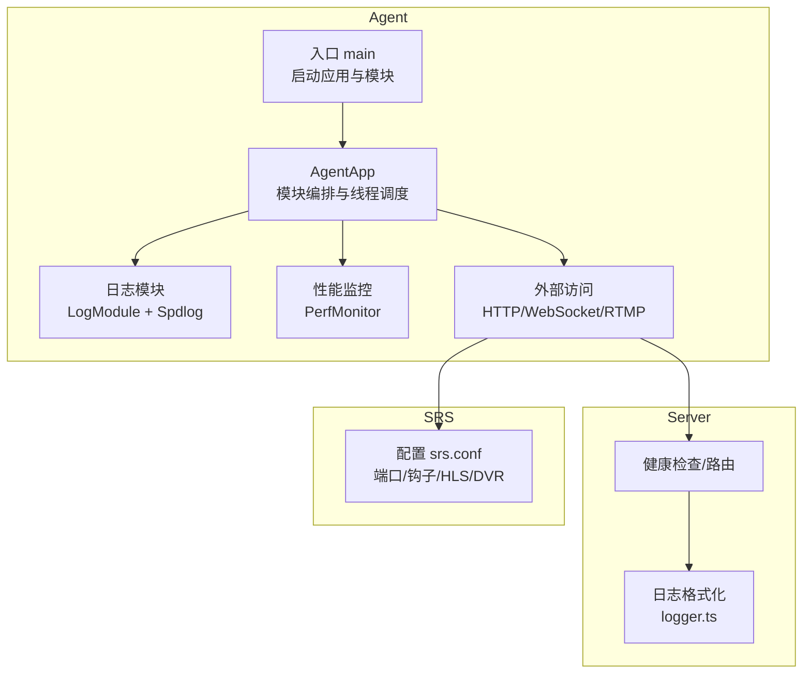
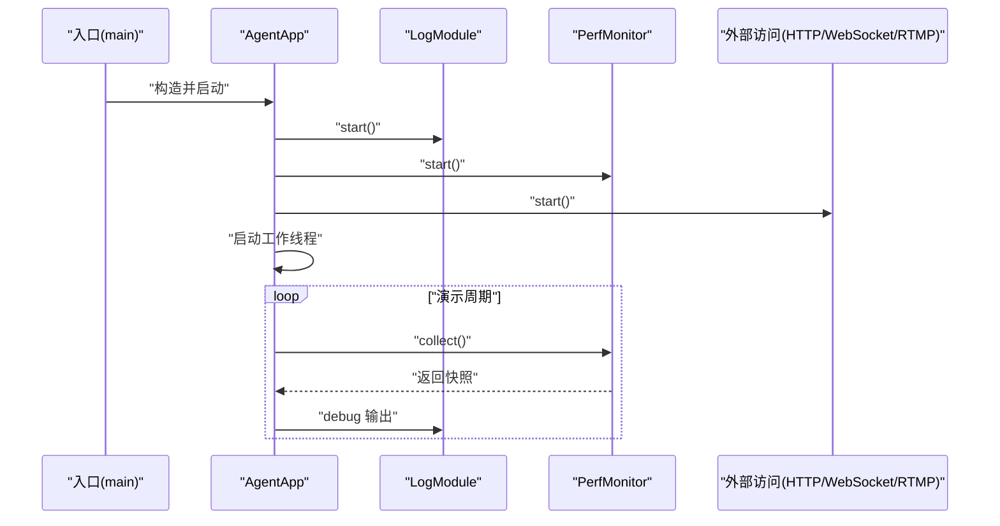
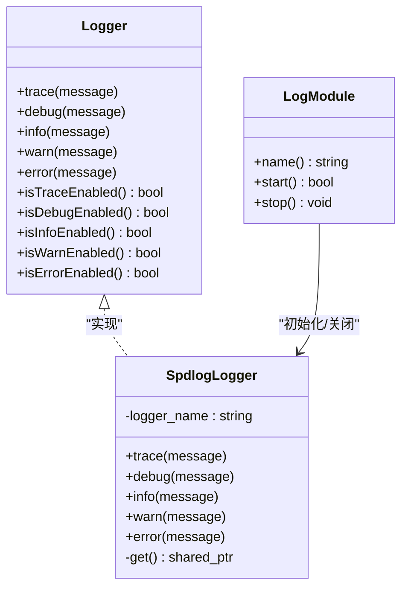
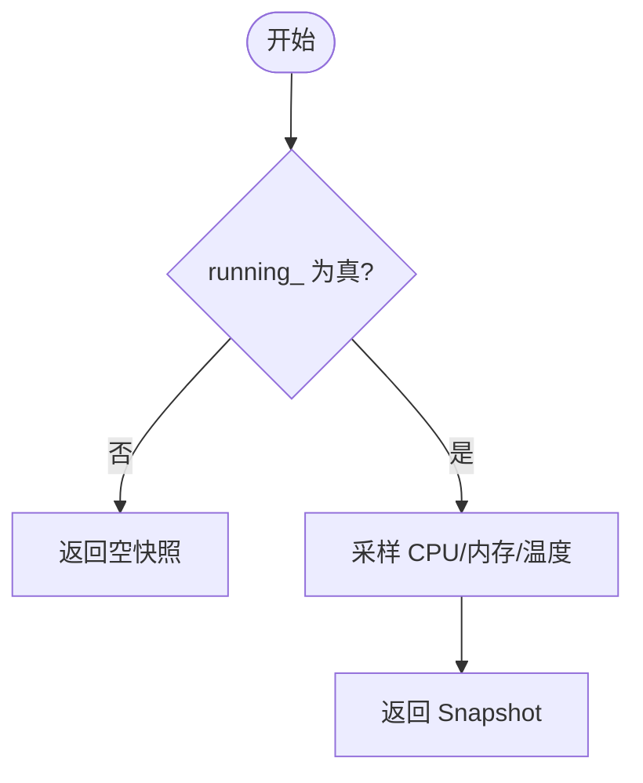
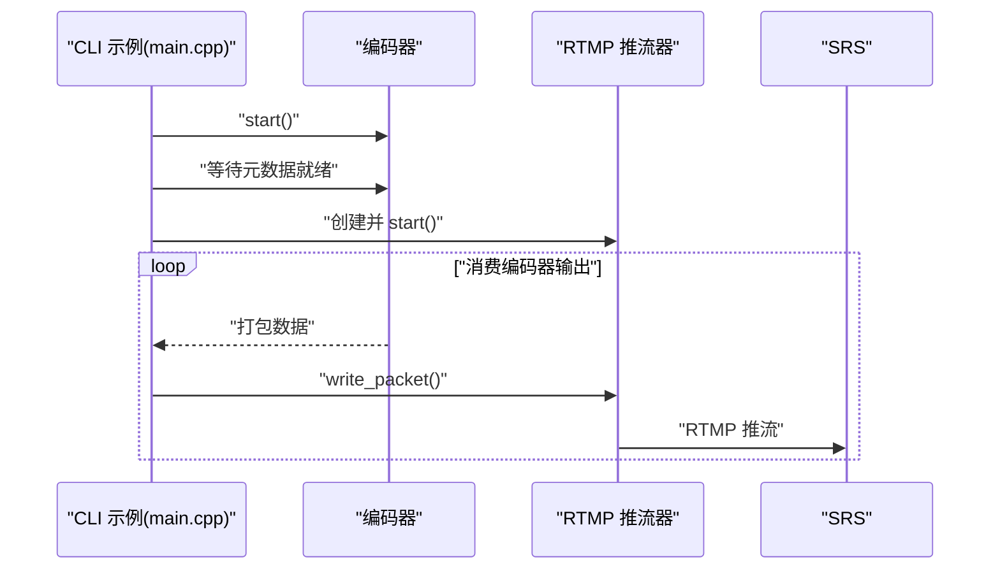
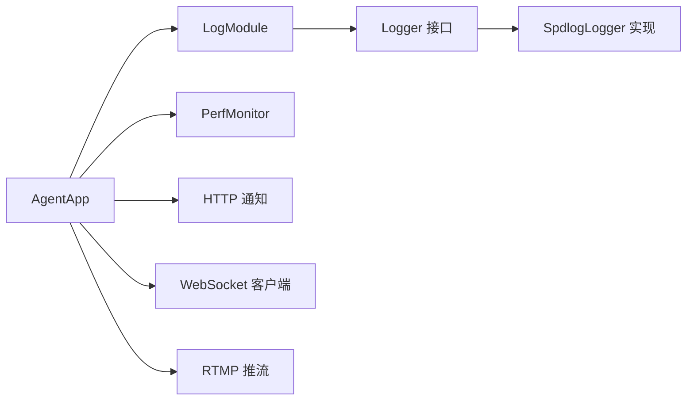
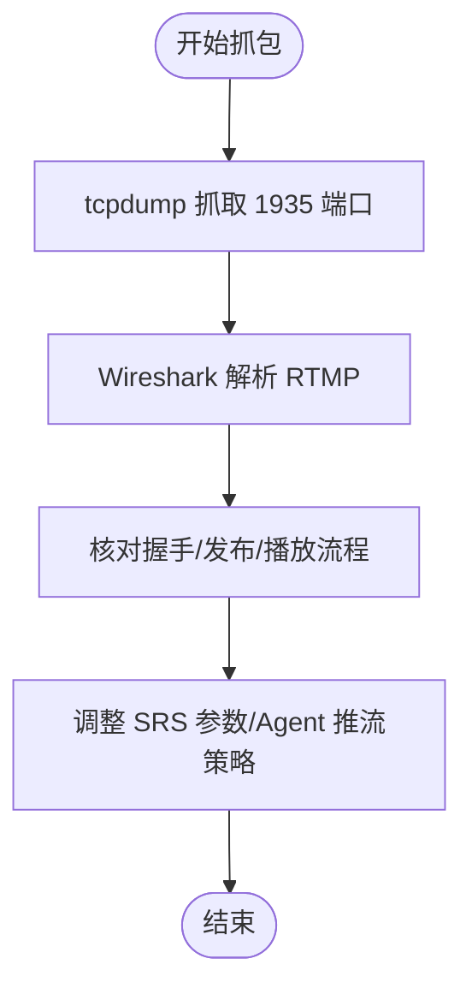

# 调试方法

<cite>
**本文引用的文件**
- [main.cpp](file://project/agent/src/main.cpp)
- [agent_app.cpp](file://project/agent/src/runtime/app/agent_app.cpp)
- [types.hpp](file://project/agent/src/foundation/include/foundation/types.hpp)
- [logger.hpp](file://project/agent/src/modules/infra/log/include/infra_log/logger.hpp)
- [spd_logger.cpp](file://project/agent/src/modules/infra/log/spd_logger.cpp)
- [log_module.cpp](file://project/agent/src/modules/infra/log/log_module.cpp)
- [perf_monitor.hpp](file://project/agent/src/modules/infra/perf_monitor/include/infra_monitor/perf_monitor.hpp)
- [perf_monitor.cpp](file://project/agent/src/modules/infra/perf_monitor/perf_monitor.cpp)
- [rtmp_publisher_module.hpp](file://project/agent/src/modules/external_access/pusher/include/access_pusher/rtmp_publisher_module.hpp)
- [rtmp_publisher_module.cpp](file://project/agent/src/modules/external_access/pusher/rtmp_publisher_module.cpp)
- [srs.conf](file://project/srs/conf/srs.conf)
- [logger.ts](file://project/server/src/config/logger.ts)
- [main.cpp](file://project/agent/cli/srs/main.cpp)
</cite>

## 目录
1. [简介](#简介)
2. [项目结构](#项目结构)
3. [核心组件](#核心组件)
4. [架构总览](#架构总览)
5. [详细组件分析](#详细组件分析)
6. [依赖关系分析](#依赖关系分析)
7. [性能与资源监控](#性能与资源监控)
8. [网络抓包与 RTMP 排障](#网络抓包与-rtmp-排障)
9. [断点调试与内存检测](#断点调试与内存检测)
10. [调试环境配置与参数](#调试环境配置与参数)
11. [故障排查指南](#故障排查指南)
12. [结论](#结论)

## 简介
本指南面向 Pi-Guard 系统的开发者与运维人员，提供系统化的调试方法与实操步骤，覆盖日志体系、网络抓包、性能分析、断点调试与内存检测、以及调试环境与参数配置。文档结合代码库中的实际实现，帮助快速定位问题并验证修复效果。

## 项目结构
Pi-Guard 分为三大子系统：Agent（采集与处理）、Server（HTTP/WebSocket/通知）、SRS（RTMP 源站）。Agent 内部通过模块化设计组织日志、性能监控、事件总线、外部访问（HTTP/WebSocket/RTMP）等能力；Server 提供日志格式化与 HTTP 接口；SRS 提供 RTMP 推拉流服务与钩子回调。

图示来源
- [main.cpp:1-19](file://project/agent/src/main.cpp#L1-L19)
- [agent_app.cpp:1-138](file://project/agent/src/runtime/app/agent_app.cpp#L1-L138)
- [log_module.cpp:1-30](file://project/agent/src/modules/infra/log/log_module.cpp#L1-L30)
- [spd_logger.cpp:1-68](file://project/agent/src/modules/infra/log/spd_logger.cpp#L1-L68)
- [perf_monitor.cpp:1-26](file://project/agent/src/modules/infra/perf_monitor/perf_monitor.cpp#L1-L26)
- [srs.conf:1-61](file://project/srs/conf/srs.conf#L1-L61)
- [logger.ts:1-18](file://project/server/src/config/logger.ts#L1-L18)

章节来源
- [main.cpp:1-19](file://project/agent/src/main.cpp#L1-L19)
- [agent_app.cpp:1-138](file://project/agent/src/runtime/app/agent_app.cpp#L1-L138)

## 核心组件
- 日志系统：基于 spdlog 的轻量封装，统一初始化与模式，支持多模块日志输出。
- 性能监控：周期性收集 CPU/内存/温度快照，便于运行时观察。
- 外部访问：HTTP 通知、WebSocket 客户端、RTMP 推流模块，用于事件上报与媒体推流。
- 事件模型：基础事件类型与帧结构，贯穿采集、处理、输出链路。

章节来源
- [logger.hpp:1-25](file://project/agent/src/modules/infra/log/include/infra_log/logger.hpp#L1-L25)
- [spd_logger.cpp:1-68](file://project/agent/src/modules/infra/log/spd_logger.cpp#L1-L68)
- [log_module.cpp:1-30](file://project/agent/src/modules/infra/log/log_module.cpp#L1-L30)
- [perf_monitor.hpp:1-28](file://project/agent/src/modules/infra/perf_monitor/include/infra_monitor/perf_monitor.hpp#L1-L28)
- [perf_monitor.cpp:1-26](file://project/agent/src/modules/infra/perf_monitor/perf_monitor.cpp#L1-L26)
- [types.hpp:1-39](file://project/agent/src/foundation/include/foundation/types.hpp#L1-L39)
- [rtmp_publisher_module.hpp:1-22](file://project/agent/src/modules/external_access/pusher/include/access_pusher/rtmp_publisher_module.hpp#L1-L22)
- [rtmp_publisher_module.cpp:1-21](file://project/agent/src/modules/external_access/pusher/rtmp_publisher_module.cpp#L1-L21)

## 架构总览
Agent 应用在启动时初始化日志后，依次启动配置管理、性能监控、采集、处理、输出与外部访问模块，并在独立线程中驱动各模块循环执行。Server 提供日志格式化与 HTTP 接口，SRS 提供 RTMP 推流与钩子回调。

图示来源
- [main.cpp:1-19](file://project/agent/src/main.cpp#L1-L19)
- [agent_app.cpp:1-138](file://project/agent/src/runtime/app/agent_app.cpp#L1-L138)
- [log_module.cpp:1-30](file://project/agent/src/modules/infra/log/log_module.cpp#L1-L30)
- [perf_monitor.cpp:1-26](file://project/agent/src/modules/infra/perf_monitor/perf_monitor.cpp#L1-L26)

## 详细组件分析

### 日志系统
- 初始化与生命周期
  - LogModule 在首次启动时初始化 spdlog 后端，设置日志模式与全局级别，退出时安全关闭。
  - Logger 接口定义了 trace/debug/info/warn/error 及其可用性查询方法。
  - SpdlogLogger 实现基于 spdlog 的彩色控制台输出，按名称获取或创建 logger。
- 日志级别与格式
  - 全局默认级别为 trace，模式包含时间戳、级别、日志器名与消息体。
- 使用建议
  - 在关键路径增加 info/debug，错误分支使用 error；在性能循环中仅在必要时输出 debug，避免阻塞。
  - 为不同模块分配独立的日志器名称，便于筛选与聚合。

图示来源
- [logger.hpp:1-25](file://project/agent/src/modules/infra/log/include/infra_log/logger.hpp#L1-L25)
- [spd_logger.cpp:1-68](file://project/agent/src/modules/infra/log/spd_logger.cpp#L1-L68)
- [log_module.cpp:1-30](file://project/agent/src/modules/infra/log/log_module.cpp#L1-L30)

章节来源
- [spd_logger.cpp:1-68](file://project/agent/src/modules/infra/log/spd_logger.cpp#L1-L68)
- [log_module.cpp:1-30](file://project/agent/src/modules/infra/log/log_module.cpp#L1-L30)
- [logger.ts:1-18](file://project/server/src/config/logger.ts#L1-L18)

### 性能监控
- 功能概述
  - PerfMonitor 提供周期性采集 CPU/内存/温度快照的能力，当前实现返回固定值，便于演示。
- 使用建议
  - 在 AgentApp 的演示循环中调用 collect 并输出到日志，观察运行时资源占用趋势。
  - 如需真实指标，可在实现中接入系统 API 或第三方库。

图示来源
- [perf_monitor.cpp:1-26](file://project/agent/src/modules/infra/perf_monitor/perf_monitor.cpp#L1-L26)
- [perf_monitor.hpp:1-28](file://project/agent/src/modules/infra/perf_monitor/include/infra_monitor/perf_monitor.hpp#L1-L28)

章节来源
- [perf_monitor.cpp:1-26](file://project/agent/src/modules/infra/perf_monitor/perf_monitor.cpp#L1-L26)
- [perf_monitor.hpp:1-28](file://project/agent/src/modules/infra/perf_monitor/include/infra_monitor/perf_monitor.hpp#L1-L28)
- [agent_app.cpp:65-76](file://project/agent/src/runtime/app/agent_app.cpp#L65-L76)

### 外部访问（HTTP/WebSocket/RTMP）
- HTTP 通知
  - Agent 中存在 HTTP 通知模块接口，用于向 Server 发送事件通知。
- WebSocket 客户端
  - Agent 中存在 WebSocket 客户端模块接口，用于与 Server 建立长连接。
- RTMP 推流
  - Agent 中存在 RTMP 推流模块接口；CLI 示例程序展示了从编码器消费数据并通过 RTMP 推流器发送的过程。

图示来源
- [main.cpp:1-131](file://project/agent/cli/srs/main.cpp#L1-L131)
- [rtmp_publisher_module.hpp:1-22](file://project/agent/src/modules/external_access/pusher/include/access_pusher/rtmp_publisher_module.hpp#L1-L22)
- [rtmp_publisher_module.cpp:1-21](file://project/agent/src/modules/external_access/pusher/rtmp_publisher_module.cpp#L1-L21)

章节来源
- [main.cpp:1-131](file://project/agent/cli/srs/main.cpp#L1-L131)
- [rtmp_publisher_module.hpp:1-22](file://project/agent/src/modules/external_access/pusher/include/access_pusher/rtmp_publisher_module.hpp#L1-L22)
- [rtmp_publisher_module.cpp:1-21](file://project/agent/src/modules/external_access/pusher/rtmp_publisher_module.cpp#L1-L21)

## 依赖关系分析
- AgentApp 依赖日志模块、性能监控、采集/处理/输出模块与外部访问模块；这些模块均继承自通用 Module 接口，具备统一的生命周期管理。
- 日志模块依赖 spdlog 后端，负责初始化与关闭；Logger 接口屏蔽具体实现差异。
- 性能监控模块提供 Snapshot 结构，便于上层读取与记录。
- 外部访问模块（HTTP/WebSocket/RTMP）作为可插拔组件，由 AgentApp 统一调度。

图示来源
- [agent_app.cpp:1-138](file://project/agent/src/runtime/app/agent_app.cpp#L1-L138)
- [log_module.cpp:1-30](file://project/agent/src/modules/infra/log/log_module.cpp#L1-L30)
- [logger.hpp:1-25](file://project/agent/src/modules/infra/log/include/infra_log/logger.hpp#L1-L25)
- [spd_logger.cpp:1-68](file://project/agent/src/modules/infra/log/spd_logger.cpp#L1-L68)

章节来源
- [agent_app.cpp:1-138](file://project/agent/src/runtime/app/agent_app.cpp#L1-L138)
- [log_module.cpp:1-30](file://project/agent/src/modules/infra/log/log_module.cpp#L1-L30)
- [logger.hpp:1-25](file://project/agent/src/modules/infra/log/include/infra_log/logger.hpp#L1-L25)
- [spd_logger.cpp:1-68](file://project/agent/src/modules/infra/log/spd_logger.cpp#L1-L68)

## 性能与资源监控
- 运行时观察
  - 在演示循环中定期收集性能快照并输出到日志，便于发现异常波动。
- 系统级工具
  - 使用 htop 观察 CPU/内存占用与进程状态；结合 AgentApp 的工作线程睡眠间隔，判断是否存在过载或阻塞。
- 建议
  - 将性能日志与业务日志分离，便于检索；在高负载场景下降低 debug 输出频率。

章节来源
- [agent_app.cpp:65-76](file://project/agent/src/runtime/app/agent_app.cpp#L65-L76)
- [perf_monitor.cpp:1-26](file://project/agent/src/modules/infra/perf_monitor/perf_monitor.cpp#L1-L26)

## 网络抓包与 RTMP 排障
- 抓包工具
  - tcpdump：在服务器侧对 RTMP 端口（默认 1935）进行抓包，过滤 RTMP 协议特征，定位丢包、乱序与延迟。
  - Wireshark：导入 tcpdump 文件，使用 RTMP 协议解析器查看握手、发布/播放流程与关键帧分布。
- SRS 配置要点
  - 确认监听端口、HTTP API、钩子回调地址与 HLS/DVR 设置是否符合预期。
  - 关注最小延迟、TCP_NODELAY、GOP 缓存与队列长度等参数对实时性的影响。
- Agent 侧验证
  - 在 CLI 示例中确认编码器元数据就绪后再启动 RTMP 推流，避免因元数据缺失导致推流失败。
  - 通过日志观察 RTMP 推流器的状态变化与异常信息。

图示来源
- [srs.conf:1-61](file://project/srs/conf/srs.conf#L1-L61)
- [main.cpp:1-131](file://project/agent/cli/srs/main.cpp#L1-L131)

章节来源
- [srs.conf:1-61](file://project/srs/conf/srs.conf#L1-L61)
- [main.cpp:1-131](file://project/agent/cli/srs/main.cpp#L1-L131)

## 断点调试与内存检测
- 断点调试
  - 在 AgentApp 的工作线程中设置断点，观察各模块的执行顺序与耗时；在 RTMP 推流路径的关键节点（如 write_packet）设置断点，检查数据包序列与时间戳。
  - 在 CLI 示例中，可在编码器元数据就绪处设置断点，确保推流前条件满足。
- 内存检测
  - 使用 valgrind 的 memcheck 工具运行 Agent 可执行文件或 CLI 示例，定位内存泄漏、越界访问与未释放对象。
  - 关注日志器、事件队列与帧缓冲区的生命周期，确保在 stop()/析构时正确释放资源。
- 调试符号与构建
  - 使用 Debug 构建以保留符号信息；在 CMake 中启用必要的调试标志，便于 GDB/LLDB 正确显示变量与调用栈。

章节来源
- [agent_app.cpp:78-126](file://project/agent/src/runtime/app/agent_app.cpp#L78-L126)
- [main.cpp:70-93](file://project/agent/cli/srs/main.cpp#L70-L93)

## 调试环境配置与参数
- 日志级别与模式
  - 全局默认级别为 trace，可通过修改后端初始化逻辑提升到 debug/info/warn/error；模式包含时间戳、级别、日志器名与消息体。
- SRS 参数
  - 监听端口、HTTP API、钩子回调地址、HLS 路径与清理策略、DVR 开关等均可在配置文件中调整。
- Agent 参数
  - CLI 示例支持通过命令行传入视频设备、音频设备与 RTMP 地址；也可在配置类中设置默认值。
- Server 日志格式
  - 控制台输出采用统一格式，包含时间戳与级别，便于与 Agent 日志联动分析。

章节来源
- [spd_logger.cpp:41-49](file://project/agent/src/modules/infra/log/spd_logger.cpp#L41-L49)
- [srs.conf:1-61](file://project/srs/conf/srs.conf#L1-L61)
- [main.cpp:24-31](file://project/agent/cli/srs/main.cpp#L24-L31)
- [logger.ts:1-18](file://project/server/src/config/logger.ts#L1-L18)

## 故障排查指南
- 启动失败
  - 检查 AgentApp 的启动返回值与错误日志；确认日志模块已成功初始化。
- 推流失败
  - 在 CLI 示例中确认编码器元数据就绪；检查 RTMP 推流器的异常抛出与停止流程。
- 性能异常
  - 查看性能快照日志，结合 htop 观察系统负载；适当降低 debug 输出频率或调整线程睡眠间隔。
- 网络问题
  - 使用 tcpdump/Wireshark 检查 RTMP 握手与推流过程；核对 SRS 配置与 Server 钩子回调可达性。

章节来源
- [main.cpp:9-13](file://project/agent/src/main.cpp#L9-L13)
- [agent_app.cpp:16-42](file://project/agent/src/runtime/app/agent_app.cpp#L16-L42)
- [main.cpp:70-93](file://project/agent/cli/srs/main.cpp#L70-L93)
- [srs.conf:54-59](file://project/srs/conf/srs.conf#L54-L59)

## 结论
通过统一的日志体系、性能监控与外部访问模块，Pi-Guard 在 Agent 层实现了清晰的可观测性与可调试性。配合 tcpdump/Wireshark、htop 与 valgrind 等工具，可高效定位 RTMP 推流、系统资源与内存问题。建议在开发与测试环境中开启更细粒度的日志，在生产环境中根据需要降低日志级别以平衡性能与可观测性。