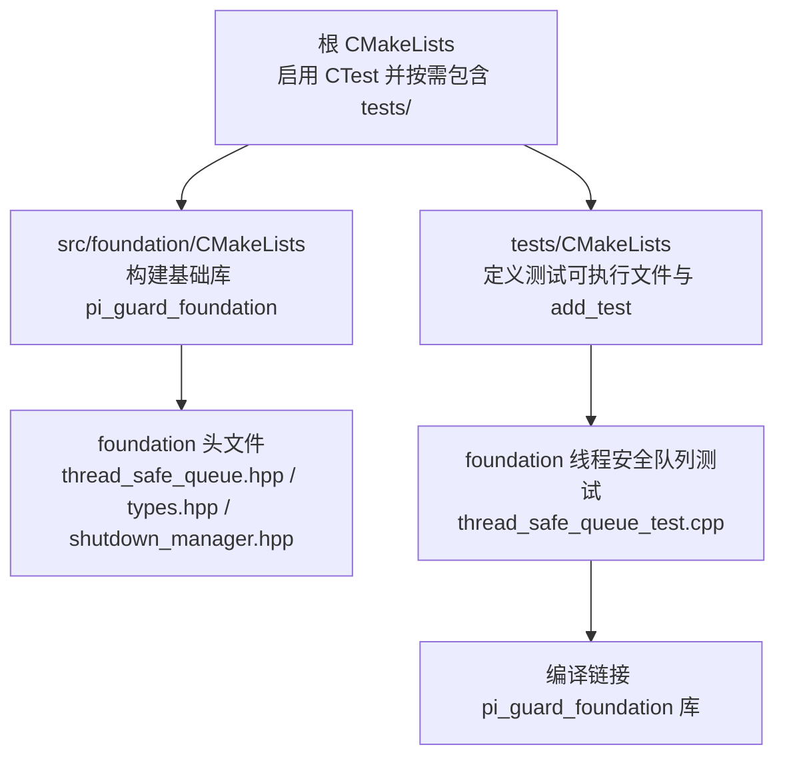
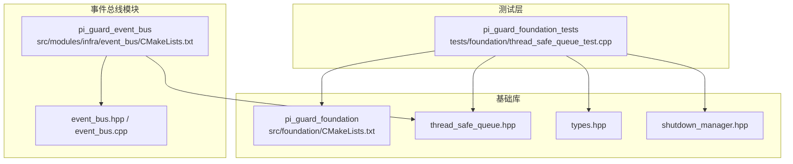
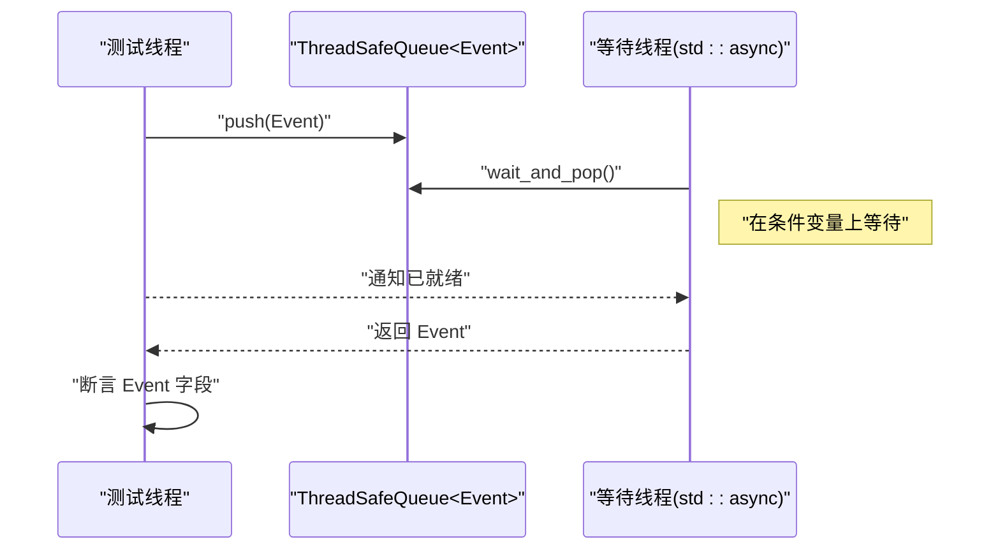
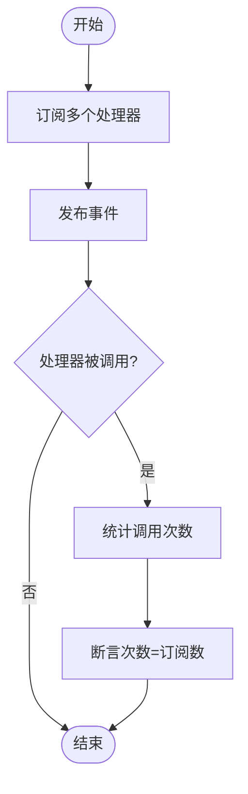
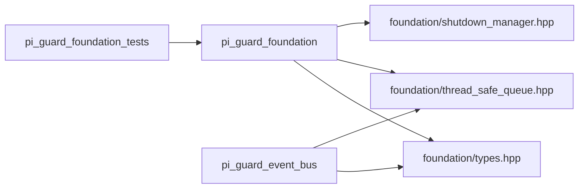

# 单元测试

<cite>
**本文引用的文件**
- [project/agent/tests/foundation/thread_safe_queue_test.cpp](file://project/agent/tests/foundation/thread_safe_queue_test.cpp)
- [project/agent/src/foundation/include/foundation/thread_safe_queue.hpp](file://project/agent/src/foundation/include/foundation/thread_safe_queue.hpp)
- [project/agent/src/foundation/include/foundation/types.hpp](file://project/agent/src/foundation/include/foundation/types.hpp)
- [project/agent/src/foundation/shutdown_manager.cpp](file://project/agent/src/foundation/shutdown_manager.cpp)
- [project/agent/src/foundation/include/foundation/shutdown_manager.hpp](file://project/agent/src/foundation/include/foundation/shutdown_manager.hpp)
- [project/agent/src/modules/infra/event_bus/include/infra_event/event_bus.hpp](file://project/agent/src/modules/infra/event_bus/include/infra_event/event_bus.hpp)
- [project/agent/src/modules/infra/event_bus/event_bus.cpp](file://project/agent/src/modules/infra/event_bus/event_bus.cpp)
- [project/agent/tests/CMakeLists.txt](file://project/agent/tests/CMakeLists.txt)
- [project/agent/src/foundation/CMakeLists.txt](file://project/agent/src/foundation/CMakeLists.txt)
- [project/agent/CMakeLists.txt](file://project/agent/CMakeLists.txt)
</cite>

## 目录
1. [引言](#引言)
2. [项目结构](#项目结构)
3. [核心组件](#核心组件)
4. [架构总览](#架构总览)
5. [详细组件分析](#详细组件分析)
6. [依赖分析](#依赖分析)
7. [性能考虑](#性能考虑)
8. [故障排查指南](#故障排查指南)
9. [结论](#结论)
10. [附录](#附录)

## 引言
本指南面向 Pi-Guard Agent 的 C++ 基础模块，聚焦于单元测试的设计与实践，特别是线程安全队列与事件总线等核心组件。文档覆盖测试用例编写方法、断言策略、测试数据准备、并发安全性验证、测试覆盖率建议、命名规范以及基于 CMake 的测试构建与执行流程。目标是帮助开发者在多线程环境下可靠地验证基础模块的行为。

## 项目结构
Pi-Guard Agent 使用 CMake 管理构建，测试子系统通过 CTest 集成。测试可执行文件在启用 BUILD_TESTING 时被添加到构建中，并通过 ctest 运行。

图表来源
- [project/agent/CMakeLists.txt:29-32](file://project/agent/CMakeLists.txt#L29-L32)
- [project/agent/tests/CMakeLists.txt:1-11](file://project/agent/tests/CMakeLists.txt#L1-L11)
- [project/agent/src/foundation/CMakeLists.txt:1-9](file://project/agent/src/foundation/CMakeLists.txt#L1-L9)

章节来源
- [project/agent/CMakeLists.txt:1-51](file://project/agent/CMakeLists.txt#L1-L51)
- [project/agent/tests/CMakeLists.txt:1-11](file://project/agent/tests/CMakeLists.txt#L1-L11)
- [project/agent/src/foundation/CMakeLists.txt:1-9](file://project/agent/src/foundation/CMakeLists.txt#L1-L9)

## 核心组件
- 线程安全队列：提供无锁 push、非阻塞 pop、条件变量等待 pop 以及 size 查询，内部以互斥量与条件变量保证线程安全。
- 事件总线：支持对不同事件类型的订阅与发布，内部使用共享互斥量实现读写分离的并发访问。
- 关闭管理器：提供信号处理与等待关闭的线程同步机制，用于优雅停机。

章节来源
- [project/agent/src/foundation/include/foundation/thread_safe_queue.hpp:10-48](file://project/agent/src/foundation/include/foundation/thread_safe_queue.hpp#L10-L48)
- [project/agent/src/modules/infra/event_bus/include/infra_event/event_bus.hpp:12-22](file://project/agent/src/modules/infra/event_bus/include/infra_event/event_bus.hpp#L12-L22)
- [project/agent/src/foundation/shutdown_manager.cpp:16-33](file://project/agent/src/foundation/shutdown_manager.cpp#L16-L33)

## 架构总览
下图展示了测试与被测模块之间的关系：测试可执行文件链接基础库，线程安全队列与事件总线作为被测对象。

图表来源
- [project/agent/tests/CMakeLists.txt:1-11](file://project/agent/tests/CMakeLists.txt#L1-L11)
- [project/agent/src/foundation/CMakeLists.txt:1-9](file://project/agent/src/foundation/CMakeLists.txt#L1-L9)
- [project/agent/src/modules/infra/event_bus/CMakeLists.txt:1-14](file://project/agent/src/modules/infra/event_bus/CMakeLists.txt#L1-L14)

## 详细组件分析

### 线程安全队列测试
- 测试目标
  - 验证空队列 pop 返回空值与 size 为 0。
  - 验证 push 后 size 正确增长。
  - 验证 pop 与 wait_and_pop 的返回值与顺序一致性。
  - 验证多线程场景下 wait_and_pop 能正确阻塞并在 push 后被唤醒。
- 断言策略
  - 对返回值进行存在性检查与内容比较。
  - 对 size 进行前后对比，确保状态一致。
  - 使用异步任务模拟等待线程，通过 sleep 确保竞争窗口，再断言最终结果。
- 测试数据准备
  - 使用整型与事件类型构造测试数据，覆盖基本类型与复合类型。
- 并发安全性验证
  - 通过 std::async 启动等待线程，主线程稍作休眠后 push，验证 wait_and_pop 被唤醒并返回预期值。
- 参考实现位置
  - 测试入口与断言逻辑见：[project/agent/tests/foundation/thread_safe_queue_test.cpp:13-39](file://project/agent/tests/foundation/thread_safe_queue_test.cpp#L13-L39)
  - 被测类定义见：[project/agent/src/foundation/include/foundation/thread_safe_queue.hpp:10-48](file://project/agent/src/foundation/include/foundation/thread_safe_queue.hpp#L10-L48)
  - 事件类型与结构体定义见：[project/agent/src/foundation/include/foundation/types.hpp:9-36](file://project/agent/src/foundation/include/foundation/types.hpp#L9-L36)

图表来源
- [project/agent/tests/foundation/thread_safe_queue_test.cpp:28-38](file://project/agent/tests/foundation/thread_safe_queue_test.cpp#L28-L38)
- [project/agent/src/foundation/include/foundation/thread_safe_queue.hpp:31-37](file://project/agent/src/foundation/include/foundation/thread_safe_queue.hpp#L31-L37)
- [project/agent/src/foundation/include/foundation/types.hpp:32-36](file://project/agent/src/foundation/include/foundation/types.hpp#L32-L36)

章节来源
- [project/agent/tests/foundation/thread_safe_queue_test.cpp:13-39](file://project/agent/tests/foundation/thread_safe_queue_test.cpp#L13-L39)
- [project/agent/src/foundation/include/foundation/thread_safe_queue.hpp:10-48](file://project/agent/src/foundation/include/foundation/thread_safe_queue.hpp#L10-L48)
- [project/agent/src/foundation/include/foundation/types.hpp:9-36](file://project/agent/src/foundation/include/foundation/types.hpp#L9-L36)

### 事件总线测试（建议）
- 测试目标
  - 订阅同一事件类型多个处理器，发布后所有处理器均被调用。
  - 发布不存在的事件类型时不会崩溃且不触发任何处理器。
  - 并发订阅/发布场景下，读写锁保护下的线程安全。
- 断言策略
  - 维护处理器调用计数，断言调用次数与订阅数量一致。
  - 对事件字段进行断言，确保传递正确。
- 测试数据准备
  - 使用基础事件类型集合，构造多种事件负载。
- 并发安全性验证
  - 使用多个线程同时进行 subscribe 与 publish，观察是否出现数据竞争或死锁。
- 参考实现位置
  - 事件总线接口与实现见：
    - [project/agent/src/modules/infra/event_bus/include/infra_event/event_bus.hpp:12-22](file://project/agent/src/modules/infra/event_bus/include/infra_event/event_bus.hpp#L12-L22)
    - [project/agent/src/modules/infra/event_bus/event_bus.cpp:8-22](file://project/agent/src/modules/infra/event_bus/event_bus.cpp#L8-L22)
  - 事件类型与结构体定义见：[project/agent/src/foundation/include/foundation/types.hpp:9-36](file://project/agent/src/foundation/include/foundation/types.hpp#L9-L36)

图表来源
- [project/agent/src/modules/infra/event_bus/event_bus.cpp:8-22](file://project/agent/src/modules/infra/event_bus/event_bus.cpp#L8-L22)
- [project/agent/src/modules/infra/event_bus/include/infra_event/event_bus.hpp:12-22](file://project/agent/src/modules/infra/event_bus/include/infra_event/event_bus.hpp#L12-L22)

章节来源
- [project/agent/src/modules/infra/event_bus/event_bus.cpp:8-22](file://project/agent/src/modules/infra/event_bus/event_bus.cpp#L8-L22)
- [project/agent/src/modules/infra/event_bus/include/infra_event/event_bus.hpp:12-22](file://project/agent/src/modules/infra/event_bus/include/infra_event/event_bus.hpp#L12-L22)
- [project/agent/src/foundation/include/foundation/types.hpp:9-36](file://project/agent/src/foundation/include/foundation/types.hpp#L9-L36)

### 关闭管理器测试（建议）
- 测试目标
  - 接收 SIGINT/SIGTERM 后，标记“可停止”并通知等待线程。
  - wait_for_shutdown 在未收到信号前保持阻塞，收到信号后返回。
- 断言策略
  - 使用原子标志位断言状态变化。
  - 使用条件变量断言等待行为。
- 测试数据准备
  - 使用信号发送与等待线程组合，验证同步路径。
- 参考实现位置
  - [project/agent/src/foundation/shutdown_manager.cpp:16-33](file://project/agent/src/foundation/shutdown_manager.cpp#L16-L33)
  - [project/agent/src/foundation/include/foundation/shutdown_manager.hpp:5-9](file://project/agent/src/foundation/include/foundation/shutdown_manager.hpp#L5-L9)

章节来源
- [project/agent/src/foundation/shutdown_manager.cpp:16-33](file://project/agent/src/foundation/shutdown_manager.cpp#L16-L33)
- [project/agent/src/foundation/include/foundation/shutdown_manager.hpp:5-9](file://project/agent/src/foundation/include/foundation/shutdown_manager.hpp#L5-L9)

## 依赖分析
- 测试可执行文件依赖基础库，基础库又依赖公共头文件。
- 事件总线模块依赖基础库中的事件类型与线程同步设施。
- CTest 仅在启用 BUILD_TESTING 时包含测试子目录。

图表来源
- [project/agent/tests/CMakeLists.txt:5-8](file://project/agent/tests/CMakeLists.txt#L5-L8)
- [project/agent/src/foundation/CMakeLists.txt:5-8](file://project/agent/src/foundation/CMakeLists.txt#L5-L8)
- [project/agent/src/modules/infra/event_bus/CMakeLists.txt:5-13](file://project/agent/src/modules/infra/event_bus/CMakeLists.txt#L5-L13)

章节来源
- [project/agent/tests/CMakeLists.txt:1-11](file://project/agent/tests/CMakeLists.txt#L1-L11)
- [project/agent/src/foundation/CMakeLists.txt:1-9](file://project/agent/src/foundation/CMakeLists.txt#L1-L9)
- [project/agent/src/modules/infra/event_bus/CMakeLists.txt:1-14](file://project/agent/src/modules/infra/event_bus/CMakeLists.txt#L1-L14)

## 性能考虑
- 测试应避免过长的等待时间，优先使用条件变量与原子标志位控制同步。
- 对于高并发测试，建议使用有限的线程池规模与可控的迭代次数，防止资源耗尽。
- 尽量减少跨线程的数据拷贝，使用移动语义与只读共享数据结构。

## 故障排查指南
- 测试未被发现
  - 检查是否启用了 BUILD_TESTING；启用方式参考：[project/agent/CMakeLists.txt:29-32](file://project/agent/CMakeLists.txt#L29-L32)
- 测试可执行文件无法链接
  - 确认基础库已正确导出包含目录与符号：[project/agent/src/foundation/CMakeLists.txt:5-8](file://project/agent/src/foundation/CMakeLists.txt#L5-L8)
  - 确认测试链接了正确的库：[project/agent/tests/CMakeLists.txt:5-8](file://project/agent/tests/CMakeLists.txt#L5-L8)
- 线程竞态或死锁
  - 检查互斥量与条件变量的使用是否成对且作用域正确：[project/agent/src/foundation/include/foundation/thread_safe_queue.hpp:13-37](file://project/agent/src/foundation/include/foundation/thread_safe_queue.hpp#L13-L37)
  - 对事件总线的并发访问使用共享互斥量：[project/agent/src/modules/infra/event_bus/event_bus.cpp:8-22](file://project/agent/src/modules/infra/event_bus/event_bus.cpp#L8-L22)
- 断言失败
  - 使用较小的测试集快速定位问题，逐步增加复杂度。
  - 对多线程场景，适当增加短暂休眠以确保竞态窗口稳定。

章节来源
- [project/agent/CMakeLists.txt:29-32](file://project/agent/CMakeLists.txt#L29-L32)
- [project/agent/tests/CMakeLists.txt:5-8](file://project/agent/tests/CMakeLists.txt#L5-L8)
- [project/agent/src/foundation/CMakeLists.txt:5-8](file://project/agent/src/foundation/CMakeLists.txt#L5-L8)
- [project/agent/src/foundation/include/foundation/thread_safe_queue.hpp:13-37](file://project/agent/src/foundation/include/foundation/thread_safe_queue.hpp#L13-L37)
- [project/agent/src/modules/infra/event_bus/event_bus.cpp:8-22](file://project/agent/src/modules/infra/event_bus/event_bus.cpp#L8-L22)

## 结论
通过明确的测试目标、严谨的断言策略与充分的并发验证，可以有效保障基础模块在多线程环境下的正确性与稳定性。建议在现有线程安全队列测试基础上扩展事件总线与关闭管理器的测试，形成完整的单元测试体系，并结合 CTest 实现持续集成与自动化验证。

## 附录

### 测试覆盖率要求（建议）
- 关键路径覆盖率：≥80%
- 分支覆盖率：≥70%
- 并发路径覆盖率：针对多线程场景单独统计
- 回归测试：每次修改涉及线程同步或并发数据结构时必须回归

### 测试命名规范
- 文件命名：模块名_test.cpp（如 thread_safe_queue_test.cpp）
- 类/函数命名：TestXxx 或 XxxTest
- 测试用例命名：TestName_场景描述_期望结果

### 测试执行流程
- 启用测试构建
  - 在 CMake 配置阶段设置：-DBUILD_TESTING=ON
  - 参考：[project/agent/CMakeLists.txt:29-32](file://project/agent/CMakeLists.txt#L29-L32)
- 生成与构建
  - 使用 ctest 生成测试可执行文件并运行：ctest
  - 参考：[project/agent/tests/CMakeLists.txt:10](file://project/agent/tests/CMakeLists.txt#L10)
- 查看结果
  - ctest 支持详细输出与失败重试，便于定位问题

章节来源
- [project/agent/CMakeLists.txt:29-32](file://project/agent/CMakeLists.txt#L29-L32)
- [project/agent/tests/CMakeLists.txt:10](file://project/agent/tests/CMakeLists.txt#L10)