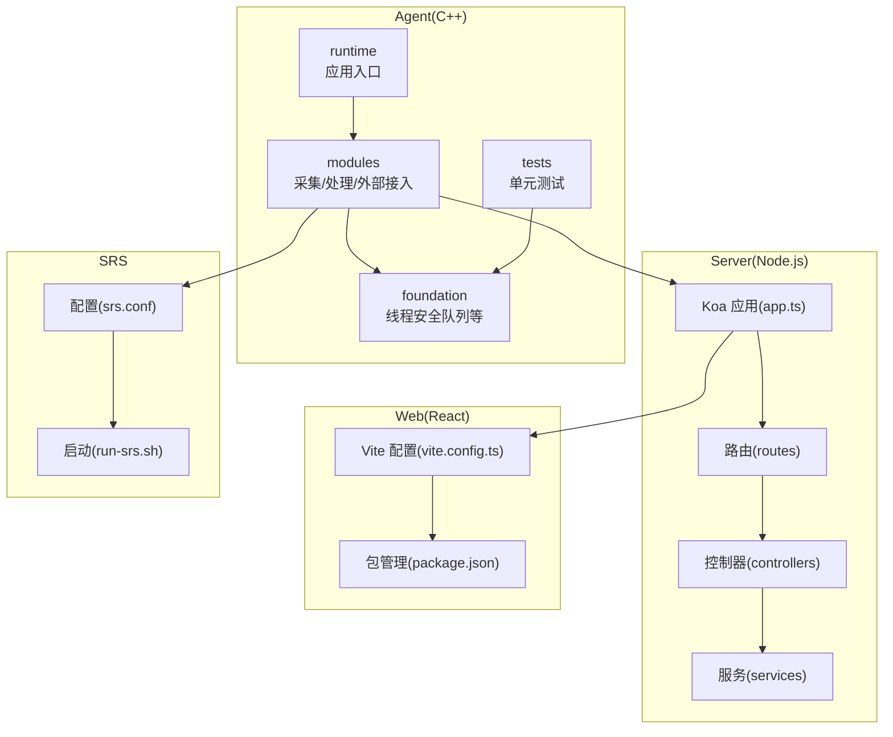
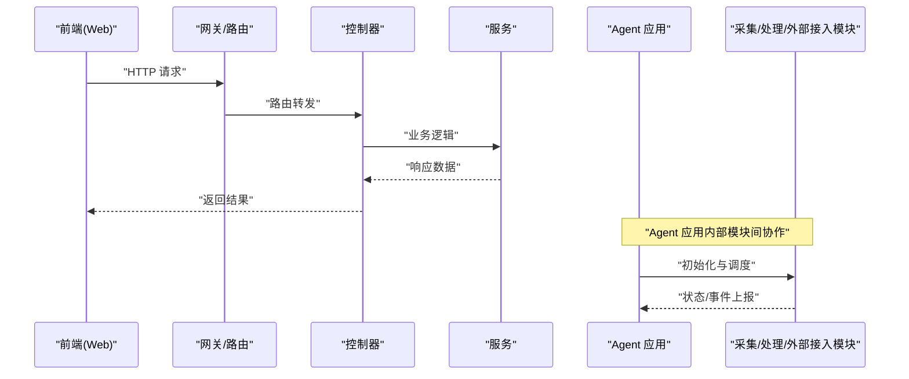
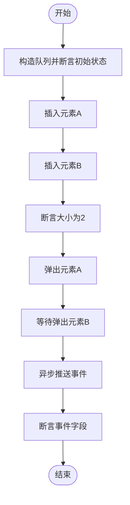
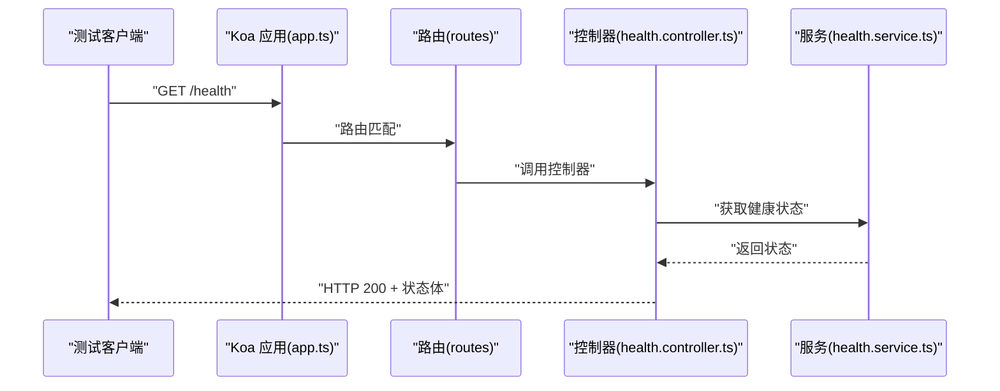
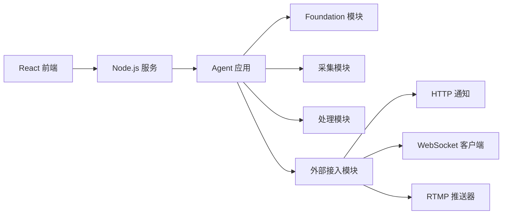

# 测试指南

<cite>
**本文引用的文件**
- [project/agent/tests/CMakeLists.txt](file://project/agent/tests/CMakeLists.txt)
- [project/agent/tests/foundation/thread_safe_queue_test.cpp](file://project/agent/tests/foundation/thread_safe_queue_test.cpp)
- [project/agent/src/foundation/include/foundation/thread_safe_queue.hpp](file://project/agent/src/foundation/include/foundation/thread_safe_queue.hpp)
- [project/agent/src/foundation/shutdown_manager.cpp](file://project/agent/src/foundation/shutdown_manager.cpp)
- [project/agent/src/modules/capture/audio/audio_capture_module.cpp](file://project/agent/src/modules/capture/audio/audio_capture_module.cpp)
- [project/agent/src/modules/capture/video/video_capture_module.cpp](file://project/agent/src/modules/capture/video/video_capture_module.cpp)
- [project/agent/src/modules/processing/encoder/encoder.cpp](file://project/agent/src/modules/processing/encoder/encoder.cpp)
- [project/agent/src/modules/processing/motion_detect/motion_detect.cpp](file://project/agent/src/modules/processing/motion_detect/motion_detect.cpp)
- [project/agent/src/modules/processing/echo_canceller/echo_canceller.cpp](file://project/agent/src/modules/processing/echo_canceller/echo_canceller.cpp)
- [project/agent/src/modules/external_access/http/http_notify.cpp](file://project/agent/src/modules/external_access/http/http_notify.cpp)
- [project/agent/src/modules/external_access/pusher/pusher_module.cpp](file://project/agent/src/modules/external_access/pusher/pusher_module.cpp)
- [project/agent/src/modules/external_access/websocket/websocket_client.cpp](file://project/agent/src/modules/external_access/websocket/websocket_client.cpp)
- [project/agent/src/runtime/app/agent_app.cpp](file://project/agent/src/runtime/app/agent_app.cpp)
- [project/server/src/app.ts](file://project/server/src/app.ts)
- [project/server/src/controllers/health.controller.ts](file://project/server/src/controllers/health.controller.ts)
- [project/server/src/routes/health.ts](file://project/server/src/routes/health.ts)
- [project/server/src/services/health.service.ts](file://project/server/src/services/health.service.ts)
- [project/server/package.json](file://project/server/package.json)
- [project/web/package.json](file://project/web/package.json)
- [project/web/vite.config.ts](file://project/web/vite.config.ts)
- [project/srs/conf/srs.conf](file://project/srs/conf/srs.conf)
- [project/srs/scripts/run-srs.sh](file://project/srs/scripts/run-srs.sh)
</cite>

## 目录
1. [简介](#简介)
2. [项目结构](#项目结构)
3. [核心组件](#核心组件)
4. [架构总览](#架构总览)
5. [详细组件分析](#详细组件分析)
6. [依赖关系分析](#依赖关系分析)
7. [性能考虑](#性能考虑)
8. [故障排查指南](#故障排查指南)
9. [结论](#结论)
10. [附录](#附录)

## 简介
本测试指南面向 Pi-Guard 系统，覆盖 C++ 基础模块、Node.js 后端服务与 React 前端的测试策略与实施方法。内容包括单元测试、集成测试与端到端测试的设计原则、测试用例编写要点、测试数据准备、测试环境搭建、性能与压力测试、回归测试以及持续集成与自动化测试配置建议。文档以仓库现有实现为基础，结合可扩展的最佳实践，帮助团队建立稳定可靠的测试体系。

## 项目结构
Pi-Guard 采用多语言分层设计：
- C++ Agent：包含基础设施（foundation）、运行时（runtime）、模块化功能（capture、processing、external_access、infra）与测试（tests）。
- Node.js Server：基于 Koa 的后端服务，提供健康检查等接口。
- React Web：前端应用，使用 Vite 构建。
- SRS：RTMP 推流服务配置与启动脚本。

**图表来源**
- [project/agent/src/runtime/app/agent_app.cpp](file://project/agent/src/runtime/app/agent_app.cpp)
- [project/agent/src/foundation/shutdown_manager.cpp](file://project/agent/src/foundation/shutdown_manager.cpp)
- [project/agent/src/modules/capture/audio/audio_capture_module.cpp](file://project/agent/src/modules/capture/audio/audio_capture_module.cpp)
- [project/agent/src/modules/capture/video/video_capture_module.cpp](file://project/agent/src/modules/capture/video/video_capture_module.cpp)
- [project/agent/src/modules/processing/encoder/encoder.cpp](file://project/agent/src/modules/processing/encoder/encoder.cpp)
- [project/agent/src/modules/processing/motion_detect/motion_detect.cpp](file://project/agent/src/modules/processing/motion_detect/motion_detect.cpp)
- [project/agent/src/modules/processing/echo_canceller/echo_canceller.cpp](file://project/agent/src/modules/processing/echo_canceller/echo_canceller.cpp)
- [project/agent/src/modules/external_access/http/http_notify.cpp](file://project/agent/src/modules/external_access/http/http_notify.cpp)
- [project/agent/src/modules/external_access/pusher/pusher_module.cpp](file://project/agent/src/modules/external_access/pusher/pusher_module.cpp)
- [project/agent/src/modules/external_access/websocket/websocket_client.cpp](file://project/agent/src/modules/external_access/websocket/websocket_client.cpp)
- [project/server/src/app.ts](file://project/server/src/app.ts)
- [project/server/src/routes/health.ts](file://project/server/src/routes/health.ts)
- [project/server/src/controllers/health.controller.ts](file://project/server/src/controllers/health.controller.ts)
- [project/server/src/services/health.service.ts](file://project/server/src/services/health.service.ts)
- [project/web/vite.config.ts](file://project/web/vite.config.ts)
- [project/web/package.json](file://project/web/package.json)
- [project/srs/conf/srs.conf](file://project/srs/conf/srs.conf)
- [project/srs/scripts/run-srs.sh](file://project/srs/scripts/run-srs.sh)

**章节来源**
- [project/agent/src/runtime/app/agent_app.cpp](file://project/agent/src/runtime/app/agent_app.cpp)
- [project/server/src/app.ts](file://project/server/src/app.ts)
- [project/web/vite.config.ts](file://project/web/vite.config.ts)

## 核心组件
- C++ 基础模块：提供线程安全队列、事件类型、关闭管理器等通用能力，是所有模块的基础。
- 模块化功能：采集（音频/视频）、处理（编码、回声消除、运动检测）、外部接入（HTTP、WebSocket、RTMP 推流）。
- 运行时：应用入口负责初始化模块并协调生命周期。
- Node.js 服务：提供健康检查等接口，作为系统可观测性与运维入口。
- React 前端：页面与交互，通过 WebSocket 或 HTTP 与后端通信。
- SRS：RTMP 推流服务，用于视频流对外发布。

**章节来源**
- [project/agent/src/foundation/shutdown_manager.cpp](file://project/agent/src/foundation/shutdown_manager.cpp)
- [project/agent/src/modules/capture/audio/audio_capture_module.cpp](file://project/agent/src/modules/capture/audio/audio_capture_module.cpp)
- [project/agent/src/modules/capture/video/video_capture_module.cpp](file://project/agent/src/modules/capture/video/video_capture_module.cpp)
- [project/agent/src/modules/processing/encoder/encoder.cpp](file://project/agent/src/modules/processing/encoder/encoder.cpp)
- [project/agent/src/modules/processing/motion_detect/motion_detect.cpp](file://project/agent/src/modules/processing/motion_detect/motion_detect.cpp)
- [project/agent/src/modules/processing/echo_canceller/echo_canceller.cpp](file://project/agent/src/modules/processing/echo_canceller/echo_canceller.cpp)
- [project/agent/src/modules/external_access/http/http_notify.cpp](file://project/agent/src/modules/external_access/http/http_notify.cpp)
- [project/agent/src/modules/external_access/pusher/pusher_module.cpp](file://project/agent/src/modules/external_access/pusher/pusher_module.cpp)
- [project/agent/src/modules/external_access/websocket/websocket_client.cpp](file://project/agent/src/modules/external_access/websocket/websocket_client.cpp)

## 架构总览
下图展示从前端到后端再到 Agent 的调用链路与数据流，便于理解测试场景与边界。

**图表来源**
- [project/server/src/app.ts](file://project/server/src/app.ts)
- [project/server/src/routes/health.ts](file://project/server/src/routes/health.ts)
- [project/server/src/controllers/health.controller.ts](file://project/server/src/controllers/health.controller.ts)
- [project/agent/src/runtime/app/agent_app.cpp](file://project/agent/src/runtime/app/agent_app.cpp)

## 详细组件分析

### C++ 基础模块测试（线程安全队列）
- 测试目标：验证线程安全队列在并发场景下的正确性，包括空队列弹出、顺序插入与弹出、等待弹出与通知机制。
- 关键断言点：
  - 初始为空且大小为 0；
  - 插入多个元素后大小正确；
  - 弹出顺序符合 FIFO；
  - 异步等待弹出能被正确唤醒并返回预期值。
- 并发模型：使用条件变量与互斥锁保证线程安全；异步任务等待弹出并在稍后推送事件进行验证。

**图表来源**
- [project/agent/tests/foundation/thread_safe_queue_test.cpp](file://project/agent/tests/foundation/thread_safe_queue_test.cpp)
- [project/agent/src/foundation/include/foundation/thread_safe_queue.hpp](file://project/agent/src/foundation/include/foundation/thread_safe_queue.hpp)

**章节来源**
- [project/agent/tests/foundation/thread_safe_queue_test.cpp](file://project/agent/tests/foundation/thread_safe_queue_test.cpp)
- [project/agent/src/foundation/include/foundation/thread_safe_queue.hpp](file://project/agent/src/foundation/include/foundation/thread_safe_queue.hpp)

### C++ 模块测试策略
- 单元测试（C++）：
  - 使用 CMake 配置测试可执行文件与注册测试用例，确保最小化依赖并通过断言验证行为。
  - 对关键模块（采集、处理、外部接入）编写独立测试，优先覆盖核心算法与边界条件。
  - 对于涉及外部资源（摄像头、麦克风、网络）的模块，建议通过桩对象或模拟接口隔离外部依赖。
- 集成测试（C++）：
  - 组合多个模块进行端到端流程验证，例如“采集 -> 编码 -> 推流”链路。
  - 使用轻量级测试数据（如合成帧/音频样本）减少对真实设备的依赖。
- 端到端测试（C++）：
  - 在受控环境中运行完整 Agent 应用，验证从启动到事件上报的全流程。
  - 结合 SRS 服务进行 RTMP 推流验证，确保外部接入链路可用。

**章节来源**
- [project/agent/tests/CMakeLists.txt](file://project/agent/tests/CMakeLists.txt)
- [project/agent/src/modules/capture/audio/audio_capture_module.cpp](file://project/agent/src/modules/capture/audio/audio_capture_module.cpp)
- [project/agent/src/modules/capture/video/video_capture_module.cpp](file://project/agent/src/modules/capture/video/video_capture_module.cpp)
- [project/agent/src/modules/processing/encoder/encoder.cpp](file://project/agent/src/modules/processing/encoder/encoder.cpp)
- [project/agent/src/modules/processing/motion_detect/motion_detect.cpp](file://project/agent/src/modules/processing/motion_detect/motion_detect.cpp)
- [project/agent/src/modules/processing/echo_canceller/echo_canceller.cpp](file://project/agent/src/modules/processing/echo_canceller/echo_canceller.cpp)
- [project/agent/src/modules/external_access/http/http_notify.cpp](file://project/agent/src/modules/external_access/http/http_notify.cpp)
- [project/agent/src/modules/external_access/pusher/pusher_module.cpp](file://project/agent/src/modules/external_access/pusher/pusher_module.cpp)
- [project/agent/src/modules/external_access/websocket/websocket_client.cpp](file://project/agent/src/modules/external_access/websocket/websocket_client.cpp)

### Node.js 服务测试
- 测试目标：验证路由、中间件、控制器与服务层的行为，确保健康检查等接口稳定可靠。
- 测试策略：
  - 单元测试：对控制器与服务函数进行纯函数测试，使用内存中的上下文对象模拟请求/响应。
  - 集成测试：启动 Koa 应用，通过 HTTP 客户端发起请求，验证路由与中间件链路。
  - 端到端测试：结合 Agent 与 SRS，验证外部接入链路（HTTP/WebSocket/RTMP）。
- 关键接口示例：健康检查控制器与服务函数。

**图表来源**
- [project/server/src/app.ts](file://project/server/src/app.ts)
- [project/server/src/routes/health.ts](file://project/server/src/routes/health.ts)
- [project/server/src/controllers/health.controller.ts](file://project/server/src/controllers/health.controller.ts)
- [project/server/src/services/health.service.ts](file://project/server/src/services/health.service.ts)

**章节来源**
- [project/server/src/app.ts](file://project/server/src/app.ts)
- [project/server/src/controllers/health.controller.ts](file://project/server/src/controllers/health.controller.ts)
- [project/server/src/routes/health.ts](file://project/server/src/routes/health.ts)
- [project/server/src/services/health.service.ts](file://project/server/src/services/health.service.ts)

### React 前端测试
- 测试目标：验证页面渲染、用户交互、路由跳转与与后端的通信逻辑。
- 测试策略：
  - 单元测试：对组件与工具函数进行纯测试，使用虚拟 DOM 渲染与事件触发。
  - 集成测试：通过浏览器或无头浏览器运行，验证页面与后端 API 的连通性。
  - 端到端测试：使用端到端框架（如 Playwright/Cypress）模拟真实用户操作。
- 构建与脚本：基于 Vite 与 TypeScript，使用包管理脚本进行开发与构建。

**章节来源**
- [project/web/package.json](file://project/web/package.json)
- [project/web/vite.config.ts](file://project/web/vite.config.ts)

### 测试数据准备与环境搭建
- C++ 测试数据：
  - 使用合成帧/音频样本进行编码与处理模块测试，避免对真实硬件的依赖。
  - 使用内存队列与模拟事件源，确保测试可重复与可控。
- Node.js 测试环境：
  - 使用内存数据库或本地嵌入式存储，避免对生产数据的影响。
  - 通过环境变量控制日志级别与调试开关，便于问题定位。
- React 测试环境：
  - 使用 Vite 的开发服务器进行快速迭代，配合端到端测试工具进行全链路验证。
- SRS 环境：
  - 使用配置文件与启动脚本快速部署 RTMP 服务，便于外部接入模块测试。

**章节来源**
- [project/srs/conf/srs.conf](file://project/srs/conf/srs.conf)
- [project/srs/scripts/run-srs.sh](file://project/srs/scripts/run-srs.sh)

## 依赖关系分析
- 组件耦合：
  - Agent 应用通过模块接口与各子模块解耦，便于单元测试与替换。
  - 外部接入模块（HTTP/WebSocket/RTMP）通过统一的事件总线与应用层解耦。
- 外部依赖：
  - Node.js 服务依赖 Koa 路由与中间件生态，前端依赖 React 生态与 Vite 构建工具。
  - SRS 提供 RTMP 推流能力，需与 Agent 的推流模块协同测试。

**图表来源**
- [project/agent/src/runtime/app/agent_app.cpp](file://project/agent/src/runtime/app/agent_app.cpp)
- [project/agent/src/modules/external_access/http/http_notify.cpp](file://project/agent/src/modules/external_access/http/http_notify.cpp)
- [project/agent/src/modules/external_access/websocket/websocket_client.cpp](file://project/agent/src/modules/external_access/websocket/websocket_client.cpp)
- [project/agent/src/modules/external_access/pusher/pusher_module.cpp](file://project/agent/src/modules/external_access/pusher/pusher_module.cpp)
- [project/server/src/app.ts](file://project/server/src/app.ts)

**章节来源**
- [project/agent/src/runtime/app/agent_app.cpp](file://project/agent/src/runtime/app/agent_app.cpp)
- [project/agent/src/modules/external_access/http/http_notify.cpp](file://project/agent/src/modules/external_access/http/http_notify.cpp)
- [project/agent/src/modules/external_access/websocket/websocket_client.cpp](file://project/agent/src/modules/external_access/websocket/websocket_client.cpp)
- [project/agent/src/modules/external_access/pusher/pusher_module.cpp](file://project/agent/src/modules/external_access/pusher/pusher_module.cpp)
- [project/server/src/app.ts](file://project/server/src/app.ts)

## 性能考虑
- C++ 模块：
  - 编码与运动检测等计算密集型模块应进行吞吐量与延迟测试，识别瓶颈并优化算法与线程池配置。
  - 使用轻量级测试数据评估不同分辨率/采样率下的性能表现。
- Node.js 服务：
  - 对高并发请求进行压力测试，验证路由、中间件与服务层的响应时间与错误率。
  - 使用连接池与缓存策略降低数据库/外部服务的访问开销。
- React 前端：
  - 对关键页面进行首屏加载与交互延迟测试，优化打包体积与懒加载策略。
- 端到端性能：
  - 结合 SRS 进行 RTMP 推流的带宽与丢帧测试，评估整体链路性能。

[本节为通用指导，无需列出具体文件来源]

## 故障排查指南
- C++ 基础模块：
  - 若线程安全队列出现死锁或竞态，检查互斥锁与条件变量的使用是否成对且作用域正确。
  - 对异常路径（空队列弹出、超时等待）进行专项测试，确保异常情况下的稳定性。
- Node.js 服务：
  - 中间件链路中若出现未捕获异常，检查错误处理器中间件是否正确安装与顺序。
  - 对健康检查接口进行冒烟测试，确保服务可用性。
- React 前端：
  - 页面白屏或路由不生效时，检查构建产物与静态资源路径配置。
  - 使用浏览器开发者工具定位网络请求失败与组件渲染异常。
- SRS 集成：
  - RTMP 推流失败时，检查配置文件参数与启动脚本输出，确认端口占用与权限问题。

**章节来源**
- [project/agent/src/foundation/include/foundation/thread_safe_queue.hpp](file://project/agent/src/foundation/include/foundation/thread_safe_queue.hpp)
- [project/server/src/app.ts](file://project/server/src/app.ts)
- [project/web/vite.config.ts](file://project/web/vite.config.ts)
- [project/srs/conf/srs.conf](file://project/srs/conf/srs.conf)
- [project/srs/scripts/run-srs.sh](file://project/srs/scripts/run-srs.sh)

## 结论
Pi-Guard 的测试体系应遵循“单元测试打地基、集成测试稳链路、端到端测试验全链”的分层策略。C++ 基础模块与 Node.js/React 层分别采用合适的测试工具与方法，结合 SRS 进行外部接入验证。通过规范的测试数据准备、环境搭建与持续集成配置，可显著提升系统的可靠性与交付质量。

[本节为总结性内容，无需列出具体文件来源]

## 附录

### 测试用例编写指南
- 断言策略：针对输入、状态与输出三类断言，覆盖正常路径与异常路径。
- 边界条件：空队列、单元素、大量并发、超时等待等。
- 可重复性：使用固定种子与固定测试数据，避免随机性导致的不稳定。

### 测试环境搭建清单
- C++：启用 CMake 测试树，编译并运行单元测试。
- Node.js：安装依赖后启动开发服务器，运行集成测试。
- React：使用 Vite 开发服务器与端到端测试工具。
- SRS：按配置文件启动 RTMP 服务，验证外部接入链路。

### 持续集成与自动化测试配置建议
- C++：在 CI 中启用 CMake 测试树，收集测试报告与覆盖率。
- Node.js：在流水线中执行类型检查、单元测试与集成测试。
- React：在流水线中执行 Lint、类型检查与端到端测试。
- SRS：在 CI 中拉起容器化的 SRS 服务，进行端到端验证。

[本节为通用指导，无需列出具体文件来源]