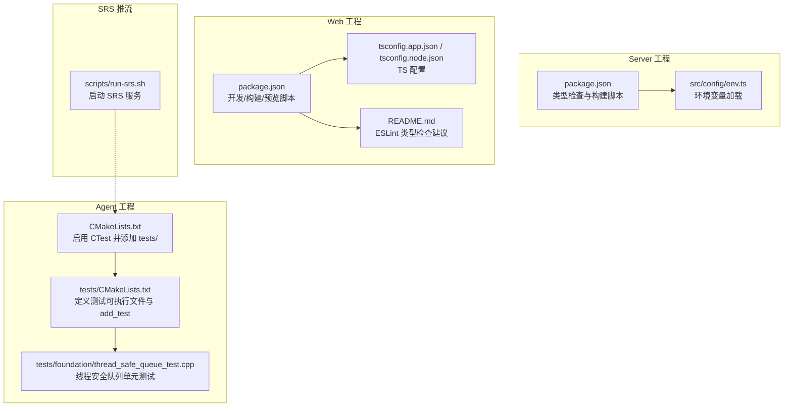
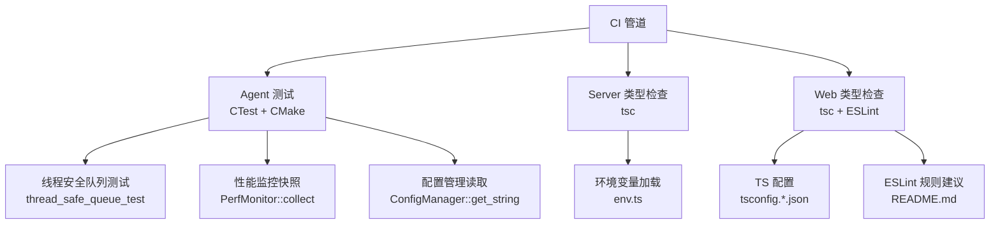
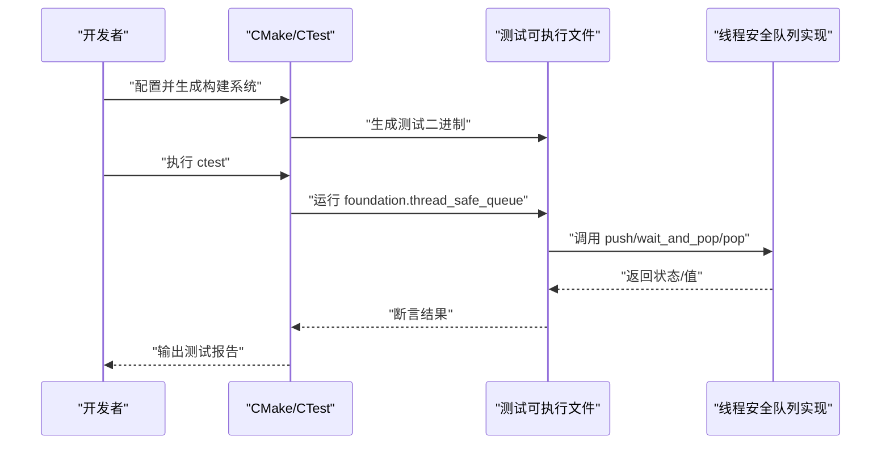
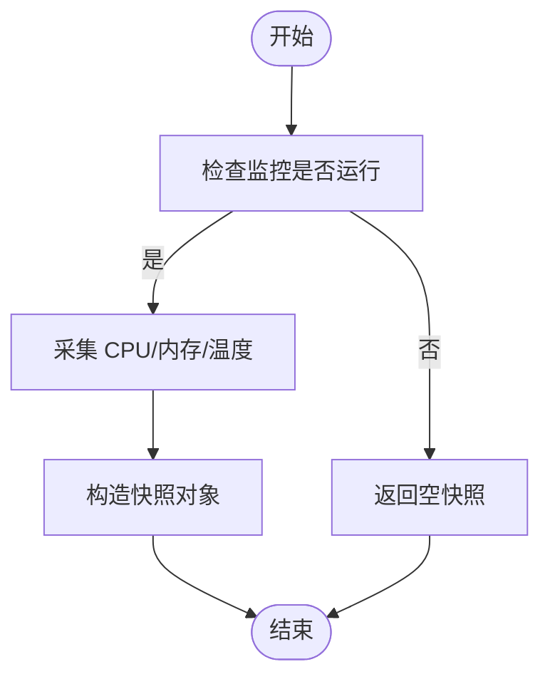
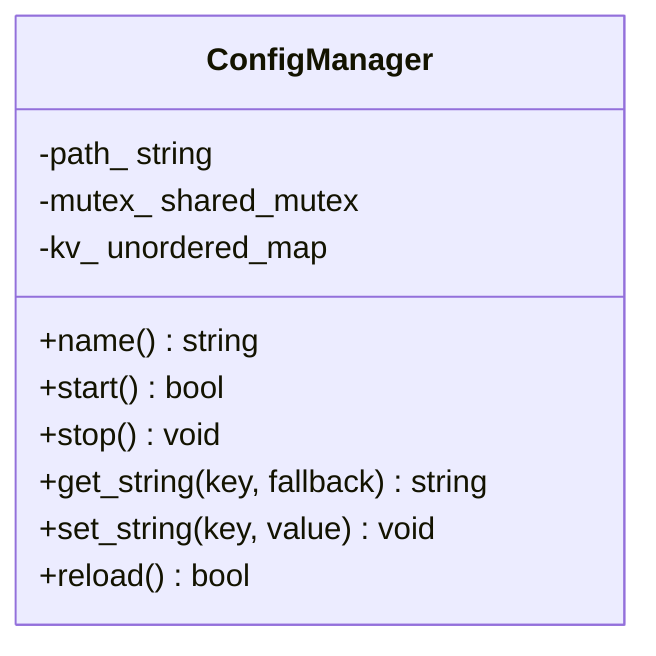
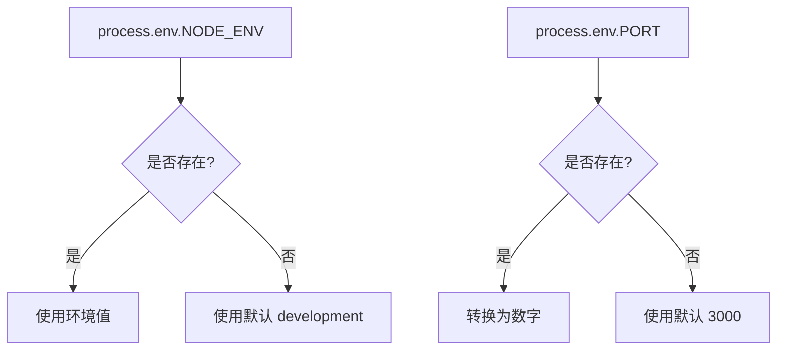
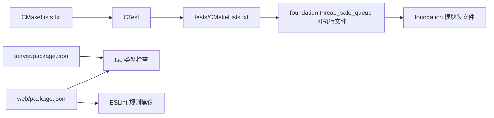

# 测试自动化

<cite>
**本文引用的文件**
- [project/agent/CMakeLists.txt](file://project/agent/CMakeLists.txt)
- [project/agent/tests/CMakeLists.txt](file://project/agent/tests/CMakeLists.txt)
- [project/agent/tests/foundation/thread_safe_queue_test.cpp](file://project/agent/tests/foundation/thread_safe_queue_test.cpp)
- [docs/agent/工程结构.md](file://docs/agent/工程结构.md)
- [docs/agent/构建.md](file://docs/agent/构建.md)
- [project/agent/src/modules/infra/config/include/infra_config/config_manager.hpp](file://project/agent/src/modules/infra/config/include/infra_config/config_manager.hpp)
- [project/agent/src/modules/infra/config/config_manager.cpp](file://project/agent/src/modules/infra/config/config_manager.cpp)
- [project/agent/src/modules/infra/perf_monitor/include/infra_monitor/perf_monitor.hpp](file://project/agent/src/modules/infra/perf_monitor/include/infra_monitor/perf_monitor.hpp)
- [project/agent/src/modules/infra/perf_monitor/perf_monitor.cpp](file://project/agent/src/modules/infra/perf_monitor/perf_monitor.cpp)
- [project/server/src/config/env.ts](file://project/server/src/config/env.ts)
- [project/server/package.json](file://project/server/package.json)
- [project/web/package.json](file://project/web/package.json)
- [project/web/tsconfig.app.json](file://project/web/tsconfig.app.json)
- [project/web/tsconfig.node.json](file://project/web/tsconfig.node.json)
- [project/web/README.md](file://project/web/README.md)
- [project/srs/scripts/run-srs.sh](file://project/srs/scripts/run-srs.sh)
</cite>

## 目录
1. [简介](#简介)
2. [项目结构](#项目结构)
3. [核心组件](#核心组件)
4. [架构总览](#架构总览)
5. [详细组件分析](#详细组件分析)
6. [依赖分析](#依赖分析)
7. [性能考虑](#性能考虑)
8. [故障排查指南](#故障排查指南)
9. [结论](#结论)
10. [附录](#附录)

## 简介
本指南面向 Pi-Guard 项目的测试自动化落地，覆盖持续集成与持续部署中的测试策略与配置要点，聚焦以下方面：
- 在 C++ Agent 工程中启用 CTest 并运行单元测试
- 在前端 Web 工程中进行类型检查与构建验证
- 在后端 Server 工程中进行类型检查与构建验证
- 测试环境变量加载与隔离
- 测试报告生成与结果分析建议
- 测试覆盖率统计、性能基准测试与安全测试的自动化思路
- 测试数据管理、测试环境隔离与测试资源优化最佳实践

## 项目结构
Pi-Guard 采用多工程并行的组织方式：
- C++ Agent 工程位于 project/agent，使用 CMake 构建，包含基础层、模块层、运行时与 CLI
- Server 工程位于 project/server，基于 Koa/TypeScript
- Web 工程位于 project/web，基于 React/Vite
- SRS 推流服务位于 project/srs，用于 RTMP 推流测试

**图表来源**
- [project/agent/CMakeLists.txt:29-32](file://project/agent/CMakeLists.txt#L29-L32)
- [project/agent/tests/CMakeLists.txt:1-10](file://project/agent/tests/CMakeLists.txt#L1-L10)
- [project/agent/tests/foundation/thread_safe_queue_test.cpp:1-40](file://project/agent/tests/foundation/thread_safe_queue_test.cpp#L1-L40)
- [project/server/package.json:6-11](file://project/server/package.json#L6-L11)
- [project/server/src/config/env.ts:6-11](file://project/server/src/config/env.ts#L6-L11)
- [project/web/package.json:6-11](file://project/web/package.json#L6-L11)
- [project/web/tsconfig.app.json:1-25](file://project/web/tsconfig.app.json#L1-L25)
- [project/web/tsconfig.node.json:1-24](file://project/web/tsconfig.node.json#L1-L24)
- [project/web/README.md:16-44](file://project/web/README.md#L16-L44)
- [project/srs/scripts/run-srs.sh](file://project/srs/scripts/run-srs.sh)

**章节来源**
- [project/agent/CMakeLists.txt:29-32](file://project/agent/CMakeLists.txt#L29-L32)
- [project/agent/tests/CMakeLists.txt:1-10](file://project/agent/tests/CMakeLists.txt#L1-L10)
- [project/agent/tests/foundation/thread_safe_queue_test.cpp:1-40](file://project/agent/tests/foundation/thread_safe_queue_test.cpp#L1-L40)
- [project/server/package.json:6-11](file://project/server/package.json#L6-L11)
- [project/server/src/config/env.ts:6-11](file://project/server/src/config/env.ts#L6-L11)
- [project/web/package.json:6-11](file://project/web/package.json#L6-L11)
- [project/web/tsconfig.app.json:1-25](file://project/web/tsconfig.app.json#L1-L25)
- [project/web/tsconfig.node.json:1-24](file://project/web/tsconfig.node.json#L1-L24)
- [project/web/README.md:16-44](file://project/web/README.md#L16-L44)
- [project/srs/scripts/run-srs.sh](file://project/srs/scripts/run-srs.sh)

## 核心组件
- C++ Agent 测试框架
  - 通过 CMake 启用 CTest，并在 tests/ 目录下定义测试可执行文件与测试用例注册
  - 当前包含一个基础模块的线程安全队列单元测试
- Server 工程测试与类型检查
  - 提供类型检查与构建脚本，可用于 CI 中的编译期校验
- Web 工程测试与类型检查
  - 提供开发/构建/预览脚本与 TS 配置，可结合 ESLint 进行静态检查
- 性能监控与配置管理
  - 性能监控模块提供 CPU/内存/温度快照接口，便于性能测试与基准
  - 配置管理模块提供键值读写与重载，便于测试环境参数注入

**章节来源**
- [project/agent/CMakeLists.txt:29-32](file://project/agent/CMakeLists.txt#L29-L32)
- [project/agent/tests/CMakeLists.txt:1-10](file://project/agent/tests/CMakeLists.txt#L1-L10)
- [project/agent/tests/foundation/thread_safe_queue_test.cpp:13-39](file://project/agent/tests/foundation/thread_safe_queue_test.cpp#L13-L39)
- [project/server/package.json:6-11](file://project/server/package.json#L6-L11)
- [project/web/package.json:6-11](file://project/web/package.json#L6-L11)
- [project/agent/src/modules/infra/perf_monitor/include/infra_monitor/perf_monitor.hpp:10-25](file://project/agent/src/modules/infra/perf_monitor/include/infra_monitor/perf_monitor.hpp#L10-L25)
- [project/agent/src/modules/infra/config/include/infra_config/config_manager.hpp:11-27](file://project/agent/src/modules/infra/config/include/infra_config/config_manager.hpp#L11-L27)

## 架构总览
下图展示测试自动化在各子工程中的位置与职责边界。

**图表来源**
- [project/agent/tests/foundation/thread_safe_queue_test.cpp:13-39](file://project/agent/tests/foundation/thread_safe_queue_test.cpp#L13-L39)
- [project/agent/src/modules/infra/perf_monitor/perf_monitor.cpp:14-23](file://project/agent/src/modules/infra/perf_monitor/perf_monitor.cpp#L14-L23)
- [project/agent/src/modules/infra/config/config_manager.cpp:25-32](file://project/agent/src/modules/infra/config/config_manager.cpp#L25-L32)
- [project/server/src/config/env.ts:6-11](file://project/server/src/config/env.ts#L6-L11)
- [project/web/tsconfig.app.json:1-25](file://project/web/tsconfig.app.json#L1-L25)
- [project/web/tsconfig.node.json:1-24](file://project/web/tsconfig.node.json#L1-L24)
- [project/web/README.md:16-44](file://project/web/README.md#L16-L44)

## 详细组件分析

### C++ Agent 单元测试流程
- 测试可执行文件定义与注册
  - 在 tests/CMakeLists.txt 中定义测试可执行文件并链接基础库
  - 使用 add_test 注册测试用例，名称为 foundation.thread_safe_queue
- 测试执行与结果
  - 构建完成后在构建目录执行 ctest，即可运行已注册的测试
- 测试覆盖范围
  - 当前测试覆盖线程安全队列的入队、出队、等待出队等行为

**图表来源**
- [project/agent/tests/CMakeLists.txt:1-10](file://project/agent/tests/CMakeLists.txt#L1-L10)
- [project/agent/tests/foundation/thread_safe_queue_test.cpp:13-39](file://project/agent/tests/foundation/thread_safe_queue_test.cpp#L13-L39)

**章节来源**
- [project/agent/CMakeLists.txt:29-32](file://project/agent/CMakeLists.txt#L29-L32)
- [project/agent/tests/CMakeLists.txt:1-10](file://project/agent/tests/CMakeLists.txt#L1-L10)
- [project/agent/tests/foundation/thread_safe_queue_test.cpp:13-39](file://project/agent/tests/foundation/thread_safe_queue_test.cpp#L13-L39)

### 性能监控与基准测试
- 性能监控模块提供 CPU/内存/温度快照，适合在 CI 中进行基准采样
- 可在测试流程中调用 collect() 获取快照，作为性能回归指标

**图表来源**
- [project/agent/src/modules/infra/perf_monitor/perf_monitor.cpp:7-23](file://project/agent/src/modules/infra/perf_monitor/perf_monitor.cpp#L7-L23)

**章节来源**
- [project/agent/src/modules/infra/perf_monitor/include/infra_monitor/perf_monitor.hpp:10-25](file://project/agent/src/modules/infra/perf_monitor/include/infra_monitor/perf_monitor.hpp#L10-L25)
- [project/agent/src/modules/infra/perf_monitor/perf_monitor.cpp:7-23](file://project/agent/src/modules/infra/perf_monitor/perf_monitor.cpp#L7-L23)

### 配置管理与测试数据注入
- 配置管理模块提供键值读取与设置，支持在测试中注入不同配置以模拟不同场景
- reload() 可用于在测试前后切换配置，便于隔离与复现

**图表来源**
- [project/agent/src/modules/infra/config/include/infra_config/config_manager.hpp:11-27](file://project/agent/src/modules/infra/config/include/infra_config/config_manager.hpp#L11-L27)

**章节来源**
- [project/agent/src/modules/infra/config/config_manager.cpp:8-39](file://project/agent/src/modules/infra/config/config_manager.cpp#L8-L39)
- [project/agent/src/modules/infra/config/include/infra_config/config_manager.hpp:11-27](file://project/agent/src/modules/infra/config/include/infra_config/config_manager.hpp#L11-L27)

### Server 环境变量加载
- 环境变量加载函数从进程环境中读取 NODE_ENV 与 PORT，并提供默认值
- CI 中可通过设置环境变量控制服务启动行为

**图表来源**
- [project/server/src/config/env.ts:6-11](file://project/server/src/config/env.ts#L6-L11)

**章节来源**
- [project/server/src/config/env.ts:6-11](file://project/server/src/config/env.ts#L6-L11)

### Web 工程类型检查与 ESLint 建议
- 提供类型检查脚本与 TS 配置，建议在 CI 中执行类型检查
- README 中给出 ESLint 类型相关配置建议，可结合 CI 进行静态检查

**章节来源**
- [project/web/package.json:6-11](file://project/web/package.json#L6-L11)
- [project/web/tsconfig.app.json:1-25](file://project/web/tsconfig.app.json#L1-L25)
- [project/web/tsconfig.node.json:1-24](file://project/web/tsconfig.node.json#L1-L24)
- [project/web/README.md:16-44](file://project/web/README.md#L16-L44)

## 依赖分析
- Agent 工程对测试框架的依赖
  - 通过 include(CTest) 与 BUILD_TESTING 控制测试子目录加入
  - tests/CMakeLists.txt 定义测试可执行文件并链接基础库
- 测试用例对被测模块的依赖
  - 线程安全队列测试依赖 foundation 模块头文件与类型
- Server/Web 工程对类型检查工具的依赖
  - Server 使用 tsc 进行类型检查
  - Web 使用 tsc 与 ESLint 进行类型与风格检查

**图表来源**
- [project/agent/CMakeLists.txt:29-32](file://project/agent/CMakeLists.txt#L29-L32)
- [project/agent/tests/CMakeLists.txt:1-10](file://project/agent/tests/CMakeLists.txt#L1-L10)
- [project/server/package.json:6-11](file://project/server/package.json#L6-L11)
- [project/web/package.json:6-11](file://project/web/package.json#L6-L11)
- [project/web/README.md:16-44](file://project/web/README.md#L16-L44)

**章节来源**
- [project/agent/CMakeLists.txt:29-32](file://project/agent/CMakeLists.txt#L29-L32)
- [project/agent/tests/CMakeLists.txt:1-10](file://project/agent/tests/CMakeLists.txt#L1-L10)
- [project/server/package.json:6-11](file://project/server/package.json#L6-L11)
- [project/web/package.json:6-11](file://project/web/package.json#L6-L11)
- [project/web/README.md:16-44](file://project/web/README.md#L16-L44)

## 性能考虑
- 测试执行时间与并发度
  - CTest 支持并行执行测试，可在 CI 中通过参数控制并行度以缩短总时长
- 性能采样频率
  - 性能监控模块的快照采集应避免过于频繁，以免引入额外开销
- 构建与测试分离
  - 将构建与测试阶段拆分，利用缓存加速重复任务

## 故障排查指南
- CTest 未发现测试
  - 确认已启用 BUILD_TESTING，且 tests/ 目录已被加入
- 测试崩溃或超时
  - 检查测试用例中的断言与异步等待逻辑
- 环境变量未生效
  - 确认 CI 中正确设置了 NODE_ENV 与 PORT
- 类型检查失败
  - 检查 TS 配置与 ESLint 规则，确保项目根目录与配置文件一致

**章节来源**
- [docs/agent/构建.md:66-86](file://docs/agent/构建.md#L66-L86)
- [project/agent/CMakeLists.txt:29-32](file://project/agent/CMakeLists.txt#L29-L32)
- [project/agent/tests/foundation/thread_safe_queue_test.cpp:13-39](file://project/agent/tests/foundation/thread_safe_queue_test.cpp#L13-L39)
- [project/server/src/config/env.ts:6-11](file://project/server/src/config/env.ts#L6-L11)
- [project/web/tsconfig.app.json:1-25](file://project/web/tsconfig.app.json#L1-L25)
- [project/web/tsconfig.node.json:1-24](file://project/web/tsconfig.node.json#L1-L24)

## 结论
通过在 C++ Agent 工程中启用 CTest 并在 CI 中执行 ctest，可稳定地运行现有单元测试；结合 Server/Web 工程的类型检查与构建脚本，形成多工程协同的测试自动化基线。在此基础上，可逐步扩展覆盖率统计、性能基准与安全测试的自动化流程，并完善测试数据管理与环境隔离策略。

## 附录
- 测试环境变量建议
  - Agent 工程：可通过配置管理模块注入测试所需键值
  - Server 工程：NODE_ENV、PORT
  - Web 工程：TS/ESLint 相关环境变量（如语言级别、严格模式）
- 测试报告与结果分析
  - CTest 默认输出可直接用于 CI 日志；如需报告格式，可在 CI 中导出 JUnit 或其他格式
- 覆盖率统计
  - 可在 C++ 工程中启用编译器覆盖率开关并在 CI 中收集覆盖率数据
- 性能基准测试
  - 利用性能监控模块的快照接口，在 CI 中定期采集并对比历史数据
- 安全测试
  - 在 Server/Web 工程中集成安全扫描工具（如 ESLint 安全规则、Node 安全审计等）
- 测试数据管理与环境隔离
  - 使用配置管理模块在测试前注入隔离配置，测试后恢复默认
  - 对外部依赖（如 SRS）在 CI 中按需启动与销毁

**章节来源**
- [project/agent/src/modules/infra/config/config_manager.cpp:16-32](file://project/agent/src/modules/infra/config/config_manager.cpp#L16-L32)
- [project/srs/scripts/run-srs.sh](file://project/srs/scripts/run-srs.sh)