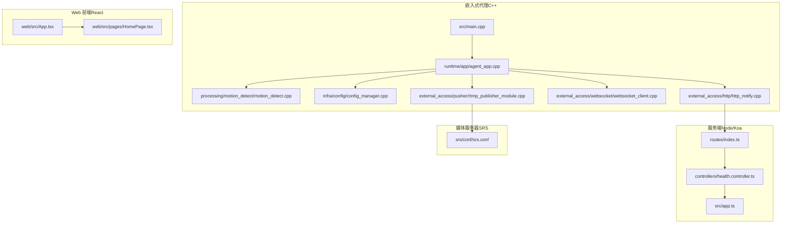
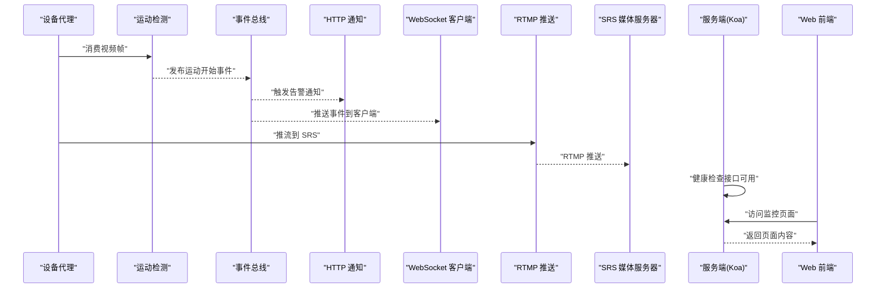
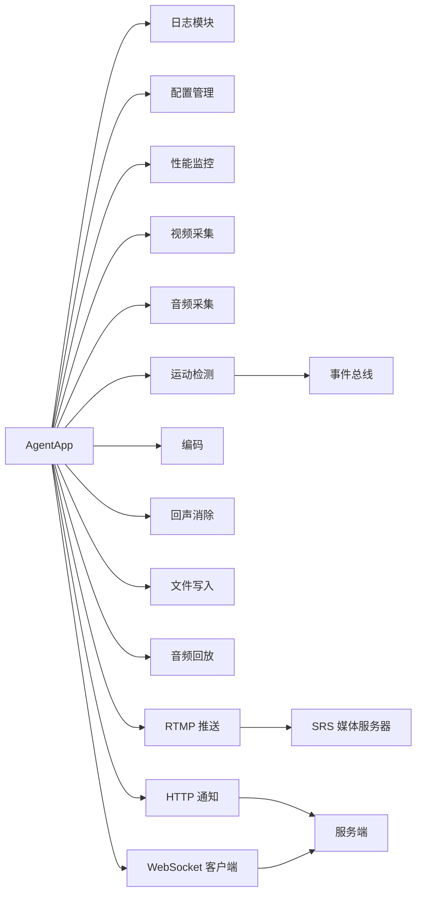

# 端到端测试

<cite>
**本文引用的文件**
- [project/agent/src/main.cpp](file://project/agent/src/main.cpp)
- [project/agent/CMakeLists.txt](file://project/agent/CMakeLists.txt)
- [project/agent/src/runtime/app/agent_app.cpp](file://project/agent/src/runtime/app/agent_app.cpp)
- [project/agent/src/modules/processing/motion_detect/motion_detect.cpp](file://project/agent/src/modules/processing/motion_detect/motion_detect.cpp)
- [project/agent/src/modules/infra/config/config_manager.cpp](file://project/agent/src/modules/infra/config/config_manager.cpp)
- [project/agent/src/modules/external_access/http/http_notify.cpp](file://project/agent/src/modules/external_access/http/http_notify.cpp)
- [project/agent/src/modules/external_access/websocket/websocket_client.cpp](file://project/agent/src/modules/external_access/websocket/websocket_client.cpp)
- [project/agent/src/modules/external_access/pusher/rtmp_publisher_module.cpp](file://project/agent/src/modules/external_access/pusher/rtmp_publisher_module.cpp)
- [project/agent/tests/foundation/thread_safe_queue_test.cpp](file://project/agent/tests/foundation/thread_safe_queue_test.cpp)
- [project/server/src/app.ts](file://project/server/src/app.ts)
- [project/server/src/controllers/health.controller.ts](file://project/server/src/controllers/health.controller.ts)
- [project/server/src/routes/index.ts](file://project/server/src/routes/index.ts)
- [project/web/src/App.tsx](file://project/web/src/App.tsx)
- [project/web/src/pages/HomePage.tsx](file://project/web/src/pages/HomePage.tsx)
- [project/srs/conf/srs.conf](file://project/srs/conf/srs.conf)
</cite>

## 目录
1. [简介](#简介)
2. [项目结构](#项目结构)
3. [核心组件](#核心组件)
4. [架构总览](#架构总览)
5. [详细组件分析](#详细组件分析)
6. [依赖关系分析](#依赖关系分析)
7. [性能与稳定性测试](#性能与稳定性测试)
8. [测试用例设计与数据管理](#测试用例设计与数据管理)
9. [测试环境配置](#测试环境配置)
10. [自动化与持续集成](#自动化与持续集成)
11. [故障排查指南](#故障排查指南)
12. [结论](#结论)

## 简介
本指南面向 Pi-Guard 系统的端到端测试，覆盖从设备安装、实时监控、语音对讲到报警通知的完整用户场景。文档提供可操作的测试流程、测试用例设计方法、测试数据管理策略、性能与稳定性测试实施方案，并给出基于现有代码结构的自动化与持续集成建议，帮助在真实或模拟环境中验证系统完整功能。

## 项目结构
Pi-Guard 由三部分组成：嵌入式代理（C++）、服务端（Node/Koa）与 Web 前端（React）。代理负责采集、处理、编码与推送；服务端提供 HTTP 接口与 WebSocket 网关；Web 前端用于展示实时监控与告警事件。

图示来源
- [project/agent/src/main.cpp:1-19](file://project/agent/src/main.cpp#L1-L19)
- [project/agent/src/runtime/app/agent_app.cpp:1-138](file://project/agent/src/runtime/app/agent_app.cpp#L1-L138)
- [project/agent/src/modules/processing/motion_detect/motion_detect.cpp:1-34](file://project/agent/src/modules/processing/motion_detect/motion_detect.cpp#L1-L34)
- [project/agent/src/modules/infra/config/config_manager.cpp:1-40](file://project/agent/src/modules/infra/config/config_manager.cpp#L1-L40)
- [project/agent/src/modules/external_access/http/http_notify.cpp:1-21](file://project/agent/src/modules/external_access/http/http_notify.cpp#L1-L21)
- [project/agent/src/modules/external_access/websocket/websocket_client.cpp:1-21](file://project/agent/src/modules/external_access/websocket/websocket_client.cpp#L1-L21)
- [project/agent/src/modules/external_access/pusher/rtmp_publisher_module.cpp:1-21](file://project/agent/src/modules/external_access/pusher/rtmp_publisher_module.cpp#L1-L21)
- [project/server/src/app.ts:1-14](file://project/server/src/app.ts#L1-L14)
- [project/server/src/controllers/health.controller.ts:1-7](file://project/server/src/controllers/health.controller.ts#L1-L7)
- [project/server/src/routes/index.ts:1-9](file://project/server/src/routes/index.ts#L1-L9)
- [project/web/src/App.tsx:1-38](file://project/web/src/App.tsx#L1-L38)
- [project/web/src/pages/HomePage.tsx:1-15](file://project/web/src/pages/HomePage.tsx#L1-L15)
- [project/srs/conf/srs.conf:1-61](file://project/srs/conf/srs.conf#L1-L61)

章节来源
- [project/agent/src/main.cpp:1-19](file://project/agent/src/main.cpp#L1-L19)
- [project/agent/CMakeLists.txt:1-51](file://project/agent/CMakeLists.txt#L1-L51)
- [project/server/src/app.ts:1-14](file://project/server/src/app.ts#L1-L14)
- [project/web/src/App.tsx:1-38](file://project/web/src/App.tsx#L1-L38)
- [project/srs/conf/srs.conf:1-61](file://project/srs/conf/srs.conf#L1-L61)

## 核心组件
- 代理应用（AgentApp）
  - 负责启动日志、配置、性能监控、音视频采集、运动检测、编码、回放、文件写入、RTMP 推流、HTTP 通知与 WebSocket 客户端等模块。
  - 提供演示运行周期内的性能统计收集。
- 运动检测（MotionDetect）
  - 从视频帧队列读取帧，生成“运动开始”事件并写入事件队列。
- 配置管理（ConfigManager）
  - 提供键值配置读取与更新能力，包含摄像头、麦克风、扬声器等设备路径示例。
- 外部接入模块
  - HTTP 通知、WebSocket 客户端、RTMP 推送模块均提供启动/停止与轮询/推送接口，便于在测试中启用或禁用。
- 服务端（Koa）
  - 提供健康检查控制器与路由注册。
- Web 前端
  - 展示实时监控卡片与告警事件列表，作为用户交互入口。

章节来源
- [project/agent/src/runtime/app/agent_app.cpp:1-138](file://project/agent/src/runtime/app/agent_app.cpp#L1-L138)
- [project/agent/src/modules/processing/motion_detect/motion_detect.cpp:1-34](file://project/agent/src/modules/processing/motion_detect/motion_detect.cpp#L1-L34)
- [project/agent/src/modules/infra/config/config_manager.cpp:1-40](file://project/agent/src/modules/infra/config/config_manager.cpp#L1-L40)
- [project/agent/src/modules/external_access/http/http_notify.cpp:1-21](file://project/agent/src/modules/external_access/http/http_notify.cpp#L1-L21)
- [project/agent/src/modules/external_access/websocket/websocket_client.cpp:1-21](file://project/agent/src/modules/external_access/websocket/websocket_client.cpp#L1-L21)
- [project/agent/src/modules/external_access/pusher/rtmp_publisher_module.cpp:1-21](file://project/agent/src/modules/external_access/pusher/rtmp_publisher_module.cpp#L1-L21)
- [project/server/src/controllers/health.controller.ts:1-7](file://project/server/src/controllers/health.controller.ts#L1-L7)
- [project/web/src/pages/HomePage.tsx:1-15](file://project/web/src/pages/HomePage.tsx#L1-L15)

## 架构总览
下图展示了端到端测试的关键交互路径：设备侧采集与处理、事件上报、服务端接口与媒体服务器、前端展示与交互。

图示来源
- [project/agent/src/runtime/app/agent_app.cpp:1-138](file://project/agent/src/runtime/app/agent_app.cpp#L1-L138)
- [project/agent/src/modules/processing/motion_detect/motion_detect.cpp:1-34](file://project/agent/src/modules/processing/motion_detect/motion_detect.cpp#L1-L34)
- [project/agent/src/modules/external_access/http/http_notify.cpp:1-21](file://project/agent/src/modules/external_access/http/http_notify.cpp#L1-L21)
- [project/agent/src/modules/external_access/websocket/websocket_client.cpp:1-21](file://project/agent/src/modules/external_access/websocket/websocket_client.cpp#L1-L21)
- [project/agent/src/modules/external_access/pusher/rtmp_publisher_module.cpp:1-21](file://project/agent/src/modules/external_access/pusher/rtmp_publisher_module.cpp#L1-L21)
- [project/srs/conf/srs.conf:1-61](file://project/srs/conf/srs.conf#L1-L61)
- [project/server/src/app.ts:1-14](file://project/server/src/app.ts#L1-L14)
- [project/web/src/App.tsx:1-38](file://project/web/src/App.tsx#L1-L38)

## 详细组件分析

### 设备安装测试
目标：验证代理进程启动、配置加载与各模块初始化成功。
- 启动流程
  - 主程序加载配置并启动代理应用。
  - 代理应用依次启动日志、配置、性能监控、音视频采集、运动检测、编码、回放、文件写入、RTMP 推送、HTTP 通知与 WebSocket 客户端。
- 关键检查点
  - 应用启动返回成功。
  - 各模块 start 返回成功。
  - 配置管理加载默认设备参数。
- 测试步骤
  - 启动代理进程，观察输出与返回码。
  - 检查配置项是否按预期加载。
  - 观察性能监控首次采样是否产生日志。

章节来源
- [project/agent/src/main.cpp:1-19](file://project/agent/src/main.cpp#L1-L19)
- [project/agent/src/runtime/app/agent_app.cpp:1-63](file://project/agent/src/runtime/app/agent_app.cpp#L1-L63)
- [project/agent/src/modules/infra/config/config_manager.cpp:1-40](file://project/agent/src/modules/infra/config/config_manager.cpp#L1-L40)

### 实时监控测试
目标：验证视频采集、编码与推流链路正常，媒体服务器可播放。
- 链路要点
  - 视频采集模块产生帧，进入运动检测模块。
  - 编码模块接收帧并编码，RTMP 推送模块将编码后数据推送到 SRS。
  - SRS 提供 HTTP-FLV 与 HLS 播放能力。
- 测试步骤
  - 启动代理与 SRS。
  - 访问 SRS 的 HTTP-FLV 或 HLS 播放地址，确认视频可播放。
  - 在前端页面查看“实时监控”区域，确认播放入口存在。
- 注意事项
  - 若代理侧未启用 RTMP 推送或 WebSocket 客户端，需在测试配置中开启对应模块。

章节来源
- [project/agent/src/runtime/app/agent_app.cpp:1-138](file://project/agent/src/runtime/app/agent_app.cpp#L1-L138)
- [project/agent/src/modules/external_access/pusher/rtmp_publisher_module.cpp:1-21](file://project/agent/src/modules/external_access/pusher/rtmp_publisher_module.cpp#L1-L21)
- [project/srs/conf/srs.conf:1-61](file://project/srs/conf/srs.conf#L1-L61)
- [project/web/src/pages/HomePage.tsx:1-15](file://project/web/src/pages/HomePage.tsx#L1-L15)

### 语音对讲测试
目标：验证音频采集、回放与编码链路，以及与 RTMP 推送的协同。
- 链路要点
  - 音频采集模块产生音频帧，经回放模块播放，同时被编码模块处理。
  - RTMP 推送模块将音频编码数据推送到 SRS。
- 测试步骤
  - 启动代理与 SRS。
  - 使用播放器拉取 RTMP/HLS 流，确认音频可播放。
  - 在前端页面确认“实时监控”卡片存在音频播放入口描述。
- 注意事项
  - 如需启用回放或编码，请在测试配置中确保相应模块处于运行状态。

章节来源
- [project/agent/src/runtime/app/agent_app.cpp:1-138](file://project/agent/src/runtime/app/agent_app.cpp#L1-L138)
- [project/agent/src/modules/external_access/pusher/rtmp_publisher_module.cpp:1-21](file://project/agent/src/modules/external_access/pusher/rtmp_publisher_module.cpp#L1-L21)
- [project/srs/conf/srs.conf:1-61](file://project/srs/conf/srs.conf#L1-L61)
- [project/web/src/pages/HomePage.tsx:1-15](file://project/web/src/pages/HomePage.tsx#L1-L15)

### 报警通知测试
目标：验证运动检测事件生成与上报（HTTP 通知、WebSocket 推送）。
- 链路要点
  - 运动检测模块从视频帧队列取出帧，生成“运动开始”事件并写入事件队列。
  - 事件通过事件总线分发，HTTP 通知与 WebSocket 客户端分别执行通知逻辑。
- 测试步骤
  - 启动代理与服务端。
  - 在前端页面查看“告警事件”列表，确认事件可见。
  - 调用服务端健康检查接口，确认服务可用。
- 注意事项
  - 若 HTTP 通知或 WebSocket 客户端未启用，需在测试配置中开启对应模块。

章节来源
- [project/agent/src/runtime/app/agent_app.cpp:1-138](file://project/agent/src/runtime/app/agent_app.cpp#L1-L138)
- [project/agent/src/modules/processing/motion_detect/motion_detect.cpp:1-34](file://project/agent/src/modules/processing/motion_detect/motion_detect.cpp#L1-L34)
- [project/agent/src/modules/external_access/http/http_notify.cpp:1-21](file://project/agent/src/modules/external_access/http/http_notify.cpp#L1-L21)
- [project/agent/src/modules/external_access/websocket/websocket_client.cpp:1-21](file://project/agent/src/modules/external_access/websocket/websocket_client.cpp#L1-L21)
- [project/server/src/controllers/health.controller.ts:1-7](file://project/server/src/controllers/health.controller.ts#L1-L7)

## 依赖关系分析
- 组件耦合
  - AgentApp 将多个模块组合为统一运行时，模块间通过线程安全队列传递数据。
  - 运动检测模块依赖视频帧输入队列，输出事件到事件队列。
  - 外部接入模块（HTTP、WebSocket、RTMP）均以独立模块形式存在，便于按需启用。
- 外部依赖
  - SRS 提供 RTMP 推流与 HLS/HTTP-FLV 播放。
  - 服务端 Koa 提供健康检查接口。
- 循环依赖
  - 当前结构采用单向数据流与事件总线，未见循环依赖迹象。

图示来源
- [project/agent/src/runtime/app/agent_app.cpp:1-138](file://project/agent/src/runtime/app/agent_app.cpp#L1-L138)
- [project/srs/conf/srs.conf:1-61](file://project/srs/conf/srs.conf#L1-L61)
- [project/server/src/app.ts:1-14](file://project/server/src/app.ts#L1-L14)

章节来源
- [project/agent/src/runtime/app/agent_app.cpp:1-138](file://project/agent/src/runtime/app/agent_app.cpp#L1-L138)

## 性能与稳定性测试
- 性能测试
  - 场景：在不同分辨率与帧率下运行代理，采集 CPU、内存、温度等指标。
  - 方法：利用代理内置的性能监控模块，在演示运行周期内定期收集并记录指标。
  - 指标：CPU 使用率、内存占用、温度。
- 压力测试
  - 场景：高并发事件与高吞吐量推流。
  - 方法：通过外部脚本驱动运动检测模块频繁产生事件，同时持续推流至 SRS。
  - 监控：SRS 连接数、丢帧率、延迟。
- 稳定性测试
  - 场景：长时间运行（如 24 小时）。
  - 方法：在无人值守环境下持续采集、编码、推流与事件上报。
  - 观察：内存泄漏迹象、模块崩溃、事件丢失。

章节来源
- [project/agent/src/runtime/app/agent_app.cpp:65-76](file://project/agent/src/runtime/app/agent_app.cpp#L65-L76)
- [project/srs/conf/srs.conf:1-61](file://project/srs/conf/srs.conf#L1-L61)

## 测试用例设计与数据管理
- 用例设计方法
  - 功能用例：覆盖设备安装、实时监控、语音对讲、报警通知四类主流程。
  - 边界用例：空配置、设备不可用、网络中断、SRS 不可用等异常场景。
  - 回归用例：每次变更后重复关键路径，确保不引入回归。
- 测试数据管理
  - 配置数据：通过配置管理模块加载与更新，测试时可注入不同设备路径与参数。
  - 事件数据：通过事件总线与队列机制，可在测试中注入/拦截事件进行验证。
  - 媒体数据：使用短时视频片段与音频样本进行推流与播放验证。
- 可观测性
  - 日志：启用详细日志级别，记录关键路径与错误信息。
  - 指标：采集性能监控数据，形成趋势报告。

章节来源
- [project/agent/src/modules/infra/config/config_manager.cpp:1-40](file://project/agent/src/modules/infra/config/config_manager.cpp#L1-L40)
- [project/agent/src/runtime/app/agent_app.cpp:1-138](file://project/agent/src/runtime/app/agent_app.cpp#L1-L138)

## 测试环境配置
- 硬件与软件要求
  - 支持摄像头与音频设备的 Linux 环境。
  - Node.js 与 npm/yarn，用于服务端与 Web 前端。
  - SRS 媒体服务器。
- 环境变量与配置
  - 代理配置：摄像头、麦克风、扬声器设备路径。
  - SRS 配置：HTTP-FLV、HLS、HTTP-API 端口与钩子回调地址。
  - 服务端路由：健康检查接口可用。
- 端口与服务
  - SRS：1935（RTMP）、8080（HTTP-FLV/HLS）、1985（HTTP-API）。
  - 服务端：默认监听端口（根据实际部署）。
  - Web 前端：开发服务器端口（Vite 默认端口）。

章节来源
- [project/agent/src/modules/infra/config/config_manager.cpp:1-40](file://project/agent/src/modules/infra/config/config_manager.cpp#L1-L40)
- [project/srs/conf/srs.conf:1-61](file://project/srs/conf/srs.conf#L1-L61)
- [project/server/src/app.ts:1-14](file://project/server/src/app.ts#L1-L14)

## 自动化与持续集成
- 单元测试
  - 使用 CTest 构建并运行单元测试，例如线程安全队列测试。
- 端到端测试
  - 建议使用脚本编排：启动 SRS、服务端、代理，再启动 Web 前端，最后执行 UI/接口测试。
  - 对关键路径（监控播放、事件上报、健康检查）编写自动化脚本。
- 回归测试
  - 在 CI 中固定运行核心用例集，确保每次提交不破坏主流程。
- 测试报告
  - 输出日志、性能指标与断言结果，便于问题定位。

章节来源
- [project/agent/CMakeLists.txt:29-32](file://project/agent/CMakeLists.txt#L29-L32)
- [project/agent/tests/foundation/thread_safe_queue_test.cpp:1-40](file://project/agent/tests/foundation/thread_safe_queue_test.cpp#L1-L40)

## 故障排查指南
- 代理无法启动
  - 检查配置文件路径与权限。
  - 查看启动日志，确认各模块 start 是否返回成功。
- 视频/音频无法播放
  - 确认摄像头与音频设备可用。
  - 检查 RTMP 推送是否启用，SRS 是否正常监听端口。
- 告警事件未显示
  - 确认运动检测模块已运行，事件队列中有事件。
  - 检查 HTTP 通知与 WebSocket 客户端是否启用。
- 服务端接口不可用
  - 访问健康检查接口，确认服务端路由注册正确。

章节来源
- [project/agent/src/main.cpp:1-19](file://project/agent/src/main.cpp#L1-L19)
- [project/agent/src/runtime/app/agent_app.cpp:1-63](file://project/agent/src/runtime/app/agent_app.cpp#L1-L63)
- [project/agent/src/modules/processing/motion_detect/motion_detect.cpp:1-34](file://project/agent/src/modules/processing/motion_detect/motion_detect.cpp#L1-L34)
- [project/agent/src/modules/external_access/http/http_notify.cpp:1-21](file://project/agent/src/modules/external_access/http/http_notify.cpp#L1-L21)
- [project/agent/src/modules/external_access/websocket/websocket_client.cpp:1-21](file://project/agent/src/modules/external_access/websocket/websocket_client.cpp#L1-L21)
- [project/server/src/controllers/health.controller.ts:1-7](file://project/server/src/controllers/health.controller.ts#L1-L7)

## 结论
通过本指南，可以在真实或模拟环境中完成 Pi-Guard 的端到端测试。建议以设备安装、实时监控、语音对讲、报警通知为主线，结合性能与稳定性测试，配合自动化与持续集成，确保系统在多场景下的可靠性与一致性。测试过程中应重点关注模块启停、事件流转与媒体链路的连通性，并建立完善的日志与指标体系以便快速定位问题。