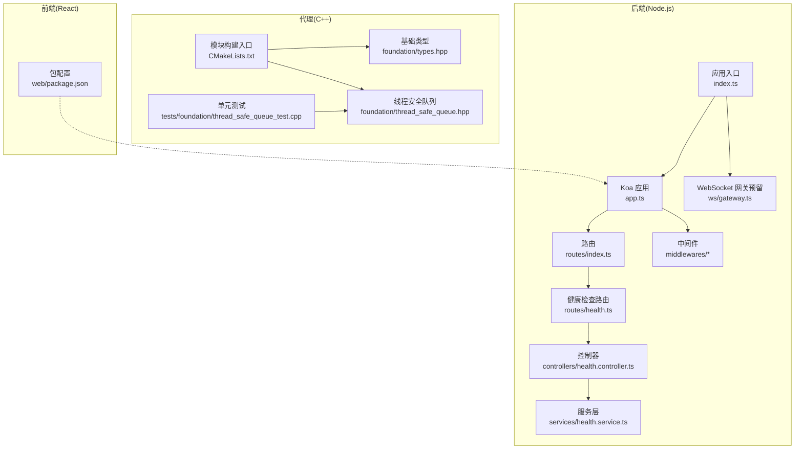
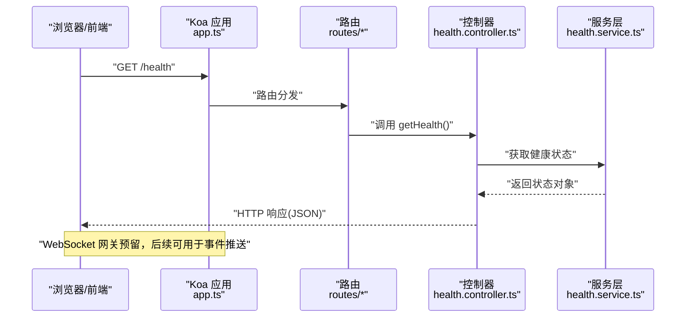
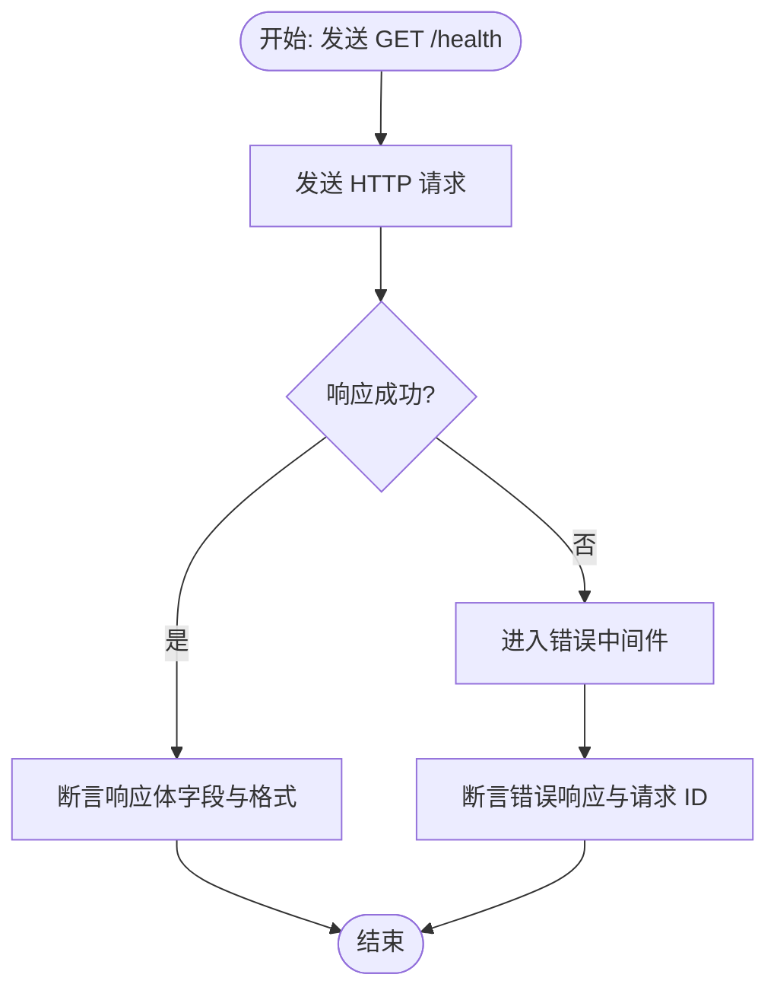
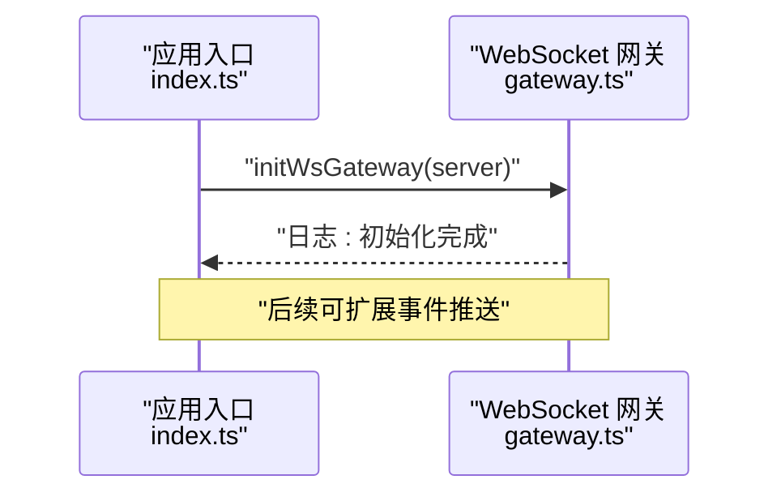
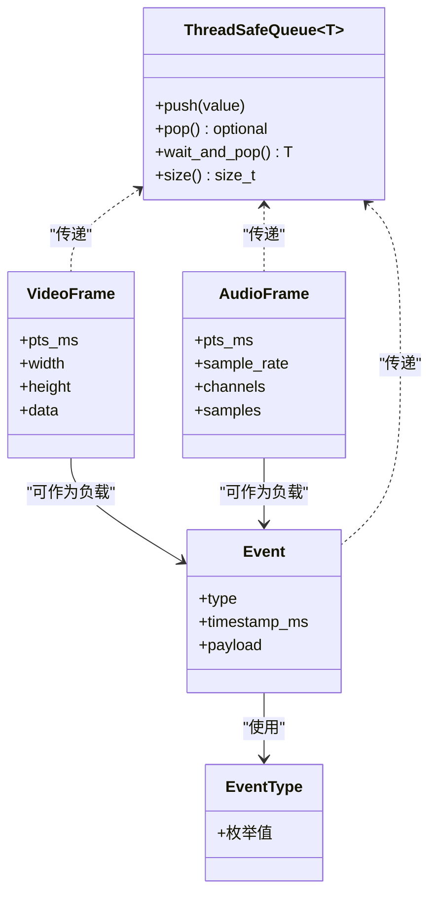
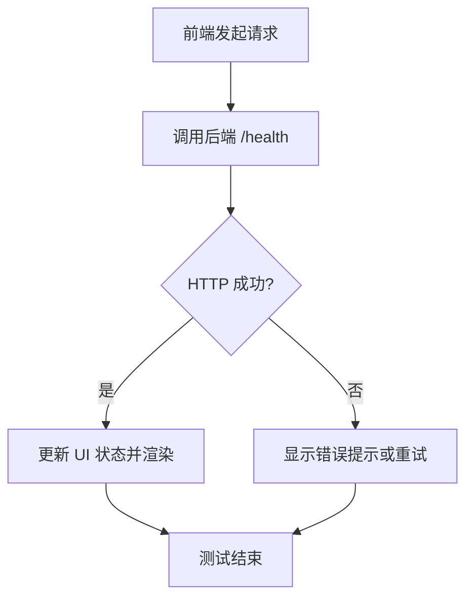
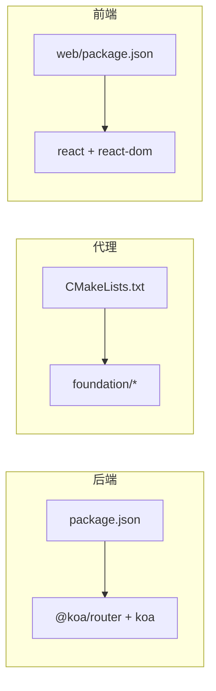

# 集成测试

<cite>
**本文引用的文件**
- [project/server/src/app.ts](file://project/server/src/app.ts)
- [project/server/src/index.ts](file://project/server/src/index.ts)
- [project/server/src/routes/index.ts](file://project/server/src/routes/index.ts)
- [project/server/src/routes/health.ts](file://project/server/src/routes/health.ts)
- [project/server/src/controllers/health.controller.ts](file://project/server/src/controllers/health.controller.ts)
- [project/server/src/services/health.service.ts](file://project/server/src/services/health.service.ts)
- [project/server/src/middlewares/error-handler.ts](file://project/server/src/middlewares/error-handler.ts)
- [project/server/src/middlewares/request-id.ts](file://project/server/src/middlewares/request-id.ts)
- [project/server/src/ws/gateway.ts](file://project/server/src/ws/gateway.ts)
- [project/server/package.json](file://project/server/package.json)
- [project/agent/CMakeLists.txt](file://project/agent/CMakeLists.txt)
- [project/agent/tests/foundation/thread_safe_queue_test.cpp](file://project/agent/tests/foundation/thread_safe_queue_test.cpp)
- [project/agent/src/foundation/include/foundation/types.hpp](file://project/agent/src/foundation/include/foundation/types.hpp)
- [project/agent/src/foundation/include/foundation/thread_safe_queue.hpp](file://project/agent/src/foundation/include/foundation/thread_safe_queue.hpp)
- [project/web/package.json](file://project/web/package.json)
</cite>

## 目录
1. [简介](#简介)
2. [项目结构](#项目结构)
3. [核心组件](#核心组件)
4. [架构总览](#架构总览)
5. [详细组件分析](#详细组件分析)
6. [依赖分析](#依赖分析)
7. [性能考虑](#性能考虑)
8. [故障排查指南](#故障排查指南)
9. [结论](#结论)
10. [附录](#附录)

## 简介
本指南面向 Pi-Guard 系统的集成测试实践，覆盖以下目标：
- C++ 代理程序与 Node.js 服务器之间的集成测试：HTTP API 集成测试、WebSocket 通信测试、事件与数据流集成。
- React 前端与后端服务的集成测试：API 调用测试、状态同步测试、UI 集成测试。
- 测试环境搭建、测试数据准备与模拟服务配置。
- 跨组件通信测试、事件传递测试与错误处理测试。

Pi-Guard 由三部分组成：C++ 代理（采集、编码、推送、HTTP/WS 外部接入）、Node.js 服务器（Koa HTTP 服务 + WebSocket 网关预留）、React 前端（Vite + React）。集成测试应围绕“请求-响应-事件-状态”闭环进行验证。

## 项目结构
- 后端服务（Node.js/Koa）
  - 应用入口负责启动 HTTP 服务器并初始化 WebSocket 网关。
  - 路由与控制器提供健康检查等接口。
  - 中间件统一注入请求 ID 并捕获异常。
- 代理（C++）
  - 模块化设计：采集、处理、输出、外部接入（HTTP/WS）。
  - 提供基础类型与线程安全队列用于事件与帧数据传递。
  - 单元测试示例展示线程安全队列行为。
- 前端（React/Vite）
  - 包含页面与路由，作为 UI 层与后端交互。

图表来源
- [project/server/src/index.ts:1-15](file://project/server/src/index.ts#L1-L15)
- [project/server/src/app.ts:1-14](file://project/server/src/app.ts#L1-L14)
- [project/server/src/routes/index.ts:1-9](file://project/server/src/routes/index.ts#L1-L9)
- [project/server/src/routes/health.ts:1-9](file://project/server/src/routes/health.ts#L1-L9)
- [project/server/src/controllers/health.controller.ts:1-7](file://project/server/src/controllers/health.controller.ts#L1-L7)
- [project/server/src/services/health.service.ts:1-14](file://project/server/src/services/health.service.ts#L1-L14)
- [project/server/src/ws/gateway.ts:1-8](file://project/server/src/ws/gateway.ts#L1-L8)
- [project/agent/CMakeLists.txt:1-51](file://project/agent/CMakeLists.txt#L1-L51)
- [project/agent/src/foundation/include/foundation/types.hpp:1-39](file://project/agent/src/foundation/include/foundation/types.hpp#L1-L39)
- [project/agent/src/foundation/include/foundation/thread_safe_queue.hpp:1-51](file://project/agent/src/foundation/include/foundation/thread_safe_queue.hpp#L1-L51)
- [project/agent/tests/foundation/thread_safe_queue_test.cpp:1-40](file://project/agent/tests/foundation/thread_safe_queue_test.cpp#L1-L40)
- [project/web/package.json:1-34](file://project/web/package.json#L1-L34)

章节来源
- [project/server/src/index.ts:1-15](file://project/server/src/index.ts#L1-L15)
- [project/server/src/app.ts:1-14](file://project/server/src/app.ts#L1-L14)
- [project/server/src/routes/index.ts:1-9](file://project/server/src/routes/index.ts#L1-L9)
- [project/server/src/routes/health.ts:1-9](file://project/server/src/routes/health.ts#L1-L9)
- [project/server/src/controllers/health.controller.ts:1-7](file://project/server/src/controllers/health.controller.ts#L1-L7)
- [project/server/src/services/health.service.ts:1-14](file://project/server/src/services/health.service.ts#L1-L14)
- [project/server/src/ws/gateway.ts:1-8](file://project/server/src/ws/gateway.ts#L1-L8)
- [project/agent/CMakeLists.txt:1-51](file://project/agent/CMakeLists.txt#L1-L51)
- [project/agent/src/foundation/include/foundation/types.hpp:1-39](file://project/agent/src/foundation/include/foundation/types.hpp#L1-L39)
- [project/agent/src/foundation/include/foundation/thread_safe_queue.hpp:1-51](file://project/agent/src/foundation/include/foundation/thread_safe_queue.hpp#L1-L51)
- [project/agent/tests/foundation/thread_safe_queue_test.cpp:1-40](file://project/agent/tests/foundation/thread_safe_queue_test.cpp#L1-L40)
- [project/web/package.json:1-34](file://project/web/package.json#L1-L34)

## 核心组件
- 后端 HTTP 服务
  - 应用入口创建 HTTP 服务器并监听端口；路由注册健康检查；中间件注入请求 ID 并统一错误处理。
- WebSocket 网关
  - 当前为预留实现，后续可扩展为事件广播与实时消息通道。
- 代理基础设施
  - 定义事件类型、视频/音频帧结构以及线程安全队列，支撑跨线程/跨模块的数据与事件传递。
- 前端
  - 使用 Vite + React，包含页面与路由，作为 UI 与后端交互的载体。

章节来源
- [project/server/src/index.ts:1-15](file://project/server/src/index.ts#L1-L15)
- [project/server/src/app.ts:1-14](file://project/server/src/app.ts#L1-L14)
- [project/server/src/middlewares/request-id.ts:1-11](file://project/server/src/middlewares/request-id.ts#L1-L11)
- [project/server/src/middlewares/error-handler.ts:1-18](file://project/server/src/middlewares/error-handler.ts#L1-L18)
- [project/server/src/ws/gateway.ts:1-8](file://project/server/src/ws/gateway.ts#L1-L8)
- [project/agent/src/foundation/include/foundation/types.hpp:1-39](file://project/agent/src/foundation/include/foundation/types.hpp#L1-L39)
- [project/agent/src/foundation/include/foundation/thread_safe_queue.hpp:1-51](file://project/agent/src/foundation/include/foundation/thread_safe_queue.hpp#L1-L51)
- [project/web/package.json:1-34](file://project/web/package.json#L1-L34)

## 架构总览
下图展示了从浏览器到后端、再到代理的典型调用链路与事件传播路径。HTTP 请求通过 Koa 路由到达控制器，控制器调用服务层返回健康状态；WebSocket 网关预留用于后续事件推送；代理内部通过事件总线与线程安全队列传递事件与媒体帧。

图表来源
- [project/server/src/app.ts:1-14](file://project/server/src/app.ts#L1-L14)
- [project/server/src/routes/index.ts:1-9](file://project/server/src/routes/index.ts#L1-L9)
- [project/server/src/routes/health.ts:1-9](file://project/server/src/routes/health.ts#L1-L9)
- [project/server/src/controllers/health.controller.ts:1-7](file://project/server/src/controllers/health.controller.ts#L1-L7)
- [project/server/src/services/health.service.ts:1-14](file://project/server/src/services/health.service.ts#L1-L14)

## 详细组件分析

### 后端 HTTP 集成测试
- 目标
  - 验证 /health 接口返回格式与状态码；验证中间件注入请求 ID 与错误处理行为。
- 方法
  - 使用 HTTP 客户端对 /health 发起请求，断言响应体字段与时间戳格式。
  - 触发后端异常路径（如路由未匹配），断言中间件返回的错误响应与请求 ID。
- 关键点
  - 健康检查控制器与服务层职责清晰，便于独立测试与替换。
  - 中间件顺序影响日志与响应体，需确保错误中间件在路由之前注册。

图表来源
- [project/server/src/routes/health.ts:1-9](file://project/server/src/routes/health.ts#L1-L9)
- [project/server/src/controllers/health.controller.ts:1-7](file://project/server/src/controllers/health.controller.ts#L1-L7)
- [project/server/src/services/health.service.ts:1-14](file://project/server/src/services/health.service.ts#L1-L14)
- [project/server/src/middlewares/request-id.ts:1-11](file://project/server/src/middlewares/request-id.ts#L1-L11)
- [project/server/src/middlewares/error-handler.ts:1-18](file://project/server/src/middlewares/error-handler.ts#L1-L18)

章节来源
- [project/server/src/routes/health.ts:1-9](file://project/server/src/routes/health.ts#L1-L9)
- [project/server/src/controllers/health.controller.ts:1-7](file://project/server/src/controllers/health.controller.ts#L1-L7)
- [project/server/src/services/health.service.ts:1-14](file://project/server/src/services/health.service.ts#L1-L14)
- [project/server/src/middlewares/request-id.ts:1-11](file://project/server/src/middlewares/request-id.ts#L1-L11)
- [project/server/src/middlewares/error-handler.ts:1-18](file://project/server/src/middlewares/error-handler.ts#L1-L18)

### WebSocket 通信测试
- 目标
  - 验证 WebSocket 网关初始化与事件推送能力（后续扩展）。
- 方法
  - 在应用启动时调用网关初始化函数，记录日志以确认执行。
  - 后续可扩展：在代理侧触发事件并通过网关向客户端推送消息，验证消息到达与解析。
- 关注点
  - 网关初始化为预留实现，需结合代理事件总线与推送模块逐步完善。

图表来源
- [project/server/src/index.ts:1-15](file://project/server/src/index.ts#L1-L15)
- [project/server/src/ws/gateway.ts:1-8](file://project/server/src/ws/gateway.ts#L1-L8)

章节来源
- [project/server/src/index.ts:1-15](file://project/server/src/index.ts#L1-L15)
- [project/server/src/ws/gateway.ts:1-8](file://project/server/src/ws/gateway.ts#L1-L8)

### 代理与后端集成测试（事件与数据流）
- 目标
  - 验证代理内部事件与帧数据的生产/消费流程，以及与后端的 HTTP/WS 集成。
- 方法
  - 利用线程安全队列测试用例思路，构造多线程场景验证事件等待与弹出行为。
  - 在代理中模拟事件产生（如运动检测），通过 HTTP/WS 模块上报，后端路由与控制器接收并返回。
- 关键数据结构
  - 事件类型、视频/音频帧结构定义了代理内部与外部传输的数据契约。
  - 线程安全队列保证多线程下的事件传递一致性。

图表来源
- [project/agent/src/foundation/include/foundation/types.hpp:1-39](file://project/agent/src/foundation/include/foundation/types.hpp#L1-L39)
- [project/agent/src/foundation/include/foundation/thread_safe_queue.hpp:1-51](file://project/agent/src/foundation/include/foundation/thread_safe_queue.hpp#L1-L51)

章节来源
- [project/agent/src/foundation/include/foundation/types.hpp:1-39](file://project/agent/src/foundation/include/foundation/types.hpp#L1-L39)
- [project/agent/src/foundation/include/foundation/thread_safe_queue.hpp:1-51](file://project/agent/src/foundation/include/foundation/thread_safe_queue.hpp#L1-L51)
- [project/agent/tests/foundation/thread_safe_queue_test.cpp:1-40](file://project/agent/tests/foundation/thread_safe_queue_test.cpp#L1-L40)

### 前端与后端集成测试策略
- 目标
  - 验证前端页面与后端 API 的连通性、状态同步与 UI 行为。
- 方法
  - 使用前端测试框架（如 Vitest + React Testing Library）发起 API 请求，断言响应与渲染结果。
  - 验证路由导航、页面加载与错误回退。
- 依赖
  - 前端包管理脚本与依赖声明位于 web 目录，可据此搭建测试环境。

图表来源
- [project/server/src/routes/health.ts:1-9](file://project/server/src/routes/health.ts#L1-L9)
- [project/server/src/controllers/health.controller.ts:1-7](file://project/server/src/controllers/health.controller.ts#L1-L7)
- [project/web/package.json:1-34](file://project/web/package.json#L1-L34)

章节来源
- [project/server/src/routes/health.ts:1-9](file://project/server/src/routes/health.ts#L1-L9)
- [project/server/src/controllers/health.controller.ts:1-7](file://project/server/src/controllers/health.controller.ts#L1-L7)
- [project/web/package.json:1-34](file://project/web/package.json#L1-L34)

## 依赖分析
- 后端依赖
  - Koa 与 @koa/router 提供 Web 服务与路由能力；开发工具链支持热重载与类型检查。
- 代理依赖
  - CMake 构建系统组织模块与测试；Foundation 模块提供通用类型与并发工具。
- 前端依赖
  - React 生态与 Vite 构建工具，支持快速开发与预览。

图表来源
- [project/server/package.json:1-28](file://project/server/package.json#L1-L28)
- [project/agent/CMakeLists.txt:1-51](file://project/agent/CMakeLists.txt#L1-L51)
- [project/web/package.json:1-34](file://project/web/package.json#L1-L34)

章节来源
- [project/server/package.json:1-28](file://project/server/package.json#L1-L28)
- [project/agent/CMakeLists.txt:1-51](file://project/agent/CMakeLists.txt#L1-L51)
- [project/web/package.json:1-34](file://project/web/package.json#L1-L34)

## 性能考虑
- HTTP 路由与控制器应保持轻量，避免阻塞；将耗时逻辑放入服务层或异步任务。
- WebSocket 网关预留实现需关注消息序列化与并发推送的吞吐与延迟。
- 代理内部事件与帧数据通过线程安全队列传递，注意队列长度与背压策略，防止内存增长。
- 前端请求应设置合理的超时与重试策略，避免 UI 卡顿。

## 故障排查指南
- 健康检查失败
  - 检查路由是否正确挂载与允许的方法；确认控制器返回值结构与服务层实现一致。
- 错误中间件未生效
  - 确认中间件注册顺序：错误中间件应在路由之前；检查请求 ID 中间件是否正常注入。
- WebSocket 未初始化
  - 确认应用入口已调用网关初始化函数，并查看日志确认执行。
- 代理事件丢失
  - 检查线程安全队列的 push/pop/wait_and_pop 行为；在多线程场景下确保互斥与条件变量使用正确。

章节来源
- [project/server/src/app.ts:1-14](file://project/server/src/app.ts#L1-L14)
- [project/server/src/middlewares/request-id.ts:1-11](file://project/server/src/middlewares/request-id.ts#L1-L11)
- [project/server/src/middlewares/error-handler.ts:1-18](file://project/server/src/middlewares/error-handler.ts#L1-L18)
- [project/server/src/ws/gateway.ts:1-8](file://project/server/src/ws/gateway.ts#L1-L8)
- [project/agent/src/foundation/include/foundation/thread_safe_queue.hpp:1-51](file://project/agent/src/foundation/include/foundation/thread_safe_queue.hpp#L1-L51)

## 结论
本指南提供了 Pi-Guard 系统在后端 HTTP、WebSocket、代理事件与前端 UI 四个维度的集成测试方法论。建议按“接口 → 事件 → 状态 → UI”的顺序逐步推进，并结合预留的 WebSocket 网关与代理基础设施持续扩展测试覆盖面。

## 附录
- 测试环境搭建建议
  - 后端：使用开发脚本启动服务，启用日志与调试模式；准备最小化配置文件。
  - 代理：启用 CTest 并运行单元测试，验证基础类型与队列行为；在 CI 中编译并运行测试二进制。
  - 前端：使用 Vite 开发服务器，结合测试框架进行端到端与组件测试。
- 测试数据与模拟
  - 使用最小化的健康状态对象与固定事件负载；在代理侧构造多线程场景验证队列行为。
- 跨组件通信与错误处理
  - 通过中间件与服务层分离关注点；在代理侧通过事件总线与线程安全队列解耦模块；在前端统一处理网络错误与 UI 反馈。