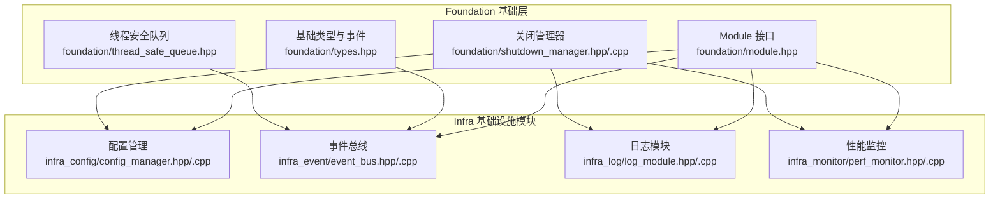
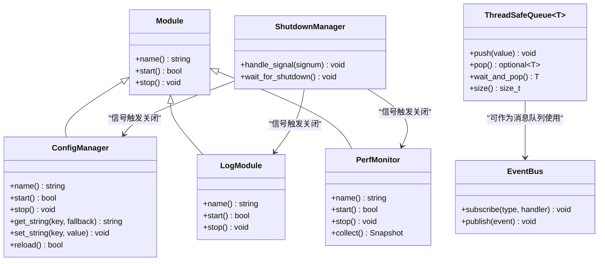
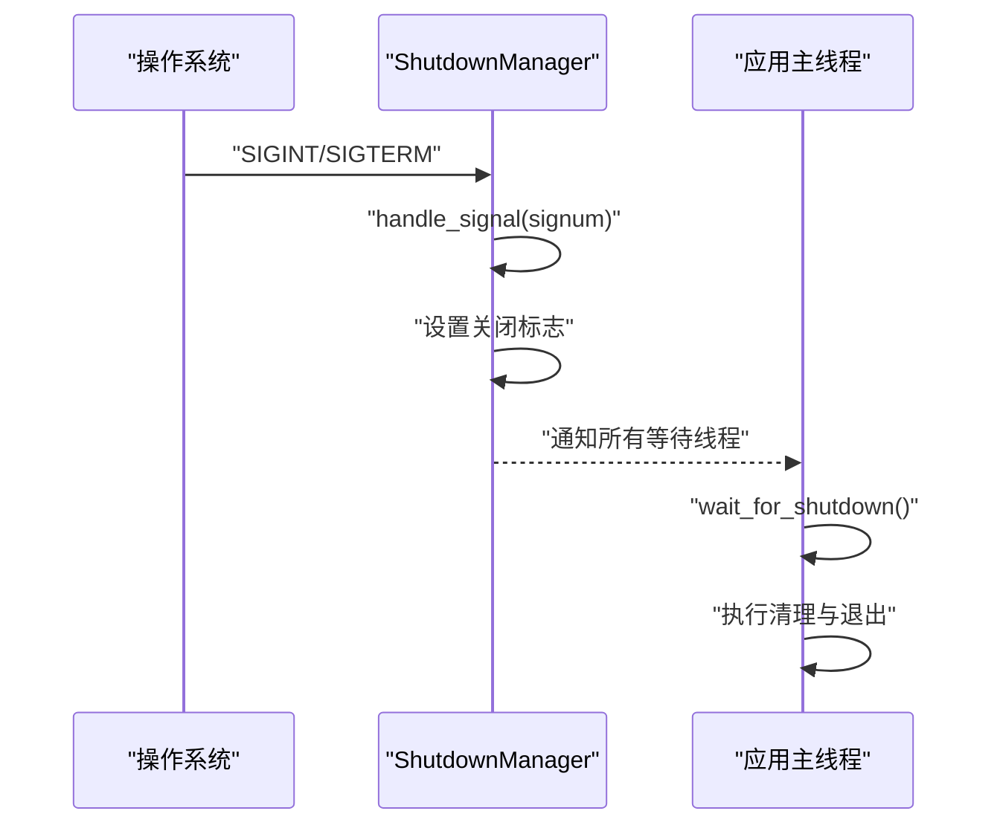
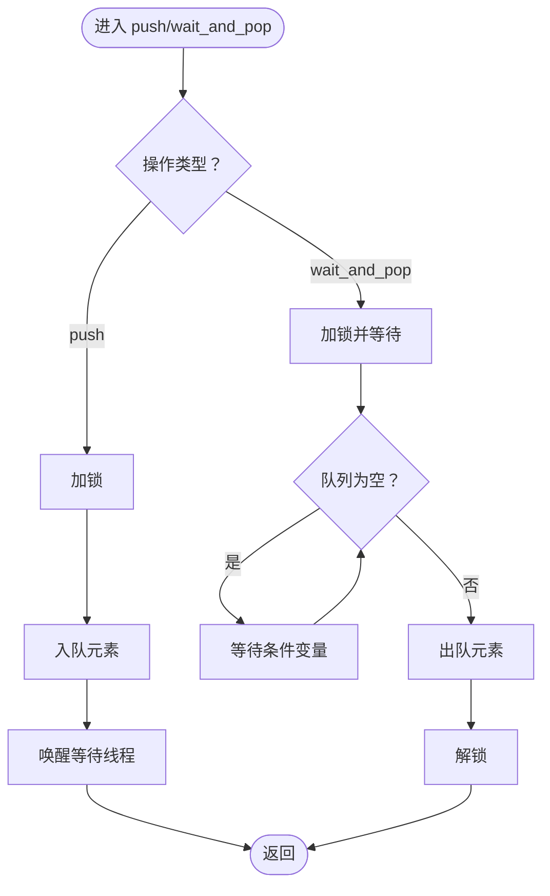
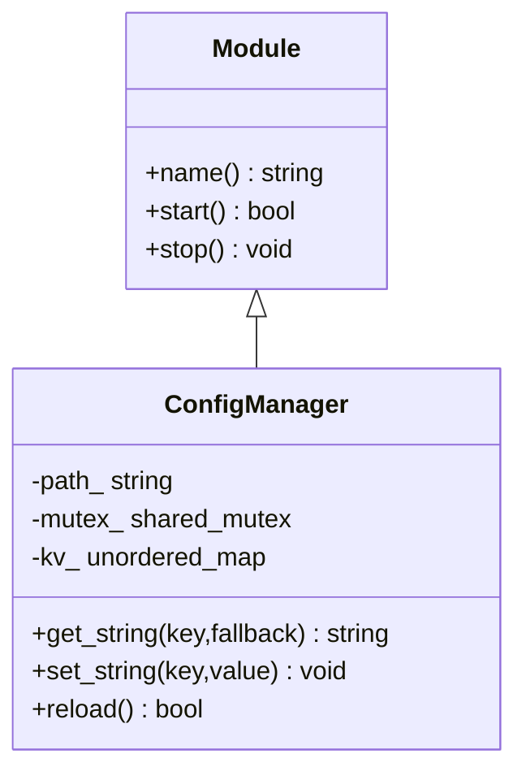
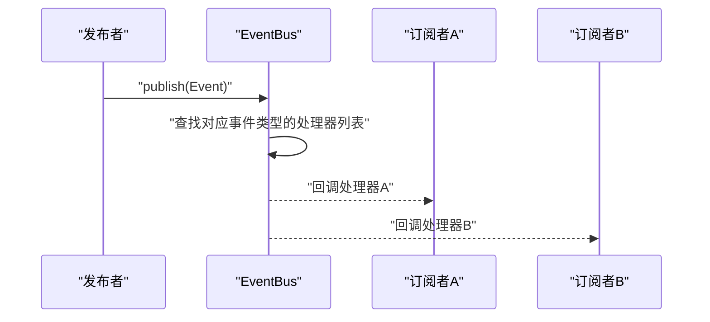
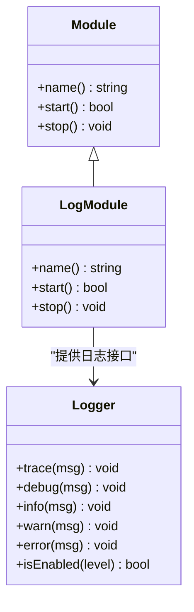
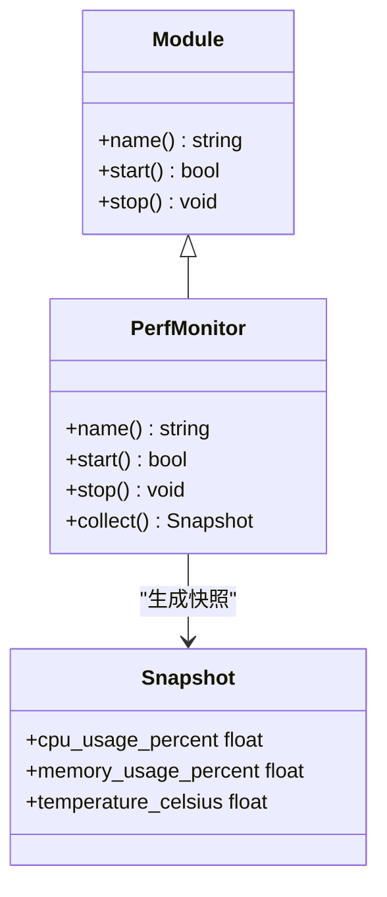
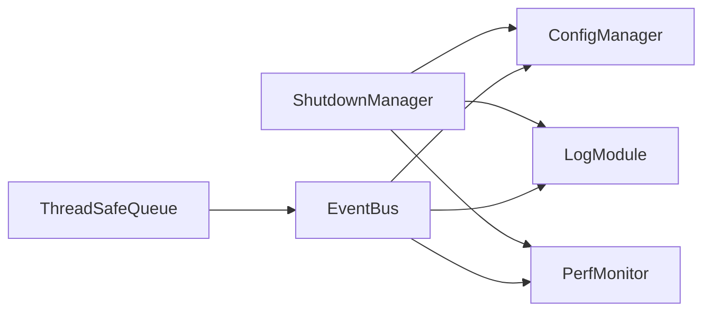

# 基础设施层设计

<cite>
**本文档引用的文件**
- [module.hpp](file://project/agent/src/foundation/include/foundation/module.hpp)
- [shutdown_manager.hpp](file://project/agent/src/foundation/include/foundation/shutdown_manager.hpp)
- [shutdown_manager.cpp](file://project/agent/src/foundation/shutdown_manager.cpp)
- [thread_safe_queue.hpp](file://project/agent/src/foundation/include/foundation/thread_safe_queue.hpp)
- [types.hpp](file://project/agent/src/foundation/include/foundation/types.hpp)
- [config_manager.hpp](file://project/agent/src/modules/infra/config/include/infra_config/config_manager.hpp)
- [config_manager.cpp](file://project/agent/src/modules/infra/config/config_manager.cpp)
- [event_bus.hpp](file://project/agent/src/modules/infra/event_bus/include/infra_event/event_bus.hpp)
- [event_bus.cpp](file://project/agent/src/modules/infra/event_bus/event_bus.cpp)
- [log_module.hpp](file://project/agent/src/modules/infra/log/include/infra_log/log_module.hpp)
- [log_module.cpp](file://project/agent/src/modules/infra/log/log_module.cpp)
- [logger.hpp](file://project/agent/src/modules/infra/log/include/infra_log/logger.hpp)
- [perf_monitor.hpp](file://project/agent/src/modules/infra/perf_monitor/include/infra_monitor/perf_monitor.hpp)
- [perf_monitor.cpp](file://project/agent/src/modules/infra/perf_monitor/perf_monitor.cpp)
- [main.cpp](file://project/agent/src/main.cpp)
</cite>

## 目录
1. [引言](#引言)
2. [项目结构](#项目结构)
3. [核心组件](#核心组件)
4. [架构概览](#架构概览)
5. [详细组件分析](#详细组件分析)
6. [依赖分析](#依赖分析)
7. [性能考虑](#性能考虑)
8. [故障排除指南](#故障排除指南)
9. [结论](#结论)
10. [附录](#附录)

## 引言
本设计文档聚焦 Pi-Guard 系统的基础设施层（Foundation 层），系统性阐述其在整体架构中的定位与价值：作为上层业务模块（采集、处理、输出、外部接入）的通用支撑能力，提供统一的生命周期管理、线程安全通信、事件分发、配置读取、日志记录与性能监控等基础服务。通过模块化接口抽象与可插拔的基础设施模块，确保系统具备良好的扩展性与可维护性。

## 项目结构
基础设施层位于 Agent 端代码树的 foundation 与 modules/infra 下，采用“基础接口 + 具体实现”的分层组织方式：
- foundation 层：定义通用接口与数据类型（Module 抽象、事件与帧数据结构、线程安全队列等）
- modules/infra 层：实现具体基础设施模块（配置管理、事件总线、日志、性能监控）

图表来源
- [module.hpp:1-17](file://project/agent/src/foundation/include/foundation/module.hpp#L1-L17)
- [types.hpp:1-39](file://project/agent/src/foundation/include/foundation/types.hpp#L1-L39)
- [thread_safe_queue.hpp:1-51](file://project/agent/src/foundation/include/foundation/thread_safe_queue.hpp#L1-L51)
- [shutdown_manager.hpp:1-12](file://project/agent/src/foundation/include/foundation/shutdown_manager.hpp#L1-L12)
- [shutdown_manager.cpp:1-36](file://project/agent/src/foundation/shutdown_manager.cpp#L1-L36)
- [config_manager.hpp:1-30](file://project/agent/src/modules/infra/config/include/infra_config/config_manager.hpp#L1-L30)
- [config_manager.cpp:1-40](file://project/agent/src/modules/infra/config/config_manager.cpp#L1-L40)
- [event_bus.hpp:1-25](file://project/agent/src/modules/infra/event_bus/include/infra_event/event_bus.hpp#L1-L25)
- [event_bus.cpp:1-25](file://project/agent/src/modules/infra/event_bus/event_bus.cpp#L1-L25)
- [log_module.hpp:1-17](file://project/agent/src/modules/infra/log/include/infra_log/log_module.hpp#L1-L17)
- [log_module.cpp:1-30](file://project/agent/src/modules/infra/log/log_module.cpp#L1-L30)
- [perf_monitor.hpp:1-28](file://project/agent/src/modules/infra/perf_monitor/include/infra_monitor/perf_monitor.hpp#L1-L28)
- [perf_monitor.cpp:1-26](file://project/agent/src/modules/infra/perf_monitor/perf_monitor.cpp#L1-L26)

章节来源
- [main.cpp:1-19](file://project/agent/src/main.cpp#L1-L19)

## 核心组件
- 模块接口抽象（Module）：定义统一的模块生命周期（name/start/stop），为所有基础设施模块提供一致的启动与停止契约，便于集中管理与扩展。
- 关闭管理器（ShutdownManager）：提供信号处理与等待机制，支持优雅关闭，避免资源泄漏与数据不一致。
- 线程安全队列（ThreadSafeQueue）：基于互斥锁与条件变量的无界队列，支持生产者-消费者模式，保障多线程环境下的数据一致性。
- 基础类型与事件（types.hpp）：定义事件枚举、视频/音频帧结构与通用事件载体，为事件总线与上层模块提供统一的数据模型。

章节来源
- [module.hpp:1-17](file://project/agent/src/foundation/include/foundation/module.hpp#L1-L17)
- [shutdown_manager.hpp:1-12](file://project/agent/src/foundation/include/foundation/shutdown_manager.hpp#L1-L12)
- [shutdown_manager.cpp:1-36](file://project/agent/src/foundation/shutdown_manager.cpp#L1-L36)
- [thread_safe_queue.hpp:1-51](file://project/agent/src/foundation/include/foundation/thread_safe_queue.hpp#L1-L51)
- [types.hpp:1-39](file://project/agent/src/foundation/include/foundation/types.hpp#L1-L39)

## 架构概览
基础设施层通过模块化接口与共享数据结构，向上层提供解耦合的通用能力。下图展示了模块间关系与交互路径：

图表来源
- [module.hpp:1-17](file://project/agent/src/foundation/include/foundation/module.hpp#L1-L17)
- [shutdown_manager.hpp:1-12](file://project/agent/src/foundation/include/foundation/shutdown_manager.hpp#L1-L12)
- [shutdown_manager.cpp:1-36](file://project/agent/src/foundation/shutdown_manager.cpp#L1-L36)
- [thread_safe_queue.hpp:1-51](file://project/agent/src/foundation/include/foundation/thread_safe_queue.hpp#L1-L51)
- [config_manager.hpp:1-30](file://project/agent/src/modules/infra/config/include/infra_config/config_manager.hpp#L1-L30)
- [event_bus.hpp:1-25](file://project/agent/src/modules/infra/event_bus/include/infra_event/event_bus.hpp#L1-L25)
- [log_module.hpp:1-17](file://project/agent/src/modules/infra/log/include/infra_log/log_module.hpp#L1-L17)
- [perf_monitor.hpp:1-28](file://project/agent/src/modules/infra/perf_monitor/include/infra_monitor/perf_monitor.hpp#L1-L28)

## 详细组件分析

### 模块接口抽象（Module）
- 设计要点
  - 统一的生命周期接口，确保模块可被集中管理与替换。
  - 虚析构函数保证多态删除的安全性。
- 与上层协作
  - 上层模块（采集、处理、输出、外部接入）均以 Module 形式注册与运行，便于统一调度与监控。
- 扩展性
  - 新增基础设施模块只需继承 Module 并实现三要素，即可无缝接入现有框架。

章节来源
- [module.hpp:1-17](file://project/agent/src/foundation/include/foundation/module.hpp#L1-L17)

### 关闭管理器（ShutdownManager）
- 设计要点
  - 静态方法封装信号处理与等待逻辑，内部使用原子变量与条件变量实现线程安全的全局状态同步。
  - 支持 SIGINT/SIGTERM 信号触发优雅关闭。
- 运行时流程
  - 注册信号处理器；收到信号后设置关闭标志并通知等待线程；等待线程在条件满足后继续执行收尾逻辑。

图表来源
- [shutdown_manager.cpp:1-36](file://project/agent/src/foundation/shutdown_manager.cpp#L1-L36)

章节来源
- [shutdown_manager.hpp:1-12](file://project/agent/src/foundation/include/foundation/shutdown_manager.hpp#L1-L12)
- [shutdown_manager.cpp:1-36](file://project/agent/src/foundation/shutdown_manager.cpp#L1-L36)

### 线程安全队列（ThreadSafeQueue）
- 设计要点
  - 使用互斥锁保护队列访问，条件变量实现阻塞式弹出。
  - 提供非阻塞 push/pop 与阻塞 wait_and_pop，满足不同场景需求。
- 复杂度
  - push/pop/size 均为 O(1)，内存按需增长。
- 典型用法
  - 生产者-消费者模式，配合事件总线或数据流水线，降低模块间耦合。

图表来源
- [thread_safe_queue.hpp:1-51](file://project/agent/src/foundation/include/foundation/thread_safe_queue.hpp#L1-L51)

章节来源
- [thread_safe_queue.hpp:1-51](file://project/agent/src/foundation/include/foundation/thread_safe_queue.hpp#L1-L51)

### 配置管理（ConfigManager）
- 设计要点
  - 继承 Module，提供字符串键值对的读写与重载能力。
  - 使用共享互斥锁实现读多写少的并发访问优化。
- 功能特性
  - 启动即加载默认配置；支持运行时更新；提供回退值保障健壮性。
- 与上层协作
  - 为采集、编码、推送等模块提供统一的参数来源，避免硬编码与分散配置。

图表来源
- [config_manager.hpp:1-30](file://project/agent/src/modules/infra/config/include/infra_config/config_manager.hpp#L1-L30)
- [config_manager.cpp:1-40](file://project/agent/src/modules/infra/config/config_manager.cpp#L1-L40)

章节来源
- [config_manager.hpp:1-30](file://project/agent/src/modules/infra/config/include/infra_config/config_manager.hpp#L1-L30)
- [config_manager.cpp:1-40](file://project/agent/src/modules/infra/config/config_manager.cpp#L1-L40)

### 事件总线（EventBus）
- 设计要点
  - 基于事件类型映射到处理器列表，支持多路订阅。
  - 发布时使用共享锁，订阅时使用独占锁，兼顾并发读写。
- 数据模型
  - 事件包含类型、时间戳与负载，配合基础类型定义，统一事件语义。

图表来源
- [event_bus.hpp:1-25](file://project/agent/src/modules/infra/event_bus/include/infra_event/event_bus.hpp#L1-L25)
- [event_bus.cpp:1-25](file://project/agent/src/modules/infra/event_bus/event_bus.cpp#L1-L25)
- [types.hpp:1-39](file://project/agent/src/foundation/include/foundation/types.hpp#L1-L39)

章节来源
- [event_bus.hpp:1-25](file://project/agent/src/modules/infra/event_bus/include/infra_event/event_bus.hpp#L1-L25)
- [event_bus.cpp:1-25](file://project/agent/src/modules/infra/event_bus/event_bus.cpp#L1-L25)
- [types.hpp:1-39](file://project/agent/src/foundation/include/foundation/types.hpp#L1-L39)

### 日志模块（LogModule）
- 设计要点
  - 继承 Module，负责日志后端初始化与销毁，使用一次性初始化确保线程安全。
  - 通过工厂或具体 Logger 实现（如 spdlog 封装）提供统一日志接口。
- 生命周期
  - start 初始化后端；stop 在守护者析构时自动关闭，避免资源泄漏。

图表来源
- [log_module.hpp:1-17](file://project/agent/src/modules/infra/log/include/infra_log/log_module.hpp#L1-L17)
- [log_module.cpp:1-30](file://project/agent/src/modules/infra/log/log_module.cpp#L1-L30)
- [logger.hpp:1-25](file://project/agent/src/modules/infra/log/include/infra_log/logger.hpp#L1-L25)

章节来源
- [log_module.hpp:1-17](file://project/agent/src/modules/infra/log/include/infra_log/log_module.hpp#L1-L17)
- [log_module.cpp:1-30](file://project/agent/src/modules/infra/log/log_module.cpp#L1-L30)
- [logger.hpp:1-25](file://project/agent/src/modules/infra/log/include/infra_log/logger.hpp#L1-L25)

### 性能监控（PerfMonitor）
- 设计要点
  - 继承 Module，提供快照采集能力；内部使用原子布尔量控制采样开关。
  - 返回 CPU、内存占用与温度等指标，便于上层进行资源治理与告警。
- 与上层协作
  - 可与事件总线联动，将异常指标转换为事件，驱动自愈或降级策略。

图表来源
- [perf_monitor.hpp:1-28](file://project/agent/src/modules/infra/perf_monitor/include/infra_monitor/perf_monitor.hpp#L1-L28)
- [perf_monitor.cpp:1-26](file://project/agent/src/modules/infra/perf_monitor/perf_monitor.cpp#L1-L26)

章节来源
- [perf_monitor.hpp:1-28](file://project/agent/src/modules/infra/perf_monitor/include/infra_monitor/perf_monitor.hpp#L1-L28)
- [perf_monitor.cpp:1-26](file://project/agent/src/modules/infra/perf_monitor/perf_monitor.cpp#L1-L26)

## 依赖分析
- 内聚性
  - Foundation 层提供稳定接口，Infra 模块围绕这些接口实现具体能力，内聚度高。
- 耦合性
  - Infra 模块均依赖 Module 接口，彼此独立，通过事件总线与共享数据结构间接耦合。
- 生命周期
  - ShutdownManager 作为全局协调点，贯穿各模块的启动与停止序列。

图表来源
- [shutdown_manager.hpp:1-12](file://project/agent/src/foundation/include/foundation/shutdown_manager.hpp#L1-L12)
- [config_manager.hpp:1-30](file://project/agent/src/modules/infra/config/include/infra_config/config_manager.hpp#L1-L30)
- [log_module.hpp:1-17](file://project/agent/src/modules/infra/log/include/infra_log/log_module.hpp#L1-L17)
- [perf_monitor.hpp:1-28](file://project/agent/src/modules/infra/perf_monitor/include/infra_monitor/perf_monitor.hpp#L1-L28)
- [event_bus.hpp:1-25](file://project/agent/src/modules/infra/event_bus/include/infra_event/event_bus.hpp#L1-L25)
- [thread_safe_queue.hpp:1-51](file://project/agent/src/foundation/include/foundation/thread_safe_queue.hpp#L1-L51)

## 性能考虑
- 线程安全队列
  - 采用细粒度锁与条件变量，避免忙轮询；在高并发场景建议结合批量弹出与背压策略。
- 事件总线
  - 订阅者列表遍历为 O(N)，建议限制单事件订阅数量或引入分区/优先级队列。
- 配置管理
  - 读多写少场景使用共享锁提升吞吐；写操作应尽量批量化，减少锁持有时间。
- 日志模块
  - 异步日志与缓冲区大小可根据吞吐调优；避免在热路径中进行昂贵格式化。
- 性能监控
  - 采样周期与指标聚合窗口需权衡精度与开销；异常指标应及时降采样或禁用。

## 故障排除指南
- 模块无法启动
  - 检查 Module::start 返回值与依赖项可用性（如配置文件路径、日志后端初始化）。
- 优雅关闭无效
  - 确认信号是否正确注册；检查 ShutdownManager::wait_for_shutdown 是否被阻塞。
- 事件未到达订阅者
  - 核对事件类型匹配与处理器注册顺序；确认 EventBus::publish 的调用时机。
- 线程安全问题
  - 避免在锁外持有外部资源；确保 push/pop/wait_and_pop 的正确使用。
- 性能异常
  - 使用 PerfMonitor 快照定位瓶颈；结合日志分析热点路径。

## 结论
Foundation 基础层通过模块化接口与通用数据结构，为上层业务提供了稳定、可扩展且易于维护的基础设施。借助 ShutdownManager 的统一生命周期管理、ThreadSafeQueue 的并发通信能力以及事件总线的解耦合分发，系统在复杂场景下仍能保持清晰的职责边界与高效的协作效率。Infra 模块在此基础上进一步提供配置、日志与性能监控等通用能力，形成完整的支撑体系。

## 附录
- 使用示例与最佳实践
  - 模块注册与启动
    - 所有基础设施模块均应实现 Module 接口，并在应用启动阶段统一注册与启动。
  - 事件驱动
    - 使用 EventBus 进行跨模块通信；为高频事件设置合理的订阅策略与限流。
  - 线程安全
    - 在多线程环境中优先使用 ThreadSafeQueue；避免在锁内执行耗时操作。
  - 配置管理
    - 将配置集中管理并通过 ConfigManager 提供只读视图；运行时变更需幂等与回滚。
  - 日志与监控
    - 使用 LogModule 提供统一日志入口；定期收集 PerfMonitor 快照用于健康评估。
  - 优雅关闭
    - 在主程序中注册 ShutdownManager 信号处理；确保所有模块在 wait_for_shutdown 后完成清理。