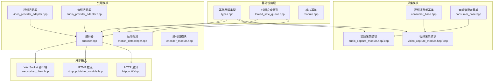
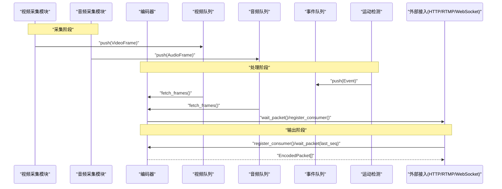
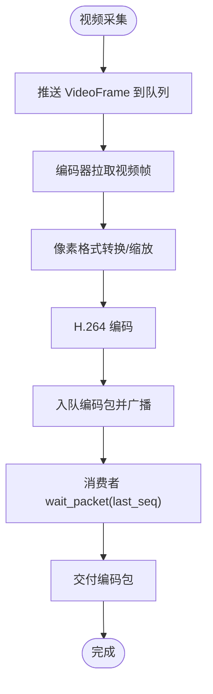
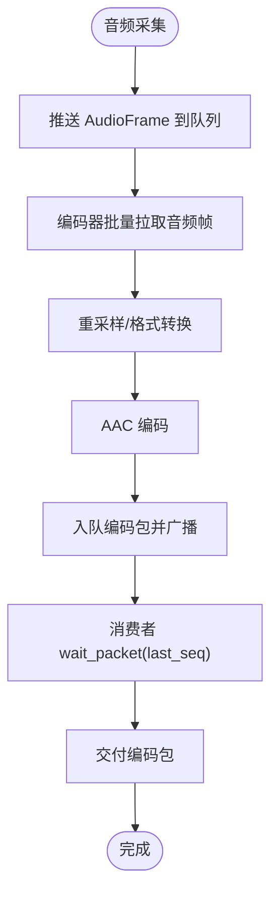
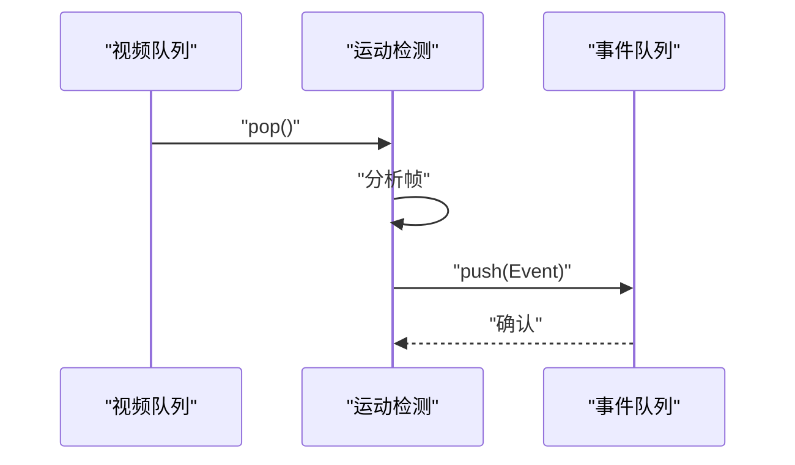
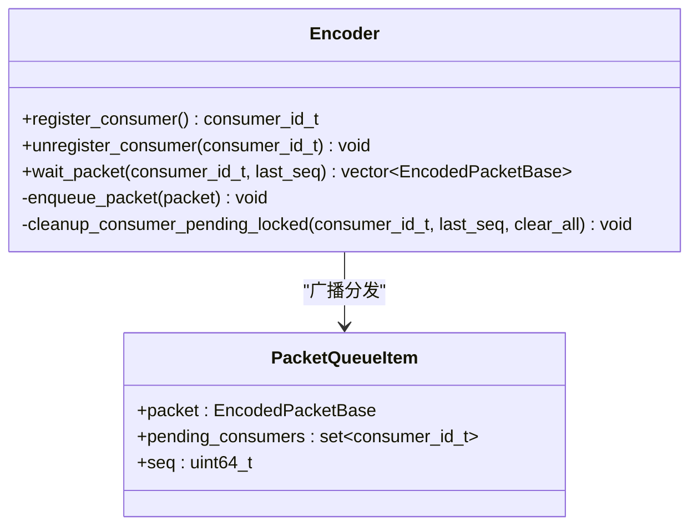
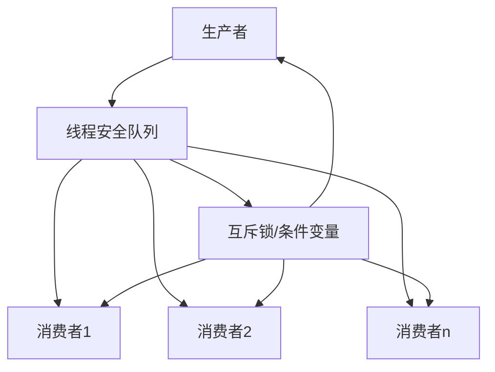
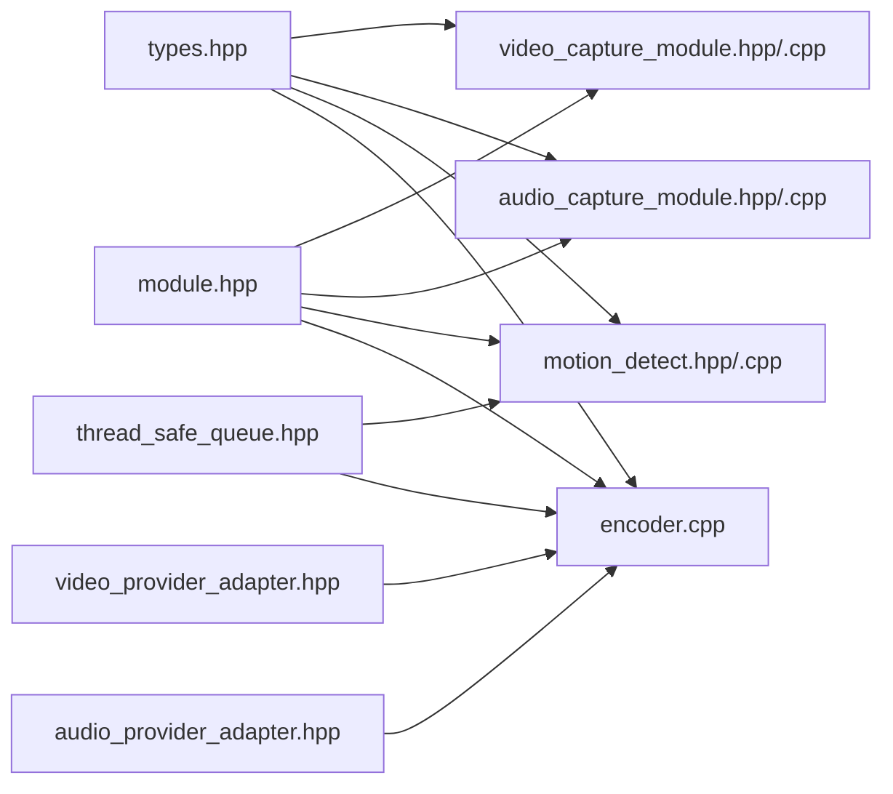

# 数据流架构设计

<cite>
**本文引用的文件**
- [thread_safe_queue.hpp](file://project/agent/src/foundation/include/foundation/thread_safe_queue.hpp)
- [types.hpp](file://project/agent/src/foundation/include/foundation/types.hpp)
- [module.hpp](file://project/agent/src/foundation/include/foundation/module.hpp)
- [video_capture_module.hpp](file://project/agent/src/modules/capture/video/include/capture_video/video_capture_module.hpp)
- [video_capture_module.cpp](file://project/agent/src/modules/capture/video/video_capture_module.cpp)
- [consumer_base.hpp](file://project/agent/src/modules/capture/video/include/capture_video/consumer_base.hpp)
- [audio_capture_module.hpp](file://project/agent/src/modules/capture/audio/include/capture_audio/audio_capture_module.hpp)
- [audio_capture_module.cpp](file://project/agent/src/modules/capture/audio/audio_capture_module.cpp)
- [consumer_base.hpp](file://project/agent/src/modules/capture/audio/include/capture_audio/consumer_base.hpp)
- [motion_detect.hpp](file://project/agent/src/modules/processing/motion_detect/include/processing_motion_detect/motion_detect.hpp)
- [motion_detect.cpp](file://project/agent/src/modules/processing/motion_detect/motion_detect.cpp)
- [encoder_module.hpp](file://project/agent/src/modules/processing/encoder/include/processing_encoder/encoder_module.hpp)
- [encoder.cpp](file://project/agent/src/modules/processing/encoder/encoder.cpp)
- [audio_provider_adapter.hpp](file://project/agent/src/modules/processing/encoder/include/processing_encoder/audio_provider_adapter.hpp)
- [video_provider_adapter.hpp](file://project/agent/src/modules/processing/encoder/include/processing_encoder/video_provider_adapter.hpp)
</cite>

## 目录
1. [引言](#引言)
2. [项目结构](#项目结构)
3. [核心组件](#核心组件)
4. [架构总览](#架构总览)
5. [详细组件分析](#详细组件分析)
6. [依赖关系分析](#依赖关系分析)
7. [性能考虑](#性能考虑)
8. [故障排查指南](#故障排查指南)
9. [结论](#结论)
10. [附录](#附录)

## 引言
本设计文档聚焦 Pi-Guard 系统的数据流架构，系统围绕“生产者-消费者”模式组织，通过线程安全队列在各模块间传递视频、音频与事件数据。文档将详细说明以下内容：
- 视频数据流：从采集到编码再到多消费者分发的完整链路
- 音频数据流：从采集到编码再到多消费者分发的完整链路
- 事件数据流：从运动检测到事件队列的产生与传播
- 生产者-消费者模式与线程安全队列的设计与使用
- 多消费者支持与广播式分发机制
- 数据缓冲、同步与背压处理策略
- 提供数据流图与时序图，帮助理解复杂异步数据处理流程

## 项目结构
Pi-Guard 的 Agent 端采用模块化设计，基础设施层提供通用类型与线程安全队列；采集模块负责音视频原始数据采集；处理模块负责编码与运动检测；外部接入模块负责事件通知与推流。

图表来源
- [types.hpp:1-39](file://project/agent/src/foundation/include/foundation/types.hpp#L1-L39)
- [thread_safe_queue.hpp:1-51](file://project/agent/src/foundation/include/foundation/thread_safe_queue.hpp#L1-L51)
- [module.hpp:1-17](file://project/agent/src/foundation/include/foundation/module.hpp#L1-L17)
- [video_capture_module.hpp:1-22](file://project/agent/src/modules/capture/video/include/capture_video/video_capture_module.hpp#L1-L22)
- [video_capture_module.cpp:1-25](file://project/agent/src/modules/capture/video/video_capture_module.cpp#L1-L25)
- [consumer_base.hpp:1-51](file://project/agent/src/modules/capture/video/include/capture_video/consumer_base.hpp#L1-L51)
- [audio_capture_module.hpp:1-24](file://project/agent/src/modules/capture/audio/include/capture_audio/audio_capture_module.hpp#L1-L24)
- [audio_capture_module.cpp:1-19](file://project/agent/src/modules/capture/audio/audio_capture_module.cpp#L1-L19)
- [consumer_base.hpp:1-61](file://project/agent/src/modules/capture/audio/include/capture_audio/consumer_base.hpp#L1-L61)
- [motion_detect.hpp:1-28](file://project/agent/src/modules/processing/motion_detect/include/processing_motion_detect/motion_detect.hpp#L1-L28)
- [motion_detect.cpp:1-34](file://project/agent/src/modules/processing/motion_detect/motion_detect.cpp#L1-L34)
- [encoder_module.hpp:1-21](file://project/agent/src/modules/processing/encoder/include/processing_encoder/encoder_module.hpp#L1-L21)
- [encoder.cpp:1-606](file://project/agent/src/modules/processing/encoder/encoder.cpp#L1-L606)
- [audio_provider_adapter.hpp:1-29](file://project/agent/src/modules/processing/encoder/include/processing_encoder/audio_provider_adapter.hpp#L1-L29)
- [video_provider_adapter.hpp:1-29](file://project/agent/src/modules/processing/encoder/include/processing_encoder/video_provider_adapter.hpp#L1-L29)

章节来源
- [module.hpp:1-17](file://project/agent/src/foundation/include/foundation/module.hpp#L1-L17)
- [types.hpp:1-39](file://project/agent/src/foundation/include/foundation/types.hpp#L1-L39)

## 核心组件
- 基础数据类型：定义了视频帧、音频帧与事件的结构体，统一时间戳与载荷格式，支撑跨模块数据交换。
- 线程安全队列：提供 push/pop/wait_and_pop 等操作，配合条件变量实现阻塞式等待与单值弹出，满足生产者-消费者同步需求。
- 模块基类：统一模块生命周期管理（启动/停止），为采集、处理与外部接入模块提供一致的抽象。
- 视频/音频采集模块：分别提供视频与音频的采集能力，并通过消费者基类实现同频消费与序列跟踪。
- 运动检测模块：从视频帧队列读取帧，生成事件并写入事件队列。
- 编码器模块：整合音视频编码，支持多消费者广播式分发与背压控制。

章节来源
- [types.hpp:18-36](file://project/agent/src/foundation/include/foundation/types.hpp#L18-L36)
- [thread_safe_queue.hpp:10-48](file://project/agent/src/foundation/include/foundation/thread_safe_queue.hpp#L10-L48)
- [module.hpp:7-14](file://project/agent/src/foundation/include/foundation/module.hpp#L7-L14)
- [video_capture_module.hpp:9-19](file://project/agent/src/modules/capture/video/include/capture_video/video_capture_module.hpp#L9-L19)
- [audio_capture_module.hpp:11-21](file://project/agent/src/modules/capture/audio/include/capture_audio/audio_capture_module.hpp#L11-L21)
- [motion_detect.hpp:12-25](file://project/agent/src/modules/processing/motion_detect/include/processing_motion_detect/motion_detect.hpp#L12-L25)
- [encoder_module.hpp:9-18](file://project/agent/src/modules/processing/encoder/include/processing_encoder/encoder_module.hpp#L9-L18)

## 架构总览
Pi-Guard 的数据流以“采集-处理-输出”为主线，辅以“事件通知”与“外部接入”。整体架构如下：

图表来源
- [video_capture_module.cpp:17-19](file://project/agent/src/modules/capture/video/video_capture_module.cpp#L17-L19)
- [audio_capture_module.cpp:10-13](file://project/agent/src/modules/capture/audio/audio_capture_module.cpp#L10-L13)
- [motion_detect.cpp:22-31](file://project/agent/src/modules/processing/motion_detect/motion_detect.cpp#L22-L31)
- [encoder.cpp:553-583](file://project/agent/src/modules/processing/encoder/encoder.cpp#L553-L583)

## 详细组件分析

### 视频数据流
- 采集：视频采集模块向视频队列推送 VideoFrame。
- 处理：编码器从视频适配器拉取帧，进行缩放与编码，生成编码包。
- 分发：编码器维护多消费者集合，按消费者注册顺序广播编码包，消费者通过 wait_packet(last_seq) 获取增量数据。
- 同步：编码器内部使用互斥锁与条件变量保证线程安全，同时通过队列容量限制实现背压。

图表来源
- [video_capture_module.cpp:17-19](file://project/agent/src/modules/capture/video/video_capture_module.cpp#L17-L19)
- [encoder.cpp:359-420](file://project/agent/src/modules/processing/encoder/encoder.cpp#L359-L420)
- [encoder.cpp:512-522](file://project/agent/src/modules/processing/encoder/encoder.cpp#L512-L522)
- [encoder.cpp:553-583](file://project/agent/src/modules/processing/encoder/encoder.cpp#L553-L583)

章节来源
- [video_capture_module.hpp:9-19](file://project/agent/src/modules/capture/video/include/capture_video/video_capture_module.hpp#L9-L19)
- [consumer_base.hpp:27-34](file://project/agent/src/modules/capture/video/include/capture_video/consumer_base.hpp#L27-L34)
- [video_provider_adapter.hpp:12-26](file://project/agent/src/modules/processing/encoder/include/processing_encoder/video_provider_adapter.hpp#L12-L26)
- [encoder.cpp:359-420](file://project/agent/src/modules/processing/encoder/encoder.cpp#L359-L420)
- [encoder.cpp:512-583](file://project/agent/src/modules/processing/encoder/encoder.cpp#L512-L583)

### 音频数据流
- 采集：音频采集模块向音频队列推送 AudioFrame。
- 处理：编码器从音频适配器批量拉取 PCM 帧，进行重采样与编码，生成编码包。
- 分发：与视频相同，编码器对多消费者广播编码包，消费者通过 wait_packet(last_seq) 获取增量数据。
- 背压：当编码包队列超过容量阈值时，丢弃最老的包，避免内存膨胀。

图表来源
- [audio_capture_module.cpp:10-13](file://project/agent/src/modules/capture/audio/audio_capture_module.cpp#L10-L13)
- [encoder.cpp:422-510](file://project/agent/src/modules/processing/encoder/encoder.cpp#L422-L510)
- [encoder.cpp:512-522](file://project/agent/src/modules/processing/encoder/encoder.cpp#L512-L522)
- [encoder.cpp:553-583](file://project/agent/src/modules/processing/encoder/encoder.cpp#L553-L583)

章节来源
- [audio_capture_module.hpp:11-21](file://project/agent/src/modules/capture/audio/include/capture_audio/audio_capture_module.hpp#L11-L21)
- [consumer_base.hpp:34-43](file://project/agent/src/modules/capture/audio/include/capture_audio/consumer_base.hpp#L34-L43)
- [audio_provider_adapter.hpp:12-26](file://project/agent/src/modules/processing/encoder/include/processing_encoder/audio_provider_adapter.hpp#L12-L26)
- [encoder.cpp:422-510](file://project/agent/src/modules/processing/encoder/encoder.cpp#L422-L510)
- [encoder.cpp:512-583](file://project/agent/src/modules/processing/encoder/encoder.cpp#L512-L583)

### 事件数据流（运动检测）
- 输入：从视频队列弹出 VideoFrame。
- 处理：根据帧内容生成事件（例如 MotionStart），设置时间戳与载荷。
- 输出：将事件写入事件队列，供外部接入模块消费。

图表来源
- [motion_detect.cpp:22-31](file://project/agent/src/modules/processing/motion_detect/motion_detect.cpp#L22-L31)
- [types.hpp:32-36](file://project/agent/src/foundation/include/foundation/types.hpp#L32-L36)

章节来源
- [motion_detect.hpp:12-25](file://project/agent/src/modules/processing/motion_detect/include/processing_motion_detect/motion_detect.hpp#L12-L25)
- [motion_detect.cpp:18-31](file://project/agent/src/modules/processing/motion_detect/motion_detect.cpp#L18-L31)

### 多消费者支持与广播式分发
- 注册与注销：消费者通过 register_consumer()/unregister_consumer() 获取唯一 ID 并加入消费者集合。
- 增量分发：编码器为每个编码包记录序列号，并维护“待处理消费者集合”，消费者通过 last_seq 与 wait_packet(last_seq) 获取增量数据。
- 背压控制：当编码包队列超过容量阈值时，丢弃最老的包，确保系统稳定运行。
- 清理策略：注销消费者后清理其未消费的待处理项，避免悬挂状态。

图表来源
- [encoder.cpp:524-551](file://project/agent/src/modules/processing/encoder/encoder.cpp#L524-L551)
- [encoder.cpp:512-522](file://project/agent/src/modules/processing/encoder/encoder.cpp#L512-L522)
- [encoder.cpp:531-544](file://project/agent/src/modules/processing/encoder/encoder.cpp#L531-L544)
- [encoder.cpp:553-583](file://project/agent/src/modules/processing/encoder/encoder.cpp#L553-L583)

章节来源
- [encoder.cpp:512-583](file://project/agent/src/modules/processing/encoder/encoder.cpp#L512-L583)

### 生产者-消费者模式与线程安全队列
- 视频/音频采集模块：通过线程安全队列向下游模块提供数据，避免显式锁管理。
- 运动检测模块：直接从视频队列弹出单帧进行处理，适合轻量级实时处理。
- 编码器：内部使用互斥锁与条件变量，结合队列容量限制，实现稳定的异步处理与背压控制。

图表来源
- [thread_safe_queue.hpp:13-37](file://project/agent/src/foundation/include/foundation/thread_safe_queue.hpp#L13-L37)
- [motion_detect.cpp:22-25](file://project/agent/src/modules/processing/motion_detect/motion_detect.cpp#L22-L25)

章节来源
- [thread_safe_queue.hpp:10-48](file://project/agent/src/foundation/include/foundation/thread_safe_queue.hpp#L10-L48)
- [motion_detect.hpp:14-23](file://project/agent/src/modules/processing/motion_detect/include/processing_motion_detect/motion_detect.hpp#L14-L23)

## 依赖关系分析
- 类型依赖：所有模块共享基础数据类型，确保跨模块数据一致性。
- 队列依赖：运动检测与编码器均依赖线程安全队列进行数据传递。
- 适配器依赖：编码器通过视频/音频适配器从采集提供者处批量获取帧。
- 模块依赖：编码器模块作为处理中枢，向上游提供统一接口，向下游提供多消费者分发能力。

图表来源
- [types.hpp:1-39](file://project/agent/src/foundation/include/foundation/types.hpp#L1-L39)
- [thread_safe_queue.hpp:1-51](file://project/agent/src/foundation/include/foundation/thread_safe_queue.hpp#L1-L51)
- [module.hpp:1-17](file://project/agent/src/foundation/include/foundation/module.hpp#L1-L17)
- [video_capture_module.hpp:1-22](file://project/agent/src/modules/capture/video/include/capture_video/video_capture_module.hpp#L1-L22)
- [audio_capture_module.hpp:1-24](file://project/agent/src/modules/capture/audio/include/capture_audio/audio_capture_module.hpp#L1-L24)
- [motion_detect.hpp:1-28](file://project/agent/src/modules/processing/motion_detect/include/processing_motion_detect/motion_detect.hpp#L1-L28)
- [encoder.cpp:1-606](file://project/agent/src/modules/processing/encoder/encoder.cpp#L1-L606)
- [video_provider_adapter.hpp:1-29](file://project/agent/src/modules/processing/encoder/include/processing_encoder/video_provider_adapter.hpp#L1-L29)
- [audio_provider_adapter.hpp:1-29](file://project/agent/src/modules/processing/encoder/include/processing_encoder/audio_provider_adapter.hpp#L1-L29)

章节来源
- [module.hpp:1-17](file://project/agent/src/foundation/include/foundation/module.hpp#L1-L17)
- [types.hpp:1-39](file://project/agent/src/foundation/include/foundation/types.hpp#L1-L39)

## 性能考虑
- 编码线程分离：视频与音频分别在独立线程中编码，避免相互阻塞，提升吞吐。
- 批量处理：音频侧采用批量拉取与缓冲，减少上下文切换与系统调用开销。
- 背压控制：编码包队列容量阈值限制，超限丢弃最老包，防止内存持续增长。
- 增量分发：消费者通过 last_seq 与 wait_packet(last_seq) 获取增量数据，降低无效传输。
- 同频消费：采集侧消费者基类提供与采集线程同频的消费模型，减少延迟。

章节来源
- [encoder.cpp:290-296](file://project/agent/src/modules/processing/encoder/encoder.cpp#L290-L296)
- [encoder.cpp:448-509](file://project/agent/src/modules/processing/encoder/encoder.cpp#L448-L509)
- [encoder.cpp:517-522](file://project/agent/src/modules/processing/encoder/encoder.cpp#L517-L522)
- [encoder.cpp:553-583](file://project/agent/src/modules/processing/encoder/encoder.cpp#L553-L583)
- [consumer_base.hpp:34-43](file://project/agent/src/modules/capture/audio/include/capture_audio/consumer_base.hpp#L34-L43)
- [consumer_base.hpp:27-34](file://project/agent/src/modules/capture/video/include/capture_video/consumer_base.hpp#L27-L34)

## 故障排查指南
- 编码初始化失败：检查编解码器是否可用、参数配置是否合理，关注日志中的错误信息。
- 音频采样格式不支持：当前实现仅支持特定采样格式，若上游提供格式不匹配，会清空缓冲并告警。
- 队列溢出与丢包：观察日志中的“packet queue overflow, dropped oldest packet”，适当增大容量或优化下游处理速度。
- 消费者未收到数据：确认消费者已正确注册、last_seq 是否递增、wait_packet 是否被唤醒。
- 运动检测无事件：确认视频队列中有帧可弹出，事件类型与时间戳是否正确设置。

章节来源
- [encoder.cpp:63-66](file://project/agent/src/modules/processing/encoder/encoder.cpp#L63-L66)
- [encoder.cpp:468-471](file://project/agent/src/modules/processing/encoder/encoder.cpp#L468-L471)
- [encoder.cpp:519](file://project/agent/src/modules/processing/encoder/encoder.cpp#L519)
- [motion_detect.cpp:22-31](file://project/agent/src/modules/processing/motion_detect/motion_detect.cpp#L22-L31)

## 结论
Pi-Guard 的数据流架构以线程安全队列为纽带，实现了视频、音频与事件数据的高效流转。通过编码器的多消费者广播与背压控制，系统在保证实时性的同时具备良好的稳定性。采集侧的同频消费模型进一步降低了端到端延迟。建议在实际部署中结合监控指标（队列长度、丢包率、编码延迟）持续优化参数与资源配置。

## 附录
- 关键数据结构与接口路径参考：
  - [VideoFrame/AudioFrame/Event 定义:18-36](file://project/agent/src/foundation/include/foundation/types.hpp#L18-L36)
  - [线程安全队列接口:10-48](file://project/agent/src/foundation/include/foundation/thread_safe_queue.hpp#L10-L48)
  - [模块基类接口:7-14](file://project/agent/src/foundation/include/foundation/module.hpp#L7-L14)
  - [视频采集模块:9-19](file://project/agent/src/modules/capture/video/include/capture_video/video_capture_module.hpp#L9-L19)
  - [音频采集模块:11-21](file://project/agent/src/modules/capture/audio/include/capture_audio/audio_capture_module.hpp#L11-L21)
  - [运动检测模块:12-25](file://project/agent/src/modules/processing/motion_detect/include/processing_motion_detect/motion_detect.hpp#L12-L25)
  - [编码器模块:9-18](file://project/agent/src/modules/processing/encoder/include/processing_encoder/encoder_module.hpp#L9-L18)
  - [视频/音频适配器:12-26](file://project/agent/src/modules/processing/encoder/include/processing_encoder/video_provider_adapter.hpp#L12-L26)
  - [音频适配器:12-26](file://project/agent/src/modules/processing/encoder/include/processing_encoder/audio_provider_adapter.hpp#L12-L26)