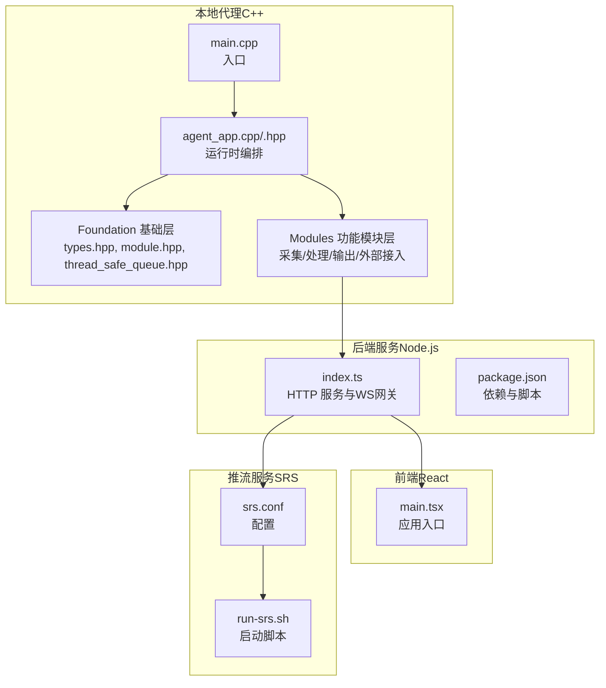
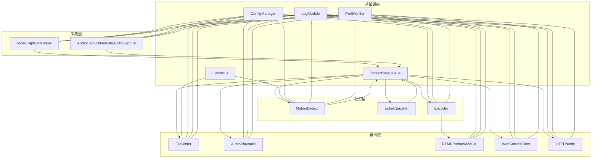
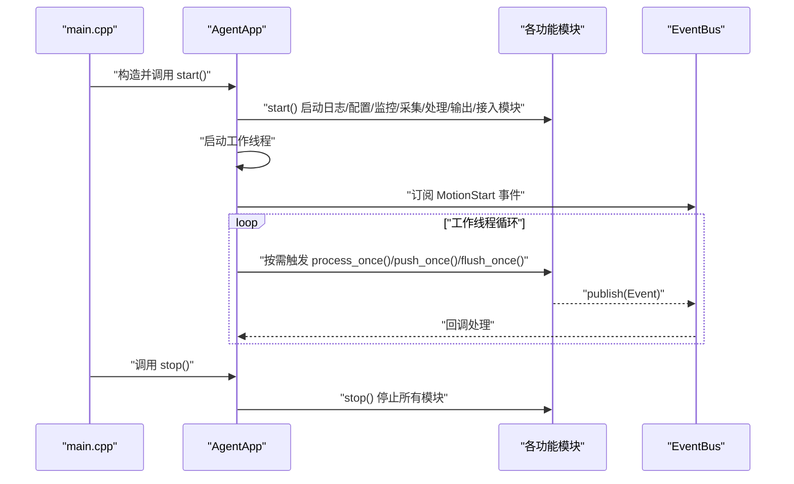
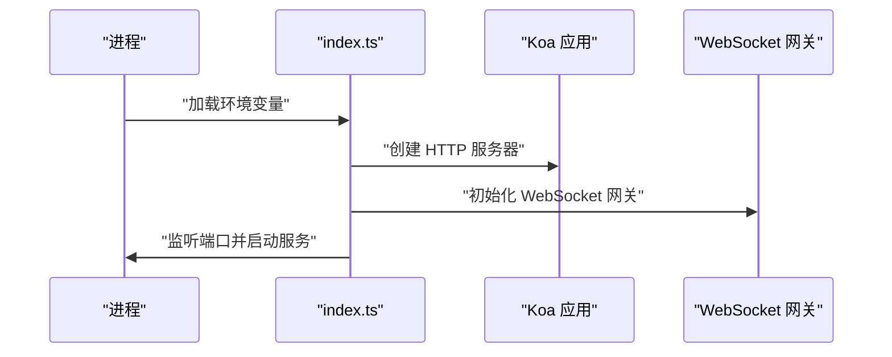
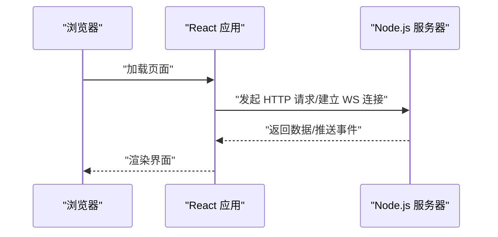
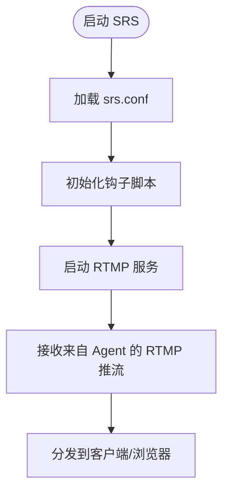
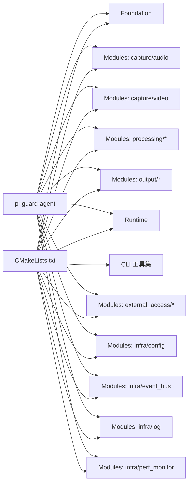

# 整体架构概览

<cite>
**本文引用的文件**
- [project/agent/src/main.cpp](file://project/agent/src/main.cpp)
- [project/agent/src/runtime/app/agent_app.cpp](file://project/agent/src/runtime/app/agent_app.cpp)
- [project/agent/src/runtime/include/agent_app.hpp](file://project/agent/src/runtime/include/agent_app.hpp)
- [project/agent/src/foundation/include/foundation/module.hpp](file://project/agent/src/foundation/include/foundation/module.hpp)
- [project/agent/src/foundation/include/foundation/types.hpp](file://project/agent/src/foundation/include/foundation/types.hpp)
- [project/agent/src/foundation/include/foundation/thread_safe_queue.hpp](file://project/agent/src/foundation/include/foundation/thread_safe_queue.hpp)
- [project/agent/CMakeLists.txt](file://project/agent/CMakeLists.txt)
- [project/server/src/index.ts](file://project/server/src/index.ts)
- [project/server/package.json](file://project/server/package.json)
- [project/web/src/main.tsx](file://project/web/src/main.tsx)
- [project/srs/conf/srs.conf](file://project/srs/conf/srs.conf)
- [project/srs/scripts/run-srs.sh](file://project/srs/scripts/run-srs.sh)
</cite>

## 目录
1. [引言](#引言)
2. [项目结构](#项目结构)
3. [核心组件](#核心组件)
4. [架构总览](#架构总览)
5. [详细组件分析](#详细组件分析)
6. [依赖分析](#依赖分析)
7. [性能考虑](#性能考虑)
8. [故障排查指南](#故障排查指南)
9. [结论](#结论)
10. [附录](#附录)

## 引言
Pi-Guard 是一个围绕本地采集与边缘处理的多媒体安全监控系统，采用模块化分层架构：Foundation 基础层提供通用设施（线程安全队列、事件类型、模块接口等）；Modules 功能模块层包含采集、处理、输出、外部接入等子模块；Runtime 编排层负责应用生命周期管理与线程编排。系统通过 C++ 代理程序完成音视频采集、处理与推送，Node.js 服务器提供 HTTP/WebSocket 接入与服务编排，React 前端提供用户界面，SRS 服务器作为 RTMP 推流服务端。

## 项目结构
系统由四个主要工程组成：
- C++ 代理程序（Agent）：负责采集、处理、存储与推送
- Node.js 服务器（Server）：提供 HTTP 路由与 WebSocket 网关
- React 前端（Web）：提供移动端友好的用户界面
- SRS 服务器（SRS）：提供 RTMP 推流服务

**图表来源**
- [project/agent/src/main.cpp:1-19](file://project/agent/src/main.cpp#L1-L19)
- [project/agent/src/runtime/app/agent_app.cpp:1-138](file://project/agent/src/runtime/app/agent_app.cpp#L1-L138)
- [project/agent/src/runtime/include/agent_app.hpp:1-71](file://project/agent/src/runtime/include/agent_app.hpp#L1-L71)
- [project/agent/src/foundation/include/foundation/types.hpp:1-39](file://project/agent/src/foundation/include/foundation/types.hpp#L1-L39)
- [project/agent/src/foundation/include/foundation/module.hpp:1-17](file://project/agent/src/foundation/include/foundation/module.hpp#L1-L17)
- [project/agent/src/foundation/include/foundation/thread_safe_queue.hpp:1-51](file://project/agent/src/foundation/include/foundation/thread_safe_queue.hpp#L1-L51)
- [project/server/src/index.ts:1-15](file://project/server/src/index.ts#L1-L15)
- [project/server/package.json:1-28](file://project/server/package.json#L1-L28)
- [project/web/src/main.tsx:1-15](file://project/web/src/main.tsx#L1-L15)
- [project/srs/conf/srs.conf](file://project/srs/conf/srs.conf)
- [project/srs/scripts/run-srs.sh](file://project/srs/scripts/run-srs.sh)

**章节来源**
- [project/agent/CMakeLists.txt:1-51](file://project/agent/CMakeLists.txt#L1-L51)
- [project/agent/src/main.cpp:1-19](file://project/agent/src/main.cpp#L1-L19)
- [project/server/src/index.ts:1-15](file://project/server/src/index.ts#L1-L15)
- [project/web/src/main.tsx:1-15](file://project/web/src/main.tsx#L1-L15)
- [project/srs/conf/srs.conf](file://project/srs/conf/srs.conf)

## 核心组件
- Foundation 基础层
  - 模块接口：定义统一的模块生命周期（名称、启动、停止）
  - 类型系统：定义事件类型与帧数据结构（视频/音频）
  - 并发设施：线程安全队列，支持多生产者-多消费者模式
- Modules 功能模块层
  - 采集：音视频采集模块
  - 处理：运动检测、回声消除、编码器适配
  - 输出：文件写入、音频播放
  - 外部接入：HTTP 通知、RTMP 推送、WebSocket 客户端
  - 基础设施：配置管理、事件总线、日志、性能监控
- Runtime 编排层
  - 应用编排：集中管理各模块的启动/停止与线程调度
  - 事件总线：模块间解耦的事件发布/订阅
  - 队列编排：通过线程安全队列实现生产者-消费者流水线

**章节来源**
- [project/agent/src/foundation/include/foundation/module.hpp:1-17](file://project/agent/src/foundation/include/foundation/module.hpp#L1-L17)
- [project/agent/src/foundation/include/foundation/types.hpp:1-39](file://project/agent/src/foundation/include/foundation/types.hpp#L1-L39)
- [project/agent/src/foundation/include/foundation/thread_safe_queue.hpp:1-51](file://project/agent/src/foundation/include/foundation/thread_safe_queue.hpp#L1-L51)
- [project/agent/src/runtime/include/agent_app.hpp:1-71](file://project/agent/src/runtime/include/agent_app.hpp#L1-L71)
- [project/agent/CMakeLists.txt:11-27](file://project/agent/CMakeLists.txt#L11-L27)

## 架构总览
Pi-Guard 采用事件驱动与生产者-消费者模式，通过线程安全队列串联采集、处理与输出链路。Agent 运行时负责模块编排与线程调度；Server 提供 HTTP/WebSocket 接口；Web 前端与 SRS 协同完成实时预览与推流。

**图表来源**
- [project/agent/src/runtime/app/agent_app.cpp:16-63](file://project/agent/src/runtime/app/agent_app.cpp#L16-L63)
- [project/agent/src/runtime/include/agent_app.hpp:45-67](file://project/agent/src/runtime/include/agent_app.hpp#L45-L67)
- [project/agent/src/foundation/include/foundation/thread_safe_queue.hpp:10-48](file://project/agent/src/foundation/include/foundation/thread_safe_queue.hpp#L10-L48)

**章节来源**
- [project/agent/src/runtime/app/agent_app.cpp:16-63](file://project/agent/src/runtime/app/agent_app.cpp#L16-L63)
- [project/agent/src/runtime/include/agent_app.hpp:45-67](file://project/agent/src/runtime/include/agent_app.hpp#L45-L67)

## 详细组件分析

### C++ 代理程序（Agent）
- 启动流程
  - 从入口函数初始化版本信息与运行时应用
  - 启动日志、配置、性能监控、采集、处理、输出与外部接入模块
  - 启动多个工作线程，分别驱动不同模块的周期性处理
- 关键职责
  - 统一编排：集中管理模块生命周期与线程调度
  - 事件总线：订阅运动检测事件并进行日志记录
  - 性能监控：周期性收集 CPU/内存/温度指标
- 线程模型
  - 视频采集线程、音频采集线程、运动检测线程、文件写入线程、通用调度线程
  - 通过线程安全队列实现跨线程数据传递

**图表来源**
- [project/agent/src/main.cpp:6-18](file://project/agent/src/main.cpp#L6-L18)
- [project/agent/src/runtime/app/agent_app.cpp:16-63](file://project/agent/src/runtime/app/agent_app.cpp#L16-L63)
- [project/agent/src/runtime/app/agent_app.cpp:78-126](file://project/agent/src/runtime/app/agent_app.cpp#L78-L126)

**章节来源**
- [project/agent/src/main.cpp:1-19](file://project/agent/src/main.cpp#L1-L19)
- [project/agent/src/runtime/app/agent_app.cpp:16-63](file://project/agent/src/runtime/app/agent_app.cpp#L16-L63)
- [project/agent/src/runtime/app/agent_app.cpp:78-126](file://project/agent/src/runtime/app/agent_app.cpp#L78-L126)

### Node.js 服务器（Server）
- 入口与路由
  - 读取环境变量，创建 HTTP 服务器并挂载 Koa 应用
  - 初始化 WebSocket 网关，监听端口
- 依赖与脚本
  - 使用 Koa 与 Router，开发时使用 ts-node-dev
  - 支持构建与运行脚本

**图表来源**
- [project/server/src/index.ts:1-15](file://project/server/src/index.ts#L1-L15)
- [project/server/package.json:6-11](file://project/server/package.json#L6-L11)

**章节来源**
- [project/server/src/index.ts:1-15](file://project/server/src/index.ts#L1-L15)
- [project/server/package.json:1-28](file://project/server/package.json#L1-L28)

### React 前端（Web）
- 应用入口
  - 创建根节点，注入全局样式与路由
  - 渲染应用组件树
- 与后端交互
  - 通过 HTTP 与 WebSocket 与 Server 通信，实现设备状态查询、控制指令下发与实时预览

**图表来源**
- [project/web/src/main.tsx:1-15](file://project/web/src/main.tsx#L1-L15)

**章节来源**
- [project/web/src/main.tsx:1-15](file://project/web/src/main.tsx#L1-L15)

### SRS 服务器（SRS）
- 配置与启动
  - 提供标准 RTMP 配置文件与启动脚本
  - 与 Agent 的 RTMP 推送模块配合，实现音视频流的实时分发

**图表来源**
- [project/srs/conf/srs.conf](file://project/srs/conf/srs.conf)
- [project/srs/scripts/run-srs.sh](file://project/srs/scripts/run-srs.sh)

**章节来源**
- [project/srs/conf/srs.conf](file://project/srs/conf/srs.conf)
- [project/srs/scripts/run-srs.sh](file://project/srs/scripts/run-srs.sh)

## 依赖分析
- 模块化组织
  - CMake 将基础层、各功能模块与运行时编排分别构建为独立子目录，并在主目标中链接运行时库
- 组件耦合
  - 基础层提供通用类型与并发设施，被所有模块共享
  - 运行时通过统一接口编排模块，降低模块间耦合
- 外部依赖
  - Server 依赖 Koa 与 Router，开发依赖 ts-node-dev
  - Agent 通过 CMake 管理第三方库与模块链接

**图表来源**
- [project/agent/CMakeLists.txt:11-27](file://project/agent/CMakeLists.txt#L11-L27)

**章节来源**
- [project/agent/CMakeLists.txt:1-51](file://project/agent/CMakeLists.txt#L1-L51)

## 性能考虑
- 线程与队列
  - 使用线程安全队列实现生产者-消费者解耦，避免锁竞争与阻塞
  - 工作线程按模块特性设置睡眠间隔，平衡吞吐与延迟
- 模块化与并行
  - 采集、处理、输出模块并行执行，提升整体吞吐
  - 事件总线用于异步通知，减少同步等待
- 监控与可观测性
  - 性能监控模块周期性收集指标，便于定位瓶颈
  - 日志模块提供统一日志入口，便于问题追踪

## 故障排查指南
- 启动失败
  - 检查 Agent 运行时是否成功启动各模块（日志模块、配置管理、性能监控）
  - 核对 Server 端口与环境变量是否正确
- 采集异常
  - 确认采集模块已启动且线程在运行
  - 检查线程安全队列是否有积压或阻塞
- 推流问题
  - 确认 SRS 配置与启动脚本正常
  - 检查 RTMP 推送模块连接状态与网络连通性
- 前端无法连接
  - 检查 WebSocket 网关初始化与端口监听状态
  - 确认跨域与证书配置（如需要）

**章节来源**
- [project/agent/src/runtime/app/agent_app.cpp:16-63](file://project/agent/src/runtime/app/agent_app.cpp#L16-L63)
- [project/server/src/index.ts:10-14](file://project/server/src/index.ts#L10-L14)
- [project/srs/scripts/run-srs.sh](file://project/srs/scripts/run-srs.sh)

## 结论
Pi-Guard 通过 Foundation、Modules、Runtime 三层架构实现了高内聚、低耦合的模块化设计。事件驱动与生产者-消费者模式确保了数据流的顺畅与系统的可扩展性。C++ 代理程序承担本地采集与处理，Node.js 服务器提供统一的接入点，React 前端与 SRS 协同完成实时预览与分发。该架构既满足了资源受限场景下的性能需求，也为后续功能扩展提供了清晰的边界与路径。

## 附录
- 设计原则
  - 分层清晰：基础层抽象、功能层具体实现、运行时统一编排
  - 解耦优先：事件总线与线程安全队列降低模块间耦合
  - 可观测性：日志与性能监控贯穿全链路
  - 可扩展性：模块接口标准化，新增模块仅需遵循统一规范
- 部署建议
  - 将 Agent 与 Server 部署在同一主机以降低网络开销
  - 将 SRS 独立部署于专用主机或容器，保证带宽与稳定性
  - 前端通过 HTTPS 访问，WebSocket 使用 wss 以保障安全