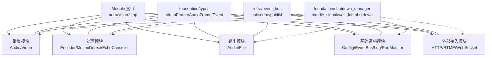
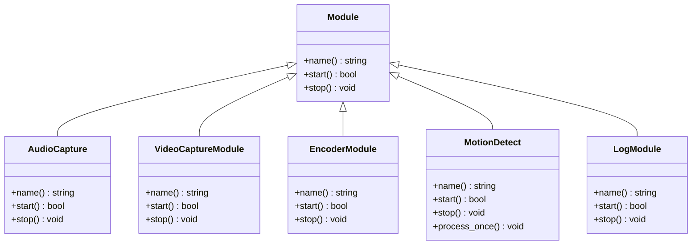
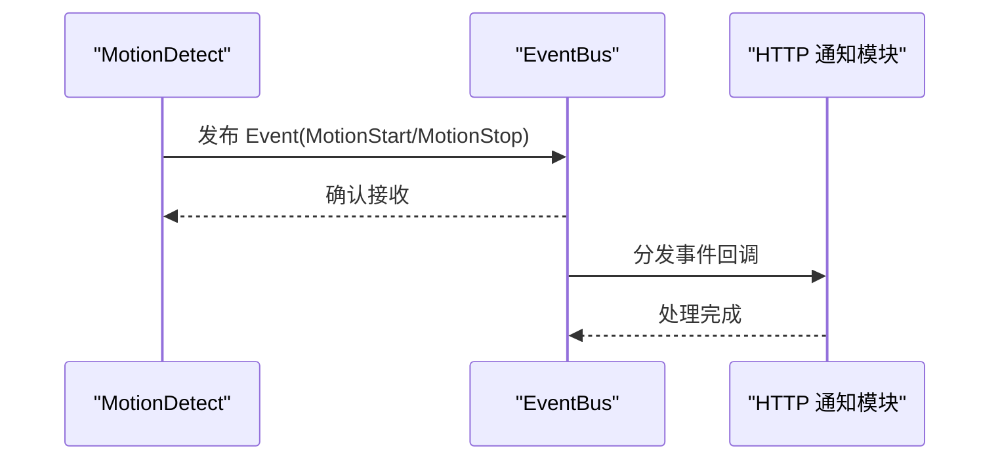
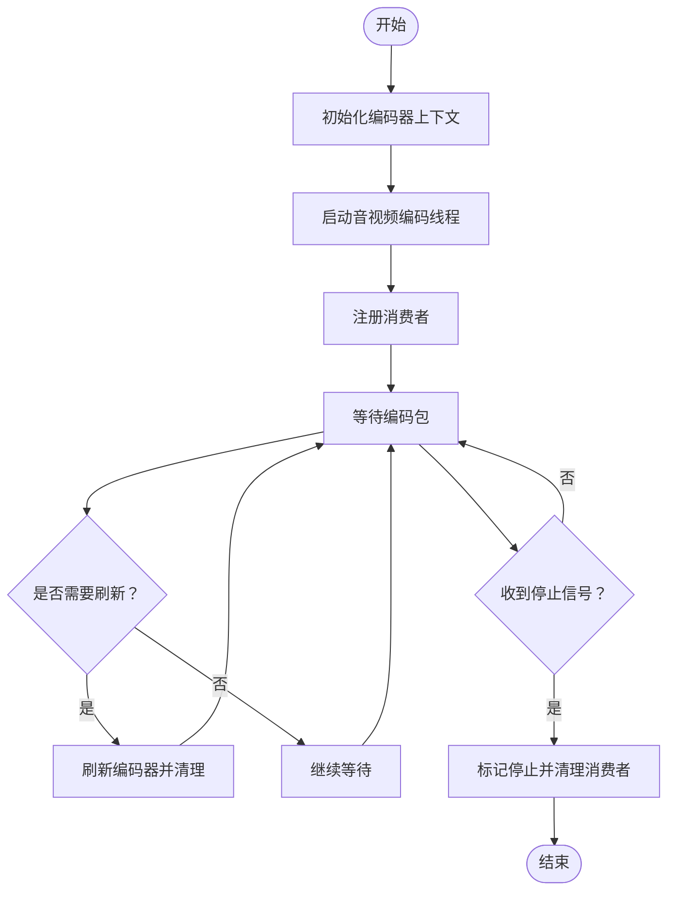
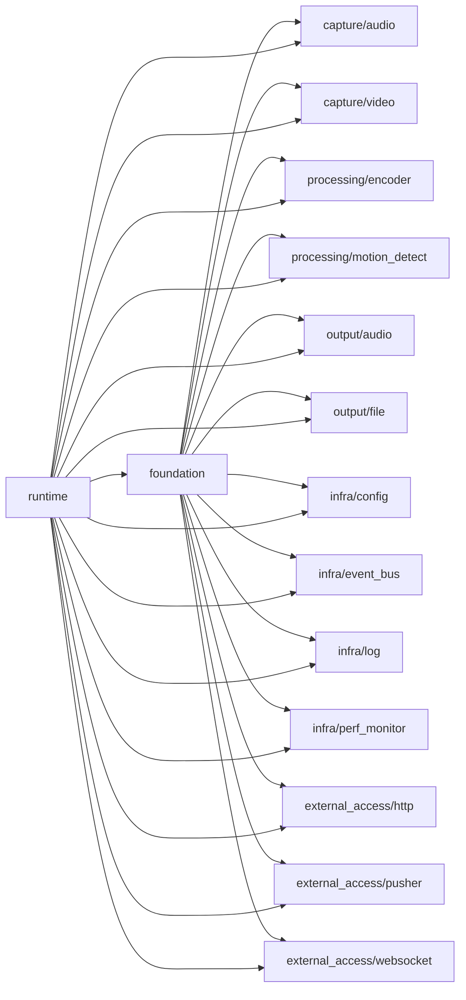

# 模块化设计原则

<cite>
**本文引用的文件**
- [module.hpp](file://project/agent/src/foundation/include/foundation/module.hpp)
- [types.hpp](file://project/agent/src/foundation/include/foundation/types.hpp)
- [shutdown_manager.hpp](file://project/agent/src/foundation/include/foundation/shutdown_manager.hpp)
- [audio_capture_module.hpp](file://project/agent/src/modules/capture/audio/include/capture_audio/audio_capture_module.hpp)
- [video_capture_module.hpp](file://project/agent/src/modules/capture/video/include/capture_video/video_capture_module.hpp)
- [encoder_module.hpp](file://project/agent/src/modules/processing/encoder/include/processing_encoder/encoder_module.hpp)
- [motion_detect.hpp](file://project/agent/src/modules/processing/motion_detect/include/processing_motion_detect/motion_detect.hpp)
- [log_module.hpp](file://project/agent/src/modules/infra/log/include/infra_log/log_module.hpp)
- [event_bus.hpp](file://project/agent/src/modules/infra/event_bus/include/infra_event/event_bus.hpp)
- [encoder.hpp](file://project/agent/src/modules/processing/encoder/include/processing_encoder/encoder.hpp)
- [CMakeLists.txt（根）](file://project/agent/CMakeLists.txt)
- [CMakeLists.txt（foundation）](file://project/agent/src/foundation/CMakeLists.txt)
- [CMakeLists.txt（capture/audio）](file://project/agent/src/modules/capture/audio/CMakeLists.txt)
- [CMakeLists.txt（processing/encoder）](file://project/agent/src/modules/processing/encoder/CMakeLists.txt)
- [CMakeLists.txt（runtime）](file://project/agent/src/runtime/CMakeLists.txt)
</cite>

## 目录
1. [引言](#引言)
2. [项目结构](#项目结构)
3. [核心组件](#核心组件)
4. [架构总览](#架构总览)
5. [详细组件分析](#详细组件分析)
6. [依赖分析](#依赖分析)
7. [性能考虑](#性能考虑)
8. [故障排查指南](#故障排查指南)
9. [结论](#结论)
10. [附录](#附录)

## 引言
本文件系统性阐述 Pi-Guard Agent 的模块化设计原则与实现方式，围绕“能力域独立静态库”的目标，定义 capture、processing、output、infra、external_access 等模块的职责边界与协作关系；说明通过 CMake 目标管理实现的独立构建与链接策略；总结 Module 接口的设计思想与生命周期管理；给出头文件组织与命名空间管理策略，并提供模块扩展指南与最佳实践。

## 项目结构
Pi-Guard Agent 的模块化以“能力域”为单位拆分为多个独立静态库，顶层通过 CMake 统一编排。基础能力位于 foundation，各能力域在 modules 下按子目录划分；runtime 聚合各模块形成运行时库；最终由可执行程序链接 runtime 使用完整功能集。

```mermaid
graph TB
subgraph "顶层"
Root["CMakeLists.txt根"]
Exec["pi-guard-agent 可执行程序"]
end
subgraph "基础层 foundation"
F["pi_guard_foundation 静态库"]
end
subgraph "采集 capture"
CA["pi_guard_audio_capture 静态库"]
CV["pi_guard_video_capture 静态库"]
end
subgraph "处理 processing"
PE["pi_guard_encoder 静态库"]
ME["pi_guard_motion_detect 静态库"]
EC["pi_guard_echo_canceller 静态库"]
end
subgraph "输出 output"
OA["pi_guard_output_audio 静态库"]
OF["pi_guard_output_file 静态库"]
end
subgraph "基础设施 infra"
CFG["pi_guard_config_manager 静态库"]
EB["pi_guard_event_bus 静态库"]
LOG["pi_guard_infra_log 静态库"]
MON["pi_guard_perf_monitor 静态库"]
end
subgraph "外部接入 external_access"
HTTP["pi_guard_http_notify 静态库"]
RTMP["pi_guard_rtmp_pusher 静态库"]
WS["pi_guard_websocket_client 静态库"]
end
subgraph "运行时 runtime"
RT["pi_guard_runtime 静态库"]
end
Root --> F
Root --> CA
Root --> CV
Root --> PE
Root --> ME
Root --> EC
Root --> OA
Root --> OF
Root --> CFG
Root --> EB
Root --> LOG
Root --> MON
Root --> HTTP
Root --> RTMP
Root --> WS
Root --> RT
Root --> Exec
Exec --> RT
RT --> F
RT --> CA
RT --> CV
RT --> PE
RT --> ME
RT --> EC
RT --> OA
RT --> OF
RT --> CFG
RT --> EB
RT --> LOG
RT --> MON
RT --> HTTP
RT --> RTMP
RT --> WS
```

图表来源
- [CMakeLists.txt（根）:1-51](file://project/agent/CMakeLists.txt#L1-L51)
- [CMakeLists.txt（runtime）:1-28](file://project/agent/src/runtime/CMakeLists.txt#L1-L28)

章节来源
- [CMakeLists.txt（根）:1-51](file://project/agent/CMakeLists.txt#L1-L51)
- [CMakeLists.txt（foundation）:1-9](file://project/agent/src/foundation/CMakeLists.txt#L1-L9)
- [CMakeLists.txt（runtime）:1-28](file://project/agent/src/runtime/CMakeLists.txt#L1-L28)

## 核心组件
- Module 接口：统一模块生命周期管理，定义 name/start/stop 三要素，确保模块可发现、可启动、可停止。
- 类型与事件：foundation/types 定义通用数据结构（视频/音频帧、事件类型等），作为跨模块数据契约。
- 关停管理：foundation/shutdown_manager 提供统一信号处理与等待机制，便于优雅退出。
- 事件总线：infra/event_bus 提供线程安全的订阅/发布模型，支撑模块间解耦通信。
- 日志模块：infra/log 提供日志模块化封装，便于在各模块中统一记录。

章节来源
- [module.hpp:1-17](file://project/agent/src/foundation/include/foundation/module.hpp#L1-L17)
- [types.hpp:1-39](file://project/agent/src/foundation/include/foundation/types.hpp#L1-L39)
- [shutdown_manager.hpp:1-12](file://project/agent/src/foundation/include/foundation/shutdown_manager.hpp#L1-L12)
- [event_bus.hpp:1-25](file://project/agent/src/modules/infra/event_bus/include/infra_event/event_bus.hpp#L1-L25)
- [log_module.hpp:1-17](file://project/agent/src/modules/infra/log/include/infra_log/log_module.hpp#L1-L17)

## 架构总览
模块化架构以“foundation 为基、各能力域自足、runtime 聚合、exec 统一入口”的方式组织。模块间通过 Module 接口与事件总线进行松耦合交互；数据流以线程安全队列与事件为载体在模块间传递。

图表来源
- [module.hpp:1-17](file://project/agent/src/foundation/include/foundation/module.hpp#L1-L17)
- [types.hpp:1-39](file://project/agent/src/foundation/include/foundation/types.hpp#L1-L39)
- [event_bus.hpp:1-25](file://project/agent/src/modules/infra/event_bus/include/infra_event/event_bus.hpp#L1-L25)
- [shutdown_manager.hpp:1-12](file://project/agent/src/foundation/include/foundation/shutdown_manager.hpp#L1-L12)

## 详细组件分析

### Module 接口与生命周期
- 设计思想：以最小接口约束模块行为，确保模块具备唯一标识、可启动与可停止能力，便于统一调度与资源回收。
- 生命周期管理：模块启动后进入运行态，停止时释放资源并保证幂等；结合 ShutdownManager 实现统一信号处理与等待。
- 典型实现：
  - 采集模块：AudioCapture、VideoCaptureModule
  - 处理模块：EncoderModule、MotionDetect
  - 基础设施模块：LogModule
  - 外部接入模块：HTTP/RTMP/WebSocket 客户端模块

图表来源
- [module.hpp:1-17](file://project/agent/src/foundation/include/foundation/module.hpp#L1-L17)
- [audio_capture_module.hpp:1-24](file://project/agent/src/modules/capture/audio/include/capture_audio/audio_capture_module.hpp#L1-L24)
- [video_capture_module.hpp:1-22](file://project/agent/src/modules/capture/video/include/capture_video/video_capture_module.hpp#L1-L22)
- [encoder_module.hpp:1-21](file://project/agent/src/modules/processing/encoder/include/processing_encoder/encoder_module.hpp#L1-L21)
- [motion_detect.hpp:1-28](file://project/agent/src/modules/processing/motion_detect/include/processing_motion_detect/motion_detect.hpp#L1-L28)
- [log_module.hpp:1-17](file://project/agent/src/modules/infra/log/include/infra_log/log_module.hpp#L1-L17)

章节来源
- [module.hpp:1-17](file://project/agent/src/foundation/include/foundation/module.hpp#L1-L17)
- [audio_capture_module.hpp:1-24](file://project/agent/src/modules/capture/audio/include/capture_audio/audio_capture_module.hpp#L1-L24)
- [video_capture_module.hpp:1-22](file://project/agent/src/modules/capture/video/include/capture_video/video_capture_module.hpp#L1-L22)
- [encoder_module.hpp:1-21](file://project/agent/src/modules/processing/encoder/include/processing_encoder/encoder_module.hpp#L1-L21)
- [motion_detect.hpp:1-28](file://project/agent/src/modules/processing/motion_detect/include/processing_motion_detect/motion_detect.hpp#L1-L28)
- [log_module.hpp:1-17](file://project/agent/src/modules/infra/log/include/infra_log/log_module.hpp#L1-L17)

### 数据模型与事件总线
- 数据模型：foundation/types 定义 VideoFrame、AudioFrame、Event 等跨模块通用数据结构，确保模块间数据契约稳定。
- 事件总线：infra/event_bus 提供线程安全的订阅/发布接口，支持多处理器模式，模块可通过事件总线解耦通信。
- 使用示例：
  - 运动检测模块通过事件总线发布运动开始/结束事件。
  - 外部接入模块订阅事件并触发 HTTP/RTMP/WebSocket 通知。

图表来源
- [motion_detect.hpp:1-28](file://project/agent/src/modules/processing/motion_detect/include/processing_motion_detect/motion_detect.hpp#L1-L28)
- [event_bus.hpp:1-25](file://project/agent/src/modules/infra/event_bus/include/infra_event/event_bus.hpp#L1-L25)

章节来源
- [types.hpp:1-39](file://project/agent/src/foundation/include/foundation/types.hpp#L1-L39)
- [event_bus.hpp:1-25](file://project/agent/src/modules/infra/event_bus/include/infra_event/event_bus.hpp#L1-L25)
- [motion_detect.hpp:1-28](file://project/agent/src/modules/processing/motion_detect/include/processing_motion_detect/motion_detect.hpp#L1-L28)

### 编码器模块（Processing）
- 设计要点：编码器内部包含独立的音视频编码线程与消费者注册机制，通过条件变量与互斥量协调状态与包队列。
- 关键流程：初始化编码器上下文、启动编码线程、注册消费者、等待编码包、刷新与清理。
- 依赖关系：依赖视频/音频 Provider 适配器与日志模块，链接 FFmpeg 生态库。

图表来源
- [encoder.hpp:1-90](file://project/agent/src/modules/processing/encoder/include/processing_encoder/encoder.hpp#L1-L90)

章节来源
- [encoder.hpp:1-90](file://project/agent/src/modules/processing/encoder/include/processing_encoder/encoder.hpp#L1-L90)

### 采集模块（Capture）
- 音频采集：AudioCapture 通过 ALSA 获取音频帧，写入线程安全队列，供后续模块消费。
- 视频采集：VideoCaptureModule 提供视频采集模块接口，具体实现负责从设备拉取帧。
- 依赖关系：采集模块依赖 foundation 与 infra/log，音频模块额外链接 ALSA。

章节来源
- [audio_capture_module.hpp:1-24](file://project/agent/src/modules/capture/audio/include/capture_audio/audio_capture_module.hpp#L1-L24)
- [video_capture_module.hpp:1-22](file://project/agent/src/modules/capture/video/include/capture_video/video_capture_module.hpp#L1-L22)
- [CMakeLists.txt（capture/audio）:1-21](file://project/agent/src/modules/capture/audio/CMakeLists.txt#L1-L21)

### 基础设施模块（Infra）
- 配置管理：集中式配置加载与更新，供其他模块查询。
- 事件总线：线程安全的事件分发中心。
- 日志模块：统一日志接口与工厂，屏蔽底层实现差异。
- 性能监控：轻量级性能指标采集与上报。

章节来源
- [event_bus.hpp:1-25](file://project/agent/src/modules/infra/event_bus/include/infra_event/event_bus.hpp#L1-L25)
- [log_module.hpp:1-17](file://project/agent/src/modules/infra/log/include/infra_log/log_module.hpp#L1-L17)

### 外部接入模块（External Access）
- HTTP 通知：基于事件总线订阅事件并推送 HTTP 请求。
- RTMP 推流：将编码后的数据推送到 RTMP 服务端。
- WebSocket 客户端：与控制/告警服务建立长连接，实时交互。

章节来源
- [CMakeLists.txt（根）:23-25](file://project/agent/CMakeLists.txt#L23-L25)

## 依赖分析
- 模块内聚：每个能力域模块聚焦单一职责，避免交叉依赖。
- 模块耦合：通过 Module 接口与事件总线实现松耦合；foundation/types 作为公共契约降低耦合度。
- 构建耦合：CMake 层面通过静态库目标与 target_link_libraries 明确依赖链，runtime 聚合所有模块目标。

图表来源
- [CMakeLists.txt（根）:11-27](file://project/agent/CMakeLists.txt#L11-L27)
- [CMakeLists.txt（runtime）:10-27](file://project/agent/src/runtime/CMakeLists.txt#L10-L27)

章节来源
- [CMakeLists.txt（根）:11-27](file://project/agent/CMakeLists.txt#L11-L27)
- [CMakeLists.txt（runtime）:10-27](file://project/agent/src/runtime/CMakeLists.txt#L10-L27)

## 性能考虑
- 线程模型：编码器采用分离的音视频编码线程，配合条件变量与互斥量，减少锁竞争与上下文切换。
- 队列与事件：使用线程安全队列承载帧数据，事件总线支持异步分发，降低阻塞风险。
- 资源管理：模块启动/停止需保证幂等与超时控制，避免资源泄漏与死锁。
- 外设依赖：音频采集依赖 ALSA，编码依赖 FFmpeg 库，需关注缓冲区大小与延迟指标。

## 故障排查指南
- 启动失败：检查模块 start 返回值与日志模块输出，确认外部依赖（ALSA/FFmpeg）是否可用。
- 无数据：核查采集模块是否成功写入队列，处理模块是否正确消费，事件总线订阅是否生效。
- 退出异常：确认 ShutdownManager 是否正确安装信号处理器并等待模块停止。
- 性能问题：评估编码参数与线程池配置，关注队列长度与事件分发延迟。

章节来源
- [shutdown_manager.hpp:1-12](file://project/agent/src/foundation/include/foundation/shutdown_manager.hpp#L1-L12)
- [log_module.hpp:1-17](file://project/agent/src/modules/infra/log/include/infra_log/log_module.hpp#L1-L17)

## 结论
Pi-Guard Agent 的模块化设计以“foundation 基础能力 + 能力域独立静态库 + runtime 聚合 + exec 统一入口”为核心，通过 Module 接口与事件总线实现模块间松耦合协作；借助 CMake 目标管理实现独立构建与链接；以 types 为数据契约保障跨模块一致性。该设计既满足可维护性与可扩展性，又便于测试与部署。

## 附录

### CMake 目标管理与模块独立构建
- 基础层：foundation 仅暴露公共头文件，链接库最小化。
- 能力域：各模块以静态库形式提供，明确 PUBLIC/PRIVATE 头文件路径与链接依赖。
- 运行时：runtime 将所有模块聚合为统一库，exec 仅链接 runtime。
- 示例参考：
  - [CMakeLists.txt（根）:11-27](file://project/agent/CMakeLists.txt#L11-L27)
  - [CMakeLists.txt（foundation）:1-9](file://project/agent/src/foundation/CMakeLists.txt#L1-L9)
  - [CMakeLists.txt（capture/audio）:1-21](file://project/agent/src/modules/capture/audio/CMakeLists.txt#L1-L21)
  - [CMakeLists.txt（processing/encoder）:1-30](file://project/agent/src/modules/processing/encoder/CMakeLists.txt#L1-L30)
  - [CMakeLists.txt（runtime）:1-28](file://project/agent/src/runtime/CMakeLists.txt#L1-L28)

章节来源
- [CMakeLists.txt（根）:11-27](file://project/agent/CMakeLists.txt#L11-L27)
- [CMakeLists.txt（foundation）:1-9](file://project/agent/src/foundation/CMakeLists.txt#L1-L9)
- [CMakeLists.txt（capture/audio）:1-21](file://project/agent/src/modules/capture/audio/CMakeLists.txt#L1-L21)
- [CMakeLists.txt（processing/encoder）:1-30](file://project/agent/src/modules/processing/encoder/CMakeLists.txt#L1-L30)
- [CMakeLists.txt（runtime）:1-28](file://project/agent/src/runtime/CMakeLists.txt#L1-L28)

### 头文件组织与命名空间管理
- 命名空间：以 piguard::<domain>::<module> 的层级命名，清晰表达模块归属。
- 头文件路径：模块头文件置于 include/<domain>_<module>/ 目录下，便于检索与隔离。
- 公共契约：foundation/types 作为跨模块共享的数据结构与枚举定义，避免重复声明。

章节来源
- [types.hpp:1-39](file://project/agent/src/foundation/include/foundation/types.hpp#L1-L39)
- [audio_capture_module.hpp:1-24](file://project/agent/src/modules/capture/audio/include/capture_audio/audio_capture_module.hpp#L1-L24)
- [video_capture_module.hpp:1-22](file://project/agent/src/modules/capture/video/include/capture_video/video_capture_module.hpp#L1-L22)
- [encoder_module.hpp:1-21](file://project/agent/src/modules/processing/encoder/include/processing_encoder/encoder_module.hpp#L1-L21)
- [motion_detect.hpp:1-28](file://project/agent/src/modules/processing/motion_detect/include/processing_motion_detect/motion_detect.hpp#L1-L28)
- [log_module.hpp:1-17](file://project/agent/src/modules/infra/log/include/infra_log/log_module.hpp#L1-L17)

### 模块扩展指南与最佳实践
- 新增模块步骤
  - 在对应能力域下创建模块目录与 include 结构。
  - 实现 Module 接口（name/start/stop），必要时引入事件总线与线程安全队列。
  - 在 CMake 中新增静态库目标，设置 PUBLIC 头文件路径与依赖。
  - 在 runtime 的 CMake 中加入新模块目标，确保 exec 可链接。
- 最佳实践
  - 保持模块单一职责，避免跨域耦合。
  - 使用事件总线进行跨模块通信，减少直接依赖。
  - 对外仅暴露必要的 PUBLIC 头文件，隐藏实现细节。
  - 在 start/stop 中处理资源分配/释放，保证幂等与超时。
  - 使用日志模块统一记录关键事件与错误信息。